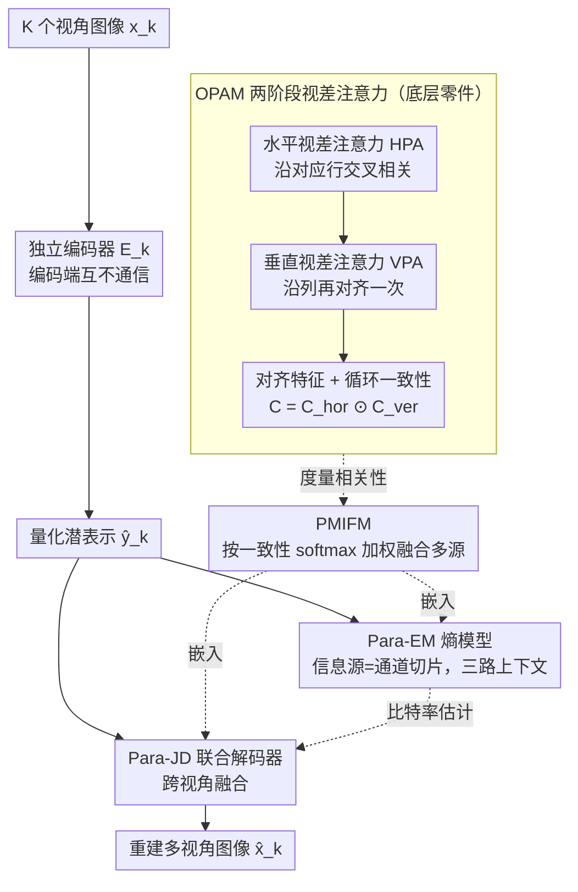

# Parallax to Align Them All: An OmniParallax Attention Mechanism for Distributed Multi-View Image Compression

**会议**: CVPR 2026  
**arXiv**: [2603.03615](https://arxiv.org/abs/2603.03615)  
**代码**: 无  
**领域**: 模型压缩  
**关键词**: 多视角图像压缩, 分布式编码, 视差注意力, 特征融合, 熵模型

## 一句话总结

提出 OmniParallax Attention Mechanism (OPAM) 用于分布式多视角图像压缩（DMIC），通过两阶段视差注意力显式建模任意视角对之间的相关性和对齐特征，构建的 ParaHydra 框架首次让 DMIC 方法显著超越 SOTA MIC 编码器，同时大幅降低计算开销。

## 研究背景与动机

**领域现状**: 多视角图像压缩（MIC）利用视角间冗余提升压缩效率，广泛用于自动驾驶、VR 等领域。分布式 MIC（DMIC）遵循分布式信源编码理论，各视角独立编码、联合解码，无需编码端的跨视角信息。

**现有痛点**: LDMIC 作为首个端到端 DMIC 框架，使用平均池化融合多视角特征，对所有视角一视同仁。这忽略了不同视角之间相关性的差异——重建地板区域时应优先利用地板可见且未被遮挡的视角，而非同等权重地使用被行人遮挡的视角。

**核心矛盾**: 如何准确度量并利用多信息源之间的语义相关性，实现自适应的特征融合而非简单平均。

**本文目标** (1) 高效捕获完整二维空间上下文的视角间相关性；(2) 根据相关性自适应融合多视角特征；(3) 在联合解码器和熵模型中同时利用跨视角信息。

**切入角度**: 从立体匹配中的视差注意力（PAM）出发，PAM 仅沿水平极线计算注意力，作者将其推广到全二维空间——先水平再垂直两阶段完成完整 2D 上下文建模。

**核心 idea**: 通过水平+垂直两阶段视差注意力实现 $O(N^3)$ 复杂度的全 2D 跨视角特征对齐与相关性度量，用于联合解码和熵建模。

## 方法详解

### 整体框架

ParaHydra 要解决的是分布式多视角压缩里"编码端各管各、解码端怎么把多路对齐到一起"的问题。整体怎么转：每个视角图像 $x_k$ 在自己的编码器里独立压成潜表示 $y_k$，编码端之间互不通信；量化后的所有 $y_k$ 一起送进联合解码器 Para-JD，在这里跨视角的特征第一次被对齐、融合，再各自重建出图像；熵编码侧用 Para-EM 把通道上下文、局部空间上下文、全局空间上下文三类先验拼起来给出更准的比特率估计。OPAM 是贯穿 Para-JD 和 Para-EM 的同一块底层零件——无论"对齐哪两路视角"还是"对齐哪两个通道切片"，都靠它来度量相关性、生成对齐特征；它的输出由 PMIFM 包装成"按相关性加权融合"的通用算子，再分别嵌进 Para-JD（融合视角）和 Para-EM（融合通道切片）。整个框架用一个 R-D 损失端到端训。

### 关键设计

**1. OmniParallax Attention Mechanism（OPAM）：把视差注意力从一条极线推广到完整 2D 空间**

立体匹配里的视差注意力（PAM）只沿水平极线找对应点，这对校正过的双目够用，但分布式多视角场景里两个相机的相对位置是任意的，对应点可能在任何行任何列，只扫一条线会漏掉绝大部分上下文。直接上全 2D 自注意力又不行——每个位置都要和另一路的所有位置算相关，复杂度爆到 $O(N^4)$。OPAM 的做法是把 2D 对齐拆成两个 1D 阶段串联：先做水平视差注意力（HPA），让 main source 每个位置只沿 side source 的对应行做交叉相关，得到水平对齐特征 $f_l^{hor}$；再做垂直视差注意力（VPA），在列维度上把刚才水平对齐过的特征再对齐一次。两步走完，一个位置的感受野就覆盖了 side source 的整个 2D 平面，而复杂度被压在 $O(N^3)$。为了知道这次对齐到底可不可信，OPAM 用循环一致性

$$C_l = C_l^{hor} \odot C_l^{ver}$$

把水平和垂直两个方向的一致性逐元素相乘——只有一个位置在两个方向上都稳定对应到同一处，乘出来的 $C_l$ 才高，遮挡或无重叠区域会在某一方向掉链子从而被压低。这个一致性后面会直接当作融合权重的依据。

**2. Parallax Multi Information Fusion Module（PMIFM）：按相关性给视角加权，而不是一视同仁地平均**

LDMIC 融合多视角时用平均池化，所有 side source 等权——重建一块地板时，被行人挡住的视角和地板完全可见的视角贡献一样大，等于把噪声也均匀掺了进来。PMIFM 借 OPAM 的输出来解决这件事：对每个 side source $f_k$，OPAM 给出它的对齐特征 $f_k^t$ 和一致性 $C_k$；把所有 $C_k$ 拼起来过 softmax 得到归一化权重 $W$，再做加权求和

$$f_i^t = \sum_{k \neq i} W_k \cdot f_k^t$$

最后用一个轻量融合网络把这份加权结果和目标视角的原始特征合并。因为权重直接来自 OPAM 度量的对齐可靠度，信息丰富、遮挡少的视角自然拿到更大权重，被遮挡的那路则被压低，相当于把"该信谁"这件事交给数据自己决定。

**3. Parallax Entropy Model（Para-EM）：把同一套相关性度量从视角间搬到通道间**

熵模型这边的痛点和融合那边其实同构：MLIC 等方法把潜表示切成多个通道切片做上下文建模时，对所有切片等权处理，信息量小的切片照样参与，又把噪声引了进来。Para-EM 的关键一步是把 PMIFM 塞进通道上下文模块（PCCM），并把 OPAM 里"信息源"的定义从"视角"重新解释成"通道切片"——于是同一套两阶段视差注意力被拿来度量切片之间的相关性，自适应地聚合而非平均。全局上下文模块（PGCM）也复用 PCCM 先抽出跨切片的全局特征，再叠一层 anchor / non-anchor 注意力。这样通道上下文、局部空间上下文、全局空间上下文三路先验一起喂给熵编码，比特率估计更紧。OPAM 在这里被第二次复用，也印证了它"信息源"这个抽象的通用性——换个对象定义，同一机制就能从视角对齐迁移到通道选择。

### 损失函数 / 训练策略

R-D 损失：$L = \lambda D + R = \lambda \sum_k d(x_k, \hat{x}_k) + \sum_k (R(\hat{y}_k) + R(\hat{z}_k))$。$\lambda$ 取 1024/2048/4096/8192（MSE）或 32/64/128/256（MS-SSIM）。多视角数据集训练 1400 epochs，立体数据集 3000 epochs，学习率 $10^{-4}$，单卡 A30。

## 实验关键数据

### 主实验（BDBR 相对 LDMIC，负值表示省比特率）

| 方法 | InStereo2K(2) | WildTrack(3) | WildTrack(6) | Mip-NeRF 360(3) |
|------|-------|-------|-------|-------|
| VVC | +48.68% | +49.47% | +25.16% | +7.14% |
| MV-HEVC | +84.84% | +31.84% | +10.01% | +41.15% |
| LDMIC | 0% | 0% | 0% | 0% |
| LMVIC | - | - | - | -14.30% |
| **ParaHydra** | **-6.92%** | **-19.72%** | **-24.18%** | **-18.20%** |

### 效率对比（InStereo2K 1024x832）

| 方法 | 编码(s) | 解码(s) | 参数(M) | FLOPs(T) |
|------|---------|---------|---------|----------|
| LDMIC | 9.27 | 21.43 | 214.98 | 2.88 |
| **ParaHydra** | **0.27** | **0.33** | **105.25** | **1.78** |

### 关键发现

- ParaHydra 首次让 DMIC 显著超越 MIC 编码器，在 Mip-NeRF 360(4) 上比 LMVIC 省 34.11% 比特率
- 视角数从 3 增到 6 时，BDBR 增益从 -19.72% 提升到 -24.18%，可扩展性好
- 编码加速 34x、解码加速 65x，参数量减半

## 亮点与洞察

- **两阶段分解思路通用性强**：将 2D 注意力分解为水平+垂直两个 1D 阶段保持 $O(N^3)$，可迁移到多相机 3D 重建、多传感器融合等场景
- **"信息源"概念灵活重定义**：OPAM 不仅用于视角间，还用于通道切片间的上下文建模，机制通用性高

## 局限与展望

- 各视角使用独立编码器，参数量随视角数线性增长
- 循环一致性在严重遮挡或无重叠区域可能失效
- 仅验证固定视角多相机场景，未测试动态视角或大基线变化

## 相关工作与启发

- **vs LDMIC**: 平均池化 → OPAM+PMIFM 自适应融合，BDBR 省 19-24%，效率提升 34-65x
- **vs LMVIC**: LMVIC 依赖编码端 3D 高斯先验（MIC 范式），ParaHydra 作为 DMIC 在 Mip-NeRF 360 上反超

## 评分

- 新颖性: ⭐⭐⭐⭐ OPAM 两阶段分解从 PAM 推广到全 2D 有理论推导
- 实验充分度: ⭐⭐⭐⭐⭐ 4 数据集、多视角数、详细效率和消融分析
- 写作质量: ⭐⭐⭐⭐ 公式推导严谨，框架图清晰
- 价值: ⭐⭐⭐⭐ 首次 DMIC 超越 MIC，对多视角编码有重要意义

<!-- RELATED:START -->

## 相关论文

- [\[CVPR 2026\] Distributed Image Compression with Multimodal Side Information at Extremely Low Bitrates](distributed_image_compression_with_multimodal_side_information_at_extremely_low_.md)
- [\[AAAI 2026\] HCF: Hierarchical Cascade Framework for Distributed Multi-Stage Image Compression](../../AAAI2026/model_compression/hcf_hierarchical_cascade_framework_for_distributed_multi-stage_image_compression.md)
- [\[CVPR 2026\] Frequency Switching Mechanism for Parameter-Efficient Multi-Task Learning](frequency_switching_mechanism_for_parameter-ecient_multi-task_learning.md)
- [\[CVPR 2026\] Differentiable Vector Quantization for Rate-Distortion Optimization of Generative Image Compression](differentiable_vector_quantization_for_rate-distortion_optimization_of_generativ.md)
- [\[CVPR 2026\] MambaSIC: Mamba-based Stereo Image Compression with Bi-directional Multi-reference Entropy Model](mambasic_mamba-based_stereo_image_compression_with_bi-directional_multi-referenc.md)

<!-- RELATED:END -->
