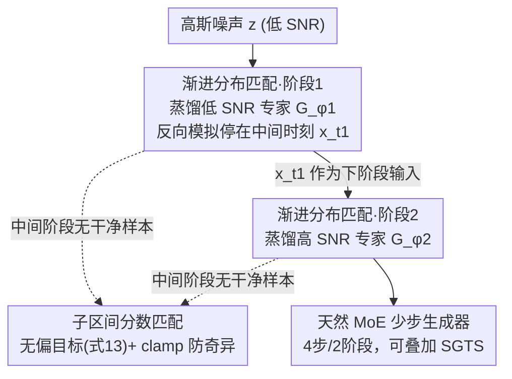

# Phased DMD: Few-step Distribution Matching Distillation via Score Matching within Subintervals

**会议**: CVPR 2026  
**论文**: [CVF Open Access](https://openaccess.thecvf.com/content/CVPR2026/html/Fan_Phased_DMD_Few-step_Distribution_Matching_Distillation_via_Score_Matching_within_CVPR_2026_paper.html)  
**代码**: https://x-niper.github.io/projects/Phased-DMD/  
**领域**: 扩散模型蒸馏 / 模型加速  
**关键词**: 扩散模型蒸馏, 少步生成, 分布匹配蒸馏, SNR 子区间, 混合专家

## 一句话总结
针对「一步 DMD 蒸馏容量不足、多样性差，而直接多步扩展又显存爆炸、用随机梯度截断（SGTS）则退化回一步」的困境，本文提出 Phased DMD：把 SNR 区间切成子区间、每个阶段只蒸馏一个专家并渐进推向更高 SNR（中间阶段在中间时刻而非干净样本处停止），再为「无干净样本」推导出无偏的子区间分数匹配目标，从而天然产出少步 MoE 生成器，在 Qwen-Image-20B、Wan2.2-28B 等大模型上同时改善运动动态、视觉保真和生成多样性。

## 研究背景与动机
**领域现状**：基于变分分数蒸馏（VSD）的步数蒸馏（diff-instruct、DMD、SID 等）能把分数模型蒸馏成单步生成器，且 DMD 不需要与教师采样轨迹一一对应。

**现有痛点**：单步蒸馏模型网络容量有限，多样性下降、在复杂任务（复杂文字渲染、动态场景生成）上掉点。直接把 DMD 扩成多步（few-step）会让计算图深度随步数线性增加、显存开销大、训练不稳，难以扩到大模型和视频。

**核心矛盾**：为了容量和多样性需要多步，但多步反向模拟带来显存与稳定性灾难；现有缓解手段——DMD2/Self-Forcing 的随机梯度截断（SGTS，随机在某步终止、只对最后一步回传梯度）——在 $j=1$ 时会塌缩成一步蒸馏，结果用 SGTS 训出的少步生成器，其多样性和视频运动动态被拉回到一步模型的水平。

**本文目标**：在用梯度截断控住显存的同时，避免一步退化，保住生成多样性和运动动态，实现对大生成模型和视频任务的可扩展蒸馏。

**切入角度**：扩散理论指出在不同信噪比（SNR）下存在无穷多个分数估计器，低 SNR 阶段建结构/动态、高 SNR 阶段修细节；近期工作用 MoE 给不同 SNR 配专家来提容量。作者据此把蒸馏过程按 SNR「分相位」做。

**核心 idea**：用「分阶段、按 SNR 子区间渐进蒸馏」替代「整段一锅炖的多步蒸馏」——每阶段只蒸一个专家、反向模拟停在该阶段对应的中间 SNR 而非干净态，并为中间阶段缺失干净样本的情形推导无偏的子区间训练目标。

## 方法详解

### 整体框架
Phased DMD 把 N 步蒸馏拆成若干阶段，从噪声 $z$（低 SNR）出发逐阶段把生成器推向更高 SNR。第 $k$ 阶段只训练一个专家 $G_{\phi_k}$，它把分布 $p(x_{t_{k-1}})$ 映到 $p(x_{t_k})$；反向模拟 $x_{t_k}=\text{pipeline}_k(z)$ 停在中间时刻 $t_k$（而非干净样本 $x_0$），生成器在该中间时刻最小化反向 KL。由于中间阶段拿不到干净样本，伪分数估计器 $F_{\theta_k}$ 改用「子区间分数匹配」目标训练，每阶段开始时 $F_{\theta_k}$ 从冻结教师 $T_{\hat\theta}$ 初始化。整套流程天然产出一个少步 MoE 生成器（与 Wan2.2 的双专家架构对齐时用 4 步 / 2 阶段），且可与 SGTS 叠加：

### 关键设计

**1. 渐进分布匹配：分阶段把生成器推向更高 SNR，在中间时刻监督以躲开一步退化**

针对「SGTS 会塌缩成一步蒸馏」的痛点，Phased DMD 不再一次蒸出整条轨迹，而是分相位：在每个阶段只蒸馏一个专门负责某 SNR 子区间的专家，逐步推向更高 SNR。关键改动在于反向模拟的终点——前作先生成 $x_0$ 再加噪到 $x_t$，本文把反向模拟改成产出**中间样本** $x_{t_k}=\text{pipeline}_k(z)$，然后按 $s=t_k$ 加噪、$t$ 从子区间 $(t_k,1)$ 采样，第 $k$ 阶段的生成器目标为
$$\nabla_{\phi_k} D_{KL}\approx \mathbb E\big[w_{t|t_k}\big(T_{\hat\theta}(x_t,t)-F_{\theta_k}(x_t,t)\big)\tfrac{dG}{d\phi_k}\big],\quad w_{t|t_k}=\tfrac{\alpha_t\alpha_{t|t_k}}{\alpha_t\sigma_t+\sigma_t^2}.$$
因为中间阶段在 $t_k$ 处就停、不依赖干净态 $x_0$，所以根本不存在 SGTS 那种「$j=1$ 退化成一步」的路径；每阶段只有一步带梯度的采样，显存与单步蒸馏相当。这套渐进思想类比 ProGAN（逐步训练生成器处理更高分辨率），但与「渐进蒸馏」本质不同——后者目标是每相位把采样步数减半。实测把 $t$ 从 $(t_k,1)$（而非 $(t_k,t_{k-1})$）采样更契合这种渐进架构、性能更好。

**2. 子区间分数匹配：为「无干净样本」推导无偏训练目标，保住 DMD 的理论前提**

渐进框架的核心难题是：除最后一相位外，所有阶段都拿不到干净样本 $x_0$，DMD 里训练伪分数模型的标准目标（依赖 $x_0$）失效。DMD 收敛依赖两个假设——A1 伪分数已收敛、A2 伪分数无偏——其中 A2 要求伪/真分数的系数对齐。作者据此推导出在子区间 $t\sim T(s,1)$ 上对扩散模型 $\psi$ 的无偏目标：
$$\mathbb E\Big[\big\|\psi(x_t,t)-\big(\tfrac{\alpha_s^2\sigma_t+\alpha_t\sigma_s^2}{\alpha_s^2\sigma_{t|s}}\epsilon-\tfrac{1}{\alpha_s}x_s\big)\big\|^2\Big].$$
由于 $t\to s$ 时 $\sigma_{t|s}\to 0$ 会出现奇异/数值不稳，最终损失加了 clamp 项 $\text{clamp}(\tfrac{1}{\sigma_{t|s}^2})$（取值限制在 $[0,10]$）防溢出。作者用一个 1D 玩具实验（$x_0\in\{-1,0,1,2\}$、四层 MLP）验证：在子区间 $(0.5,1]$ 上用该无偏目标训练，采样轨迹与全区间标准目标几乎完全重合；而用一个看似合理却错误的目标（$\|\psi(x_t,t)-(\epsilon-x_s)\|^2$）会产生有偏分数估计、违反 A2。每阶段 $F_{\theta_k}$ 在子区间 $(t_k,1]$ 上用此目标训练、并按 DMD2 每更新一次 $G_{\phi_k}$ 就更新 5 次 $F_{\theta_k}$，从而满足无偏假设。这是 Phased DMD 与同样想把 DMD 扩成少步的 TDM 的关键区别——TDM 缺理论支撑，会导致伪流训练不正确。

**3. 天然 MoE 少步生成器：分相位天生产出多专家，并可与 SGTS 叠加进一步省步**

由于每个阶段独立训练一个负责特定 SNR 子区间的专家，Phased DMD **无论教师是否为 MoE，都天然产出一个少步 MoE 生成器**，在不增加推理成本的前提下提升容量。这呼应了「低 SNR 建结构、高 SNR 修细节」的扩散时序特性：低 SNR 阶段把构图/运动结构立起来后冻结该专家，再长时间训练高 SNR 专家精修光照与纹理而不破坏已定的结构布局（图 7 显示延长高 SNR 专家训练只改细节、不动整体构图）。这同时缓解了反向 KL 的 mode-seeking 倾向导致的多样性/运动强度衰减。此外该框架可与 SGTS 结合——在 2 个相位内训出 4 步生成器，简化整体复杂度。

### 损失函数 / 训练策略
数据无关（data-free）蒸馏，无需 GAN 损失或回归损失。实验在 64 张 GPU 上用 FSDP + 梯度检查点、视频任务加 context parallelism；batch size 64，伪分数模型学习率 $4\times10^{-7}$（全参训练），生成器学习率 $5\times10^{-5}$（LoRA，rank=64, $\alpha=8$）；AdamW（$\beta_1=0,\beta_2=0.999$），Euler 求解器做反向模拟，每更新生成器一次更新伪分数模型 5 次；对齐 Wan2.2 双专家用 4 步 / 2 相位。

## 实验关键数据

> 指标说明：**OF**=用 UniMatch 算的平均光流幅度（运动强度，越高越强）；**DD**=VBench 的动态程度（dynamic degree）；**FID/FVD**=蒸馏模型与基座模型之间的图像/视频分布距离（越低越接近基座）；**DINOv3**=同一 prompt 不同种子生成图的 DINOv3 特征平均成对余弦相似度（越低越多样）；**LPIPS**=平均成对感知距离（越高越多样）。

### 主实验（视频生成，蒸馏 Wan2.2-T2V/I2V-A14B，4 步 vs 基座 40 步）
| 任务 | 方法 | OF↑ | DD↑ | FID↓ | FVD↓ |
|------|------|------|------|------|------|
| T2V | 基座 (40 步) | 10.26 | 79.55% | 0.0 | 0.0 |
| T2V | DMD2 | 3.23 | 65.45% | 55.70 | 763.1 |
| T2V | **Phased DMD** | **9.30** | **82.27%** | **47.24** | **700.9** |
| I2V | 基座 (40 步) | 9.32 | 82.27% | 0.0 | 0.0 |
| I2V | DMD2 | 7.87 | 80.00% | 18.45 | 370.0 |
| I2V | **Phased DMD** | **9.84** | **83.64%** | **17.47** | **334.7** |

要点：DMD2 的运动强度（OF 3.23）相对基座（10.26）严重退化，正是 SGTS 一步退化的表现；Phased DMD 把 OF 拉回 9.30、DD 甚至略超基座，FID/FVD 也更接近基座，说明它显著更好地保住了运动动态与生成质量。

### 多样性分析（T2I，同 prompt 8 种子）
| 方法 | Wan2.1 DINOv3↓ | Wan2.1 LPIPS↑ | Wan2.2 DINOv3↓ | Wan2.2 LPIPS↑ |
|------|------|------|------|------|
| 基座 | 0.708 | 0.607 | 0.732 | 0.531 |
| Vanilla DMD | 0.825 | 0.522 | — | — |
| DMD2 | 0.826 | 0.521 | 0.828 | 0.447 |
| **Phased DMD** | **0.782** | **0.544** | **0.768** | **0.481** |

要点：基座多样性最高；Phased DMD 在两个指标上都优于 vanilla DMD 与 DMD2，更好地保住了基座的生成多样性。Qwen-Image 上多样性提升较小，作者归因于该基座本身输出多样性就有限。

### 关键发现
- 运动/多样性的退化根因是 SGTS 的一步退化：Phased DMD 通过「中间阶段不依赖 $x_0$」从机制上消除该路径，故 OF/DD/多样性全面回升。
- 子区间目标的「无偏性」是必需而非可有可无：1D 玩具实验显示用错误目标会产生有偏分数、轨迹偏离，验证了 A2 假设对 DMD 蒸馏的必要性。
- MoE 是分相位的副产品而非额外加参：对已是 MoE 的 Wan2.2-T2V-A14B，标准 DMD 和 Phased DMD 都蒸成两个专家、参数预算相同，性能增益主要来自蒸馏范式而非加参。
- VBench 的部分指标不太可信——它们一致把基座排最低、与人评相反，作者据此对这些指标持保留态度。

## 亮点与洞察
- 把「按 SNR 分相位渐进训练」与「MoE 提容量」两件事缝在一起：每相位一个专家天然就是 MoE，且不增推理成本——这是把 ProGAN 式渐进思想迁到扩散蒸馏的漂亮一招。
- 真正的技术硬核是为「中间阶段无干净样本」补出的无偏子区间分数匹配目标（式 11/13 + clamp），它让分相位在理论上自洽，而不是工程上凑——这也是它甩开同类 TDM 的地方。
- 「中间时刻监督而非干净态监督」可迁移：任何想多步蒸馏又怕显存/一步退化的场景，都可以借「反向模拟停在中间 SNR + 该处算 KL」的思路，把单步带梯度采样的省显存优势和多步容量两者兼得。

## 局限与展望
- 增益依赖基座本身的多样性：对 Qwen-Image 这类输出本就不够多样的基座，多样性提升不明显。
- 主要改善的是结构性方面（构图多样性、运动动态、镜头控制），对纯细节/纹理的增益论文未作为主卖点。
- 训练成本高、规模大（64 GPU、双专家、4 步 2 相位），复现门槛不低；与 SiD 的 Fisher 散度等其他目标的结合、以及引入基座预生成轨迹数据（会牺牲 data-free 优势）均留作未来工作。
- 部分评测依赖 VBench 等指标，作者自陈其可信度存疑，定量评估部分需带 caveat（⚠️ 以原文为准）。

## 相关工作与启发
- **vs 单步 DMD / DMD2**: 它们是单步蒸馏或用 SGTS 的少步蒸馏，会一步退化、丢多样性与运动；本文分相位 + 中间时刻监督，从机制上避免退化，多样性与运动动态显著更好。
- **vs TDM**: 同样把 DMD 扩成少步，但 TDM 缺理论支撑导致伪流训练不正确；本文推导了无 clean 样本下的无偏目标，且天然产 MoE，并用反向嵌套 SNR 区间（TDM 用不相交区间）。
- **vs MoE 扩散模型**: 已有工作给不同 SNR 配专家提容量，本文把这一点直接「蒸」出来——蒸馏过程本身就产出 MoE，无需教师为 MoE。
- **vs ProGAN / 渐进蒸馏**: 借鉴 ProGAN 渐进训练思想（逐步推向更高 SNR），但与渐进蒸馏「每相位步数减半」目标本质不同。

## 评分
- 新颖性: ⭐⭐⭐⭐⭐ 分相位 + 子区间无偏目标 + 天然 MoE 的组合，对 DMD 少步蒸馏是范式级改进。
- 实验充分度: ⭐⭐⭐⭐ 覆盖 T2I/T2V/I2V 与多个大模型、含玩具实验验证理论；但部分指标作者自承可信度存疑、消融多在补充材料。
- 写作质量: ⭐⭐⭐⭐ 动机与理论推导清晰；公式密集、图 1 多子图理解门槛较高。
- 价值: ⭐⭐⭐⭐⭐ 大模型/视频生成的可扩展少步蒸馏有很强实用价值，号称最大规模的扩散蒸馏验证。

<!-- RELATED:START -->

## 相关论文

- [\[CVPR 2026\] Adaptive Video Distillation: Mitigating Oversaturation and Temporal Collapse in Few-Step Generation](adaptive_video_distillation_mitigating_oversaturation_and_temporal_collapse_in_f.md)
- [\[CVPR 2026\] Dataset Distillation by Influence Matching](dataset_distillation_by_influence_matching.md)
- [\[CVPR 2026\] DMGD: Train-Free Dataset Distillation with Semantic-Distribution Matching in Diffusion Models](dmgd_train-free_dataset_distillation_with_semantic-distribution_matching_in_diff.md)
- [\[ICLR 2026\] Distillation of Large Language Models via Concrete Score Matching](../../ICLR2026/model_compression/distillation_of_large_language_models_via_concrete_score_matching.md)
- [\[CVPR 2026\] Beyond Soft Label: Dataset Distillation via Orthogonal Gradient Matching](beyond_soft_label_dataset_distillation_via_orthogonal_gradient_matching.md)

<!-- RELATED:END -->
