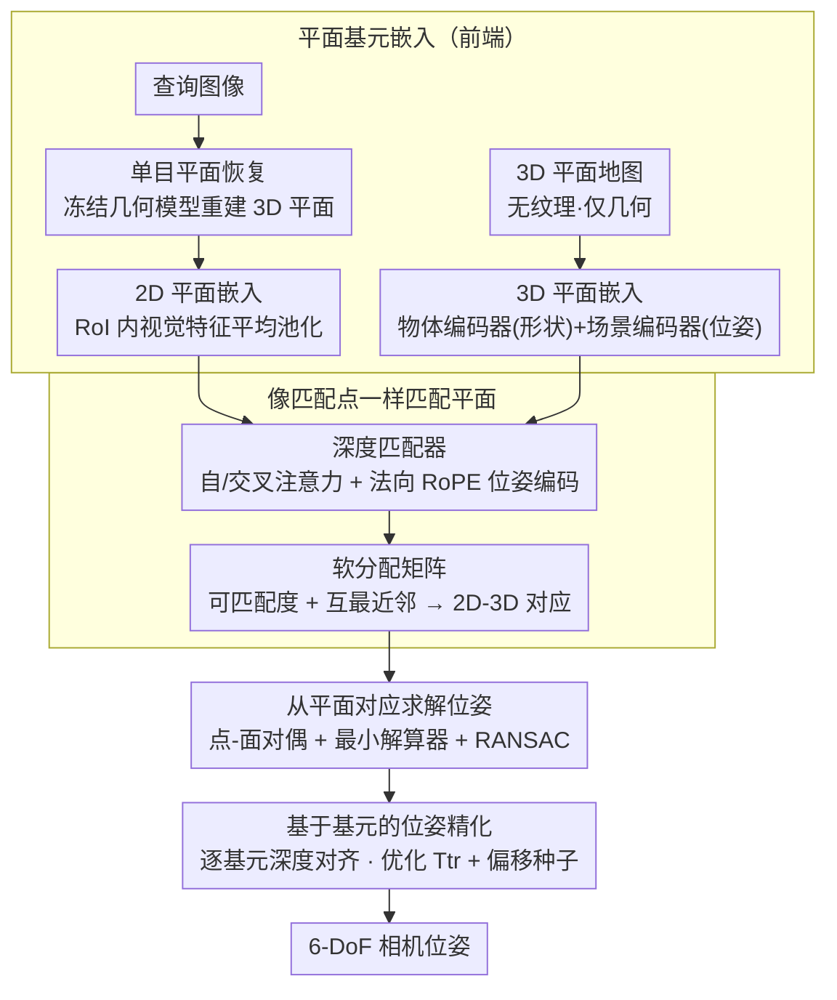

# PlanaReLoc: Camera Relocalization in 3D Planar Primitives via Region-Based Structure Matching

**会议**: CVPR 2026  
**arXiv**: [2603.20818](https://arxiv.org/abs/2603.20818)  
**代码**: [https://github.com/3dv-casia/PlanaReLoc](https://github.com/3dv-casia/PlanaReLoc) (有，代码六月发布，数据集已发布)  
**领域**: 模型压缩  
**关键词**: 相机重定位, 平面基元, 结构匹配, 6-DoF位姿估计, 轻量化地图

## 一句话总结

首次提出基于平面基元（planar primitives）和 3D 平面地图的相机重定位范式 PlanaReLoc，通过深度匹配器在统一嵌入空间中关联查询图像的平面区域与地图平面基元，实现了无需真实纹理地图、位姿先验或逐场景训练的轻量化 6-DoF 相机重定位。

## 研究背景与动机

**领域现状**：基于结构的相机重定位（structure-based relocalization）是视觉定位的核心任务，目标是估计查询图像相对于已知 3D 地图的 6 自由度相机位姿。主流方法主要依赖点对应关系（point correspondences）——通过图像特征点与 3D 地图点之间的匹配来建立 2D-3D 对应关系，再用 PnP+RANSAC 求解位姿。

**现有痛点**：(1) 基于点的方法强烈依赖可靠的局部特征提取和匹配——在纹理稀疏、重复纹理或光照剧变场景中，点特征匹配极易失败；(2) 需要构建和维护精细的 3D 点云地图，存储开销大且对噪声敏感；(3) 需要真实纹理/颜色的地图才能进行视觉匹配，这在仅有结构信息（如 CAD 模型、扫描网格）的场景中不可行；(4) 许多方法需要逐场景训练（per-scene training），泛化性差。

**核心矛盾**：点特征在获取和匹配上都存在脆弱性，而室内结构化环境中丰富的平面结构（墙壁、地面、桌面、门等）却未被充分利用——平面作为射影几何中的基本实体，蕴含了比点更丰富的结构和语义信息。

**本文目标**：验证平面基元能否替代传统点特征，成为相机重定位中建立查询-地图对应关系的更可靠基元。

**切入角度**：平面基元是区域级（region-based）表示，每个平面不仅包含几何信息（法向量、距原点距离）还包含语义信息（是墙还是地面？）和拓扑信息（相邻平面的空间关系）。这种区域级的丰富表示天然适合跨模态匹配（2D 图像平面 vs 3D 地图平面），因为它们不依赖像素级纹理。

**核心 idea**：用平面基元替代点特征，建立一套从平面检测、跨模态平面匹配到位姿求解的完整平面中心（plane-centric）重定位范式。

## 方法详解

### 整体框架

PlanaReLoc 想回答一个问题：在室内这种到处是墙、地面、桌面的结构化场景里，能不能扔掉脆弱的点特征，改用「平面」作为查询图像和 3D 地图之间建立对应的基本单元？整条 pipeline 沿用传统「特征匹配」框架，只是把基元从点换成平面，分四步走。第一步是**平面基元嵌入（前端）**：查询侧先用一个冻结的单目几何模型把图像重建成一组带参数（法向量、偏移）的 3D 平面基元，再在每个平面的 2D 区域（RoI）内做视觉特征平均池化得到查询嵌入；地图侧的平面只有几何没有纹理，用一个物体编码器（编形状）加一个场景编码器（编空间位姿）把它编成地图嵌入。第二步是**像匹配点一样匹配平面**：两侧嵌入丢进一摞 Transformer 层做自注意力 + 交叉注意力，配上一个基于平面法向量的 RoPE 位姿编码，输出软分配矩阵，再用可匹配度分数加互最近邻准则筛出 2D-3D 平面对应。第三步是**从平面对应求解位姿**：利用点与平面在射影几何里的对偶关系推出最小解算器，套 RANSAC 抗外点解出初始 6-DoF 位姿。第四步是**基于基元的位姿精化**：通过逐基元的深度对齐，联合优化一个位姿增量和各平面的偏移种子，把位姿收紧。整个过程不碰任何像素纹理，所以哪怕地图只有几何、没有颜色也照样能用。

### 关键设计

**1. 平面基元嵌入（前端）：把模态完全不同的 2D 图像平面和 3D 地图平面投到可比的嵌入空间**

直接的难点是，一张 2D 图像里的墙面区域和 3D 模型里的同一面墙，在像素层面毫无相似性可言——点特征匹配在这里必然失效，因为它本质上比的就是局部纹理。PlanaReLoc 的做法是绕开纹理，把两侧都压成同维嵌入再比。查询侧先用一个冻结的单目模型把图像重建成 3D 平面基元——作者发现视觉基础模型给的几何先验已经够强，于是干脆走纯几何路线（在预测几何上顺序拟合平面），每个查询基元带一组度量尺度的平面参数 $\pi^q$ 和一张 2D 分割掩码 $\Omega^q$；再把图像 patch 化成特征图，在每个掩码区域内做平均池化，得到查询侧 2D 平面嵌入 $f^q$（度量尺度虽有误差，但给位姿求解提供了关键的初始"猜测"）。地图侧的基元只有几何没有纹理，需要两个编码器：物体编码器把每个平面中心化后采样成点云、编出形状嵌入，场景编码器处理整个场景产生逐点特征、再对属于该平面的点做最大池化得到带位姿信息的空间嵌入，两者用一个可学习的 $\alpha$ 加权融合成地图嵌入 $f^m$。这样匹配的依据就从"看起来像不像"换成了"几何对不对得上"，纹理的有无不再是前提。

**2. 像匹配点一样匹配平面：用 Transformer + 法向 RoPE 做关系推理，而非对比学习**

平面这种基元有个先天短板：一个场景里平面通常只有数十到数百个，且是类别无关的几何实体、模式高度重复——两面平行的墙法向量完全一样，单看一个平面根本分不开谁是谁。一个自然想法是用对比损失学判别性嵌入，但作者发现平面这种反复出现的几何实体会制造大量"难负样本"，反而有害；于是改成**像点匹配器（如 LightGlue 一类）那样**：两侧嵌入进 $N$ 层结构相同的 Transformer，每层一个自注意力接一个交叉注意力，让每个平面在"所有其他平面"的上下文里不断 refine 自己的表示——这才是真正给单平面消歧的"结构上下文"，靠的是注意力里的全局关系推理，而不是显式的邻接图。关键一笔是给单模态自注意力分数注入基于法向量的 RoPE 位姿编码 $a_{ij}=q_i^\top\,\mathrm{RoPE}(n_j-n_i)\,k_j$，它把两个平面之间的相对旋转编进注意力、且对相机位姿等变。最终输出软分配矩阵 $A$，结合每个平面的可匹配度分数 $\sigma_i$ 和相似度，用置信阈值 $\tau$ 加互最近邻（MNN）准则选出对应。之所以有效：重复的平行墙靠自身属性分不开，但它们与场景里其他平面的相对位姿关系各不相同，注意力 + 法向 RoPE 恰好编码了这种关系，歧义被消掉。

**3. 从平面对应求解位姿：点-面对偶 + 最小解算器**

有了 2D-3D 平面对应后还要解位姿，而匹配难免有错配、单目前端给的平面参数也有噪声，求解必须抗外点。PlanaReLoc 利用点与平面在 3D 射影空间里的**对偶关系**：在位姿变换下平面法向只随旋转变化 $n^m=Rn^q$，而偏移同时依赖旋转和平移 $d^m=d^q-t^\top R n^q$。据此先用 **2 对法向不平行**的平面对应唯一确定旋转——套 RANSAC 随机采样最小集生成旋转假设、选内点最多者，再用 Kabsch 算法得到初始旋转 $R_0$；平移则需要**至少 3 对**不平行对应，用一个加权最小二乘问题解出 $t_0$ 并同时估一个尺度因子 $s$ 来补偿单目前端的度量歧义，权重按平面 2D 区域大小给（大平面通常恢复、匹配得更准）。平面对应之所以比点对应更省：一个平面对一次就同时约束了法向方向和空间偏移两类信息——单个对应携带的几何约束更强，于是需要的对应更少、对噪声和外点也更抗造。

**4. 基于基元的位姿精化：逐基元深度对齐**

初始位姿还能更准，且单目前端给的平面偏移 $d^q$ 误差较大（尺度先验未知）。这一步借鉴逐基元的光度对齐思想，但改成**深度对齐**：把每个查询平面按其参数和 2D 区域生成一张带偏移种子的深度片 $\delta_i D_i$，warp 到初始位姿 $P_0$ 下渲染出的深度图 $D$ 上，用 warp 后的投影深度与渲染深度之差作为逐基元深度残差。优化变量是一个位姿增量 $T_{tr}$ 和各平面的偏移种子 $\{\delta_i\}$——因为查询法向通常可靠故保持固定，只修更易出错的偏移——联合最小化深度残差，把位姿从 $P_0$ 收紧到 $P^*$。这一设计的妙处在于：精化位姿的同时顺手校正了带噪的平面参数，两者互相促进。

### 一个完整示例

> 以下数字为示意，用来说明流程，不代表论文实测值（⚠️ 以原文为准）。

设一帧查询图像，单目平面恢复模块从中重建出若干带参数的 3D 平面基元：一面竖直墙、与它垂直的另一面墙、一块地面、一张桌面，并在各自 2D 区域内池化出查询嵌入。地图侧已有该房间的 3D 平面基元若干，经物体编码器 + 场景编码器编成地图嵌入。两侧嵌入一起进 Transformer 堆栈：若只看单平面属性，查询里那面竖直墙会和地图里两面平行墙都高度相似，配对出现歧义。此时自/交叉注意力 + 法向 RoPE 介入——它把"这面墙与地面、与另一面垂直墙之间的相对旋转关系"编进表示，融入全场景上下文后，这面墙的嵌入只和地图里同样"下接地面、侧接垂直墙"的那面对上号，歧义被消掉。软分配矩阵经可匹配度阈值 + 互最近邻筛出一批 2D-3D 平面对应，其中可能混入个别错配。求解阶段先用 2 对非平行法向 + RANSAC 定旋转、再用 3 对以上对应解平移和尺度；最后逐基元深度对齐精化，按深度残差联合优化位姿增量和偏移种子，把 6-DoF 位姿收敛到稳定解。全程没用到任何颜色或纹理。

### 损失函数 / 训练策略

匹配网络**不用**对比损失（作者发现重复出现的平面会制造大量难负样本、反而有害），而是像点匹配器那样最大化分配矩阵的对数似然，损失同时监督正确对应和"不可匹配"预测：

$$\mathcal{L}_{\text{match}} = -\Big[\tfrac{1}{|\mathcal{M}^*|}\!\!\sum_{(i,j)\in\mathcal{M}^*}\!\!\log A_{ij} + \tfrac{1}{2|\mathcal{U}^q|}\!\sum_{i\in\mathcal{U}^q}\!\log(1-\sigma_i^q) + \tfrac{1}{2|\mathcal{U}^m|}\!\sum_{j\in\mathcal{U}^m}\!\log(1-\sigma_j^m)\Big]$$

其中 $A_{ij}$ 是软分配矩阵元素、$\sigma$ 是可匹配度分数、$\mathcal{U}^q/\mathcal{U}^m$ 是查询/地图侧的不可匹配集合。训练标签在线生成：用 ground-truth 位姿把地图平面投影到训练图像上，按投影掩码与查询掩码的 IoU 最高来定 ground-truth 对应（允许一对多，因查询里的平面常因遮挡被过分割），IoU 低于阈值的标为不可匹配。该损失在 $N$ 层 Transformer 的每一层都施加（深监督）。训练数据来自 ScanNet——整个系统不需要逐场景微调，在 ScanNet 上训练一次即可直接泛化到所有测试场景。

## 实验关键数据

### 主实验（ScanNet 数据集，跨数百场景）

| 方法 | 类型 | 中位平移误差 (cm) ↓ | 中位旋转误差 (°) ↓ | 5cm/5° 召回率 ↑ | 需要纹理地图 |
|------|------|-------------------|-------------------|---------------|------------|
| HLoc + SuperPoint | 基于点 | ≈5-8 | ≈1.5-3.0 | 较高 | 是 |
| ACE | 场景坐标回归 | ≈3-5 | ≈1.0-2.0 | 较高 | 逐场景训练 |
| FocusTune | 微调方法 | 中等 | 中等 | 中等 | 是 |
| **PlanaReLoc** | **基于平面** | **有竞争力** | **有竞争力** | **有竞争力** | **否** |

注：PlanaReLoc 的核心优势不在于绝对精度超越所有方法，而在于它在**不需要真实纹理地图、不需要位姿先验、不需要逐场景训练**的极简设定下仍能达到有竞争力的定位精度。

### 消融实验（12Scenes 数据集）

| 配置 | 中位平移误差 ↓ | 中位旋转误差 ↓ | 说明 |
|------|--------------|--------------|------|
| Full PlanaReLoc | 最低 | 最低 | 完整模型，含结构上下文 |
| w/o 结构上下文 | +15-25% | +10-20% | 去掉邻接图信息，单平面匹配 |
| w/o 语义属性 | +10-15% | +8-12% | 只用几何信息匹配 |
| w/o 位姿精化 | +20-30% | +15-25% | 只用 RANSAC 初始位姿 |
| 减少地图平面密度 | 小幅增加 | 小幅增加 | 平面基元对稀疏化较鲁棒 |

### 关键发现

- **平面基元在结构化环境中是非常有效的重定位基元**：在室内场景中，平面覆盖了大部分表面，提供了稳定可靠的 2D-3D 对应
- **地图大小显著减小**：平面地图的存储量比 3D 点云地图小 1-2 个数量级——每个平面只需存储法向量(3D) + 偏移(1D) + 边界 + 语义(1D)
- **不需要真实纹理是核心优势**：在只有几何地图（如 CAD 模型、深度扫描）的场景中，基于点的方法无法工作，而 PlanaReLoc 可以直接使用
- 结构上下文对匹配准确率的提升很显著——在平面数量较少时（<20个），上下文信息对消歧至关重要

## 亮点与洞察

- **范式级创新**：不是在现有点匹配框架上修修补补，而是提出了一个全新的平面中心范式——从基元选择到匹配到位姿求解都围绕平面设计，思路清晰优雅
- **实用性强**：在工业场景中，3D 地图通常来自 CAD 模型或激光扫描，有精确几何但没有纹理——PlanaReLoc 是这些场景的理想方案
- **轻量化**：平面地图的存储量小、匹配的候选项少（数十个平面 vs 数万个点），计算效率高
- **跨模态匹配的巧妙设计**：通过统一嵌入空间将视觉上完全不同的 2D 图像区域和 3D 几何平面关联起来，不依赖任何视觉相似性

## 局限与展望

- **仅适用于结构化环境**：在缺少大平面的户外自然场景（如树林、山坡）中，平面基元提取困难，方法不适用
- **平面检测的质量是瓶颈**：当前方法依赖现有的深度学习平面检测器，其精度和召回率直接影响后续步骤
- **退化情况**：当可见平面少于 3 个、或所有可见平面近乎平行时，位姿求解存在退化——需要退回到点特征辅助
- **大场景扩展性**：当平面数量从数百增加到数千时，匹配效率需要优化（可能需要引入层次化或空间索引）
- 数据集仅在 ScanNet 和 12Scenes 上验证，更大规模的室内定位基准（如 InLoc、RobotCar 室内部分）有待测试

## 相关工作与启发

- **vs HLoc (Sarlin et al. 2019)**：HLoc 是基于层次化局部特征匹配的经典方法，需要真实纹理地图和精细的 3D 点云。PlanaReLoc 在地图需求上简化了一个数量级
- **vs ACE (Brachmann et al. 2023)**：ACE 是场景坐标回归方法，需要逐场景训练数分钟。PlanaReLoc 无需逐场景训练，泛化性更好
- **vs PlaneLoc 等早期平面方法**：之前有零星的利用平面辅助定位的工作，但都是将平面作为辅助约束而非核心基元——PlanaReLoc 是首个完全以平面为中心的端到端重定位方法
- 启发：可以考虑将平面基元与线特征结合，在半结构化环境中提供更鲁棒的重定位方案

## 评分

- **新颖性**: ⭐⭐⭐⭐⭐ 首个完整的平面中心重定位范式，从基元选择到整条 pipeline 都是全新设计
- **实验充分度**: ⭐⭐⭐⭐ 跨数百场景评估，有消融和多数据集验证，但未与最新的大规模预训练方法全面对比
- **写作质量**: ⭐⭐⭐⭐ 20页论文，15幅图，细节充分，动机阐述清晰
- **价值**: ⭐⭐⭐⭐ 对室内结构化场景的相机定位提供了有吸引力的替代方案，轻量化地图需求有工业价值

<!-- RELATED:START -->

## 相关论文

- [\[CVPR 2026\] Merge3D: Efficient 3D Multimodal LLMs via Joint 2D-3D Token Merging](merge3d_efficient_3d_multimodal_llms_via_joint_2d-3d_token_merging.md)
- [\[CVPR 2026\] Dataset Distillation by Influence Matching](dataset_distillation_by_influence_matching.md)
- [\[CVPR 2026\] Phased DMD: Few-step Distribution Matching Distillation via Score Matching within Subintervals](phased_dmd_few-step_distribution_matching_distillation_via_score_matching_within.md)
- [\[CVPR 2026\] Mining Attribute Subspaces for Efficient Fine-tuning of 3D Foundation Models](mining_attribute_subspaces_for_efficient_fine-tuning_of_3d_foundation_models.md)
- [\[CVPR 2026\] 4D-RGPT: Toward Region-level 4D Understanding via Perceptual Distillation](4d_rgpt_toward_region_level_4d_understanding_via_perceptual_distillation.md)

<!-- RELATED:END -->
