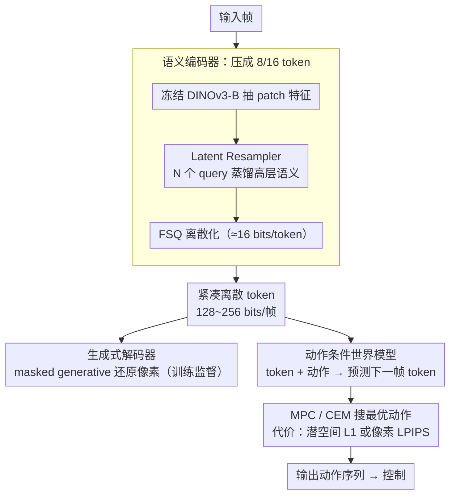

<!-- 由 src/gen_stubs.py 自动生成 -->
# Planning in 8 Tokens: A Compact Discrete Tokenizer for Latent World Model

**会议**: CVPR2026  
**arXiv**: [2603.05438](https://arxiv.org/abs/2603.05438)  
**代码**: [kdwonn/CompACT](https://kdwonn.github.io/CompACT)  
**领域**: 模型压缩 / 世界模型 / 表征学习  
**关键词**: 紧凑离散tokenizer, 世界模型, 潜空间规划, 极端压缩, 语义编码, 生成式解码

## 一句话总结

提出 CompACT，将每张图像压缩至仅 8 个离散 token（约 128 bits），通过冻结预训练视觉编码器保留规划关键语义信息、生成式解码补充感知细节，使基于世界模型的规划速度提升约 40 倍且精度不降。

## 背景与动机

1. **世界模型的规划瓶颈**：现有世界模型（如 NWM）将每帧编码为数百个 token（SD-VAE 需 784 token），Attention 的二次复杂度导致规划延迟高达 3 分钟/episode，无法用于实时控制
2. **token 数量决定计算代价**：在 MPC 规划过程中需要大量前向推理（~1920 次 rollout），token 数直接影响吞吐
3. **重建保真度 ≠ 规划所需**：传统 tokenizer 优先保留纹理、光照等高频细节，但规划任务只需空间布局、物体关系等高层语义
4. **扩散模型的迭代去噪开销**：连续潜空间需要数百步迭代去噪，进一步拖慢规划速度
5. **现有压缩方案的局限**：FlexTok 等 1D tokenizer 虽支持可变长度，但仍以重建保真度为目标，非面向规划优化
6. **信息论下界支持极端压缩**：作者从互信息角度证明，规划充分表征的最低熵为 $H(\mathbf{a}^*)$，远小于 $H(\mathbf{o})$，理论上仅需百余 bit 即可

## 方法详解

### 整体框架

CompACT 要解决世界模型规划太慢的问题：现有方法每帧编几百个 token（SD-VAE 要 784 个），MPC 规划一轮要上千次 rollout，注意力的二次复杂度把单 episode 规划拖到 3 分钟。它的关键判断是"重建保真度 ≠ 规划所需"——规划只要空间布局和物体关系这些高层语义，不需要纹理光照。于是整条流水线分三步：(a) 训练 CompACT tokenizer 把一帧压成 8/16 个离散 token；(b) 在这个极小潜空间里训动作条件世界模型；(c) 测试时用 MPC（CEM 优化）在潜空间搜动作。压到 8 token 也有信息论依据：规划充分表征的最低熵是 $H(\mathbf{a}^*)$，远小于完整观测熵 $H(\mathbf{o})$，理论上百余 bit 就够。

CompACT tokenizer 又拆成编码端（设计 1，把帧压成离散 token）和解码端（设计 2，8 token 重建像素是欠定问题，改用生成式建模补细节），下游的世界模型与规划合为设计 3。三者的数据流如下：

### 关键设计

**1. 语义编码器：冻结视觉基础模型，只蒸馏规划要的语义**

要把一帧压到 8 token 还不丢规划信息，难点在于"只留语义、扔掉低层细节"。CompACT 用冻结的 DINOv3-B 抽 patch 特征（微调反而把 rFID 从 2.40 退化到 5.22，因为微调会破坏已学好的语义抽象），再用一个 Latent Resampler——$N$ 个可学习 query token（$N=8$ 或 $16$）通过 cross-attention 从 DINOv3 输出里蒸馏高层语义，最后用 Finite Scalar Quantization（FSQ，levels $[8,8,8,5,5,5]$，每 token 约 16 bits）离散化，全帧仅 128~256 bits。因为基础模型已经抽掉了低层细节，cross-attention 能拿到的本就只剩语义，"只保留规划关键信息"是天然实现的而非硬约束。

**2. 生成式解码器：8 token 重建像素是欠定问题，改用 masked generative modeling**

8/16 token 信息量太少，直接前馈重建像素是 ill-posed（消融里单步前馈解码 rFID 从 2.40 暴增到 28.80）。CompACT 不直接重建像素，而是以 MaskGIT VQGAN（196 token/帧）为目标 tokenizer，用 masked generative modeling 补回感知细节：训练时随机 mask 目标 token、以 compact token 为条件恢复，损失为 $\mathcal{L}_{\text{tok}} = -\mathbb{E}[\log p(\mathbf{z}^\psi | \mathbf{z}, M(\mathbf{z}^\psi))]$；推理时从全 mask 序列起，按置信度迭代 unmask，省掉了连续潜空间数百步的迭代去噪。

**3. 紧凑潜空间里的动作条件世界模型**

token 压下来后，世界模型直接在 8/16 token 的潜空间上预测下一帧。导航任务用自回归 DiT，配固定长度历史窗口 + 历史 token 随机 mask（diffusion forcing 思想，关掉后 ATE 从 1.330 退化到 1.480）；机器人操作任务用 block-causal transformer 并行预测多帧。世界模型损失 $\mathcal{L}_{\text{world}} = -\mathbb{E}[\log p(\mathbf{z}_{t+1} | \mathbf{z}_t, \mathbf{a}_t, M(\mathbf{z}_{t+1}))]$。规划时 CEM 搜最优动作序列，代价函数可在像素空间（LPIPS）或潜空间（L1）算——后者把延迟从 5.78s 进一步压到 2.15s。

## 实验关键数据

### 重建质量（ImageNet 验证集）

| Tokenizer | 类型 | #tok | rFID↓ | IS↑ |
|---|---|---|---|---|
| SD-VAE | 连续 | 1024 | 0.64 | 223.8 |
| MaskGIT-VQGAN | 离散 | 256 | 1.83 | 186.7 |
| FlexTok | 离散 | 16 | 5.60 | 114.9 |
| **CompACT** | **离散** | **16** | **2.40** | **209.0** |
| **CompACT** | **离散** | **8** | **3.21** | **207.5** |

### 导航规划（RECON 基准）

| Tokenizer | #tok | ATE↓ | RPE↓ | 延迟(s)↓ |
|---|---|---|---|---|
| SD-VAE | 784 | 1.262 | 0.354 | 178.78 |
| FlexTok | 64 | 1.484 | 0.400 | 16.68 |
| FlexTok | 16 | 1.625 | 0.446 | 14.48 |
| **CompACT** | **16** | **1.330** | **0.390** | **5.78** |
| **CompACT** | **8** | **1.373** | **0.401** | **4.83** |

CompACT-16 比 SD-VAE 快 **~31×**，CompACT-8 快 **~37×**，且精度相当。

### 消融实验

- **去掉生成式解码**（单步前馈解码）：rFID 从 2.40 暴增到 28.80
- **解冻 DINOv3 微调**：rFID 退化到 5.22，规划 ATE 从 1.330 退化到 1.472
- **历史 masking**：关闭后 ATE 从 1.330 退化到 1.480
- **潜空间代价函数**：ATE 略降（1.379 vs 1.330），但延迟从 5.78s 降至 2.15s（整体 ~80× over SD-VAE）

### 动作条件视频预测（RoboNet）

| 模型 | #tok | APE↓ | 延迟(s)↓ |
|---|---|---|---|
| MaskGIT-VQGAN | 256 | 0.3383 | 3.826 |
| **CompACT** | **16** | **0.1122** | **0.740** |

APE 降低 3×，速度提升 5.2×，验证紧凑 token 对动作相关信息的保持。

## 亮点

1. **极端压缩比**：8 token / 128 bits 编码一帧，较 SD-VAE 压缩近 100×，且规划精度持平
2. **冻结编码器的反直觉洞察**：不微调 DINOv3 反而更好，微调会使语义退化
3. **信息论支撑**：从互信息角度严格证明规划充分表征的最低信息量远小于完整图像熵
4. **模块化 token 注意力**：每个 token 自发关注语义一致的区域（物体、末端执行器等），无需显式监督
5. **跨骨干泛化**：SigLIP-2、MAE、DINOv3 均有效，方法不依赖特定视觉基础模型

## 局限与展望

1. **闭环操作仅有初步验证**：仅在 RoboMimic Lift 上测试（56% 成功率），缺乏复杂接触和长horizon任务验证
2. **解码器依赖 MaskGIT VQGAN 质量**：最终重建上限受目标 tokenizer 约束
3. **未在大规模自驾/游戏场景验证**：仅覆盖室内导航和桌面操作
4. **无闭环 IDM 集成**：IDM 未利用实时观测和本体感知信息
5. **离散量化的信息损失不可控**：FSQ 的 level 选择目前靠经验，缺乏自适应机制

## 与相关工作的对比

| 方法 | 特点 | 与 CompACT 的区别 |
|---|---|---|
| NWM (Bar et al.) | SD-VAE 784 token + 扩散世界模型 | 延迟高 ~180s，CompACT 快 40× |
| FlexTok | 可变长度 1D tokenizer | 面向重建非规划，同 16 tok 时 rFID 5.60 vs 2.40 |
| IRIS / iVideoGPT | 离散 token + 条件压缩 | 依赖前帧条件，不适合长horizon规划 |
| DINO-WM | DINO 特征做世界模型 | 仍用大量 token，未做极端压缩 |
| TA-TiTok | 32 token 紧凑 tokenizer | 未针对规划优化，无世界模型验证 |

## 评分

- 新颖性: ⭐⭐⭐⭐ — 极端压缩 + 冻结编码器 + 生成式解码的组合设计新颖，信息论分析有理论深度
- 实验充分度: ⭐⭐⭐⭐ — 重建/规划/视频预测/消融齐全，但闭环操作验证偏弱
- 写作质量: ⭐⭐⭐⭐⭐ — 动机-方法-实验逻辑链清晰，Proposition 1 和消融设计精炼
- 价值: ⭐⭐⭐⭐ — 为世界模型实时规划提供了实用路径，40× 加速有工程意义

<!-- RELATED:START -->

## 相关论文

- [\[CVPR 2026\] WPT: World-to-Policy Transfer via Online World Model Distillation](wpt_world-to-policy_transfer_via_online_world_model_distillation.md)
- [\[ICCV 2025\] Bridging Continuous and Discrete Tokens for Autoregressive Visual Generation](../../ICCV2025/model_compression/bridging_continuous_and_discrete_tokens_for_autoregressive_visual_generation.md)
- [\[CVPR 2026\] CORE: Compact Object-centric REpresentations as a New Paradigm for Token Merging in LVLMs](core_compact_object-centric_representations_as_a_new_paradigm_for_token_merging_.md)
- [\[CVPR 2026\] Generative Video Compression with One-Dimensional Latent Representation](generative_video_compression_with_one-dimensional_latent_representation.md)
- [\[AAAI 2026\] CTPD: Cross Tokenizer Preference Distillation](../../AAAI2026/model_compression/ctpd_cross_tokenizer_preference_distillation.md)

<!-- RELATED:END -->
