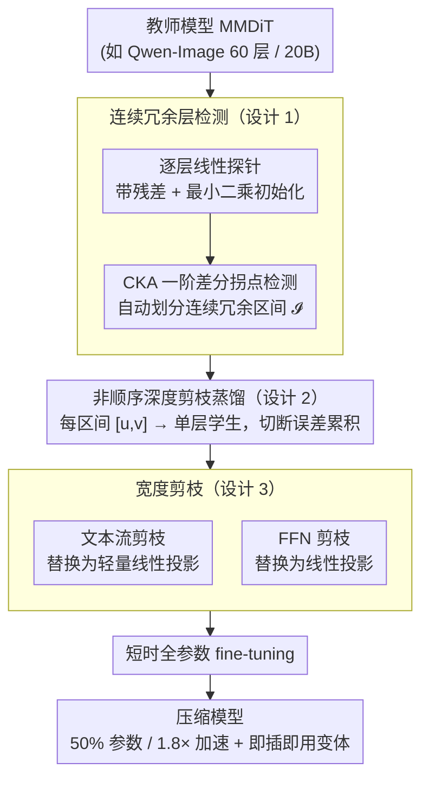

# PPCL: Pluggable Pruning with Contiguous Layer Distillation for Diffusion Transformers

**会议**: CVPR 2026  
**arXiv**: [2511.16156](https://arxiv.org/abs/2511.16156)  
**代码**: [GitHub](https://github.com/OPPO-Mente-Lab/Qwen-Image-Pruning)  
**领域**: 模型压缩 / 扩散模型  
**关键词**: diffusion transformer, structured pruning, contiguous layer redundancy, knowledge distillation, MMDiT

## 一句话总结

提出 PPCL 框架，针对超大规模 Multi-Modal Diffusion Transformer (MMDiT, 8–20B 参数) 设计结构化剪枝方案：通过线性探针 (Linear Probe) 学习每层的可替代性，结合 CKA 一阶差分自动定位连续冗余层区间，再以非顺序交替蒸馏实现深度+宽度双轴剪枝，最终在 Qwen-Image 20B 上实现 50% 参数缩减、1.8× 推理加速，平均性能仅下降 2.61%。

## 研究背景与动机

**领域现状**: 最新的文本到图像 (T2I) 扩散模型已从 UNet 架构全面转向 Multi-Modal Diffusion Transformer (MMDiT)。SDXL 为 2.6B 参数，而 FLUX.1 达 12B、Qwen-Image 达 20B (60 层 MMDiT block)，生成质量大幅提升，但推理成本急剧增加。

**现有痛点**: (a) 已有的结构化剪枝方法 (如 TinyFusion、SnapFusion) 主要面向 UNet 架构，难以直接迁移到 MMDiT 的双流结构；(b) 现有方法逐层独立评估冗余度 (如敏感度分析)，忽略了 DiT 中相邻层之间的功能耦合关系；(c) 传统顺序蒸馏中，早期层的压缩误差沿网络传播并累积，导致学生模型的表示严重偏离教师模型。

**核心矛盾**: 作者通过实验发现 DiT 的冗余呈现**深度连续性**——移除连续的层比移除等量的非连续层对性能的影响更小。现有剪枝方法未利用这一特性。

**本文目标**: 如何系统性识别 MMDiT 中的连续冗余层区间，并设计不累积误差的蒸馏方案实现高压缩比下的质量保持。

**切入角度**: 以"层的可替代性"(substitutability) 替代传统的层重要性评估——若一层的输入-输出映射可被线性变换近似，则该层对其相邻层是功能冗余的。

**核心 idea**: 在 MMDiT 中，冗余层沿深度方向连续分布，可通过线性探针+CKA 差分自动定位并整段移除，配合非顺序蒸馏消除误差累积。

## 方法详解

### 整体框架

PPCL 把超大 MMDiT 的压缩拆成**深度、宽度两条正交的剪枝轴**，再用一套**非顺序蒸馏**把误差累积按住。深度轴先回答"该删哪些层"：为教师模型逐层训练线性探针，用 CKA 一阶差分自动框出**连续冗余层区间** $\mathcal{I} = \{[u_i, v_i]\}$（设计 1），再对每个区间用单层学生独立蒸馏替换（设计 2）。宽度轴在保留下来的层内部继续瘦身：把跨层高度相似的文本流（text stream）和过参数化的 FFN 替换为轻量线性投影（设计 3）。三者都跑完后，做一次短时全参数 fine-tuning 收尾，得到 50% 参数、1.8× 加速的压缩模型；又因每个深度区间独立训练，推理时可自由启用/跳过区间，无需重训即可得到不同参数量的"即插即用"变体。

### 关键设计

**1. 连续冗余层检测：用线性探针量化"可替代性"，CKA 差分自动框区间**

深度剪枝的第一步是判断"哪些层可以整段删掉"。PPCL 不沿用传统的逐层重要性/敏感度评估，而是把"可替代性"(substitutability) 当作冗余度的核心标准——如果一层的输入→输出映射能被一个线性变换近似，它对相邻层就是功能冗余的。为此作者给教师模型每层 $T_i$ 配一个**带残差结构的线性探针** $l_i$：先用最小二乘闭合解 $W_i^* = (T_i(T_{i-1}^D) - T_{i-1}^D)(T_{i-1}^D)^\top(T_{i-1}^D(T_{i-1}^D)^\top)^{-1}$ 初始化，再用对齐损失 $\mathcal{L}_{fit}(i) = \|l_i(T_{i-1}^D) + T_{i-1}^D - T_i(T_{i-1}^D)\|_2^2$ 微调。这样每个探针的训练输入都和对应层的真实输入一致，层与层之间评估互不干扰，且一次训练就覆盖所有层。

光知道单层能否被线性近似还不够，关键是**连续多层**能否被一并替换。作者利用"有限个线性变换叠加仍是线性"这一性质，在校准集上用线性探针替换连续层构造代理模型，计算其输出与教师层输出的 CKA 相似度，并定义一阶差分 $\Delta(u,k) = -(\text{cka}(u,k) - \text{cka}(u,k-1))$。从起点 $u$ 不断向后吞并层，$\Delta$ 会先减后增——这个拐点 $v$ 就标志着该连续冗余区间的右端点。用差分拐点而非固定阈值，能让每段区间的长度自适应地由数据决定，而不是人为拍一个分界。

**2. 非顺序深度剪枝蒸馏：切断误差累积链**

框出区间后，每个连续冗余区间 $[u,v]$ 都用一个**单层学生** $S^u$ 来替代。难点在于传统顺序蒸馏会累积误差：学生第 $k$ 层吃的是学生自己第 $k-1$ 层的输出，早期层的压缩偏差会沿网络一路放大，越往后偏离教师越严重。PPCL 的"非顺序"(teacher-student alternating) 做法是让每个区间**直接从教师取输入**——学生层 $S^u$ 接收教师第 $u-1$ 层的输出 $T_{u-1}^D$，去对齐教师第 $v$ 层的输出 $T_v^D$，损失 $\mathcal{L}_{depth}^{[u,v]} = \|\text{Norm}(S^u(T_{u-1}^D)) - \text{Norm}(T_v^D)\|_2^2$（Norm 为 L2 归一化，强调方向对齐）。这样每个区间在干净的教师输入上独立优化，误差不再跨区间传播。消融显示，仅这一项就把性能下降从 14.5% 砍到 5.22%，比冗余检测本身贡献还大。区间独立训练还带来**即插即用**特性：推理时把某些学生层换回原教师层，就能从一个 10B 模型直接派生出 12B / 14B 变体，无需任何重训。

**3. 宽度剪枝：压缩文本流与 FFN**

深度剪枝减的是层数，但保留下来的层内部仍有大量宽度冗余，PPCL 从两处下手。其一是**文本流剪枝**：CKA 热力图显示 MMDiT 的文本流 token 跨层相似度高、层间变化小，于是把冗余层文本流（除 QKV 投影外）整体替换为两个轻量线性投影 $l_p^z$ 和 $l_p^h$。其二是**FFN 剪枝**：FFN 普遍过参数化，作者测量"用线性投影替代 FFN"的 MSE，对那些误差极小的层把 FFN 换成线性投影 $l_q^{img}$ 和 $l_q^{txt}$。宽度蒸馏损失同样分两部分——与深度蒸馏格式一致的层级对齐损失 $\mathcal{L}_{width}^j$，加上约束投影输出逼近教师中间表示的线性投影对齐损失 $\mathcal{L}_{linear}^j$。有意思的是，这一步在减参数的同时反而能提点（+WP-text 减 1B 参数、平均性能从 0.848 升到 0.860），因为新引入的可训练线性层补上了部分层原本对齐不足的缺口。

### 训练策略

- **数据**: 从 LAION-2B-en 采样 10 万张图，用 Qwen2.5-VL 生成精细描述
- **训练三阶段**: 深度剪枝 6k steps → 宽度剪枝 2k steps → 全参数 fine-tuning 1k steps (8 × H20 GPU)
- **优化器**: AdamW ($\beta_1$=0.9, $\beta_2$=0.95, weight decay=0.02)，BF16 混合精度 + 梯度检查点

## 实验关键数据

### 主实验：FLUX.1-dev 上的对比

| 方法 | 参数(B) | 显存(%) | 延迟(ms) | DPG↑ | GenEval↑ | B-VQA↑ | UniDet↑ | 平均下降(%)↓ |
|---|---|---|---|---|---|---|---|---|
| Base model | 12 | 100 | 715 | 83.8 | 0.665 | 0.640 | 0.426 | 0 |
| TinyFusion | 8 | 74.4 | 534 | 77.2 | 0.511 | 0.584 | 0.369 | 13.80 |
| HierarchicalPrune | 8 | 74.4 | 543 | 75.7 | 0.503 | 0.579 | 0.371 | 13.38 |
| Dense2MoE | 12 | 100 | 312 | 73.6 | 0.403 | 0.473 | 0.311 | 21.52 |
| FLUX.1 Lite | 8 | 78.8 | 572 | 82.1 | 0.623 | 0.547 | 0.379 | 6.09 |
| Chroma1-HD | 8.9 | 82.5 | 1714 | 84.0 | 0.593 | 0.621 | 0.339 | 1.02 |
| **PPCL(8B)** | **8** | **74.4** | **535** | **80.0** | **0.605** | **0.615** | **0.391** | **4.03** |
| **PPCL(6.5B)** | **6.5** | **69.2** | **428** | **81.2** | **0.593** | **0.581** | **0.398** | **0.07** |

### 主实验：Qwen-Image 上的对比

| 方法 | 参数(B) | 显存(%) | 延迟(ms) | DPG↑ | GenEval↑ | LongText-EN↑ | LongText-ZH↑ | 平均下降(%)↓ |
|---|---|---|---|---|---|---|---|---|
| Base model | 20 | 100 | 2625 | 88.9 | 0.870 | 0.943 | 0.946 | 0 |
| TinyFusion(14B) | 14 | 79.4 | 1789 | 80.7 | 0.739 | 0.859 | 0.857 | 8.75 |
| HierarchicalPrune(14B) | 14 | 79.4 | 1786 | 83.3 | 0.766 | 0.884 | 0.881 | 6.49 |
| **PPCL(14B)** | **14** | **79.4** | **1792** | **87.9** | **0.847** | **0.929** | **0.946** | **0.42** |
| **PPCL(12B)** | **12** | **71.4** | **1514** | **83.6** | **0.801** | **0.893** | **0.917** | **3.03** |
| **PPCL(10B+FT)** | **10** | **66.9** | **1462** | **86.7** | **0.828** | **0.902** | **0.931** | **3.29** |

### 消融实验 (Qwen-Image, 均剪枝至 ~10-12B)

| 配置 | LongText↑ | DPG↑ | GenEval↑ | 平均 | 参数(B) | 平均下降(%)↓ |
|---|---|---|---|---|---|---|
| Original (20B) | 0.942 | 0.885 | 0.854 | 0.894 | 20 | 0 |
| Baseline (CKA+顺序蒸馏) | 0.625 | 0.763 | 0.728 | 0.706 | 12 | 18.2 |
| +LP (线性探针) | 0.712 | 0.795 | 0.776 | 0.761 | 12 | 14.5 |
| +LP-a (CKA 阈值替代差分) | 0.664 | 0.778 | 0.712 | 0.718 | 12 | 19.7 |
| +LP-b (扩大区间上界) | 0.678 | 0.769 | 0.731 | 0.726 | 12 | 18.8 |
| +DP (非顺序蒸馏) | 0.905 | 0.836 | 0.801 | 0.848 | 12 | 5.22 |
| +WP-text (文本流剪枝) | 0.915 | 0.846 | 0.819 | 0.860 | 11 | 3.79 |
| +WP-ffn (FFN 剪枝) | 0.906 | 0.835 | 0.809 | 0.850 | 10 | 4.91 |
| +Fine-tuning | 0.916 | 0.867 | 0.828 | 0.870 | 10 | 2.61 |

### 关键发现

- **连续 vs 非连续移除**: 在 Qwen-Image 60 层模型上移除 1–3 层时，连续移除的生成质量一致优于非连续移除，证实了冗余的深度连续性假设
- **非顺序蒸馏提升巨大**: 从+LP 的 14.5% 下降降至 +DP 的 5.22%，仅引入非顺序蒸馏就带来 ~9 个百分点的改善
- **宽度剪枝"减参数反而升指标"**: +WP-text 在减少 1B 参数的同时，平均性能反而从 0.848 提升至 0.860，原因是额外的可训练线性层改善了部分层对齐不足的问题
- **即插即用性**: PPCL(14B) 和 PPCL(12B) 无需额外训练，直接由 10B 模型替换部分学生层为教师层即可获得
- **在已剪枝模型上再剪枝**: 对 FLUX.1 Lite (8B) 再剪枝至 6.5B，平均性能下降仅 0.07%

## 亮点与洞察

- **连续冗余是 DiT 的固有特性**: 与 CNN 中冗余分散分布不同，MMDiT 的相邻层在表示空间中做平滑过渡，形成可整段移除的功能单元。这一发现为 DiT 的剪枝提供了全新范式
- **线性探针作为可替代性度量**: 相比直接移除层评估敏感度，线性探针能更稳定地量化层间的线性可近似程度，且仅需一次训练即可处理所有层
- **非顺序蒸馏是关键**: 消融实验显示，非顺序蒸馏比冗余层检测方法本身贡献更大 (9pp vs 3.7pp)，证明切断误差累积链是高压缩比下保持质量的核心
- **双轴压缩的互补性**: 深度剪枝减少层数、宽度剪枝减少保留层内的参数，两者正交且可叠加，联合使用实现 50% 压缩

## 局限与展望

- CKA 一阶差分的拐点检测缺乏严格理论基础，作者承认这主要是成功的工程启发式方法
- INT4 量化在 PPCL 剪枝后效果不佳——剪枝降低了网络冗余度，收窄了量化容错空间，剪枝+量化的联合优化有待研究
- 训练仍需 8 × H20 GPU，对于更大规模模型 (如 100B 级) 的可扩展性待验证
- 宽度剪枝中哪些层属于 $\mathcal{R}_{txt}$ 和 $\mathcal{R}_{ffn}$ 的选择策略细节在附录中，主文描述有限

## 相关工作与启发

- **vs TinyFusion**: TinyFusion 使用可微分门控参数识别可移除层，但逐层独立评估忽视连续性，且采用标准(顺序)蒸馏导致误差累积。在 FLUX.1 和 Qwen-Image 上 PPCL 平均下降 4.03% / 0.42%，远优于 TinyFusion 的 13.80% / 8.75%
- **vs HierarchicalPrune**: HPP 的层重要性评估偏粗糙，生成结果出现视觉 artifacts；PPCL 在相同压缩比下优势明显 (0.42% vs 6.49%)
- **vs Dense2MoE**: Dense2MoE 用 MoE 替换 FFN 来降低激活成本但不减参数量，且平均下降达 21.52%，说明单纯替换子结构不如系统性剪枝+蒸馏
- **vs Chroma1-HD**: Chroma1-HD 在 FLUX.1 上平均下降最低 (1.02%) 但推理延迟反增至 2.4 倍，不满足加速需求

## 评分

- 新颖性: ⭐⭐⭐⭐ 连续冗余假设经实验充分验证，线性探针+CKA 差分的自动区间检测和非顺序蒸馏都是有效创新
- 实验充分度: ⭐⭐⭐⭐ 在 FLUX.1 和 Qwen-Image 两个主流 MMDiT 上验证，消融实验细致地拆解了每个组件的贡献
- 写作质量: ⭐⭐⭐⭐ 方法动机阐述清晰，从观察→假设→设计的逻辑链完整
- 价值: ⭐⭐⭐⭐⭐ 直击 20B 级 DiT 部署瓶颈，50% 压缩+1.8× 加速的工程价值极高，即插即用特性进一步提升实用性

<!-- RELATED:START -->

## 相关论文

- [\[CVPR 2026\] BinaryAttention: One-Bit QK-Attention for Vision and Diffusion Transformers](binaryattention_one-bit_qk-attention_for_vision_and_diffusion_transformers.md)
- [\[CVPR 2026\] HiAP: A Multi-Granular Stochastic Auto-Pruning Framework for Vision Transformers](hiap_a_multi-granular_stochastic_auto-pruning_framework_for_vision_transformers.md)
- [\[AAAI 2026\] Distillation Dynamics: Towards Understanding Feature-Based Distillation in Vision Transformers](../../AAAI2026/model_compression/distillation_dynamics_towards_understanding_feature-based_di.md)
- [\[CVPR 2026\] Adversarial Concept Distillation for One-Step Diffusion Personalization](adversarial_concept_distillation_for_one-step_diffusion_personalization.md)
- [\[CVPR 2025\] Q-DiT: Accurate Post-Training Quantization for Diffusion Transformers](../../CVPR2025/model_compression/q-dit_accurate_post-training_quantization_for_diffusion_transformers.md)

<!-- RELATED:END -->
