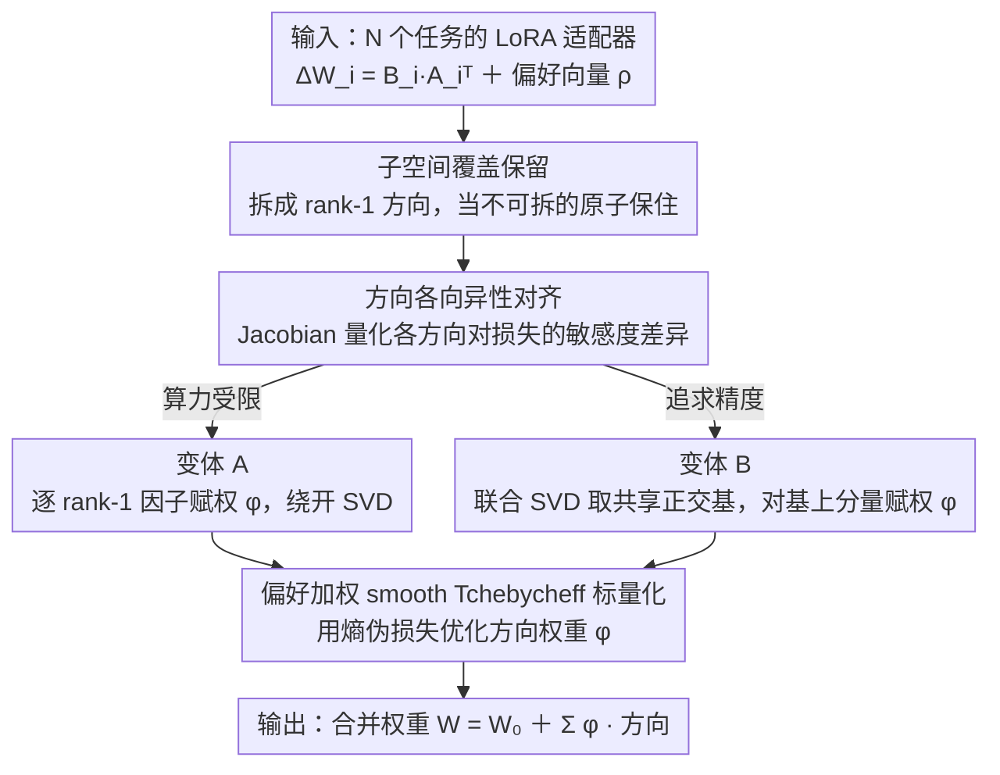

# Preference-Aligned LoRA Merging: Preserving Subspace Coverage and Addressing Directional Anisotropy

**会议**: CVPR 2026  
**arXiv**: [2603.26299](https://arxiv.org/abs/2603.26299)  
**代码**: [https://github.com/wooseong97/TARA-Merge](https://github.com/wooseong97/TARA-Merge)  
**领域**: 模型压缩/模型合并  
**关键词**: LoRA合并, 子空间覆盖, 各向异性, 多目标优化, 模型合并

## 一句话总结

本文从子空间覆盖（subspace coverage）和方向各向异性（anisotropy）两个视角重新审视LoRA合并问题，提出TARA-Merging框架，通过保留LoRA方向并结合偏好加权的交叉熵伪损失进行方向级重新加权，在8个视觉和6个NLI基准上持续超越现有合并方法。

## 研究背景与动机

1. **领域现状**：LoRA已成为大模型微调的标准方式，将多个任务专属的LoRA适配器合并为一个通用模型（model merging）是构建多任务系统的有效替代方案，无需昂贵的多任务联合训练。
2. **现有痛点**：现有合并方法存在两类问题：(1) 通用方法（Task Arithmetic, TIES, DARE）忽视LoRA的低秩结构，直接在全参数空间操作会导致严重的跨任务干扰；(2) LoRA感知方法（KnOTS, LoRA-LEGO）虽然利用了LoRA结构，但通常只解决覆盖或各向异性中的一个问题。
3. **核心矛盾**：LoRA适配器的更新方向跨越不同子空间且贡献不均匀。天真合并会削弱对某些任务损失最关键的方向，同时过度强调相对不重要的方向。
4. **本文目标** (a) 子空间覆盖问题——合并后是否保留了各任务LoRA方向的多样性；(b) 各向异性问题——不同LoRA方向对各任务损失的敏感度不均，需方向级别的精细控制。
5. **切入角度**：通过有效秩（effective rank）分析发现，LoRA感知的rank-1堆叠保留了约70%的各任务独立维度，但基于插值的合并（如Task Arithmetic）会导致严重的子空间坍缩。方向敏感度分析（Jacobian分析）表明，不同偏好下的敏感度分布高度不一致。
6. **核心 idea**：在保留LoRA rank-1方向以维持子空间覆盖的前提下，通过偏好加权的smooth Tchebycheff标量化优化方向级权重来解决各向异性。

## 方法详解

### 整体框架

TARA框架输入为N个任务的LoRA适配器 $\{\Delta W_i = B_i A_i^\top\}$ 和用户任务偏好向量 $\boldsymbol{\rho}$。方法将每个LoRA分解为rank-1方向（$\mathbf{b}_{ij}\mathbf{a}_{ij}^\top$）以保住子空间覆盖，再用各向异性分析说明不同方向对损失敏感度不均、需逐方向加权；据此给出两种构造方向并赋权的变体（变体 A 直接给 rank-1 因子赋权、变体 B 在联合 SVD 的共享正交基上赋权），两个变体的权重 $\phi$ 都用同一个偏好加权的 smooth Tchebycheff 标量化目标（熵伪损失）来优化，最终输出合并后的模型权重 $W = W_0 + \sum_i\sum_j \phi_{ij} \mathbf{b}_{ij}\mathbf{a}_{ij}^\top$。

### 关键设计

**1. 子空间覆盖分析与保留：合并前先把每个 LoRA 的方向多样性保住**

现有通用合并方法（Task Arithmetic 等）直接在全参数空间上对 $\Delta W$ 做插值，这会把 LoRA 内部的低秩结构搅在一起，最关键的几个任务方向被平均掉，论文称之为"表示容量丧失"。为了把这件事说清楚，TARA 先用基于熵的有效秩（erank）来量化合并后还剩多少有效维度：把各任务 LoRA 的 rank-1 分量向量化后堆叠，分别测三种堆叠方式的 erank——各任务独立求和、LoRA-agnostic 的 $\Delta W$ 堆叠、以及 LoRA-aware 的 rank-1 堆叠。结果是 rank-1 堆叠能保留约 70% 的独立维度，而 $\Delta W$ 堆叠因为插值干扰发生了严重的子空间坍缩。这个对比直接决定了 TARA 的优化单元：不在合并后的稠密矩阵上动手，而是把每条 rank-1 方向 $\mathbf{b}_{ij}\mathbf{a}_{ij}^\top$ 当作不可拆的原子保留下来，覆盖问题在合并发生之前就先解决掉。

**2. 方向各向异性对齐：等范数的方向更新不等于等比例的损失变化**

保住了方向多样性还不够——不同 rank-1 方向对各任务损失的敏感度差别很大，给它们同样的权重等于浪费容量。TARA 用任务损失的 Jacobian $J_{i,k} = \langle \nabla f_i(W), S_k \rangle_F$ 刻画这件事，其中 $S_k$ 是 rank-1 LoRA 方向；$J$ 的条件数 $\kappa(J)$ 越大，说明方向之间的敏感度越不均（各向异性越强）。更进一步，论文定义了一个方向敏感度错位指标

$$\xi(\boldsymbol{\rho}_1, \boldsymbol{\rho}_2) = 1 - |\cos(\mathbf{h}(\boldsymbol{\rho}_1), \mathbf{h}(\boldsymbol{\rho}_2))|$$

其中 $h_k(\boldsymbol{\rho}) = \langle g(\boldsymbol{\rho}; W), S_k \rangle_F$ 是某偏好 $\boldsymbol{\rho}$ 下的方向级敏感度。实验里不同偏好对应的敏感度分布 $\xi$ 很大、彼此高度不一致，这正说明权重不能在全局或层级上一刀切，必须下沉到方向粒度。这一分析是后面 $\phi_{ij}$ 逐方向重加权的直接动机。

**3. 两种合并变体：A 求快、B 求净，按算力预算二选一**

把上面两点落地，TARA 给出两个变体来权衡效率和精度。Variant A 最直接，对每个任务的 rank-1 因子各赋一个可学习权重 $\phi_{ij}$：

$$W_A = W_0 + \sum_i\sum_j \phi_{ij}\, \mathbf{b}_{ij}\mathbf{a}_{ij}^\top$$

它完全绕开 SVD，适合算力受限的场景。Variant B 则先把所有适配器水平拼接后做一次 SVD，得到一组共享正交基 $\{u_k\}$，再对每个任务在这组基上的分量赋权：

$$W_B = W_0 + \sum_i\sum_k \phi_{ik}\,\sigma_k u_k v_{ki}^\top$$

共享正交基让不同任务的方向先去相关，重叠和干扰被显式拆开，所以 B 精度更高、代价是多了一次联合 SVD。两个变体的权重都用同一个 smooth Tchebycheff 标量化目标去优化（见下），区别只在赋权的基底是原始 rank-1 因子还是共享正交基。

### 损失函数 / 训练策略

整个权重优化是无监督的：沿用 AdaMerging 风格，用模型在无标签数据上的预测熵 $f_i$ 充当任务损失的代理，从而绕开对标签的依赖。多个任务损失通过 smooth Tchebycheff 标量化结合用户偏好 $\boldsymbol{\rho}$ 聚成单一目标

$$\Psi(\phi, \boldsymbol{\rho}) = \alpha \log\!\Big(\sum_i \exp\big(\rho_i\,|f_i - z_i|\,/\,\alpha\big)\Big)$$

其中锚点 $z_i$ 取仅用任务 $i$ 自己的单个适配器时的熵损失，偏好 $\rho_i$ 越大该任务在合并里被照顾得越多。训练用 AdamW，学习率 0.001，方向权重初始化为 0.4，迭代 500 次，batch size 16。

## 实验关键数据

### 主实验

| 方法 | Cars | DTD | EuroSAT | GTSRB | MNIST | RESISC45 | SUN397 | SVHN | Avg (归一化%) |
|------|------|-----|---------|-------|-------|----------|--------|------|-------------|
| TA | 82.1 | 74.3 | 48.7 | 41.8 | 53.4 | 71.5 | 96.6 | 42.0 | 63.8 |
| TIES | 81.0 | 72.5 | 53.8 | 37.4 | 69.0 | 65.3 | 94.8 | 45.3 | 64.9 |
| AdaMerging | 79.5 | 73.5 | 70.9 | 39.7 | 63.0 | 69.0 | 97.8 | 66.6 | 70.0 |
| KnOTS-TIES | 82.7 | 73.7 | 49.3 | 48.9 | 68.9 | 70.9 | 95.5 | 53.8 | 68.0 |
| LoRA-LEGO | 81.1 | 73.0 | 54.4 | 40.3 | 48.6 | 71.5 | 97.3 | 37.1 | 62.9 |
| **TARA-A** | 82.2 | 76.0 | 74.9 | 43.5 | 76.3 | 70.2 | 98.0 | 70.8 | **74.0** |
| **TARA-B** | 86.2 | 78.4 | 76.8 | 42.9 | 82.7 | 75.4 | 98.6 | 69.7 | **76.3** |

### 消融实验（NLI任务，LLaMA-3 8B）

| 方法 | MNLI | QNLI | SNLI | RTE | SICK | SCITAIL | Avg (归一化%) |
|------|------|------|------|-----|------|---------|-------------|
| TA | 67.3 | 87.3 | 41.8 | 95.7 | 77.9 | 76.9 | 74.6 |
| AdaMerging | 47.5 | 92.9 | 41.3 | 102.6 | 93.8 | 94.2 | 78.7 |
| KnOTS-TIES | 41.1 | 83.4 | 56.6 | 87.2 | 87.9 | 94.8 | 75.2 |
| **TARA-A** | 51.7 | 92.6 | 41.4 | 102.6 | 95.3 | 94.4 | **79.7** |
| **TARA-B** | 46.8 | 94.1 | 41.4 | 103.4 | 98.1 | 97.8 | **80.3** |

### 关键发现

- **TARA-B在视觉和NLI任务上均取得最佳结果**：视觉8任务平均76.3%（vs AdaMerging 70.0%），NLI 6任务平均80.3%（vs AdaMerging 78.7%），表明同时解决覆盖和各向异性的重要性。
- **LoRA-LEGO反而不如vanilla基线**：仅保留rank-1方向但不做敏感度加权是不够的（62.9% vs TA的63.8%），必须同时解决两个问题。
- **泛化到未知任务**：在6个已知任务上合并后，对2个未知任务的Avg Acc，TARA-B (52.2%) 大幅超过 TA (42.9%) 和 KnOTS-TIES (41.8%)。
- **联合任务评估**：TARA-B的Hits@1达49.3%（vs TA 43.5%，AdaMerging 48.1%）。

## 亮点与洞察

- **两个正交视角的统一**：将LoRA合并问题分解为"覆盖"和"各向异性"两个独立但互补的维度，理论框架清晰优雅。之前的方法（KnOTS关注覆盖，AdaMerging关注全局权重）都只解决了一半问题。
- **方向敏感度错位的发现**：通过Jacobian分析量化了不同偏好下LoRA方向敏感度分布的不一致性，这个理论洞察为方向级加权提供了坚实的动机。
- **LoRA级操作的效率优势**：相比全参数合并，LoRA级操作大幅降低内存和计算量，使得梯度式合并方法可扩展到基础模型规模。

## 局限与展望

- Variant B需要对所有适配器做联合SVD，当任务数N很大或LoRA秩很高时计算开销可能较大
- 实验主要在ViT-B/32和LLaMA-3 8B上验证，对更大模型（如70B级别）的效果未知
- 偏好向量 $\boldsymbol{\rho}$ 需要用户手动指定，自动偏好发现可能更实用
- 未考虑任务间存在冲突梯度时的处理（如PCGrad式的梯度投影）

## 相关工作与启发

- **vs AdaMerging**：AdaMerging学习层级权重但忽略LoRA方向内的敏感度差异，TARA在方向粒度上更精细。两者使用相同的熵最小化代理。
- **vs KnOTS**：KnOTS通过SVD对齐子空间解决覆盖问题但忽略各向异性权重。TARA-B在SVD基础上额外引入方向级权重优化。
- **vs LoRA-LEGO**：LoRA-LEGO通过聚类保留模块性，但聚类过程可能丢失关键方向信息。TARA保留所有原始方向。

## 评分

- 新颖性: ⭐⭐⭐⭐ 两个分析视角的识别和统一框架设计有原创性，但具体实现相对直接
- 实验充分度: ⭐⭐⭐⭐⭐ 视觉+NLI双赛道、联合评估、泛化测试、偏好敏感度分析非常全面
- 写作质量: ⭐⭐⭐⭐ 理论推导清晰，但符号较多，读起来有一定负担
- 价值: ⭐⭐⭐⭐ 对LoRA合并领域有实际推进，代码开源，可直接使用

<!-- RELATED:START -->

## 相关论文

- [\[CVPR 2026\] Bridging Domains through Subspace-Aware Model Merging](bridging_domains_through_subspace-aware_model_merging.md)
- [\[ACL 2026\] Evolutionary Negative Module Pruning for Better LoRA Merging](../../ACL2026/model_compression/evolutionary_negative_module_pruning_for_better_lora_merging.md)
- [\[ICLR 2026\] Null-Space Filtering for Data-Free Continual Model Merging: Preserving Stability, Promoting Plasticity](../../ICLR2026/model_compression/null-space_filtering_for_data-free_continual_model_merging_preserving_stability_.md)
- [\[ACL 2026\] LoRA on the Go: Instance-level Dynamic LoRA Selection and Merging](../../ACL2026/model_compression/lora_on_the_go_instance-level_dynamic_lora_selection_and_merging.md)
- [\[ICML 2026\] FRISM: Fine-Grained Reasoning Injection via Subspace-Level Model Merging for Vision–Language Models](../../ICML2026/model_compression/frism_fine-grained_reasoning_injection_via_subspace-level_model_merging_for_visi.md)

<!-- RELATED:END -->
