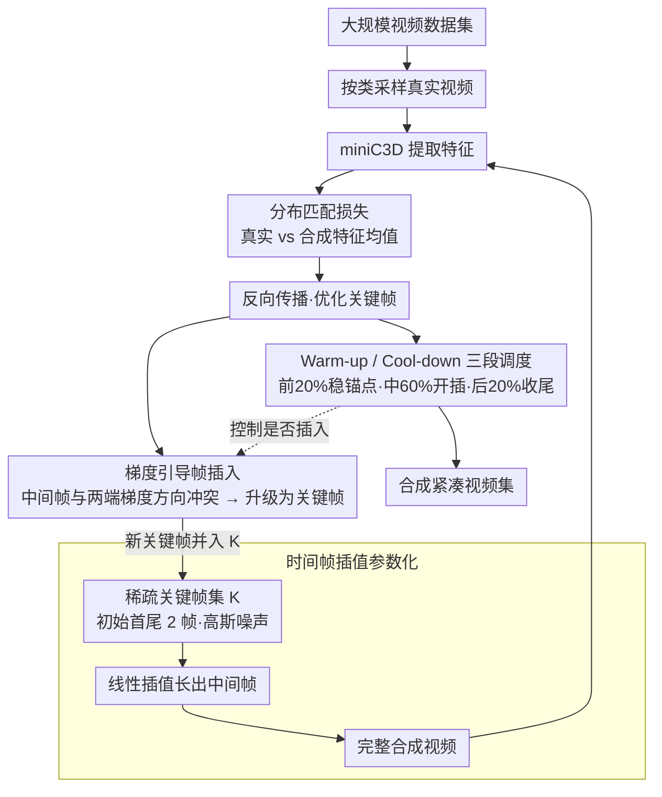

# PRISM: Video Dataset Condensation with Progressive Refinement and Insertion for Sparse Motion

**会议**: CVPR 2026  
**arXiv**: [2505.22564](https://arxiv.org/abs/2505.22564)  
**代码**: 无（未提及公开代码）  
**领域**: 模型压缩  
**关键词**: 视频数据集压缩, 关键帧插入, 梯度引导, 时空耦合, 存储效率

## 一句话总结

本文提出 PRISM，一种整体式视频数据集压缩方法：从仅两个时间锚点（首尾帧）出发,通过检测梯度方向冲突来自适应插入关键帧，在保持内容与运动的耦合完整性的同时实现 SOTA 的存储效率——在 miniUCF 1VPC 上用 20MB 达到 17.9% 准确率，比先前方法的 94MB 少 5 倍。

## 研究背景与动机

1. **领域现状**：数据集蒸馏/压缩的目标是合成一个远小于原始数据集的紧凑集合，使在其上训练的模型性能接近在全量数据上训练。该领域在图像域已有丰富研究（DC、DSA、DM、MTT 等），但在视频域几乎空白——仅有一项先前工作 Wang et al.。

2. **现有痛点**：唯一的先前工作将视频分解为"静态内容"（冻结的预训练图像）和"动态运动"（辅助信号）两个阶段来优化。这种分离策略有根本性缺陷——真实世界的动作中内容与运动是**不可分割的**。例如，鼓掌动作中双手合拢的一帧与双手开始分开的一帧在静态内容上完全相同，但属于不同的运动轨迹。

3. **核心矛盾**：视频数据存在巨大的时间冗余（相邻帧高度相似），但先前方法使用固定帧数（如 16 帧）来表示每个合成视频，在简单运动上浪费存储，在复杂运动上又可能不够。

4. **本文目标** (a) 设计一种保持内容-运动耦合完整性的整体式视频压缩方法；(b) 自适应地分配表示容量——只在需要的地方用更多帧，简单运动用线性插值就够。

5. **切入角度**：作者基于一个关键假设——简单或低速运动可以用线性插值有效近似。那么，只需要找出线性插值**失效**的帧（即非线性时空转变点）并将其升级为关键帧即可。如何找到这些帧？通过梯度方向冲突——如果中间帧的梯度与两端关键帧的梯度方向相反，说明优化两端关键帧无法降低中间帧的损失。

6. **核心 idea**：以最少的时间锚点（首尾帧）开始，在训练过程中通过检测梯度余弦相似度为负来识别线性插值失效的帧，自适应插入关键帧，实现视频压缩的"按需用帧"。

## 方法详解

### 整体框架

PRISM 的输入是大规模视频数据集，输出是合成的紧凑视频集。每个合成视频以稀疏关键帧集 $\mathcal{K}$ 参数化，初始仅含首尾帧。训练过程中，中间帧通过线性插值生成，完整视频送入 3D CNN 提取特征后与真实视频做分布匹配。当检测到梯度冲突时，在该位置插入新关键帧。训练分三阶段：warm-up（稳定锚点，20% 迭代）→ 渐进插入（60%）→ cool-down（充分优化已选帧，20%）。所有关键帧从高斯噪声初始化，体现整体式合成哲学。

### 关键设计

**1. 时间帧插值参数化：把整段视频压成几个可训练的关键帧，其余帧靠插值长出来**

先前方法把视频拆成"静态内容 + 动态运动"两路分别优化，结果是内容和运动脱了耦。PRISM 换了个表示方式：每个合成视频只由一组稀疏关键帧 $\mathcal{K}_c^j = \{s_{c,k_1}, ..., s_{c,k_n}\}$ 参数化，初始只有 $n=2$（首尾两帧），中间的非关键帧不存数据，而是现场线性插值出来——$s_{c,t} = \alpha_t s_{c,k_i} + (1-\alpha_t) s_{c,k_{i+1}}$，权重 $\alpha_t = (k_{i+1}-t)/(k_{i+1}-k_i)$ 就是 $t$ 在两端之间的相对位置。只有关键帧是可训练参数，中间帧跟着关键帧被间接拉动。这样一来内容和运动天然耦合：动一下关键帧，依赖它的所有插值帧同时变，整段视频从头到尾被当作一个整体来优化，而不是先冻住内容再补运动。

**2. 梯度引导帧插入：用梯度方向冲突来定位"线性插值失效"的帧，按需把它升级成关键帧**

光有首尾两帧只能表示匀速直线运动，复杂动作必然需要更多锚点——问题是加在哪一帧。PRISM 的判据来自一个直白的观察：如果某个中间帧 $s_{c,t}$ 的损失梯度 $\nabla \mathcal{L}(s_{c,t})$ 和它两端关键帧的梯度方向相反，那继续优化两端就只会把这个中间帧越推越偏。于是对每个候选中间帧，计算它的梯度与相邻两关键帧梯度的余弦相似度 $\cos_i^t$ 与 $\cos_{i+1}^t$，当两者都低于阈值 $\epsilon$（默认 0，即都为负）时判定为"梯度冲突"，把这一帧从插值帧升级为可直接训练的关键帧；一个迭代里所有满足条件的帧一起插入。Lemma 1 给了这个判据理论保证：在梯度冲突下，端点的任何凸组合更新都无法降低该中间帧的损失，所以非插入不可，而不只是拍脑袋的启发式。之所以盯方向而不是盯 L2 像素差，是因为方向反映的是语义层面的运动转变，而像素差会被光照、纹理这类无关变化干扰——消融里余弦相似度 7.5% 对 L2 的 6.0%（HMDB51 1VPC），差距很明显。

**3. Warm-up 与 Cool-down 两段缓冲：给插入决策一个"先稳住、再收手"的时间窗**

刚开始训练时梯度本身就是噪声，这时去看方向冲突很容易选错帧；而临近结束才插进来的帧又没几步迭代可优化，等于白加。PRISM 把训练切成三段来回避这两头的坑：前 20% 迭代禁止插入（warm-up），让首尾两帧先稳定下来，成为后续判断的可靠参考锚点；中间 60% 才执行渐进插入；最后 20% 再次禁止插入（cool-down），把已经选中的关键帧充分优化到位。两段缓冲分别管住"何时开始插"和"何时停止插"。消融显示去掉 warm-up 降 0.7% 以上，去掉 cool-down 降 1.0% 以上，两端都不能省。⚠️ 以原文为准

### 一个完整示例：一段鼓掌视频如何从 2 帧长到若干关键帧

拿一段"鼓掌"动作的合成视频走一遍。训练开始时它只有 2 个关键帧——首帧（双手分开）和尾帧（双手分开），都从高斯噪声初始化；中间所有帧靠首尾线性插值得到，于是"双手合拢"这个中点被插成了双手半开的样子，和真实轨迹对不上。前 20% 迭代的 warm-up 期里，PRISM 不动插入，只把首尾两帧朝分布匹配目标优化稳定。进入中段后，系统逐帧检查：双手合拢那一刻的中间帧，它的梯度想把自己往"合拢"方向推，而首尾两关键帧的梯度都在往"分开"方向走，两个余弦相似度都为负——命中梯度冲突，这一帧被升级为关键帧，关键帧数从 2 变成 3。此后这个新关键帧可以独立优化出真正的合拢姿态，它和首尾帧之间又各自成段、各自再做插值与冲突检测，必要时继续分裂出更多关键帧。简单的匀速段始终查不出冲突，就一直保持 2 帧用插值表示，省下的容量全留给了运动剧烈的转折点。最后 20% 的 cool-down 期停止再插入，把当前这几个关键帧磨到收敛。整段视频因此只在"该用帧的地方用帧"，这正是它在 miniUCF 1VPC 上用 20MB 就打平先前方法 94MB 的来源。

### 损失函数 / 训练策略

优化目标为分布匹配：$\min_{\mathcal{K}} \sum_c \|\frac{1}{|\mathcal{B}_c^{real}|}\sum_x f_\theta(x) - \frac{1}{|\mathcal{B}_c^{syn}|}\sum_s f_\theta(s)\|^2$，其中 $f_\theta$ 是 miniC3D（4 层 Conv3D）。使用 SGD、momentum 0.95，$\epsilon=0$。合成视频从高斯噪声初始化。16 帧采样间隔 4 的 112×112 视频。

## 实验关键数据

### 主实验

| 数据集 | VPC | PRISM | Wang et al. | DM | Herding | PRISM 存储 | 先前最优存储 |
|--------|-----|-------|-------------|-----|---------|-----------|------------|
| miniUCF | 10 | 31.0 | - | 30.0 | **33.7** | **324MB** | 1150MB |
| miniUCF | 5 | **28.0** | 27.2 | 25.7 | 26.3 | **133MB** | 455MB |
| miniUCF | 1 | **17.9** | 17.5 | 15.3 | 13.2 | **20MB** | 94MB |
| HMDB51 | 10 | **12.8** | - | 12.1 | 10.8 | **287MB** | 1150MB |
| HMDB51 | 5 | **10.5** | 8.2 | 8.0 | 9.0 | **137MB** | 455MB |
| HMDB51 | 1 | **7.5** | 6.0 | 6.1 | 3.0 | **22MB** | 94MB |

PRISM 在 VPC 5/1 上全面领先，且存储仅为先前方法的 1/3 到 1/5。

### 消融实验

| 消融项 | miniUCF (1VPC) | HMDB51 (1VPC) | 说明 |
|--------|---------------|---------------|------|
| 完整 PRISM | 17.9 | 7.5 | 基线 |
| 无帧插入 | 15.8 | 6.1 | 最大降幅 -2.1，插入机制关键 |
| 随机位置插入 | 16.8 | 6.8 | 梯度引导 vs 随机 +1.1 |
| L2距离替代余弦 | 15.7 | 6.0 | 方向 vs 距离 +2.2 |
| 无 warm-up | 16.1 | 6.8 | 不稳定的早期插入 |
| 无 cool-down | 16.9 | 6.3 | 晚期插入帧训练不足 |
| 初始 2 帧（默认）| 17.9 | 7.5 | 最优 |
| 初始 8 帧 | 15.3 | 5.6 | 更多初始帧反而更差 |

### 跨架构泛化

| 评估模型 | PRISM | Wang et al. | DM |
|----------|-------|-------------|-----|
| ConvNet3D | **17.9** | 17.5 | 15.3 |
| CNN+GRU | **18.9** | 12.0 | 9.9 |
| CNN+LSTM | **18.2** | 10.3 | 9.2 |

PRISM 在非训练架构上的泛化能力极强——CNN+GRU 上领先 6.9%，CNN+LSTM 上领先 7.9%。

### 关键发现

- **"从少开始"比"从多开始"好**——初始 2 帧最优，8 帧反而最差。过多初始帧产生冲突梯度信号，干扰运动轨迹的早期学习。
- **存储效率不线性增长**——得益于自适应插入，VPC 从 1 增加到 10 时存储仅增长 15 倍（而非 10 倍），因为更多视频共享相似的运动复杂度。
- **跨架构泛化是 PRISM 的意外收获**——稀疏关键帧减少了对训练骨干特定归纳偏置的过拟合。
- **动作检索任务验证了 PRISM 的语义质量**——在 HMDB51 上 R@1 从 22.6% 提升到 38.0%，说明自适应插入的帧确实捕获了语义上重要的时空线索。

## 亮点与洞察

- **"从噪声开始，按需加帧"的哲学**——这是对密集优化范式的根本性挑战。类似于 NAS 中从小网络开始逐步扩展的思想，但应用在时间维度上。
- **Lemma 1 提供了理论基础**——梯度冲突意味着端点更新必然增加中间帧损失，不只是启发式判断。这个理论联系使得帧插入不是 ad hoc 的。
- **整体式 vs 分解式的对比**——作者用"鼓掌动作"的例子精确说明了为什么分解内容和运动会失败。这个观点可以推广到其他时空任务中的表示学习。
- **从高斯噪声初始化**挑战了"合成数据应从真实数据初始化"的常见假设——说明如果优化目标设计得当，初始化来源并不重要。

## 局限与展望

- **对极端突变运动的处理有限**——线性插值假设在非常快速的场景变化中可能不成立，此时可能需要非线性插值
- **从噪声优化在长序列（>16帧）上不稳定**——目前仅在 8/16 帧上验证，更长视频可能需要分段处理
- **仅在动作识别和检索上验证**——对视频生成等需要更精细时空细节的任务效果未知
- **骨干固定为 miniC3D**——对更大的 3D backbone（如 Video Swin、TimeSformer）的适用性未探索
- **大规模数据集上优势减小**——Kinetics-400 上 VPC 5 时 DM (9.1%) > PRISM (8.1%)，可能因为 8 帧+64×64 的低分辨率设定限制了自适应插入的潜力

## 相关工作与启发

- **vs Wang et al. (唯一先前工作)**: 两阶段分解式方法，依赖冻结的预训练静态图像，运动作为辅助信号。PRISM 从零开始整体优化，避免了分解带来的内容-运动脱耦问题。
- **vs DM (图像压缩直接用于视频)**: DM 初始化来自真实帧，当作独立图像优化。在极低数据设定（Kinetics-400 VPC 5）下反而优于 PRISM，可能因为真实初始化在高压缩下更稳定。
- **与图像域 dataset distillation 的关系**: PRISM 的分布匹配目标来自 DM，但创新在于时间维度的稀疏表示和自适应插入。未来可以尝试将梯度匹配或轨迹匹配目标与 PRISM 的帧插入结合。

## 评分

- 新颖性: ⭐⭐⭐⭐⭐ 首个整体式视频压缩方法，梯度引导帧插入有理论支撑且效果显著
- 实验充分度: ⭐⭐⭐⭐ 4个数据集、多种VPC、跨架构、存储分析、全面消融，缺失大模型骨干实验
- 写作质量: ⭐⭐⭐⭐ 动机清晰，理论和实验结合好，图表设计用心
- 价值: ⭐⭐⭐⭐ 开辟了视频压缩的新范式，5倍存储节省有实际意义

<!-- RELATED:START -->

## 相关论文

- [\[AAAI 2026\] Post Training Quantization for Efficient Dataset Condensation](../../AAAI2026/model_compression/post_training_quantization_for_efficient_dataset_condensation.md)
- [\[ECCV 2024\] Leveraging Hierarchical Feature Sharing for Efficient Dataset Condensation](../../ECCV2024/model_compression/leveraging_hierarchical_feature_sharing_for_efficient_dataset_condensation.md)
- [\[CVPR 2026\] Progressive Supernet Training for Efficient Visual Autoregressive Modeling](progressive_supernet_training_for_efficient_visual_autoregressive_modeling.md)
- [\[ICCV 2025\] MotionFollower: Editing Video Motion via Lightweight Score-Guided Diffusion](../../ICCV2025/model_compression/motionfollower_editing_video_motion_via_score-guided_diffusion.md)
- [\[CVPR 2025\] Enhancing Dataset Distillation via Non-Critical Region Refinement](../../CVPR2025/model_compression/enhancing_dataset_distillation_via_non-critical_region_refinement.md)

<!-- RELATED:END -->
