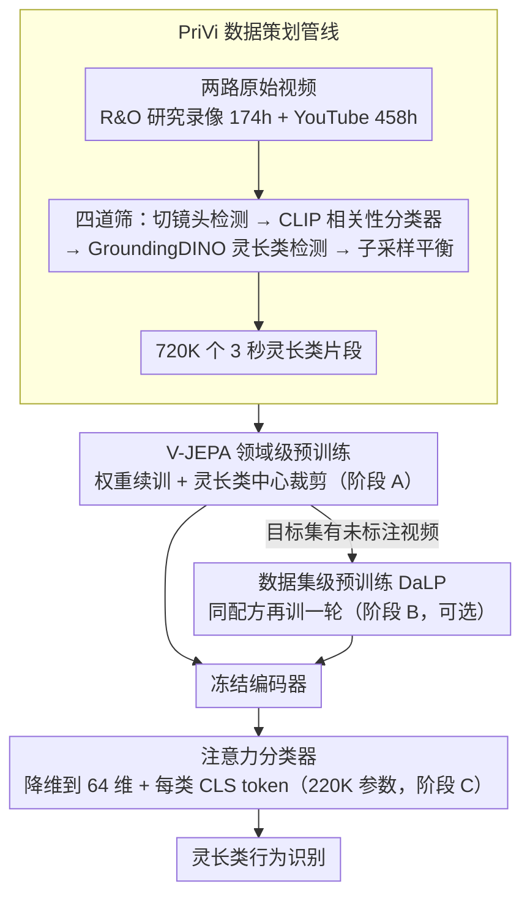

# PriVi: Towards a General-Purpose Video Model for Primate Behavior in the Wild

**会议**: CVPR 2026  
**arXiv**: [2511.09675](https://arxiv.org/abs/2511.09675)  
**代码**: [https://privi.eckerlab.org](https://privi.eckerlab.org) (数据+模型+代码)  
**领域**: 模型压缩  
**关键词**: 灵长类行为识别, 自监督预训练, V-JEPA, 领域级预训练, 数据策划管线

## 一句话总结
PriVi 构建了 424 小时的大规模灵长类视频预训练数据集，并通过在 V-JEPA 上进行**领域级预训练**（非目标数据集级别），首次证明了视频模型的领域级预训练可以跨数据集泛化，在四个灵长类行为识别基准上用仅 220K 参数的冻结分类器超越了全量微调的专用模型。

## 研究背景与动机

1. **领域现状**：灵长类行为分析对认知科学、进化生物学和保护生态学至关重要。计算机视觉方法有潜力辅助行为分析，但现有方法主要依赖以人为中心的预训练模型（如 Kinetics），且针对单一数据集训练专用模型，泛化能力受限。

2. **现有痛点**：（a）预训练数据以人为中心，对灵长类等非人类动物是"域外"数据；（b）现有方法通常为每个目标数据集单独训练模型（数据集级预训练），无法跨数据集共享；（c）标注稀缺（专家标注昂贵且受限），需要能在少量标签下工作的方法。

3. **核心矛盾**：语言模型已证明领域级预训练（在相似但非目标数据上预训练）可提升下游性能，但视频模型尚无类似成果。核心挑战是缺乏大规模、多样化的灵长类视频数据集和可扩展的数据策划方法。

4. **本文目标**（a）如何在无种子数据集和文本标注的情况下策划大规模灵长类视频数据集；（b）领域级预训练是否对视频模型有效；（c）如何设计轻量分类器在冻结特征上高效识别行为。

5. **切入角度**：从"模型中心"转向"数据中心"，核心假设是——在足够多样化的同领域数据上预训练可以提供跨数据集的通用表示，比在每个小数据集上单独预训练更有效。

6. **核心 idea**：用可扩展的数据策划管线构建灵长类视频大数据集 PriVi，通过 V-JEPA 领域级预训练获得通用灵长类表示，以冻结评估方式在四个行为基准上达到 SOTA。

## 方法详解

### 整体框架
PriVi 想回答的核心问题是：与其为每个小数据集单独训一个专用视频模型，能不能像语言模型那样，先在「灵长类」这个**领域**的大量数据上预训练一次，得到一套跨数据集通用的表示？为此它走三步：先用一条自动数据策划管线攒出 424 小时的灵长类视频，在这堆数据上继续训练 V-JEPA 拿到领域级表示（阶段 A）；如果目标数据集还有未标注视频，可以再做一轮数据集级预训练（DaLP, Dataset-Level Pretraining）补一刀（阶段 B，可选）；最后把编码器**冻住**，只在它输出的特征上训一个极轻的注意力分类器来识别具体行为（阶段 C）。整条链路的赌注全押在「数据」而非「模型结构」上——结构基本沿用 V-JEPA，新东西是数据和评估方式。

### 关键设计

**1. PriVi 数据策划管线：不靠种子数据集、不靠文本标注，把脏视频漏成干净的训练池**

灵长类视频的最大障碍是没有现成的大规模数据集，而互联网视频又脏：跳切、无关画面、空镜头一大堆。已有的自动策划管线大多要么需要一个高质量种子数据集做检索锚点，要么需要文本标注来对齐——这两样在灵长类场景都拿不到。PriVi 的做法是把人工成本压到极低（只标 2500 张图片训一个相关性分类器），然后让一条漏斗式管线自己把脏视频筛干净。数据来自两路：**R&O 研究录像** 174 小时，来自 11 个行为生态学项目的真实拍摄；**YouTube** 通过搜索灵长类播放列表抓来 458 小时原始视频。原始素材依次过四道筛——切镜头检测丢掉频繁跳切的片段、CLIP 嵌入上的 2 层 MLP 相关性分类器（recall 82.8%、precision 90.3%）滤掉无关内容、GroundingDINO 零样本灵长类检测丢掉空帧片段、再按源数据集比例对 R&O 各子集做子采样平衡贡献。脏视频经这套漏斗最终收成 720K 个 3 秒片段。关键在于每道筛都是零样本或极少标注就能跑，所以这条管线能原样搬到海洋生物、农业等任何缺数据的细分领域。

**2. V-JEPA 领域级预训练：以灵长类为中心裁剪，让算力不浪费在背景上**

有了数据，下一步是把 V-JEPA 已学到的通用视频知识「拉」到灵长类领域。PriVi 不从头训，而是在 VideoMix2M 上预训练好的 V-JEPA ViT-L 权重之上继续训 75K steps（约 8 个 epoch），batch size 80，学习率固定在 $1.5 \times 10^{-5}$——因为原始权重的学习率已经余弦退火到底，再加退火没意义。这里最关键的一笔是裁剪策略：训练时的随机裁剪中心不是随机撒在画面里，而是对齐到零样本检测器框出的灵长类包围框，逼模型把表示容量花在动物个体上而不是去学背景的树和草。正因为是「继续训练」而非从零开始，加上以个体为中心的裁剪省掉了背景学习，整个领域级预训练只用 4 张 A100 跑 11 小时就够，计算开销几乎可以忽略。

**3. 注意力分类器：先把特征压到 64 维，用 220K 参数防住小数据集上的过拟合**

冻结评估的瓶颈在分类头：V-JEPA 原版的注意力分类器有 12M 参数、V-JEPA2 更是 49M，这套参数量是为大规模人类行为数据集设计的，搬到只有几千条标注的动物行为数据集上严重过参数化，一训就过拟合。PriVi 反其道而行，把分类头瘦到 220K 参数。具体是先把编码器输出的 $N$ 个 patch token 从 $D=1024$ 降维到 $D'=64$，再拼上 $C$ 个可学习的 CLS token（每类一个），过 3 层 self-attention，最后每个 CLS token 经线性投影 + softmax/sigmoid 给出类别概率。降维到 64 维看似会丢信息，但实验里它恰恰是关键——为每个类别配一个独立 CLS token 保证了类别间不抢容量，避免了单一瓶颈，所以在极少参数下既不丢判别力又压住了过拟合。这条设计把「好表示比大分类头更重要」量化成了一个 220K 打败 167M 的对照。

### 损失函数 / 训练策略

预训练沿用 V-JEPA 的 masked prediction loss $L_{JEPA} = \|P(E(\text{Mask}(X))) - \text{Mask}^C(\bar{E}(X))\|_1$，即让预测器从可见 patch 重建被遮挡区域的目标编码。下游分类器用交叉熵（BaboonLand 这类长尾数据集改用 EQL loss 缓解类别不均衡），按数据集规模训 1–40 个 epoch 不等。

## 实验关键数据

### 主实验

| 方法 | ChimpACT mAP | PanAf500 B-Acc | BaboonLand B-Acc | ChimpBehave B-Acc |
|------|-------------|---------------|-----------------|------------------|
| X3D | 27.05 | 50.35 | 31.41 | 62.8 |
| VideoMAEv2 | - | - | - | 74.8 |
| VideoPrism-g | 31.5 | - | - | - |
| V-JEPA (人类数据) | 36.33 | 56.69 | 26.99 | 68.41 |
| **PriVi** | **39.25** | **62.75** | **33.99** | **71.30** |
| **PriVi + DaLP** | **40.00** | **62.96** | **38.57** | **75.14** |

PriVi 在所有四个数据集上超越现有方法，包括全量微调的专用模型（ChimpVLM 167M 参数）。

### 消融实验

| 配置 | ChimpACT mAP | PanAf500 B-Acc |
|------|-------------|---------------|
| V-JEPA 基线 | 32.00 | 71.95 |
| + DaLP: ChimpACT | 35.86 | - |
| YT-Random (未过滤) | 33.87 | 71.61 |
| YT-Filtered (过滤后) | 37.88 | 76.33 |
| R&O 仅 | 33.01 | 73.85 |
| **PriVi (YT-F + R&O)** | **38.75** | **79.95** |
| 无灵长类裁剪 | 32.62 | 72.93 |
| 无降维 (37.84M 参数) | 30.15 | 62.52 |

### 关键发现
- **YouTube 相关性过滤至关重要**：YT-Filtered 比 YT-Random 性能大幅提升，验证数据策划的关键性
- **域级预训练 > 数据集级预训练**：PriVi 在两个数据集上都优于仅在目标数据集上预训练，且无跨数据集负迁移
- **灵长类中心裁剪很重要**：去掉后 ChimpACT mAP 下降 6.13 点
- **降维反而帮助**：37.84M 参数的无降维模型反而性能最差（30.15 mAP），说明小数据集上参数少更好
- **极少标签下表现突出**：仅 10% 训练数据时，PriVi 方法仅损失 4.4% 准确率（PanAf500），仍超越 X3D 全量训练
- 两部分数据（YT-Filtered 和 R&O）各有贡献，合并后进一步提升

## 亮点与洞察
- **首次证明视频模型的领域级预训练有效**：此前只在语言模型上验证过。这意味着可以为各细分领域（海洋生物、农业等）构建类似的预训练数据集
- **极轻量的冻结分类器**：仅 220K 参数，超越 167M 参数的全量微调模型，证明好的表示比大的分类头更重要
- **数据策划管线的实用性**：不需要种子数据集和文本标注，仅需 2500 张标注图片，可轻松迁移到其他动物或领域
- **降维到 64 维的设计**：反直觉但有效——对于小数据集，减少分类头参数量是防过拟合的关键

## 局限与展望
- PriVi 仅覆盖 11 个研究场景，灵长类多样性有限（主要是猕猴和黑猩猩）
- 评估仅在黑猩猩和狒狒数据集上进行，其他灵长类未验证
- 3 秒片段对于长时序行为（如社交互动序列）可能不够
- 未探索视觉-语言模型（如 CLIP 微调）作为替代方案
- R&O 中有 14% 数据因隐私原因未公开

## 相关工作与启发
- **vs VideoPrism**: VideoPrism-g 在 ChimpACT 上仅 31.5 mAP，PriVi 达到 40.0。说明领域专属数据比通用大规模数据更有效
- **vs ChimpVLM**: 全量微调 167M 参数的 VLM，在 PanAf500 上 B-Acc 61.94；PriVi 用 220K 冻结分类器达到 62.96。说明好的预训练数据 > 大模型微调
- **vs AlphaChimp**: 在无 GT 检测的 ChimpACT 上，SAM3 + PriVi（30.76 mAP）超越 AlphaChimp（25.35），说明零样本检测+冻结特征的组合很有实用价值

## 评分
- 新颖性: ⭐⭐⭐⭐ 首次验证视频领域级预训练的有效性，数据策划管线设计实用
- 实验充分度: ⭐⭐⭐⭐⭐ 四个数据集、分类器消融、数据消融、低标签实验、跨镜头泛化，非常全面
- 写作质量: ⭐⭐⭐⭐ 结构清晰，实验充分，但部分符号和公式可更简洁
- 价值: ⭐⭐⭐⭐ 对动物行为分析领域影响大，方法论可推广到其他专业视觉领域

<!-- RELATED:START -->

## 相关论文

- [\[ICML 2025\] LightGTS: A Lightweight General Time Series Forecasting Model](../../ICML2025/model_compression/lightgts_a_lightweight_general_time_series_forecasting_model.md)
- [\[CVPR 2026\] Generative Video Compression with One-Dimensional Latent Representation](generative_video_compression_with_one-dimensional_latent_representation.md)
- [\[CVPR 2026\] UniComp: Rethinking Video Compression Through Informational Uniqueness](unicomp_rethinking_video_compression_through_informational_uniqueness.md)
- [\[CVPR 2026\] PRISM: Video Dataset Condensation with Progressive Refinement and Insertion for Sparse Motion](prism_video_dataset_condensation_with_progressive_refinement_and_insertion_for_s.md)
- [\[CVPR 2026\] F²HDR: Two-Stage HDR Video Reconstruction via Flow Adapter and Physical Motion Modeling](textf2texthdr_two-stage_hdr_video_reconstruction_via_flow_adapter_and_physical_m.md)

<!-- RELATED:END -->
