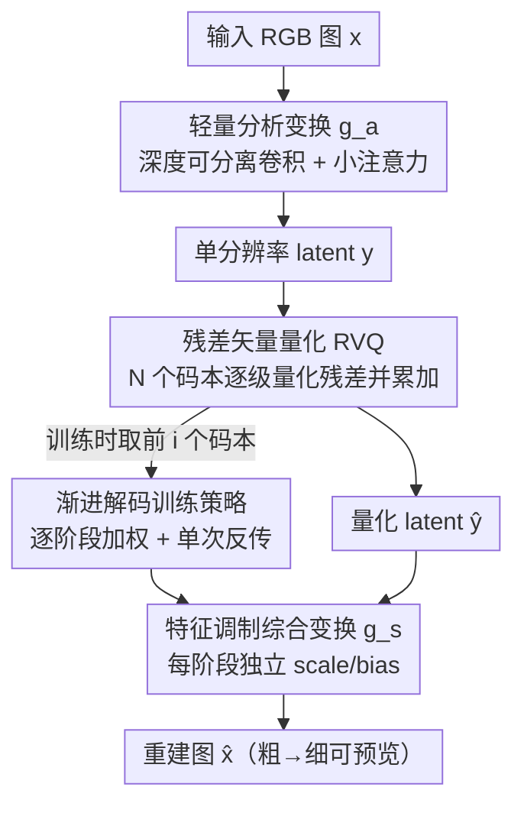

# ProGIC: Progressive and Lightweight Generative Image Compression with Residual Vector Quantization

**会议**: CVPR 2026  
**arXiv**: [2603.02897](https://arxiv.org/abs/2603.02897)  
**代码**: 无（补充材料含移动端 demo，未公开仓库）  
**领域**: 模型压缩 / 生成式图像压缩  
**关键词**: 生成式图像压缩、残差矢量量化、渐进式解码、轻量骨干、低码率

## 一句话总结
ProGIC 把图像 latent 表示成多个码本逐级量化残差之和（RVQ），既能从部分码流做粗到细的渐进预览，又配一个深度可分离卷积+小注意力的轻量骨干，在 Kodak 上相比 MS-ILLM 取得 57.57%（DISTS）/58.83%（LPIPS）的 BD-rate 节省，同时编解码快 10 倍以上，能跑在仅 CPU 的手机上。

## 研究背景与动机

**领域现状**：生成式图像压缩（GIC）通过"合成合理细节"来提升低码率下的感知质量，主流路线有三条——GAN 派（HiFiC、MS-ILLM）、VQ 派（用预训练码本把低质特征映射到高质）、以及近期的扩散派（DiffEIC、OSCAR 借助预训练 Stable Diffusion 生成细节）。它们在感知质量上确实比 MSE 优化的传统/学习型编解码器（JPEG、VVC、DCVC-RT）强很多，后者在低码率下会出现模糊和块效应。

**现有痛点**：GIC 落地有两个绕不开的难处。其一，低码率场景往往带宽极度稀缺，实际需求是"先在短时间内看到一个可用预览"，但现有 GIC 几乎都要**收齐完整码流**才能解出一张能看的图——它们不支持渐进解码；少数支持渐进解码的非生成编解码器又不优化感知质量。其二，这些场景常部署在边缘/移动设备上，但扩散派模型动辄上千万到十几亿参数、推理极慢（OSCAR 处理单张图要 >80GB 显存，在 DIV2K/CLIC 上直接 OOM）。

**核心矛盾**：渐进可用性、感知质量、计算开销三者很难同时拿到。VQ 派此前多用**单个码本**，表示能力受限；而多码本设计（多尺度架构）虽然容量更大，却天然不支持从部分码流恢复。换句话说，"能渐进"和"质量高/够轻"被现有结构割裂开了。

**本文目标**：构建一个同时面向"带宽受限 + 算力受限"的灵活 GIC——既能从部分码流渐进预览，又足够轻能上 CPU/手机，且感知质量不输 SOTA。

**切入角度**：作者借鉴离散语音表示里的**残差矢量量化（RVQ）**（SoundStream、DAC）——用一串码本逐级编码上一阶段的残差，所有阶段输出相加得到越来越精细的 latent。关键观察是：RVQ 的"逐级累加"结构和"渐进解码"天生契合——只用前 $i$ 个码本就是第 $i$ 阶段的重建。

**核心 idea**：把图像 latent 建模为"基向量 + 一串残差向量之和"（单分辨率 RVQ），让部分码流即可粗到细预览；再配深度可分离卷积+小注意力的轻量骨干，把渐进性、感知质量、低算力三者一次拿下。

## 方法详解

### 整体框架
ProGIC 是一个端到端的"分析变换 → RVQ 量化 → 综合变换"编解码器。输入 RGB 图 $\bm{x}\in\mathbb{R}^{3\times H\times W}$ 先经 pixel-unshuffle 下采样 8 倍，再由分析变换 $g_a(\cdot)$ 额外 2× 下采样编码成单分辨率 latent $\bm{y}$（最终 $\tfrac{H}{16}\times\tfrac{W}{16}$）。$\bm{y}$ 交给 RVQ 用 $N$ 个码本逐级量化得 $\hat{\bm{y}}$，综合变换 $g_s(\cdot)$ 再把 $\hat{\bm{y}}$ 解回图像 $\hat{\bm{x}}$。整条管线只有 $g_a$ 和 $g_s$ 是主要算力开销（RVQ 本身只做廉价的查表+向量加法），所以骨干设计成轻量化，而 $g_s$ 里再额外注入"特征调制"让同一个解码器适配不同渐进阶段。

### 关键设计

**1. 单分辨率残差矢量量化（RVQ）：让多码本天然支持渐进解码**

针对"单码本表示力弱、而传统多尺度多码本不支持渐进"的矛盾，ProGIC 把 latent 表示成一串残差的累加。第一个码本 $\bm{C}_1$ 量化原始 latent 得基向量 $\hat{\bm{y}}_1=Q(\bm{y},\bm{C}_1)$，残差 $\bm{r}_1=\bm{y}-\hat{\bm{y}}_1$；之后每个码本量化当前残差，第 $i$ 阶段的残差是 $\bm{r}_i=\bm{y}-\hat{\bm{y}}_1-\sum_{j=1}^{i-1}\hat{\bm{r}}_j$，量化得 $\hat{\bm{r}}_i=Q(\bm{r}_i,\bm{C}_{i+1})$。最终量化 latent 为

$$\hat{\bm{y}}=\hat{\bm{y}}_1+\sum_{i=1}^{N-1}\hat{\bm{r}}_i.$$

与多尺度多码本不同，RVQ 始终在**单分辨率** latent 上做逐级残差细化，实现高效；更重要的是这种累加结构天生支持渐进——只取前 $i$ 个码本就是第 $i$ 阶段的较粗重建。对 $N$ 个码本、每本 $2^L$ 个向量，码率为 $\text{BPP}=\tfrac{N\times L}{16\times 16}$（16 为整体下采样比），$N=5$、$2^L=1024$ 即可在**单个模型**里覆盖 5 档 BPP $\{0.0391,0.0781,0.1172,0.1562,0.1953\}$。作者还发现给这些 codeword 索引做 range coding 只省 0.9% 码率（索引分布几乎无统计冗余），所以**干脆不做熵编码**，省掉了这部分延迟。

**2. 轻量骨干 + 小注意力：在小 $M$ 下补回空间聚合能力**

由于 RVQ 几乎不耗算力，整体复杂度全压在 $g_a/g_s$ 上。作者沿用 DCVC-RT 的轻量骨干：把"深度卷积块 + 前馈网络（FFN）"堆叠 $M$ 次作为主体（编码器 $M$ 个块、解码器更多层），比 ResBlock 复杂度低得多；并把原实现里的 WSiLU 激活换成 ReLU 以加速 CPU 计算。但小 $M$ 会导致深度卷积块的**空间聚合不足**，单纯增大 $M$ 又会显著抬高复杂度。为此在 $g_a$ 下采样层之后、$g_s$ 上采样层之前各插一个**注意力模块**（结构沿用 ELIC 式注意力，但把内部 ResBlock 换成堆 $k=3$ 个深度卷积块+FFN 以降复杂度）。这样既在小 $M$ 下补回空间聚合、又捕捉长程依赖，用很低的额外算力换来表示力提升（消融里注意力单独带来 11.41% BD-rate 降幅）。

**3. 特征调制：让同一个解码器适配不同渐进阶段**

不同渐进阶段（用前 $i$ 个码本）输入的 latent 精细度不同，若用同一套解码参数会"水土不服"。作者在 $g_s$ 的每个深度卷积块和 FFN 的残差连接之前，对特征做一次仿射调制——乘一个 scale、加一个 bias，而**每个渐进阶段 $i$ 使用各自独立的 scale/bias 参数**。这让解码器"知道"自己当前处在第几阶段，从而针对该阶段的 latent 分布做适配。它几乎不增加 FLOPs，却在渐进解码下稳定提升质量（消融里单独贡献 2.42% BD-rate 降幅）。

### 损失函数 / 训练策略
渐进解码靠训练策略落地：每次迭代遍历 $i\in\{1,\dots,N\}$，对每个 $i$ 只用前 $i$ 个码本算重建 $\hat{\bm{x}}_i$，累加所有阶段的损失后**一次反传**。总损失沿用 GIC 常用组合——L1 重建 + LPIPS 感知（VGG）+ adaptive PatchGAN 对抗 + codebook 损失（commitment + 码本更新）：

$$\mathcal{L}=\sum_{i=1}^{N}\lambda_i\Big(\lVert\bm{x}-\hat{\bm{x}}_i\rVert_1+\lambda_{\text{per}}\mathcal{L}_{\text{per}}+\lambda_{\text{adv}}\mathcal{L}_{\text{adv}}+\lambda_{\text{cb}}\mathcal{L}_{\text{cb}}^i\Big).$$

阶段权重 $\lambda_i$ 由一个比例 $p$ 控制：$\lambda_i=\tfrac{p}{N-1}\,(i<N)$、$\lambda_N=1-p$，保证 $\sum_i\lambda_i=1$。$p$ 越小越偏向最终重建质量（$p=0$ 时全部权重给最后一阶段），$p$ 越大越偏向低码率的中间预览。实验取 $p=0.5$ 折中。训练在完整 ImageNet 上做，每 epoch 抽 1% 图像取 $256\times256$ 随机裁剪 + 水平翻转，Adam（$\beta_1{=}0.5,\beta_2{=}0.9$），学习率 $10^{-4}$ 在 1.5M 步后衰减到 $10^{-5}$，共 2M 步、batch 16，单张 A100 峰值显存仅 12.4GB。

## 实验关键数据

### 主实验
Kodak 数据集上 BD-rate（以 MS-ILLM 为 0% 基准，越负越好）与复杂度（A100 GPU，每张图编/解码耗时）。BD-rate 指标为 LPIPS：

| 方法 | Enc.(ms) | Dec.(ms) | FLOPs(G) | Params(M) | Kodak BD-rate↓ | CLIC2020 BD-rate↓ |
|------|---------|---------|----------|-----------|----------------|-------------------|
| MS-ILLM（基准） | 165.38 | 147.79 | 599.52 | 181.40 | 0.00% | 0.00% |
| HiFiC | 526.51 | 1408.60 | 599.51 | 181.60 | 45.82% | 86.45% |
| Control-GIC | 103.56 | 436.26 | 5816.37 | 130.36 | 33.36% | 136.25% |
| DiffEIC | 210.18 | 4661.74 | 57339.93 | 1379.50 | -37.71% | 4.34% |
| OSCAR | 53.04 | 167.56 | 6485.61 | 1009.30 | -37.31% | – |
| **ProGIC-s（小）** | **6.13** | **7.66** | 108.28 | 14.44 | -52.73% | -42.76% |
| **ProGIC（base）** | 7.64 | 10.99 | 333.38 | 33.11 | **-58.83%** | **-51.13%** |

ProGIC 在所有评测数据集/指标上都是最优：Kodak/Tecnick/DIV2K/CLIC2020 上 LPIPS BD-rate 分别约 -58.83%/-45.53%/-51.77%/-51.13%（DISTS 上 Kodak 为 -57.57%）。参数仅 33M（base）/14M（small），不到扩散派 OSCAR(1009M)/DiffEIC(1379M) 的零头；解码比 OSCAR 快 10×、比最快的非生成法 DCVC-RT 还快。视觉上 ProGIC 能忠实恢复笑脸/枝干等结构，而 OSCAR 会"幻觉"出原图不存在的细节——这解释了 ProGIC 更优的 DISTS（对结构/纹理差异敏感）。

CPU 端（笔记本 AMD Ryzen 7840HS，单位 ms）：

| 方法 | 256² Enc./Dec. | 512² Enc./Dec. |
|------|----------------|----------------|
| MS-ILLM | 121 / 368 | 507 / 1352 |
| OSCAR | 805 / 2530 | 3429 / 9519 |
| **ProGIC** | 76 / 124 | 297 / 515 |
| **ProGIC-s** | **34 / 50** | **107 / 184** |

ProGIC-s 在 CPU 上比所有对手快得多，甚至比传统 VVC（VTM）还快，并能在 2021/2022 年的手机 CPU（骁龙 870、天玑 8000）上跑出可用的编解码延迟（256² 约 0.56s 编 / 0.68s 解）。

### 消融实验
Kodak、DISTS 指标、1M 步训练；"Base"为轻量骨干，"ProgDTD"为重训的非生成渐进基线：

| 配置 | BD-rate↓ | Enc.(ms) | Dec.(ms) | 说明 |
|------|---------|----------|----------|------|
| MS-ILLM | 0.0% | 165.38 | 147.79 | 基准 |
| Base + ProgDTD (PSNR) | 487.18% | 39.31 | 52.46 | 非生成渐进，质量差 |
| Base + ProgDTD (LPIPS) | -10.28% | 38.37 | 51.38 | 同目标已超 MS-ILLM，证明轻量骨干够强 |
| Base + RVQ (LPIPS) | -48.10% | 6.23 | 9.33 | RVQ 再降 37.82%，且比 ProgDTD 快 5× |
| + Attention | -56.00% | 7.70 | 10.61 | 注意力贡献 11.41% |
| + Attention + Modulation | -57.57% | 7.70 | 10.62 | 调制再贡献 2.42%，二者合计 14.90% |
| + Entropy Coding | -49.0%（增益仅 0.90%）| – | – | 索引近无冗余，故弃用熵编码 |

### 关键发现
- **RVQ 是最大功臣**：相同 LPIPS 目标下，从 ProgDTD 换成 RVQ，BD-rate 从 -10.28% 跳到 -48.10%（+37.82%），且解码快 5×——既提感知质量又降延迟，验证了"残差累加"结构的核心价值。
- **注意力 > 特征调制**：注意力单独 -11.41%、调制单独 -2.42%，二者几乎不增延迟却合计 -14.90%；说明小 $M$ 下的空间聚合短板是主要瓶颈。
- **码本数 $N$ 的折中**：增大 $N$ 能扩大码率范围，但会拖累低码率档的中间预览质量（与 ProgDTD 同样观察到），$N=5$ 在"渐进质量 vs 码率范围"间最平衡。
- **熵编码无用武之地**：codeword 索引分布几乎无统计冗余，range coding 只省 0.9% 码率，故直接省去以减延迟——这是 VQ-based 编码相比连续量化的一个实用差异。

## 亮点与洞察
- **把语音里的 RVQ 迁到图像压缩，且证明它"自带渐进"**：单分辨率逐级残差累加既扩展了表示容量（比单码本强），又让"前 $i$ 个码本=第 $i$ 阶段预览"自然成立，一个模型覆盖多档 BPP——这是把"多码率"和"渐进解码"统一起来的巧思。
- **"无需昂贵 tokenizer 也能做有竞争力的 GIC"**：扩散派把算力堆在大预训练模型上，ProGIC 用 14–33M 参数、单分辨率 latent 就拿到更好 BD-rate 和 10× 速度，给出了"部署导向"的反例。
- **特征调制是低成本的多阶段适配 trick**：每阶段独立 scale/bias、几乎零 FLOPs 开销，这个"让同一解码器感知当前阶段"的思路可迁移到任何"单模型多档/多任务共享主干"的场景。
- **弃用熵编码的洞察**：VQ 索引近乎无冗余，熵编码收益微乎其微——提醒做 VQ 压缩时别想当然套用连续量化那套熵建模。

## 局限性 / 可改进方向
- **码率范围与预览质量的内在矛盾未根治**：$N$ 增大虽扩范围却伤低码率预览，作者只能折中取 $N=5$；想要更宽码率覆盖+高预览质量仍需新思路。
- **未公开代码仓库**：仅补充材料给了移动端用例，复现门槛较高。
- **感知指标主导，保真度交代不足**：正文以 LPIPS/DISTS 为主，PSNR/MS-SSIM/CLIP-IQA 都放到补充材料，像素级保真在极低码率下的退化程度不够透明。
- **生成式固有风险**：虽然比 OSCAR 少幻觉，但 GAN/感知损失驱动的"合成细节"在医疗/取证等场景仍需谨慎，论文未讨论失真可控性。

## 相关工作与启发
- **vs MS-ILLM / HiFiC（GAN 派）**：同样靠对抗损失提感知质量，但 ProGIC 用 RVQ 把 latent 拆成残差累加，额外拿到"渐进解码 + 多码率单模型"，且参数/延迟低一个量级；MS-ILLM 须收齐完整码流才能解。
- **vs DiffEIC / OSCAR（扩散派）**：扩散派借预训练 SD 生成细节、质量高但模型巨大（>1G 参数、OSCAR 单图 >80GB 显存易 OOM、解码上千毫秒）。ProGIC 不用 tokenizer/扩散，BD-rate 反而更优、解码快 10×，且 OSCAR 会幻觉出不存在的结构。
- **vs Control-GIC / DLF（VQ 多码本/多粒度派）**：它们多用多尺度多码本支持多码率，但**不支持渐进解码**；ProGIC 的单分辨率 RVQ 则把渐进性内建进结构。
- **vs ProgDTD（非生成渐进派）**：ProgDTD 支持渐进但不优化感知质量；消融显示同样目标下 ProGIC 的 RVQ 比 ProgDTD 高 37.82% BD-rate 且快 5×。
- **vs SoundStream / DAC（语音 RVQ 源头）**：ProGIC 把语音离散表示的 RVQ 思想搬到图像压缩，并新增"特征调制 + 小注意力轻量骨干"使其适配图像与渐进解码。

## 评分
- 新颖性: ⭐⭐⭐⭐ 把语音 RVQ 迁到图像压缩并论证其天然支持渐进解码，单分辨率残差累加 + 特征调制是有价值的组合，但单个组件多为已有技术的巧妙拼装。
- 实验充分度: ⭐⭐⭐⭐⭐ 4 数据集 × 多指标 + GPU/笔记本 CPU/手机三档复杂度 + 充分消融（RVQ/注意力/调制/熵编码/码本数/权重 $p$），证据链完整。
- 写作质量: ⭐⭐⭐⭐ 动机清晰、图表到位、公式严谨；个别数字小笔误（如正文 58.85% vs 表 58.83%），整体易读。
- 价值: ⭐⭐⭐⭐⭐ 14–33M 参数、CPU/手机可跑、10× 加速且 BD-rate 反超扩散 SOTA，对边缘端低码率部署有很强落地价值。

<!-- RELATED:START -->

## 相关论文

- [\[CVPR 2026\] Differentiable Vector Quantization for Rate-Distortion Optimization of Generative Image Compression](differentiable_vector_quantization_for_rate-distortion_optimization_of_generativ.md)
- [\[CVPR 2026\] RDVQ: Differentiable Vector Quantization for Rate-Distortion Optimization of Generative Image Compression](rdvq_differentiable_vq_image_compression.md)
- [\[CVPR 2026\] CADC: Content Adaptive Diffusion-Based Generative Image Compression](cadc_content_adaptive_diffusion-based_generative_image_compression.md)
- [\[CVPR 2026\] Grid Distillation: Compositional Image Distillation via Structured Generative Grids](grid_distillation_compositional_image_distillation_via_structured_generative_gri.md)
- [\[ICML 2026\] RQ-MoE: Residual Quantization via Mixture of Experts for Efficient Input-Dependent Vector Compression](../../ICML2026/model_compression/rq-moe_residual_quantization_via_mixture_of_experts_for_efficient_input-dependen.md)

<!-- RELATED:END -->
