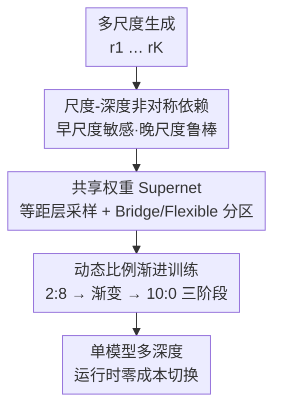

# Progressive Supernet Training for Efficient Visual Autoregressive Modeling

**会议**: CVPR 2026  
**论文**: [CVF Open Access](https://openaccess.thecvf.com/content/CVPR2026/html/Chen_Progressive_Supernet_Training_for_Efficient_Visual_Autoregressive_Modeling_CVPR_2026_paper.html)  
**代码**: 待确认  
**领域**: 模型压缩 / 高效推理 / 视觉自回归生成  
**关键词**: 视觉自回归, supernet, 弹性深度, KV cache, 渐进训练

## 一句话总结
VARiant 发现视觉自回归（VAR）模型存在"尺度-深度非对称依赖"——早期低分辨率尺度极度依赖网络深度、后期高分辨率尺度对深度很鲁棒，据此把一个 30 层 VAR 训成**共享权重的弹性深度 supernet**（早尺度走全网络、晚尺度走 2–16 层子网），再用三阶段动态比例渐进训练打破固定比例的 Pareto 前沿，在 ImageNet 上让 d16/d8 子网几乎不掉点（FID 2.05/2.15 vs 1.95）却省 40–65% 显存。

## 研究背景与动机
**领域现状**：VAR 把图像生成从"next-token"改成"next-scale"——从粗到细逐尺度并行预测多尺度 token 图 $R=(r_1,\dots,r_K)$，把生成压到约 10 步，比扩散（50 步）和传统 AR（100–384 步）快一个数量级，质量也更好。

**现有痛点**：next-scale 范式有个致命的显存问题——生成更细尺度时要保留之前所有尺度的 token，KV cache 随分辨率**平方级**增长，成为部署瓶颈。现有缓解手段各有代价：步级蒸馏（Distilled Decoding）压到 1–2 步但质量大跌；token/cache 级压缩（FastVAR、HACK）能压 50–70% 但需要细粒度 token 操作、实现复杂、部署不灵活；多模型协同（CoDe）让小模型和大模型分管不同尺度，却要**同时部署两个独立模型**、系统复杂度和显存都上去了。

**核心矛盾**：想省显存就得砍计算（减深度/减 token），但 VAR 各尺度对计算量的需求并不均等——一刀切地砍深度会在某些尺度上严重掉质量；而要按尺度差异化分配深度，现有方案又只能靠"多部署几个模型"来实现，把灵活性的代价转嫁成了部署复杂度。

**本文目标**：在**单一模型**内实现尺度级的弹性深度调整——既能按尺度差异化分配算力省显存，又不引入多模型部署的系统复杂度，还要保证全网络和各子网都达到各自最优。

**切入角度**：作者先做实证（Sec 3.2.1）系统测量"网络深度如何影响各尺度的生成质量"，发现一个很强的**尺度-深度非对称依赖**：把 50% 深度的浅子网用在低分辨率尺度 $r_1$–$r_3$ 上，FID 从 1.95 暴涨到 12.91（+10.95），几乎丢光全局语义；但只用在高分辨率尺度 $r_7$–$r_{10}$ 上，FID 仅 5.42（+3.47），而这部分尺度占了 87% 的推理延迟。

**核心 idea**：低分辨率尺度负责全局布局/语义、必须用深网络；高分辨率尺度只是细化局部纹理、可以放心减深度——于是把 VAR 训成一个共享权重 supernet，**早尺度走全网络、晚尺度走浅子网**，用一个模型支持运行时零成本切换深度。

## 方法详解

### 整体框架
VARiant 把一个 $D=30$ 层的 VAR 训练成支持多种深度的 supernet：推理时按"尺度-深度非对称依赖"把 $K$ 个尺度切成两区——**Bridge Zone**（$r_1$–$r_N$）永远用全 $D$ 层保住全局语义，**Flexible Zone**（$r_{N+1}$–$r_K$）在一组离散子网深度 $I_d$（如 16/8/4/2 层）里运行时任选，子网层与全网络**共享同一套权重**，深度就此变成一个实时可调的超参。训练上则用三阶段动态比例渐进策略，让全网络和各子网在共享权重下都收敛到各自最优。最终是一个单模型文件、支持靠层索引零延迟切换深度。

### 关键设计

**1. 尺度-深度非对称依赖：先定位"哪里能砍深度"**

这是整篇方法的实证地基，回答"VAR 到底哪些尺度禁不起减深度"。作者在 ImageNet-256 上把同一个 50% 深度子网分别挂到不同尺度区间，结果差异极大：挂在早尺度 $r_1$–$r_3$ FID 飙到 12.91（+10.95，全局语义近乎崩塌），挂在中尺度 $r_4$–$r_6$ 为 8.5，而挂在晚尺度 $r_7$–$r_{10}$ 只有 5.42（+3.47），却覆盖了 87% 的推理延迟、层级 FLOPs 直降 46.7%。结论很清晰：低分辨率阶段负责搭全局布局与语义结构、**离不开深网络的表征容量**；高分辨率阶段只是精修局部纹理、**对深度天然鲁棒**。这条非对称规律直接决定了后面"早全深、晚浅子网"的分区策略——CoDe 也用过类似性质，但它靠多模型实现，本文要在单模型里吃下这个红利。

**2. 共享权重 Supernet：等距层采样 + 跨尺度深度分配**

针对"差异化分配深度只能靠多模型"的痛点，作者把深度做成单模型内可调超参。**等距层采样**：给定全深 $D$ 和目标子网深 $d$，按 $I_d=\{\lfloor i\cdot(D-1)/(d-1)\rfloor\mid i=0,\dots,d-1\}$ 选激活层，且永远保留首尾层；这样得到的子网是**嵌套**的 $I_{0.25D}\subset I_{0.5D}\subset\{0,\dots,D-1\}$，最大化跨深度的参数共享与知识迁移。**跨尺度深度分配**：第 $k$ 步的激活层集合为 $I_k=\{0,\dots,D-1\}$（若 $k\le N$，Bridge Zone）或 $I_d$（若 $k>N$，Flexible Zone），$d$ 可按延迟/显存/质量预算实时切换。这套设计带来两个隐性好处：子网层与全网络共享权重、协同训练，等于**隐式知识迁移**；被跳过的层仍通过早尺度（Bridge Zone）拿到梯度，实现**跨尺度梯度传播**。部署上则是单文件存储、零加载延迟（靠层索引切深度、不用重载模型）、标准 Transformer 架构跨平台兼容。

**3. 动态比例渐进训练：打破固定比例的 Pareto 前沿**

共享权重会引入优化冲突——只训子网会拖垮全网络、只训全网络又喂不饱子网。作者先用实证说明固定比例（子网采样概率 $p$ 恒定）行不通：$p=0.1$ 全网络 FID 最好（1.96）但子网退化到 2.68，$p=1.0$ 子网升到 2.15 但全网络掉到 2.32，扫遍 $p$ 得到一条平滑 Pareto 前沿——任何固定比例都是妥协。根因是梯度饥饿：$p=1.0$ 时全网络独占层只能从 Bridge Zone（约 30% token）拿梯度、8 个 epoch 后停滞；$p=0.1$ 时浅路径激活太少、子网收敛慢卡在更高 loss（6.08）。而且最优比例**随训练阶段漂移**——早期全网络还不准（FID 3.6–4.6）需要高 $1{-}p$ 打地基，后期全网络已收敛（FID ≤2.2）需要高 $p$ 让子网专门化。于是作者设计三阶段动态比例 $\rho=\text{子网}:\text{全网络}$：

$$\text{Phase 1（联合训练，}\rho=2{:}8\text{）}\;\to\;\text{Phase 2（渐进过渡，}p(ep)=0.2+0.8\cdot\tfrac{ep-E_1}{E_2-E_1}\text{）}\;\to\;\text{Phase 3（子网精调，}\rho=10{:}0\text{）}$$

训练目标是逐尺度交叉熵 $L=\sum_{k=1}^{K}\mathrm{CE}(p_\theta(r_k\mid r_{<k},I_k),r^*_k)$。Phase 1 用小比例联合训练给**所有层**（含子网不选的 Full-only 层）打牢参数地基；Phase 2 让子网采样概率线性升、Flexible Zone 的梯度贡献平滑过渡、避免突变失稳；Phase 3 只训子网，Full-only 层彻底失去 Flexible Zone 的梯度、仅靠 Bridge Zone 维持，但前两阶段的地基让这点偏梯度足以保住全网络质量、同时把算力集中给子网专门化。靠这种"先给所有层喂饱、再把资源逐步挪给子网"的时间维度梯度再分配，全网络和子网得以**同时**逼近最优，打破固定比例的 Pareto 前沿。

### 损失函数 / 训练策略
目标函数即上面的逐尺度交叉熵 $L$。底座为预训练 VAR-d30，经 supernet 训练得到 2/4/8/16/30 层五档配置。三阶段时长：Stage 1 联合训练 5 epoch（2:8），Stage 2 渐进过渡 15 epoch（2:8→10:0），Stage 3 子网精调 5–15 epoch（10:0，越浅子网越需要更长精调）。优化器 AdamW，学习率 $1\times10^{-6}$，batch size 1024，8×H100 训练；采样 top-k=900、top-p=0.96。

## 实验关键数据

### 主实验
ImageNet 256×256 类条件生成，统一以 VAR-d30 为底座、单个 2.0B 模型通过切深度给出多档配置。效率在单张 L20、batch 64 上测（延迟不含 VQVAE 共享开销）：

| 方法 | 步数 | 加速↑ | 延迟↓ | 显存↓ | KV cache↓ | 参数 | FID↓ | IS↑ |
|------|------|-------|-------|-------|-----------|------|------|-----|
| DiT-XL/2 | 50 | – | 19.20s | – | – | 675M | 2.26 | 239 |
| LlamaGen-XXL | 384 | – | 74.27s | – | – | 1.4B | 2.34 | 254 |
| VAR-d30（基线） | 10 | 1.0× | 3.62s | 39265MB | 28677MB | 2.0B | **1.95** | 301 |
| VAR-CoDe（双模型） | 6+4 | 2.9× | 1.27s | 19943MB | 8156MB | 2.0+0.3B | 2.27 | 297 |
| VARiant-d16 | 6+4 | 1.7× | 2.12s | 28644MB | 16092MB | 2.0B | 2.05 | 314 |

注：表中加速/显存为单模型切深度所得；论文正文进一步给出 d8（2.6× 加速、省 65% 显存、FID 2.15）与 d2（3.5× 加速、省 80% 显存、FID 2.67）两档。「KV cache↓」指推理峰值 KV cache 占用，是 VAR 显存瓶颈的直接来源。

### 消融与分析（固定比例 vs 渐进训练）
作者用固定采样比例做对照，凸显渐进训练的必要性（FID 越低越好）：

| 训练比例（子网:全网络） | 全网络 FID | 子网 FID | 说明 |
|--------------------------|-----------|----------|------|
| 1:9（$p=0.1$） | **1.96** | 2.68 | 全网络最优、子网梯度饥饿 |
| 10:0（$p=1.0$） | 2.32 | 2.15 | 子网较好、全网络停滞 |
| 渐进（本文） | ≈1.95 | ≈2.05 | 同时逼近两者最优，打破 Pareto 前沿 |

子网应用尺度的消融（同一 50% 深度子网挂到不同尺度区间）：

| 策略 | 全深尺度 | 子网尺度 | 最终 FID |
|------|----------|----------|----------|
| 全深度 | $r_1$–$r_{10}$ | 无 | 1.95 |
| 早子网 | $r_4$–$r_{10}$ | $r_1$–$r_3$ | 12.91 |
| 中子网 | $r_1$–$r_3,r_7$–$r_{10}$ | $r_4$–$r_6$ | 8.5 |
| 晚子网（本文） | $r_1$–$r_6$ | $r_7$–$r_{10}$ | **5.42** |

### 关键发现
- **晚尺度才是可砍的对象**：把深度省在高分辨率尺度上几乎不掉点（+3.47 FID）却覆盖 87% 延迟，是整套方法收益的来源。
- **固定比例必然妥协**：任何恒定 $p$ 都落在 Pareto 前沿上、无法兼顾全网络与子网；时间维度的动态比例才能同时打满两者。
- **梯度桥是稳定关键**：Bridge Zone 始终给所有层供梯度，使 Phase 3 切到纯子网训练时全网络也不崩。
- **单模型多档部署**：一个 2.0B 模型即可在高质量（d16）到极致效率（d2，省 80% 显存）间运行时切换，相比 CoDe 双模型（2.0+0.3B）省显存且无版本/系统复杂度。

## 亮点与洞察
- **"尺度-深度非对称依赖"是个干净且可操作的观察**：把"VAR 哪里能省算力"从拍脑袋变成可量化的尺度级规律，直接长出"早全深、晚浅子网"的架构，动机非常具体。
- **把 NAS 的 supernet/弹性深度搬到生成模型的尺度轴上**：传统弹性深度按层/样本调，这里按**生成尺度**调，且嵌套子网 + 共享权重让一个模型当多个模型用，零成本运行时切换，部署友好。
- **三阶段动态比例是"时间维度的梯度再分配"**：先喂饱所有层打地基、再把资源逐步挪给子网，用一条平滑 schedule 绕开固定比例的 Pareto 妥协——这个"训练阶段需求会漂移、采样比例就该跟着漂移"的洞察可迁移到任何 weight-sharing 超网训练。
- **跨尺度梯度传播**：被子网跳过的层仍能从 Bridge Zone 的早尺度拿到梯度，避免了"跳过即饿死"，是共享权重能稳的隐性功臣。

## 局限与展望
- 只在 **ImageNet 类条件生成**、单一底座 VAR-d30 上验证，没覆盖文生图/高分辨率/视频等 VAR 变体（Infinity、VARSR 等），泛化性待证。
- 子网深度档（2/4/8/16）与 Bridge/Flexible 分界 $N$ 是经验设定，最优分界点是否随分辨率/数据集变化没充分扫；⚠️ 三阶段时长（尤其 Stage 3 自适应长度）依赖子网收敛观察，调参成本不低。
- 极致档 **d2 质量代价明显**（FID 1.95→2.67/2.97，正文与摘要数值略有出入 ⚠️ 以原文为准），"可用"是相对而言，对质量敏感场景仍需较深档。
- 省的主要是**显存/延迟**，参数量并未减少（仍是 2.0B 单模型）；与 token/cache 级压缩（FastVAR、HACK）是正交方向，论文未做二者组合实验。

## 相关工作与启发
- **vs CoDe（多模型协同）**：CoDe 用小+大双模型分管尺度（2.0+0.3B、FID 2.27、8.2GB），VARiant 用单模型 d4 即达相当质量（FID 2.30、7.2GB）、d8 质量更优（2.15），省显存且无多模型部署复杂度。
- **vs 步级蒸馏（Distilled Decoding）**：后者压到 1–2 步但质量大跌；VARiant 不减步数、减的是后期尺度的网络深度，质量损失小得多。
- **vs token/cache 级压缩（FastVAR、HACK）**：它们压 50–70% KV cache 但需细粒度 token 操作、部署复杂；VARiant 靠"切深度"省显存，实现更简单、可运行时切换，且与 token 压缩正交可叠加。
- **vs NAS 的权重共享 supernet（SPOS、OFA）**：同样训一个超网采子网，但 VARiant 的子网选择沿**生成尺度**做差异化分配、并针对生成质量设计三阶段动态比例训练，而非传统的分类精度导向单阶段联合训练。

## 评分
- 新颖性: ⭐⭐⭐⭐ "尺度-深度非对称依赖"观察 + 尺度轴弹性深度 supernet + 动态比例渐进训练，组合新颖且自洽；单个组件（弹性深度、超网）非首创。
- 实验充分度: ⭐⭐⭐⭐ 效率-质量权衡、固定比例消融、子网尺度消融都到位；但只在 ImageNet 单底座，缺文生图/跨数据集验证。
- 写作质量: ⭐⭐⭐⭐ 观察→架构→训练三段递进清晰，图表支撑足；个别数值（d2 的 FID）正文与摘要略有出入。
- 价值: ⭐⭐⭐⭐⭐ 单模型多档部署、零成本切深度、省 40–80% 显存几乎不掉点，对 VAR 落地部署很实用。

<!-- RELATED:START -->

## 相关论文

- [\[CVPR 2026\] Balanced Dataset Distillation via Modeling Multiple Visual Pattern Distribution](balanced_dataset_distillation_via_modeling_multiple_visual_pattern_distribution.md)
- [\[CVPR 2026\] VVS: Accelerating Speculative Decoding for Visual Autoregressive Generation via Partial Verification Skipping](vvs_accelerating_speculative_decoding_for_visual_autoregressive_generation_via_p.md)
- [\[ICLR 2026\] PTQ4ARVG: Post-Training Quantization for AutoRegressive Visual Generation Models](../../ICLR2026/model_compression/ptq4arvg_post-training_quantization_for_autoregressive_visual_generation_models.md)
- [\[ICCV 2025\] FastVAR: Linear Visual Autoregressive Modeling via Cached Token Pruning](../../ICCV2025/model_compression/fastvar_linear_visual_autoregressive_modeling_via_cached_token_pruning.md)
- [\[CVPR 2026\] QVGGT: Post-Training Quantized Visual Geometry Grounded Transformer](qvggt_post-training_quantized_visual_geometry_grounded_transformer.md)

<!-- RELATED:END -->
