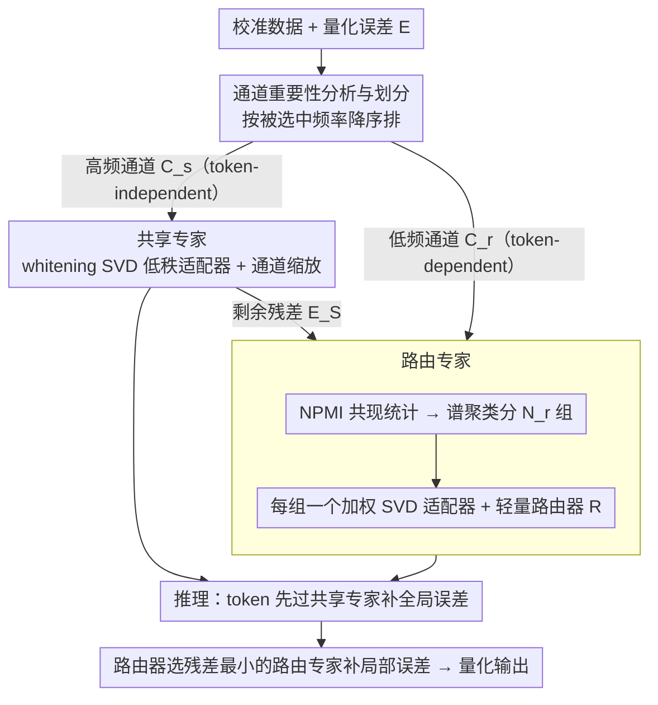

# Quant Experts: Token-aware Adaptive Error Reconstruction with Mixture of Experts for Large Vision-Language Models Quantization

**会议**: CVPR 2026  
**arXiv**: [2602.24059](https://arxiv.org/abs/2602.24059)  
**代码**: 无  
**领域**: 模型压缩 / VLM 量化  
**关键词**: post-training quantization, VLM, MoE, token-aware, low-rank adapter, channel importance

## 一句话总结

提出 Quant Experts (QE)，一种基于 Mixture-of-Experts 的 token 感知自适应量化误差重建框架——将重要通道分为 token-independent（高频出现、全局性）和 token-dependent（低频出现、局部性）两组，分别用共享专家和路由专家的低秩适配器来补偿全局和局部量化误差，在 W4A6 到 W3A16 的多种量化设置下一致提升 VLM 性能。

## 研究背景与动机

**领域现状**：Post-Training Quantization (PTQ) 是降低大型视觉语言模型（VLM）计算和内存开销的关键技术。现有方法包括通道平滑（SmoothQuant、AWQ）、混合精度（SpQR）、Hessian 优化（GPTQ）和低秩重建（LQER、ASER）。在多模态场景中，MBQ 揭示了跨模态通道敏感性差异并提出模态感知的通道缩放策略。

**现有痛点**：(1) 通道平滑方法（SmoothQuant/AWQ）使用从校准数据估计的固定缩放系数，对所有 token 一视同仁，无法捕捉 token 级的通道重要性变化；(2) 静态低秩重建（LQER/ASER）用单一全局适配器统一处理所有重要通道，忽略了通道重要性的动态性；(3) 模态感知方法（MBQ）虽区分了跨模态差异，但仍使用静态通道缩放，未考虑同一模态内不同 token 之间的通道重要性波动。

**核心矛盾**：重要通道的位置不是静态的——它们不仅在跨模态间迁移，更关键的是在同一模态的不同 token 之间也发生显著变化（由于 token 语义和上下文信息的差异导致激活分布改变）。全局固定的通道识别和补偿策略从根本上无法捕捉这种 token 级别的动态性。

**本文目标**：设计一种能同时处理全局一致（token-independent）和局部动态（token-dependent）量化误差的框架，精确补偿不同 token 面临的不同量化损失。

**切入角度**：将重要通道按出现频率分为两组——高频出现的 token-independent 通道用共享专家全局补偿，低频出现的 token-dependent 通道按共现模式聚类后用路由专家动态补偿。

**核心 idea**：借鉴 MoE 思想，用"共享专家+路由专家"的二级结构分别补偿量化时的全局误差和 token 依赖的局部误差。

## 方法详解

### 整体框架

QE 想解决的是一个被以往量化方法忽略的事实：决定量化误差大小的"重要通道"并不固定，它会随每个 token 的语义和上下文漂移。于是 QE 不再用一套全局适配器去补所有 token 的误差，而是借 MoE 的思路把误差补偿拆成两层。离线阶段，它先从校准数据里统计每个通道被判为"重要"的频率，把通道分成两堆：少数高频、几乎对每个 token 都重要的 token-independent 通道，和大量低频、只对部分 token 重要的 token-dependent 通道。前一堆交给一个**共享专家**做全局补偿，后一堆按"哪些通道常一起重要"聚成若干子组，每组配一个**路由专家**做局部补偿。推理时，token 先过共享专家修掉全局误差，再由一个轻量路由器根据当前 token 挑出残差最小的那个路由专家把局部误差补掉。

### 关键设计

**1. 通道重要性分析与划分：把"重要通道随 token 漂移"这件事量化成频率分布**

固定缩放系数（SmoothQuant/AWQ）和单一全局适配器（LQER/ASER）之所以失效，是因为它们默认重要通道是静态的；而 QE 的出发点正是先把"漂移"测出来。对每个 token $x_t$，它结合权重的逐行均值 $\mathbf{w} = \text{Mean}_{\text{row}}(|\mathbf{W}_f|)$，取激活与权重逐元素相乘后最大的若干维作为该 token 的重要通道集合 $\mathcal{C}_t = \text{Top-}k(|x_t| \odot \mathbf{w})$。把所有 token 的 $\mathcal{C}_t$ 累计起来，就能算出每个通道被选中的频率 $f_c = k \times \frac{m_c}{\sum_i m_i}$。按频率降序排，最靠前的 $k$ 个通道在几乎每个 token 上都被选中——它们是全局误差源，归为 token-independent 集合 $\mathcal{C}_s$；后面 $N_r \times k$ 个通道只在部分 token 上现身，归为 token-dependent 集合 $\mathcal{C}_r$。这个划分不是拍脑袋设的，而是直接对应观察到的现象：只有极少数通道对所有 token 一致重要，剩下的重要性强烈依赖输入。

**2. 共享专家（Shared Expert）：用一个全局低秩适配器一次性补掉高频通道的误差**

既然 token-independent 通道对每个 token 都重要、贡献了量化误差的主体，它就值得一份专属的高精度补偿。共享专家把这些通道从直接量化中豁免出来，对它们的量化误差做 whitening SVD，分解成一对低秩适配器 $(\mathbf{L}_{SA}^l, \mathbf{L}_{SB}^l)$ 来重建——这沿用了 LQER/ASER 用低秩矩阵逼近误差的思路。同时它对这些通道做通道缩放：把激活里的异常值幅度压下去、等比放大对应权重，这样权重侧和激活侧的量化误差被一起抑制。共享专家补完之后并不会把误差清零，剩下的残差 $\mathbf{E}_S^l = \mathbf{E}^l - \mathbf{L}_{SA}^l \mathbf{L}_{SB}^l$ 被交给下一层的路由专家继续精修，两级补偿因此是串联而非并列。

**3. 路由专家（Routed Experts）：按"通道共现模式"分组，再让路由器为每个 token 挑专家**

理想做法是给每个 token 量身定做一套局部补偿，但 token 的组合是无穷的，没法逐一建适配器。QE 的折中是：先看哪些 token-dependent 通道总是"结伴重要"，把它们归到一起共用一个专家。具体做法是统计共现——$\mathcal{O}_{t,i}^l = \mathbf{1}(c_i \in \mathcal{C}_r^l \cap \mathcal{A}_t^l)$ 记录通道 $c_i$ 是否在 token $t$ 上同时落入重要集合，再用 NPMI（归一化逐点互信息）$\mathbf{S}_{i,j} = (\log\frac{p(i,j)}{p(i)p(j)}) / -\log p(i,j)$ 衡量两通道关联强度，NPMI 比单纯计数更能把"恰好同时高"和"真有共现规律"区分开。拿到关联矩阵后用谱聚类（归一化 Laplacian 特征分解再 K-Means）把通道分成 $N_r$ 个子组，每组配一个路由专家、用加权 SVD 重建该组通道的残差。推理时轻量路由器 $\mathbf{R}^l$ 看一眼输入 token，预测每个专家能消掉多少残差，激活残差最小的那一个。于是有限的 $N_r=8$ 个专家就近似覆盖了千变万化的 token 局部误差，而每个 token 只额外付出"过一个低秩适配器"的代价。

### 一个完整示例：一个 token 怎么被两级专家补偿

取某一层、设 $k=32$、$N_r=8$。先看离线阶段：在 128 个校准图文对上跑一遍，统计出比如前 32 个通道（如某些承载全局语义的高激活维）几乎对每个 token 都进 Top-32，它们被划为 $\mathcal{C}_s$ 交给共享专家；其余被频繁但非全员选中的 $8\times32=256$ 个通道划为 $\mathcal{C}_r$，按 NPMI 共现谱聚类分成 8 组，每组配一个路由专家。

再看推理时一个具体 token——比如一张表格图里某个数字 patch 的视觉 token：它先过共享专家，那 32 个全局通道的量化误差被 $(\mathbf{L}_{SA}, \mathbf{L}_{SB})$ 低秩重建掉，激活异常值也被通道缩放压平，得到残差 $\mathbf{E}_S$。接着路由器读这个 token 的激活，发现它在"细粒度纹理"那一组通道上残差最大，于是从 8 个路由专家里激活对应的那一个，用该组的加权 SVD 适配器把局部误差补上。换成另一个 token——比如一段描述文字的 text token——它在共享专家这步走的路一样，但路由器会挑出另一个偏"语言通道"的专家。整条链路里共享专家始终在岗（保证全局稳定），路由专家逐 token 切换（保证局部精确），这正是消融实验中"去掉任一方都掉点"的来源。

### 损失函数 / 训练策略

QE 的核心流程（通道划分、SVD 分解、聚类）为离线计算，无需端到端训练。可选的轻量精化策略：仅训练路由专家 $(\mathbf{L}_{RA}^l, \mathbf{L}_{RB}^l)$ 和路由器 $\mathbf{R}^l$，其余参数冻结。逐层精化（非端到端），16 epoch × 100 iterations，AdamW（lr=$1 \times 10^{-4}$），余弦退火调度。校准集：ShareGPT4V 增强的 COCO Caption 数据集中随机采样 128 个图文对。总 SVD 秩固定为 64，共享专家和路由专家各分 32。$k=32$ 个重要通道，$N_r = 8$ 个路由专家。

## 实验关键数据

### 主实验（Qwen2VL-2B，11 个多模态基准平均准确率）

| 方法 | #W | #A | MMMU | OCRBench | ScienceQA | TextVQA | 平均 |
|------|----|----|------|----------|-----------|---------|------|
| 全精度 | 16 | 16 | 39.89 | 74.90 | 76.96 | 77.72 | 62.97 |
| RTN | 4 | 6 | 34.00 | 59.80 | 64.70 | 67.58 | 53.62 |
| SmoothQuant | 4 | 6 | 30.44 | 59.60 | 65.25 | 65.88 | 50.27 |
| LQER | 4 | 6 | 33.00 | 65.80 | 68.32 | 69.37 | 55.92 |
| MBQ | 4 | 6 | 34.44 | 61.10 | 67.08 | 69.45 | 54.73 |
| **QE** | **4** | **6** | **33.78** | **68.20** | **71.84** | **73.18** | **58.74** |

Qwen2VL-72B 关键结果：

| 设置 | 方法 | MMMU | OCRBench | ScienceQA | TextVQA | VizWiz |
|------|------|------|----------|-----------|---------|--------|
| FP16 | - | 61.44 | 78.70 | 91.22 | 82.26 | 76.27 |
| W4A6 | MBQ | 52.67 | 69.70 | 86.32 | 76.08 | 67.99 |
| W4A6 | **QE** | **58.11** | **76.60** | **90.33** | **79.27** | **73.91** |

### 消融实验

各组件贡献（Qwen2VL-2B，W4A6）：

| 设置 | 组件 | MMMU↑ | ScienceQA↑ |
|------|------|-------|-----------|
| FP16 | - | 39.89 | 76.95 |
| W4A6 | 仅路由专家 (REs) | 34.56 | 68.72 |
| W4A6 | 仅共享专家 (SE) | 35.22 | 69.61 |
| W4A6 | SE + 随机路由 | 35.89 | 70.00 |
| W4A6 | SE + 随机聚类 | 35.33 | 69.71 |
| W4A6 | **QE (SE+REs)** | **36.89** | **70.85** |

### 关键发现

- 在最具挑战性的 W4A6 设置下，QE 在 Qwen2VL-2B 上比 MBQ 高 4.01%，仅比全精度低 4.23%
- 在 Qwen2VL-72B W4A6 上，QE 实现 5.09% 的准确率提升（vs MBQ），几乎追平全精度
- 去除任一专家都导致性能下降：共享专家对全局稳定性更重要，路由专家对特定 token 的精确补偿更关键
- 随机路由 vs 自适应路由：随机路由（35.89）低于 QE（36.89），验证了路由器的自适应选择能力
- 随机聚类 vs 共现聚类：随机聚类（35.33）低于 QE（36.89），验证了基于 NPMI 的谱聚类对通道关联建模的有效性
- MBQ 的分布重塑在 weight-only 量化（W3A16）下对 AWQ 改进有限，因为通道重要性动态太强
- 在 InternVL2-8B W4A6 上 QE 平均准确率 68.13，比 LQER（65.29）和 MBQ（65.00）显著提升

## 亮点与洞察

- **观察驱动设计**：两个关键观察（重要通道位置跨 token 变化、频率分布不均匀）直接驱动了方法设计——共享专家对应高频全局通道，路由专家对应低频局部通道，逻辑链条清晰
- **MoE 在量化中的创新应用**：将 MoE 的"共享+路由"范式迁移到量化误差补偿中，不同于传统 MoE 用于增加模型容量，这里用于适应量化误差的 token 级动态性
- **NPMI 谱聚类**：用归一化逐点互信息量化通道共现关联，比简单聚类方法更能捕捉通道间的语义关联模式
- **从 2B 到 72B 一致有效**：方法在 2B、7B、8B、72B 四种规模上都持续改进，显示了良好的可扩展性

## 局限与展望

- 路由专家数量 $N_r=8$ 和重要通道数 $k=32$ 为固定超参数，可能对不同模型和层需要差异化选择
- 额外引入了 $N_r$ 个低秩适配器和路由器，增加了推理时的参数量和计算开销（虽然总秩预算不变）
- 聚类和 SVD 分解在每层独立进行，未考虑跨层的通道重要性关联
- 校准集大小仅 128 个样本，对于超大模型（72B）的通道频率估计可能不够鲁棒
- 可选的精化策略需要额外训练时间，且精化效果未在消融实验中单独展示

## 相关工作与启发

- **LQER (ICML'24)**：低秩重建量化误差的先驱，QE 在此基础上引入了 token 感知的动态分组
- **MBQ (CVPR'25)**：揭示了跨模态通道敏感性差异，但仍用静态缩放；QE 进一步发现了同模态内的 token 级动态
- **SmoothQuant (ICML'23)**：通道缩放的经典方法，QE 的共享专家在此基础上增加了低秩重建
- 启发：量化误差补偿从"全局统一"到"模态感知"再到"token 感知"的演进路线，每一步的精细化都带来显著收益——下一步可能是"position-aware"或"attention-aware"

## 评分

- **新颖性**: ⭐⭐⭐⭐（MoE 用于量化误差补偿是新颖的视角，token 级通道动态性的观察有价值）
- **实验充分度**: ⭐⭐⭐⭐⭐（5 种模型规模，11 个基准，3 种量化设置，组件消融完整）
- **写作质量**: ⭐⭐⭐⭐（观察→动机→方法的逻辑链清晰，可视化辅助理解到位）
- **价值**: ⭐⭐⭐⭐（VLM 量化是实际部署的关键问题，72B 模型上的 5% 提升有工程意义）

<!-- RELATED:START -->

## 相关论文

- [\[ICLR 2026\] Unveiling Super Experts in Mixture-of-Experts Large Language Models](../../ICLR2026/model_compression/unveiling_super_experts_in_mixture-of-experts_large_language_models.md)
- [\[CVPR 2026\] Teacher-Guided Routing for Sparse Vision Mixture-of-Experts](teacher-guided_routing_for_sparse_vision_mixture-of-experts.md)
- [\[CVPR 2026\] Enhancing Mixture-of-Experts Specialization via Cluster-Aware Upcycling](enhancing_mixture_of_experts_specialization_via_cluster_aware_upcycling.md)
- [\[CVPR 2026\] Hybrid Token Compression for Vision-Language Models](hybrid_token_compression_for_vision-language_models.md)
- [\[CVPR 2026\] Rethinking Token Reduction for Large Vision-Language Models](rethinking_token_reduction_for_large_vision-language_models.md)

<!-- RELATED:END -->
