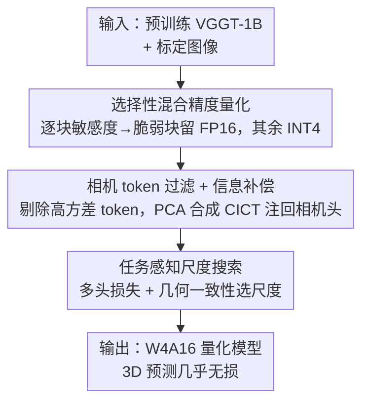

# QVGGT: Post-Training Quantized Visual Geometry Grounded Transformer

**会议**: CVPR 2026  
**arXiv**: [2605.31124](https://arxiv.org/abs/2605.31124)  
**代码**: https://ddsacu.github.io/QVGGT/ (项目主页)  
**领域**: 模型压缩 / 3D视觉  
**关键词**: 后训练量化, VGGT, 混合精度, 相机 token, 几何一致性

## 一句话总结
针对 1.26B 参数的前馈 3D 重建模型 VGGT，本文提出一套几何感知的后训练量化框架 QVGGT，用"逐块敏感度混合精度 + 相机 token 过滤补偿 + 任务感知尺度搜索"三步，在 W4A16 下做到几乎无损（CO3Dv2 相机位姿 AUC@30 89.4 vs FP16 89.5），同时内存降 3∼4.9×、最高 2.8× 硬件加速。

## 研究背景与动机
**领域现状**：从图像直接回归 3D 属性的前馈方法（DUSt3R、MASt3R）正在取代传统 SfM/MVS 的迭代优化流程。VGGT 是这条路线的集大成者：一次前向就能同时预测相机参数、深度图和点云图，把多视图 3D 感知统一进单个 transformer。

**现有痛点**：VGGT 有 12.6 亿参数，显存占用和算力需求很高，无法部署到无人机、移动 AR 这类边缘设备上。模型压缩里剪枝和蒸馏对现代硬件的实际加速有限，而量化能同时压缩体积和提速——但**把量化用到大规模 3D 重建 transformer 上几乎是空白**。

**核心矛盾**：直接把 LLM/ViT 上成熟的 PTQ 方法（GPTQ、AWQ、SmoothQuant）搬到 VGGT 会严重掉点（AWQ 在 W4A16 下 CO3Dv2 AUC@30 从 89.5 崩到 54.6）。根因是 3D 几何 transformer 有它独特的结构：① 各 transformer block 对量化的敏感度高度不均；② 相机 token 和 register token 的激活幅值异常大，会主导量化尺度估计；③ 标准的逐层重建误差并不等价于下游 3D 几何质量。

**本文目标 / 核心 idea**：不把 VGGT 当成普通 transformer 一刀切量化，而是**从几何感知的角度**逐个拆解这三个结构特性——哪块脆弱就给哪块留高精度、把作怪的相机 token 从标定里剔除再补回它的几何信息、用多头任务损失+跨头几何一致性来选量化尺度，让量化目标对齐 3D 重建质量。

## 方法详解

### 整体框架
QVGGT 是一个三阶段的 weight-only 后训练量化流水线（本文聚焦权重量化、激活保持浮点，默认 W4A16、per-group）。输入是预训练好的 VGGT-1B 和一小批标定图像，输出是一个量化后、3D 预测头精度几乎无损的轻量模型。三个阶段层层递进：先做**逐块敏感度分析**决定哪些 block 用 FP16、哪些压到 INT4；再处理 calibration 阶段的**相机/register token 异常激活**，把它们过滤掉做尺度搜索、同时合成一个补偿 token 在推理时注回相机头；最后用**任务感知的尺度搜索**替换原本的逐层重建目标，把多头损失和跨头几何一致性纳入尺度选择。

### 关键设计

**1. 选择性混合精度量化：脆弱的块单独留高精度**

作者先做了一个细粒度的逐块敏感度分析：单独量化某一个 Alternating-Attention（AA）block，观察它对下游各预测头的精度冲击。结论很反直觉——**相机头对块精度的依赖最强也最不稳定**，某些块一旦量化会让相机位姿误差暴涨，而深度头和点云头相对稳健。进一步分析线性层粒度发现，attention projection 层敏感度最低、FFN 第一层最高。基于这套敏感度排序，作者把第 14、17、23 个 frame block 和第 23 个 global block 判定为脆弱块，对它们**只量化 attention projection 层、其余层保持 FP16**；其余健壮的块整体做 INT4 量化。这样既最大化压缩率，又把量化误差挡在最敏感的那几块之外，而不是对全部 AA block 一刀切（一刀切会让 CO3Dv2 AUC@30 直接崩到 54.57）。

**2. 相机 token 过滤 + 信息补偿（CIC）：把作怪的异常 token 请出标定、再把它的几何信息请回来**

敏感度分析暴露了相机头特别脆弱，作者顺藤摸瓜可视化激活，发现罪魁是**相机 token（相机头的唯一输入）和 register token**：它们在多个敏感层里的激活幅值远超 image token，后者紧凑地聚在均值附近。问题在于激活感知量化的尺度 $s$ 是按激活分布优化的，目标是最小化 $\mathcal{L}(s)=\lVert Q(W\operatorname{diag}(s))\operatorname{diag}(s)^{-1}X-WX\rVert$，其中 $X=[t_C;t_R;t_I]$ 拼接了相机、register、image 三类 token。当相机/register token 幅值畸大，优化就被这一小撮极端激活"绑架"，尺度向它们倾斜、其余通道量化分辨率被拉粗，整体量化误差被放大。

解法分两步。**过滤**：标定阶段只用 image token 统计激活、做尺度搜索，让最优 $s^*$ 反映多数 token 的真实动态范围，不被少数极端值拖偏。**补偿（CICT）**：直接剔除相机 token 会丢掉相机头依赖的全局几何线索，所以作者从标定集的相机 token 分布里合成一个补偿 token。具体是对中心化后的相机 token 矩阵 $X_c$ 取 top-$K$ 主成分 $U_K$，把每个样本投影 $z^{(i)}=U_K^\top(x_c^{(i)}-\mu)$，取均值投影 $\bar z$ 重建 $\tilde x_{\text{CICT}}=\mu+U_K\bar z$，再把它的范数归一化到 patch token 的平均 L2 范数 $x_{\text{CICT}}=\tilde x_{\text{CICT}}\cdot\overline{\lVert x_p\rVert_2}/\lVert\tilde x_{\text{CICT}}\rVert_2$，保证注入后注意力幅值兼容。推理时把这个低方差、数据集级的全局几何先验 token 追加到序列末尾、送进相机头。本质是"尺度估计时把异常 token 当噪声去掉，推理时再以稳定形式把它的有用信息补回来"。

**3. 任务感知尺度搜索：用 3D 任务质量而非逐层重建误差来选尺度**

标准激活感知量化是按"量化后逐层输出重建误差最小"来选每通道/每组尺度 $s$，但逐层数值保真不等于下游 3D 属性准确——VGGT 里相机位姿、深度、点云通过严格几何关系互相耦合。作者因此把尺度选择的监督换成任务级目标，由两部分组成。**多头损失**：用 VGGT 三个头的预测与 GT 算 $L_{\text{camera}}$（Huber 损失 $\lVert\cdot\rVert_\varepsilon$）、$L_{\text{depth}}$、$L_{\text{point}}$（后两者按预测不确定图 $\hat\Sigma$ 逐元素加权）。**几何一致性损失**：利用 VGGT 头间的天然冗余——用预测深度 $\mathbf D$、内参 $\mathbf K$、外参 $\mathbf E=(\mathbf R,\mathbf t)$ 把深度反投影成点云 $\mathbf W^{\text{proj}}$，要求它和点云头直出的 $\mathbf W^{\text{direct}}$ 一致：$\mathcal{L}_{\text{geom}}=\frac{1}{|\Omega|}\sum_{(u,v)\in\Omega}\lVert\mathbf W^{\text{direct}}-\mathbf W^{\text{proj}}\rVert_2$。最终目标 $L_{\text{task}}(s)=L_{\text{recon}}+L_{\text{camera}}+\alpha L_{\text{depth}}+\beta L_{\text{point}}+L_{\text{geo}}$，因三个头损失数值量级相近故取 $\alpha=\beta=1$。沿用 AWQ 的轻量网格搜索范式遍历候选尺度，只是把重建目标替换成这个任务感知目标，从而把尺度选择推向"保住跨头 3D 结构一致性"的解。

### 损失函数 / 训练策略
全程**无训练成本**（纯 PTQ）。标定与尺度搜索在 RTX 4090（24GB）上完成，标定数据采样自 CO3Dv2 和 ScanNet（RealEstate10K 不参与标定，用于验证跨数据集泛化）。量化采用对称均匀量化 $Q(w)=\Delta\cdot\text{Round}(w/\Delta)$、$\Delta=\max(|w|)/2^{N-1}$，配置为 W4A16 + per-group 权重量化。任务感知目标 $L_{\text{task}}$ 仅用于网格搜索选尺度，不更新权重。

## 实验关键数据

### 主实验

相机位姿估计（每场景随机 10 帧，AUC@30 越高越好）：

| 方法 | W/A | CO3Dv2 AUC@30 | Re10K AUC@30 | CO3Dv2 延迟 |
|------|-----|---------------|--------------|-------------|
| Baseline | FP16 | 89.5 | 85.3 | 0.38s |
| SmoothQuant | W8A8 | 87.9 | 81.3 | 0.62s |
| QuantVGGT | W4A16 | 89.2 | 84.4 | - |
| GPTQ | W4A16 | 76.9 | 75.6 | 0.28s |
| AWQ | W4A16 | 54.6 | 59.2 | 0.28s |
| **QVGGT** | W4A16 | **89.4** | **85.0** | **0.23s** |

通用 PTQ 方法在 W4A16 下崩盘（AWQ 仅 54.6），凸显直接迁移标准量化的困难；QVGGT 几乎无损，且延迟最低（0.23s）。

3D 重建（点云图，7-Scenes / NRGBD，Acc/Comp 越低越好、NC 越高越好）：

| 方法 | W/A | 7-Scenes Acc↓ | 7-Scenes NC↑ | NRGBD Acc↓ | NRGBD NC↑ |
|------|-----|---------------|--------------|------------|-----------|
| Baseline | FP16 | 0.030 | 0.847 | 0.024 | 0.922 |
| SmoothQuant | W8A8 | 0.067 | 0.702 | 0.062 | 0.769 |
| GPTQ | W4A16 | 0.051 | 0.802 | 0.053 | 0.872 |
| AWQ | W4A16 | 0.043 | 0.819 | 0.047 | 0.891 |
| **QVGGT** | W4A16 | **0.031** | **0.849** | **0.029** | **0.925** |

QVGGT 在两个数据集上都与 FP16 基线几乎持平（NRGBD NC 甚至 0.925 vs 0.922），远超通用量化方法。

### 消融实验

逐组件消融（Q=朴素全量化, S=选择性混合精度, D=token 过滤+补偿, T=任务感知尺度搜索）：

| Q | S | D | T | CO3Dv2 AUC@30↑ | NRGBD Acc Mean↓ |
|---|---|---|---|----------------|------------------|
| ✓ | – | – | – | 54.57 | 0.122 |
| – | ✓ | – | – | 80.76 | 0.057 |
| – | ✓ | ✓ | – | 85.91 | 0.054 |
| – | ✓ | ✓ | ✓ | **89.39** | **0.029** |

标定图像数量鲁棒性：

| 标定图像数 | CO3Dv2 AUC@30↑ | NRGBD Acc Mean↓ |
|-----------|----------------|------------------|
| 16 | 87.86 | 0.035 |
| 32 | 89.17 | 0.032 |
| 128 | 89.39 | 0.029 |

### 关键发现
- **混合精度贡献最大**：朴素全量化 AUC@30 仅 54.57，加上选择性混合精度直接跳到 80.76（+26 点），证明"块敏感度异质性 + 保护关键层"是量化 VGGT 的头号障碍。
- **三个组件层层叠加均有效**：token 过滤补偿再 +5 点（85.91），任务感知尺度搜索再 +3.5 点到 89.39，NRGBD Acc 同步从 0.054 降到 0.029。
- **对标定集规模不敏感**：16→128 张图性能仅微动（87.86→89.39），说明 QVGGT 不依赖大标定集就能拿到可靠激活统计，部署很实用。
- **跨数据集泛化**：RealEstate10K 不参与标定仍达 85.0（FP16 为 85.3），说明增益来自几何感知设计而非量化机制差异。

### 效率
- 显存：单帧输入下峰值显存降 4.9×；30 帧（FP16 几乎打满 24GB）时仍降 3.7×，说明量化不仅压参数还缓解了随帧数增长的激活显存。
- 延迟（2 帧，归一化）：相对 FP16 内存降 2.11×、延迟提速 1.93×；摘要给出相对 FP32 整体 3∼4.9× 显存降、最高 2.8× 实际硬件加速。

## 亮点与洞察
- **"敏感度先于策略"的诊断式量化**：先做逐块/逐层敏感度分析，把"哪块脆弱"量化成可操作的混合精度配方，而不是预设一个统一 bit 宽。这种"先体检再下药"的思路可迁移到任何多头/多任务大模型的压缩。
- **相机 token 的双面处理很巧**：把同一个 token 在"标定"和"推理"两个阶段区别对待——标定时它是污染尺度估计的离群噪声要剔除，推理时它携带的全局几何线索又必须补回。用 PCA 提炼出一个低方差的数据集级补偿 token（CICT），是"去噪不丢信息"的优雅折中。
- **用模型自身的几何冗余当量化监督**：VGGT 训练时点云头与"深度+位姿反投影"本是冗余设计，本文把这份冗余反过来当成跨头一致性约束来选量化尺度，几乎零额外成本地让量化目标对齐 3D 质量。这个"复用任务内在约束当压缩信号"的范式很有启发。

## 局限性 / 可改进方向
- **weight-only / W4A16 局限**：本文只量化权重、激活保持 FP16，未覆盖更激进的低比特激活量化（W4A4）或更极端 bit 宽；与 QuantVGGT 的 W8A8 在不同配置下比较，部分结论不完全可直接对齐。
- **混合精度依赖人工阈值**：脆弱块（14/17/23 frame、23 global）是基于敏感度分析手工选定的，换骨干或换数据集时是否需要重新分析、能否自动化，文中未深入。
- **几何一致性损失需要 GT**：任务感知尺度搜索的多头损失依赖标定集的相机/深度/点云 GT，对缺少几何标注的场景适配性待验证；几何一致性损失本身可无标注，但多头损失不行。
- **加速主要来自带宽**：W4A16 的提速源于权重内存带宽压力下降，对计算密集环节增益有限，2.8× 加速是相对 FP32 的上界。

## 相关工作与启发
- **vs QuantVGGT（并行工作）**：两者都研究 VGGT 的 PTQ。QuantVGGT 偏通用数值稳定（离群值分散、激活平滑）；QVGGT 是几何感知设计——不把相机 token 单纯当离群值剔除，而是用 CIC 显式补回其对相机预测的贡献，并用多头几何一致性引导尺度搜索。匹配 bit 宽下 QVGGT 相机位姿（CO3Dv2 89.4 vs 89.2、Re10K 85.0 vs 84.4）略优。
- **vs AWQ / GPTQ / SmoothQuant**：这些是为 LLM/ViT 设计的通用 PTQ，迁移到 VGGT 严重掉点（AWQ W4A16 仅 54.6）。QVGGT 沿用了 AWQ 的轻量网格搜索范式，但把重建目标替换成任务感知目标，并叠加混合精度与 token 补偿，针对 3D transformer 的结构特性专门设计。
- **vs DUSt3R / MASt3R / VGGT**：这些是被压缩的上游 3D 重建模型，本文不改其架构、只做无训练成本的量化部署，让前馈 3D 重建在边缘设备上可行。

## 评分
- 新颖性: ⭐⭐⭐⭐ 首批针对 3D 几何 transformer 的 PTQ 之一，三个组件都紧扣 VGGT 的结构特性，但混合精度/任务感知尺度搜索沿用了已有范式。
- 实验充分度: ⭐⭐⭐⭐ 覆盖 4 个 benchmark、两类任务、逐组件消融与标定规模鲁棒性齐全，但激活量化与更极端 bit 宽未探。
- 写作质量: ⭐⭐⭐⭐ 动机—诊断—方法逻辑清晰，三步设计各有图佐证。
- 价值: ⭐⭐⭐⭐ 让 1.2B 的 VGGT 在 24GB 消费级 GPU 上近乎无损跑通，对边缘端 3D 感知部署有直接实用价值。

<!-- RELATED:START -->

## 相关论文

- [\[ICLR 2026\] PTQ4ARVG: Post-Training Quantization for AutoRegressive Visual Generation Models](../../ICLR2026/model_compression/ptq4arvg_post-training_quantization_for_autoregressive_visual_generation_models.md)
- [\[ACL 2026\] Task-Stratified Knowledge Scaling Laws for Post-Training Quantized LLMs](../../ACL2026/model_compression/task-stratified_knowledge_scaling_laws_for_post-training_quantized_large_languag.md)
- [\[CVPR 2026\] Progressive Supernet Training for Efficient Visual Autoregressive Modeling](progressive_supernet_training_for_efficient_visual_autoregressive_modeling.md)
- [\[CVPR 2026\] VLM-PTQ: Efficient Post-Training Quantization for Large Vision-Language Models](vlm-ptq_efficient_post-training_quantization_for_large_vision-language_models.md)
- [\[CVPR 2026\] CAR-SAM: Cross-Attention Reconstruction for Post-Training Quantization of the Segment Anything Model](car-sam_cross-attention_reconstruction_for_post-training_quantization_of_the_seg.md)

<!-- RELATED:END -->
