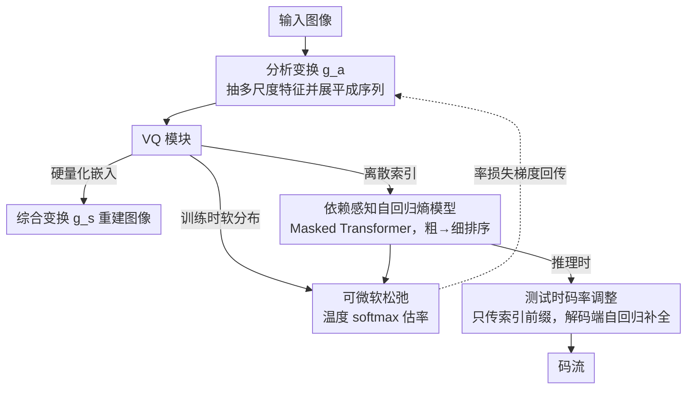

# RDVQ: Differentiable Vector Quantization for Rate-Distortion Optimization of Generative Image Compression

**会议**: CVPR 2026 Oral  
**arXiv**: [2604.10546](https://arxiv.org/abs/2604.10546)  
**代码**: [https://github.com/CVL-UESTC/RDVQ](https://github.com/CVL-UESTC/RDVQ)  
**领域**: 图像压缩/恢复  
**关键词**: 向量量化, 率失真优化, 生成式图像压缩, 熵模型, 可微松弛

## 一句话总结
RDVQ 通过对码本分布的可微松弛，首次实现了 VQ-based 图像压缩的端到端率失真联合优化，在极低码率下以不到 20% 的参数量取得了优于或竞争性的感知质量。

## 研究背景与动机

**领域现状**：学习型图像压缩主要用标量量化（SQ），可微近似（如加噪/STE）使梯度能回传到编码器，实现端到端率失真优化。向量量化（VQ）能保留更好的结构信息和感知质量，特别适合极低码率。

**现有痛点**：VQ 的离散最近邻分配阻断了率损失到编码器的梯度传播。编码器诱导的隐式先验分布无法被率目标直接优化，导致表示学习和熵模型之间根本性脱耦。

**核心矛盾**：VQ 在重建质量上有优势，但无法像 SQ 那样进行端到端率失真联合优化，只能靠调码本大小、选择性传输等启发式方法控制码率。

**本文目标**：恢复 VQ 压缩中率目标到编码器的可微梯度路径，实现真正的端到端率失真优化。

**切入角度**：用距离感知的软分布替代硬最近邻分配，仅在率估计分支使用，重建仍用标准硬量化。

**核心 idea**：训练时用 softmax 松弛的码本分布估计率，使率梯度能流向编码器；推理时切回标准硬 VQ 保持兼容性。

## 方法详解

### 整体框架
RDVQ 要解决的核心难题是：VQ 压缩里"用哪个码字"是个离散的最近邻选择，这一步把率损失到编码器的梯度彻底掐断了，于是码率只能靠调码本大小这类启发式手段控制。它的整体思路是给 VQ 接上一条"影子"梯度通路——重建照旧走硬量化，但在估计码率时换用一个可微的软分布，让率损失能顺着这条软通路回传到编码器。具体地，一张图先经分析变换 $g_a$ 抽出多尺度特征并展平成序列，VQ 模块同时吐出三样东西：给综合变换 $g_s$ 重建用的硬量化嵌入、给编码用的离散索引、以及只在训练时算率用的松弛分布；熵模型是一个 Masked Transformer，在这些索引上做自回归概率预测。推理阶段则可以只传索引前缀、让熵模型自回归补全，从而在不重训的前提下滑动调码率。

### 关键设计

**1. 可微软松弛：把"选码字"从硬最近邻换成温度 softmax，给率损失开一条回编码器的梯度通路**

VQ 的最近邻分配是 argmax，梯度到此为止，率损失再也回不到编码器，表示学习和熵模型因此被割裂。RDVQ 的做法是为编码器输出与每个码字算一个距离 $d_{b,l,k}$，再用温度缩放的 softmax 把它变成一个软分布 $p_{\text{soft}}(b,l,k) = \text{softmax}_k(-d_{b,l,k}/\tau)$——离得越近的码字概率越大。训练时率目标就拿这个连续分布算交叉熵，梯度自然能穿过它流回编码器；而重建分支仍然用标准硬量化取最近码字。关键在于松弛只挂在率估计这一支上，重建和推理的流程一个字都没改，所以训练用软、推理用硬不会带来不一致——这也是消融里去掉松弛后 FID 从 19.96 暴涨到 86.93、即便码率更高也救不回来的原因：没有这条通路，端到端率失真优化根本无从谈起。

**2. 依赖感知的自回归熵模型：让粗尺度先定、细尺度条件于粗尺度，把多尺度的层级依赖喂给熵估计**

码本索引之间并非独立，多尺度结构里粗尺度决定了细尺度该长什么样，若用简单光栅扫描的顺序去自回归建模就丢掉了这层结构。RDVQ 把多尺度特征按空间和层级拼成一个统一序列，并构造一个依赖感知的排序向量 $o$，用它生成掩码 $M = (o > o^\top)$ 喂给注意力——粗尺度的 token 排在前面先被编码，细尺度的 token 只能看到比自己粗的部分，从而在一次并行前向里就完成了"粗→细"的自回归因式分解。相比光栅扫描，这种排序贴合了多尺度天然的层级依赖，熵模型能给出更紧的码率估计。

**3. 测试时码率调整：只传索引前缀、剩下的让熵模型自回归补全，不重训也能滑动调码率**

实际部署常需要在一个模型上灵活换码率，但重训多个模型代价高。RDVQ 利用一个副产物：因为做了联合率失真优化，隐空间被训得高度可预测，于是只需传输索引序列的一段前缀，解码端就能用同一个自回归熵模型把剩余索引补全。前缀越短码率越低、质量平滑退化，整个过程不动模型权重。代价是可调范围有限（约 0.02–0.32 bpp），超出这个区间补全质量明显变差。

### 损失函数 / 训练策略
三阶段训练：(1) 预训练自编码器和码本（重建损失）；(2) 预训练熵模型（率目标）；(3) 联合微调全模型（率+失真），后在高分辨率数据上适配。损失包含 GAN 损失、LPIPS 感知损失和松弛交叉熵率损失。

## 实验关键数据

### 主实验

| 数据集 | 指标 | RDVQ | RDEIC | 码率节省 |
|--------|------|------|-------|---------|
| DIV2K-val | DISTS | 最优 | 次优 | -75.71% |
| DIV2K-val | LPIPS | 最优 | 次优 | -37.63% |
| Kodak | DISTS | SOTA | - | - |
| CLIC2020 | CLIPIQA | SOTA | - | - |

### 消融实验

| 配置 | bpp | DISTS | LPIPS | FID |
|------|-----|-------|-------|-----|
| RDVQ (full) | 0.0247 | 0.1005 | 0.2321 | 19.96 |
| w/o Relaxation | 0.0464 | 0.2147 | 0.5031 | 86.93 |
| K-means VQ | 0.0247 | 0.1253 | 0.2831 | 28.08 |

### 关键发现
- 去掉可微松弛后性能急剧下降，即使码率更高也远不如完整模型，证明松弛是端到端率失真优化的核心
- K-means 码率控制在相同码率下质量明显差于 RDVQ，启发式方法无法消除索引分布中的冗余
- 随码率降低，编码器特征逐渐变得更平滑，码本利用率更集中，模型自动学会了压缩策略

## 亮点与洞察
- **松弛的精巧分离**：仅在训练时的率估计分支使用松弛，重建路径始终用硬量化，推理无需任何修改。这种"双路径"设计既解决了梯度问题又保持了部署兼容性
- **统一图像分词和压缩的视角**：现有 VQ 分词器可通过引入熵约束转化为压缩模型，反之压缩也可改善分词器效率

## 局限与展望
- 测试时码率调整范围有限（0.02-0.32 bpp），超出范围质量退化明显
- 251.9M 参数虽然比基线少很多但仍不算轻量
- 未来可探索将该框架应用于视觉分词器的熵感知训练

## 相关工作与启发
- **vs OSCAR/RDEIC**: 基于扩散/大模型先验的方法，参数量大；RDVQ 从头训练，参数不到其 20%
- **vs DLF**: 双分支 SQ+VQ 混合方法，本质上仍无法对 VQ 分支做率失真优化

## 评分
- 新颖性: ⭐⭐⭐⭐⭐ 首次实现 VQ 的端到端率失真优化，理论贡献明确
- 实验充分度: ⭐⭐⭐⭐⭐ 三个数据集多个指标，消融和分析都很充分
- 写作质量: ⭐⭐⭐⭐⭐ 问题定义精确，公式推导清晰
- 价值: ⭐⭐⭐⭐⭐ 对 VQ 压缩和图像分词都有重要意义

<!-- RELATED:START -->

## 相关论文

- [\[CVPR 2026\] Differentiable Vector Quantization for Rate-Distortion Optimization of Generative Image Compression](differentiable_vector_quantization_for_rate-distortion_optimization_of_generativ.md)
- [\[CVPR 2026\] ProGIC: Progressive and Lightweight Generative Image Compression with Residual Vector Quantization](progic_progressive_and_lightweight_generative_image_compression_with_residual_ve.md)
- [\[CVPR 2026\] CADC: Content Adaptive Diffusion-Based Generative Image Compression](cadc_content_adaptive_diffusion-based_generative_image_compression.md)
- [\[AAAI 2026\] Reinforced Rate Control for Neural Video Compression via Inter-Frame Rate-Distortion Awareness](../../AAAI2026/model_compression/reinforced_rate_control_for_neural_video_compression_via_inter-frame_rate-distor.md)
- [\[CVPR 2026\] Parallax to Align Them All: An OmniParallax Attention Mechanism for Distributed Multi-View Image Compression](parallax_to_align_them_all_an_omniparallax_attention_mechanism_for_distributed_m.md)

<!-- RELATED:END -->
