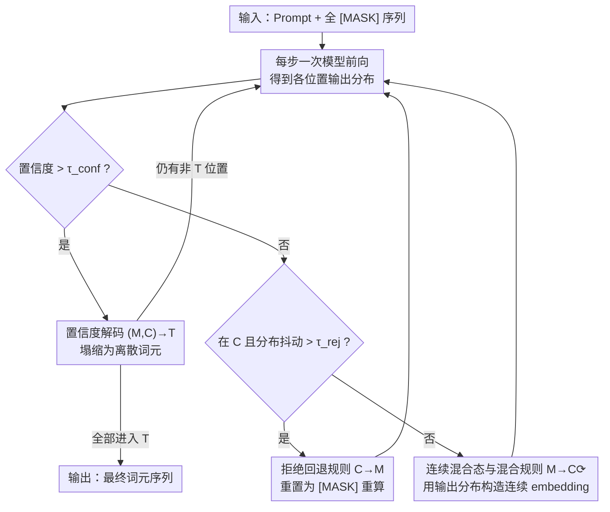

# Rejection Mixing: Fast Semantic Propagation of Mask Tokens for Efficient DLLM Inference

**会议**: CVPR 2026  
**论文**: [CVF Open Access](https://openaccess.thecvf.com/content/CVPR2026/html/Ye_Rejection_Mixing_Fast_Semantic_Propagation_of_Mask_Tokens_for_Efficient_CVPR_2026_paper.html)  
**代码**: https://github.com/Serpientw/ReMix-DLLM  
**领域**: LLM效率 / 扩散语言模型 / 推理加速  
**关键词**: 扩散语言模型, 并行解码, 组合矛盾, 连续中间态, 免训练加速

## 一句话总结
ReMix 在扩散语言模型（DLLM）的「掩码态→词元态」离散解码之间插入一个可迭代刷新的「连续混合态」，让并行解码的多个位置在落子前先在连续空间里互相协调、并用一条拒绝规则把不稳定的位置打回掩码重算，从而在不训练、不掉点的前提下把推理提速 2–8×，很多任务上准确率还反而上升。

## 研究背景与动机
**领域现状**：自回归（AR）LLM 一次只吐一个词元，速度受限。扩散语言模型（DLLM，如 LLaDA、Dream、多模态的 MMaDA）改成把整段序列当作一堆 `[MASK]` 并行去噪，理论上能一步解码多个位置，吞吐潜力远超 AR。

**现有痛点**：DLLM 有个尴尬的「质量—速度二律背反」——一步只解一个词元时质量最好，可一旦想并行多解几个词元，质量就明显掉。作者把这个现象归纳为「组合矛盾」（combinatorial contradiction）：同一解码步里被同时采样的多个位置**彼此感知不到对方**，各自独立取自己最可能的词元，组合起来却语义不通。论文用扑克牌例子点透——位置 11、12 各自最可能是 "Full" 和 "Pair"，独立采样拼出 "Full Pair"，但正确答案是 "Full House"。

**核心矛盾**：根因在于解码过程是**纯离散**的。一个位置要么是 `[MASK]`、要么已经塌缩成某个具体词元，没有中间状态可以「半成形」地把自己的意图透露给邻居。已有改良要么靠更精巧的并行调度（治标不治本），要么像 WINO 那样加可撤销机制和额外验证块（多算一遍），要么像 APD 那样挂一个小 AR 模型做联合概率（多算且强行左到右），都额外付出了算力或牺牲了并行性。

**本文目标**：不训练、不加辅助模型、不破坏并行，只改解码规则，就把组合矛盾压下去。

**切入角度**：连续表示天然能跨位置保留依赖、携带比单个离散词元更丰富的信息。那就别急着把未定位置 remask 成信息全无的 `[MASK]`，而是让它在连续空间里多停留几步、反复刷新，等彼此协调一致了再塌缩成离散词元。

**核心 idea**：在离散的 M（掩码）→ T（词元）转移之间插入一个连续中间态 C，用「混合规则」让位置在 C 里迭代逼近、互相对齐意图，用「拒绝规则」把抖动太大的位置打回 M 重来，整套都是免训练的解码期改造。

## 方法详解

### 整体框架
ReMix 把 DLLM 的解码建模成一个三态状态机：每个待生成位置在 **M（掩码态）/ C（连续混合态）/ T（词元态）** 之间流转。原版 DLLM 只有 M→T 一条硬路径：每步用置信度规则挑出够确定的位置直接塌缩成词元，剩下的继续当 `[MASK]`。ReMix 在中间加了一个连续态 C 和一个回环：每个解码步先做一次前向，对每个未定位置——若置信度过阈就走 (M,C)→T 落子；否则不塌缩，而是按混合规则把它推进/留在连续态 C（用上一步的输出分布构造一个连续 embedding），让它继续参与下一步前向、和别的位置互相影响；如果它在 C 里两步之间分布抖动太大（不稳定），就按拒绝规则 C→M 打回掩码重算。如此循环，直到所有位置都进入 T。整段过程不改模型权重，只是把「解码规则」从两态扩成三态。

### 关键设计

**1. 连续混合态 C 与混合规则（M→C⟳）：给未定位置一个能「半成形」互相通气的中间状态**

痛点是离散解码里位置之间无法在落子前协调。ReMix 让未达解码条件的位置不再 remask 丢信息，而是进入连续态 C：它不存一个离散词元，而是存一个连续 embedding $y^{emb}_i$，并用上一步的输出分布去更新它——
$$y^{emb}_i \leftarrow \beta\, W^{\top} p_\theta(\hat{y}_i \mid X, Y) + (1-\beta)\,\mathrm{Emb}[\text{MASK}]$$
其中 $W\in\mathbb{R}^{|V|\times d}$ 是词嵌入矩阵，$W^{\top}p_\theta(\cdot)$ 把整条输出分布加权成一个「软词元」嵌入，$\beta\in(0,1)$ 控制这个软嵌入与原始 `[MASK]` 嵌入的混合比例。因为词元与嵌入一一对应，更新嵌入就等价于在连续空间里更新这个位置的「当前猜测」。这样下一次前向时，邻居位置能「读到」这个半成形的意图（论文称之为一种"soft lookahead"），从而在所有位置都还没硬落子前就达成全局一致——扑克例子里 "Full"↔"House" 的依赖正是在 C 态的两步迭代中被识别出来的。这也是加速的来源：信息提前传播，需要的解码步数大幅下降。把 $\beta$ 设为 0 时 C 态消失，方法退化成普通的置信度感知并行解码。

**2. 拒绝回退规则（C→M）：给连续态加一个稳定阀门，防止误差级联**

混合规则虽好，但有个隐患：模型是在**离散词元**上训练的，往里灌连续的软嵌入会带来训练—推理不一致和分布漂移，某些位置可能在 C 里越滑越偏。拒绝规则就是这套机制的「刹车」：当一个位置连续两步的输出分布差得太远（不稳定信号），就把它直接重置回 `[MASK]`——
$$y_i \leftarrow [\text{MASK}],\quad \text{若 } D_{JS}\big(p_\theta(\hat{y}_i\mid X,Y)\,\|\,p_\theta(\hat{y}_i\mid X,Y_{old})\big) > \tau_{rej}$$
其中 $D_{JS}$ 是两步分布间的 Jensen–Shannon 散度，$\tau_{rej}$ 是不稳定阈值（取 0.1–0.4）。它的作用相当于早早剪掉发散的解码路径，把误差扼杀在级联之前；论文把它解读为一个隐式正则器——承认连续态在离散模型里有风险，于是只让稳定的位置享受连续刷新的好处，抖的就退回去重来。正因为这条回退，整套训练-free 的连续混合才敢用而不崩。

**3. 置信度解码 (M,C)→T 与自适应 top-p：决定何时落子、怎样把分布转成嵌入**

这条规则负责「定稿」：无论位置当前在 M 还是 C，只要某位置输出分布的最大概率超过阈值 $\tau_{conf}$（取 0.8），就塌缩成具体词元——
$$y_i \leftarrow \arg\max_{v\in V} p_\theta(\hat{y}_i=v\mid X,Y),\quad \text{若 } \max_{v\in V} p_\theta(\hat{y}_i=v\mid X,Y) > \tau_{conf}$$
这套就是常见的置信度阈值并行解码，保证够确定的位置不被连续刷新拖慢。配套地，在混合规则里把输出分布转成嵌入（算 $W^{\top}p_\theta$）时用了**自适应 top-p 采样**：按置信度动态调阈值，并把截断掉的残余概率质量并回 `[MASK]` 嵌入以保稳定（⚠️ 原文此处细节指向附录，以原文为准）。三条规则合起来构成 Algorithm 1 的主循环：每步前向→逐位置判断落子/回退/继续混合，直到全序列进入 T。

### 损失函数 / 训练策略
无训练。ReMix 是纯解码期（inference-time）方法，不改模型权重、不微调，直接套在现成的 LLaDA-8B-Instruct（语言）和 MMaDA-8B-MixCoT（多模态）上。超参：生成长度 256、块长 128（半自回归分块），$\tau_{conf}=0.8$，混合比 $\beta\in\{0.4,0.5,0.6\}$，拒绝阈值 $\tau_{rej}\in[0.1,0.4]$。

## 实验关键数据

### 主实验
语言域：基于 LLaDA-8B-Instruct，在 8 个推理/代码基准上比较（生成长度 256，块长 128）。ReMix 在**每一个**基准上都同时提了准确率、降了步数。

| 基准 | 类型 | LLaDA 准确率 | ReMix 准确率 | 步数加速 | 端到端加速 |
|------|------|------|------|------|------|
| ARC-C | 常识推理 | 52.17 | 66.22 (+14.05) | 4.18× | 3.92× |
| ARC-E | 常识推理 | 59.68 | 70.54 (+10.86) | 5.05× | 4.60× |
| Sudoku | 逻辑推理 | 14.25 | 18.55 (+4.30) | 3.05× | 2.86× |
| Countdown | 逻辑推理 | 25.78 | 29.68 (+3.90) | 2.52× | 2.37× |
| MATH-500 | 数学 | 32.20 | 35.00 (+2.80) | 3.86× | 3.55× |
| GSM8K | 数学 | 73.01 | 75.66 (+2.65) | 4.97× | 4.63× |
| MBPP | 代码 | 36.20 | 37.00 (+0.80) | 3.04× | 2.79× |
| HumanEval | 代码 | 43.90 | 44.50 (+0.60) | 2.86× | 2.70× |

多模态域：基于 MMaDA-8B-MixCoT，6 个视觉-语言基准（Flickr30k 用 CIDEr，余者准确率）。加速更猛（4.4–8.5× 步数缩减、3.75–7.52× 端到端），同时几乎都涨点。

| 基准 | 类型 | MMaDA | ReMix | 步数加速 | 端到端加速 |
|------|------|------|------|------|------|
| Flickr30k-lite | 看图说话 | 57.52 | 59.59 (+2.07) | 8.50× | 7.52× |
| AI2D-lite | 图表理解 | 62.40 | 62.60 (+0.20) | 6.77× | 5.68× |
| MathVision-mini | 数学推理 | 12.83 | 12.83 (+0.00) | 4.86× | 4.03× |
| MathVista-mini | 数学推理 | 31.60 | 34.60 (+3.00) | 5.87× | 5.32× |
| MMMU-val | 多学科推理 | 23.33 | 24.67 (+1.34) | 4.41× | 3.75× |
| ScienceQA-IMG | 多学科推理 | 46.70 | 47.35 (+0.65) | 5.84× | 5.23× |

### 消融实验
| 配置 | 关键现象 | 说明 |
|------|---------|------|
| 完整 ReMix | 2–8× 加速且普遍涨点 | 三条规则协同 |
| 混合比 β=0（关掉 C 态） | 退化为置信度并行解码，准确率明显低于 ReMix | 证明连续混合态是涨点主因（Fig.5） |
| 全扩散解码（生成长度=块长） | LLaDA 基线在 Len=256 严重掉点，ReMix 仍涨点且步数远少 | 连续表示补偿了全扩散的退化（Fig.4） |
| 生成长度 128/256/512（块长固定 128） | 长度越长收益越大：512 时 GSM8K +2.95、6.46× 加速 | 对生成长度鲁棒（Tab.3 上半） |
| 块长 32/64/128（生成长度固定 256） | 三档准确率持平或更好、加速稳定 | 对块长鲁棒（Tab.3 下半） |

### 关键发现
- **连续混合态 C 是涨点的核心**：把 β 设 0 关掉 C 后方法退回普通置信度并行解码、准确率掉到 ReMix 之下，说明加速主要不是靠"砍步数"，而是连续刷新让组合更一致、反而提质。
- **组合矛盾确实被缓解**：用 GPT-4o-mini 给 GSM8K 回答打 1–5 分，基线均分 3.23、ReMix 4.32（逼近单步标准解码的 4.33），且 ReMix 拿满分 5 的样本从不足 200 涨到 600+，分布整体右移。
- **越难越受益**：常识/逻辑推理这类基线弱的任务涨幅最大（ARC-C +14.05、ARC-E +10.86），数学这类基线已强的任务也能稳涨（GSM8K +2.65）。
- **超参有甜区**：β 和 $\tau_{rej}$ 都是先涨后掉——β 太大（GSM8K >0.6、MathVista >0.5）过度依赖连续更新会失稳，$\tau_{rej}$ 太宽会放进低置信噪声嵌入；但在很大范围内步数缩减都稳定、且几乎都超基线。

## 亮点与洞察
- **「连续中间态」这一刀切得很准**：组合矛盾的根因是离散态非黑即白、没有协调余地，ReMix 不去改训练、不加模型，只是在状态机里加了个连续态当缓冲，就把"先协调再落子"变成可能——这是把扩散模型连续/离散两套表示揉到一起的巧妙工程。
- **混合规则的 soft lookahead 视角很有启发**：$W^{\top}p_\theta(\hat{y})$ 把整条输出分布压成一个软嵌入回灌，等于让未定位置以"概率云"形式向邻居透露意图，而不必赌上一个具体词元——这个"用分布当 embedding"的 trick 可迁移到其他需要并行/投机解码的场景。
- **拒绝规则用 JS 散度做稳定性判据，简单但点睛**：免训练方法最怕分布漂移失控，用相邻两步分布的 JS 散度当"抖动探测器"、超阈就打回 `[MASK]`，几乎零成本地把误差级联剪掉，是让连续混合敢用的关键保险。
- **加速却涨点**，打破了"提速必掉质"的惯性认知：步数砍掉 2.5–8.5× 的同时准确率还普遍上升，说明并行解码原本的质量损失大头是组合矛盾而非信息不足。

## 局限与展望
- **引入两个新超参**（β、$\tau_{rej}$）且存在明显甜区，跨任务可能需要调；论文里 β 就按任务从 {0.4,0.5,0.6} 选、$\tau_{rej}$ 在 0.1–0.4 间变，自动化选参没有给出方案。
- **每个连续位置仍要参与前向**：C 态没有像 KV cache 那样省下计算，加速完全来自步数减少；与缓存类加速（Fast-dLLM/dKV-Cache）的正交叠加效果论文未充分实验。
- **训练—推理不一致是被"缓解"而非根治**：连续软嵌入喂给离散训练的模型本质上是 OOD 输入，拒绝规则只是事后补救；若能用少量训练让模型原生接受连续态，可能进一步提质。
- **依赖置信度/JS 这类启发式阈值**：在更长生成或更开放的生成任务上，分布抖动判据是否仍稳健，需要更多压力测试。

## 相关工作与启发
- **vs WINO（可撤销解码）**：WINO 也想纠正并行解码的错误，但靠额外的验证块撤销已落子的词元，多一份前向开销；ReMix 不撤销已定词元，而是在落子前的连续态里就把冲突协调掉，开销更省、并行性不破。
- **vs APD（辅助 AR 模型）**：APD 把 DLLM 边缘概率与一个小 AR 模型的联合概率相乘来约束一致性，要多挂一个模型且强制左到右；ReMix 完全在 DLLM 自身分布内闭环、无需外部模型、不强加生成顺序。
- **vs Fast-dLLM / dKV-Cache / Sparse-dLLM（缓存类加速）**：这些从 KV 缓存角度省算力，与 ReMix 从"减少解码步数"角度加速是正交的两条线，原则上可叠加。
- **vs 置信度并行解码（如 Fast-dLLM 的 confidence-aware 策略）**：ReMix 在 β=0 时正好退化成它，说明 ReMix 是它的严格超集——多出的连续混合态正是质量提升的来源。

## 评分
- 新颖性: ⭐⭐⭐⭐⭐ 「在离散 M→T 之间插入可迭代连续中间态」是对扩散语言模型并行解码瓶颈的一个干净且本质的新解法。
- 实验充分度: ⭐⭐⭐⭐ 语言 8 任务 + 多模态 6 任务 + 生成长度/块长/全扩散/超参多维消融，覆盖广；但缺与缓存类加速叠加、以及更大模型上的验证。
- 写作质量: ⭐⭐⭐⭐ 用扑克例子把"组合矛盾"讲得很直观，三条规则与状态机叙述清晰；部分实现细节（自适应 top-p）甩给附录。
- 价值: ⭐⭐⭐⭐⭐ 免训练即插即用、2–8× 加速且不掉点甚至涨点，对落地 DLLM 推理很实用。

<!-- RELATED:START -->

## 相关论文

- [\[ICLR 2026\] ES-dLLM: Efficient Inference for Diffusion Large Language Models by Early-Skipping](../../ICLR2026/model_compression/es-dllm_efficient_inference_for_diffusion_large_language_models_by_early-skippin.md)
- [\[CVPR 2026\] LiDeRe: A Lightweight Readout for Fast and Data-Efficient Dense Prediction](lidere_a_lightweight_readout_for_fast_and_data-efficient_dense_prediction.md)
- [\[CVPR 2026\] Ultra-Fast Neural Video Compression](ultra-fast_neural_video_compression.md)
- [\[CVPR 2026\] Test-time Sparsity for Extreme Fast Action Diffusion](test-time_sparsity_for_extreme_fast_action_diffusion.md)
- [\[CVPR 2026\] SG-LoRA: Semantic-guided LoRA Parameters Generation](sg-lora_semantic-guided_lora_parameters_generation.md)

<!-- RELATED:END -->
