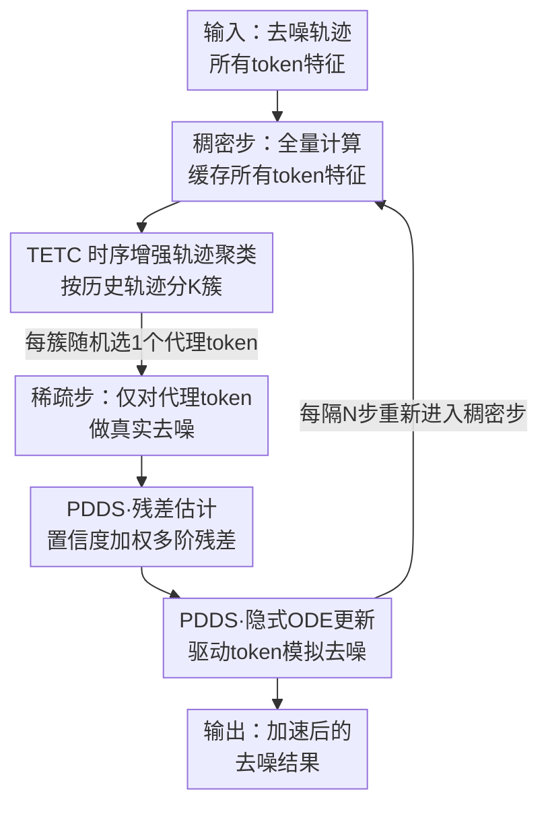

# ResCa: Residual Caching for Diffusion Transformers Acceleration

**会议**: CVPR 2026  
**论文**: [CVF Open Access](https://openaccess.thecvf.com/content/CVPR2026/html/Fang_ResCa_Residual_Caching_for_Diffusion_Transformers_Acceleration_CVPR_2026_paper.html)  
**领域**: 模型压缩 / 扩散模型加速  
**关键词**: 扩散Transformer加速, 特征缓存, token削减, 代理去噪, 隐式ODE

## 一句话总结
ResCa 是一个无需训练的扩散 Transformer 加速框架：把 token 按"历史去噪轨迹"聚成簇，每簇只对一个"代理 token"做真实去噪，再用它算出的多阶残差去"模拟"同簇其它 token 的去噪，从而在保持"自身、且被更新"的去噪方向的前提下，在 FLUX 上拿到最高 5.5× 的 GFLOPs 加速且几乎无损画质。

## 研究背景与动机

**领域现状**：扩散 Transformer（DiT、FLUX、HunyuanVideo 等）在高保真图像/视频生成上效果惊人，但每一步去噪都要把所有 token 过一遍完整网络，推理开销极高。为此学界发展了三类加速手段——采样器层面减少步数（DDIM、DPM-Solver）、模型层面剪枝量化、以及特征层面的 token 削减。其中 token 削减因为"训练无关、即插即用"最受关注，主要分两条路：缓存（caching）和合并（merging）。

**现有痛点**：作者把这两条路的失败都归结到"去噪方向被破坏"。缓存类方法（ToCa、DuCa、TokenCache）直接复用上一时刻的 token 特征，但由于残差连接的存在，被复用的特征并不会真的停在原地，于是产生了一个**non-updated（没被更新）**的去噪方向；合并类方法（ToMeSD、ToMA、SDTM）把相似 token 合并成一个、共享混合特征，于是每个 token 走的是别人的方向，产生了一个**non-self（不是自己）**的去噪方向。无论哪种，被略过计算的 token 都没能沿着"既是自己、又被当前时刻更新过"的轨迹前进，画质因此受损。混合方法（ClusCa）想同时用时间缓存和空间相似特征，但空间项权重往往太小，潜力没挖出来。

**核心矛盾**：要省算力就得跳过大部分 token 的真实计算，可一旦跳过，被略过的 token 要么用旧的自己（non-updated）、要么用当前的别人（non-self），两者都偏离了"全量计算"应该得到的真实轨迹。能不能让被略过的 token 既保留自己的身份、又拿到当前时刻的更新信息？

**切入角度**：作者做了两组前置实验来找突破口。其一问"在哪找相似残差"——把高维特征轨迹投影到 3D 可视化后发现，按"整段历史轨迹"聚类比按"最后一步特征相似度"聚类更能把真正相似的 token 归到一起（后者会把轨迹差异很大的 token 误聚），而同簇内的残差距离也确实更小。其二问"该用哪阶残差"——把特征本身记为 0 阶残差、相邻时刻之差记为 1 阶、再差分得到更高阶，结果发现 1/2/3 阶残差的簇内距离远小于 0 阶（0 阶还编码着 token 自身表征、个体差异大），而过高阶又会放大噪声；并且某阶残差的"可用程度"可以从前一时刻的轨迹关系线性外推出来。

**核心 idea**：提出"代理去噪（proxy denoising）"视角——同一簇里只挑一个 token 做真去噪当"代理"，把它算出的多阶残差当作**方向修正项**，叠加到其它 token **自己**的缓存特征上去做"模拟去噪"。这样每个被略过的 token 用的是自身缓存特征作主方向（self 成分）、用代理的当前残差作校正（updated 成分），得到一条既是自己、又被更新的轨迹。

## 方法详解

### 整体框架
ResCa 把整个去噪过程切成**稠密步（dense）**和**稀疏步（sparse）**交替进行，缓存间隔为 $N$。在稠密步，所有 token 都过完整网络、缓存各自特征，并由 TETC 模块按历史轨迹把 token 聚成 $K$ 个簇；在随后的 $N-1$ 个稀疏步里，每个簇只选一个代理 token 做真实去噪，其余"被驱动 token（driven tokens）"则交给 PDDS 模块用代理的残差来模拟更新，省掉它们的真实前向计算。整套流程训练无关，可直接挂到 DiT / FLUX / HunyuanVideo 上。

### 关键设计

**1. 时序增强轨迹聚类 TETC：按"整段历史"而不是"最后一步"聚 token**

前置实验已经表明，按最后一步特征相似度聚类（合并类方法的做法）会把轨迹差异很大的 token 误归一簇，导致后面复用的残差并不相似、引入错误指引。TETC 改成按整段历史轨迹聚类，并且越近的时刻权重越大（因为近期轨迹对未来残差的预测最相关）。具体三步：先对每个时刻 $t$ 的所有 token 算两两余弦相似度矩阵 $\mathcal{S}_t=\frac{X_tX_t^\top}{\|X_t\|_2\|X_t^\top\|_2}$；再用时序滑动平均把历史累积进来，得到累积相似度

$$\tilde{\mathcal{S}}_t=\alpha_{\mathcal{S}}\cdot\mathcal{S}_t+(1-\alpha_{\mathcal{S}})\cdot\tilde{\mathcal{S}}_{t+1},$$

其中 $\alpha_{\mathcal{S}}$ 控制对近期时刻的偏重；最后在 $\tilde{\mathcal{S}}_t$ 这个余弦距离度量下做 K-medoids 聚类，目标是最小化 $\sum_{t}\sum_{k}\mathbb{I}(X_t\in C_k)\cdot(1-\tilde{\mathcal{S}}_t(X_t,C_k))$。选 K-medoids 而非 K-means 是因为它强制簇心必须是真实存在的 token，于是天然可以从每个簇 $C_k$ 里随机选出一个簇心当代理 token $p_k$，其余即为被驱动 token $D_k=\{X_i\mid X_i\in C_k, X_i\neq p_k\}$。把"轨迹相似"作为聚类依据，是保证后面"代理残差能代表全簇"的前提。

**2. 代理驱动的残差估计：用置信度加权融合"自己的残差"和"代理的前瞻残差"**

有了代理后，关键是怎么把代理的去噪信息安全地"借"给被驱动 token，而不是简单复制。ResCa 先在代理 token 上递归构造多阶残差作为"类导数"描述子：0 阶就是特征本身 $\mathcal{F}^{(0)}(p_t)=p_t$，高阶用有限差分 $\mathcal{F}^{(m)}(p_t)=\mathcal{F}^{(m-1)}(p_t)-\mathcal{F}^{(m-1)}(p_{t+1})$。然后对每个被驱动 token，按"两条轨迹的第 $m$ 阶残差有多对齐"算一个**置信度** $\theta_t^{(m)}=\max\big(0,\cos(\mathcal{F}^{(m)}(p_t),\mathcal{F}^{(m)}(d_t))\big)\in[0,1]$，并用它把驱动 token 自己的残差和代理在下一时刻的残差做凸组合，估计驱动 token 在 $t-1$ 时刻的残差：

$$\hat{\mathcal{F}}^{(m)}(d_{t-1})=(1-\theta_t^{(m)})\cdot\mathcal{F}^{(m)}(d_t)+\theta_t^{(m)}\cdot\mathcal{F}^{(m)}(p_{t-1}).$$

这里 $\mathcal{F}^{(m)}(d_t)$ 是驱动 token 自身的基准方向（保证 self），$\mathcal{F}^{(m)}(p_{t-1})$ 是代理在下一步真算出来的前瞻校正（保证 updated）。$\theta_t^{(m)}$ 起到"自适应信任"作用：当两条轨迹高度一致时它接近 1、强力对齐到代理的最新残差；不一致时它退回去用自己的残差，避免把别人的方向硬塞进来——这正是对缓存类"non-updated"和合并类"non-self"两个病根的同时回应。

**3. 隐式 ODE 更新：把估计出的多阶残差直接插进高阶/多步求解器**

最后要把估计出的残差变成真正的 token 更新。作者把驱动 token 的演化看成一条反向时间 ODE，但不显式建模连续 drift，而是直接把上一步估计的多阶残差 $\{\hat{\mathcal{F}}^{(m)}(d_{t-1})\}$ 当作时间导数的离散近似，套用隐式 Taylor 方法的单位步形式做更新：

$$d_{t-1}=d_t+\sum_{m=1}^{M}\frac{1}{m!}\hat{\mathcal{F}}^{(m)}(d_{t-1}).$$

当 $M=1$ 时它退化为隐式 Euler 步 $d_{t-1}=d_t+\hat{\mathcal{F}}^{(1)}(d_{t-1})$（对应 ResCa-IE）；这些残差也能直接喂给标准的隐式线性多步格式，例如单位步长的 BDF2 给出 $d_{t-1}=\frac{4}{3}d_t-\frac{1}{3}d_{t+1}+\frac{2}{3}\hat{\mathcal{F}}^{(1)}(d_{t-1})$（对应 ResCa-IB），以及用更高阶 $O$ 的隐式 Taylor（对应 ResCa-IT）。这步的巧妙之处在于：因为残差是从"估计未来状态"而非"复用历史状态"得到的，整套更新无需额外跑扩散模型，就能享受隐式高阶/多步求解器的精度，这也是它能比 TaylorSeer（历史外推）、ClusCa（一阶混合）更准的根本原因。

### 损失函数 / 训练策略
ResCa 完全训练无关、推理期插入，没有任何可训练参数或损失函数。主要超参为缓存间隔 $N$、簇数 $K$、隐式方法阶数 $O$，以及时序平滑因子 $\alpha_{\mathcal{S}}$；三种版本 IE / IB / IT 分别对应隐式 Euler、隐式 BDF2、隐式 Taylor。

## 实验关键数据

### 主实验
在 FLUX.1-dev 文生图（DrawBench 200 prompts，Image Reward / CLIP 评测）上，ResCa 在相近甚至更高的加速比下取得最优画质：

| 方法 | Attention | 延迟(s)↓ | FLOPs(T)↓ | FLOPs加速↑ | Image Reward↑ | CLIP↑ |
|------|-----------|----------|-----------|------------|---------------|-------|
| FLUX.1-dev (50步原始) | ✔ | 25.82 | 3719.5 | 1.00× | 0.9898 | 19.761 |
| DuCa (N=5) | ✔ | 8.18 | 978.8 | 3.80× | 0.9955 | 19.314 |
| TaylorSeer (N=4,O=2) | ✔ | 9.24 | 1042.3 | 3.57× | 0.9857 | 19.496 |
| ClusCa (N=5,O=1,K=16) | ✔ | 8.12 | 897.0 | 4.14× | 0.9825 | 19.481 |
| **ResCa-IE (N=5,K=16)** | ✔ | 8.19 | 898.1 | 4.14× | **0.9958** | **19.537** |
| **ResCa-IT (N=6,O=2,K=16)** | ✔ | 7.17 | 749.5 | **4.96×** | 0.9937 | 19.452 |
| **ResCa-IB (N=7,K=16)** | ✔ | 6.82 | 675.2 | 5.51× | 0.9889 | 19.441 |

在 DiT-XL/2 ImageNet 256×256 类条件生成（FID-50k）上同样领先：

| 方法 | FLOPs(T)↓ | 加速↑ | FID↓ | sFID↓ |
|------|-----------|-------|------|-------|
| DDIM-50步 | 23.74 | 1.00× | 2.32 | 4.32 |
| DuCa (N=3) | 9.54 | 2.49× | 2.85 | 4.64 |
| TaylorSeer (N=3,O=1) | 8.56 | 2.77× | 2.49 | 4.81 |
| **ResCa-IE (N=3,K=16)** | 9.20 | 2.58× | **2.37** | **4.63** |
| ClusCa (N=5,K=16) | 5.98 | 3.97× | 2.65 | 5.13 |
| **ResCa-IE (N=5,K=16)** | 5.99 | 3.96× | **2.62** | **5.08** |

在 HunyuanVideo 文生视频（VBench，946 prompts）上，ResCa-IE（N=6,K=32）以 5.53× FLOPs 加速拿到 79.98 的 VBench 分，比相近加速比的 TaylorSeer 高约 0.2%。

### 消融实验
多阶残差阶数 $O$ 的消融（DiT-XL/2，N=5）：

| 配置 | FLOPs(T)↓ | FID↓ | sFID↓ |
|------|-----------|------|-------|
| DDIM-15步 | 6.66 | 4.75 | 8.43 |
| ResCa-IT (O=1) | 5.99 | 2.62 | 5.08 |
| ResCa-IT (O=2) | 6.00 | **2.57** | 4.98 |
| ResCa-IT (O=3) | 6.00 | 2.58 | 5.02 |
| ResCa-IT (O=4) | 6.01 | 2.58 | 5.00 |

### 关键发现
- **聚类方式是性能命门**：把特征相似度聚类换成轨迹聚类，可视化上能明显消除过曝、细节缺失（如车轮、嘴部细节），因为前者会复用不相似的残差、给去噪注入错误指引——这印证了"代理残差必须能代表全簇"的设计前提。
- **一阶残差性价比最高**：从 O=1 升到 O=2 时 FID 还能小降（2.62→2.57），但再往上（O=3/4）FID 反而微升且算力增加，因为过高阶残差会放大微小变化和噪声；作者因此默认只用一阶以保持简洁。
- **簇数 K 有甜区**：在 FLUX（N=8,O=1）下 K=16 或 K=32 取得最佳质量-效率权衡，默认取 K=16。
- **"估计未来"优于"复用历史"**：相比 TaylorSeer 的历史泰勒外推、ClusCa 的一阶混合，ResCa 基于残差估计未来状态的隐式 ODE 在相近/更高加速比下持续给出更好画质，说明历史外推在非平稳的扩散动力学下不够用。

## 亮点与洞察
- **"self & updated"的二维拆解很漂亮**：作者把缓存类的失败抽象成 non-updated、合并类的失败抽象成 non-self，再用"自身缓存特征作主方向 + 代理残差作校正"一招同时补齐两个维度，框架性极强、动机直指病根。
- **多阶残差 + 置信度门控是可迁移的 trick**：用余弦对齐度 $\theta_t^{(m)}$ 自适应决定"信任自己还是信任邻居"，本质是一个软门控的特征复用机制，可以迁移到任何"邻域特征共享"的加速场景（如视频帧间、注意力 token 复用）。
- **把残差直接当 ODE 导数喂进求解器**：不显式建 drift 函数，而是把有限差分残差当时间导数的离散近似插进隐式 Euler/BDF2/Taylor，使得加速方法天然兼容成熟的高阶/多步数值格式，是工程上很省事的设计。

## 局限与展望
- **额外开销不可忽略**：TETC 的 K-medoids 聚类、逐阶余弦置信度计算、隐式更新都有非平凡成本；从表里能看到延迟加速（如 3.15×）经常低于 FLOPs 加速（4.14×），说明实际墙钟收益被这些 overhead 吃掉一部分，论文未充分剖析其在不同分辨率/序列长度下的可扩展性。
- **代理 token 是随机选的**：每簇从簇心随机取一个 token 当代理，缺乏"选最具代表性代理"的策略；若某簇内部其实异质，单个随机代理的残差可能并不能很好代表全簇，作者也未做代理选择策略的消融。
- **隐式更新的稳定性边界未探**：隐式 ODE 在极大间隔（N=8）下仍可用很亮眼，但论文未讨论何时会发散/退化，超参 $N,K,O,\alpha_{\mathcal{S}}$ 的联合敏感性也只给了局部分析。
- **评测局限于现有质量指标**：Image Reward / CLIP / VBench 都是聚合指标，对"代理去噪"是否在长程语义一致性、罕见细节上有系统性损失，仅靠少量定性图说明，证据偏弱。

## 相关工作与启发
- **vs 缓存类（ToCa / DuCa / TokenCache）**：它们直接复用前一时刻的 token 特征，得到 non-updated 方向；ResCa 不复用旧特征值，而是复用代理的低阶残差并用置信度加权，保留了"被当前时刻更新"的成分。
- **vs 合并类（ToMeSD / ToMA / SDTM）**：它们把相似 token 合并、共享混合特征，得到 non-self 方向；ResCa 让每个被驱动 token 以自己的缓存特征作主方向，只把代理残差当校正，保留了 self 身份。
- **vs 动态预测类（TaylorSeer / FoCa）**：它们用历史泰勒外推或 ODE 建模来"预测"特征，但在非平稳扩散动力学下纯历史外推不足；ResCa 用当前步真算的代理残差做前瞻校正，相当于给历史外推加了一个"当前时刻锚点"。
- **vs 混合类（ClusCa / SDTM）**：它们线性加权时间缓存和空间相似特征，但空间项常被低估；ResCa 用置信度门控的多阶残差 + 隐式 ODE，把空间（同簇代理）信息以更精细的方式注入。

## 评分
- 新颖性: ⭐⭐⭐⭐⭐ "self & updated"的代理去噪视角 + 多阶残差置信度门控 + 残差直插隐式 ODE，三点组合在缓存加速里是新角度。
- 实验充分度: ⭐⭐⭐⭐ 覆盖 DiT/FLUX/HunyuanVideo 三类模型与图像/视频两类任务，主表 + 多组消融完整，但墙钟开销剖析与代理选择策略消融偏少。
- 写作质量: ⭐⭐⭐⭐ 前置实验把动机讲得很清楚、图示直观，公式略密但逻辑自洽。
- 价值: ⭐⭐⭐⭐ 训练无关、即插即用、近无损 5.5× 加速，对扩散生成部署有直接落地价值。

<!-- RELATED:START -->

## 相关论文

- [\[CVPR 2026\] BinaryAttention: One-Bit QK-Attention for Vision and Diffusion Transformers](binaryattention_one-bit_qk-attention_for_vision_and_diffusion_transformers.md)
- [\[CVPR 2026\] SODA: Sensitivity-Oriented Dynamic Acceleration for Diffusion Transformer](soda_sensitivity-oriented_dynamic_acceleration_for_diffusion_transformer.md)
- [\[CVPR 2026\] Trainable Log-linear Sparse Attention for Efficient Diffusion Transformers](trainable_log-linear_sparse_attention_for_efficient_diffusion_transformers.md)
- [\[CVPR 2026\] PPCL: Pluggable Pruning with Contiguous Layer Distillation for Diffusion Transformers](ppcl_pluggable_pruning_dit_distillation.md)
- [\[CVPR 2026\] Saliency-Driven Token Merging for Vision Transformers](saliency-driven_token_merging_for_vision_transformers.md)

<!-- RELATED:END -->
