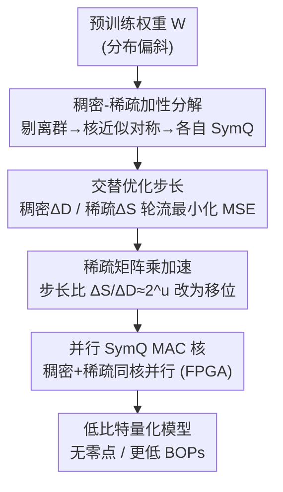

# Rethinking Asymmetric Quantization: Hidden Symmetry in Vision Model Weights

**会议**: CVPR 2026  
**论文**: [CVF Open Access](https://openaccess.thecvf.com/content/CVPR2026/html/Mori_Rethinking_Asymmetric_Quantization_Hidden_Symmetry_in_Vision_Model_Weights_CVPR_2026_paper.html)  
**代码**: 待确认  
**领域**: 模型压缩  
**关键词**: 训练后量化, 非对称量化, 稀疏分解, 零点开销, 视觉模型

## 一句话总结
作者发现视觉模型权重在剔除少数离群值后近似对称，据此提出 DASQ——把权重拆成「稠密对称核 + 稀疏离群」两个用对称量化（SymQ）表示的矩阵，从而去掉非对称量化（AsymQ）昂贵的零点，并在 ImageNet/COCO 上以更低 BOPs 超过现有 PTQ，还在 FPGA 上实现更高精度+更低功耗。

## 研究背景与动机
**领域现状**：在低比特训练后量化（PTQ）里，视觉模型的主流做法是对权重用非对称量化（AsymQ）：给每个通道引入一个零点偏移 $z$，让量化区间去贴合偏斜的权重分布，以此换取比对称量化（SymQ）更高的精度。

**现有痛点**：零点偏移在硬件上代价高昂。AsymQ 的去量化公式里会多出一项 $-\Delta_x\Delta_{W_i} z_{W_i}(\mathbf{1}_m^T\mathbf{x}_q)$，这要么使乘法器位宽从 $k$ 升到 $k+1$、电路面积约 ×1.3，要么需要再做一次整数矩阵乘。由于乘加阵列（MAC array）主导了加速器的面积与功耗，这笔开销直接拉低了 AsymQ 的能效。

**核心矛盾**：更糟的是，AsymQ 其实也没真正"贴合"分布。由于零点被卡在离群区和内点区之间，零点附近大量量化层级被空置（图 4a），既浪费表达能力又掉精度。于是"高精度"和"硬件高效"之间始终拉不开——这正是低比特 PTQ 长期没解决的问题。

**切入角度**：作者去重新审视权重分布本身，得到一个关键观察：权重的非对称几乎全部来自极少数稀疏离群值——一旦把 top 1% 离群剔掉，剩下的核心分布在所有输出通道上都近似关于零对称（图 1）。他们用「中点」$ (\max+\min)/2 $ 度量偏斜，发现随着剔除离群比例增大，逐层中点都趋近 0，不分卷积/全连接、不分深浅。

**核心 idea**：既然非对称只是"离群造成的假象"，那就不必用零点去硬扛——把权重分解成稠密核 + 稀疏离群，两者都用最省硬件的 SymQ 表示，离群项靠高稀疏的稀疏矩阵乘并行算掉，从而做到 zero-point-free 又不丢精度。

## 方法详解

### 整体框架
DASQ（Dense and Additive Sparse Quantization）的目标是：在不引入零点的前提下，让 SymQ 也能准确表示原本偏斜的权重分布。整体思路是把每个权重矩阵 $\mathbf{W}$ 近似为稠密矩阵与稀疏矩阵之和 $\mathbf{W}\approx\hat{\mathbf{W}}_D+\hat{\mathbf{W}}_S$：稠密分量 $\hat{\mathbf{W}}_D$ 用低比特 SymQ 表示零附近的对称核结构，稀疏分量 $\hat{\mathbf{W}}_S$ 单独承接被剔出的离群值。两个分量在推理时由同一个计算核**并行**执行稠密 MAC 和稀疏 MAC，由于离群极度稀疏，稀疏 MAC 总能先于稠密 MAC 算完、被其掩盖，因此不增加关键路径延迟。

整条管线是：先做"隐藏对称"观察 → 用交替优化把权重分解成稠密/稀疏两套 SymQ 量化矩阵 → 对稀疏矩阵乘施加 2 的幂约束改成移位 → 落到专用 FPGA 架构上并行执行。

### 关键设计

**1. 稠密-稀疏加性分解：用两个 SymQ 矩阵替代一个零点**

痛点是：直接对整条偏斜分布做 SymQ，步长 $\Delta$ 会被少数离群值撑大，导致占绝大多数的内点权重量化误差被放大；而 AsymQ 虽缓解了偏斜，却引入了昂贵零点且空置了零点附近的层级。DASQ 的做法是把矩阵拆成稠密核 + 稀疏离群两部分，分别独立做 SymQ：

$$\min_{\hat{\mathbf{W}}_D,\hat{\mathbf{W}}_S}\ \|\mathbf{W}-(\hat{\mathbf{W}}_D+\hat{\mathbf{W}}_S)\|^2\quad \text{s.t.}\ \tfrac{|\hat{\mathbf{W}}_S|_0}{nm}=1-p$$

其中 $p$ 是稀疏度（零元素比例）。直觉上，稠密分量只在"核结构"那个窄范围内量化，没有空置层级，因此即便用极低比特（论文展示 2-bit + 1% 离群）也能拟合得比 4-bit AsymQ 更小的 MSE；稀疏分量则专门把被剔掉的离群补回来。这一步是整篇文章"去零点"的根基——非对称被显式拆解成了"对称核 + 加性稀疏"，而不是靠零点去歪着贴。

**2. 交替优化求步长：稠密与稀疏轮流收敛**

分解的难点在于：最优步长依赖于"哪些元素被划为离群"，而离群划分又依赖步长，二者耦合。DASQ 用交替优化（Alg. 1）解开：每轮先固定离群、用网格搜索/逐通道最小化 MSE 优化稠密步长 $\Delta_D$ 得到 $\hat{\mathbf{W}}_D$；再用幅值掩码 $\mathbf{M}(\mathbf{W},p)$ 取出残差里幅值超过 $100p$ 百分位阈值 $\tau$ 的元素构成稀疏矩阵，优化稀疏步长 $\Delta_S$ 得到 $\hat{\mathbf{W}}_S$；然后用 $\mathbf{W}_D=\mathbf{W}-\hat{\mathbf{W}}_S$ 重构稠密部分迭代，直到两套步长的相对变化之和小于 $\epsilon$ 收敛。步长更新统一是逐输出通道最小化 $(\mathbf{w}_i-\hat{\mathbf{w}}_i)^T(\mathbf{w}_i-\hat{\mathbf{w}}_i)$，$t=0$ 时用 100 个候选粗搜，之后交替细化。结果是 $\Delta_D$（拟合核）偏小、$\Delta_S$（拟合离群）偏大，刚好各司其职。

**3. 稀疏矩阵乘的 2 的幂加速：把高精度乘法换成移位**

推理时稠密与稀疏 MAC 要并行，但稀疏核通常效率不如稠密核，需要进一步压缩它的计算量。第 $i$ 个输出写成：

$$y_i\simeq\Delta_x\Delta_{D\,i}\Big\{[\mathbf{W}_{Dq}^T\mathbf{x}_q]_i+\tfrac{\Delta_{S\,i}}{\Delta_{D\,i}}[\mathbf{W}_{Sq}^T\mathbf{x}_q]_i+\tilde b_i\Big\}$$

关键是对步长比施加 2 的幂约束 $\Delta_S/\Delta_D\simeq 2^u,\ u\in\mathbb{Z}^n$，从而把第二项（稀疏 MatMul）里的高精度乘法替换成位移操作，使稀疏分支算得比稠密分支更快、可被掩盖。实现上是在交替优化更新稀疏步长时加一个 2 的幂投影。这样稀疏分支既轻又快，整核能并行流水，硬件上只需在 SymQ MAC 阵列旁挂一组移位器（图 3b），而非 AsymQ 那样加宽乘法器。

### 损失函数 / 训练策略
DASQ 是 PTQ，不做端到端重训；它兼容已有 PTQ 流水线——某方法对权重用 AsymQ 时，直接换成 DASQ 的双 SymQ 权重、其余步骤不变。实验中 CNN 接 QDrop、ViT 接 RepQ-ViT 和 ERQ。配置上设稀疏比特 $k_S=4$、稀疏度 $p=0.98$（满足 $(1-p)k_S\le 1$ 时 BOPs 低于 AsymQ）；所有卷积层（除深度可分离卷积，因每通道权重太少无法分解，仍用 AsymQ）和全连接层都应用 DASQ。BOPs 度量为 $\mathrm{BOPs}=(k_D+(1-p)k_S)\cdot k_A\cdot f$。

## 实验关键数据

### 主实验
ImageNet（ViT-B）与 COCO（Mask R-CNN）上，DASQ 接到现有 PTQ 后普遍既提精度又降 BOPs：

| 任务/模型 | 配置 (W/A/SW) | 基线 | 基线指标 | +DASQ | BOPs 变化 |
|-----------|--------------|------|----------|-------|-----------|
| ImageNet ViT-B | 3/4 | RepQ-ViT | 26.98% Top-1 | **75.24%** | 267.71G→206.14G |
| ImageNet ViT-B | 3/4 | ERQ | 72.37% | **78.44%** | 267.71G→206.14G |
| ImageNet ViT-B | 4/4 | ERQ | 78.67% | **80.04%** | 334.64G→273.07G |
| ImageNet ResNet-50 | 2/4 | QDrop | 70.08% | **72.63%** | 57.35G→39.76G |
| COCO Mask R-CNN (Swin-T) | 4/4 | RepQ-ViT | 36.1/36.0 (box/mask AP) | **41.5/39.1** | 2719.52G→2219.62G |

最突出的是 W3/A4 下 RepQ-ViT 几乎崩溃（26.98%），换成稀疏权重（$p=0.98$）后 Top-1 暴涨 48.26 个百分点。COCO 上 Swin-T 的 box/mask AP 分别 +6.3/+3.5，且 BOPs 反而比 AsymQ 方案更低。

### 消融实验
FPGA 实测（论文 Table 4）验证硬件可行性：稠密 MAC 吞吐固定 25.6 GOPs/s，稀疏 MAC 在 95% 稀疏下并行追加最多 1.6 GOPs/s。

| 配置 (W/A/SW) | 方案 | 相对 AsymQ | 说明 |
|--------------|------|-----------|------|
| 4/4/- | AsymQ | 基准 | 乘法器多 1 bit，LUT 更多 |
| 4/4/4 | DASQ | Top-1 最高 +6.7%、功耗更低 | 不加宽稠密乘法器，只挂稀疏单元 |
| 4/4/8 | DASQ | 精度再升、LUT/功耗略增 | 稀疏比特调到 8，靠高稀疏仍省 |

### 关键发现
- 隐藏对称是全篇地基：逐层平均绝对中点 $\mu_{|mr|}$ 随离群剔除比例增大单调趋零，跨 CNN 与 ViT、跨深浅层都成立，说明"权重偏斜≈少数离群造成"是普遍现象而非个例。
- 稀疏分支几乎免费：因离群极稀疏（98% 零），稀疏 MatMul 总比稠密先算完、被其时间掩盖，所以"去零点"并没把成本转嫁到稀疏分支上。
- 深度可分离卷积是例外：每个 $3\times3$ 深度卷积输出通道只有 9 个权重，太少撑不起稠密/稀疏分解，作者保留 AsymQ——这是方法适用范围的边界。

## 亮点与洞察
- 把"非对称量化要不要零点"这个被默认接受的前提重新审视，并用一个干净的分布观察（剔离群即对称）给出否定答案，问题定义本身就很漂亮。
- "稠密核 + 加性稀疏"的分解让两路都能用最省硬件的 SymQ，再用 2 的幂步长比把稀疏乘法降成移位——这是算法与硬件协同设计的范例，精度和能效不再二选一。
- 即插即用：作为 PTQ 的"权重量化替换件"挂到 QDrop/RepQ-ViT/ERQ 上其余不动，迁移成本极低，这种"组件化"思路对工程落地很友好。

## 局限与展望
- 适用范围受通道权重数限制：深度可分离卷积因每通道权重过少无法分解，只能退回 AsymQ，说明 DASQ 不是对所有层都通用。
- 收益依赖高稀疏假设：方法的 BOPs 优势建立在 $(1-p)k_S\le 1$ 上（实验取 $p=0.98$），若某些层离群不够稀疏或分布更复杂，稀疏分支的开销与并行掩盖效果可能打折，论文未充分讨论这种情形。
- 硬件验证只在单 FPGA 平台、单核并行设计上完成；在通用 GPU/NPU 上能否同样把稀疏分支"免费"掩盖，仍需更多验证（论文将 GPU 结果放在附录）。

## 相关工作与启发
- **vs AsymQ（RepQ-ViT / ERQ 用的权重非对称）**: 它们用零点偏移去贴偏斜分布，代价是乘法器加宽/额外整数 MatMul，且零点附近层级空置；DASQ 改用"对称核 + 稀疏离群"显式分解，去掉零点同时不空置层级，精度更高、BOPs 更低。
- **vs 重构式 PTQ（Adaround / BRECQ / QDrop）**: 它们聚焦在如何更好地最小化重构损失/选择重构粒度，量化格式仍是单矩阵；DASQ 与之正交，是换了"权重怎么被表示"这一层，可直接叠加在 QDrop 之上再涨点。
- **vs LLM 量化**: 论文指出 LLM 多为访存受限、常用分组/非均匀权重量化压显存而忽略 MAC 成本；视觉模型是计算受限、MAC 数主导，所以 DASQ 专门优化 MAC 侧的零点开销，针对性强。

## 评分
- 新颖性: ⭐⭐⭐⭐⭐ 用"隐藏对称"重新定义问题，否定零点必要性并给出稠密-稀疏分解，视角新且自洽。
- 实验充分度: ⭐⭐⭐⭐ 覆盖分类/检测/分割三类任务 + 多架构 + FPGA 实测，但稀疏度敏感性与 GPU 端验证略单薄。
- 写作质量: ⭐⭐⭐⭐ 观察—动机—方法链条清晰，图 1/3/4 把直觉讲透；部分公式/算法细节较密。
- 价值: ⭐⭐⭐⭐⭐ 算法-硬件协同、即插即用且能效双赢，对边缘部署的低比特视觉模型有直接落地价值。

<!-- RELATED:START -->

## 相关论文

- [\[CVPR 2026\] Rethinking Token Reduction for Large Vision-Language Models](rethinking_token_reduction_for_large_vision-language_models.md)
- [\[CVPR 2026\] VLM-PTQ: Efficient Post-Training Quantization for Large Vision-Language Models](vlm-ptq_efficient_post-training_quantization_for_large_vision-language_models.md)
- [\[CVPR 2026\] CAR-SAM: Cross-Attention Reconstruction for Post-Training Quantization of the Segment Anything Model](car-sam_cross-attention_reconstruction_for_post-training_quantization_of_the_seg.md)
- [\[CVPR 2026\] LS-ViT: Least-Squares Hessian Based Block Reconstruction for Low-Bit Post-Training Quantization of Vision Transformers](ls-vit_least-squares_hessian_based_block_reconstruction_for_low-bit_post-trainin.md)
- [\[CVPR 2026\] Dual-branch Distilled Transformer for Efficient Asymmetric UAV Tracking](dual-branch_distilled_transformer_for_efficient_asymmetric_uav_tracking.md)

<!-- RELATED:END -->
