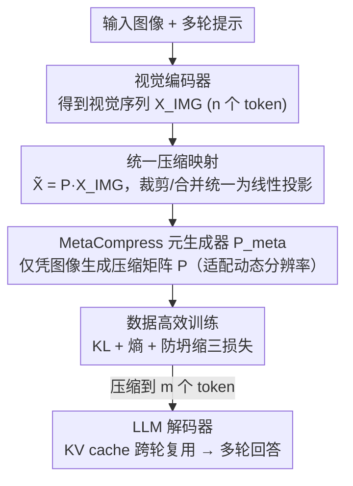

# Rethinking Token Reduction for Large Vision-Language Models

**会议**: CVPR 2026  
**论文**: [CVF Open Access](https://openaccess.thecvf.com/content/CVPR2026/html/Wang_Rethinking_Token_Reduction_for_Large_Vision-Language_Models_CVPR_2026_paper.html)  
**代码**: https://github.com/MArSha1147/MetaCompress  
**领域**: 模型压缩 / 多模态VLM  
**关键词**: 视觉 token 压缩, 多轮 VQA, 可学习压缩矩阵, 推理加速, prompt-agnostic

## 一句话总结
针对多轮视觉问答（MT-VQA）场景，本文把视觉 token 裁剪与合并统一成一个"可学习的压缩映射 $P$"，并训练一个仅依赖图像、能适配任意分辨率的元生成器 MetaCompress 来产出 $P$，在 90% 压缩率下持续超过 FastV / PruMerge 等启发式方法，且推理效率逼近最快的等距采样基线。

## 研究背景与动机
**领域现状**：大视觉语言模型（LVLM）把图像编码成成百上千个视觉 token 喂给 LLM，注意力的 $O(n^2)$ 复杂度让推理又慢又吃显存。为此涌现了大量 token reduction 方法，但它们几乎全是为**单轮 VQA** 设计的——只要回答当前这一个问题，就可以贪心地把与当前问题无关的视觉 token 全部丢掉。

**现有痛点**：真正实用的是**多轮 VQA（MT-VQA）**：后续问题事先不可知，且可能指向图像中任意区域。现有方法在这里都失效：
- **prompt-dependent**（如 FastV）：只保留与首轮提示词高度相关的 token，第一轮问前景就把背景 token 丢了，第二轮再问背景就答不出来；而且它依赖 LLM 中间层的注意力矩阵，但现代 LVLM 普遍用 FlashAttention，根本拿不到这些矩阵。
- **prompt-agnostic**（如 PruMerge）：只看图像序列内部的注意力分数，技术上能用于多轮，但**全靠人类先验设计的启发式指标**（[CLS] 注意力、token 间注意力），缺乏理论支撑，效果次优。

**核心矛盾**：多轮场景要求"保留对**未知的**未来问题都有用的 token"，而注意力分数这类启发式指标并不能刻画"哪些 token 真正重要"。作者做了一个关键实验：直接为单张图学一个最优压缩矩阵 $P^*$，再看它保留的 token 和注意力高的 token 重合度——结果发现**几乎不重合**（只有约 1.71% 的保留 token 与 [CLS] 高注意力相关），证明用注意力当裁剪依据本身就是次优的。

**本文目标 / 切入角度**：抛开手工启发式，用数据驱动的方式直接学"该保留/合并哪些 token"。为此先要回答"学习目标该怎么定义"。

**核心 idea**：把所有 token reduction（裁剪 + 合并）统一写成一个线性投影 $\tilde{X}_{IMG}=P X_{IMG}$，于是问题变成"求一个让压缩前后 LLM 输出差异最小的最优压缩矩阵 $P$"；再训练一个仅看图像、能适配动态分辨率的生成器来产出 $P$。

## 方法详解

### 整体框架
MetaCompress 的输入是视觉编码器输出的视觉序列 $X_{IMG}\in\mathbb{R}^{n\times d}$，输出是一段被压缩到 $m\ (m\ll n)$ 个 token 的短序列 $\tilde{X}_{IMG}$，直接喂给 LLM 解码器；文本序列照常拼接，KV cache 在多轮之间复用。核心是一个轻量模块 $P_{meta}$，它**只看图像、不看提示词**，为每张图算出一个压缩矩阵 $P=P_{meta}(X_{IMG})$，再用一次矩阵乘 $\tilde{X}_{IMG}=PX_{IMG}$ 完成压缩。整个方法分两步走：先在"单图最优压缩矩阵"上做分析、确认启发式不可取（第 4 节，回答"该保留哪些 token"），再把单图的 $P$ 升级成一个适配任意分辨率的**生成器** $P_{meta}$（第 5 节）并用数据高效的方式训练。

### 关键设计

**1. 把裁剪与合并统一成可学习的压缩映射，并证明注意力启发式是次优的**

现有方法五花八门（裁剪丢 token、合并并 token），难以放进同一个学习目标里。本文的第一步是把它们统一写成对视觉序列的一次线性投影：

$$\tilde{X}_{IMG}=P X_{IMG},\quad P\in\mathbb{R}_+^{m\times n},\ m\ll n$$

其中 $P$ 是稀疏压缩矩阵——某一行只在一个位置非零就是"裁剪"，多个位置加权就是"合并"，于是裁剪与合并被纳入同一个连续可优化的对象。基于此，作者把"找最优压缩"形式化为优化问题：让可训练参数 $P_{raw}$（行 softmax 归一化得 $P=\sigma(P_{raw})$）使压缩前后 LLM 的输出分布差异最小，目标为 $P^*=\arg\min_{P_{raw}} L_{pred}+\epsilon L_{entropy}$，其中 $L_{pred}=D_{KL}\big(p(y)\,\|\,p(\tilde y)\big)$ 度量压缩前后 $T$ 个回答 token 的分布差异。把这个为单张图学出来的 $P^*$ 拿去和注意力分数对照，发现保留的 token 与 [CLS]/提示词注意力基本无关——这从实证上否定了"注意力高=该保留"的启发式，也解释了为何实验里 FastV 甚至不如随机裁剪。

**2. MetaCompress：仅凭图像、适配动态分辨率的压缩矩阵生成器**

单图学一个 $P$ 没法用——真实输入分辨率各异（LLaVA-NeXT、XComposer-2.5 都是多尺度、序列长度可变），为每种分辨率单独学一个矩阵既不优雅也不现实。MetaCompress 的做法是学一个**生成器** $P_{meta}$，让它根据当前图像序列的长度即时算出形状匹配的 $P$。机制是一次"下采样 query 与 key 的加权内积"：先给视觉序列加上绝对位置编码 $E_{pos}$，用平均池化把它下采样成 $m$ 个 query（这一步直接决定输出 token 数 $m$，从而适配任意分辨率），再线性投影成 key：

$$\tilde{X}_q=\text{Pool}(X_{IMG}+E_{pos}\mid k,s)W_q,\qquad X_k=(X_{IMG}+E_{pos})W_k$$

$$P=\sigma\!\left(\frac{\tilde{X}_q\,\text{diag}(\beta)\,X_k^\top}{\sqrt{d_c}}\right)$$

其中 $\text{diag}(\beta)$ 是可学习对角阵、$d_c\ll d$ 让计算量很低，$\sigma$ 是行 softmax。把它展开成 $P_{raw}=\text{Pool}(X)W_q\,\text{diag}(\beta)W_k^\top X^\top$，是一个低秩、半正定的形式：当初始化 $W_q=W_k$ 时模块初始等价于"加权池化"，训练中再数据驱动地学会该挑哪些、该并哪些。这种显式低秩结构也是它推理效率能逼近等距采样的原因。该模块只插在 LLM 解码器之前，避免在 LLM 中间层引入额外 MHA 开销。

**3. 三项损失 + 梯度裁剪的数据高效训练**

没有压缩矩阵的真值标注，直接训练会让 $P$ **坍缩**到平凡解——压缩后的所有 token 都来自同一个输入源。本文在 $L_{pred}$（KL 对齐压缩前后输出）之外再加两项正则：熵项 $L_{entropy}=\frac1m\sum_i H(P_{i,:})$ 鼓励每行的稀疏/确定性分配，防坍缩项 $L_{collapse}=\max_j\sum_i P_{i,j}$ 惩罚"某个输入 token 被过多输出行抢用"。总目标为：

$$L=L_{pred}+\lambda_{entropy}L_{entropy}+\lambda_{collapse}L_{collapse}$$

其中防坍缩项惩罚较重、低压缩率（<70%）时容易让训练发散，于是配合**梯度裁剪**（最大值 $10^{-2}$）稳定训练。训练只需 LLM 前向两遍（压缩前 $y$、压缩后 $\tilde y$）算 KL，且只在约 20k 条小子集上训 2 个 epoch——LLaVA-NeXT-7B 在 90% 压缩率下约 30 GPU 时（4 卡约 9 小时），这就是"数据高效"的来源。

## 实验关键数据

### 主实验
三个 MT-VQA 基准、五种 LVLM 架构，统一 90% 压缩率（Avg 为三轮平均准确率，ConvBench 为 1–10 评分）：

| 模型 | 方法 | MT-VQA-v2 Avg | MT-GQA Avg | ConvBench Avg |
|------|------|------|------|------|
| LLaVA-1.5-7b | FastV | 48.06 | 45.66 | 2.02 |
| LLaVA-1.5-7b | PruMerge | 69.56 | 57.54 | 3.82 |
| LLaVA-1.5-7b | **Ours** | **70.65** | **58.43** | **4.16** |
| LLaVA-1.5-13b | PruMerge | 70.68 | 58.11 | 4.68 |
| LLaVA-1.5-13b | **Ours** | **72.94** | **59.48** | **5.20** |
| LLaVA-NeXT-7b | FastV | 58.45 | 50.31 | 1.23 |
| LLaVA-NeXT-7b | **Ours** | **75.18** | **62.70** | **7.28** |
| XComposer-2.5-7b | FastV | 74.23 | 57.00 | 2.78 |
| XComposer-2.5-7b | **Ours** | **75.76** | **58.68** | **9.88** |

关键现象：**FastV（注意力启发式）经常连 Random/Sample 都打不过**（LLaVA-1.5-7b 上 48.06 vs 随机 66.66），与第 4 节"注意力当依据是次优"的结论一致；ConvBench 完全未训练，MetaCompress 仍大幅领先，说明跨基准可迁移。

效率（MT-GQA，90% 压缩率）：

| 模型 | 方法 | TTFT(ms) | E2ET(ms) | 显存(GB) | TFLOPs |
|------|------|------|------|------|------|
| LLaVA-NeXT-7b | Base | 484 | 830 | 16.7 | 95.3 |
| LLaVA-NeXT-7b | FastV | 219 | 529 | 19.2 | 12.9 |
| LLaVA-NeXT-7b | **Ours** | **174** | 501 | **14.9** | **12.7** |

MetaCompress 的首 token 时延、显存、FLOPs 都逼近最省的 Sample，且显著低于 FastV（FastV 因要算中间注意力反而更慢、更吃显存）。

### 消融实验
LLaVA-NeXT-7b、MT-GQA、90% 压缩率，逐项加损失：

| 配置 | MT-GQA Avg | 说明 |
|------|------|------|
| 仅 $L_{pred}$ | 61.98 | 只对齐压缩前后输出 |
| $+L_{entropy}$ | 62.42 | 加熵正则，小幅提升 |
| $L_{pred}+L_{collapse}$（无裁剪） | 56.34 | 防坍缩项惩罚过重 → 训练发散、大幅掉点 |
| $L_{pred}+L_{collapse}+$ 梯度裁剪 | 62.13 | 梯度裁剪稳住后恢复 |
| 全部（$+$熵$+$防坍缩$+$裁剪） | **62.70** | 完整模型最佳 |

### 关键发现
- **注意力不是好向导**：跨五个模型，注意力驱动的 FastV 频繁落后于随机/等距采样，是全文最反直觉的发现，直接动摇了"按注意力裁 token"这一主流假设。
- **防坍缩项是双刃剑**：单独用 $L_{collapse}$ 反而发散（56.34，比只用 $L_{pred}$ 还低），必须配梯度裁剪才转正——说明它惩罚强、需谨慎调度。
- **超参不敏感**：$\lambda_{entropy}$、$\lambda_{collapse}$ 在较大范围内波动时性能变化都在 0.5 个百分点以内，默认都取 1 即可。
- **跨数据集/跨任务可迁移**：MT-GQA↔MT-VQA-v2 双向迁移、乃至迁到视频问答都保持稳健，弱化了对特定训练集的依赖。

## 亮点与洞察
- **统一视角**：把裁剪/合并统一成一个线性压缩投影 $P$，让"该保留谁"从启发式问题变成可微优化问题——这是把零散技巧收编进单一学习目标的漂亮一招，可迁移到其他需要"选子集/做聚合"的压缩任务。
- **以分析驱动设计**：先花一节实证"注意力 token 和最优保留 token 不重合"，再据此决定不用注意力，方法的动机扎实而非拍脑袋。
- **效率来自结构而非取巧**：低秩半正定的 $P_{meta}$ 让压缩本身几乎不增开销，效率逼近等距采样——"既学得准又算得快"在 token 压缩里不常见。
- **数据高效**：20k 子集、2 epoch、单机几小时即可训出一个压缩生成器，落地成本低。

## 局限与展望
- 作者承认目前只在**喂入 LLM 之前**插一次压缩，尚未做"跨 LLM 所有层"的逐层压缩；也未做覆盖视觉塔+LLM 的全栈压缩（那需要昂贵的预训练/指令微调），留作未来工作。
- 自己发现：方法是 prompt-agnostic 的优点也是约束——它对所有未来问题"一视同仁"地保留 token，当某轮问题极度聚焦某小区域时，未必比一个理想的 prompt-aware 方法更省；论文未给这种极端场景的上界分析。
- 防坍缩损失需要梯度裁剪兜底、低压缩率下易发散，说明训练稳定性对超参/调度仍有一定敏感（虽然最终性能对权重不敏感）。
- 评测的"准确率"在 ConvBench 上用 Llama-3.1-8B 替代 GPT-3.5 打分，评分口径与原 benchmark 不完全一致，跨论文比较时需留意 ⚠️。

## 相关工作与启发
- **vs FastV（prompt-dependent）**：FastV 按首轮提示的注意力裁 token、且依赖中间注意力矩阵；本文 prompt-agnostic、只看图像、不需注意力矩阵，因而能用在 FlashAttention 的现代 LVLM 上，多轮场景下大幅领先。
- **vs PruMerge（prompt-agnostic 启发式）**：PruMerge 靠 [CLS] 注意力等人工指标且只兼容单尺度 LLaVA-1.5；本文用数据驱动学压缩矩阵、天然适配多尺度视觉塔，且在 LLaVA-1.5 上也持续优于 PruMerge。
- **vs 量化 / 剪枝 / 蒸馏**：这些压模型参数，治标不治"视觉 token 太多"的本；本文直接压 token 序列，正交且可叠加。
- **启发**："把一类启发式选择问题统一成可学习的稀疏投影矩阵 + 用 KL 对齐压缩前后输出"这一范式，可迁移到 KV cache 压缩、长上下文 token 裁剪等场景。

## 评分
- 新颖性: ⭐⭐⭐⭐⭐ 首个面向 MT-VQA 的学习式 prompt-agnostic token reduction，并用实验推翻"注意力即重要性"的主流假设
- 实验充分度: ⭐⭐⭐⭐ 五模型三基准 + 效率/迁移/消融齐全，略缺与更多学习式压缩方法的横比（作者也承认此类方法尚少）
- 写作质量: ⭐⭐⭐⭐ 从统一形式化到分析再到方法，逻辑链清晰；部分公式排版（缓存 OCR）需对照原文
- 价值: ⭐⭐⭐⭐⭐ 多轮对话是 LVLM 落地的真实场景，方法即插即用、训练成本低，实用价值高

<!-- RELATED:START -->

## 相关论文

- [\[CVPR 2026\] SCoRe: Salience-Coverage Reduction for Vision Token Pruning in Vision-Language Models](score_salience-coverage_reduction_for_vision_token_pruning_in_vision-language_mo.md)
- [\[CVPR 2026\] Hybrid Token Compression for Vision-Language Models](hybrid_token_compression_for_vision-language_models.md)
- [\[CVPR 2026\] CoIn: Coverage and Informativeness-Guided Token Reduction for Efficient Large Multimodal Models](coin_coverage_and_informativeness-guided_token_reduction_for_efficient_large_mul.md)
- [\[CVPR 2026\] Attention-aware Inference Optimizations for Large Vision-Language Models with Memory-efficient Decoding](attention-aware_inference_optimizations_for_large_vision-language_models_with_me.md)
- [\[CVPR 2026\] Quant Experts: Token-aware Adaptive Error Reconstruction with Mixture of Experts for Large Vision-Language Models Quantization](quant_experts_token_aware_vlm_quantization.md)

<!-- RELATED:END -->
