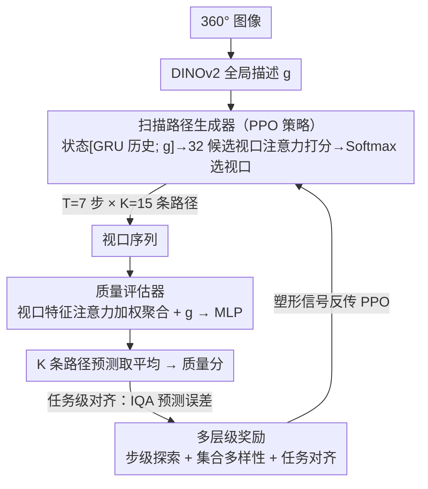

# RL-ScanIQA: Reinforcement-Learned Scanpaths for Blind 360° Image Quality Assessment

**会议**: CVPR 2026  
**arXiv**: [2603.14297](https://arxiv.org/abs/2603.14297)  
**代码**: 无  
**领域**: 模型压缩  
**关键词**: 360 image quality, reinforcement-learning, scanpath, blind IQA, PPO, active perception

## 总结

本文提出 RL-ScanIQA，首个基于强化学习的端到端盲 360° 图像质量评估（BIQA）框架。核心思想是将扫描路径（scanpath）生成建模为序列决策过程，使用 PPO 策略直接从质量评估反馈中学习任务驱动的观看策略，而非依赖人类注视数据的模仿学习。框架包含扫描路径生成器和质量评估器两个联合优化的模块，辅以多层级奖励（步级探索、集合多样性、任务对齐感知）和失真空间数据增强。在 CVIQD、OIQA、JUFE 三个基准上取得了 SOTA 性能和优异的跨数据集泛化能力。

## 动机

1. **360° 图像的视口限制**：全景图像在沉浸式环境中只能通过有限视口逐步体验，质量感知取决于观看轨迹而非全图
2. **现有方法解耦扫描路径与质量评估**：已有扫描路径方法将路径生成作为独立预处理步骤，无法端到端优化，路径不与 IQA 目标对齐
3. **人类注视数据依赖**：先前方法需要人类眼动追踪数据作为监督，成本高昂且可能偏向显著内容而非质量相关区域
4. **ERP 投影失真**：直接在等距柱状投影上分析会引入空间偏差，忽略球面几何特性
5. **固定采样策略的局限**：基于预定义视口的方法忽略了用户探索的序列性质和内容自适应性
6. **跨数据集泛化差**：不同数据集的失真类型差异大，固定策略方法在跨域场景下性能急剧下降

## 方法详解

### 整体框架

RL-ScanIQA 针对 360° 图像的一个特性：全景图在沉浸式环境里只能通过有限视口逐步看，质量感知取决于看的轨迹而非全图。以往把扫描路径生成当独立预处理、再喂给质量评估，两头不对齐，还得靠昂贵的人类眼动数据监督。本文把扫描路径生成建成序列决策过程，用 PPO 直接从质量评估反馈里学任务驱动的观看策略，让"路径生成器"和"质量评估器"两个模块端到端联合优化——生成器走一条覆盖关键区域的视口序列，评估器据此回归质量分，评估误差又反过来塑造路径，形成"看哪里→打分→奖励→修正看哪里"的闭环。

### 关键设计

**1. 扫描路径生成器：把"看哪里"建成 PPO 策略**

把球面离散成 $8 \times 4 = 32$ 个候选视口（$90° \times 90°$ FOV），建成有限时间 MDP：状态 $s_t = [h_{t-1}; g]$ 拼接 GRU 历史隐状态 $h_{t-1}$ 和 DINOv2 抽的全局描述 $g$；动作是对候选视口特征做注意力打分后 Softmax 选下一个视口；用 PPO 带裁剪目标、GAE 优势估计和熵正则化优化。这样路径不再是预处理出来的固定轨迹，而是为质量评估这个下游目标学出来的——也正因如此，RL 学到的路径反而比人类真实注视轨迹更好（SRCC 0.724→0.816），因为人会被显著内容吸引而非质量关键区域。

**2. 多层级奖励：把稀疏的 IQA 监督摊成密集塑形信号**

只靠最终质量误差这个稀疏信号训不动策略，本文把奖励拆成三层。步级探索奖励 $r_t = \lambda_{\text{ent}} \cdot \mathcal{H}(x_t) + \lambda_{\text{ssim}} \cdot (1-\text{SSIM}) + \lambda_{\text{nov}} \cdot \delta_{\text{new}} + \lambda_{\text{eqb}} \cdot \mathcal{B}(x_t)$，用信息熵引向纹理丰富区、SSIM 差异促多样、新颖性信号防重复访问、赤道偏置先验模拟人类习惯；集合级多样性奖励 $\mathcal{R}_{\text{div}} = \beta_{\text{cov}} \cdot \frac{|\cup_k S_k|}{X} - \beta_{\text{jac}} \cdot \text{平均Jaccard相似度}$ 让 $K$ 条路径覆盖更大球面、惩罚彼此重叠；任务级对齐奖励则由 IQA 预测误差直接反馈，含 MSE 负奖励 $\mathcal{R}_{\text{mse}}$ 和排序奖励 $\mathcal{R}_{\text{rank}}$，把路径生成钉在质量预测目标上。三层从步到集合再到任务，逐级把稀疏监督变成可优化的密集信号。

**3. 质量评估器：注意力加权聚合多视口**

评估器把走过的视口特征按注意力加权聚合——权重 $\alpha_t$ 由局部特征 $f_t$ 与全局特征 $g$ 交互算出，聚合表示再与全局特征拼接后过 MLP 回归质量分；$K$ 条路径各出一个预测、取平均作为最终分数。注意力加权让评估器偏重失真敏感的视口，而非平均对待所有看到的区域。

### 损失函数 / 训练策略

为提升跨数据集泛化，额外加三项约束：一致性损失要求弱增强后预测稳定；三元组损失约束清晰/轻度失真/重度失真的分数排序；交叉排序损失保证增强后图像对间的相对质量关系不变。这套失真空间增强 + 排序一致性正是跨域评估大幅领先的关键。

## 实验

### 表1：数据集内评估结果（SRCC / PLCC）

| 方法 | JUFE | OIQA | CVIQD |
|------|------|------|-------|
| NIQE (手工特征) | 0.552 / 0.592 | 0.745 / 0.736 | 0.893 / 0.872 |
| MC360IQA | 0.502 / 0.623 | 0.875 / 0.906 | 0.877 / 0.892 |
| Assessor360 | 0.489 / 0.510 | 0.979 / 0.945 | 0.958 / 0.963 |
| GSR-X | 0.843 / 0.857 | 0.922 / 0.937 | 0.805 / 0.957 |
| Q-Insight (LLM) | 0.557 / 0.412 | 0.643 / 0.795 | 0.872 / 0.801 |
| **RL-ScanIQA** | **0.816 / 0.902** | **0.941 / 0.967** | **0.970 / 0.970** |

> RL-ScanIQA 在所有数据集上取得最高 PLCC，CVIQD 上 SRCC 也最优。在 JUFE 上 PLCC 大幅领先（0.902 vs 0.857），显示强化学习策略在真实失真分布下的优势。

### 表2：跨数据集评估结果（SRCC / PLCC）

| 方法 | 训练:CVIQD→测试:OIQA/JUFE | 训练:JUFE→测试:CVIQD/OIQA |
|------|---------------------------|---------------------------|
| Assessor360 | 0.853/0.632 — 0.887/0.749 | 0.617/0.724 — 0.405/0.499 |
| GSR-X | 0.804/0.765 — 0.831/0.694 | 0.782/0.732 — 0.733/0.611 |
| F-VQA(A) | 0.772/0.621 — 0.604/0.509 | 0.665/0.679 — 0.683/0.732 |
| **RL-ScanIQA** | **0.901/0.800 — 0.913/0.822** | **0.771/0.755 — 0.802/0.833** |

> 跨数据集泛化显著优于所有对比方法，验证了失真增强和排序一致性约束的有效性。

## 亮点

1. **首个端到端 RL-based 360° IQA 框架**：将扫描路径生成与质量评估联合优化，无需人类眼动数据
2. **多层级奖励设计精巧**：从步级到集合级到任务级，将稀疏 IQA 监督转化为密集塑形信号
3. **反直觉发现有价值**：人类真实注视轨迹反而不如 RL 学出的路径（Table 3: 0.724→0.816 SRCC），表明人类倾向关注显著内容而非质量关键区域
4. **跨域泛化能力强**：失真空间增强 + 排序一致性损失使得模型在不同失真类型间迁移效果好
5. **可视化直观有说服力**：高质量图像路径均匀覆盖，低质量图像路径聚焦失真区域

## 局限

1. **计算开销较大**：推理时需要 K=15 条路径 × T=7 步 = 105 次视口特征提取，实时性受限
2. **离散化视口可能过粗**：32 个候选视口可能无法精确定位微小失真区域
3. **仅评估了三个数据集**：全景 IQA 数据集规模有限，CVIQD、OIQA 各仅数百张图
4. **DINOv2 作为固定特征提取器**：冻结的预训练模型可能不是对失真最敏感的特征提取方案
5. **依赖 MOS 标注**：训练仍需要精确的人工主观评分，标注成本较高
6. **奖励函数超参数多**：步级 4 个权重 + 多样性 2 个 + 任务对齐 2 个 + 损失函数 5 个，调参负担重

## 相关工作

- **2D BIQA**：BRISQUE（自然场景统计）、DBCNN、TreS、MANIQA（Transformer）、Q-Insight（多模态 RL + LLM）
- **360° BIQA**：MC360IQA（多分支 CNN 固定视口）、VGCN（图卷积视口关系）、Assessor360/GSR-X/F-VQA（扫描路径建模但解耦训练）
- **强化学习视觉任务**：视角规划、视频摘要、注意力选择；PPO 在稀疏奖励下结合方差缩减和值引导表现稳健
- **360° 视觉探索**：眼动追踪研究表明赤道偏置、显著目标偏好等人类观看行为特征

## 评分

| 维度 | 分数 (1-10) | 说明 |
|------|:-----------:|------|
| 创新性 | 8 | 首次将 RL 端到端引入 360° IQA，联合优化路径+评估的范式新颖 |
| 技术贡献 | 8 | 多层级奖励设计合理，跨域增强策略有效 |
| 实验充分度 | 7 | 三个数据集覆盖、消融实验完整，但数据集规模偏小 |
| 写作质量 | 8 | 结构清晰，图表丰富，对比全面 |
| 实用价值 | 7 | 360° IQA 需求日增，但推理开销和超参数量可能限制部署 |
| **总分** | **7.6** | **将主动感知引入 360° 质量评估的优秀工作，端到端 RL 范式有启发意义** |

<!-- RELATED:START -->

## 相关论文

- [\[CVPR 2026\] Block-based Learned Image Compression without Blocking Artifacts](block-based_learned_image_compression_without_blocking_artifacts.md)
- [\[ICML 2026\] Efficient Learned Image Compression without Entropy Coding](../../ICML2026/model_compression/efficient_learned_image_compression_without_entropy_coding.md)
- [\[AAAI 2026\] DynaQuant: Dynamic Mixed-Precision Quantization for Learned Image Compression](../../AAAI2026/model_compression/dynaquant_dynamic_mixed-precision_quantization_for_learned_i.md)
- [\[CVPR 2025\] Learned Image Compression with Dictionary-based Entropy Model](../../CVPR2025/model_compression/learned_image_compression_with_dictionary-based_entropy_model.md)
- [\[CVPR 2026\] CARLoS: Retrieval via Concise Assessment Representation of LoRAs at Scale](carlos_retrieval_via_concise_assessment_representation_of_loras_at_scale.md)

<!-- RELATED:END -->
