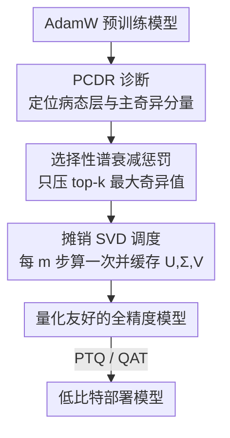

# S2D: Selective Spectral Decay for Quantization-Friendly Conditioning of Neural Activations

**会议**: CVPR 2026  
**论文**: [CVF Open Access](https://openaccess.thecvf.com/content/CVPR2026/html/Chavan_S2D_Selective_Spectral_Decay_for_Quantization-Friendly_Conditioning_of_Neural_Activations_CVPR_2026_paper.html)  
**代码**: 无  
**领域**: 模型压缩  
**关键词**: 激活离群值、低比特量化、谱正则化、奇异值、SigLIP

## 一句话总结
S2D 把激活离群值的根因定位到权重矩阵被"撑大"的少数主奇异值上，在微调阶段只对这几个最大奇异值做选择性谱衰减，从而在不重训练的前提下把模型调成"量化友好"的形态，W4A4 PTQ 在 ImageNet 上最多涨 7%。

## 研究背景与动机
**领域现状**：大规模 transformer（尤其是 SigLIP 这类视觉/多模态 encoder）在部署时普遍要做低比特量化（如 W4A4），而激活离群值（activation outlier）是量化的头号障碍——某些维度的激活值会比正常值大几个数量级。

**现有痛点**：仿射量化必须用一个统一的 scale 覆盖整个激活范围，一旦存在极端离群值，scale 被迫拉得很大，于是绝大多数正常激活被压进同一个量化 bin（甚至全被舍入到 0），量化精度崩塌。作者还观察到一个反直觉现象：**离群值的严重程度随预训练规模/时长单调上升**——从 CLIP → SigLIP → SigLIP2，离群值越来越夸张。

**核心矛盾**：以往方法要么"绕开"离群值（混合精度把离群维度留 FP16、SmoothQuant 把难度从激活搬到权重），要么靠正交优化器（Muon）从头训练来抑制——但 Muon 这类方法是为 from-scratch 设计的，套到已经用 AdamW 预训练好的模型上收益很小。真正的根因——离群值到底从哪儿来——一直没被讲清楚。

**本文目标**：(1) 把离群值的几何根因找出来；(2) 设计一个能直接作用在已有 AdamW 预训练模型上、不必从头重训的"调理"方法，让模型天生量化友好。

**切入角度**：作者从 SVD 的视角观察——线性层 $y=Wx$ 的输出幅度被权重的谱范数 $\sigma_{\max}(W)$ 上界约束（$\|y\|_2 \le \sigma_{\max}(W)\cdot\|x\|_2$）。他们进一步用一个自定义诊断指标 PCDR 量化"某个激活值有多少来自权重的 top-k 奇异分量"，发现离群激活的 PCDR 接近 1，证明离群值几乎完全由少数被膨胀的主奇异分量制造。

**核心 idea**：既然根因是少数主奇异值被 AdamW 长期训练"吹大"，那就**只对这几个最大奇异值施加衰减**（用幂次 $n>1$ 的谱惩罚），而不是像 L2 weight decay 那样对所有奇异值一视同仁地收缩。

## 方法详解

### 整体框架
S2D 的目标是把一个已经用 AdamW 预训练好的模型，在下游微调（或独立后处理）阶段"调理"成量化友好的权重几何形态。整条逻辑链是：先用诊断指标 PCDR 找出哪些层、哪几个奇异分量"病了"，再对这些被点名的主奇异值施加一个幂次谱惩罚把它们压下去，同时几乎不动小奇异值（保住模型容量），最后产出的全精度 checkpoint 直接喂给任意现成 PTQ/QAT 方法都更稳。为了让 SVD 不拖垮训练，作者用"每 $m$ 步算一次 SVD 并缓存"的摊销策略。

### 关键设计

**1. PCDR 诊断指标：把离群值的来源量化到具体的奇异分量**

直接看激活分布只能知道"有离群值"，没法定位"是权重的哪一部分制造的"，于是作者定义了 **Principal Component Dominance Ratio（PCDR，主成分主导比）**。对权重 $W=U\Sigma V^\top$，第 $i$ 个神经元在样本 $x_j$ 上的输出可按奇异方向展开 $A_{ij}=\sum_r \sigma_r u_{ir}v_r^\top x_j$；PCDR$_k$ 定义为前 $k$ 个奇异分量贡献的幅度占总幅度的比例：$\text{PCDR}_k^{(i,j)} = \big|\sum_{r=1}^{k}\sigma_r u_{ir}v_r^\top x_j\big| \big/ \big|\sum_r \sigma_r u_{ir}v_r^\top x_j\big|$。值接近 1 表示这个激活几乎全由 top-k 主分量决定，接近 $1/n$ 表示均匀分布。实测里离群激活的 PCDR$_3$ 随 CLIP→SigLIP→SigLIP2 越来越接近 1（如 SigLIP2 Layer 5 的 PCDR$_3$=0.95），这就坐实了"离群值不是整张权重矩阵均匀产生的，而是被少数膨胀的主奇异值集中制造"。PCDR 同时充当后面"挑哪些层/哪些分量去正则"的选择依据。

**2. 选择性谱衰减正则项：只罚最大奇异值，放过小奇异值**

标准 L2 weight decay 惩罚 $\frac{\lambda}{2}\|W\|_F^2=\frac{\lambda}{2}\sum_i\sigma_i^2$，对所有奇异值施加均匀压力，既压病态的大奇异值也误伤承载有用信息的小奇异值。S2D 改成一个幂次更高的谱惩罚：定义 $W^{(n)}=U\Sigma^n V^\top$（实指数 $n>1$），正则项为

$$L_{S2D}^{(n)}(W)=\frac{\lambda}{n+1}\,\mathrm{tr}\big((W^{(n)})^\top W\big)=\frac{\lambda}{n+1}\sum_{i=1}^{N}\sigma_i^{n+1}.$$

由于惩罚项是 $\sigma_i^{n+1}$，当 $n>1$ 时大奇异值受到的压力被指数级放大、小奇异值几乎不受影响（$n=1$ 时退化为普通 L2）。对应的梯度也很简洁：$\partial L_{S2D}/\partial W_{ij}=\lambda\sum_k U_{ik}\sigma_k^{n}V_{jk}$，相当于把 L2 梯度里的 $\sigma_k$ 换成 $\sigma_k^{n}$，把正则压力定向集中到 Theorem 1 指出的、负责最坏放大的那几个 $\sigma_i$ 上。这正是"对症下药"——既抹掉制造离群值的谱病态，又保住模型的表示容量。

**3. PCDR 选择 + 摊销 SVD：让谱正则既精准又算得起**

每步对所有层做完整 SVD 并对全部奇异值施加梯度，既贵又没必要（病态只集中在少数层的少数分量）。S2D 用两个机制把代价压下来。其一是 **PCDR 选择**：用两个超参 $\tau$（判定"谱质量过度集中"的最小 PCDR 阈值）和 $K_{\max}$（最多考虑几个主奇异值），对每层找最小的 $k_{\text{target}}\le K_{\max}$ 使 $\text{PCDR}_{k_{\text{target}}}\ge\tau$；找得到才把这层标记为需要正则、且只罚它的 top-$k_{\text{target}}$ 个分量，否则视为健康层不施加 S2D 梯度。其二是 **摊销 SVD**：不每步重算 SVD，而是每 $m$ 步做一次全网 SVD、缓存 $(U,\Sigma,V)$ 和目标 rank，随后 $m-1$ 步都复用这份（略陈旧的）缓存施加梯度，把 SVD 的高成本摊到 $m$ 步上。

### 损失函数 / 训练策略
总损失 = 下游任务损失 + S2D 谱正则 $L_{S2D}^{(n)}$。全实验统一超参：$\tau=0.95$、$K_{\max}=3$、$m=100$、$n=2$、$\lambda=5\times10^{-4}$。从 SigLIP2 预训练 backbone 出发微调 10 个 epoch 得到全精度 checkpoint，再交给现成 PTQ（ERQ / PTQ4ViT / RepQ-ViT）；QAT 场景下前向用模拟量化、反向用 STE，与 AdamW QAT baseline 共享相同学习率与超参。

## 实验关键数据

### 主实验
SigLIP2-Base 在 ImageNet-1k 上的 PTQ 精度（节选 384 分辨率、ERQ）：

| 配置 | 指标 | AdamW | AdamW+S2D | 提升 |
|--------|------|------|----------|------|
| ERQ W4A4 (384) | Top-1 | 65.6 | 73.0 | +7.4 |
| RepQ-ViT W5A5 (384) | Top-1 | 46.0 | 78.0 | +32.0 |
| RepQ-ViT W6A6 (384) | Top-1 | 58.5 | 80.0 | +21.5 |
| PTQ4ViT W5A5 (384) | Top-1 | 3.4 | 62.0 | +58.6 |
| FP16 (384) | Top-1 | 85.0 | 85.0 | ≈0 |

关键点：全精度精度基本不掉（FP16 85.0 → 85.0），说明 S2D 只是重塑权重几何以利量化，不牺牲表示能力；越是低比特、越是激进的 PTQ 方法，S2D 带来的增益越大。

下游任务与 VLM 上同样泛化（W4A4 量化下）：

| 任务/Benchmark | 指标 | AdamW | AdamW+S2D |
|--------|------|------|----------|
| 目标检测 (COCO, ERQ W5A5) | AP50 | 10.8 | 40.7 |
| 实例分割 (COCO, ERQ W5A5) | AP | 11.7 | 34.4 |
| GQA (LLaVA-1.5, W4A4) | Acc | 35.3 | 40.1 |
| DocVQA (LLaVA-1.5, W6A6) | Acc | 8.8 | 12.4 |

QAT 低比特场景：W3A4 从 62.4%→（baseline 59.9%，S2D 62.4%）、W4A4 从 65.8%→69.7%，S2D 分别带来约 2.5% 和 3.9% 的绝对提升。

### 消融实验
| 指标 / 层 | AdamW | AdamW+S2D | 说明 |
|------|---------|------|------|
| PCDR$_1$ (Layer 9) | 0.77 | 0.09 | 谱质量集中度大幅下降 |
| Max Abs. 激活 (Layer 9) | 1166.2 | 614.7 | 离群幅度明显收缩 |
| $\sigma_{\max}$ (Layer 9) | 7.9 | 3.9 | 主奇异值被压下来 |
| PCDR$_1$ (Layer 5) | 0.91 | 0.46 | 病态层条件数改善 |

### 关键发现
- S2D 直接作用在"病因"（主奇异值）上：被点名的层 PCDR$_1$、最大激活、$\sigma_{\max}$ 同步下降，证明谱衰减确实在抑制离群值而非靠 PTQ 方法的偶然交互。
- 增益对 PTQ 方法无关（ERQ / PTQ4ViT / RepQ-ViT 都涨），说明好处来自更好的权重条件数，是"换地基"而非"换装修"。
- 离群值随预训练规模升级（CLIP→SigLIP→SigLIP2）单调加重，且三者用同款 ViT-Base 架构，排除了"架构导致"的可能，坐实"长期 AdamW 优化的产物"这一假设。

## 亮点与洞察
- **把"离群值"这个经验现象归因到可计算的谱量**：PCDR 指标 + Theorem 1 把"激活为什么会爆"讲成"权重主奇异值被吹大"，这一步把含糊的工程问题变成可定向干预的几何问题，是全文最"啊哈"之处。
- **选择性谱衰减是 L2 的优雅推广**：把 $\sum\sigma_i^2$ 改成 $\sum\sigma_i^{n+1}$（$n>1$），一个超参就把"均匀收缩"变成"专打大奇异值"，且梯度形式干净（$\sigma_k\to\sigma_k^n$），实现成本低。
- **不重训、可叠加**：S2D 只在下游微调时加一项正则，产出的 checkpoint 与任意现成 PTQ/QAT 正交叠加，工程上极易落地——这种"调理而非替换"的思路可迁移到其它需要量化友好性的场景（如 LLM 微调前先做谱调理）。

## 局限与展望
- 摊销 SVD 用的是每 $m$ 步缓存的"陈旧"奇异向量，权重在这 $m$ 步里会漂移，引入近似误差；$m$、$\tau$、$K_{\max}$ 的敏感性分析放在补充材料，正文未充分展开（⚠️ 以原文为准）。
- 主战场是视觉/多模态 encoder（SigLIP2、LLaVA-1.5 的视觉端），对纯大语言模型主干的离群值是否同样有效，正文只给了"离群值在 LLM 上更早被观察到"的旁证，未做 LLM 主干的系统验证。
- POPE 上 S2D 与 baseline 几乎无差异，说明在部分对离群值不敏感的任务上收益有限。
- 需要在下游微调阶段介入；对于完全无法微调、只能拿到现成权重做纯 PTQ 的场景，S2D 作为"独立后处理"的效果正文着墨较少。

## 相关工作与启发
- **vs 混合精度 / SmoothQuant / Outlier Suppression**：这些方法"绕开"离群值——把离群维度留高精度、或把量化难度从激活搬到权重；S2D 直接消除离群值的根因（谱失衡），产出的模型对所有 PTQ 都更友好，且与它们正交可叠加。
- **vs 正交优化器（Muon）**：Muon 通过正交化更新从头训练来抑制离群值，但套到已 AdamW 预训练的模型上收益很小；S2D 专为"已有预训练模型"设计，无需从头重训。
- **vs RepQ-ViT / PTQ4ViT / ERQ 等 ViT PTQ**：它们在量化算法侧做文章（重参数化、孪生量化器、岭回归纠错）；S2D 在量化之前就把权重几何调好，给这些 PTQ 方法一个更好的起点，因此能叠加涨点。

## 评分
- 新颖性: ⭐⭐⭐⭐⭐ PCDR 诊断 + 选择性谱衰减把离群值归因到主奇异值并定向干预，视角新颖且自洽。
- 实验充分度: ⭐⭐⭐⭐ 覆盖 PTQ/QAT、分类/检测/分割/VLM 多场景，但主要集中在 SigLIP2 系，LLM 主干验证欠缺。
- 写作质量: ⭐⭐⭐⭐ 动机—理论—方法—实验链条清晰，Theorem 1 与 PCDR 定义明确；部分超参敏感性分析下放补充材料。
- 价值: ⭐⭐⭐⭐⭐ "调理而非替换"、与现成量化器正交叠加，工程落地价值高。

<!-- RELATED:START -->

## 相关论文

- [\[CVPR 2026\] SelecTKD: Selective Token-Weighted Knowledge Distillation for LLMs](selectkd_selective_token-weighted_knowledge_distillation_for_llms.md)
- [\[ICML 2025\] Sparse Spectral Training and Inference on Euclidean and Hyperbolic Neural Networks](../../ICML2025/model_compression/sparse_spectral_training_and_inference_on_euclidean_and_hyperbolic_neural_networ.md)
- [\[ICML 2025\] Merge-Friendly Post-Training Quantization for Multi-Target Domain Adaptation](../../ICML2025/model_compression/merge-friendly_post-training_quantization_for_multi-target_domain_adaptation.md)
- [\[AAAI 2026\] SpecQuant: Spectral Decomposition and Adaptive Truncation for Ultra-Low-Bit LLMs Quantization](../../AAAI2026/model_compression/specquant_spectral_decomposition_and_adaptive_truncation_for_ultra-low-bit_llms_.md)
- [\[ICML 2026\] Selective Coupling of Decoupled Informative Regions: Masked Attention Alignment for Data-Free Quantization of Vision Transformers](../../ICML2026/model_compression/selective_coupling_of_decoupled_informative_regions_masked_attention_alignment_f.md)

<!-- RELATED:END -->
