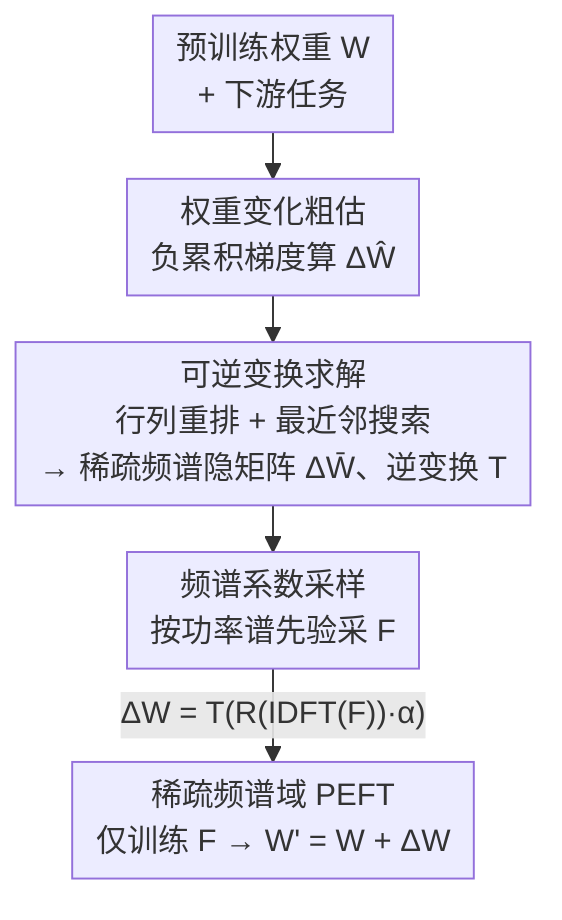

# S2FT: Parameter-Efficient Fine-Tuning in Sparse Spectrum Domain

**会议**: CVPR2026  
**arXiv**: [2605.08589](https://arxiv.org/abs/2605.08589)  
**代码**: 待确认  
**领域**: 模型压缩 / 参数高效微调（PEFT）  
**关键词**: PEFT, 傅里叶变换, 稀疏频谱, 行列重排, 权重变化建模

## 一句话总结
针对傅里叶类 PEFT 假设"权重变化 $\Delta W$ 频谱稀疏"实际不成立（频谱接近功率均匀分布）的问题，S2FT 先粗估 $\Delta W$，再用行列重排找到一个可逆变换把它映射成一个频谱真正稀疏的隐空间矩阵 $\Delta\bar W$，在这个稀疏频谱域上只训练少量频谱系数，用 0.08% 参数就超过 FourierFT 等基线。

## 研究背景与动机
**领域现状**：把大模型适配到下游任务时，全量微调代价太高，PEFT 成为主流。LoRA 用两个低秩矩阵的乘积 $\Delta W=AB$ 来建模权重变化，已经把可训练参数压得很小；FourierFT 更进一步，把 $\Delta W$ 当作一个空间域矩阵，随机初始化一个复数频谱矩阵 $F$（只有少数系数可训练），通过逆傅里叶变换重建 $\Delta W=\mathcal R(IDFT(F))\cdot\alpha$，从而只用几千个频谱系数就完成微调。

**现有痛点**：FourierFT 的整个设计建立在一个关键假设上——$\Delta W$ 是空间域里平滑、因而频谱稀疏的矩阵，所以少量频谱系数就能近似它。但这个假设从没被认真检验过。

**核心矛盾**：作者对 ViT 全量微调得到的真实 $\Delta W$ 做频谱分析后发现，$\Delta W$ 在空间域是杂乱的（包含各种频率成分），其功率谱**不是稀疏的，而是接近"功率均匀"（power-uniform）分布**——能量几乎平摊在所有频率上。定量看：要把 $\Delta W$ 的重建相对误差压到 10% 以下，需要采样超过 90% 的频谱系数。这意味着只取少量系数根本无法准确建模 $\Delta W$，FourierFT 的性能天花板就卡在这里。

**本文目标**：既然直接在 $\Delta W$ 的均匀频谱上做 PEFT 行不通，能不能找到一个频谱**真正稀疏**的隐矩阵 $\Delta\bar W$，它能被无损地变换回 $\Delta W$？

**切入角度**：作者借用一个经典先验——**频谱稀疏的矩阵在空间域往往是局部平滑的**。反过来，如果能把杂乱的 $\Delta W$ 重新排成一个局部平滑的矩阵，它的频谱就会变稀疏，少量低频系数即可建模。

**核心 idea**：寻找一个可逆变换 $T(\cdot)$，把频谱稀疏的隐矩阵 $\Delta\bar W$ 映射成 $\Delta W$，于是 $W'=W+T(\mathcal R(IDFT(F))\cdot\alpha)$，把 PEFT 搬到这个稀疏频谱域里做。关键在于这个 $T$ 必须既能让矩阵变平滑、又不破坏神经元连接结构、还得可逆——作者证明**行列重排**恰好同时满足这三点。

## 方法详解

### 整体框架
S2FT 的目标是：在一个频谱稀疏的隐空间里做傅里叶 PEFT，让少量频谱系数被充分利用。整条流程是：给定预训练权重 $W$ 和下游任务，先用一小批样本的累积梯度**粗估**出一个权重变化 $\Delta\hat W$ 作为先验；再以 $\Delta\hat W$ 为引导，把"找可逆变换"建模成一个**行列重排**问题，用最近邻搜索求出行/列的排列 $\pi_r,\pi_c$，得到频谱稀疏的隐矩阵 $\Delta\bar W$ 及其逆变换 $T$；最后在 $\Delta\bar W$ 的稀疏频谱上，按**功率谱先验采样**少量可训练系数 $F$，训练时通过 $T$ 还原回 $\Delta W$ 注入到 $W$ 上。

注意：重排只是对行列做"重新编号"，所以可逆变换 $T$ 就是逆重排索引——$\Delta W[\pi_r,:][:,\pi_c]=\Delta\bar W$，几乎零额外开销（一次变换仅 0.02s）。预估和重排都只在训练前做一次，不进入反向传播。

### 关键设计

**1. 权重变化粗估：用负累积梯度当先验，避免全量微调**

要找出合适的可逆变换 $T$，得先知道 $\Delta W$ 大致长什么样。最理想是直接全量微调拿到 $W'$ 再求差 $\Delta\hat W=W'-W$，但这既昂贵又与 PEFT "省训练成本"的初衷自相矛盾。作者的关键观察是：**这里并不需要精确的 $\Delta W$，一个粗略近似就足以指导行列重排**。于是用训练集的一个子集 $\mathcal D_{sub}$ 上的**负累积梯度**来粗估：

$$\Delta\hat W=-\sum_{x\in\mathcal D_{sub}}\nabla\mathcal L_x(w_i)$$

道理来自梯度下降：$\Delta W$ 本质是权重更新方向，而沿累积梯度的反方向更新恰好能降低下游任务损失，所以负累积梯度就是我们要找的更新方向的粗略估计。与 GPS、SPT 等也算梯度的 PEFT 方法不同，它们用梯度估**权重重要性**，这里是用梯度估**权重变化的模式**。消融（表 6）显示，把这步换成更精确的全量微调预估（甚至训 5 个 epoch），精度对最终结果几乎无影响，印证了"粗估足够"。

**2. 可逆变换：把"找变换"转成行列重排，三个约束一次满足**

频谱稀疏 ⇔ 空间局部平滑，所以要找的变换需同时满足三点：①变换后矩阵更平滑；②不破坏神经元的连接结构（输入-输出依赖）；③可逆（训练时要能精确还原回原权重空间）。作者发现**行列重排**完美命中这三点：重排相邻行/列使差异最小化 → 矩阵更平滑（满足①）；交换权重矩阵的行或列只改变输入/输出神经元的排列顺序、不改变 $w_{ij}$ 这条连接本身（满足②）；置换天然可逆（满足③）。

于是变换被形式化为一个排列优化：在完全加权图 $\mathcal G$ 上，每个节点是 $\Delta\hat W$ 的一行（或一列），边权 $\beta_{ij}$ 是行 $i$ 与行 $j$ 的欧氏距离，目标是找一个排列 $\pi$ 使相邻行/列的总距离最小：

$$\arg\min_{\pi\in\mathcal P_n}\sum_{k=1}^{n-1}\beta_{\pi_k,\pi_{k+1}}$$

论文用 Proposition 1 把这个空间域目标等价改写到频域：相邻差的平方和等于 $\sum_u 8\sin^2(\frac{\pi u}{n})|DFT(\Delta\bar W)_u|^2$。由于权重 $8\sin^2(\frac{\pi u}{n})$ 随频率索引 $u$ 单调增大，**最小化相邻距离 = 压制高频能量、把谱能量逼向低频**，因此最小化目标隐式地让重排后的 $\Delta\bar W$ 频谱变稀疏。这就是"行列重排能造出稀疏频谱"的理论依据。

**3. 最近邻搜索求解重排：贪心绕开 NP-hard**

式(5)的排列优化本质是 NP-hard（结构上类似旅行商）。作者用最近邻搜索贪心求解（Algorithm 1）：随机选一个起始行作为 $\pi_1$，之后每一步从未访问集合里挑与当前行距离 $\beta$ 最小的行接上，直到排完，行、列各跑一次得到 $\pi_r,\pi_c$。简单高效，且整套重排只是"重新编号"，逆变换 $T$ 就是按 $\pi_r,\pi_c$ 逆向索引，几乎不增加推理/存储成本。

**4. 功率谱先验采样：按 $\Delta\bar W$ 的谱分布采可训练系数**

S2FT 的频谱是稀疏的，和 FourierFT 的均匀谱不同，所以系数采样策略也得变。作者实测发现 S2FT 在**偏向低频采样**时最好，且这个规律对所有任务都成立（FourierFT 则是各任务最优中心频率随机漂移——正因为它的谱是均匀的）。但纯偏低频仍不能精确匹配真实谱分布。于是作者直接把 $\Delta\bar W$ 的功率谱当先验，定义每个频率位置 $(u,v)$ 被采为可训练系数的概率：

$$p(u,v)=\frac{\|DFT(\Delta\bar W)\|^\gamma_{(u,v)}}{\sum_{u,v}\|DFT(\Delta\bar W)\|^\gamma_{(u,v)}}$$

其中 $\gamma$ 控制分布平滑度（经验取 $\gamma=1.5$）。按此概率为复数矩阵 $F$ 采样少量可训练点，让有限的系数预算落在能量最集中的频率上。消融（表 7）显示该采样比随机采样、纯偏低频采样分别高出约 1.6%、0.8%。

### 损失函数 / 训练策略
没有新增损失项，沿用下游任务原本的监督损失。训练时只有采样出的频谱系数 $F$ 可学，前向用 $W'=W+T(\mathcal R(IDFT(F))\cdot\alpha)$ 注入权重变化。图像分类用 AdamW + 余弦学习率衰减、100 epoch（10 epoch 线性 warm-up）；FourierFT 采 6000 点、S2FT 只采 3000 点（参数减半仍更优）。$\Delta\hat W$ 预估与行列重排都在训练前一次性完成，不进反向传播。

## 实验关键数据

### 主实验
在图像分类、图像生成、自然语言理解、指令微调四类任务上验证。S2FT 用约 FourierFT 一半的参数普遍更优。

| 任务/基准 | 指标 | FourierFT | S2FT (同参) | S2FT 更省参版 |
|-----------|------|-----------|-------------|---------------|
| VTAB-1k (ViT-B/16) | Mean Acc / Params% | 72.8 / 0.16 | 74.1 / 0.16 | 73.6 / **0.08** |
| FGVC (5 数据集) | Mean Acc / Params% | 87.9 / 0.16 | 89.6 / 0.16 | 89.1 / **0.08** |
| GLUE (RoBERTa-base) | Avg / Params% | 85.0 / 0.02 | **85.6** / 0.02 | — |
| GLUE (RoBERTa-large) | Avg / Params% | 88.0 / 0.01 | **88.3** / 0.01 | — |
| 主体驱动生成 | DINO↑ / CLIP-I↑ / LPIPS↑ / Params% | 0.607 / 0.750 / 0.732 / 0.07 | 0.620 / 0.784 / 0.769 / **0.06** | — |
| Instruct (LLaMA2-13B) | MT-Bench / Vicuna | 5.82 / 7.92 | **5.89 / 7.94** | — |

亮点：VTAB 上 S2FT 用 0.08% 参数（仅 FourierFT 一半）就达到 73.6 平均精度，同参 0.16% 时达 74.1，比 FourierFT 提升约 1~2%；GLUE 上 RoBERTa-large 仅用 0.01% 参数取得 88.3 平均分，是表中唯一超过 100% 全量微调（88.2）的方法；生成任务用 0.06% 参数即可媲美 DreamBooth(100%)/LoRA(1.44%)。

### 消融实验
| 配置 | 关键指标 (VTAB Mean Acc) | 说明 |
|------|--------------------------|------|
| S2FT (完整) | 73.6 | 功率谱先验采样 |
| 随机采样 | 72.0 | 掉 1.6%，采样策略很重要 |
| 偏低频采样 (LF) | 72.8 | 掉 0.8%，比随机好但不如先验采样 |
| 预估用 Eq.4 (本文) | 73.6 | 负累积梯度粗估 |
| 预估用全量微调 5 epoch | 73.8 | 精确预估仅 +0.2%，证明粗估足够 |
| $\gamma=0.5$ | 72.3 | 采样过于均匀 |
| $\gamma=1.5$ (默认) | 73.6 | 最优 |
| $\gamma=5.0$ | 72.7 | 过平滑反而掉点 |

训练成本（表 8，ViT-B）：S2FT 训练 4.2s/epoch、显存 8.5GB、参数 0.08%，对比 FourierFT（4.0s / 8.7GB / 0.16%）和 LoRA（3.8s / 9.7GB / 0.37%）——参数最少、显存最省，行列重排额外开销仅 0.02s。

### 关键发现
- **采样策略是第二大贡献**：去掉功率谱先验采样、退回随机采样直接掉 1.6%，说明在稀疏频谱里"把系数预算花在能量集中处"很关键。
- **预估精度几乎不重要**：负累积梯度粗估与全量微调精确预估（训 5 epoch）只差 0.2%，因为预估只用来指导一个粗略的行列重排，方法对其精度不敏感——这正是 S2FT 能省成本的底气。
- **$\gamma$ 呈倒 U 型**：从 0.5 增到 1.5 精度稳步升（72.3→73.6），超过 1.5 因过平滑、偏离真实分布而回落。
- **频率偏好可解释**：S2FT 偏好低频（谱确实稀疏），而 FourierFT 最优中心频率随任务随机漂移（谱均匀），首次解释了 FourierFT 论文里"低频常非最优"这一未解现象。

## 亮点与洞察
- **证伪了一个被默认的前提**：傅里叶类 PEFT 一直默认 $\Delta W$ 频谱稀疏，本文用功率谱可视化 + 重建误差曲线（需 >90% 系数才能降到 10% 误差）证明它其实功率均匀，第一个点破这个挑战——这是整篇论文的立论基础，比方法本身更值钱。
- **"找变换"被巧妙降维成"行列重排"**：要找一个既平滑、又保结构、又可逆的变换看似很难，作者抓住"行列置换只换神经元顺序、不动连接权重"这一点，把三个约束一次满足，且逆变换就是逆索引、零额外开销。这种"用已知不变性约束搜索空间"的思路可迁移到其他需要可逆重参数化的场景。
- **空间-频域等价证明落地为算法**：Proposition 1 把"最小化相邻行距离"等价成"压制高频能量"，让"为什么重排能造稀疏谱"从直觉变成可证的结论，并直接导出贪心最近邻这个轻量解法。
- **先验只需粗估**：把昂贵的"精确 $\Delta W$"换成"负累积梯度粗估"且几乎不掉点，是省成本的关键洞察——很多 PEFT 工作可借鉴"先验不必精确、只要方向对"的思想。

## 局限与展望
- **重排解法是贪心近似**：式(5)是 NP-hard，最近邻搜索只给次优解，且起点随机；作者自己也承认"可能存在其他更好的变换方式，留作未来工作"，没探索更优的排列搜索或非置换型可逆变换。
- **依赖预估子集的选择**：负累积梯度在子集 $\mathcal D_{sub}$ 上算，子集大小/采样方式对粗估质量的影响没充分讨论；虽然消融说精度不敏感，但极端小或有偏的子集是否仍稳健存疑。
- **提升幅度温和**：在 GLUE/指令微调上相对 FourierFT 的提升只有零点几个百分点，主要卖点是"同等或更少参数 + 更省显存"，绝对精度增益有限。
- **$\gamma$ 与采样点数需调**：$\gamma=1.5$、采样点数等仍是经验设定，跨架构/跨任务是否需要重调没系统给出指引。

## 相关工作与启发
- **vs FourierFT**：两者都在频谱域做 PEFT、都用 IDFT 重建 $\Delta W$。FourierFT 直接在 $\Delta W$ 的（实为均匀的）频谱上采系数，受限于非稀疏本质；S2FT 多了"行列重排造稀疏隐矩阵 + 功率谱先验采样"，在真正稀疏的 $\Delta\bar W$ 频谱上做，用一半参数反超约 1~2%。
- **vs LoRA 及其变体（LoRA-FA/LoRA+/HydraLoRA）**：LoRA 系用低秩乘积 $AB$ 建模 $\Delta W$，参数量仍在 0.2~0.5% 量级；S2FT 走频谱稀疏路线，参数量低一个数量级（0.08%）且性能持平或更优。
- **vs 选择型 PEFT（GPS/SPT/BitFit）**：这些方法也算梯度，但用来估**权重重要性**、挑哪些参数训；S2FT 用累积梯度估**权重变化的模式**来指导重排，目标完全不同——启发是同一个梯度信号在 PEFT 里可以服务于不同目的。

## 评分
- 新颖性: ⭐⭐⭐⭐⭐ 首次证伪"$\Delta W$ 频谱稀疏"假设，并用行列重排 + 可证的空间-频域等价构造稀疏频谱域，立论与方法都很原创。
- 实验充分度: ⭐⭐⭐⭐ 覆盖分类/生成/NLU/指令微调四类任务 + 充分消融（采样、预估精度、$\gamma$、成本），但绝对增益偏温和、缺更大模型上的验证。
- 写作质量: ⭐⭐⭐⭐ 动机分析（功率谱可视化 + 重建误差）讲得很清楚，方法逻辑环环相扣；个别表格/符号（如表 9 标题误写 $\lambda$）有小笔误。
- 价值: ⭐⭐⭐⭐ 把 PEFT 参数压到 0.08% 还更省显存，对存储/部署敏感场景实用；"找可逆变换=行列重排"的思路有迁移价值。

<!-- RELATED:START -->

## 相关论文

- [\[ICLR 2026\] Memba: Membrane-driven Parameter-Efficient Fine-Tuning for Mamba](../../ICLR2026/model_compression/memba_membrane-driven_parameter-efficient_fine-tuning_for_mamba.md)
- [\[CVPR 2026\] ReFTA: Breaking the Weight Reconstruction Bottleneck in Tensorized Parameter-Efficient Fine-Tuning](refta_breaking_the_weight_reconstruction_bottleneck_in_tensorized_parameter-effi.md)
- [\[ACL 2025\] C3A: Parameter-Efficient Fine-Tuning via Circular Convolution](../../ACL2025/model_compression/parameter-efficient_fine-tuning_via_circular_convolution.md)
- [\[ACL 2025\] State-offset Tuning: State-based Parameter-Efficient Fine-Tuning for State Space Models](../../ACL2025/model_compression/state_offset_tuning_ssm_peft.md)
- [\[ICCV 2025\] Generalized Tensor-based Parameter-Efficient Fine-Tuning via Lie Group Transformations](../../ICCV2025/model_compression/generalized_tensor-based_parameter-efficient_fine-tuning_via_lie_group_transform.md)

<!-- RELATED:END -->
