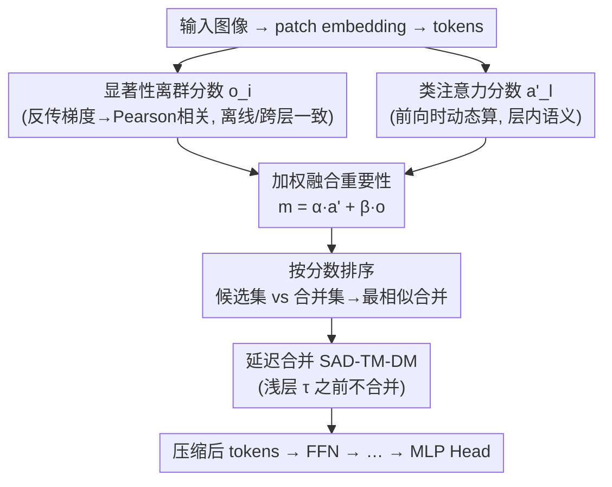

# Saliency-Driven Token Merging for Vision Transformers

**会议**: CVPR 2026  
**论文**: [CVF Open Access](https://openaccess.thecvf.com/content/CVPR2026/html/Xie_Saliency-Driven_Token_Merging_for_Vision_Transformers_CVPR_2026_paper.html)  
**代码**: 待确认（论文称将开源）  
**领域**: 模型压缩 / ViT 加速  
**关键词**: Token Merging, Vision Transformer, 显著性, 免训练加速, 类注意力

## 一句话总结
SAD-TM 指出现有 token merging 只看「当前层」的注意力参数、而这些参数逐层剧烈变化，于是它改用一个**跨层一致**的判据：通过反传梯度算每个输入 patch 的显著性、再用 Pearson 相关找出「偏离全局梯度方向」的显著性离群 token，与类注意力加权融合后免训练地合并 token，并配一个「前几层不合并」的延迟合并策略，在 DeiT/MAE/LV-ViT 上几乎无损地砍掉 23%~45% FLOPs。

## 研究背景与动机
**领域现状**：ViT 算力随 token 数平方增长，加速主要靠两条路——token pruning（直接丢冗余 token，但会丢信息伤精度）和 token merging（合并相似 token，信息基本不丢、更接近无损）。ToMe 起，merging 成为主流轻量加速手段。

**现有痛点**：现有 merging 方法（ToMe、DTMFormer、IB-based 等）几乎都只依据**当前层**的注意力参数（key 矩阵、类注意力等）来判断哪些 token「不重要」。但同一批 token 的这些参数**逐层差异极大**——尤其在浅层，相邻 block 的类注意力矩阵 MSE 能差好几个数量级。结果就是：基于当前层判据的合并缺乏全局一致性，浅层尤其容易选错该合并的 token，导致压缩结果不稳定、掉精度。

**核心矛盾**：「合并判据要稳」和「注意力参数本身逐层乱跳」直接冲突——只看某一层永远拿不到跨层一致的重要性度量。

**本文目标**：找一个**与层无关、跨层一致**的 token 重要性判据，并把它和层内动态语义信息结合，免训练地指导合并；同时回避浅层注意力不稳带来的误合并。

**切入角度**：作者发现显著性统计（saliency）能直接刻画模型输入到输出的因果关系，且这种关系不依赖具体某一层。于是用「输入-输出级」的显著性离群度作为全局先验。

**核心 idea**：用「显著性离群 token ≈ 偏离全局梯度方向 ≈ 可安全合并」这一观察，把离线显著性先验与在线类注意力加权融合成统一判据，再加延迟合并避开浅层不稳。

## 方法详解

### 整体框架
SAD-TM 保留 ViT 原始的 patch embedding 和最终 MLP head，只在每个 Transformer block 的 MHSA 之后插入一步合并：把 $Z'_l\in\mathbb{R}^{N\times D}$ 按合并率 $mr$ 压成 $Z''_l\in\mathbb{R}^{(N(1-mr))\times D}$ 再喂给 FFN。判据由两路构成：一路是**离线显著性离群分数** $o_i$（反传梯度 → Pearson 相关 → 离群度，跨层不变、可预计算），一路是**在线类注意力分数** $a'_l$（前向时动态算，捕捉层内语义相关性）；二者加权求和得最终重要性 $m_{l,i}$，按分数从低到高优先合并。最后再叠一个**延迟合并策略**（SAD-TM-DM）：浅层 $\tau$ 之前完全不合并，等类注意力稳定后才开始，避免浅层误合并。

### 关键设计

**1. 显著性离群分数：一个跨层一致的免训练重要性先验**

这是 SAD-TM 解决「逐层判据乱跳」的核心招。对每个输入 patch $x_i$，先反传算显著性 $s_i=\max(|\partial\mathcal L/\partial x_i|)$（在通道维取绝对梯度最大值，刻画该像素对输出的影响）。然后把每个 patch 的显著性图拉平成向量，算两两 Pearson 相关系数 $r_{i,j}$，再用「与其他所有 patch 的平均相关」定义离群度 $o_i=\frac1{N-1}\sum_{j\ne i} r_{i,j}$。$o_i$ 越低说明该 patch 越偏离整体显著性模式——也就是它的梯度方向和全局不一致。作者的论断是：**高显著性离群 = 偏离全局梯度方向 = 冗余、可安全合并**。关键优势有二：一是 $o_i$ 只由输入和输出（梯度）决定，**与具体哪一层无关**，天然跨层一致；二是它能**离线预计算**当先验，不增加推理时开销。这正好补上现有方法「只看当前层、跨层不稳」的缺口。

**2. 显著性 + 类注意力加权融合：离线先验配在线语义**

光有离线显著性先验还不够——推理时的注意力动态携带互补的语义信息。类注意力把全局信息聚到 class token 上、对最终决策很关键：$a_{class,l,h}=\mathrm{softmax}(Q_{l,h}K_{l,h}^\top/\sqrt D)[0,1:]$，再对 $H$ 个 head 平均得每个 token 的注意力分数 $a'_l$。最终重要性把两路加权求和：$m_{l,i}=\alpha\cdot a'_{l,i}+\beta\cdot o_i$，其中 $\alpha+\beta=1$。按 $m_{l,i}$ 从低到高排序、优先合并低分 token。合并本身沿用「候选集 $\mathcal C$ vs 合并集 $\mathcal M$」：把合并集里的 token 找候选集里最相似的那个，按重要性加权融合 $t'_i,t'_j=\frac{m_i}{m_i+m_j}t_i+\frac{m_j}{m_i+m_j}t_j$ 并成一个 token。这个设计让判据既有**跨层稳定的全局视角**（$o_i$），又保留**层内动态语义**（$a'_l$），是论文「统一两个空间」的落点。

**3. 延迟合并策略（SAD-TM-DM）：浅层不动手，等注意力稳了再合并**

作者做了系统分析：在多个 ViT 上，相邻 block 类注意力矩阵的 MSE 在**浅层远大于深层**，差距甚至达几个数量级——说明浅层注意力在探索低级特征、层间剧烈变化，此时按注意力合并极易选错。于是 SAD-TM-DM 在 SAD-TM 基础上加一条简单规则：前 $\tau$ 层**完全不合并**，token 数保持 $N$，从第 $\tau+1$ 层起才按 $N_l=N(1-(l-\tau)mr)$ 递减。$\tau$ 的取法基于一个观察——「注意力剧烈变化的层数主要由模型总深度决定，和具体架构/参数量无关」，因此可按深度推定。这样既保证从「注意力已稳定」之后才开始合并、token 选择更一致，又只是个零成本的调度改动。

### 损失函数 / 训练策略
SAD-TM **完全免训练**（training-free）：直接作用在预训练 ViT 上，无需重训或微调。$o_i$ 可离线预计算；推理时只多算类注意力的加权与排序合并。超参为融合权重 $\alpha,\beta$（$\alpha+\beta=1$）、每层合并率 $mr$、延迟阈值 $\tau$。实验在单张 RTX 3090、推理 batch size 128 下完成。

## 实验关键数据

### 主实验
ImageNet 上，跨 DeiT-Tiny/Small/Base、MAE-Base/Large/Huge、LV-ViT-S。对比含 ToMe、DynamicViT、EViT、Evo-ViT、DiffRate、Zero-TPrune 等；标 `∗` 的为需训练/微调的方法，SAD-TM 全程免训练。

| 模型 | 方法 | Top-1 Acc(%) | FLOPs 削减(%) | 说明 |
|--------|------|------|----------|------|
| DeiT-Small | Baseline | 79.87 | — | 原始 4.6G |
| DeiT-Small | ToMe MC | 79.16 | 32.61 | 同算力对照 |
| DeiT-Small | **SAD-TM** | **79.56** | 32.61 | 同算力下优于 ToMe MC |
| DeiT-Small | **SAD-TM-DM** | **79.74** | 32.61 | 延迟合并进一步抬升 |
| DeiT-Small | SAD-TM | 79.15 | 45.65 | 高压缩仍 >79 |
| DeiT-Tiny | Baseline | 72.17 | — | 原始 1.3G |
| DeiT-Tiny | **SAD-TM** | **72.02** | 23.08 | 仅掉 0.15%，逼近无损 |

亮点：DeiT-Tiny 上削 23.08% FLOPs 时 Top-1 与预训练 baseline 基本持平（72.02 vs 72.17）；DeiT-Small 上削 43.48% FLOPs 仅掉 0.6%。免训练却普遍优于需训练微调（带 `∗`）的多数 pruning/merging 方法。

### 消融 / 分析
| 配置 | 关键指标 | 说明 |
|------|---------|------|
| 仅类注意力（≈现有判据） | 浅层选 token 不稳 | 相邻 block 类注意力 MSE 浅层比深层大数量级 |
| + 显著性离群分数 $o_i$（SAD-TM） | 跨层一致、精度回升 | 全局判据补上层内不稳 |
| + 延迟合并（SAD-TM-DM） | 同算力下精度再升 | 浅层不合并，避开注意力不稳区 |

### 关键发现
- **浅层类注意力 MSE 远大于深层**（图 2）是全文的实证支点：它既解释了「为什么只看当前层会选错」，也直接催生了延迟合并策略。
- SAD-TM-DM 在多档 FLOPs 下普遍优于 SAD-TM，说明「避开浅层合并」的收益稳定且来自一个零成本的调度改动。
- 显著性离群分数可离线预计算，因此跨层一致性是「白拿」的，不增加推理时成本。

## 亮点与洞察
- **判据从「层内」升到「输入-输出级」**：用显著性离群度刻画 token 与全局梯度方向的一致性，是个跨层不变、可离线的全局重要性信号——比逐层注意力判据更稳，思路可迁移到任何「逐层判据不一致」的稀疏化场景。
- **「显著性离群 ≈ 可安全合并」的反直觉论断**：通常显著=重要，这里却把高显著性离群当作偏离主方向的冗余信号，论证角度新颖。
- **延迟合并是「廉价大收益」**：仅靠一条「浅层 τ 前不合并」的规则就稳定提点，且 $\tau$ 只由深度决定、不需调架构，工程上极易落地。

## 局限与展望
- 显著性 $o_i$ 要反传算梯度，虽可离线但对**部署即时输入**仍需一次反传，论文称可预计算当先验，但对在线/流式输入的适用性需打问号 ⚠️。
- $\alpha,\beta,\tau$ 等超参的敏感性与跨架构可迁移性在缓存中未充分展开；$\tau$「仅由深度决定」的论断需要更广的架构验证。
- 主战场是 ImageNet 分类，未见检测/分割等密集任务上的验证，token 合并对空间结构的影响在那些任务上可能更敏感。
- 与 IB-based 等同样追求全局判据的 merging 方法的正面对比偏少，优势边界不够清晰。

## 相关工作与启发
- **vs ToMe / DTMFormer**：它们逐层按当前注意力相似度合并，缺跨层一致判据、浅层易选错；SAD-TM 用离线显著性离群度提供跨层全局先验，再与类注意力融合。
- **vs token pruning（DynamicViT / EViT / A-ViT）**：pruning 直接丢 token、会丢信息伤精度；SAD-TM 走 merging 路线信息基本无损，且多数情况下免训练就超过这些需训练的 pruning 方法。
- **vs IB-based merging（Wang & Yang）**：同样想要全局判据，但用可学习 mask 需引入学习；SAD-TM 的显著性离群度是免训练、可离线的统计量，更轻。

## 评分
- 新颖性: ⭐⭐⭐⭐ 「显著性离群当跨层一致判据」+「延迟合并避浅层不稳」是清晰且有实证支撑的新角度。
- 实验充分度: ⭐⭐⭐⭐ 覆盖 DeiT/MAE/LV-ViT 多架构、多 FLOPs 档、大量基线对比；但只在 ImageNet 分类、缺密集任务。
- 写作质量: ⭐⭐⭐⭐ 观察→判据→策略的逻辑链顺，公式与图 2 实证配合到位。
- 价值: ⭐⭐⭐⭐ 免训练即插即用、几乎无损削 23%~45% FLOPs，对 ViT 部署加速实用性强。

<!-- RELATED:START -->

## 相关论文

- [\[CVPR 2026\] Co-Me: Confidence Guided Token Merging for Visual Geometric Transformers](co-me_confidence_guided_token_merging_for_visual_geometric_transformers.md)
- [\[CVPR 2026\] BinaryAttention: One-Bit QK-Attention for Vision and Diffusion Transformers](binaryattention_one-bit_qk-attention_for_vision_and_diffusion_transformers.md)
- [\[ICML 2026\] Saliency-Aware Model Merging](../../ICML2026/model_compression/saliency-aware_model_merging.md)
- [\[CVPR 2026\] HTTM: Head-wise Temporal Token Merging for Faster VGGT](httm_head-wise_temporal_token_merging_for_faster_vggt.md)
- [\[CVPR 2026\] LS-ViT: Least-Squares Hessian Based Block Reconstruction for Low-Bit Post-Training Quantization of Vision Transformers](ls-vit_least-squares_hessian_based_block_reconstruction_for_low-bit_post-trainin.md)

<!-- RELATED:END -->
