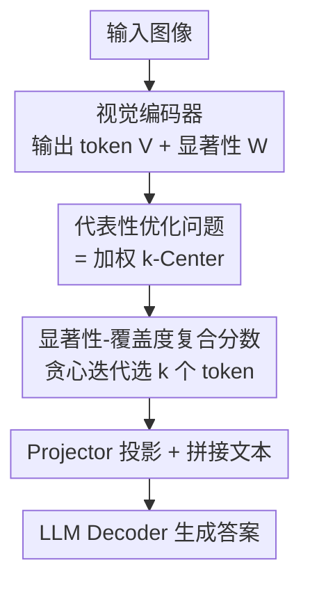

# SCoRe: Salience-Coverage Reduction for Vision Token Pruning in Vision-Language Models

**会议**: CVPR 2026  
**论文**: [CVF Open Access](https://openaccess.thecvf.com/content/CVPR2026/html/Xu_SCoRe_Salience-Coverage_Reduction_for_Vision_Token_Pruning_in_Vision-Language_Models_CVPR_2026_paper.html)  
**代码**: 无  
**领域**: 模型压缩 / 多模态VLM  
**关键词**: 视觉 token 剪枝, 加权 k-Center, 显著性-覆盖度, 训练无关, LVLM 推理加速

## 一句话总结
SCoRe 把 LVLM 的视觉 token 剪枝从"先按注意力 Top-k、再事后补多样性"的两段式启发式，重写成一个统一的"代表性优化问题"，并证明它等价于经典的加权 k-Center 问题；用一个同时编码显著性和覆盖度的复合分数做贪心选择，训练无关、即插即用，在剪掉 94.4% token 时仍保留 95% 性能。

## 研究背景与动机
**领域现状**：大型视觉语言模型（LVLM）的算力瓶颈主要来自视觉编码器吐出的超长 token 序列——LLaVA-1.5 一张图 576 个 token，到 LLaVA-NeXT 高分辨率输入直接涨到 2880 个。由于 Transformer 自注意力是 $O(L^2)$ 复杂度，序列一长推理就吃不消。为此近期工作转向在视觉编码器侧做 token 剪枝，并普遍认为编码器自身特征（如 [CLS] 注意力）比 LLM 内部的跨模态注意力更稳定、更少受位置偏置污染。

**现有痛点**：作者指出这些"更可靠特征"的方法几乎都用同一套**解耦的两段式启发式**：第一步按视觉编码器注意力选 Top-k 高分 token，第二步再用聚类/合并等事后手段补一点多样性。这个流程从根上有缺陷——它在一开始就没有把"对语义空间的最大覆盖"当成优化目标。

**核心矛盾**：作者用两个观察把矛盾摆清楚。其一，视觉 token 在特征空间里并非均匀分布，而是形成离散的高密度语义簇（UMAP+DBSCAN 可视化为一个个"语义孤岛"），理想剪枝必须**跨簇覆盖**，否则会整块丢掉次要主体。其二，高显著性区域内部高度冗余——"重要 ≠ 有代表性"，单凭显著性做贪心（Top-k）会**采样坍缩**：token 密集堆在少数几个高显著簇上，把本该用来覆盖其他簇的预算浪费掉。

**本文目标**：设计一个 query-agnostic 的剪枝算法，同时满足两条原则——全局覆盖（从所有离散语义簇里采样）与显著性优先（优先信息量高的区域）——而两段式启发式天生做不到这两者的统一。

**核心 idea**：把 token 剪枝**形式化为统一的代表性优化问题**，并证明其等价于经典加权 k-Center 问题；用一个把显著性和覆盖度乘在一起的复合分数做贪心近似，让"选了一个高显著点就立刻压低它附近点的吸引力"这件事在一个目标里自然发生。

## 方法详解

### 整体框架
SCoRe 是一个训练无关、即插即用的模块，嵌在视觉编码器和模态投影器（Projector）之间。推理时图像先过视觉编码器，同时输出两样东西：$L$ 个原始视觉 token 特征 $V=\{v_1,\dots,v_L\}$ 以及它们各自的显著性权重 $W=\{w_1,\dots,w_L\}$（取每个 token 对 [CLS] 的注意力分）。SCoRe 拿着 $V$ 和 $W$ 贪心地挑出 $k$ 个代表性 token 的索引 $S_{idx}$，把压缩后的子集 $V_S$ 交给 Projector 投到 LLM 的语义空间，再和文本 token 拼成多模态序列喂给 LLM Decoder 生成答案。整条链路里 LLM 本身完全不动，剪枝发生在进 LLM 之前——这也让它能直接兼容 FlashAttention 这类高效注意力实现（而需要读 LLM 内部跨模态注意力的方法做不到）。

方法本身分两层：先把问题形式化并建立与加权 k-Center 的等价（理论层），再给出一个贪心近似算法 SCoRe（算法层）。

### 关键设计

**1. 把剪枝形式化为代表性优化问题，并归约到加权 k-Center**

针对两段式启发式"从一开始就没把覆盖当优化目标"这个根上的毛病，作者重新定义问题：给定 $L$ 个 token 集合 $V$、每个 token 的显著性权重 $w_i\ge 0$、以及 token 间距离 $d(v_i,v_j)$，目标是找一个大小为 $k$ 的子集 $S^*$ 使代表性损失 $R(S,V)$ 最小，即 $S^*=\arg\min_{S\subset V,|S|=k} R(S,V)$。关键在怎么定义 $R$：作者认为一个有代表性的子集 $S$ 应保证原集合里任意 token $v_i$ 满足二者之一——要么语义上离 $S$ 很近（$d(v_i,S)$ 小），要么本身就不重要（$w_i$ 低）。于是用"最差点"的加权距离来量化损失：

$$R(S,V)=\max_{v_i\in V}\big(w_i\cdot d(v_i,S)\big)$$

代入目标后得到

$$S^*=\arg\min_{S\subset V,|S|=k}\Big(\max_{v_i\in V} w_i\cdot d(v_i,S)\Big)$$

作者指出这个形式**正是经典的加权 k-Center 问题**。这一步的价值不在于换了个写法，而在于：k-Center 虽是 NP-hard，但有成熟的高效贪心近似算法，剪枝因此从"拍脑袋启发式"变成"有理论依据的优化"。

**2. 显著性-覆盖度复合分数的贪心选择，从一个目标里同时拿到两者**

有了 k-Center 的归约，作者给出贪心算法：先选显著性最高的 token 作为第一个代表点；之后迭代 $k-1$ 次，每步对所有未选 token 计算统一的代表性分数——它到当前已选集合 $S_{t-1}$ 的最小余弦距离，乘上它自身显著性的 $\alpha$ 次幂，取分数最高者加入：

$$s_t=\arg\max_{v_i\in V\setminus S_{t-1}}\big(d_{\cos}(v_i,S_{t-1})\cdot \text{score}(v_i)^{\alpha}\big)$$

其中 $d_{\cos}(v_i,S)=\min_{s\in S}\big(1-\cos(v_i,s)\big)$ 是到已选集合的最小余弦距离（覆盖度），$\text{score}(v_i)$ 是该 token 对 [CLS] 的注意力（显著性），$\alpha$ 是平衡系数。乘积形式是这个设计的灵魂：一个 token 必须**同时**显著且远离已选集合才会被选中。这天然杜绝了采样坍缩——一旦从某高显著簇里选了一个点，它附近所有点的 $d_{\cos}$ 立刻变小、吸引力下降，算法在后续迭代里自动被"推"去看那些此前被忽略的语义簇。和两段式不同，这里覆盖不是事后补救，而是和显著性在**同一个分数**里被联合优化。

**3. $\alpha$ 作为覆盖度↔显著性的连续旋钮**

$\alpha$ 把两个看似冲突的目标统一成一条可调谱系：$\alpha=0$ 时显著性项退化为常数，算法变成纯多样性/纯覆盖（等价 farthest-point 采样）；$\alpha\to\infty$ 时覆盖项被压没，退化为纯显著性 Top-k。真正有用的是中间地带——实验中 $\alpha=0.8$ 最优，且 $\alpha\in[0.7,0.9]$ 都稳定在 54.5% 以上，说明不需要精细调参。这个旋钮的意义在于：它让"显著性优先"和"全局覆盖"这两条设计原则不再是非此即彼的选择，而是一个可以平滑权衡的统一框架。

### 一个例子：32 token 预算下怎么选
假设要从一张图的 576 个 token 里只留 32 个。第 1 步选显著性最高的 token（落在主体物上）；第 2 步如果按纯 Top-k，会继续在主体周围挑高分 token，于是 32 个名额很快堆满在一个簇里（采样坍缩，背景/次要主体全丢）。SCoRe 不一样：选了主体上的点后，主体附近所有 token 的 $d_{\cos}$ 被拉低，即便它们注意力分很高，复合分数也被压下去；于是下一个被选中的往往是另一个语义簇里"既有点显著、又离已选集合远"的 token。32 个名额因此被摊到主体、次要主体、背景等多个簇上——这正是 UMAP 可视化里 SCoRe（图 2c）比 Top-k（图 2b）覆盖明显更广的原因。

## 实验关键数据

### 主实验（LLaVA-1.5-7B，10 个图像基准平均）
Rel. 表示相对原始（576 token，100%）保留的性能百分比。

| 保留 token | 剪枝率 | FastV | SparseVLM | VisionZip | VisPruner | **SCoRe** |
|-----------|--------|-------|-----------|-----------|-----------|-----------|
| 128 | ↓77.8% | 85.4% | 94.4% | 98.4% | 99.6% | **100.6%** |
| 64 | ↓88.9% | 75.9% | 86.4% | 95.6% | 96.6% | **97.8%** |
| 32 | ↓94.4% | 64.1% | 77.9% | 89.0% | 91.5% | **95.0%** |

剪枝越狠优势越大：留 128 个时 SCoRe 甚至 100.6% 超过原模型；压到 32 个（只剩约 5% token）仍保 95.0%，比上一代 SOTA VisPruner 高 3.5 个百分点，比基于跨注意力的 SparseVLM 高出 17 个百分点。这印证了"同时优化显著性+覆盖"比"合并相似 token"更关键。跨架构同样成立：LLaVA-NeXT-7B 高分辨率（2880→160 token，↓94.4%）SCoRe 保 93.4%，远超 VisionZip 的 82.3%；Qwen-VL-7B（Q-Former 投影，↓50%）SCoRe 97.9% 也压过 FastV/VisPruner；Video-LLaVA 视频任务（2048→114 token）平均 Acc. 45.2 同样领先。

### 消融实验（LLaVA-1.5-7B，留 32 token）
通过取 $\alpha$ 的两个极端验证"必须同时要两者"：

| 配置 | $\alpha$ | TextVQA Acc. | POPE F1 | 说明 |
|------|---------|--------------|---------|------|
| 纯多样性 Diverse | $\alpha=0$ | 53.2 | 76.2 | 只覆盖、不看显著性，不够 |
| 纯显著性 Important | $\alpha\to\infty$ | 54.0 | 77.8 | 退化为 Top-k，漏掉非显著上下文 |
| **完整 SCoRe** | $\alpha=0.8$ | **54.5** | **80.3** | 两者互补，显著优于两端 |

### 效率分析（LLaVA-NeXT-7B，A100-40GB，POPE）

| 方法 | 保留 token | FLOPs(T) | GPU 显存(GB) | CUDA 时延(ms) |
|------|-----------|----------|-------------|--------------|
| 原模型 | 2880 | 43.3 | 16.7 | 853.2 |
| FastV | 160 | 6.3 | 16.9 | 305.3 |
| **SCoRe** | 160 | **3.8** | **14.7** | **158.3** |

### 关键发现
- 复合分数里"乘积"形式是采样坍缩的解药：选一个点就压低邻域吸引力，覆盖在迭代中自动发生，不靠事后补救。
- $\alpha$ 在 $[0.7,0.9]$ 区间内性能都稳定在 54.5% 以上，对调参不敏感，落地友好。
- SCoRe 在 LLM 之前剪枝，所以可叠加 FlashAttention；而 FastV 这类要读 LLM 内部跨模态注意力的方法无法兼容——同样保 160 token，SCoRe 时延几乎是 FastV 的一半。

## 亮点与洞察
- **把工程启发式换成有理论根的优化问题**：从"Top-k + 事后补多样性"重写为加权 k-Center，最大价值是给"为什么这样选"提供了可证明的依据，而不是又一个 trick。
- **"重要 ≠ 有代表性"这个观察很到位**：高显著区内部高度冗余，单看注意力分一定会坍缩——这把很多基于注意力剪枝方法的隐患说穿了。
- **乘积式复合分数可迁移**：凡是"既要重点、又要铺开"的预算分配问题（关键帧选取、检索去冗余、coreset 选择）都能套这套"显著性 × 到已选集合距离"的贪心框架。
- 训练无关 + 即插即用 + 可叠加 FlashAttention，工程上几乎零接入成本。

## 局限与展望
- 显著性完全依赖 [CLS] 注意力作为权重，对没有 [CLS]、或注意力本身就不可靠的编码器是否还成立，文中未深入；⚠️ 这部分以原文及其补充材料为准。
- 整体是 query-agnostic（不看文本问题）的剪枝，对那些答案高度依赖图中某个被判为"低显著"小区域的问答任务，固定预算下可能仍有风险。
- 贪心是 k-Center 的近似而非最优解，$k$ 很大时迭代次数线性增长，超长视频场景的实际开销值得进一步看。
- 可改进方向：把文本 query 信号引入显著性权重，做 query-aware 的覆盖-显著性平衡。

## 相关工作与启发
- **vs Top-k / FastV（跨注意力）**：FastV 用 LLM 早层跨模态注意力判重要性，信号分散且受位置偏置污染；SCoRe 改用编码器侧更稳定的特征，且不止看显著性还联合覆盖。
- **vs ToMe / VisionZip（视觉特征合并）**：它们靠合并相似 token 降长度，仍是"先选主导 token 再合并"的解耦两段式；SCoRe 不合并、直接在统一目标里选代表点，剪枝越狠差距越明显。
- **vs VisPruner（上一代 SOTA）**：同样用视觉特征，但 VisPruner 仍是"Top-k + 事后多样性"；SCoRe 把两者塞进一个复合分数同时优化，32 token 下高 3.5 个百分点。

## 评分
- 新颖性: ⭐⭐⭐⭐⭐ 把启发式剪枝归约到加权 k-Center 并用统一复合分数取代两段式，视角干净有力。
- 实验充分度: ⭐⭐⭐⭐⭐ 4 种架构 × 图像/高分辨率/视频 13 个基准，含消融、$\alpha$ 敏感性与效率分析。
- 写作质量: ⭐⭐⭐⭐ 动机用两个观察+可视化讲得很清楚，理论归约与算法衔接顺畅。
- 价值: ⭐⭐⭐⭐⭐ 训练无关、即插即用、可叠加 FlashAttention，对 LVLM 落地很实用。

<!-- RELATED:START -->

## 相关论文

- [\[CVPR 2026\] Rethinking Token Reduction for Large Vision-Language Models](rethinking_token_reduction_for_large_vision-language_models.md)
- [\[CVPR 2026\] IF-Prune: Information-Flow Guided Token Pruning for Efficient Vision-Language Models](if-prune_information-flow_guided_token_pruning_for_efficient_vision-language_mod.md)
- [\[CVPR 2026\] Hybrid Token Compression for Vision-Language Models](hybrid_token_compression_for_vision-language_models.md)
- [\[CVPR 2026\] CoIn: Coverage and Informativeness-Guided Token Reduction for Efficient Large Multimodal Models](coin_coverage_and_informativeness-guided_token_reduction_for_efficient_large_mul.md)
- [\[CVPR 2026\] Collaborative Multi-Mode Pruning for Vision-Language Models](collaborative_multi-mode_pruning_for_vision-language_models.md)

<!-- RELATED:END -->
