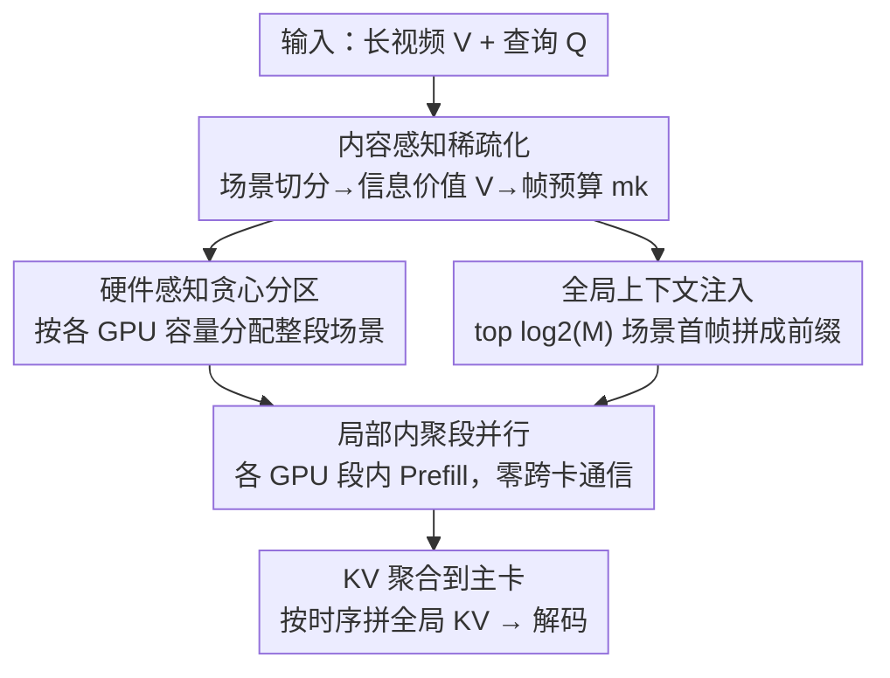

# SegMo: Co-Designing Content-Aware Sparsity and Locally-Cohesive Segment Parallelism for Efficient VLM Inference

**会议**: CVPR 2026  
**论文**: [CVF Open Access](https://openaccess.thecvf.com/content/CVPR2026/html/Li_SegMo_Co-Designing_Content-Aware_Sparsity_and_Locally-Cohesive_Segment_Parallelism_for_Efficient_CVPR_2026_paper.html)  
**代码**: https://github.com/LIHAOJUAN/SegMo  
**领域**: 模型压缩 / 高效VLM推理  
**关键词**: 长视频理解, VLM推理加速, 内容感知稀疏化, 段并行, Prefill优化

## 一句话总结
SegMo 针对长视频 VLM 的 token 爆炸与 $O(N^2)$ Prefill 瓶颈，用「算法-系统协同设计」把*算什么*（内容感知稀疏化 CAS）与*怎么算*（局部内聚段并行 LSP）联合优化，凭 VLM 注意力的「局部内聚」特性把视频按场景切段并行、Prefill 期间零跨卡通信，在三个长视频基准上同时拿到 up to 12.00% 的精度提升和 up to 3.55× 的 Prefill 加速。

## 研究背景与动机
**领域现状**：VLM 正从看几秒短片走向理解小时级长视频。但长视频带来的视觉 token 数量比 LLM 高出两三个数量级——一小时视频按 3600 帧 × 576 token/帧算就有 200 多万 token，而注意力是 $O(N^2)$ 复杂度，Prefill 阶段直接变成一堵「算不动」的墙。

**现有痛点**：解决这堵墙的两条路线各有死穴。① **盲目稀疏化**（均匀降采样帧）：长视频里关键信息可能只存在于某个 5 秒的片段，均匀采样几乎必然错过它，导致精度灾难性下降。② **盲目并行**：把 LLM 原生的张量并行（TP）/序列并行（SP）直接搬到 VLM 上，这些策略依赖全局 all-to-all 注意力，在 VLM 的巨量 token 规模下通信和显存开销高到不可接受。

**核心矛盾**：这构成了一个根本的**精度-延迟权衡**——追速度（盲目稀疏）就牺牲精度，追精度（塞大量冗余帧 + 盲目并行）就引爆延迟。作者指出，只要把「稀疏化」和「并行化」当成两个孤立问题分别解，这个权衡就无法打破。

**切入角度**：作者从两个对 VLM 注意力的实测观察出发。其一是**注意力局部内聚**（Local Cohesion）：VLM 注意力在语义场景内部高度密集，跨场景边界则极其稀疏（图 2 的对角块现象）。其二是**信息价值分层**：一个场景值不值得多分帧，取决于它和查询的*相关性*以及内部的*冗余度*。

**核心 idea**：把*算什么*（稀疏化）和*怎么算*（并行）作为一个耦合的统一问题来协同设计——先用稀疏化策略产出一份精确、非均匀、且「对并行友好」的逐场景帧预算 $\{m_k\}$，这份非均匀负载再让并行策略据此动态算出硬件感知的最优分区，从而在打破精度-延迟权衡的同时拿到两头好处。

## 方法详解

### 整体框架
SegMo 是一个端到端的长视频 VLM 推理系统，输入是「长视频 $V$ + 用户查询 $Q$」，输出是回答；中间把传统串行的 Prefill 拆成「先按内容稀疏、再按场景并行」两段。先把视频用 PySceneDetect 切成 $K$ 个语义内聚的场景段 $C=\{C_1,\dots,C_K\}$，CPU 引擎对每段算「信息价值」并分配帧预算、同时构造一份轻量全局上下文；这些负载被分派到多张 GPU，各卡只在自己负责的场景段内做 vision encoder + 并行 Prefill（段间不算注意力、零跨卡通信）；Prefill 完成后把各段 KV cache 收到一张主卡按时间顺序拼成全局 KV，主卡进入 decode，其余卡同时去 Prefill 下一个请求。

整体把任务建模为 **Makespan 最小化**：在 $N$ 张 GPU 上找一个分区 $\pi=\{P_1,\dots,P_N\}$ 把 $K$ 个场景分配下去，约束是「同一场景的所有帧必须放在同一张卡」且分区要硬件感知。每张卡 $g_j$ 的负载是其场景帧数之和 $W(P_j)=\sum_{C_k\in P_j}\alpha\cdot m_k$，端到端延迟近似为

$$L_{e2e}\approx \max_{j=1,\dots,N}\left(\frac{\sum_{C_k\in P_j}W(C_k)}{Cap(g_j)}\right)+T_{agg}$$

由于 LSP 消除了 Prefill 期间的跨卡通信、$T_{agg}$（解码前的 KV 聚合）在 NVLink 下又小又固定，核心优化就归结为最小化那个 $\max$ 里的 makespan。

### 关键设计

**1. 内容感知稀疏化 CAS：用「相关性 + 冗余度」决定每个场景分几帧**

直接对应「盲目均匀采样错过关键 5 秒片段」这个痛点。CAS 不再均匀降采样，而是分三步做场景级关键帧采样。Step 1 用现成的 PySceneDetect 把视频切成语义内聚的场景段。Step 2 对每段算两个维度的分数：**查询相关性** $RL(Q,C_k)$ 取每段首帧作代表帧、用轻量 CLIP 算它与查询的相关度，再做「减最小值后归一」$RL(Q,C_k)=\frac{RL'(Q,C_k)-\min_k RL'(Q,C_k)}{\sum_k \{RL'(Q,C_k)-\min_k RL'(Q,C_k)\}}$；**时间冗余度** $RD(C_k)$ 则用每段首尾帧灰度像素强度的平均绝对差归一到 $[0,1]$（差异大=动态内容多=该多分帧，差异小=静态冗余=少分）。两者用单一超参 $w$ 合成**信息价值** $V(Q,C_k)=w\cdot RL(Q,C_k)+(1-w)\cdot RD(C_k)$。Step 3 按 $V$ 正比分配总预算 $M_{max}$ 给各段帧数 $m_k$（保证 $m_k\geq 1$，若场景数超过预算 $K>M$ 就退化为按 $V$ 取 top-$K$ 场景各采一帧）。妙在它故意只用 CLIP + 像素差这种轻量信号，而不像 A.I.R. 那样用大 VLM 做推理式选帧，避免了高昂计算成本——实验证明这套简化信号已足够有表达力。「高相关」不等于「低冗余」（一个场景可以既相关又静态），把这两维拆开正是它比单维剪枝（如只看相关性或只看视觉密度）更准的原因。

**2. 局部内聚段并行 LSP：靠「段间注意力可忽略」实现 Prefill 零通信**

针对「LLM 原生并行依赖全局 all-to-all 注意力、在 VLM token 规模下通信爆炸」的痛点。LSP 直接拒绝全局注意力：既然注意力局部内聚、段间（跨边界）注意力极稀疏，那就把一个场景 $C_k$ 的所有帧整体放在单张 GPU 上、在场景边界处切分，各 GPU 只在自己的段内并行做 Prefill、**不计算跨段注意力**，从而在最吃算力的 Prefill 阶段彻底消除跨卡通信开销 $L_{comm}$。这是它和 PEVLM（只在单卡内做 Prefill 并行、不解决多卡通信调度）、MERV（只并行 vision encoder、不碰 LLM Prefill 负担）等「半截子方案」的本质区别——SegMo 把场景段当成稀疏化和并行**共享的独立单元**，让前一步算出的非均匀负载天然适配多卡分区。

**3. 硬件感知贪心分区：让每张卡的负载正比于其容量**

LSP 要把 $K$ 个不可分割的场景（每段成本 $W(C_k)$ 固定）分到 $N$ 张异构 GPU 上，这是个 makespan 最小化的分配问题。和 PEVLM 那种静态均匀分区不同，SegMo 用**硬件感知贪心算法**近似最优解：先按各 GPU 当前可用容量 $Cap(g_j)$（用可用显存代理）成比例算出「理想切分点」，再以每段 $W(C_k)$ 为不可分单元逐个贪心——把整段塞给当前卡还是下一张卡，取决于哪种放法让累计负载最接近理想切分点。因为约束了「同场景必须同卡」，算法没法在理想点完美切，只能逼近。结果是每张卡的最终负载近似正比于其容量，把资源利用率拉满、makespan 压到最低。

**4. 全局上下文注入 GCI：用「场景首帧」当轻量全局索引补回被并行切断的上下文**

段并行带来一个新问题：各卡只看自己的段，会丢失全局上下文。作者的第四个观察「**首帧主导**（head-frame primacy）」提供了解法——每个场景的第一帧实测获得显著更高的注意力分数，相当于该场景的天然摘要（图 4 红框）。于是 GCI 选出按查询相关度排名 top $\log_2 M$ 个场景的首帧，拼成一段浓缩的全局上下文序列，**前置（prepend）到每个并行分片 $P_j$ 的输入前面**，用这一小撮 head-frame 充当全局索引，替代了维护一份巨大全局 KV Cache 的代价。$\log_2 M$ 的预算设定使 GCI 在精度和计算之间取得平衡，实测它对跨场景、跨模态的复杂推理任务提升尤其明显。

### 系统优化：流水线隐藏 CAS 开销
CAS 的场景检测引入了额外 CPU 开销 $T_{CPU}$。SegMo 用基于生产者-消费者的多线程调度把 CPU 预处理与 GPU 计算解耦，做两层优化：**微观延迟隐藏**——把场景检测 $T_{CPU}$ 异步并入本就 I/O 密集的视频读取 $T_{IO}$（通常 $T_{IO}>T_{CPU}$，于是检测开销被吃掉）；**宏观流水线**——让请求 $(i{+}1)$ 的预处理 $T_{Pre}$ 与请求 $(i)$ 的 GPU 计算 $T_{GPU}$ 重叠，缓解 CPU/GPU 互相空转的通用 VLM 瓶颈。

## 实验关键数据

实现基于 PyTorch + HuggingFace Transformers，默认用 2×H100（NVLink）；模型用 MiniCPM-o 2.6 (8B) 和 Qwen2-VL-7B-Instruct；基准为 LVBench、LongVideoBench、Video-MME，只评 ≥4 分钟的长视频；baseline 是「均匀采样 + 2-GPU 数据并行」。

### 主实验（精度）

| 模型 / 设置 | 基准 | Baseline | SegMo (CAS) | SegMo (CAS+LSP) |
|------|------|------|------|------|
| Qwen2-VL-7B (32 帧) | LVBench | 32.44 | 44.44 (+12.00) | 40.75 (+8.31) |
| Qwen2-VL-7B (32 帧) | LongVideoBench(4-60m) | 45.68 | 49.54 (+3.86) | 50.23 (+4.55) |
| Qwen2-VL-7B (128 帧) | Video-MME(4-15m) | 63.00 | 69.46 (+6.46) | 66.22 (+3.22) |
| MiniCPM-o 2.6 (32 帧) | LVBench | 34.92 | 45.84 (+10.92) | 42.02 (+7.10) |
| MiniCPM-o 2.6 (32 帧) | LongVideoBench(4-60m) | 46.78 | 51.94 (+5.16) | 53.25 (+6.47) |

精度提升在 LVBench 上最显著（CAS 让 Qwen2-VL/MiniCPM 在 32 帧下分别 +12.00%/+10.92%），因为 LVBench 是 30–140 分钟的超长视频、冗余更高，均匀采样最容易漏掉相关帧。开启 LSP 后相对 CAS-only 有轻微精度回落（并行切断全局上下文所致），但仍稳定高于 baseline。

### 主实验（延迟，Qwen2-VL，TTFT）

| 基准 | Baseline TTFT(s) | SegMo(CAS+LSP) TTFT(s) | 加速 |
|------|------|------|------|
| LVBench (32 帧) | 2.627 | 0.930 | 2.83× |
| LVBench (64 帧) | 9.460 | 2.762 | 3.43× |
| LongVideoBench (32 帧) | 2.490 | 0.701 | 3.55× |
| LongVideoBench (64 帧) | 7.56 | 2.24 | 3.38× |

在相同 GPU 数下，SegMo 把 Prefill 的 time-to-first-token 全面压低 2.83×–3.55×，印证「Prefill 零跨卡通信」确实把通信瓶颈消掉了。

### 消融实验

| 实验 | 配置 | 关键指标 | 说明 |
|------|------|---------|------|
| CAS 权重 $w$ | $w{=}0.0/0.5/0.8/1.0$ | LongVideoBench(64帧): 49.65 / **51.83** / 50.12 / 50.58 | 精度对 $w$ 非线性，平衡的 $w{=}0.5$ 取得峰值 |
| CAS 权重 $w$ | $w{=}0.0/0.5/0.8/1.0$ | Video-MME(128帧): 68.05 / **69.00** / 66.09 / 66.67 | $w{=}0.5$ 同样最优 |
| GCI | w/o GCI | LongVideoBench 整体 48.46 | 并行后丢全局上下文 |
| GCI | w/ GCI | LongVideoBench 整体 49.83 (+1.37) | 中等长度(240-600s)段 +4.64，复杂推理 T2A +10.71、E2O +10.25 |

### 关键发现
- **$w$ 的最优值依基准而异但 0.5 普遍最好**：LongVideoBench 偏「精确语义匹配」，$w{=}1$（只看相关性）优于 $w{=}0$；Video-MME 偏「全局覆盖 + 动态变化」，$w{=}0$（只看冗余）反而更好；但无论偏好如何，平衡的 $w{=}0.5$ 都给出峰值——说明「相关性」和「冗余度」两个维度确实互补，单看任一维都不够。
- **GCI 对复杂跨场景推理增益最大**：整体只 +1.37%，但在 T2A、E2O 这类跨场景/跨模态复杂推理任务上分别 +10.71%、+10.25%，验证 head-frame 充当全局索引、维持了并行单元间的全局感知能力。
- **GCI 增益峰值在中等长度视频**：峰值位置是 $\log_2 M$ 预算的函数，调大 GCI 预算会把峰值推向更长视频，体现一个精度-计算的可调权衡。

## 亮点与洞察
- **「局部内聚」一个实测观察撑起整套协同设计**：VLM 注意力段内密、段间稀这一现象，同时被用作稀疏化的独立单元（场景段）和并行的切分边界，让「算什么」和「怎么算」共享同一个语义单元——这是把两个孤立问题耦合成一个的关键支点，思路可迁移到任何「计算负载与数据语义结构对齐」的系统优化。
- **用最便宜的信号做选帧**：CLIP + 灰度像素差代替「大 VLM 推理式选帧」，证明在长视频稀疏化上，廉价启发式已足够，不必为选帧再背一个重模型，对工程落地很友好。
- **head-frame 当全局索引**：把「每段首帧注意力最高」这个偏置变成 $\log_2 M$ 量级的轻量前缀，用极小代价补回并行切断的全局上下文，避免了维护巨大全局 KV Cache——「用稀疏摘要替代稠密缓存」的思路可复用到其他长序列并行场景。

## 局限与展望
- **依赖场景可切分**：整套方法建立在「视频能被 PySceneDetect 干净切成语义内聚场景」之上。对镜头切换模糊、长镜头连续运动、或场景边界不清的视频，段并行的「段间注意力可忽略」假设可能不成立，精度与加速都会打折。
- **GCI 预算固定为 $\log_2 M$**：作者自己指出增益峰值随预算移动，但论文未给出自适应调 GCI 预算的方法，超长视频可能需要更大预算才不丢上下文。
- **加速主要针对 Prefill/TTFT**：评测集中在 Prefill 延迟，decode 阶段仍需把 KV 聚合到主卡，超长视频的全局 KV 拼接与 decode 成本、以及多卡负载不均时的尾延迟未充分展开。
- **硬件设定较理想**：默认 2×H100 + NVLink 高速互联，$T_{agg}$ 被假设「又小又固定」；在没有 NVLink 或更多卡、更异构的集群上，聚合开销与贪心分区的近似质量值得进一步验证。

## 相关工作与启发
- **vs 均匀采样 baseline**：baseline 均匀降采样 + 数据并行，既漏关键帧又靠全局注意力；SegMo 用内容感知非均匀采样保精度、用段并行零通信保速度，两头都赢。
- **vs AKS / Q-Frame / FastVID（帧级稀疏）**：AKS 的覆盖目标是结构隐式的、不能内容驱动地砍静态冗余；Q-Frame 只做多分辨率自适应、忽略内容动态性；FastVID 的剪枝纯看视觉密度、查询无关。SegMo 把查询相关性和时间冗余显式拆成两维合成信息价值，更精准。
- **vs A.I.R.（推理式选帧）**：A.I.R. 用强 VLM 做推理式选帧、计算昂贵；SegMo 用 CLIP + 像素差的轻量信号达到足够表达力，成本低得多。
- **vs TP/SP（LLM 原生并行）**：依赖全局 all-to-all 注意力，在 VLM token 规模下通信/显存爆炸；SegMo 靠局部内聚在场景边界切分、Prefill 零跨卡通信。
- **vs PEVLM / MERV（VLM 专用加速）**：PEVLM 只在单卡内并行 Prefill、不解决多卡通信调度；MERV 只并行 vision encoder、不碰 LLM Prefill 负担还可能加剧 KV Cache 瓶颈。SegMo 是端到端多卡的完整系统方案。

## 评分
- 新颖性: ⭐⭐⭐⭐ 「局部内聚」实测观察 + 算法-系统协同设计的角度新颖，把稀疏化与并行耦合成一个 makespan 问题；但各组件（场景切分、CLIP 选帧、贪心分区）多为已有技术的巧妙组合。
- 实验充分度: ⭐⭐⭐⭐ 两模型 × 三长视频基准，精度与 TTFT 双指标，CAS 权重和 GCI 消融到位；但缺更多卡/异构硬件、decode 端开销和与 AKS/Q-Frame 等帧级方法的直接横向对比。
- 写作质量: ⭐⭐⭐⭐ 问题建模（makespan）→ 四个 insight → 两大组件的逻辑链清晰，图 2-4 把核心观察讲透；部分公式排版与符号略显粗糙。
- 价值: ⭐⭐⭐⭐ 长视频 VLM 推理是真实工程瓶颈，3.5× Prefill 加速 + 精度同涨且开源，对落地长视频服务有直接参考价值。

<!-- RELATED:START -->

## 相关论文

- [\[CVPR 2026\] VLM-PTQ: Efficient Post-Training Quantization for Large Vision-Language Models](vlm-ptq_efficient_post-training_quantization_for_large_vision-language_models.md)
- [\[CVPR 2026\] Attention-aware Inference Optimizations for Large Vision-Language Models with Memory-efficient Decoding](attention-aware_inference_optimizations_for_large_vision-language_models_with_me.md)
- [\[CVPR 2026\] Content-Adaptive Hierarchical Hyperprior for Neural Video Coding](content-adaptive_hierarchical_hyperprior_for_neural_video_coding.md)
- [\[CVPR 2026\] CADC: Content Adaptive Diffusion-Based Generative Image Compression](cadc_content_adaptive_diffusion-based_generative_image_compression.md)
- [\[CVPR 2026\] Co-Me: Confidence Guided Token Merging for Visual Geometric Transformers](co-me_confidence_guided_token_merging_for_visual_geometric_transformers.md)

<!-- RELATED:END -->
