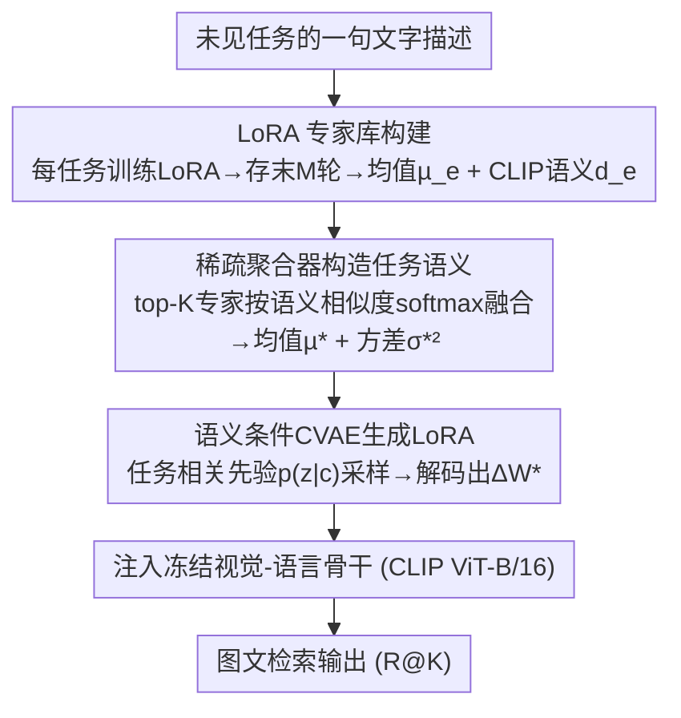

# SG-LoRA: Semantic-guided LoRA Parameters Generation

**会议**: CVPR 2026  
**论文**: [CVF Open Access](https://openaccess.thecvf.com/content/CVPR2026/html/Li_SG-LoRA_Semantic-guided_LoRA_Parameters_Generation_CVPR_2026_paper.html)  
**代码**: https://github.com/keepgoingjkg/SG-LoRA  
**领域**: 模型压缩 / LoRA 参数生成  
**关键词**: LoRA 生成, 参数高效微调, 零样本开放世界, 条件 VAE, 语义引导

## 一句话总结
SG-LoRA 用一句任务文字描述作为"语义桥梁"，从一组已训练好的专家 LoRA 中加权聚合出任务语义，再用条件 VAE 直接采样生成目标任务的 LoRA 参数，从而在**没有目标任务任何数据、且任务空间开放**的条件下实现免微调的实时模型适配，在图文检索上达到甚至超过逐任务微调（Oracle）的水平。

## 研究背景与动机

**领域现状**：大模型靠 LoRA 这类参数高效微调（PEFT）在下游任务上做低成本适配，社区里已经积累了大量公开的预训练 LoRA 模块。一个自然的想法是：能不能不再从头微调，而是直接"复用/生成" LoRA 权重来快速适配新任务？现有工作有两条路线——**合并式**（merging）把已有 LoRA 按系数加权融合，**生成式**（generation）用 VAE / 扩散模型合成新的 LoRA 参数。

**现有痛点**：合并式方法虽然支持开放世界，但生成权重靠的是确定性融合，多样性差、难以适应不断变化的用户意图，而且融合不同任务的 LoRA 时容易产生冲突；生成式方法引入了随机性、多样性更好，但通常建立在**闭世界假设**上——训练任务和测试任务来自相似分布，一旦遇到任务/域偏移就失效，无法处理真正开放的任务空间。

**核心矛盾**：边缘部署的真实场景同时要求"**没有目标任务原始数据**（隐私、算力受限）"和"**任务空间开放无界**（未见任务可能和已见任务毫不相关）"，而现有两条路线各自只满足了其中一面。

**本文目标**：作者提出并形式化了一个新设定 **Zero-Shot Open-world Adaptation（ZSOA）**——给定一批已见任务上训好的 LoRA，要为**任意未见任务**生成高性能 LoRA，且推理时不接触未见任务的任何原始数据。

**切入角度**：作者借鉴人类的类比推理——认识了 Birman、Egyptian Mau 几种猫之后，仅凭一段文字描述就能识别 British Shorthair。如果把任务的**文字描述**当作连接已见与未见任务的语义桥梁，就能在参数空间里"按语义插值"出新任务的 LoRA。

**核心 idea**：把任务描述用冻结 CLIP 文本编码器编码成语义向量，据此从专家 LoRA 库里挑出最相关的几个、加权聚合成任务语义分布，再用条件 VAE 以该语义为条件采样生成目标 LoRA——**用"语义到参数"的生成代替"数据到参数"的微调**。

## 方法详解

### 整体框架
SG-LoRA 把"为未见任务造一个 LoRA"拆成离线建库与在线生成两段。离线阶段先为每个已见任务训练专属 LoRA、压成专家库（每个专家 = 平均参数 + CLIP 语义嵌入）。在线阶段拿到未见任务的一句文字描述，用稀疏聚合器从库里挑出最相关的 top-K 专家、按语义相似度 softmax 融合出任务语义（均值与方差），再把该语义当作条件喂给一个训练好的条件 VAE，从任务相关先验里采样直接解码出目标 LoRA 参数，最后注入冻结的视觉-语言骨干完成图文检索。整条链路推理时只需文字输入、不碰目标任务数据。

### 关键设计

**1. LoRA 专家库构建：把"数据资产"蒸馏成"语义可检索的参数原型"**

ZSOA 推理时没有目标任务数据，唯一能依赖的就是已见任务的先验知识，所以第一步要把这些先验组织成可按语义检索、又紧凑的形式。作者为每个已见任务 $T_n$ 用对应图文对训练一个任务专属 LoRA，并在训练稳定后保存**最后 $M$ 轮**的参数 $\Delta\mathbf{W}_n = \{\Delta\mathbf{W}_n^m\}_{m=1}^M$（每个 $\Delta\mathbf{W}_n^m=[B_n^m,A_n^m]$ 是按层拼接的 LoRA 矩阵），保留这 $M$ 个样本是为了刻画同一任务 LoRA 参数的**分布**而非一个点估计。同时用模板 `a photo of a <class name>` 经冻结 CLIP 文本编码器得到任务语义 $\mathbf{d}_n=f(T_n)$。构建专家库时，对挑选出的代表任务把 $M$ 个适配取平均得到原型 $\boldsymbol{\mu}_e=\frac{1}{M}\Delta\mathbf{W}_e$，与语义嵌入配对成 $\mathcal{W}_{\text{expert}}=\{(\boldsymbol{\mu}_e,\mathbf{d}_e)\}$。这样每个专家既有"代表性参数"又有"可被文字检索的语义标签"，为后续按语义挑专家打下基础。

**2. 稀疏聚合器构造任务语义：top-K 加权 + 全方差定理估方差**

简单堆砌所有专家并不会带来收益——无关专家会注入矛盾或噪声知识。作者设计稀疏聚合器，只挑语义最相关的少数专家。给未见任务嵌入 $\mathbf{d}^*$，与所有专家嵌入算余弦相似度并取 top-K，再对相似度做带温度 $\tau$ 的 softmax 得到融合系数 $\alpha_k=\frac{\exp(\text{sim}(\mathbf{d}^*,\mathbf{d}_k)/\tau)}{\sum_{k'}\exp(\text{sim}(\mathbf{d}^*,\mathbf{d}_{k'})/\tau)}$，语义均值即加权和 $\boldsymbol{\mu}^*=\sum_k \alpha_k\boldsymbol{\mu}_k$。关键巧思在于：生成式建模不仅需要均值还需要方差，作者用**全方差定理（Law of Total Variance）**按元素估计任务方差

$$
{\boldsymbol{\sigma}^*}^2=\sum_{k=1}^K \alpha_k\boldsymbol{\sigma}_k^2+\sum_{k=1}^K \alpha_k(\boldsymbol{\mu}_k-\boldsymbol{\mu}^*)\odot(\boldsymbol{\mu}_k-\boldsymbol{\mu}^*)
$$

第一项是各专家内部方差的加权，第二项是专家均值相对全局均值的离散度——这让任务语义 $c=\{\boldsymbol{\mu}^*,{\boldsymbol{\sigma}^*}^2\}$ 同时刻画了"中心"和"不确定性"，比单点条件更能反映新任务的统计特性。⚠️ 方差公式的推导原文放在附录 B，细节以原文为准。

**3. 语义条件 CVAE 生成：用任务相关先验把确定性融合变成概率采样**

拿到任务语义 $c$ 后，作者用条件 VAE 直接在参数空间里采样生成 LoRA，而非确定性融合。编码器以待重建 LoRA 张量 $X$ 和语义 $c$ 为输入近似后验 $q(z|X,c)$，解码器据 $z$ 与 $c$ 重建 $X$。与普通 VAE 用 $p(z)=\mathcal{N}(0,I)$ 不同，这里用**语义感知先验** $p(z|c)$（由堆叠 MLP 参数化），让每个任务有自己的先验分布，从而把领域级统计注入采样。训练最小化负 ELBO：$\mathcal{L}_{\text{CVAE}}=\mathbb{E}_{q(z|X,c)}[\|X-\hat{X}\|^2]+\lambda\cdot \text{KL}(q(z|X,c)\|p(z|c))$，第一项保证重建准确、第二项把潜空间对齐到任务先验。推理时直接从 $p(z|c)$ 采样、解码即得目标 LoRA。这一随机化设计把合并式方法的"确定性融合"升级为"概率参数采样"，既提升了参数多样性，也让模型能动态适配不断变化的用户意图。

### 损失函数 / 训练策略
训练目标即上文的负 ELBO（重建项 + KL 正则项），默认超参 $M=100$、$K=4$、$\lambda=1$。骨干为 CLIP ViT-B/16，在视觉编码器每个 Transformer block 的 $W_q,W_k,W_v$ 注入 rank-2 LoRA；CVAE 编码器与先验网络各为两层 ReLU MLP、解码器为三层 ReLU MLP；优化器 Adam，单张 A6000 训练。

## 实验关键数据

### 主实验
数据集为 MS-COCO、OxfordPets、Flowers102（后两者原为细粒度分类，用 Qwen2-VL 合成图文描述改造成检索任务），指标为图→文（I2T）与文→图（T2I）的 R@1/5/10。对比含 Zero-Shot CLIP、Model Soups（均匀平均所有专家）、AdapterSoup（top-K 等权）、Top-K LoRA Weighted（top-K softmax 加权）、Oracle（逐任务直接微调）。

| 数据集 | 指标 | Zero-Shot CLIP | Top-K Weighted | SG-LoRA | Oracle |
|--------|------|----------------|----------------|---------|--------|
| MS-COCO | I2T R@1 | 66.43 | 71.55 | **74.31** | 72.45 |
| MS-COCO | T2I R@1 | 41.66 | 49.85 | **54.42** | 53.10 |
| OxfordPets | I2T R@1 | 40.45 | 53.96 | **57.15** | 55.84 |
| OxfordPets | T2I R@1 | 26.03 | 35.42 | 37.62 | **40.99** |

在 MS-COCO 与 OxfordPets 的 I2T R@1 上，SG-LoRA 甚至**反超 Oracle**——作者归因于 CVAE 对专家 LoRA 的高效压缩与分布建模，以及 Oracle 在小图文对上易过拟合，而 SG-LoRA 不依赖目标数据反而更稳。

### 跨数据集泛化
| 迁移方向 | 指标 | Top-K Weighted | SG-LoRA |
|----------|------|----------------|---------|
| OxfordPets→MS-COCO | I2T R@1 | 68.75 | **70.81** |
| MS-COCO→OxfordPets | I2T R@1 | 48.13 | **55.41** |

SG-LoRA 在跨数据集下持续优于合并式方法；有趣的是用 MS-COCO 训练去生成 OxfordPets 的 LoRA 有时优于直接在 OxfordPets 上生成，说明**更丰富的专家知识能让参数空间探索得更充分**。

### 消融实验
| 配置 | Egyptian Mau I2T R@1 | Persian I2T R@1 | 说明 |
|------|----------------------|-----------------|------|
| w/o Cat 专家 | 36.08 | 44.00 | 专家库去掉 MS-COCO Cat 专家 |
| w/ Cat 专家 | 37.11 | 47.00 | 含语义高度相关的 Cat 专家 |

### 关键发现
- **语义加权是关键**：AdapterSoup（top-K 等权）反而不如 Top-K Weighted（softmax 加权），说明无关专家若等权会放大噪声，按相关度加权才有效。
- **专家库语义覆盖决定上限**：在通用检索 Flickr30K 上，MS-COCO 训练的 SG-LoRA 优于 OxfordPets 训练的版本，因为前者类别覆盖更广、语义引导更全面。
- **语义相关专家直接增益**：加入与目标任务（猫类）语义高度相关的 Cat 专家后，未见的 Egyptian Mau / Persian 检索 R@1 普遍上升。

## 亮点与洞察
- **用文字描述当"已见↔未见"桥梁**：把开放世界适配从"需要数据"降维成"只需一句任务描述"，对边缘端隐私与算力友好，这是 ZSOA 设定最实用的地方。
- **全方差定理估任务方差**很巧妙：不少生成式做法只给条件均值，这里同时把"专家内方差 + 专家间离散度"折进条件，使 CVAE 采样更贴合新任务统计；这个"加权均值+全方差"套路可迁移到任何"按检索到的原型生成参数"的场景。
- **把确定性融合升级为概率采样**：语义感知先验 $p(z|c)$ 让每个任务有专属先验，既解释了为何能超过 Oracle（缓解小样本过拟合），也指出"生成参数"相比"融合参数"在多样性上的本质优势。

## 局限与展望
- 评测主要集中在**图文检索**这一统一结构的任务族（专家与目标共享检索格式），跨结构差异更大的任务（如检测、生成）能否同样有效未验证。
- 性能强依赖**专家库的语义覆盖**：库中缺少与目标语义相近的专家时（如 OxfordPets 只覆盖猫狗），生成质量明显下降。
- LoRA 训练用了**统一网络配置**，作者也承认这对某些数据集（OxfordPets）未必最优，统一配置可能限制了部分任务的上限。
- 任务描述用固定模板 `a photo of a <class>` 生成，描述质量与表达力对最终参数影响多大，尚缺系统分析。

## 相关工作与启发
- **vs 合并式（Model Soups / AdapterSoup / LoraHub / SemLA）**：它们靠确定性融合或需未知任务数据/反复装卸适配器，多样性受限且开放世界下易冲突；SG-LoRA 用语义条件的概率采样生成，既免数据又提升多样性。
- **vs 生成式（神经网络扩散 / 超表示学习 / ICM-LoRA）**：以往参数生成多限于小网络、无条件、闭世界增强（ICM-LoRA 仅做闭世界任务增强）；SG-LoRA 是**条件式、面向开放世界**地为任意未见任务生成 LoRA。

## 评分
- 新颖性: ⭐⭐⭐⭐⭐ 提出并形式化 ZSOA 设定，语义桥梁 + 全方差条件 + 语义先验 CVAE 组合新颖。
- 实验充分度: ⭐⭐⭐⭐ 覆盖 in-dataset / 跨数据集 / 通用检索 + 多组消融，但任务族集中在图文检索。
- 写作质量: ⭐⭐⭐⭐ 动机类比清晰、公式完整，部分推导（方差）放附录。
- 价值: ⭐⭐⭐⭐ 免数据实时生成 LoRA 对边缘部署与隐私场景实用价值高。

<!-- RELATED:START -->

## 相关论文

- [\[CVPR 2026\] TAS-LoRA: Transformer Architecture Search with Mixture-of-LoRA Experts](tas-lora_transformer_architecture_search_with_mixture-of-lora_experts.md)
- [\[ICML 2026\] A Language-Guided Bayesian Optimization for Efficient LoRA Hyperparameter Search](../../ICML2026/model_compression/a_language-guided_bayesian_optimization_for_efficient_lora_hyperparameter_search.md)
- [\[CVPR 2026\] Is Bin Generation Indispensable? A Bin-Generation-Free Dataset Quantization via Semantic Perspective](is_bin_generation_indispensable_a_bin-generation-free_dataset_quantization_via_s.md)
- [\[ACL 2026\] LoRA on the Go: Instance-level Dynamic LoRA Selection and Merging](../../ACL2026/model_compression/lora_on_the_go_instance-level_dynamic_lora_selection_and_merging.md)
- [\[ACL 2026\] SAMoRA: Semantic-Aware Mixture of LoRA Experts for Task-Adaptive Learning](../../ACL2026/model_compression/samora_semantic-aware_mixture_of_lora_experts_for_task-adaptive_learning.md)

<!-- RELATED:END -->
