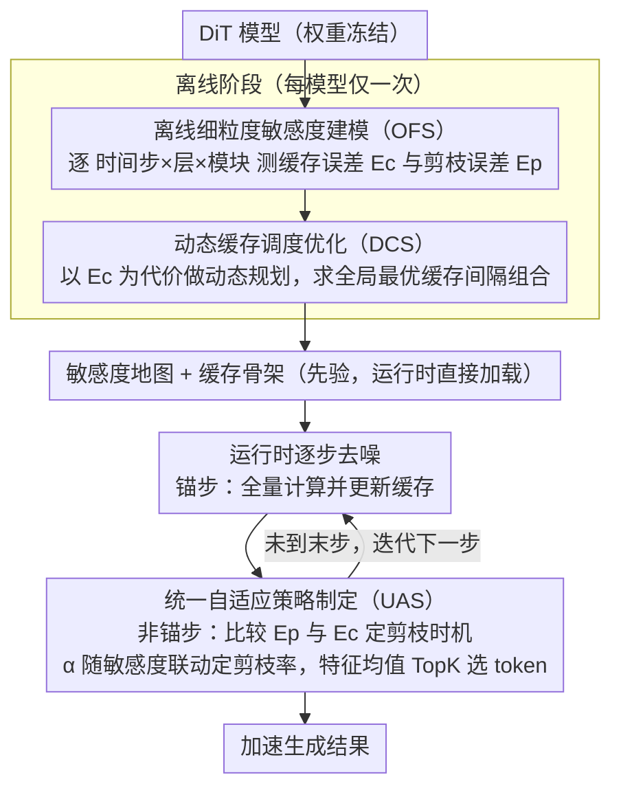

<!-- 由 src/gen_stubs.py 自动生成 -->
# SODA: Sensitivity-Oriented Dynamic Acceleration for Diffusion Transformer

**会议**: CVPR2026  
**arXiv**: [2603.07057](https://arxiv.org/abs/2603.07057)  
**代码**: [leaves162/SODA](https://github.com/leaves162/SODA)  
**领域**: 模型压缩  
**关键词**: 扩散 Transformer, 训练无关加速, 缓存, 剪枝, 敏感度建模, 动态规划

## 一句话总结

提出 SODA，通过离线细粒度敏感度建模 + 动态规划优化缓存间隔 + 统一自适应剪枝策略，在无需训练的条件下对 Diffusion Transformer 实现可控加速比下的高保真生成。

## 研究背景与动机

**DiT 推理效率瓶颈**：Diffusion Transformer 在图像和视频生成中表现优异，但重复采样步骤和 Transformer 块带来的低推理效率严重阻碍部署。

**训练方法代价高**：蒸馏/微调等训练加速方法计算开销大、泛化性有限，研究者更倾向于免训练加速。

**缓存与剪枝各有取舍**：缓存加速效率高但损失保真度，剪枝灵活但效率较低；两者结合可兼顾效率与质量。

**现有策略依赖经验设计**：ToCa、DuCa 等方法对缓存间隔和剪枝率使用固定/启发式配置，仅捕捉粗粒度敏感趋势，无法感知时间步、层、模块级别的细粒度变化。

**跳过高敏感计算导致质量退化**：启发式方案不可避免地跳过对加速高度敏感的计算，造成生成保真度下降。

**泛化性差**：手工设计的策略依赖经验，难以跨模型迁移。

## 方法详解

### 整体框架

SODA 想解决的是 DiT 免训练加速里一个被长期回避的问题：缓存和剪枝跳过哪些计算，过去全靠固定间隔或启发式比率拍板，而 DiT 在不同时间步、不同层、不同模块上对"被跳过"的容忍度差异极大——把一个高敏感的计算省掉，画质就塌。SODA 的思路是先把这种容忍度量化成可查的先验，再用它来做调度决策。整条流水线分三步走：离线阶段对每个模型扫一遍、建出细粒度的"敏感度地图"（OFS）；拿到地图后，把"在哪些步缓存、间隔多大"当成一个最优化问题用动态规划求全局最优解（DCS）；运行时再逐层逐模块地比对缓存与剪枝两条路哪条误差更小，自适应地决定剪不剪、剪多狠（UAS）。三步都不碰模型权重，离线只跑一次，运行时几乎零额外开销。

### 关键设计

**1. 离线细粒度敏感度建模（OFS）：把"哪些计算省不得"量化成可查的先验**

启发式方法之所以会误伤高敏感计算，根子在于它对敏感度只有粗粒度的直觉，看不到时间步、层、模块这些维度上的差异。OFS 的做法是直接把敏感度测出来、存成表。对缓存，它定义缓存敏感度误差 $\mathcal{E}_c(t,l,m,n) = 1 - \text{Cos}(\mathcal{D}_{t+n,l,m}(x), \mathcal{D}_{t,l,m}(x))$，衡量在时间步 $t$ 直接复用 $t+n$ 步的缓存特征会带来多大的 Cosine 偏差——这个量同时按时间步 $t$、层 $l$、模块 $m$、缓存间隔 $n$ 四个维度展开，间隔越大、所在位置越敏感，误差就越高。对剪枝，它对称地定义剪枝敏感度误差 $\mathcal{E}_p(t,l,m,\alpha)$，刻画在剪枝率 $\alpha$ 下丢掉部分 token 造成的特征误差。关键在于这些误差是模型固有属性而非样本噪声：实测用 100 次随机生成取平均（视频模型 10 次）就能得到方差稳定的分布，因此每个模型只需离线建模一次、把整张敏感度地图当先验永久复用。开销也低到可以忽略——DiT-XL/2 约 160s、内存仅多占 0.56GB。

**2. 动态缓存调度优化（DCS）：用动态规划求全局最优的缓存间隔组合**

有了敏感度地图，"在哪些步缓存"就不再需要拍脑袋。SODA 注意到这个调度问题具有最优子结构——从某一步往后的最优缓存方案，只取决于当前步和剩余的缓存预算，于是可以写成动态规划递推：

$$dp[t][i+1] = \min_{n \in \mathcal{N}} \{\mathcal{E}_{dp}(t,n) + dp[t+n][i]\}$$

其中 $\mathcal{N}$ 是候选缓存间隔集合，$i$ 是剩余缓存次数。给定加速预算（即总缓存次数 $N_s$），算法从 $T$ 步反推到第 1 步，求出累计敏感度误差最小的那条路径，再回溯出具体在哪些时间步缓存、各自间隔多大。举例来说，若候选间隔为 $\{2,3,4\}$、预算允许缓存若干次，DP 会自动在敏感度低的中段拉长间隔（多省计算）、在敏感度高的两端缩短间隔（保画质），而不是像启发式那样全程等间隔。整个求解跑在离线误差表上，不触碰真实推理，因此不引入任何运行时开销。

**3. 统一自适应策略制定（UAS）：用同一把敏感度尺子统一剪枝与缓存决策**

DCS 定了缓存骨架，但中间那些非缓存步到底该剪枝还是该复用缓存、剪多狠，仍要逐层逐模块地决定。UAS 的巧处是让剪枝和缓存共用 OFS 那把尺子，从而保证每一步选的都是误差更小的那条路。剪枝时机上，它只在剪枝误差 $\delta_{t+1,l,m} = \mathcal{E}_p(t+1,l,m,\alpha)$ 小于对应的缓存误差 $\mathcal{E}_c(t,l,m,n)$ 时才执行剪枝，否则就直接复用缓存——这样无论选哪条，整体误差都不会比单纯缓存更差。剪枝率上，它让强度随局部敏感度联动：$\alpha_{t+1,l,m} = \lambda \cdot \mathcal{E}_c(t,l,m,n) + \beta$，其中 $\lambda$ 是缩放系数，$\beta$ 是随加速预算自适应调整的基础剪枝率，于是缓存误差越大（越敏感）的地方反而剪得越轻，全局预算和局部敏感度被同时纳入考量。具体剪哪些 token，则用特征均值做 TopK 选择，绕开 Flash Attention 下注意力权重拿不到的兼容性问题。

### 损失函数 / 训练策略

SODA 全程免训练、无额外损失。它唯一的"优化目标"是 DCS 动态规划里最小化的累计敏感度误差 $dp[1][N_s]$，且这一优化在离线阶段一次性完成。

## 实验

### 主要结果

| 模型 / 设置 | 加速比 | FID↓ | sFID↓ | IS↑ | 说明 |
|---|---|---|---|---|---|
| DiT-XL/2 DDPM 原始 | 1.00× | 2.23 | 4.57 | 275.65 | — |
| ToCa (DDPM) | 2.75× | 2.58 | 5.74 | 256.26 | — |
| DuCa (DDPM) | 2.73× | 2.59 | 5.68 | 256.36 | — |
| **SODA (DDPM, $N_s$=72)** | **2.73×** | **2.47** | **5.09** | **262.30** | sFID 降 0.65, IS 升 6+ |
| DiT-XL/2 DDIM 原始 | 1.00× | 2.25 | 4.33 | 239.97 | — |
| DuCa (DDIM) | 2.48× | 3.05 | 4.66 | 233.21 | — |
| **SODA (DDIM, $N_s$=18)** | **2.49×** | **2.75** | **4.56** | **235.65** | FID 降 0.30 |

| 模型 | 加速比 | FID-30K↓ | CLIP↑ | 说明 |
|---|---|---|---|---|
| PixArt-α 原始 | 1.00× | 28.10 | 16.29 | — |
| DuCa | 1.87× | 28.05 | 16.42 | — |
| **SODA ($N_s$=8)** | **1.88×** | **27.33** | **16.42** | FID 降 0.72 vs DuCa |
| **SODA ($N_s$=7)** | **2.21×** | **27.72** | **16.44** | 更高加速仍优于原始 |

### 消融实验

| 配置 | FID↓ | sFID↓ | IS↑ |
|---|---|---|---|
| Vanilla (固定缓存) | 3.83 | 5.24 | 213.12 |
| OFS + DCS | 2.78 | 4.63 | 234.78 |
| OFS + UAS | 2.89 | 4.75 | 235.01 |
| **SODA (完整)** | **2.75** | **4.56** | **235.65** |

- DCS 单独贡献 FID 降 1.05、IS 升 21.66；UAS 单独贡献 FID 降 0.94、IS 升 21.89；两者结合效果最优。
- Cosine 距离作为敏感度度量优于 L1/L2。

### 关键发现

1. **低加速可提升原始性能**：1.55× 时 FID 从 2.23 降至 2.21（DDPM），可能因跳过冗余计算反而去噪更稳定。
2. **离线建模具有高一致性**：离线敏感度分布与实际推理时高度吻合（Fig. 6），方差稳定，证明敏感度是模型固有属性。
3. **超参数不敏感**：$\lambda$ 和 $\beta$ 变化范围内 ΔFID ≤ 0.02、ΔIS ≤ 2.2。
4. **视频任务同样有效**：OpenSora 2.50× 加速下 VBench 仅降 0.64%，优于 ToCa/DuCa/PAB/FORA。

## 亮点

- 首次将敏感度建模推至时间步×层×模块的细粒度，并用动态规划统一求解最优缓存策略，理论上保证全局最优。
- 剪枝决策与缓存决策通过敏感度误差统一，自适应保留高敏感 token，既无需手工设计又具备泛化性。
- 离线建模仅需一次且开销极低（< 1 小时），运行时只加载 0.16MB 先验，零额外推理开销。
- 跨任务泛化：同一框架无修改地适用于类别条件图像生成、文生图、文生视频三类任务。

## 局限性

- 作为免训练方法，加速效果仍落后于蒸馏等训练方法。
- 与蒸馏等训练技术的集成尚未探索。
- 离线建模需要对每个新模型执行一次（虽然开销小），不完全是即插即用。
- 剪枝位置选择依赖特征均值启发式，可能不是最优的 token 重要性度量。
- 动态规划搜索空间随缓存间隔候选集增大而增长，极端大步数场景下需关注求解效率。

## 相关工作

- **缓存加速**：FORA、FasterDiffusion、ToCa (ICLR 2025)、DuCa — 利用相邻时间步相似性复用中间特征，但采用固定/启发式缓存策略。
- **Token 剪枝**：ToMe、AT-EDM — 基于 token 冗余进行裁剪，灵活但效率低于缓存。
- **缓存+剪枝结合**：ToCa、DuCa — 在锚步全计算后缓存，中间步剪枝+缓存复用，但策略手工设计。
- **敏感度分析启发**：本文受 LLM 量化中的敏感度分析（如 SqueezeLLM）启发，将其扩展至扩散模型的多维度加速决策。

## 评分

- 新颖性: ⭐⭐⭐⭐ — 将敏感度建模与动态规划结合做缓存优化是新颖的，统一剪枝/缓存决策思路清晰。
- 实验充分度: ⭐⭐⭐⭐⭐ — 三个模型、三种任务、完整消融、离线分析、超参敏感度、定性对比，非常充分。
- 写作质量: ⭐⭐⭐⭐ — 结构清晰，问题驱动，Fig.1 动机图效果好。
- 价值: ⭐⭐⭐⭐ — 方法实用且泛化性强，开源代码可复现，对 DiT 加速社区有直接贡献。

<!-- RELATED:START -->

## 相关论文

- [\[CVPR 2026\] ResCa: Residual Caching for Diffusion Transformers Acceleration](resca_residual_caching_for_diffusion_transformers_acceleration.md)
- [\[CVPR 2026\] HeSS: Head Sensitivity Score for Sparsity Redistribution in VGGT](hess_head_sensitivity_score_for_sparsity_redistribution_in_vggt.md)
- [\[CVPR 2026\] PPCL: Pluggable Pruning with Contiguous Layer Distillation for Diffusion Transformers](ppcl_pluggable_pruning_dit_distillation.md)
- [\[CVPR 2025\] TADFormer: Task-Adaptive Dynamic Transformer for Efficient Multi-Task Learning](../../CVPR2025/model_compression/tadformer_task-adaptive_dynamic_transformer_for_efficient_multi-task_learning.md)
- [\[CVPR 2026\] Batch Loss Score for Dynamic Data Pruning](batch_loss_score_for_dynamic_data_pruning.md)

<!-- RELATED:END -->
