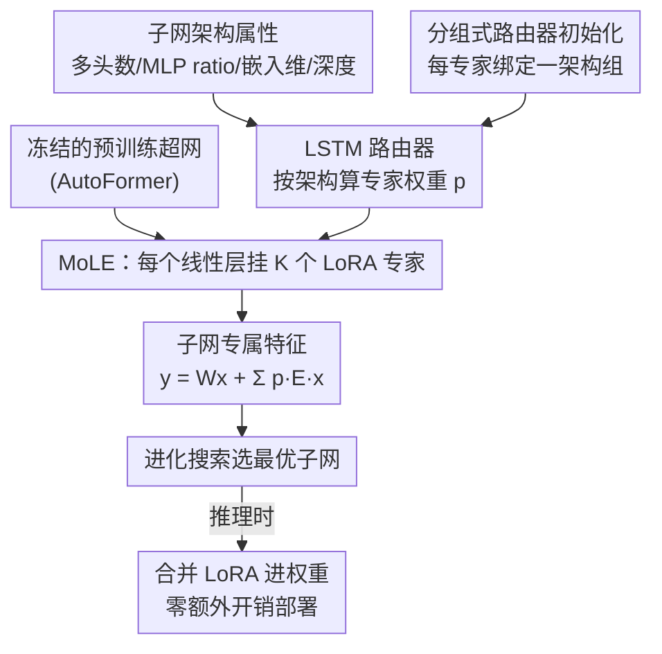

# TAS-LoRA: Transformer Architecture Search with Mixture-of-LoRA Experts

**会议**: CVPR 2026  
**arXiv**: [2605.07256](https://arxiv.org/abs/2605.07256)  
**代码**: https://cvlab.yonsei.ac.kr/projects/TAS-LoRA/ (项目页)  
**领域**: 模型压缩 / 神经架构搜索 / 参数高效微调  
**关键词**: Transformer架构搜索, 权重纠缠超网, 特征坍缩, LoRA专家混合, 路由器

## 一句话总结
针对一次性 Transformer 架构搜索（TAS）中"子网共享权重导致特征坍缩"的顽疾，TAS-LoRA 给冻结的超网挂上一组 LoRA 专家，用一个吃"架构配置"的 LSTM 路由器为每个子网动态组合专家、学到子网专属特征，并靠分组式路由器初始化逼专家从训练初期就学得各不相同，在 ImageNet 上把 AutoFormer 各尺度的搜索结果稳定提升 0.2~1.0 个点且推理零额外开销。

## 研究背景与动机
**领域现状**：Transformer 架构搜索（TAS）想自动找到适配不同硬件约束的最优 ViT，省去人工调结构。其中**一次性（one-shot）** 方法最受欢迎——训练一个"权重纠缠超网（weight-entangled supernet）"，让所有可能的子网共享同一套权重，搜索时直接用共享权重估计子网性能，选出的子网无需重训即可部署，因而代价极低（AutoFormer、ViTAS、FocusFormer、DYNAS 等都是这套）。

**现有痛点**：权重纠缠超网有个被长期忽视的"**特征坍缩（feature collapse）**"问题——不同架构的子网由于共享权重，提取出的特征表示高度雷同。作者实测：从 AutoFormer / DYNAS 超网随机采 6 个子网，它们倒数第二层特征的余弦相似度几乎为 1；而把这 6 个子网各自从头独立训练，相似度明显低很多，且独立训练的 top-1 精度全面高于超网内的对应子网（表 1）。这说明**最优特征本应随架构而变，但共享权重把它们抹平了**。

**核心矛盾**：超网优化的是所有子网的总损失，梯度被各子网"平均"掉，于是共享权重只会学对所有子网都通用的"泛化特征"，而无法让单个子网充分发挥自己的架构特性（多头数、MLP ratio、嵌入维度、深度），导致单子网性能次优。共享权重的"通用性"与单子网的"专属性"天然冲突。

**本文目标**：让每个子网在不破坏超网共享高效性、不增加推理开销的前提下，学到属于自己的专属特征，从而缓解特征坍缩。

**切入角度**：作者借用参数高效微调里的 **LoRA**——给子网挂上可训练的低秩增量参数，就能在冻结的共享权重之上叠加子网专属的特征修正；而且 LoRA 在推理时可被合并进权重，零额外开销。但子网配置数量是天文数字（AutoFormer-T 空间约 $2\times10^8$ 个），给每个子网配独立 LoRA 不可行。

**核心 idea**：用一组**有限的 LoRA 专家 + 路由器**（Mixture-of-LoRA-Experts, MoLE）来"摊薄"——路由器根据子网的架构配置动态挑选并加权组合专家，让有限专家覆盖海量子网；再用分组初始化逼专家早期就学得多样。这是首次把 MoLE 用于 TAS。

## 方法详解

### 整体框架
TAS-LoRA 不从头训超网，而是在一个**预训练好、且全程冻结**的 AutoFormer 超网之上，挂一层轻量的 MoLE 分支与路由器，只训这部分。流程是：先把超网每个 Transformer block 里的 4 个线性层（QKV 投影 2 个、MLP 2 个）都换成 MoLE 层，每层配 $K$ 个 LoRA 专家；训练/搜索一个子网时，把该子网的架构属性（每个 block 的多头数、MLP ratio，以及全局的嵌入维度、深度）喂给一个 **LSTM 路由器**，路由器为每个线性层输出一组专家权重 $p^l$，把 $K$ 个专家按权重加权求和叠到原始线性层输出上，从而让这个特定子网得到专属的特征修正。为了避免路由器初期对所有专家"一视同仁"造成专家冗余，引入**分组式路由器初始化**：按 block 架构相似度分组，让每个专家初始绑定一个组。训完后用进化搜索在"共享权重 + LoRA 修正"下评估子网、选最优；推理时把选中子网的 LoRA 专家按路由权重合并进权重，固定下来，因此推理无任何额外开销。

整体可拆成"输入子网架构 → 路由器算专家权重 → MoLE 叠加专属特征 → 进化搜索选子网 → 合并权重部署"五步，其中路由器与分组初始化是核心贡献：

### 关键设计

**1. MoLE：用有限 LoRA 专家摊薄海量子网的专属特征**

痛点是子网数量爆炸（$10^8$ 级），给每个子网配独立 LoRA 既存不下也训不动。MoLE 的做法是把"每子网一个 LoRA"换成"全局共享 $K$ 个 LoRA 专家 + 按子网动态组合"。具体地，对超网的每个线性层（QKV、MLP 共 $L=4B$ 层，$B$ 为 block 数）独立配一组 $K$ 个专家，第 $l$ 层第 $k$ 个专家参数化为低秩形式 $E_k^l = U_k^l D_k^l / r$（$r$ 为秩，论文设 8），路由器给出归一化权重 $p^l=(p_1^l,\dots,p_K^l)$、$\sum_k p_k^l=1$，该层输出为

$$y^l = W^l x^l + \sum_{k=1}^{K} p_k^l E_k^l x^l,$$

其中 $W^l$ 是冻结的原始权重。这样有限专家通过不同的加权组合就能给不同子网生成各异的特征修正，既保留了超网"一次训练、无需重训"的高效，又恢复了被共享权重抹掉的子网专属性。

**2. 吃"架构配置"而非"特征图"的 LSTM 路由器：让权重可合并、推理零开销**

已有的 MoLE 方法（图像领域）路由器吃的是**输入特征图**，导致两个问题：每个输入都要重算专家权重，开销大；且选中的专家随输入变化，LoRA 无法预先合并进权重。TAS-LoRA 的关键转换是——**让路由器吃"子网架构配置"而非特征图**。因为子网一旦选定，其架构就固定，路由器对一个子网**只跑一次、与具体输入无关**，于是 LoRA 可以提前合并，推理时彻底零开销。

路由器结构上：block 级属性（多头数、MLP ratio）与子网级属性（嵌入维、深度）先经一个可学习的 block embedding 层编码成连续向量，再送进单层 LSTM（隐藏维 128）捕捉 block 间的序列依赖，输出每个 block 的隐表示 $h(b)\in\mathbb{R}^d$；把所有 block 拼成 $H\in\mathbb{R}^{B\times d}$，过一个全连接 router head（权重 $R\in\mathbb{R}^{4\times B\times d\times K}$、偏置 $c$）得到 logits $O\in\mathbb{R}^{4B\times K}$，沿专家维 softmax 得到所有层的专家权重 $P=\mathrm{softmax}(O,\dim{=}{-1})$，第 $l$ 层取 $p^l=P[l,:]$。用 LSTM 是因为相邻 block 的最优特征有顺序相关性，逐层独立打分会丢掉这种依赖。（不活跃的 block——子网深度 $v<b$ 时——直接跳过其计算。）

**3. 分组式路由器初始化：逼专家从训练初期就学得各不相同**

痛点是训练早期路由器倾向给所有专家近乎均等的权重，于是各专家学到几乎一样的东西、严重冗余。MoE 常用"辅助负载均衡损失"逼不同样本选不同专家，但 TAS-LoRA 的路由器一次只处理**单个子网**，batch 内没有"多个实例选不同专家"可言，这招用不了。

作者的替代方案基于"结构相似的架构倾向学相似特征"这一观察：把不同子网中**同一位置**的 block，按多头数、MLP ratio、嵌入维度三个属性分组（同组这三项相同；深度属性不参与分组，因它不改变 block 形状），并令**专家数 $K$ = 组数**（AutoFormer-T 为 12 组、S 为 27、B 为 18）。初始化时给每个组配一个专属 router head，把其权重 $R_k'$ 和偏置 $c_k'$ 几乎全置零，只在偏置对应该组指定专家 $k$ 的位置放一个正值 $\beta$（$\beta{=}3$），即 $c_k'[:,:,k]=\beta$。这样初始时隐表示 $H$ 影响不了专家选择，每个组被偏置到各自指定的专家上，逼专家从第一步就分化、学不同特征；随训练推进，路由器再根据架构动态调整分配，同组 block 也可按需选不同专家。实测分组初始化让专家间特征余弦相似度明显低于随机初始化。

### 损失函数 / 训练策略
不引入额外损失项，子网采样后仍用标准交叉熵 $\theta^*=\arg\min_\theta \mathbb{E}_{\mathcal{N}_i\sim\mathcal{N}}[\mathcal{L}(\mathcal{N}_i;\theta)]$，只是 $\theta$（超网权重）冻结，优化对象换成 LoRA 专家 + 路由器 $\phi$。训练 50 epoch、batch size 1024：前 5 epoch 为 **warm-up**，冻结路由器、只用 AdamW 训 LoRA 专家（学习率 1e-5 线性升到 5e-4），让每个专家先从其绑定组学到独特特征；之后 45 epoch 路由器与专家联合优化，路由器用 SGD（初始学习率 1e-1），余弦调度。搜索用进化搜索（evolutionary search），按式 $\mathcal{N}^*=\arg\min_{\mathcal{N}_i} L_\text{val}(\mathcal{N}_i;\theta,\phi)$ 在"共享权重 + LoRA"下评估候选子网，避免穷举。

## 实验关键数据

### 主实验
ImageNet 上把 TAS-LoRA 套到 AutoFormer / DYNAS 超网上，三种尺度均稳定提升，且参数量、FLOPs 与基线几乎不变（LoRA 推理已合并）：

| 搜索空间 | 方法 | Top-1 (%) | #Params | FLOPs |
|----------|------|-----------|---------|-------|
| Tiny | AutoFormer-Ti† | 74.7 | 5.9M | 1.3G |
| Tiny | **TAS-LoRA-Ti** | **75.7 ±0.1** | 5.9M | 1.3G |
| Tiny | DYNAS | 74.8 | 6.0M | 1.3G |
| Tiny | **TAS-LoRA + DYNAS** | **75.9 ±0.0** | 5.9M | 1.3G |
| Small | AutoFormer-S† | 81.6 | 22.9M | 5.1G |
| Small | **TAS-LoRA-S** | **81.9 ±0.1** | 22.9M | 5.0G |
| Base | AutoFormer-B† | 82.4 | 54.0M | 11.0G |
| Base | **TAS-LoRA-B** | **82.6 ±0.0** | 54.0M | 11.0G |

提升在**小空间（Tiny）最明显（+1.0）**：小空间超网参数少、表征容量有限，特征坍缩更严重，正是 TAS-LoRA 最能补的地方。它对 DYNAS 也有效（+1.1），说明缓解特征坍缩与具体训练策略正交。

迁移学习（把搜到的子网在 5 个下游集微调）也全面竞争或领先，验证泛化性：

| 模型 | #Params | CIFAR-10 | CIFAR-100 | Flowers | Cars | INAT-19 |
|------|---------|----------|-----------|---------|------|---------|
| AutoFormer-S | 23M | 98.9 | 89.6 | 97.9 | 92.1 | 77.4 |
| PreNAS-S | 23M | 99.1 | 91.2 | 97.6 | 92.2 | 76.4 |
| **TAS-LoRA-S** | 23M | 99.1 | 91.0 | 98.2 | **92.3** | **78.0** |

### 消融实验
| 配置 | Tiny | Small | Base | 说明 |
|------|------|-------|------|------|
| AutoFormer（基线） | 74.9 | 81.6 | 82.4 | 纯共享权重超网 |
| TAS-LoRA + 随机初始化 | 75.4 | 81.8 | 82.5 | 加 MoLE 但路由器随机初始化 |
| TAS-LoRA + 分组初始化 | **75.7** | **81.9** | **82.6** | 完整方法 |

另有"对比全量微调"消融（图 6）：在相同 50 epoch 下，把整个超网权重全量微调（不加 MoLE）几乎不涨点，而 TAS-LoRA 在各参数约束下稳定领先——证明增益来自 MoLE 学到的子网专属特征，而非单纯多训了几轮。

### 关键发现
- **MoLE 本身就带来主要增益**：加上随机初始化的 MoLE 已比基线涨 0.1~0.5，说明"恢复子网专属特征"这个方向选对了；分组初始化再叠加 0.1~0.3。
- **分组初始化的作用是降冗余**：实测它让各 LoRA 专家跨层的特征余弦相似度低于随机初始化（图 4/5），即专家学得更多样、更不重复。
- **全量微调无法解决特征坍缩**：相同训练预算下全量微调几乎不涨，反证问题不在"训练不够"而在"共享权重抹平了专属性"。
- **小空间收益最大**：表征容量越受限、坍缩越重，TAS-LoRA 补得越多（Tiny +1.0 vs Base +0.2）。

## 亮点与洞察
- **把"输入"从特征图换成架构配置**，一招同时解决了 MoLE 的两大痛点（每输入重算、无法合并权重）——因为子网定了架构就定了，路由器只跑一次、LoRA 可预合并，推理零开销。这个"路由依据"的替换是全文最巧的一笔。
- **用 LoRA 给 NAS 子网做"个性化"**：超网共享权重学通用特征、LoRA 学子网专属特征，分工清晰；且 LoRA 天生可合并，完美契合 one-shot TAS"无需重训直接部署"的卖点。
- **首次把特征坍缩问题搬到 TAS 上并量化**（cosine 相似度 + 独立训练对照），把一个"大家默认但没人系统刻画"的现象讲清楚，本身就是贡献。
- **专家数 = 架构组数**这个对齐很优雅——不是拍脑袋设超参，而是让专家粒度天然对应架构空间的离散结构，分组初始化也因此有了明确的绑定目标。

## 局限性 / 可改进方向
- **依赖一个训练好的超网**：TAS-LoRA 是在冻结的 AutoFormer 超网上做微调，超网本身的质量是天花板；作者也提到 AutoFormer 官方超网在大参数约束下退化，需先用官方代码重训超网才能套用。
- **泛化到其他 TAS 方法受限于工程而非方法**：作者想验证在 FocusFormer / GLiT / ViTAS 上的通用性，但因这些方法官方实现缺失或不全而做不了，目前只在 AutoFormer / DYNAS 两套上验证。
- **绝对增益偏小**：Small/Base 上只 +0.2~0.3，且都在 AutoFormer 系搜索空间内，是否能在更大或异构搜索空间复现仍待验证。
- **路由器额外引入若干超参**（秩 $r$、$\beta$、分组准则、warm-up 轮数），论文把细节放进附录，实际部署需调。

## 相关工作与启发
- **vs MoS（mixture-of-supernets）**: MoS 也想缓解子网间冲突，但目标是减"梯度冲突"、要训多个完整超网、全部从头训；TAS-LoRA 目标是"特征坍缩"、只在单个预训练超网上训轻量 MoLE 层、且用 LSTM 路由器捕捉 block 间序列依赖 + 分组初始化，代价低得多。
- **vs 传统 MoLE（图像 MoE-LoRA）**: 它们路由器吃特征图、每输入重算、LoRA 不可合并；本文吃架构配置、每子网只跑一次、可合并、推理零开销。
- **vs UENSA（CNN 上的特征坍缩缓解）**: UENSA 给每个架构配专属参数，但只考虑 5 个候选架构、参数量随架构数线性增长，无法扩到 $10^8$ 级子网；TAS-LoRA 用"有限专家 + 路由"把成本压住，能覆盖海量子网。
- **vs AutoFormer / DYNAS（被增强对象）**: 它们是权重纠缠超网、有特征坍缩；TAS-LoRA 作为即插即用的增强层叠在它们之上，不改其训练范式即可涨点。

## 评分
- 新颖性: ⭐⭐⭐⭐ 首次在 TAS 中定义并攻克特征坍缩，"路由器吃架构配置"的转换很巧，但 LoRA/MoLE 组件本身是组合已有技术。
- 实验充分度: ⭐⭐⭐⭐ 三尺度 + 5 迁移集 + 路由初始化/全量微调消融到位，但只在 AutoFormer 系空间、绝对增益偏小。
- 写作质量: ⭐⭐⭐⭐ 问题刻画（cosine 相似度可视化）和方法动机讲得清楚，路由器细节稍依赖附录。
- 价值: ⭐⭐⭐⭐ 即插即用、推理零开销、对多种超网正交有效，对 one-shot TAS 社区实用。

<!-- RELATED:START -->

## 相关论文

- [\[CVPR 2026\] Teacher-Guided Routing for Sparse Vision Mixture-of-Experts](teacher-guided_routing_for_sparse_vision_mixture-of-experts.md)
- [\[ICLR 2026\] LD-MoLE: Learnable Dynamic Routing for Mixture of LoRA Experts](../../ICLR2026/model_compression/ld-mole_learnable_dynamic_routing_for_mixture_of_lora_experts.md)
- [\[CVPR 2026\] SG-LoRA: Semantic-guided LoRA Parameters Generation](sg-lora_semantic-guided_lora_parameters_generation.md)
- [\[CVPR 2026\] LoPrune: Efficient Data Pruning for LoRA-Based Fine-Tuning of Vision Transformer](loprune_efficient_data_pruning_for_lora-based_fine-tuning_of_vision_transformer.md)
- [\[ACL 2026\] SAMoRA: Semantic-Aware Mixture of LoRA Experts for Task-Adaptive Learning](../../ACL2026/model_compression/samora_semantic-aware_mixture_of_lora_experts_for_task-adaptive_learning.md)

<!-- RELATED:END -->
