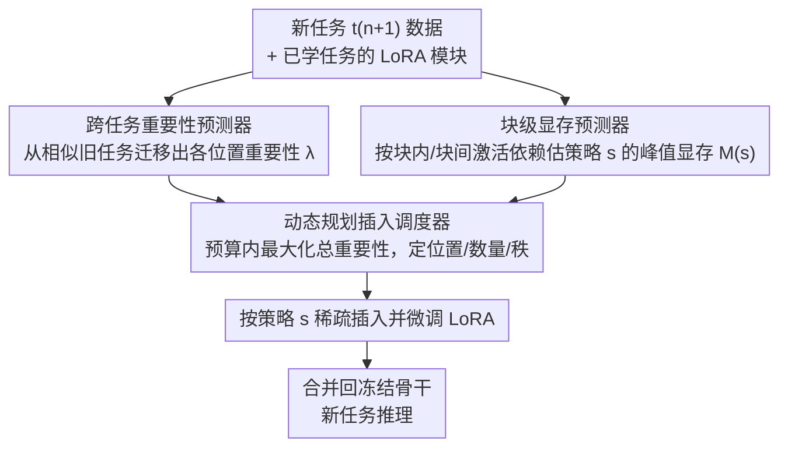

# TaskIT: Memory-Efficient Fine-Tuning of Multi-LoRA LLMs via Cross-Task Importance Transfer

**会议**: CVPR 2026  
**论文**: [CVF Open Access](https://openaccess.thecvf.com/content/CVPR2026/html/Fang_TaskIT_Memory-Efficient_Fine-Tuning_of_Multi-LoRA_LLMs_via_Cross-Task_Importance_Transfer_CVPR_2026_paper.html)  
**代码**: https://github.com/haojuns/TaskIT  
**领域**: 模型压缩 / LLM效率  
**关键词**: 多LoRA、稀疏微调、端侧部署、跨任务迁移、显存预算

## 一句话总结
TaskIT 在显存受限的端侧设备上为多 LoRA 大模型适配新任务：它先用「跨任务迁移」在不训练任何新模块的前提下预测每个候选 LoRA 位置的重要性，再用「块级显存预测器」准确估出 Transformer 上的激活显存，最后用动态规划调度器在显存预算内挑选 LoRA 的位置、数量和秩，从而拿到比 Zero-FT / non-LoRA / 现有 LoRA 微调更好的精度-显存折中。

## 研究背景与动机
**领域现状**：端侧 AI 越来越多采用「一个冻结的基座模型 + 一堆任务专属 LoRA 模块」的范式（multi-LoRA LLM）：基座只部署一次，每个下游任务靠挂在骨干上的 LoRA 来定制，推理时把 LoRA 合并回骨干，所有任务共享同一份重计算，只在 LoRA 状态上有差异。Apple 的端侧基座模型、把基座当「固件」让 app 用模块扩展的设想都属于这一路线。

**现有痛点**：LoRA 虽然把可训练参数压得很小，但**微调时仍然很吃显存**——它还要存 LoRA 参数、激活、梯度和优化器状态。论文给的数据很扎眼：相比 ViT-g 全量微调，LoRA 只更新 1.8% 的参数，峰值显存却仍占到 56%。冻结骨干能省掉骨干的梯度和优化器显存，但几乎压不下激活显存。于是「给每个新任务训练一整套 LoRA」很容易把端侧显存吃爆，限制了能支持的任务数。

**核心矛盾**：自然的省显存做法是**稀疏插入** LoRA——只在关键位置插入并训练一小撮模块。但这撞上两个绕不过去的难题：(1) **重要性要在插入前就知道**——现有重要性估计（基于参数 / 梯度）都假设候选参数已经存在并训练过，可你不可能为了量重要性先把整套 LoRA 训一遍，否则稀疏插入就失去意义；(2) **Transformer 上的显存难建模**——已有显存模型假设显存随层号线性增长，这对顺序网络成立，却被 Transformer 注意力块里 Q/K/V 等多分支并行投影破坏了线性关系。

**本文目标**：在显存预算 $M_B$ 下，为一个全新（未见）任务 $t_{n+1}$ 选择性地插入并微调 LoRA 模块，使精度最大化。形式化为带约束的背包式优化 $\max_s s\cdot\lambda_{n+1}\ \text{s.t.}\ M(s)\le M_B$，其中 $s$ 是插入策略（每个位置上 LoRA 的秩，0 表示不插），$\lambda_{n+1}$ 是各位置对新任务精度的重要性向量。

**切入角度**：作者观察到一个关键现象（论文 Fig.1）——**相关任务在骨干上诱导出相似的 LoRA 重要性分布**。既然已学过的任务已经有训练好的 LoRA，那么新任务的重要性可以从「相似的旧任务」迁移过来，而无需先训练新模块。

**核心 idea**：把「插入前的重要性预测」转化为**跨任务迁移**问题（这是 TaskIT 名字里 Cross-Task Importance Transfer 的来源），再配一个为 Transformer 量身定制的块级显存预测器和一个动态规划调度器，三者串成一条在显存预算内最大化精度的稀疏插入流水线。

## 方法详解

### 整体框架
TaskIT 要解决的是「给定一个新任务和一个显存预算，决定在冻结骨干的哪些位置、插几个、各用多大秩的 LoRA」。它把这个决策拆成三个串行组件：先对每个候选插入位置算出**重要性**（不训练新模块，靠从相似旧任务迁移），再对任意一个插入策略算出**峰值显存**（块级建模 Transformer 激活依赖），最后把重要性和显存喂给一个**动态规划调度器**搜出预算内的近优策略；选中的模块被插入、微调，再合并回冻结骨干用于该任务推理。

### 关键设计

**1. 跨任务重要性迁移：不训练新模块也能预测每个位置的重要性**

最棘手的痛点是「重要性要在插入前知道」。TaskIT 把新任务位置 $k$ 的重要性写成已学 $n$ 个任务在同一位置重要性的相似度加权和：$\lambda^k_{n+1}=\sum_{i=1}^{n}\phi(t_{n+1},t_i)\cdot\lambda^k_i$，越像新任务的旧任务贡献越大。这要求两件事都能在端侧低成本完成。

其一是**量已学任务的模块重要性** $\lambda^k_i$。作者用一个为 LoRA 量身定制、只需前向的激活比值：$\lambda^k_i=\dfrac{\lVert x(w^k_i;d)\rVert_1}{\lVert x(W^k;d)\rVert_1+\epsilon}$，分子是 LoRA 模块 $w^k_i$ 的输出激活、分母是冻结矩阵 $W^k$ 的输出激活（都在新任务数据 $d$ 上、用 L1 范数，$\epsilon=10^{-8}$ 防数值问题）。用「相对贡献」而非绝对激活，是因为 LoRA 输出会和主矩阵输出相加，模块重要与否取决于它在合并激活里占的比重；而且只需前向，比基于梯度/代理的方法省显存。

其二是**测新旧任务相似度** $\phi(t_{n+1},t_i)$。理想做法是比较 $x(\theta+w_i;d)$ 与 $x(\theta+w_{n+1};d)$ 的余弦相似度，但新任务的 $w_{n+1}$ 还没训练。TaskIT 的巧招是在**激活空间里反推一步优化**来近似 $x(\theta+w_{n+1};d)$：先用冻结骨干前向得 $x(\theta;d)$，喂进解码器算新任务损失 $L$，只反传到激活得 $\nabla_{x(\theta;d)}L$，再走一小步下降 $x^*(\theta+w_{n+1};d)=x(\theta;d)-\eta\,\nabla_{x(\theta;d)}L$。每个 batch 只需一次前向加一次轻量反向，就能在微调前估出任务相关性；经验上只保留相似度高于 0.35 的任务以保证正迁移。

**2. 块级显存预测器：把 Transformer 的激活依赖算准**

第二个痛点是「Transformer 上显存难建模」。峰值显存出现在前向结束时，分解为 $M(s)=M_{con}+M_w(s)+M_x(s)$：$M_{con}$ 是冻结骨干和运行时开销（离线测、与 $s$ 无关），$M_w(s)$ 是插入 LoRA 的参数/梯度/优化器显存（随参数量直接估），难点是反传期间缓存的**激活显存** $M_x(s)=g_x(s)^\top m_x$，其中 $m_x$ 是每个激活的显存占用、$g_x(s)\in\{0,1\}^{|X|}$ 指示哪些激活必须为反传保留。

求 $g_x(s)$ 要做块级依赖分析，分两层：**块内依赖**——注意力块里 Q、K、V 是并行分支、在注意力算子里交互，于是在 $W_q$ 插模块要计算 $\nabla_{w_q}L$ 时，梯度会经 FFN、$W_o$、注意力算子一路回流，沿途需要缓存 K、V 和输入激活 $x_{in}$；作者对块内全部六类插入位置（$W_q,W_k,W_v,W_o,W^1_{FFN},W^2_{FFN}$）都推导了各自的缓存掩码。**块间依赖**——要把梯度从损失回传到第 $r$ 块的模块，必须保留第 $r+1$ 块直到解码器这一路上的激活（下游各块的 Q/K/V 和注意力权重），而前面 $1{\sim}r-1$ 块的激活前向后即可丢弃。把各位置掩码按位或起来 $g_x(s)=\bigvee_{k:s_k=1}g_x(k)$，加上一次性离线 profile 的 $\{g_x(k)\}$ 与 $m_x$，显存预测就只剩廉价的或运算和点积，足够快地喂给 DP 调度器反复评估。

**3. 动态规划插入调度器：在显存预算内把重要性榨满**

有了重要性和显存预测，最后要在预算 $M_B$ 内挑出最优策略 $s$。每个位置的秩取自 $R=\{0,2^0,\dots,2^6\}$（秩上限 64，更高收益递减）。这是个背包变种，但难点在于：在位置 $k$ 插入的增量显存 $\Delta M$ 取决于**前一个已插入位置** $k_s$（因为激活的反传路径），破坏了背包「物品独立」的假设。TaskIT 因此把「上一个插入位置」显式编进 DP 状态：令 $P[k][M_b]$ 为「最右插入位置在 $k$、总显存 $\le M_b$」时的最大累计重要性，转移为

$$P[k][M_b]=\max_{r\in R,\,r>0,\;0\le k_s<k}\big(P[k_s][M_b-\Delta M]+h(r)\,\lambda^k_{n+1}\big)$$

其中 $h(r)=\sqrt{\ln(r)+1}/\sqrt{\ln(\max(R)+1)}$ 是对秩贡献的归一化，$\Delta M=M(s_k)-M(s_{k_s})$ 是在 $k$ 插一个秩 $r$ 模块、给定前驱 $k_s$ 的额外显存。预算离散成 $U=500$ 个桶平衡精度与开销；填完表后取 $\max_{0\le k\le|K|}P[k][M_B]$ 并回溯得到最终插入策略。相比贪心，DP 能更充分地利用显存预算、把总重要性搜到更高。

### 损失函数 / 训练策略
TaskIT 本身不引入新的训练损失——选中的稀疏 LoRA 子集按常规任务损失微调，骨干全程冻结。所有「省显存」来自插入策略本身：在 8 GB 预算（贴近主流手机）下用 DP 选位置/数量/秩。实验骨干为 1.5B 的视觉语言模型 Janus-Pro，并扩展 Whisper-tiny / Kokoro-82M 支持音频模态；采用 warm-start 协议（基座已在若干基任务上有 LoRA，再适配新任务）。

## 实验关键数据

### 主实验
跨模态设置：基座已带 5 个基任务的 LoRA（图像分类、问答、图像描述、文生图、VQA），在 8 GB 显存预算下适配图像 / NLP / VL 新任务。TaskIT 在精度-显存折中上全面占优。

| 对比基线（各组最优） | 相对 TaskIT 的差距 | 说明 |
|--------|------|------|
| AdapterFusion（Zero-FT 最优） | 平均精度 **−10.4%** | 不训参数靠组合旧模块，新任务弱相关时失灵，且算组合权重仍要 10.6 GB |
| UniPT（non-LoRA 最优） | 精度 **−1.5%**、显存 **+13.8%** | 均匀分配显存、无重要性建模，需 9.4× 大的子网才接近 TaskIT |
| AutoLoRA（LoRA 最优） | 精度仅 **+0.3%**，但 TaskIT 省 **45.5%** 显存 | AutoLoRA 靠双层优化的元学习器估重要性，显存开销大 |

TaskIT 自身：可学参数 16.8M，图像任务平均精度 80.4%、显存仅 **7.8 GB**（卡在 8 GB 预算内）；NLP 平均 90.1% / 7.9 GB；VL 平均 83.6% / 7.8 GB。对照 AutoLoRA 图像 80.7% 却要 14.3 GB——精度几乎打平、显存近乎减半。

### 消融实验
| 配置 | 可学参数(M) | 显存(GB) | 精度(%) | 说明 |
|------|------|------|---------|------|
| w/o S（去任务相似度，改均匀） | 16.8 | 7.6 | 75.3 | 精度掉 5.1%，证明相似度估计必要 |
| w/o I（去整个重要性预测器，改均匀重要性） | 16.8 | 7.6 | 74.1 | 精度掉 6.3%，掉点最多 |
| w/o M（去块级显存预测器，改均匀显存模型） | 17.4 | **9.9** | 80.6 | 精度没掉但**显存冲到 9.9 GB 超预算**，说明块级 profiler 是守住预算的关键 |
| w/o DP（DP 调度器换贪心） | 9.1 | 7.9 | 77.5 | 贪心欠用显存，少学 7.7M 参数、精度掉到 77.5% |
| **TaskIT（完整）** | 16.8 | 7.8 | **80.4** | — |

### 关键发现
- **重要性预测器（I）贡献最大**：去掉后精度掉 6.3%，超过去任务相似度（S，掉 5.1%）；说明「插入前预测哪里该插」是整套方法的精度来源。
- **显存预测器（M）管的是「合规」而非「精度」**：去掉它精度反而略升到 80.6%，但峰值显存冲到 9.9 GB 直接超出 8 GB 预算——它的价值在于把策略约束在预算内。
- **持续学习里迁移会自适应**：连续学 t5–t12 时，新学的任务很快成为迁移源（学完 t9 音频描述后，t12 文生音频 70%+ 的迁移重要性来自 t9）；当没有相似度 ≥0.35 的任务时（如首次出现的音频模态 t9），TaskIT 退化为均匀重要性、靠显存预测器和 DP 守预算。

## 亮点与洞察
- **「在激活空间反推一步优化」近似未训练任务的激活**：用 $x(\theta;d)-\eta\nabla_{x(\theta;d)}L$ 估出 $x(\theta+w_{n+1};d)$，巧妙绕开「相似度需要新任务 LoRA、而 LoRA 还没训」的鸡生蛋问题，每 batch 只多一次轻量反向。
- **把「前一个插入位置」编进 DP 状态**，正面回应了 Transformer 上插入显存非独立的问题，比贪心更能榨满预算——这是把背包套到神经网络稀疏插入上时最容易被忽视的耦合。
- **重要性用「相对激活比值」而非绝对激活**，契合 LoRA「输出与主矩阵相加」的结构，是一个能迁移到其他 adapter-style 模块重要性度量的小而准的设计。

## 局限与展望
- **依赖已有相似任务**：当新任务与所有旧任务相似度都低于 0.35（如全新模态首次出现），迁移退化为均匀重要性，精度增益随之消失——冷启动场景仍是软肋。
- **预算收紧时增益收窄**：持续学习里 $M_B$ 从 12 GB 降到 8 GB，TaskIT 相对 vanilla LoRA 的平均增益逐步缩小，说明在极紧显存下方法红利有限。
- **重要性/显存均为离线一次性 profile**：块级掩码 $\{g_x(k)\}$ 与 $m_x$ 假设可离线测准，骨干结构或序列长度大改时需重新 profile；秩集合与 $h(r)$ 归一化、阈值 0.35、$U=500$ 等都是经验设定（⚠️ 具体取值以原文与附录为准）。

## 相关工作与启发
- **vs 稀疏更新（如基于一阶/二阶损失的重要性估计）**：它们都假设被评估参数已存在、已训练；TaskIT 针对的是「模块尚未插入」的新设定，用跨任务迁移补上了「插入前预测」这一空白。
- **vs 秩自适应 LoRA（AdaLoRA / AutoLoRA / NOAH）**：这些方法逐层调秩、把高秩给重要模块，但峰值显存仍高（AutoLoRA 靠双层优化、显存大）；TaskIT 联合优化秩、数量、位置，并显式守显存预算，拿到近似精度但显存近乎减半。
- **vs 显存建模（位置线性近似）**：已有方法假设激活显存随层深线性下降，对 Transformer 多分支注意力失效；TaskIT 的块级建模区分块内并行依赖与块间顺序依赖，预测更准。

## 评分
- 新颖性: ⭐⭐⭐⭐⭐ 「插入前用跨任务迁移预测重要性」是对稀疏更新设定的实质性推进，反推激活和块级显存建模都很巧
- 实验充分度: ⭐⭐⭐⭐ 跨模态/单模态/消融/持续学习都覆盖了，但多为内部对比、缺更大规模骨干的验证
- 写作质量: ⭐⭐⭐⭐ 问题拆解清晰、三组件分工明确；部分符号与附录依赖较重
- 价值: ⭐⭐⭐⭐⭐ 直击端侧多 LoRA 部署的显存瓶颈，精度持平 SOTA 而显存近乎减半，落地价值高

<!-- RELATED:START -->

## 相关论文

- [\[CVPR 2026\] LoPrune: Efficient Data Pruning for LoRA-Based Fine-Tuning of Vision Transformer](loprune_efficient_data_pruning_for_lora-based_fine-tuning_of_vision_transformer.md)
- [\[CVPR 2026\] Discovering Adaptive Task Dependencies for Efficient Multi-Task Representation Compression](discovering_adaptive_task_dependencies_for_efficient_multi-task_representation_c.md)
- [\[CVPR 2026\] Memory-Efficient Transfer Learning with Fading Side Networks via Masked Dual Path Distillation](memory_efficient_transfer_learning_with_fading_side_networks.md)
- [\[NeurIPS 2025\] EMLoC: Emulator-based Memory-efficient Fine-tuning with LoRA Correction](../../NeurIPS2025/model_compression/emloc_emulator-based_memory-efficient_fine-tuning_with_lora_correction.md)
- [\[CVPR 2026\] Frequency Switching Mechanism for Parameter-Efficient Multi-Task Learning](frequency_switching_mechanism_for_parameter-ecient_multi-task_learning.md)

<!-- RELATED:END -->
