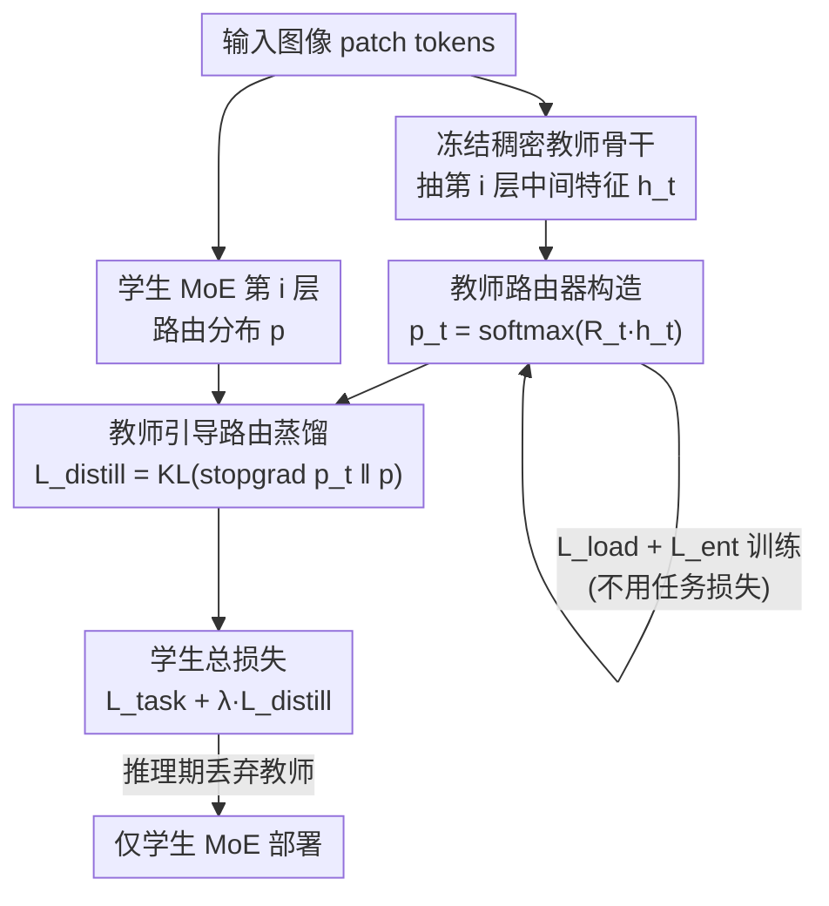

# Teacher-Guided Routing for Sparse Vision Mixture-of-Experts

**会议**: CVPR 2026  
**论文**: [CVF Open Access](https://openaccess.thecvf.com/content/CVPR2026/html/Kada_Teacher-Guided_Routing_for_Sparse_Vision_Mixture-of-Experts_CVPR_2026_paper.html)  
**代码**: 无  
**领域**: 模型压缩 / 稀疏混合专家  
**关键词**: 稀疏MoE, 路由稳定性, 知识蒸馏, 视觉Transformer, 教师引导

## 一句话总结
用一个冻结稠密教师模型搭出的"教师路由器"产生稳定的专家分配分布，再用 KL 蒸馏去监督稀疏 MoE 学生的路由器，从训练早期就缓解了稀疏 MoE 路由器"只有被选中专家才有梯度"导致的路由抖动问题，在 ImageNet-1K / CIFAR-100 上稳定提点且推理零额外开销。

## 研究背景与动机
**领域现状**：稀疏混合专家（Sparse MoE）是当下扩容不增推理成本的主流手段——每个 token 只激活 top-K 个专家，模型容量可以放大而计算量几乎不变。它先在大语言模型里走红，近两年被搬到视觉里（VMoE 把每个 patch token 并行喂进 MoE 层）。

**现有痛点**：稀疏 MoE 出了名地难稳定训练。问题根源是**梯度阻断（gradient blocking）**：前向只有被选中的少数专家参与计算，反向时路由器也只能从这几条被选路径拿到有信息的梯度，对那些没被选中的专家近乎一无所知。这种**局部、稀疏**的反馈让路由器很难学到合理的专家打分，尤其在专家还没分化的训练早期。

**核心矛盾**：反馈太稀疏直接引发**路由抖动（routing fluctuation）**——同一个固定输入在训练过程中被分配到的专家频繁变来变去。这会让同一样本在不同迭代里更新到不同专家，专家迟迟无法专精，部分专家甚至长期欠训练。常用的负载均衡损失（load-balancing loss）只管"专家用得均不均"，并不能压住这种时间维度上的不一致，有时反而加剧专家切换。而 StableMoE / HashMoE 这类方法靠**冻结或解耦路由**来求稳，又牺牲了路由随表示演化自适应调整的能力。

**本文目标**：在**不冻结目标路由器**的前提下，给路由器补一个超越稀疏激活路径之外的全局先验，让它从早期就拿到密集、有信息的监督。

**切入角度**：一个预训练好的**稠密教师模型**（非 MoE，所有参数每步都更新）拥有语义结构良好的中间特征空间——这正是路由器缺的那种"全局、稳定、跨所有专家"的信号。

**核心 idea**：用教师中间特征构造一个辅助"教师路由器"，让它产出**均衡又自信**的稳定路由分布，再把这个分布**KL 蒸馏**给学生路由器，相当于给学生路由器的 softmax 输出注入一个先验，绕开梯度阻断，且教师在推理时完全不参与、零额外开销。

## 方法详解

### 整体框架
TGR-MoE 不去改任务目标，而是在**冻结的稠密教师骨干**上挂一个轻量的辅助教师路由器。训练时学生 MoE 正常前向得到各 MoE 层的路由分布 $p^{(i)}$；同时抽取教师对应层的中间特征 $h_t^{(i)}$，送进教师路由器算出教师路由分布 $p_t^{(i)}$。教师路由器只用负载均衡损失 + 熵损失训练（不碰任务损失），快速收敛到"均衡且自信"的稳定分布；学生路由器则通过 KL 散度去模仿这个分布，叠加在标准任务损失之上。整套流程教师路由器和学生 MoE **联合训练**，但教师骨干冻结、只优化轻量教师路由器，所以教师侧很快稳定下来。

注意教师路由器**只负责产监督信号**，并不真的去做 MoE 路由；推理时只剩学生，教师及其路由器整体丢弃，因此测试期零额外成本。

### 关键设计

**1. 教师路由器构造：从冻结稠密教师的中间特征造一个"会路由"的旁路**

针对"学生路由器缺全局先验"这一痛点，TGR-MoE 在预训练稠密教师（本文用 ImageNet-21K 预训练的 DeiT-III）的骨干上额外接一个教师路由器 $R_t(\cdot)$。它取教师第 $i$ 层中间表示 $h_t$，输出专家分配概率 $p_t = \mathrm{softmax}(R_t(h_t)) \in \mathbb{R}^{N\times E}$。关键点在于**用哪一层特征**：作者实验发现，若取教师**最后一层**特征来产路由信号，精度反而暴跌到 75.83%（比 VMoE 基线还低），因为高层表示太抽象、太任务特化，不适合当路由线索；而**层对齐的中间特征**与学生结构匹配更好，提供的监督更有效。教师骨干全程冻结、只训这个轻量路由器，所以它收敛快又稳。

**2. 教师路由器优化：用负载均衡损失 + 熵损失逼出"均衡又自信"的目标分布**

教师路由器要当好"标尺"，分布既不能塌缩到少数专家、也不能糊成均匀分布。本文把原本用来正则化目标路由器的两个损失搬过来专门训教师路由器：负载均衡损失 $L_{\text{load}}$ 最小化各专家重要度的变异系数（$L_{\text{load}}(p)=\big(\mathrm{std}(\mathrm{Imp}(p))/\mathrm{mean}(\mathrm{Imp}(p))\big)^2 \propto \mathrm{var}(\mathrm{Imp}(p))$，其中 $\mathrm{Imp}_e(p)=\frac1N\sum_i p_{i,e}$）鼓励专家被均匀使用；熵损失 $L_{\text{ent}}(p)=-\frac1N\sum_i\sum_e p_{i,e}\log p_{i,e}$ 防止分布塌成过度均匀、鼓励**自信且区分度高**的专家分配。教师路由器目标为

$$L_{\text{teacher}}=\sum_{i\in S_{\text{MoE}}}\Big(\lambda_{\text{load}}L_{\text{load}}(p_t^{(i)})+\lambda_{\text{ent}}L_{\text{ent}}(p_t^{(i)})\Big).$$

注意这里**不优化下游任务损失**——它的目标不是分类准，而是借教师语义结构良好的特征空间，构造出"均衡 + 自信"这两种理想路由行为，给学生一个可模仿的稳定先验。

**3. 教师引导路由蒸馏：KL + stop-gradient 把稳定分布注入学生路由器**

学生路由器 $R_{\text{student}}$ 通过模仿教师分布来学习。蒸馏损失定义为 $L_{\text{distill}}(p,p_t)=\mathrm{KL}(\mathrm{stopgrad}(p_t)\,\|\,p)$，`stopgrad` 把教师输出从计算图里摘掉、阻止梯度回流进教师。学生总目标把它和任务损失加在一起：

$$L_{\text{student}}=L_{\text{task}}+\frac{\lambda_{\text{distill}}}{|S_{\text{MoE}}|}\sum_{i\in S_{\text{MoE}}}L_{\text{distill}}(p^{(i)},p_t^{(i)}).$$

这一项的妙处在于：它直接作用在路由器 softmax 输出上，给那些**没被选中、本来拿不到梯度**的专家也补上了有信息的监督，从而绕开梯度阻断，又**不需要冻结**目标路由器——学生路由器仍能随表示演化自适应调整，只是被教师先验"拉住"不乱抖。作者还观察到：预先训好并冻结教师路由器，和联合训练得到的最终精度几乎一样，于是为简单高效，所有实验都用联合训练。

> ⚠️ 关于蒸馏的时机，作者在分析里发现一个反直觉结论：**只在训练前半段做蒸馏、后半段切回任务优化**效果最好（见消融表 5）。这说明教师引导信号在路由不稳的早期最有价值，等专家分化稳定后，任务梯度反而更管用。

### 损失函数 / 训练策略
- 教师侧：$L_{\text{teacher}}=\lambda_{\text{load}}L_{\text{load}}+\lambda_{\text{ent}}L_{\text{ent}}$（不含任务损失）。
- 学生侧：$L_{\text{student}}=L_{\text{task}}+\lambda_{\text{distill}}\cdot L_{\text{distill}}$。
- 系数：$\lambda_{\text{load}}=0.005,\ \lambda_{\text{ent}}=0.005,\ \lambda_{\text{distill}}=5.0$。
- 骨干用 DeiT，12 层里把第 8/10/12 层换成 MoE 层；教师 DeiT-III 无蒸馏 token，故取教师 CLS token 的路由输出当蒸馏目标。优化器 AdamW + cosine 调度，RandAugment / Mixup / CutMix 增强，学生全部从头训。

## 实验关键数据

### 主实验
ImageNet-1K 预训练 + 下游迁移，Top-1 精度（%），K=1 设置（VMoE / TGR-MoE 报 K=1/K=2）：

| 规模 | 模型 | ImageNet-1K | CIFAR-100 | Pets |
|------|------|-------------|-----------|------|
| Tiny | ViT (dense) | 74.62 | 85.43 | 89.86 |
| Tiny | VMoE | 77.85 | 86.20 | 89.82 |
| Tiny | SoftMoE | 79.31 | 86.80 | 91.91 |
| Tiny | **TGR-MoE** | **78.78** | **87.03** | 91.78 |
| Small | VMoE | 82.63 | 88.68 | 93.31 |
| Small | **TGR-MoE** | **83.34** | **90.26** | 93.79 |
| Base | VMoE | 83.97 | 89.04 | 93.79 |
| Base | **TGR-MoE** | **85.46** | **91.07** | 94.63 |

TGR-MoE 在三个规模上全面超过 ViT 和 VMoE，与/优于 Expert Choice MoE、SoftMoE、z-loss 等先进变体；Base 规模对 VMoE 的 ImageNet 增益达 +1.49%。

### 消融实验
专家数扩展（Tiny，ImageNet-1K，Top-1 %）——TGR-MoE 在高稀疏度下优势更明显：

| 专家数 E | 4 | 8 | 16 | 32 | 64 | 128 |
|---------|------|------|------|------|------|------|
| VMoE | 76.18 | 77.39 | 77.85 | 78.41 | 78.74 | 79.38 |
| TGR-MoE | 76.59 | 77.81 | 78.78 | 79.35 | 79.95 | 80.36 |
| 增益 | +0.41 | +0.42 | +1.07 | +0.94 | +1.21 | +0.98 |

蒸馏时机与上界分析（Tiny, 8 experts, ImageNet-1K）：

| 配置 | 精度(%) | 说明 |
|------|---------|------|
| VMoE 基线 | 77.39 | 无教师引导 |
| 仅蒸馏（全程） | 77.83 | 任务监督竟非必需 |
| 蒸馏（前半段）+ 任务 | **78.13** | 早期强引导最优 |
| 蒸馏 + 任务（全程） | 77.81 | 标准 TGR-MoE |
| 学生路由推理（纯模仿） | 74.84 | 学生容量不足，掉点 |
| 教师路由推理（上界 oracle） | 80.19 | 教师直接路由的理论上界 |

### 关键发现
- **路由一致性显著提升**：VMoE 训到中点仍有约 40% 输入的专家分配会改变；TGR-MoE 在前 50 epoch 内就突破 70% 与最终分配的一致率，相邻 epoch 一致率稳定在约 0.8，而 VMoE 早期频繁掉到 0.5–0.6。
- **迁移更稳**：CIFAR-100 微调前后路由一致率，VMoE 只剩 50.56%，TGR-MoE 保持 73.75%，说明教师引导更好地保留了预训练路由结构；且**微调阶段继续用 TGR-MoE**（而非仅作初始化）才能拿到最高精度（Tiny/Small/Base 各 86.95/90.26/91.07%）。
- **教师层选择敏感**：用教师最后一层特征产路由会掉到 75.83%（低于基线），必须用层对齐的中间特征。
- **任务监督非必需**：仅靠蒸馏（77.83%）已能稳定路由，印证教师分布本身就是足够强的监督。

## 亮点与洞察
- 把"路由稳定"问题重新定义为"缺一个全局先验"，再用一个**冻结教师 + 轻量旁路路由器**优雅供给——既不像 StableMoE 那样冻结路由牺牲自适应，又零推理开销，是很可复用的思路。
- 教师路由器只用 load + entropy 损失、**刻意不学任务**，反而成了更纯净的"路由标尺"，这种"解耦监督源"的设计很巧。
- "蒸馏只在前半段最好"的相位依赖现象很有启发：早期路由乱时强引导、稳定后放手让任务梯度接管，可迁移到其他需要 warm-up 式监督的训练场景。
- 上界分析（教师直接路由 80.19% vs 学生 77.81%）诚实地标出了学生路由器的容量天花板，给后续"如何更好模仿教师路由"留了明确空间。

## 局限与展望
- 需要一个同架构家族的强稠密教师（DeiT-III/ImageNet-21K），无现成强教师时方法收益与可行性存疑 ⚠️。
- 上界与学生之间仍有约 2.4% 差距，说明学生路由器受限于表示容量、逐层近似误差，没法完全复现教师路由。
- 实验集中在 DeiT 系视觉分类 + 部分小数据集迁移；在生成、检测等其它视觉任务及更大规模上的表现未验证。
- 蒸馏相位（前半段/全程）目前靠经验切换，缺乏自适应判据。

## 相关工作与启发
- **vs StableMoE / HashMoE**：它们靠冻结或固定路由换稳定，会限制路由随表示演化的自适应；TGR-MoE 不冻结目标路由器，而是用外部稳定先验"引导"它，兼顾稳定与自适应。
- **vs Read-ME / Dynamic Expert Specialization**：同样把信息蒸馏进路由器，但目标是模型转换或域适应中"保持已有路由行为"；TGR-MoE 是为了在**预训练阶段**直接解决离散路由带来的不稳定。
- **vs Soft-MoE / DSelect-k 等连续松弛路由**：它们改路由函数本身去平滑梯度；TGR-MoE 保持标准 top-K 离散路由，只额外注入教师先验，正交且可叠加。

## 评分
- 新颖性: ⭐⭐⭐⭐ 用稠密教师中间特征造路由先验来稳定稀疏 MoE 训练，角度新且与现有连续松弛/冻结路由正交
- 实验充分度: ⭐⭐⭐⭐ 三规模 + 多基线 + 专家数扫描 + 路由一致性/上界/相位分析较完整，但局限于 DeiT 分类
- 写作质量: ⭐⭐⭐⭐ 动机与公式清晰，图 1/2 把梯度阻断讲得直观
- 价值: ⭐⭐⭐⭐ 推理零开销、即插即用地提升稀疏 MoE 稳定性与精度，实用性强

<!-- RELATED:START -->

## 相关论文

- [\[CVPR 2026\] Masking Teacher and Reinforcing Student for Distilling Vision-Language Models](masking_teacher_and_reinforcing_student_for_distilling_vision-language_models.md)
- [\[CVPR 2026\] TAS-LoRA: Transformer Architecture Search with Mixture-of-LoRA Experts](tas-lora_transformer_architecture_search_with_mixture-of-lora_experts.md)
- [\[CVPR 2026\] Quant Experts: Token-aware Adaptive Error Reconstruction with Mixture of Experts for Large Vision-Language Models Quantization](quant_experts_token_aware_vlm_quantization.md)
- [\[ICLR 2026\] LD-MoLE: Learnable Dynamic Routing for Mixture of LoRA Experts](../../ICLR2026/model_compression/ld-mole_learnable_dynamic_routing_for_mixture_of_lora_experts.md)
- [\[ICML 2026\] Parameters as Experts: Adapting Vision Models with Dynamic Parameter Routing](../../ICML2026/model_compression/parameters_as_experts_adapting_vision_models_with_dynamic_parameter_routing.md)

<!-- RELATED:END -->
