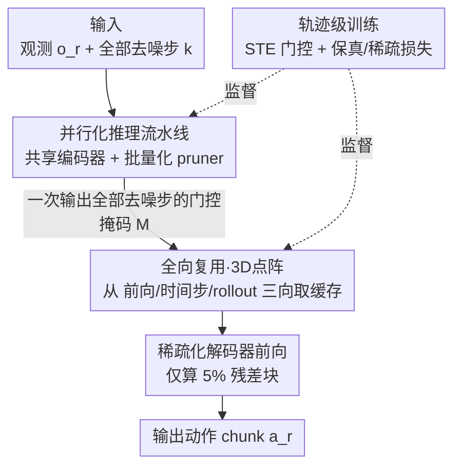

# Test-time Sparsity for Extreme Fast Action Diffusion

**会议**: CVPR 2026  
**论文**: [CVF Open Access](https://openaccess.thecvf.com/content/CVPR2026/html/Ji_Test-time_Sparsity_for_Extreme_Fast_Action_Diffusion_CVPR_2026_paper.html)  
**代码**: https://github.com/ky-ji/Test-time-Sparsity  
**领域**: 模型压缩 / 扩散加速 / 机器人动作策略  
**关键词**: 动作扩散, 测试时稀疏, 特征复用, 推理加速, VLA

## 一句话总结
本文提出"测试时稀疏（test-time sparsity）"，用一个共享编码器的轻量 pruner 在每次前向时动态预测可剪掉的残差块，再配上把历史特征组织成 3D 点阵的"全向复用"策略，在机器人动作扩散上做到 95% 稀疏、92% FLOPs 削减、5× 实际加速，把推理频率从 6Hz 拉到 47.5Hz 且成功率不掉。

## 研究背景与动机

**领域现状**：动作扩散（action diffusion，如 Diffusion Policy、3D Diffusion Policy 以及 RDT-1B 这类 VLA 模型）靠迭代去噪能很好地建模多模态动作分布，已经成为视觉运动策略和灵巧操作的主力动作生成模块。

**现有痛点**：迭代去噪天生慢。Diffusion Policy 在消费级 GPU 上只有约 6Hz、3D Diffusion Policy 约 5Hz，而很多真实任务要求 30Hz 以上，差了一个数量级。已有的加速思路——复用上一轮 rollout 的部分去噪结果（Falcon、Streaming Policy），或复用上一去噪步的中间特征（EfficientVLA、BAC）——都依赖**静态、预定义的复用时间表**。

**核心矛盾**：开放环境里策略是动态的——感知在变、多轮交互在变，每次前向该剪哪些计算的"稀疏模式"也跟着变。静态时间表与这种动态本质天然错配：固定间隔复用要么剪太狠掉点（EfficientVLA 在 Kitchen 上只剩 3% 成功率），要么剪太保守加速有限。

**切入角度**：作者主张把剪枝决策放到**测试时（test-time）动态做**——每次模型前向之前，由一个参数化 pruner 根据当前观测 $o_r$ 和去噪步 $k$ 预测一个二值剪枝掩码 $M\in\{0,1\}^{3L}$（$L$ 层、每层 SA/CA/FFN 三个残差块），跳过的残差用缓存特征补偿（prune-then-reuse）。

**核心 idea**：测试时动态剪枝看着美好，却卡在两个瓶颈上：① 把 pruner 塞进自回归去噪循环后，重复的条件编码 + 剪枝本身的开销（pruner 单独要 182ms，甚至超过 95% 稀疏后 95ms 的解码时间）把省下的算力又吃回去了；② 只从"上一去噪步"这一个方向取缓存特征，在 95% 这种激进稀疏下不足以约束巨大的剪枝误差。本文用"并行化推理流水线"治第一个瓶颈、用"全向复用"治第二个瓶颈。

## 方法详解

### 整体框架
方法围绕一个动作扩散 Transformer（条件编码器 + 带 SA/CA/FFN 残差块的解码器）展开，目标是在不改动主干、不重训扩散模型的前提下，让每次去噪前向只算一小部分残差块、其余全部用历史缓存替代。整条链路分三块：一个**并行化推理流水线**把"编码 + 剪枝"从去噪循环里解耦出来、一次性算完所有去噪步，把非解码开销压到毫秒级；一个**全向复用 + 3D 点阵**策略让被剪掉的残差从"当前前向 / 上一去噪步 / 上一 rollout"三个方向择优取缓存补偿；最后用**轨迹级训练**把"该不该算、该复用哪个方向"这套门控学出来。

### 关键设计

**1. 并行化推理流水线：把 pruner 自身的开销从 182ms 压到 0.45ms**

测试时剪枝的最大反直觉之处是：剪枝省下了解码（705ms→95ms），但 pruner 自己在自回归去噪循环里反复跑，单独要 182ms，反而成了新瓶颈。作者从三处下手把它拆掉。其一，**让 pruner 与扩散 Transformer 共享条件编码器**——pruner 实例化成一个轻量 Transformer 解码块，直接复用主干编码出来的高层条件嵌入，省掉约 40ms 的独立编码。其二，**把编码与剪枝从去噪循环里解耦、一次算完所有去噪步**。朴素地"一次性编码所有步"会掉精度（单步编码准、全步编码省，二者存在 trade-off），作者的解法不是改算法而是改算子形态：pruner 本来只处理单个时间步 $k$，把它重写成一次大批量操作——先并行算出全部 $K$ 个去噪步的正弦位置嵌入，再把时间维 $K$ 折叠进 batch 维 $N$，凑成有效 batch $N\times K$ 一次前向出全部掩码，把 $K$ 步串行循环变成一次全批操作。其三，**异步流水线**：给条件编码器和 pruner 各配一个 buffer 存好一次性算出的条件嵌入和掩码，之后进入"纯解码器循环"直接取用；并观察到 pruner 几乎在所有早期步都能跳光冗余计算（只有第一步必须满算来初始化缓存），于是开两个并行线程让 pruner 与解码器首步重叠，把剪枝开销藏到只剩 0.45ms。

**2. 全向复用 + 3D 点阵建模：用三个方向的缓存把 95% 稀疏的剪枝误差压住**

只复用"上一去噪步"的单方向缓存，在高稀疏下精度崩。作者的关键观察是：不同 rollout 迭代之间的特征高度相似（图 6），且把一个特征锚定后，来自不同方向的缓存特征都与它对齐、还各有互补优势（不同的逼近角度、更短的潜在距离，图 7）。问题在于历史特征量极大（Diffusion Policy 一次推理就有 50k–200k 个），怎么组织、怎么选。作者把历史特征空间建成一个 **3D 点阵**，由三个正交索引定义——块索引 $b$、去噪步 $k$、rollout 迭代 $r$，每个锚定特征坐落在坐标 $(b,k,r)$；沿每个轴只保留最近更新的那一个候选（如上一 rollout 的特征坐标是 $(b,k,r{-}1)$，与锚点只差一个索引），于是每个锚点恰好得到三个候选缓存，存储开销可控。复用决策被并进 pruner 的输出：对第 $b$ 块、第 $k$ 步，pruner 吐一个 4 维门控向量

$$p_{b,k}=(p^C_{b,k},\,p^F_{b,k},\,p^T_{b,k},\,p^R_{b,k})$$

分别代表"重新计算 / 复用前向方向 / 复用时间步方向 / 复用 rollout 方向"的置信度，推理时 $\arg\max$ 离散成掩码 $M_{b,k}$。残差更新写成

$$h^{\lceil b/3\rceil}_k=h^{\lceil b/3\rceil-1}_k+M^C_{b,k}d_{b,k}+M^F_{b,k}\varepsilon^F_b+M^T_{b,k}\varepsilon^T_b+M^R_{b,k}\varepsilon^R_{b,k}$$

其中 $d_{b,k}$ 是新算的特征，$\varepsilon^F,\varepsilon^T,\varepsilon^R$ 是三方向缓存；一旦决定重新计算（$M^C_{b,k}=1$），三个方向的缓存都用新特征刷新。这样既组织得起海量历史特征，又能逐块按需在四个选项里择优，把激进剪枝下的误差约束住。

**3. 轨迹级训练：跨 rollout 多步监督学出 rollout 方向的复用策略**

逐次前向（per-forward）的监督学不会"沿 rollout 方向复用"这种跨迭代策略——因为单次前向看不到后续迭代的影响。作者采样若干条动作轨迹，沿整条 rollout **逐步监督**稀疏化扩散的输出：每个迭代 $r$ pruner 预测二值掩码 $M_r$，被 $M_r$ 稀疏化的扩散产出动作 $\hat a_r$，每个扩散步后回传梯度，从而实现整条轨迹的多步监督。门控里的 $\arg\max$ 不可导，训练时用 **Straight-Through Estimator（STE）** 让梯度穿过、前向仍保持离散门控。优化目标是保真损失加稀疏正则：

$$\mathcal{L}=\mathcal{L}_f+\mathcal{L}_s,\quad \mathcal{L}_f=\mathbb{E}_{(o_r,a^*_r)\sim\mathcal{D}_{ref}}\big[\lVert \pi^-(o_r,M_r)-a^*_r\rVert\big]$$

$$\mathcal{L}_s=\Big|\tfrac{1}{BK}\sum_{b=1}^{B}\sum_{k=1}^{K}p^c_{b,k}-(1-\rho)\Big|$$

$\mathcal{L}_f$ 把稀疏化策略产出的动作拉向参考动作 $a^*_r$，$\mathcal{L}_s$ 把"重新计算"的平均比例 $p^c$ 逼向目标剪枝率对应的保留率 $1-\rho$（$\rho$ 即目标稀疏率，本文取 80/90/93/95%）。整套训练只训 pruner（20 epoch、lr 1e-4），不动扩散主干。

### 损失函数 / 训练策略
仅优化 pruner，扩散 Transformer 冻结。Diffusion Policy 用 batch 16、RDT-1B 用 batch 1，weight decay 1e-4，目标稀疏率 $\rho$ 作为超参在 80%–95% 间设档。

## 实验关键数据

### 主实验
在 Diffusion Policy（DDPM 100 步）上、Proficient Human (PH) 数据的 5 个 robomimic 操作任务上对比（成功率% / 加速倍数，GFLOPS 越低越好）：

| 方法 | 稀疏率 | Lift | Can | Square | Transport | Tool | 平均 | GFLOPS |
|------|--------|------|-----|--------|-----------|------|------|--------|
| Dense | 0 | 100 | 94 | 90 | 80 | 50 | 83 | 7.88 |
| EfficientVLA | 86 | 100 | 74 | 90 | 60 | 38 | 72 (3.46×) | 1.24 |
| L2C | 26 | 100 | 86 | 26 | 66 | 2 | 56 (1.28×) | 5.87 |
| BAC | 90 | 100 | 94 | 94 | 84 | 26 | 79 (3.68×) | 1.07 |
| **Ours** | 93 | 100 | 94 | 90 | 92 | 56 | **86 (4.86×)** | 0.68 |
| **Ours** | 95 | 100 | 88 | 92 | 94 | 48 | **84 (5.18×)** | 0.42 |

93% 稀疏下平均成功率 86，已超过 Dense 的 83（无损甚至略升），加速 4.86×；95% 稀疏下 5.18×、84 分仍持平 Dense。在多阶段 Kitchen 任务上对比更夸张：

| 方法 | 稀疏率 | Kitp1 | Kitp2 | Kitp3 | Kitp4 | 平均 | 加速 | GFLOPS |
|------|--------|-------|-------|-------|-------|------|------|--------|
| Dense | 0 | 100 | 100 | 100 | 100 | 100 | – | 113 |
| EfficientVLA | 86 | 20 | 2 | 0 | 0 | 3 | 3.60× | 13.81 |
| BAC | 90 | 100 | 98 | 94 | 82 | 93 | 3.90× | 15.83 |
| **Ours** | 93 | 100 | 100 | 100 | 100 | **100** | **5.90×** | 9.71 |
| **Ours** | 95 | 100 | 100 | 98 | 98 | 99 | 6.33× | 7.28 |

Kitchen 上 93% 稀疏保持满分 100 且 5.90× 加速，而静态复用的 EfficientVLA 直接崩到 3 分——印证"静态时间表撑不住多阶段任务的动态"。在 DDIM(40 步)、DPM-Solver(50 步) 采样器及 RDT-1B VLA 模型上也成立（RDT-1B 90% 稀疏 2.5×+ 加速，因视觉/语言编码器太重端到端加速受限）。

### 消融实验
PH 数据 93% 稀疏下，把"全向复用"退化成只用单一方向（成功率%）：

| 复用方向 | Can | Transport | Tool | Square |
|----------|-----|-----------|------|--------|
| Dense | 94 | 80 | 50 | 90 |
| 仅前向 (Forward) | 86 | 4 | 50 | 18 |
| 仅时间步 (Timestep) | 86 | 78 | 0 | 80 |
| 仅 rollout (Rollout) | 10 | 70 | 32 | 80 |
| **全向 (Omni)** | **94** | **92** | **56** | **90** |

### 关键发现
- **三个方向缺一不可，且各有"死穴"任务**：仅前向在 Transport 崩到 4、仅时间步在 Tool 崩到 0、仅 rollout 在 Can 崩到 10——任何单方向都补不住激进剪枝，全向复用才在所有任务上都拿最优，证明"特征互补"这个观察是真起作用的。
- **pruner 开销才是测试时剪枝能否落地的命门**：朴素 pruner 自身 182ms 超过解码 95ms，并行化流水线把它压到 0.45ms，否则"动态剪枝"只是纸面省算力、实际不加速。
- **动态掩码确实随 rollout 变化**：图 8 可视化显示掩码 $M$ 在不同 rollout 迭代间显著变化，且四个门控分量都占可观比例，直接验证了"测试时稀疏随视觉运动动态演化"这一立论。

## 亮点与洞察
- **"测试时动态剪枝"这个 framing 抓得准**：把开放环境里策略动态 → 稀疏模式动态这条因果讲清楚后，静态复用方法为什么撑不住多阶段任务就一目了然，消融里单方向各自的"死穴任务"是很有说服力的反证。
- **3D 点阵建模是个可迁移的组织技巧**：把"块×去噪步×rollout"三正交轴上的海量历史特征压成"每轴只留最近一个候选"，把 50k–200k 量级的缓存检索化简成每锚点 3 个候选，这种"用结构化坐标 + 每轴最近邻"组织缓存的思路可以搬到其他需要复用历史特征的迭代式生成任务。
- **把"算子并行化"当系统优化而非算法改动**：明知"全步编码掉精度"，作者不去改编码算法，而是把单步 pruner 重写成 $N\times K$ 大批量一次前向——绕开 trade-off 而不是在 trade-off 上折中，是很工程化但很有效的一手。
- **门控的 4 选 1 设计很省**：用一个 4 维门控同时决定"算 / 三向各复用"，配 STE 端到端学，比起单独学"剪不剪"再学"复用谁"要紧凑得多。

## 局限与展望
- **加速被非扩散部分卡住**：在 RDT-1B 上端到端加速只有 2.5×（远低于 Diffusion Policy 的 5×），作者承认是 T5-XXL/SigLIP 这类重编码器拖累——本方法只加速动作扩散解码，对 VLA 的视觉/语言前端无能为力。
- **Tool Hang 仍是硬骨头**：即便全向复用，Tool 任务 93% 稀疏只到 56（Dense 也才 50），高稀疏下某些精细任务的鲁棒性边界还在。
- **训练侧依赖参考轨迹**：轨迹级训练要采样动作轨迹并逐步监督，参考动作 $a^*_r$ 的来源与质量会影响学到的复用策略，论文未充分讨论参考数据稀缺或分布偏移时的表现。
- **稀疏率仍是人工设档**：$\rho$ 按 80/90/93/95% 手动设定，没有按任务难度自适应选稀疏率的机制，落地时还需调参。

## 相关工作与启发
- **vs EfficientVLA / BAC（静态复用）**：它们按固定间隔或固定块级规则复用，只能沿"去噪步"单方向取缓存，无法随 rollout 动态调整；本文动态预测掩码 + 三向复用，在 Kitchen 这类多阶段任务上把成功率从个位数/掉点拉回满分。
- **vs L2C（学习式离线调度）**：L2C 虽学稀疏模式但为避开开销在离线生成固定调度，且每次复用前还强制先算特征，只拿到 1.28× 加速；本文把剪枝放到测试时在线做、并用并行流水线把 pruner 开销藏掉，加速到 5×。
- **vs 蒸馏式压缩（One-Step / Consistency Policy）**：蒸馏走"训一个更快的学生"路线、需重训且改主干；本文走"复用稀疏"路线、冻结扩散主干只训轻量 pruner，无需改动原模型即插即用。
- **vs 图像扩散缓存（DeepCache 等）**：图像扩散是一次性生成、可用预定义启发式（时间邻近/特征相似）复用；动作扩散是多轮闭环交互、稀疏模式随环境演化，本文正是补上了"开放环境多轮 rollout"这一被忽视的方向。

## 评分
- 新颖性: ⭐⭐⭐⭐ "测试时动态稀疏 + 3D 点阵全向复用"组合新颖，把动态剪枝在动作扩散上真正做到可落地。
- 实验充分度: ⭐⭐⭐⭐ 覆盖 Diffusion Policy/VLA、DDPM/DDIM/DPM-Solver、PH/MH/Kitchen/ManiSkill 多设置，方向消融到位；缺端到端机器人真机延迟与失败案例细化。
- 写作质量: ⭐⭐⭐⭐ 两个瓶颈→两个设计的逻辑清晰，图表（延迟分解、方向相似性）很支撑论点。
- 价值: ⭐⭐⭐⭐ 把动作扩散从 6Hz 拉到 47.5Hz 触达实时控制阈值，对机器人/VLA 部署有直接实用价值。

<!-- RELATED:START -->

## 相关论文

- [\[CVPR 2026\] TALON: Test-time Adaptive Learning for On-the-Fly Category Discovery](talon_test-time_adaptive_learning_for_on-the-fly_category_discovery.md)
- [\[CVPR 2026\] Cross-Architecture Adaptation: Cloud-Edge Continual Test-Time Adaptation with Dynamic Sampling and Heterogeneous Distillation](cross-architecture_adaptation_cloud-edge_continual_test-time_adaptation_with_dyn.md)
- [\[CVPR 2026\] FOZO: Forward-Only Zeroth-Order Prompt Optimization for Test-Time Adaptation](fozo_forward-only_zeroth-order_prompt_optimization_for_test-time_adaptation.md)
- [\[ACL 2026\] Training-Free Test-Time Contrastive Learning for Large Language Models](../../ACL2026/model_compression/training-free_test-time_contrastive_learning_for_large_language_models.md)
- [\[AAAI 2026\] Towards Test-time Efficient Visual Place Recognition via Asymmetric Query Processing](../../AAAI2026/model_compression/towards_test-time_efficient_visual_place_recognition_via_asymmetric_query_proces.md)

<!-- RELATED:END -->
