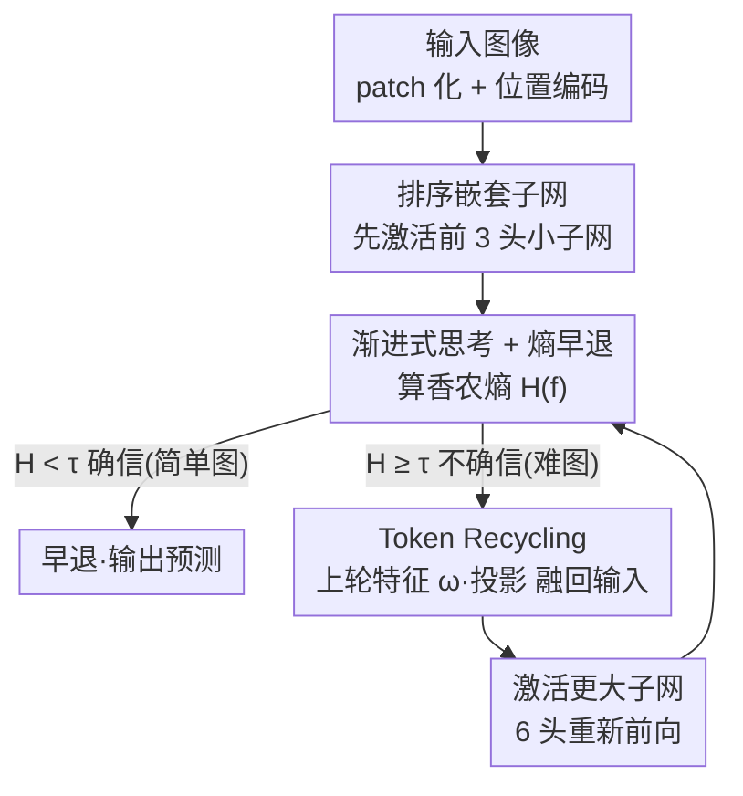

# ThinkingViT: Matryoshka Thinking Vision Transformer for Elastic Inference

**会议**: CVPR 2026  
**论文**: [CVF Open Access](https://openaccess.thecvf.com/content/CVPR2026/html/Hojjat_ThinkingViT_Matryoshka_Thinking_Vision_Transformer_for_Elastic_Inference_CVPR_2026_paper.html)  
**代码**: https://github.com/ds-kiel/ThinkingViT  
**领域**: 模型压缩 / 弹性推理  
**关键词**: 嵌套Transformer, 弹性推理, 输入自适应计算, Token复用, 熵早退

## 一句话总结
ThinkingViT 把"先用少量注意力头快速预测、不确定就扩大子网重新思考"的渐进机制塞进一个嵌套 ViT，并用 Token Recycling 把上一轮的特征喂回下一轮，在同等吞吐下比 MatFormer / HydraViT 等嵌套基线在 ImageNet-1K 上高出最多 2.0 个点。

## 研究背景与动机
**领域现状**：ViT 性能强但计算预算固定，很难一套权重部署到从服务器到手机的异构硬件上。为做"弹性推理"，近年出现了嵌套 Transformer（MatFormer、HydraViT、SortedNet 等）：在一个主干里嵌套多个共享权重的子网，推理时按硬件预算选不同宽度的子网，无需重训。

**现有痛点**：这些嵌套模型对**所有输入一视同仁**——不管图片是清晰单物体还是遮挡杂乱场景，都分配相同的计算量。简单样本被过度计算，复杂样本在紧资源下又吃不饱算力，整体效率有损。

**核心矛盾**：想做"按输入难度分配算力"就得有个 router 判断图片难度，但 MoE 那种 token 级轻量 MLP router 抓不住图像的全局复杂度——准确估计图像难度需要接近一个完整分类器的表征能力，而单独再挂一个大 router 又会引入额外开销。于是问题变成：**怎样在嵌套 ViT 内部实现输入自适应的算力分配，而不依赖一个昂贵的独立路由器？**

**切入角度**：借鉴 LLM 的"思考"机制（先给初步答案、不够确信就多想几步）。作者发现一个关键事实：在视觉里**单纯把 ViT 输出反复喂回同一个网络（naïve iteration）几乎不涨点**（Table 1：DeiT-Tiny 迭代到 5 GMACs 也只在 74% 附近饱和），所以重新思考时不能只是"想得更多"，还得"想得更有力"——即每轮激活更大的子网。

**核心 idea**：用"模型自己的预测确信度（熵）"当唯一调度信号——确信就早退、不确信就激活更多注意力头重算一遍，并把上一轮特征通过 Token Recycling 复用进来，从而把 router 的活儿交给模型本身。

## 方法详解

### 整体框架
ThinkingViT 建在标准 ViT 上。输入图像 patch 化、加位置编码后，模型不是一次性跑满，而是分若干个**渐进思考阶段**：第一阶段只激活排在前面的少量注意力头（如 50%，即 3 头）产出初步预测与一个确信度分数；若香农熵低于阈值（"啊哈"时刻，简单样本）则当场早退；否则把这一阶段的 token 特征通过 Token Recycling 融回输入，再用更大的子网（如 100%，6 头）重新前向一遍，得到更精细的预测。如此迭代直到达到预定确信度或耗尽最大容量。整个过程没有独立 router，弹性由调节熵阈值 $\tau$ 实现：阈值低→更多样本进入深层思考、更准但更慢；阈值高→更多样本早退、更快但略掉点。

### 关键设计

**1. 排序嵌套子网：把一个 ViT 切成"重要性递增"的有序子网**

弹性推理的前提是一套权重能跑出多种宽度，但若各宽度的头随机摆放，小子网拿到的就是一堆"平均水平"的头，初步预测会很弱。ThinkingViT 沿用 HydraViT 的思路，在主干内**诱导出 n 个有序嵌套子网** $V_{d_1,h_1} \subset V_{d_2,h_2} \subset \dots \subset V_{d_n,h_n}$，其中嵌入维度 $d_1 < d_2 < \dots < d_n$、头数 $h_1 < h_2 < \dots < h_n$。每个子网由**前 $d_i$ 个嵌入值 + 前 $h_i$ 个注意力头**构成，slicing 贯穿嵌入层、注意力、MLP 和归一化层。配合训练过程，排在前面的头会捕获**最重要**的特征，所以小子网（3 头）就能给出像样的初判，这正是后面"早退"能省算力的基础——它把"哪些头先用"从随机变成了按重要性排序。

**2. 渐进式思考 + 熵早退："啊哈"时刻决定想几轮**

这是输入自适应算力的核心。模型在第 $k$ 轮拿到 softmax 输出 $f_k$ 后，用香农熵度量确信度：

$$H(f_k) = -\sum_{c=1}^{C} f_k^{(c)} \log f_k^{(c)}$$

若 $H(f_k) < \tau$（预设阈值），就触发"啊哈"时刻、当场停下接受当前预测；否则激活更大的子网继续精修。关键在于"重新思考"不是用同一个网络再算一遍（那样在视觉里会迅速饱和，见 Table 1），而是**渐进扩大注意力头**——既"想得更多"又"想得更有力"，让难样本拿到更强的表征容量。熵这个朴素信号在 ImageNet-1K 上与更复杂的判据效果相当，且模型架构和训练都不变，未来可把它换成别的路由模块作为 drop-in 替换。

**3. Token Recycling：让下一轮在上一轮的肩膀上思考**

如果第二阶段从零开始重新处理图像，前一轮算出来的表征就白费了。Token Recycling 把上一阶段产出的 token 特征 $z_L$ 通过投影对齐到新维度，再用一个**可学习标量 $\omega$** 控制"召回多少旧知识"后加到新一轮的输入嵌入上：

$$E_{d_j}^{\text{fused}} = \omega \cdot \text{Proj}_{d_i \to d_j}(z_L) + E_{d_j}(x)$$

这样后续阶段不必"从头思考"，而是复用前一遍获得的知识来精修预测。它带来的增益很直观：ThinkingViT 用仅 22.01M 参数就拿到 81.44%，只比 86.6M 的 DeiT-Base 低 0.36 个点——说明高精度未必靠更大模型，而靠对难样本投入足够计算并复用历史特征。$\omega$ 是可学的，让模型自己决定旧特征的权重，避免人工设固定融合系数。

### 损失函数 / 训练策略
训练时所有 n 个思考阶段都跑，最小化各阶段分类损失的加权和：

$$L = \sum_{i=1}^{n} \alpha_i \cdot L_{\text{cls}}(V_{d_i,h_i}(x), y)$$

其中 $\alpha_i$ 控制每个子网对总目标的贡献。子网少时（实践中两个子网即足够，见 Figure 3）可直接联合优化所有子网，梯度计算图仍紧凑；当 n 变大、联合训练开销变高时，采用 sandwich rule 与随机子网采样来降负担。所有模型从预训练的 DeiT-Tiny 初始化，在 ImageNet-1K（224×224）上训练，H100 上每 epoch 约 10 分钟（2 卡）。

## 实验关键数据

### 主实验
在 ImageNet-1K 上对比 SOTA 嵌套基线（3H→6H 配置）：

| 对比维度 | 相对基线提升 | 说明 |
|--------|------|------|
| 同等吞吐（A100） | **+2.0 p.p.** | vs MatFormer / HydraViT / SortedNet / DynaBERT |
| 同等 GMACs | **+2.9 p.p.** | 同上 |
| 参数效率 | 81.44% @ 22.01M | 仅比 DeiT-Base（86.6M）低 0.36 p.p.，GMACs 5.85 vs 17.56 |

朴素迭代不涨点的反例（Table 1，论证"必须渐进扩容"）：

| 模型 | 深度 | GMACs | 准确率 |
|------|------|-------|--------|
| DeiT-Tiny | 12 | 1.25 | 72.20 |
| + 1 次迭代 | 24 | 2.50 | 74.00 |
| + 2 次迭代 | 36 | 3.75 | 74.10 |
| + 3 次迭代 | 48 | 5.00 | 73.60 |

### 消融实验
思考阶段配置的权衡（Figure 3）：

| 配置 | 特点 | GMACs | 备注 |
|------|------|-------|------|
| 3H→6H | 精度/算力最佳平衡 | 5.85 | 后续实验默认采用 |
| 2H→3H→6H | 覆盖最宽 GMACs 区间 | — | 较 3H→6H 仅小幅掉点 |
| 3H→6H→12H | 最高终极精度 | 23.41 | 仅比 3H→6H 高 0.91 p.p.，代价过大、整体效率反而更低 |

### 关键发现
- **熵确实是个好信号**：第一轮熵在简单数据集（ImageNet-V2）上左偏（早早确信），在难数据集（ImageNet-A/-R）上右偏（触发第二轮）；负载分布显示阈值越低、进第二阶段的样本越少，且早退样本极少被错分（Figure 7），证明熵能在不牺牲精度的前提下对简单输入停手。
- **鲁棒性更强**：在 ImageNet-V2 / -ReaL / -R 上全面超过基线；在 -ReaL/-Sketch/-R 上甚至超过 DeiT-Base，而参数（22.1M vs 86.6M）和 GMACs（5.85 vs 17.56）都低得多，凸显 Token Recycling 的作用。
- **可迁移、可即插**：保留 ViT 主干使其能直接换进 Segmenter 做语义分割（ADE20K / Cityscapes，超过 DeiT-Small/Tiny 主干），也能扩展到 Swin 这类层级架构，并优于早退（Early-Exit）基线。

## 亮点与洞察
- **"想得更多"不如"想得更有力"**：Table 1 这个反例很有说服力——视觉里重复喂回同一网络会迅速饱和，所以 ThinkingViT 把"重新思考"等同于"激活更大子网"，这是它区别于 LLM 式同网络迭代推理的核心洞察。
- **把 router 的活交给模型自身**：用模型自己的预测熵当调度信号，省掉了独立路由器的参数和开销，还顺带规避了"小 router 抓不住图像全局难度"的难题——这是个很优雅的"自路由"设计。
- **Token Recycling 可迁移**：用可学习标量融合跨阶段特征的思路，本质是"渐进精修 + 历史复用"，可以迁移到任何多轮/多分辨率推理框架（如级联检测、扩散式精修）里复用前一阶段的中间表征。

## 局限与展望
- 作者把 DETR 式目标检测等更多 ViT 下游任务留作 future work，当前下游验证主要在分割。
- 早退依赖熵阈值，⚠️ 在类别数极多或校准较差的场景下，熵作为确信度可能不够可靠（论文也提到可换更复杂判据），跨数据集阈值的可迁移性需要单独调。
- 渐进思考在最坏情况下（难样本全走满所有阶段）总算力会高于固定宽度模型，弹性收益依赖输入难度分布偏向"简单样本多"，在均匀困难的数据集上优势会缩小。
- 思考阶段数与头扩张步长是超参，需按数据集和部署目标调（3H→6H→12H 的反例说明盲目加阶段会得不偿失）。

## 相关工作与启发
- **vs HydraViT / SortedNet（嵌套基线）**: 它们在主干里切出多宽度子网但**对每个输入用固定算力预算**；ThinkingViT 复用同样的 slicing 嵌套思想，但加入输入自适应——简单图早退、难图扩容，并用 Token Recycling 跨阶段传递知识，因此同算力下更准。
- **vs MoE / Flextron 等路由方法**: 它们靠轻量 MLP 在 token 级路由，缺乏图像级判断的表征力，且 router 与被路由模型间无知识传递；ThinkingViT 用模型自身的熵当门控、并跨阶段复用 token，让每轮都建立在上一轮之上。
- **vs Early-Exit（BranchyNet / PABEE / ViT-EE 等）**: 早退方法在**固定宽度**模型上挂多个出口、靠确信度提前停；ThinkingViT 则是在模型上做**宽度渐增**的多轮循环，实验（Figure 8b）显示迭代扩容带来的提升超过单纯的早退。

## 评分
- 新颖性: ⭐⭐⭐⭐ 把"渐进扩容 + 熵自路由 + Token 复用"组合进嵌套 ViT，思路清晰且抓住了"视觉迭代会饱和"的关键差异
- 实验充分度: ⭐⭐⭐⭐ ImageNet 系列 + 鲁棒性变体 + 分割 + Swin + 早退对比都覆盖，消融到位；检测留待未来
- 写作质量: ⭐⭐⭐⭐ 动机推导（为何不能用独立 router、为何不能朴素迭代）讲得很顺
- 价值: ⭐⭐⭐⭐ 即插即用、主干保留、参数高效，对异构硬件弹性部署很实用

<!-- RELATED:START -->

## 相关论文

- [\[ICCV 2025\] EA-ViT: Efficient Adaptation for Elastic Vision Transformer](../../ICCV2025/model_compression/ea-vit_efficient_adaptation_for_elastic_vision_transformer.md)
- [\[CVPR 2026\] LoPrune: Efficient Data Pruning for LoRA-Based Fine-Tuning of Vision Transformer](loprune_efficient_data_pruning_for_lora-based_fine-tuning_of_vision_transformer.md)
- [\[CVPR 2026\] BinaryAttention: One-Bit QK-Attention for Vision and Diffusion Transformers](binaryattention_one-bit_qk-attention_for_vision_and_diffusion_transformers.md)
- [\[CVPR 2026\] TAS-LoRA: Transformer Architecture Search with Mixture-of-LoRA Experts](tas-lora_transformer_architecture_search_with_mixture-of-lora_experts.md)
- [\[CVPR 2026\] Dual-branch Distilled Transformer for Efficient Asymmetric UAV Tracking](dual-branch_distilled_transformer_for_efficient_asymmetric_uav_tracking.md)

<!-- RELATED:END -->
