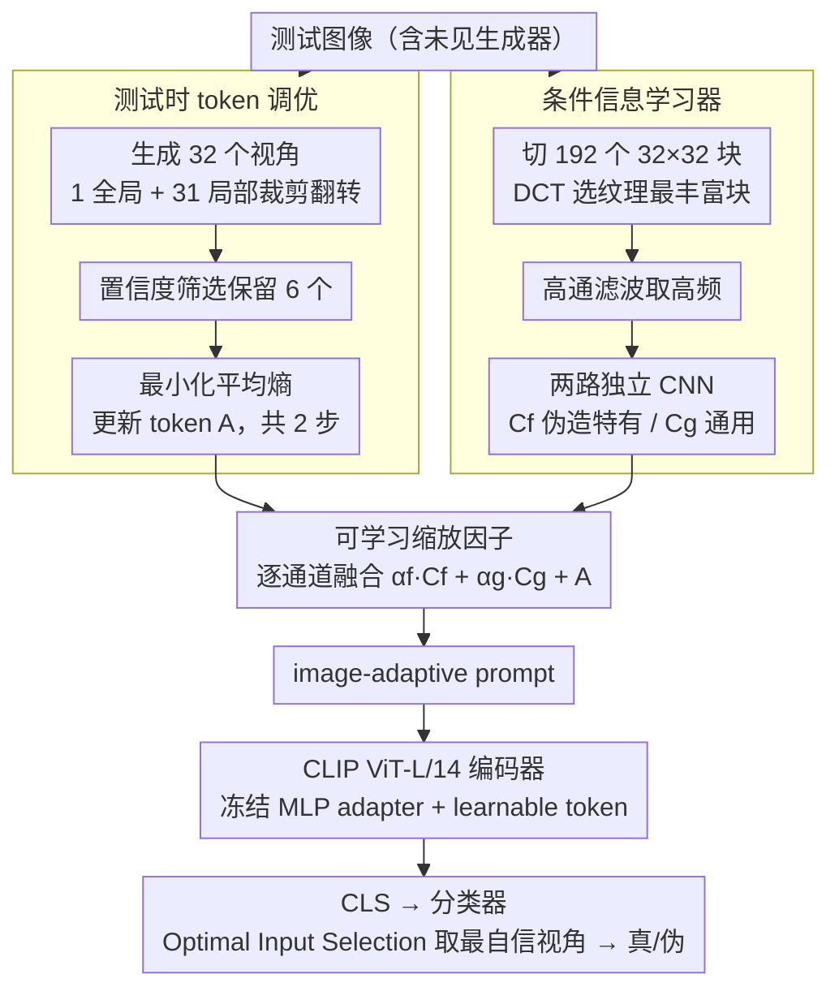

# Towards Generalizable AI-Generated Image Detection via Image-Adaptive Prompt Learning

**会议**: CVPR 2026  
**arXiv**: [2508.01603](https://arxiv.org/abs/2508.01603)  
**代码**: 有  
**领域**: 模型压缩  
**关键词**: AI生成图像检测, 提示学习, 测试时适应, CLIP, 伪造检测

## 一句话总结

提出 Image-Adaptive Prompt Learning (IAPL)，在推理时根据每张测试图像动态调整 CLIP 编码器的 prompt，通过测试时 token 调优和条件信息学习器实现对未见生成器的强泛化，在 UniversalFakeDetect 和 GenImage 上分别达到 95.61% 和 96.7% 平均准确率的 SOTA 性能。

## 研究背景与动机

**领域现状**: AI 生成图像检测是当前安全领域的热门课题。SOTA 方法普遍微调 CLIP 等视觉基础模型，利用其丰富的预训练知识辅助检测。现有方法如 UniFD、FatFormer、C2P-CLIP 在训练后固定所有可学习参数。

**现有痛点**: 微调后的固定参数模型对未见生成器的域迁移抵抗力不足。不同生成器产出的图像在纹理、语义和伪造痕迹上差异巨大，固定参数无法捕获这些实例级别的特异性判别线索。

**核心矛盾**: 训练数据只涵盖有限的生成方法（如仅用 ProGAN 训练），但推理时要面对 19 种不同的生成器。固定学到的 prompt 只编码了训练集的伪造分布，无法适应新分布。

**本文目标** (1) 如何让 prompt 在推理时动态适应每张测试图像？(2) 如何提取图像特有的伪造线索作为条件信息？(3) 如何在保持检测骨干稳定性的同时允许实例级自适应？

**切入角度**: 将测试时适应（Test-Time Adaptation）思想引入 prompt 学习——prompt 不仅在训练时优化，在推理时也根据单张测试图像的多视角一致性约束继续调优。

**核心 idea**: prompt 由"训练后固定的条件信息"和"推理时动态调整的 test-time token"两部分组成，通过可学习缩放因子融合，实现检测器的实例级自适应。

## 方法详解

### 整体框架

IAPL 要解决的核心问题是：训练时只见过有限几种生成器（如仅 ProGAN），推理时却要面对 19 种未见生成器，固定参数的 CLIP 检测器一旦换分布就失灵。它的思路是让 prompt「分两半」——一半训练后固定、提供稳定的伪造先验，另一半在推理时针对每张测试图像现场调整、捕获实例级线索。

整条管道基于 CLIP ViT-L/14。论文在原编码器里插入三类可训练组件：等间隔插入 $N_a=6$ 个 block 的 MLP adapter、布在第 2 到第 $N_t=9$ 个 block 的 learnable token，以及喂给第 1 个 block 的 image-adaptive prompt。前两类训练后冻结，构成稳定骨干；只有 image-adaptive prompt 在推理时随图像继续变化。一张测试图进来后，分两条支路并行处理：测试时 token 调优支路从多视角一致性里现场调出 token，条件信息学习器支路从高频纹理里抽出伪造线索；二者再经可学习缩放因子融合成这张图专属的 prompt 喂回第 1 个 block，最后 CLS token 过分类器、并用 Optimal Input Selection 取最自信视角给出真/伪判断。

### 关键设计

**1. 测试时 token 调优：让 prompt 在推理阶段也能适应当前图像**

固定参数最大的软肋是面对未见生成器时预测会变得犹疑不定——不同生成器的纹理和伪造痕迹差异巨大，训练时学到的那套 prompt 只编码了训练分布。IAPL 的做法是在推理时也开一个无标签的自适应窗口：对单张测试图像生成 $N_v=32$ 个视角（1 个全局 + 31 个局部裁剪并翻转），按置信度挑出 $m=6$ 个最有把握的视角，然后以最小化它们的平均熵为目标，对 test-time token 做 $T=2$ 步梯度更新：

$$L_{avg} = -\big(\bar{p}\log\bar{p} + (1-\bar{p})\log(1-\bar{p})\big)$$

其中 $\bar{p}$ 是 6 个选中视角预测的平均。最小化这个熵等于逼模型在同一张图的多个视角下给出一致且自信的判断，从而把 token 拉向当前图像的特性。因为目标只依赖预测分布本身、不需要标签，所以能在测试阶段直接跑，这正是它对未见域有效的根源。

**2. 条件信息学习器：从高频纹理里挖 CLIP 看不见的伪造痕迹**

CLIP 的预训练偏重高层语义，对频率异常、像素级模式这类低层伪造痕迹天然不敏感，而这些恰恰是判别生成图的关键。条件信息学习器专门补这块短板：先把图像切成 $N_p=192$ 个 $32\times32$ 小块，用 DCT 分数选出纹理最丰富的那一块，过高通滤波器留下高频模式，再交给两个结构相同但参数独立的 CNN——一路输出伪造特有条件 $C_f$（带辅助监督，专注伪造判别），另一路输出通用条件 $C_g$（无监督，捕获图像的通用状态）。两路分离的好处是让伪造线索和通用语境各走各的通道，不会互相稀释；而只处理一个 $32\times32$ 块也让这部分计算量极小。

**3. 可学习缩放因子：按通道把两类线索融成最终 prompt**

测试时 token 捕获的是多视角一致性线索，条件信息捕获的是高频伪造线索，二者量纲和重要性都不同，直接相加会让强信号淹没弱信号。IAPL 用一组逐通道可学习系数 $\alpha_f,\alpha_g$ 控制融合比例：

$$P = \{\alpha_f \cdot C_f + A[0,:],\ \alpha_g \cdot C_g + A[1,:]\}$$

这里 $A$ 是测试时调优后的 adaptive token。$\alpha$ 在训练时学到每个通道上条件信息与 token 各占多少，实现细粒度的通道级配比，而不是粗暴的等权相加。

### 一个完整示例

一张由未见的 Midjourney 生成的图像进入管道：条件信息学习器先把它切成 192 个小块，按 DCT 分数锁定纹理最丰富的那一块，高通滤波后由两个 CNN 分别产出 $C_f$ 和 $C_g$。与此同时，系统对这张图生成 32 个视角，按当前预测置信度筛掉犹疑的视角、留下 6 个最自信的，以这 6 个视角预测的平均熵为目标对 test-time token 连更 2 步——更新后模型在这 6 个视角上的真/伪判断趋于一致。接着缩放因子把 $\alpha_f C_f$、$\alpha_g C_g$ 与调优后的 token 按通道融合成这张图专属的 image-adaptive prompt，喂回 CLIP 第 1 个 block。最后从所有视角里取置信度最高的那个预测作为这张图的最终结果（Optimal Input Selection）。整个过程没有用到任何标签，prompt 完全是「为这张图现做」的。

### 损失函数 / 训练策略

训练目标是 $L_{overall} = L_{cls} + L_{aux}$，两项都是二分类交叉熵（$L_{aux}$ 是 $C_f$ 那一路的辅助监督）。推理阶段则用平均熵 $L_{avg}$ 在线调优 test-time token。训练只跑 1 个 epoch、学习率 $5\times10^{-5}$、单卡 3090；推理时 test-time tuning 学习率放大到 $5\times10^{-3}$、只更新 2 步，因此额外开销可控。

## 实验关键数据

### 主实验（UniversalFakeDetect，ProGAN 4-class 训练, Acc%）

| 方法 | ProGAN | StyleGAN | BigGAN | LDM(200) | DALLE | GauGAN | mAcc |
|------|--------|----------|--------|----------|-------|--------|------|
| UniFD | 100.0 | 82.0 | 94.5 | 72.0 | 81.38 | 99.5 | 86.78 |
| FatFormer | 99.89 | 97.15 | 99.50 | 69.45 | 98.75 | 99.41 | 90.86 |
| C2P-CLIP | 99.98 | 96.44 | 99.12 | 93.29 | 98.55 | 99.17 | 93.79 |
| **IAPL** | **100.0** | **98.90** | **99.65** | **95.35** | **98.90** | **99.55** | **95.61** |

### 消融实验

| 配置 | mAcc | 说明 |
|------|------|------|
| Full IAPL | 95.61 | 完整方法 |
| w/o test-time tuning | 93.89 | 去掉推理时调优掉 1.72 |
| w/o conditional info | 94.23 | 去掉条件信息掉 1.38 |
| w/o scaling factor | 94.67 | 去掉缩放因子掉 0.94 |
| w/o MLP adapter | 94.12 | 去掉适配器掉 1.49 |

### 关键发现

- Test-time tuning 贡献最大（+1.72%），证实推理时自适应的有效性
- T-SNE 可视化定性展示 IAPL 对未见伪造图像的特征与已见伪造更接近、与真实图像更分离
- 在 GenImage 数据集上用 SD v1.4 训练达 96.7% mAcc，对 Midjourney、ADM 等未见生成器泛化良好
- 仅需 1 epoch 训练 + 推理时 2 步调优，训练效率极高

## 亮点与洞察

- **推理时 prompt 自适应**：将 test-time adaptation 引入 prompt learning 用于伪造检测是一个新颖组合。每张图都有定制化的 prompt，比固定 prompt 更能适应未见域
- **高频纹理条件化**：从 DCT 分数最高的小块提取高频条件信息，巧妙弥补了 CLIP 语义偏向的短板，且计算量很小（仅处理一个 32x32 块）
- **极低训练成本**：仅 1 epoch + 单卡 3090，比同类方法（如 FatFormer 需多 epoch 和更大卡）经济得多

## 局限与展望

- 推理时 test-time tuning 引入额外延迟：需生成 32 个视角 + 2 步梯度更新，对实时应用可能是瓶颈
- 条件信息仅从单个纹理最丰富的块提取，可能遗漏分布在多处的伪造线索
- 在 SITD、SAN 等低层次伪造方法上准确率仍有波动（68-95%），说明条件信息对某些伪造类型捕获不足

## 相关工作与启发

- **vs C2P-CLIP**: C2P-CLIP 通过对比学习注入类别概念，prompt 训练后固定。IAPL 额外引入推理时调优，mAcc 从 93.79% 提升到 95.61%
- **vs FatFormer**: FatFormer 用频率分析增强适配器，但 prompt 固定。IAPL 动态 prompt + 条件信息双管齐下效果更好
- **vs TPT/R-TPT**: 本文借鉴了 test-time prompt tuning 的思路但加入了伪造检测特有的条件信息分支，比纯 TPT 更有效

## 评分

- 新颖性: ⭐⭐⭐⭐ 将 test-time adaptation 与 prompt learning 结合用于伪造检测是新颖组合
- 实验充分度: ⭐⭐⭐⭐⭐ 两大标准数据集、19+ 生成器、完整消融
- 写作质量: ⭐⭐⭐⭐ 方法描述清晰，图示直观
- 价值: ⭐⭐⭐⭐ 对 AI 生成内容检测的实际应用有重要参考价值

<!-- RELATED:START -->

## 相关论文

- [\[AAAI 2026\] Your AI-Generated Image Detector Can Secretly Achieve SOTA Accuracy, If Calibrated](../../AAAI2026/model_compression/your_ai-generated_image_detector_can_secretly_achieve_sota_accuracy_if_calibrate.md)
- [\[ICML 2026\] Images as Tables: In-Context Learning with TabPFN for Low-Data Detection of AI-Generated Images](../../ICML2026/model_compression/images_as_tables_in-context_learning_with_tabpfn_for_low-data_detection_of_ai-ge.md)
- [\[NeurIPS 2025\] AI-Generated Video Detection via Perceptual Straightening](../../NeurIPS2025/model_compression/ai-generated_video_detection_via_perceptual_straightening.md)
- [\[CVPR 2026\] On the Robustness of Diffusion-Based Image Compression to Bit-Flip Errors](on_the_robustness_of_diffusion-based_image_compression_to_bit-flip_errors.md)
- [\[CVPR 2026\] Bilevel Layer-Positioning LoRA for Real Image Dehazing](bilevel_layer-positioning_lora_for_real_image_dehazing.md)

<!-- RELATED:END -->
