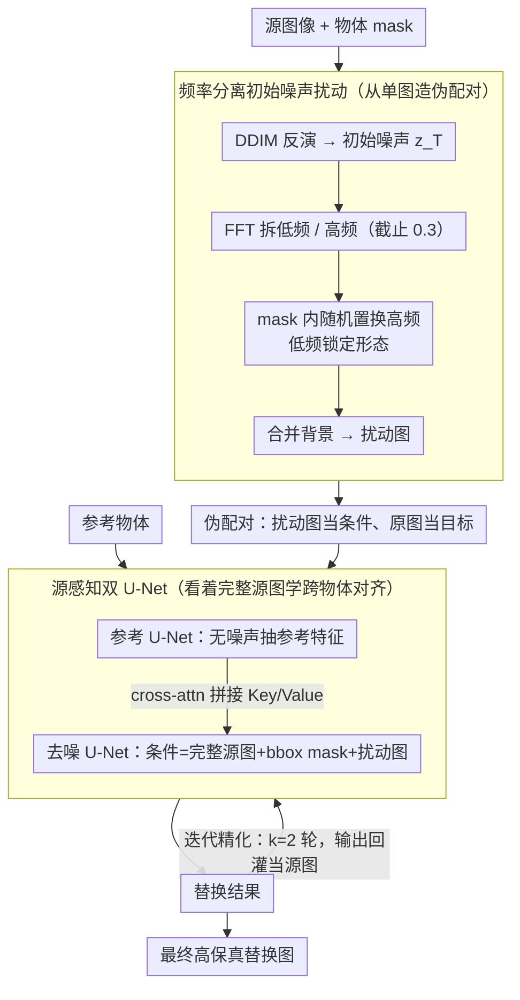

# Towards Source-Aware Object Swapping with Initial Noise Perturbation

**会议**: CVPR 2026  
**arXiv**: [2602.23697](https://arxiv.org/abs/2602.23697)  
**代码**: 无  
**领域**: 模型压缩  
**关键词**: 物体替换, 扩散模型, 初始噪声扰动, 自监督, 跨物体对齐

## 一句话总结

提出 SourceSwap，通过频率分离的初始噪声扰动从单张图像生成高质量伪配对数据，并采用源感知双 U-Net 架构学习跨物体对齐，实现零样本、无逐物体微调的高保真物体替换。

## 研究背景与动机

物体替换旨在将场景中的源物体替换为参考物体，需满足三准则：物体保真度、场景保真度、物体-场景和谐度。

现有方法问题：(1) 测试时微调方法（DreamEdit, PhotoSwap）需要逐物体训练，推理慢；(2) 学习式修复方法（AnyDoor, MimicBrush）依赖视频/多视角伪配对数据，存在模糊和同一物体偏差问题；(3) 所有方法在训练时 mask 掉源物体，模型只能从背景推断物体状态，无法学习跨物体对齐。

核心洞察：保留完整源图像让模型直接学习两个不同物体之间的对齐关系。

## 方法详解

### 整体框架

物体替换最缺的不是模型，而是训练数据：真实世界几乎不存在「同一场景、同一位置、换了个物体」的成对图像，于是已有方法要么靠视频/多视角凑伪配对（带来模糊和「换汤不换药」的同物体偏差），要么干脆在训练时把源物体 mask 掉、让模型从背景去猜。SourceSwap 换了个思路：从**一张图**里造伪配对。它先用频率分离的初始噪声扰动，把源图像里的物体「改头换面」成一个外观不同但形态相近的新物体——这样原图和扰动图就构成了一对「替换前/替换后」的监督样本；再用一个保留完整源图像的源感知双 U-Net 去学这对样本之间的映射，从而真正学到「两个不同物体之间怎么对齐」。整条链路是：源图 → DDIM 反演到噪声 → 频域扰动造伪配对 → 双 U-Net 训练 → 推理时迭代精化输出。

### 关键设计

**1. 频率分离初始噪声扰动：在噪声的高频里换外观、低频里锁形态**

要从单张图造出「同位置、换物体」的配对，难点是改了外观又不能让物体凭空挪位或变形。SourceSwap 把这件事搬到扩散的初始噪声空间来做：先对源图像 $I_s$ 做 DDIM 反演拿到初始噪声 $z_T$，再用 FFT 把它拆成低频 $z_T^L$ 和高频 $z_T^H$（截止频率 0.3）。它的观察是，低频主要编码物体的整体形态与布局，高频则对应颜色、纹理、材质这些外观细节。于是只在源物体 mask 内动高频分量，且不是重采样新的高斯噪声，而是把高频的空间索引做一次随机排列：

$$\hat{z}_T^H[c,k] = \tilde{z}_T^H[c,\pi(k)]$$

这里 $\pi$ 是 mask 内像素索引的随机置换。用「排列」而非「重采样」是关键——排列保持了噪声的边际分布和总能量不变，扰动后的 latent 仍落在扩散模型熟悉的分布里，去噪出来能和背景无缝融合；如果换成重新采样高斯噪声，生成结果就会带粘贴感、和场景视角冲突。低频固定让新物体形态与原物体一致、占位不变，mask 外的噪声原样保留以锁住背景，最终扰动图就是一个「形态接近、外观换了」的合理新物体。

**2. 源感知双 U-Net：不再 mask 源物体，让模型直接看着两个物体学对齐**

已有学习式方法训练时都会把源物体抠掉，模型只能从残缺背景里反推该放什么、怎么放，自然学不到跨物体的对齐关系。SourceSwap 反其道而行，把**完整源图像**喂进去。它用双 U-Net：上支路是参考 U-Net，专门从参考物体里抽密集特征，且不往里注噪声以保留更清晰的细节；下支路是去噪 U-Net，条件端同时拼上未被 mask 的完整源图像、bbox mask 和扰动后的源图像。两条支路在每个 cross-attention 块里把各自的 Key/Value 拼接起来交换信息。训练时的角色分工很巧：扰动图当条件、原始源图当生成目标，等于让模型「看着一个外观被改过的物体，去还原出原本那个物体」，而完整源图像始终在场，模型因此能直接对照「源物体↔目标物体」学到空间与语义上的对齐。消融里去掉源感知后，背包会悬浮、空间关系出错，正说明这一步在补的就是「物体该怎么摆」的信息。

**3. 迭代精化：把上一轮的输出再当源图喂回去，逐轮抠细节**

单次生成往往在颜色和纹理上还不够到位。SourceSwap 在推理时做一个简单的迭代：把上一轮的输出当作下一轮的源图像输入，

$$I_t^{(k)} = \mathcal{D}(I_r, I_s^{(k)})$$

其中 $I_r$ 是参考物体、$I_s^{(k)}$ 是第 $k$ 轮的源图输入。每多走一轮，生成结果就更贴近参考物体的真实外观。实践中只需 $k=2$ 轮就能把颜色/纹理细节明显提上来，代价也很小——两轮总推理时间约 4.41s，仍远快于需要逐物体微调的测试时方法。

### 一个完整示例

以「把场景里的源背包换成一张参考椅子」为例走一遍：先对原背包图做 DDIM 反演得到 $z_T$，FFT 拆出低频/高频；在背包 mask 内把高频索引随机置换、低频不动，去噪后得到一个「形态仍像背包、但颜色纹理被打乱」的扰动图——这张扰动图和原背包图就成了一对训练样本。训练时把原背包图设为生成目标、扰动图当条件，配合参考 U-Net 抽出的椅子特征，去噪 U-Net 学会「看着被改过外观的物体还原真实物体」。推理阶段第 1 轮先生成一把大致就位的椅子，第 2 轮把它再当源图喂回去精化颜色与材质，最终得到一把和场景光照、视角和谐、又忠实于参考椅子外观的替换结果。

### 训练策略

基于 SD v1.5 和 SD Inpainting v1.5，40K 单图样本，训练 10K 迭代，单卡 A100 约 8 小时。参考 U-Net 的 timestep 固定为 0，VAE 和文本编码器全程冻结。

## 实验关键数据

### 主实验

| 评估维度 | 指标 | SourceSwap 表现 |
|----------|------|----------------|
| 物体保真 | DreamSim ↓ | Pareto 前沿最优 |
| 场景保真 | LPIPS ↓ | Pareto 前沿最优 |
| 和谐度 | MLLM偏好率 | 对所有基线 >62% |

### 推理效率

| 方法 | 推理时间/样本 |
|------|--------------|
| PhotoSwap | 128.85s + 751.97s 预训练 |
| DiptychPrompt | 124.63s |
| AnyDoor | 11.01s |
| **SourceSwap (2轮)** | **4.41s** |

### 消融实验

| 配置 | 效果 |
|------|------|
| 无源感知 | 物体空间关系错误（背包悬浮） |
| 仅数据增强无扰动 | 模型坍塌 |
| 排列所有频率分量 | 结构扭曲 |
| 仅排列低频 | 变化不足 |
| 重采样高斯噪声 | 粘贴感，视角冲突 |

### 关键发现

- 40K 单图样本即可达强性能，比 AnyDoor (410K) 和 MimicBrush (10M) 少 1-2 个数量级
- 学习式方法整体优于无训练方法，任务特定数据构造是关键

## 亮点与洞察

1. 频率分离噪声扰动极简但有效——只需 FFT + 局部排列
2. 移除源 mask 是反直觉的关键设计——完整源图像信息反而帮助跨物体对齐
3. 训练数据量比同类少 2-3 个数量级

## 局限与展望

1. 基于 SD v1.5，升级更强基础模型可进一步提升
2. 极端形态差异的物体替换效果可能有限
3. 扰动多样性受限于频率分离操作的表达能力

## 相关工作与启发

- 初始噪声空间操控的思路可迁移到布局控制、风格迁移等任务
- 相比 AnyDoor/MimicBrush：避免了视频配对数据的质量问题

## 评分

- 新颖性: ⭐⭐⭐⭐⭐ 频率分离噪声扰动+源感知设计，思路新颖
- 实验充分度: ⭐⭐⭐⭐ 对比全面，消融充分
- 写作质量: ⭐⭐⭐⭐ 动机清晰
- 价值: ⭐⭐⭐⭐ 实用的零样本物体替换方案

<!-- RELATED:START -->

## 相关论文

- [\[NeurIPS 2025\] Perturbation Bounds for Low-Rank Inverse Approximations under Noise](../../NeurIPS2025/model_compression/perturbation_bounds_for_low-rank_inverse_approximations_under_noise.md)
- [\[CVPR 2026\] Unlocking ImageNet's Multi-Object Nature: Automated Large-Scale Multilabel Annotation](unlocking_imagenets_multi-object_nature_automated_large-scale_multilabel_annotat.md)
- [\[CVPR 2026\] GeoFusion-CAD: Structure-Aware Diffusion with Geometric State Space for Parametric 3D Design](geofusion-cad_structure-aware_diffusion_with_geometric_state_space_for_parametri.md)
- [\[CVPR 2026\] MARVO: Marine-Adaptive Radiance-aware Visual Odometry](marvo_marine-adaptive_radiance-aware_visual_odometry.md)
- [\[CVPR 2026\] Enhancing Mixture-of-Experts Specialization via Cluster-Aware Upcycling](enhancing_mixture_of_experts_specialization_via_cluster_aware_upcycling.md)

<!-- RELATED:END -->
