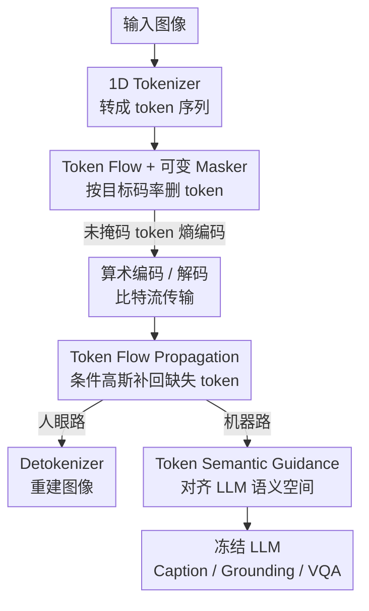

# Towards Unified Human Perception and Machine Understanding: Token Flow Guided Compression Framework

**会议**: CVPR 2026  
**论文**: [CVF Open Access](https://openaccess.thecvf.com/content/CVPR2026/html/Xu_Towards_Unified_Human_Perception_and_Machine_Understanding_Token_Flow_Guided_CVPR_2026_paper.html)  
**领域**: 模型压缩 / 图像压缩  
**关键词**: 图像压缩、机器视觉编码、1D token、可变码率、LVLM

## 一句话总结
TFGC 把图像压成 1D token 序列，用「token flow」现象做可变码率掩码 + 条件高斯预测来重建缺失 token，再用语义引导模块让 LVLM 直接吃压缩 token（不解码回图像），在 0.02–0.06 bpp 超低码率下同时兼顾人眼感知质量和机器理解任务（caption/grounding/VQA）。

## 研究背景与动机
**领域现状**：随着大视觉语言模型（LVLM）成为图像消费的主力，图像压缩的目标正从「给人看的像素保真」转向「给机器理解的语义保真」。传统学习式压缩（autoencoder 类，如 ELIC）通过最小化 $R+\lambda D$ 训练，已经超过 BPG/VVC 等传统编解码器，但它们优化的是像素级失真，而且每个码率点都要重训或单独存一套权重。

**现有痛点**：三条线都不够用。一是固定码率：要变码率就得换模型；QVRF/Hanyue 等做了可变码率，但仍以重建图像质量为目标。二是「先重建再理解」的范式：近期把语义先验塞进压缩的工作仍然要先把图像解码出来，再喂给 LVLM，这中间存在「感知保真 ↔ 机器理解」的模态鸿沟，在超低码率下语义急剧退化、严重拖累下游推理。三是基于向量量化（VQ）的方法传输离散 token 索引，但依赖稠密的 2D token 网格，压缩灵活性受限。

**核心矛盾**：超低码率（ultra-low bitrate）下，潜在表示会同时丢掉语义相关性、又难以把有意义的内容从冗余视觉细节里拆出来；而要做灵活码率控制，又往往牺牲语义一致性。两者很难兼得。

**切入角度**：作者把图像编成 **1D token 序列**（而非 2D 网格），并通过 token 扰动实验发现了一个特性——**token flow**：1D token 的整体性（holistic property）意味着整条序列共同承载图像的语义与结构，配合 tokenizer 内的自注意力，信息能在序列里全局传播、上下文恢复。删掉一部分「无信息」token（uninformative）造成的破坏，远小于插入同等数量的「干扰」token（obstruction）——因为剩余的有效 token 能把全局上下文「流」回缺失位置。

**核心 idea**：既然 token flow 能把上下文从未掩码 token 传播到掩码位置，那就用「掩码一部分 token 控码率 + 条件预测补回缺失 token」实现可变码率，再加一个语义引导模块把重建的 token 直接对齐到 LVLM 的语言空间，让机器侧根本不需要把图像解码出来。

## 方法详解

### 整体框架
TFGC 要解决的是：**一套模型、一条 token 流，同时服务「人看」和「机器懂」，且码率可调到极低**。整体是一个 token 级的「掩码—传输—恢复—双路输出」管线，包含四个组件：(1) 1D tokenizer–detokenizer 负责视觉 token 化与重建；(2) 基于 Token Flow Propagation（TFP）的可变码率控制；(3) Token Semantic Guidance（TSG）做语义对齐；(4) 冻结的 LLM 做下游理解。

编码端：图像先被 tokenizer 转成 1D token 序列；**variable token masker** 按目标码率删掉可控比例的 token，剩下的未掩码 token 经算术编码器熵编码成比特流。解码端：算术解码器恢复出未掩码 token，送入 TFP 模块预测缺失 token、重建出完整序列。重建后的完整 token 序列分两条并行路走：(i) 经 detokenizer 重建图像，供人眼感知；(ii) 经 TSG 模块做语义适配，供 LLM 直接理解。删掉的 token 越多 → 比特流越短 → 码率越低（0.06 / 0.04 / 0.02 bpp 对应不同掩码比例），同一个模型即可覆盖。

### 关键设计

**1. Token Flow 现象 + 可变 token 掩码：用「序列整体性」把码率做成可调旋钮**

要做可变码率，最朴素的办法是删 token——但删了之后怎么稳定恢复、删多少不崩，是没人答清楚的问题。作者先用扰动实验把 1D token 的**整体性**坐实：把序列尾部 token 换成码本里随机采样的「干扰 token」，少量插入时重建风格还稳，比例升到 11%/20% 就严重崩坏；而直接删掉同样数量的「无信息 token」破坏却小得多。原因在于剩余的有效 token 承载全局特征、能把上下文「流」回缺失位置（token flow），而干扰 token 会注入冲突噪声压垮信息交换。这条观察直接支撑了「掩码控码率」的可行性：variable token masker 按目标 bpp 删掉一个可控比例的 token，只熵编码剩下的未掩码 token，删得越多码率越低，一套模型覆盖 0.06/0.04/0.02 bpp。

**2. Token Flow Propagation（TFP）：把补缺失 token 建模成「条件高斯采样」而非静态填充**

把序列切成未掩码部分 $x_u=(x_1,\dots,x_n)$ 和掩码部分 $x_m=(x_{n+1},\dots,x_N)$。已有的 token 预测做法（单个可学习 token、或一组带位置编码的可学习 token）本质是**静态**的——它们与其他 token 无关，模型被迫学一个对所有上下文通用的替换分布，恰好削弱了 1D token 赖以为生的信息流。作者从分布层面证明了这点：设真分布 $P(x)=P(x_u)P(x_m\mid x_u)$，静态填充对应 $Q(x)=P(x_u)F(x_m)$（$F$ 是上下文无关分布），两者的 KL 散度可化简为

$$D_{KL}(P\,\|\,Q)=\mathbb{E}_{x_u\sim P(x_u)}\big[D_{KL}\!\big(P(x_m\mid x_u)\,\|\,F\big)\big].$$

只要 $x_u$ 和 $x_m$ 不独立，任何与条件分布无关的 $F$ 都会让这个散度显著为正——即静态填充必然破坏全局特征结构。于是 TFP 转而直接建模条件分布 $P(x_m\mid x_u)$。为可解，假设联合分布服从多元高斯，则条件有闭式解 $P(x_m\mid x_u)=\mathcal{N}(\mu_{m|u},\Sigma_{m|u})$，其中条件均值 $\mu_{m|u}=\mu_m+\Sigma_{mu}\Sigma_{uu}^{-1}(x_u-\mu_u)$ 是 $x_u$ 的仿射函数——这正是「从未掩码 token 预测缺失 token」的理论依据；条件协方差 $\Sigma_{m|u}$ 与 $x_u$ 无关，说明一个尺度就足以刻画缺失区域的不确定性。实现上用网络 $\mu_\theta(x_u)$、$\sigma_\theta(x_u)$ 参数化均值与尺度（放宽固定协方差假设），再用重参数化采样

$$\hat{x}_m=\mu_\theta(x_u)+\sigma_\theta(x_u)\odot y,\quad y\sim\mathcal{N}(0,1).$$

结构上（图 4）：掩码位置先用标准正态初始化为 $y$，未掩码 token 过 LayerNorm + 自注意力让信息在序列里传播，MLP 预测条件均值/方差，把 $y$ 映射成「条件映射 token」$\hat{x}_m$，最后与 $x_u$ 拼接成完整序列。和静态填充的本质区别：补出来的 token 是**随当前上下文变化的**，保住了 token flow。

**3. Token Semantic Guidance（TSG）：让 LLM 直接吃 token，不再「先解码成图」**

传统范式要把图像重建出来再喂 LVLM，多绕一道且引入模态鸿沟。但重建路出来的 token 主要承载的是为重建优化的结构/视觉信息，**视觉导向、缺乏与 LLM 语言空间的显式对齐**。TSG 的作用就是注入 CLIP 式语义先验、把这些 token 投影到语言兼容的嵌入空间：先用一个 MLP 把重建 token 序列投到 LLM 的 embedding 维度，再过若干层 TSG（每层 = 归一化 + 自注意力 + 残差 MLP）传播并对齐语义，最后把「语义引导 token」与文本 prompt 拼接喂给冻结的 LLM 出结果。它把信息流从「以视觉重建为中心」转成「以语言语义推理为中心」，从而绕开图像解码这条岔路，给机器侧一条更高效、与图像无关的理解通路。消融里把 TSG 换成等参量 MLP 会全任务大幅掉点（见下表），说明对齐是真起作用而非单纯加参数。

### 损失函数 / 训练策略
TFGC 把「人眼感知」和「机器理解」的优化解耦成两段，避免二者互相妥协。

**人眼路（TFP 优化）**：以 TiTok-sl256 作为初始 1D tokenizer/detokenizer，冻结码本，只训 encoder、decoder 和 TFP，总损失 $L_{TFP}=\alpha L_2+\beta L_{\text{perceptual}}+\gamma L_{\text{adv}}$（$\alpha{=}1.0,\beta{=}1.1,\gamma{=}0.1$），在 ImageNet-1K 上 batch 32、V100 训练。

**机器路（TSG 优化）—— Progressive Semantic Alignment（PSA）渐进对齐**：直接优化这个高维映射会不稳，于是分两阶段、冻结其余组件。Stage I（语义锚定）：把原图过冻结 LVLM 的视觉编码器+adapter 得到参考语义特征 $F_{VE}$ 作监督，让 TSG 输出 $F_{TSG}$ 用 MSE 损失 $L_{PSA1}$ 向其对齐，相当于一个 warm-up 先验，把表示约束到语义有意义的流形上。Stage II（指令对齐）：焦点从特征相似转向功能对齐，把 $F_{TSG}$ 与文本 token 拼接喂冻结 LLM 做 next-token 预测，损失 $L_{PSA2}$ 联合交叉熵与语义正则项，让 TSG 输出从「静态语义相似」进化到「能被 LLM 直接消费做推理」的功能兼容。基于 InternVL2-1B，用其冻结视觉编码器/adapter 做 MSE 监督，训练数据为 COCO、RefCOCO/RefCOCOg、VQAv2/OKVQA 共 38 万图文对。

## 实验关键数据

### 主实验
机器导向评测覆盖 captioning（MSCOCO/Flickr30k，ROUGE-L）、grounding（RefCOCO/RefCOCOg，Acc@0.5）、VQA（VQAv2/OKVQA，Acc），并跨 0.06/0.04/0.02 bpp 三档码率。下表节选 0.06 与 0.02 bpp 两档（“Var.”=单模型是否支持可变码率）：

| 码率 | 方法 | 可变码率 | 参数 | MSCOCO Cap | RefCOCO Gnd | VQAv2 |
|------|------|:---:|------|:---:|:---:|:---:|
| 0.06 bpp | VVC | – | – | 33.44 | 26.53 | 52.14 |
| 0.06 bpp | TiTok-sl256 | ✗ | 330M | 42.31 | 51.24 | 64.28 |
| 0.06 bpp | DiffEIC | ✗ | 1380M | 39.00 | 62.19 | 66.92 |
| 0.06 bpp | FlexTok | ✓ | 950M | 39.10 | 57.00 | 59.22 |
| 0.06 bpp | **TFGC** | ✓ | 332M | **49.94** | 61.49 | 66.41 |
| 0.02 bpp | TiTok-bl128 | ✗ | 390M | 41.43 | 48.86 | 62.09 |
| 0.02 bpp | DiffEIC | ✗ | 1380M | 37.90 | 54.81 | 58.58 |
| 0.02 bpp | FlexTok | ✓ | 950M | 38.07 | 54.22 | 56.84 |
| 0.02 bpp | **TFGC** | ✓ | 332M | **48.32** | **54.96** | **62.37** |

人眼导向评测（ImageNet 验证集，PSNR/SSIM 像素保真 + LPIPS/DISTS/CLIP-IQA 感知质量）：

| 码率 | 方法 | PSNR↑ | SSIM↑ | LPIPS↓ | DISTS↓ |
|------|------|:---:|:---:|:---:|:---:|
| 0.06 bpp | VVC | 24.46 | 0.68 | 0.40 | 0.29 |
| 0.06 bpp | DiffEIC | 21.44 | 0.60 | 0.19 | 0.14 |
| 0.06 bpp | FlexTok | 19.78 | 0.58 | 0.20 | 0.16 |
| 0.06 bpp | **TFGC** | 22.09 | 0.62 | **0.12** | **0.11** |

复杂度（256×256，P-Param. 为「每码率点参数量」）：

| 方法 | Enc.(ms) | Dec.(ms) | 参数 | P-Param. |
|------|:---:|:---:|------|------|
| DiffEIC | 114 | 1621 | 1380M | 1380M |
| FlexTok | 223 | 920 | 950M | 4M |
| TiTok-sl256 | 13 | 37 | 330M | 330M |
| **TFGC** | **13** | **38** | 332M | **3M** |

### 消融实验
| 配置 | 关键指标 | 说明 |
|------|---------|------|
| w/o TFP → w TFP | PSNR 20.42→20.69，LPIPS 0.20→0.19 | 用无条件采样替代 TFP，感知/客观指标全面变好（三档平均） |
| w/o TSG → w TSG | MSCOCO 33.71→50.10，RefCOCO 30.12→48.95，VQAv2 40.83→58.11 | TSG 换成等参量 MLP，全任务大幅掉点 |
| 仅 $L_{PSA1}$ | MSCOCO 43.16 / RefCOCO 23.53 / VQAv2 54.32 | 只做语义锚定，grounding 弱 |
| 仅 $L_{PSA2}$ | MSCOCO 41.18 / RefCOCO 31.38 / VQAv2 47.29 | 只做指令对齐，caption/VQA 弱 |
| $L_{PSA1}+L_{PSA2}$ | MSCOCO 50.10 / RefCOCO 48.95 / VQAv2 58.11 | 两阶段互补，全面最佳 |

### 关键发现
- **TSG 是机器理解的最大功臣**：去掉它 RefCOCO 直接从 48.95 掉到 30.12、VQAv2 从 58.11 掉到 40.83，说明「把 token 显式对齐到 LLM 语义空间」远比单纯加参数重要；TFP 对人眼重建的提升相对温和（PSNR +0.27），主要价值在可变码率下保住一致性。
- **PSA 两阶段必须配合**：单 Stage I 偏特征相似但 grounding 弱（23.53），单 Stage II 偏功能但 caption/VQA 弱，合起来才在三类任务同时拉满，验证「先锚定后对齐」的渐进设计。
- **超低码率优势最明显**：0.02 bpp 下传统 codec 几乎丢光高层语义，TFGC 仍能 MSCOCO 48.32 / VQAv2 62.37 大幅领先所有 baseline，正面回应了「超低码率语义崩塌」这个核心痛点。
- **极致的码率可扩展性 + 轻量**：每码率点只需 3M 额外参数（vs DiffEIC 1380M、TiTok 330M），13ms 编码 / 38ms 解码近实时，比 DiffEIC/FlexTok 这类生成式 codec 快一个量级，适合卫星链路、边缘设备等带宽/算力受限场景。

## 亮点与洞察
- **「token flow」这个观察很漂亮**：用一组对照扰动实验（干扰 token vs 无信息 token）把抽象的「序列整体性」变成可视、可量化的现象，再顺势导出「掩码控码率」的合理性，是「先理解表示、再设计方法」的范例。
- **把缺失 token 补全建模成条件高斯，并用 KL 散度证明静态填充必然破坏全局结构**——给「为什么不能用可学习占位 token」一个干净的理论解释，而不只是经验对比，这点比多数压缩论文扎实。
- **「机器侧不解码回图像」是真正的范式价值**：直接让 LLM 消费 token 流，省掉一次解码、绕开模态鸿沟，每码率点只加 3M 参数就能跨码率工作，这个「token 即接口」的思路可迁移到任何「压缩—传输—理解」一体化的视觉通信系统。

## 局限与展望
- **高斯假设是为可解性做的近似**：联合分布服从多元高斯只是理论便利，真实 token 分布未必如此；虽然实现里放宽了固定协方差，但条件均值仍是 $x_u$ 的仿射，复杂纹理/多模态内容下表达力可能受限。
- **像素保真有取舍**：TFGC 在 LPIPS/DISTS 等感知指标领先，但 PSNR/SSIM 不及 VVC（如 0.06 bpp PSNR 22.09 vs 24.46）。作者解释为「数值保真不等于人眼偏好」，但对需要像素级精度的下游（如医学/遥感测量）这是潜在短板。
- **机器侧依赖特定 LVLM 训练**：TSG/PSA 是围绕 InternVL2-1B 的冻结视觉编码器对齐训练的，换一个 LLM 是否还能直接吃 token、要不要重训 TSG，论文未充分讨论，泛化性存疑。
- **可改进方向**：把高斯条件建模换成更灵活的（如归一化流/扩散式）条件采样；或让 TSG 对齐多个 LLM 的公共语义空间以提升即插即用性。

## 相关工作与启发
- **vs 传统 / 学习式 codec（VVC、ELIC）**：它们优化像素失真且固定码率，TFGC 用 token 掩码做可变码率、且目标是语义保真，在超低码率下机器理解大幅领先（VVC 在 0.02 bpp 几乎丢光语义）。
- **vs 可变码率压缩（QVRF、Hanyue、FlexTok）**：同样支持可变码率，但前者仍以重建质量为目标且对 token 缺失只做静态/启发式处理；TFGC 的 TFP 用条件高斯**预测**缺失 token，保住 token flow，且每码率点只加 3M 参数。
- **vs 「先重建再理解」的语义压缩（DiffEIC 等）**：它们要先解码成图再喂 LVLM，存在感知/理解模态鸿沟且解码慢（DiffEIC 解码 1621ms）；TFGC 让 LLM 直接消费 token、解码 38ms，机器理解更强、更快。
- **vs VQ-based token 传输**：VQ 方法依赖稠密 2D token 网格、灵活性差；TFGC 用 1D token 更紧凑、语义更富，压缩效率与可扩展性更好。

## 评分
- 新颖性: ⭐⭐⭐⭐⭐ 「token flow」观察 + 条件高斯补全 + token 直供 LLM 的组合，把「人感知/机器理解/可变码率」三目标统一，思路清新且自洽。
- 实验充分度: ⭐⭐⭐⭐ 机器/人眼双评测 + 复杂度 + 三组消融覆盖到位，跨三档码率；但缺更大 LLM、跨 tokenizer 的泛化验证。
- 写作质量: ⭐⭐⭐⭐⭐ 动机—观察—理论—方法链条清晰，扰动实验和 KL 推导让设计动机落到实处。
- 价值: ⭐⭐⭐⭐ 面向「人机共用」的视觉通信压缩，轻量近实时、超低码率优势明显，对卫星/边缘等带宽受限场景有实用价值。

<!-- RELATED:START -->

## 相关论文

- [\[ICLR 2026\] UniFlow: A Unified Pixel Flow Tokenizer for Visual Understanding and Generation](../../ICLR2026/model_compression/uniflow_a_unified_pixel_flow_tokenizer_for_visual_understanding_and_generation.md)
- [\[CVPR 2026\] IF-Prune: Information-Flow Guided Token Pruning for Efficient Vision-Language Models](if-prune_information-flow_guided_token_pruning_for_efficient_vision-language_mod.md)
- [\[CVPR 2026\] Decompose, Mix, Adapt: A Unified Framework for Parameter-Efficient Neural Network Recombination and Compression](decompose_mix_adapt_a_unified_framework_for_parameter-efficient_neural_network_r.md)
- [\[CVPR 2026\] OneSparse: A Unified Framework for Sparse Activation Layers in Vision Models](onesparse_a_unified_framework_for_sparse_activation_layers_in_vision_models.md)
- [\[ICLR 2026\] Reference-Guided Machine Unlearning](../../ICLR2026/model_compression/reference-guided_machine_unlearning.md)

<!-- RELATED:END -->
