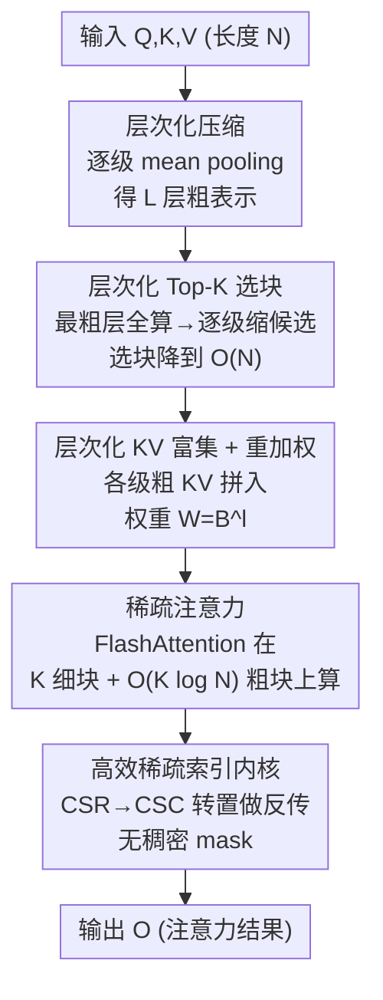

# Trainable Log-linear Sparse Attention for Efficient Diffusion Transformers

**会议**: CVPR 2026  
**论文**: [CVF Open Access](https://openaccess.thecvf.com/content/CVPR2026/html/Zhou_Trainable_Log-linear_Sparse_Attention_for_Efficient_Diffusion_Transformers_CVPR_2026_paper.html)  
**领域**: 模型压缩 / 高效注意力 / 扩散Transformer  
**关键词**: 稀疏注意力, 扩散Transformer, 对数线性复杂度, 长序列, GPU 内核

## 一句话总结
LLSA 把 Top-K 稀疏注意力的「单层粗选」扩展成「多层级粗到细」的层次结构，让选块阶段和注意力阶段的复杂度同时从 $O(N^2)$ 降到对数线性，再配上一个不构建稠密 mask 的稀疏索引反传内核，在 256×256 像素 DiT 上把注意力推理加速 28.27×、训练加速 6.09× 且不掉生成质量。

## 研究背景与动机
**领域现状**：Diffusion Transformer（DiT）是当前视觉生成的主力骨干，但它的全自注意力随 token 长度 $N$ 呈 $O(N^2)$ 增长。分辨率一上去（FLUX 用 4096 token、视频 DiT 动辄几十万 token），注意力就成了绝对瓶颈。一类主流提速思路是 **Top-K 稀疏注意力**：先把每个 block 的 token 压成一个粗 token，算粗 token 之间的相似度，给每个 query block 只挑出 K 个最相关的 key block 来真正算注意力。

**现有痛点**：这类方法（VSA、SLA 等）有两个绕不开的毛病。其一，**选块阶段仍是平方复杂度**——压缩后还有 $T=N/B$ 个粗 token，两两算相似度是 $O(T^2)=O(N^2/B^2)$，序列一长，这个 $O(N^2)$ 项就压过了真正算注意力的线性项，整体又被拖回平方。其二，**K 必须随序列变长而增大**才能维持质量，进一步推高开销。

**核心矛盾**：根子在于 **single-level（单层）设计**——只用一个固定粒度的粗视图去概括全局结构。序列越长，单一粗粒度越不足以表达全局，于是要么选块更贵（$O(N^2)$），要么 K 越调越大，两头都堵。

**本文目标**：让选块阶段和注意力阶段**同时**摆脱平方复杂度，并且在小 K 下还能保住全局上下文、不掉生成质量；同时要有一个能真正跑出理论复杂度的 GPU 内核（尤其是反传）。

**切入角度**：既然单层粗视图不够，那就用 $O(\log N)$ 个**逐级变粗**的层级来表达全局——这正是 H-Transformer、Multi-resolution Attention 等工作早就证明过的「稠密注意力矩阵可被层次化的粗注意力矩阵逼近」。本文把这个理论观察工程化到极长序列 DiT 训练上。

**核心 idea**：用「层次化粗到细的 Top-K 选择」把选块降到 $O(N)$，再用「层次化 KV 富集 + 重加权」把被稀疏化掉的全局信息用各级粗 token 补回来，从而在 K 很小时也保住质量；整套机制用纯稀疏索引（不建 mask）的内核实现，前向反向都是对数线性。

## 方法详解

### 整体框架
LLSA 的目标是把 Top-K 稀疏注意力的 $O(N^2)$ 降到 $O(N\log N)$。它沿用 Top-K 稀疏注意力的三步骨架——**压缩 → Top-K 选块 → 稀疏注意力**——但把每一步都「层次化」：压缩从单层变成 $L=\lfloor\log_B N - 1\rfloor$ 层的逐级 mean pooling；选块从「在一个粗层上一次选完」变成「从最粗层开始，逐级用上一层选中的索引缩小候选范围再选」；注意力阶段则在最细 token 之外，额外把各级选中的粗 KV token 拼进来（KV 富集），并按 block 大小给粗 token 加权（KV 重加权），以补偿稀疏化造成的全局信息损失。最后，整套算法配一个直接在稀疏索引上做前向/反向的 GPU 内核，避免构造 $T\times T$ 的稠密 mask。

### 关键设计

**1. 层次化 Top-K 选块：把 $O(N^2)$ 的选块降到 $O(N)$**

痛点在于：单层 Top-K 要在 $T=N/B$ 个粗 token 之间两两算相似度，这是 $O(T^2d)+O(T^2K)=O(N^2B^{-2}(d+K))$，序列一长就是整套算法的主导项。LLSA 的做法是先做**层次化压缩**：把 $Q,K,V$ 设为最细层 $Q^{(0)}$，然后用 block 大小 $B$ 的 mean pooling 递归下采样，第 $l$ 层的一个粗 token 概括第 $l-1$ 层的 $B$ 个 token，得到 $L$ 层金字塔 $Q^{(l)},K^{(l)},V^{(l)}\in\mathbb{R}^{N/B^l\times d}$。选块时**从最粗层往细层走**：在最粗层 $L$ 上对全部粗 token 算满相似度 $S^{(L)}=Q^{(L)}K^{(L)\top}$、取 Top-K；这 K 个被选中的索引意味着下一层每个 query block 只剩 $KB$ 个 key 候选，于是从次粗层起，每层只在「上一层选中的 $KB$ 个候选」里算相似度、再做稀疏 Top-K，逐级细化。

为什么这样能降到线性？因为第 $l$ 层只需在 $N/B^{l+1}$ 个 query block 和 $KB$ 个候选之间算分，逐层求和是一个几何级数：

$$\sum_{l=0}^{L-1} O\!\left(\frac{N}{B^{l+1}}KB\right) = O\!\left(NK\sum_{l=0}^{L-1}B^{-l}\right)=O(NK),$$

级数 $\sum B^{-l}<\frac{B}{B-1}$ 收敛到与 $N,K$ 无关的常数。这就把选块阶段从平方彻底拉成线性——这是 LLSA 区别于所有单层 Top-K 方法的根本所在。

**2. 层次化 KV 富集：用小 K 也保住全局上下文**

光把 K 个细块挑出来算注意力，会丢掉大量全局信息，所以旧方法只能靠**把 K 调大**来补，代价高。LLSA 反过来：在第 1 步逐级选块时，每一层都已经选出了一批粗 token，那就把这些**各级选中的粗 $K^{(l)}_i,V^{(l)}_i$ 一并拼进每个 query block 的 key/value 集合**，和最细的 $K^{(0)},V^{(0)}$ 一起算注意力。粗 token 携带的是不同粒度的全局上下文，正好填补稀疏选择造成的信息损失。由于层数是 $O(\log N)$、每层加 $O(K)$ 个粗 token，富集进来的额外 token 总数只有 $O(K\log N)$，注意力阶段复杂度为 $O(NK\log N)$。一个超参 $L_e$ 控制富集几层：$L_e=0$ 不加粗 token，$L_e=L$（默认）全加。

效果上这条最关键：实验里 LLSA 用 $K=8$ 就能在质量和效率上**双双超过** baseline $K=32$ 的设置——因为它不是靠堆 K 来覆盖全局，而是靠层级粗 token 直接把全局上下文喂进来。把它和第 1 步合起来，总复杂度 $O(NK)+O(NK\log N)=O(NK\log N)$，K 为常数时即 $O(N\log N)$。

**3. KV 重加权：让一个粗 token 顶它该顶的那么多细 token**

KV 富集有个隐患：一个粗 token 其实概括了底下 $B^l$ 个细 token 的信息，但在 softmax 注意力里它和一个普通细 token 权重一样，这显然不公平、信息被低估。作者的假设是「一个粗 token 对应的那批细 token 大致能被最近邻上采样还原」，因此每个 token 的重要性应当正比于它代表的 block 大小。具体就给第 $l$ 层的 $K^{(l)},V^{(l)}$ 乘一个权重 $W^{(l)}=B^l$（即一个由 16 个 token 平均得到的粗 token 权重为 16）。这一步零额外训练开销，却能把质量再往上抬——消融里 Top-K + KV 富集的 FID 是 26.09，加上重加权直接降到 24.18，**甚至好过全注意力的 24.91**。

**4. 无稠密 mask 的稀疏索引反传内核：让算法真正跑出对数线性**

理论复杂度漂亮，但若内核实现不对，照样跑不快。难点在**反传**：前向是 query-major 的，只要把 FlashAttention 里对 key/value 的稠密遍历换成按稀疏索引 gather 即可；但 key/value 的梯度反传是 key-major 操作，需要「每个 key 被哪些 query block 选中」的反向索引。旧方法（SLA/VSA）为此维护一个 $T\times T$ 的稀疏 mask，把复杂度从 $O(T)$ 拖回 $O(T^2)$，序列越长越慢。

LLSA 借用经典的 **CSR→CSC 稀疏矩阵转置**思路（Alg. 2）：把每个 key 对应的 query 索引压成一个变长扁平向量 $I_q\in\mathbb{R}^{TK}$，再用累积偏移 $C\in\mathbb{R}^{T+1}$ 标出每个 key 在 $I_q$ 里的起止。具体两遍扫描——先数每个 key 被多少 query 选中存进 $C'$、前缀和得到 $C$，再遍历一次把反向映射写进 $I_q$（更新用原子加，但因 K 很小、写冲突概率极低，原子争用开销可忽略）。有了 key-major 的 $(I_q,C)$，就能用稀疏-稠密矩阵乘（SpMM）累加直接做 KV 梯度，全程不建 mask。实测这个反传内核在不同序列长度下**吞吐近乎恒定**，证实了线性复杂度；mask 基线则随序列变长稳定退化。

### 损失函数 / 训练策略
LLSA 本身是注意力机制，沿用扩散/流匹配训练目标，无新增 loss。为把它落到 2D 像素 DiT（不切 patch、不过 VAE）上，作者补了三个工程项：**索引重排**——按 $2^i$ 大小的 patch 把空间相邻像素分组为连续 token，让 1D pooling 能把相似像素聚到一起；**噪声重缩放**——高分辨率需更强噪声维持 SNR，在流匹配 $x_t=(1-t)x_0+s\cdot t\epsilon$ 里引入 $s=n/64$（$n>64$ 时），把高分辨率的有效 SNR 对齐到 64×64；**低分辨率预训练**——高分辨率模型从低分辨率权重初始化，进一步省训练时间。

## 实验关键数据

### 主实验
在 FFHQ 128×128 / 256×256 上用 DiT-S 骨干，与两个可训练 Top-K 稀疏注意力 VSA、SLA 对比。为公平，给 baseline 更大的 K（128 用 K=20、256 用 K=32），LLSA 只用 K=8，属保守评测。吞吐为单卡 H200 上 $10^3$ pixel token/秒。

| 数据集 | 方法 | FID↓ | 训练吞吐↑ |
|--------|------|------|-----------|
| FFHQ-128 | Full Attention | 24.91 | 188.88 |
| FFHQ-128 | VSA | 26.91 | 421.02 |
| FFHQ-128 | SLA | 25.73 | 365.48 |
| FFHQ-128 | **LLSA** | **24.37** | **436.40** |
| FFHQ-256 | Full Attention | 38.77 | 61.64 |
| FFHQ-256 | VSA | 40.69 | 341.94 |
| FFHQ-256 | SLA | 39.98 | 304.85 |
| FFHQ-256 | **LLSA** | **39.29** | **375.34** |

ImageNet-256 上接入多阶段像素扩散模型 PixelFlow（只在最高分辨率阶段替换全注意力），训 10 epoch：

| 方法 | FID↓ | Inception Score↑ | 吞吐(img/s)↑ |
|------|------|------------------|--------------|
| VSA | 23.59 | 64.07 | 32.30 |
| SLA | 22.58 | 65.31 | 29.81 |
| **LLSA** | **20.41** | **73.21** | **34.16** |

两个 benchmark 上 LLSA 都同时拿下最优 FID 和最高吞吐，且都是在「baseline 用更大 K」的不利前提下做到的。

### 消融实验
DiT-S + 128×128 FFHQ，默认 K=8、B=16，训 20 epoch。

| 配置 | FID↓ | 吞吐↑ | 说明 |
|------|------|-------|------|
| Full Attention | 24.91 | 188.88 | 参照 |
| Top-K (L=1) | 28.21 | 483.91 | 纯单层稀疏，质量明显掉 |
| + KV 富集 (Le=1) | 26.09 | 302.92 | 补全局，FID 回升 |
| + KV 重加权 | 24.18 | 302.92 | 反超全注意力 |
| Top-K (L=2) | 27.98 | 500.38 | 多层级，吞吐再升 |
| + KV 富集 (Le=2) | 25.31 | 436.40 | — |
| + KV 重加权 | 24.37 | 436.40 | 多层版最终配置 |

| 实验组 | 关键对比 | 结论 |
|--------|---------|------|
| Block 大小 | B=16 vs B=64（同等激活 token 数） | 大 B 吞吐高但质量差很多；因层次化已削掉选块开销，故取 B=16 |
| Top-K 大小 | LLSA(K=8) vs Baseline(K=8/16/32) | LLSA K=8（FID 24.37）质量+效率双超 baseline K=32（25.88） |

### 关键发现
- **KV 富集 + 重加权是质量回升的关键**：纯单层 Top-K 的 FID 是 28.21，加富集到 26.09，再加重加权到 24.18，逐步把质量从「明显差于全注意力」拉到「优于全注意力」。
- **小 K 就够，靠的是层级而非堆 K**：得益于层次化 KV 富集，K=8 的 LLSA 即超过 K=32 的单层 baseline，说明全局上下文是用粗 token 补的、不是用大 K 暴力覆盖的。
- **越长越赚**：序列足够长时单层 L=1 被平方成本卡住，切到 L=2 有明显提升，正是对数线性该有的 scaling；反传内核吞吐随长度近乎恒定，而 mask 基线持续退化。
- **整体提速**：摘要给出注意力推理加速 28.27×、DiT 训练加速 6.09×（256×256，65,536 token，单 H200）。

## 亮点与洞察
- **把「层次化逼近注意力矩阵」这件偏理论的事，真正工程化到极长序列 DiT 训练上**：Multi-resolution Attention 早提过层次 Top-K，但只有理论、没有高性能 GPU 实现；本文补齐了基于 block sparse attention 的可训练落地，这才是它能跑出 28× 加速的现实价值。
- **选块和注意力两个阶段「同时」降复杂度**，而不是只优化其中一个——很多前作只把注意力算成线性，却忘了选块还是 $O(N^2)$，结果整体又被拖回平方；本文点破并解决了这个常被忽视的主导项。
- **KV 重加权 $W=B^l$ 是个零成本却好用的 trick**：仅按 block 大小给粗 token 加权，就把 FID 从 26.09 拉到 24.18 反超全注意力，可直接迁移到任何「用粗/池化 token 参与注意力」的稀疏注意力设计里。
- **CSR→CSC 稀疏索引转置做反传**，把「稀疏注意力训练难加速」的痛点（反传要建稠密 mask、$O(N^2)$）干净绕开，吞吐与序列长度解耦——这套内核思路对任何可训练稀疏注意力都通用。

## 局限与展望
- **主要在像素空间图像生成上验证**（FFHQ、ImageNet-256），视频等更长序列、latent-space 大模型（FLUX、Wan 等）上的实际收益还需更多证据；论文反复以视频长 token 为动机，但没直接在视频 DiT 上跑大规模实验。
- **层次化压缩用的是 mean pooling + 索引重排来保证空间局部性**，重排方案是为 2D 图像设计的；换到 3D 视频或不规则模态时，如何保证「池化把相似 token 聚在一起」需要重新设计。
- **超参较多**（L、$L_e$、K、B、噪声重缩放 s），不同分辨率/数据下的最优配置依赖调参，论文把详细 schedule 放进 Appendix，正文给的主要是 DiT-S 小模型规模。
- KV 重加权基于「粗 token≈最近邻上采样可还原」的近似假设，在高频细节丰富、池化损失大的区域可能不够准；这条假设的适用边界没有定量分析。

## 相关工作与启发
- **vs VSA / SLA（单层可训练 Top-K）**：两者都是单层 block 选择——VSA 对压缩后的粗 Q/K/V 做全注意力再加回稀疏输出，SLA 额外开一条线性注意力分支处理未选 token。本文指出它们的共性短板是选块仍 $O(N^2)$、且要靠大 K 维持质量；LLSA 用层级选块降到 $O(N)$、用 KV 富集在小 K 下保质量，且保持单分支结构（不像 VSA/SLA 引入额外注意力分支可能扭曲原注意力公式）。
- **vs Multi-resolution Attention（最相关的前作）**：同样做层次化 Top-K 选择，但它贡献偏理论、没有面向极长序列的高性能 GPU 实现；本文基于 block sparse attention 落地，并在长序列 DiT 训练上验证。
- **vs H-Transformer / Fast Multipole Attention / Radial Attention（静态规则的对数线性注意力）**：这些按绝对位置/距离用固定层次分解或静态 mask；LLSA 是**动态按内容选 key**的层次 Top-K，更贴合扩散生成里随内容变化的注意力模式。
- **vs 训练无关的稀疏 DiT 加速（预定义稀疏模式/动态搜索）**：那类不需训练但稀疏模式固定或启发式；LLSA 是可训练稀疏注意力，质量上限更高，代价是要参与训练。

## 评分
- 新颖性: ⭐⭐⭐⭐ 把层次化 Top-K 从理论推到可训练、可跑极长序列的工程落地，并点破「选块阶段才是平方主导项」这一常被忽视的问题，方向清晰但思想根基（层次逼近）有前作。
- 实验充分度: ⭐⭐⭐⭐ 消融拆解到位（attention type / block size / K 三组）、对比保守（给 baseline 更大 K），但主要限于像素图像生成、缺视频和大模型实证。
- 写作质量: ⭐⭐⭐⭐ 复杂度推导、算法伪码、内核细节都交代得清楚，图文对照充分。
- 价值: ⭐⭐⭐⭐ 对数线性 + 无 mask 反传内核是可直接复用的实用组件，对长序列 DiT 训练有现实加速意义（推理 28×、训练 6×）。

<!-- RELATED:START -->

## 相关论文

- [\[CVPR 2026\] BinaryAttention: One-Bit QK-Attention for Vision and Diffusion Transformers](binaryattention_one-bit_qk-attention_for_vision_and_diffusion_transformers.md)
- [\[CVPR 2026\] ResCa: Residual Caching for Diffusion Transformers Acceleration](resca_residual_caching_for_diffusion_transformers_acceleration.md)
- [\[CVPR 2026\] PPCL: Pluggable Pruning with Contiguous Layer Distillation for Diffusion Transformers](ppcl_pluggable_pruning_dit_distillation.md)
- [\[ICLR 2026\] FASA: Frequency-Aware Sparse Attention](../../ICLR2026/model_compression/fasa_frequency-aware_sparse_attention.md)
- [\[ICML 2026\] Token Sparse Attention: Efficient Long-Context Inference with Interleaved Token Selection](../../ICML2026/model_compression/token_sparse_attention_efficient_long-context_inference_with_interleaved_token_s.md)

<!-- RELATED:END -->
