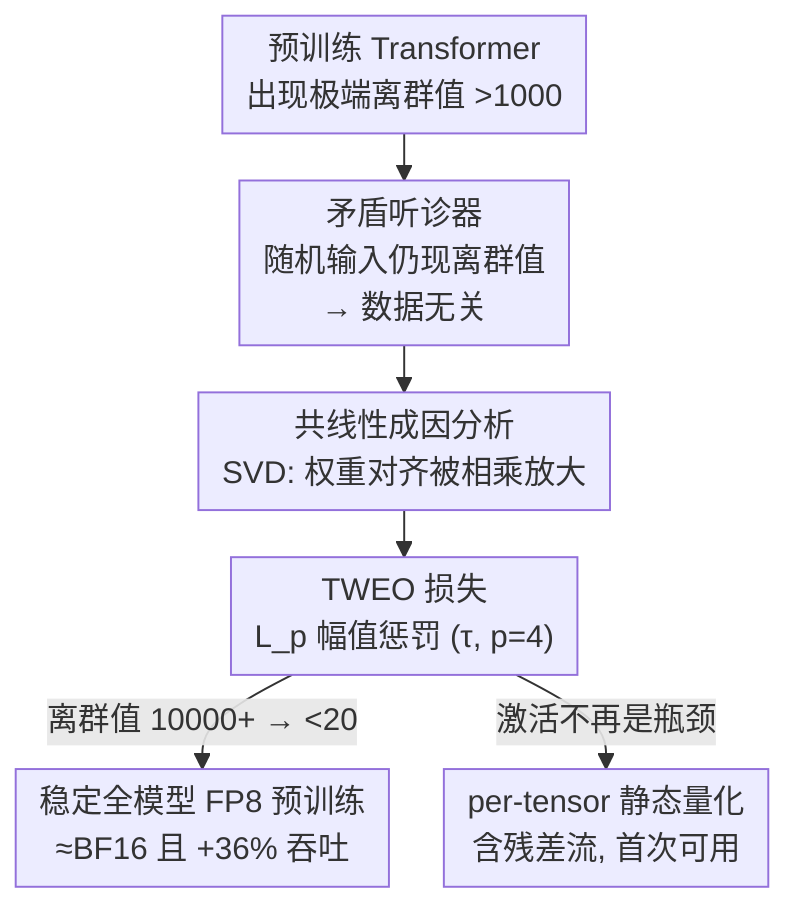

# TWEO: Transformers Without Extreme Outliers Enables FP8 Training And Quantization For Dummies

**会议**: CVPR 2026  
**论文**: [CVF Open Access](https://openaccess.thecvf.com/content/CVPR2026/html/Liang_TWEO_Transformers_Without_Extreme_Outliers_Enables_FP8_Training_And_Quantization_CVPR_2026_paper.html)  
**代码**: 待确认  
**领域**: 模型压缩  
**关键词**: FP8训练, 激活离群值, 静态量化, 正则损失, Transformer

## 一句话总结
本文提出 TWEO，一个仅靠一项正则损失项就能把 Transformer 激活极端离群值从 10000+ 压到 20 以下的"非侵入式"方法：它先用对照实验和 SVD 分析证明极端离群值并非数据驱动、而是权重共线性导致的"机械产物"，再据此设计一个直接惩罚激活幅值的 $L_p$ 损失，从而让全模型 FP8 预训练（不靠任何混精度工程和架构改动）稳定收敛、达到 BF16 水平并提速 36%，同时让最简单的 per-tensor 静态量化（含残差流）首次可用。

## 研究背景与动机

**领域现状**：现代芯片原生支持 FP8（8 比特浮点）计算，配合 Transformer Engine 这类库，理论上能把训练吞吐翻倍、显著降低显存带宽。但要真正吃到这份红利，前提是激活值能塞进 FP8 极窄的动态范围里（E4M3 仅 ±448）。

**现有痛点**：现实里 Transformer 训练会冒出"极端离群值"（massive outliers，幅值 >1000，极端时上万），它们直接撑爆 FP8 量程。后果有两条：① 在原生低比特训练里，离群值一出现就数值溢出，loss 突然爆炸、训练崩溃；② 在训练后量化（PTQ）里，离群值把量化区间撑得极宽，逼着算法在截断误差和舍入误差间做糟糕的权衡——实验显示哪怕只把 0.1% 的离群值清零，验证困惑度都会暴涨 600–1000%。为了绕开它，主流方案要么把敏感模块（embedding、norm、MoE gate）留在 BF16 做复杂的混精度工程（DeepSeek-V3 即如此），要么动刀改架构（加 register token、改 softmax、改激活函数）。这些方案要么工程成本高、吃掉 FP8 的效率收益，要么侵入性强、缺乏通用性。

**核心矛盾**：所有现有方案都建立在一个共识假设上——极端离群值是数据驱动、不可避免的（来自 token 频率、special token、no-op 注意力等）。既然认为它"避不掉"，就只能想办法"绕"。但本文质疑：如果离群值根本不是数据造成的，那这套"绕"的范式从一开始就找错了方向。

**切入角度**：作者做了一个反事实测试——如果把输入换成完全随机的 token / 像素（去掉一切语义、频率、空间结构），离群值还在不在？结果是：预训练模型喂随机输入，照样产生 >1000 的极端离群值；而随机初始化的模型喂真实数据，激活幅值始终 <10。这说明离群值的根源在**训练好的权重**里，而非输入语义。ViT 上图像 patch 没有 LLM 里的高频 special token，却同样出现极端离群值，进一步佐证这点。

**核心 idea**：既然离群值是权重结构（共线性）造成的"机械产物"，那解决方案也应该是"机械的"——不去改架构、不去绕，而是在训练时直接用一个损失项惩罚过大的激活幅值，从根上掐掉离群值的形成。这就是 TWEO（Transformers Without Extreme Outliers）。

## 方法详解

### 整体框架

TWEO 的逻辑是一条"先证因、再用一招治本、最后收两份红利"的链路。第一步用 **矛盾听诊器（Contradiction Stethoscope）** 做对照实验，证明极端离群值是数据无关的；第二步用 **SVD 共线性分析** 给出离群值的机械成因（权重矩阵奇异向量与输入对齐被相乘放大）；第三步据此设计 **TWEO 损失**，一项加在主任务损失上的正则项，直接惩罚每个 Transformer block 输出激活的幅值；得到的"无离群值模型"自然带来两份下游收益：**稳定的全模型 FP8 预训练** 与 **可用的 per-tensor 静态量化**（含残差流）。

整个方法不改任何网络结构、不引入任何额外模块，只往 loss 上加一项，因此可以即插即用到任意 Transformer 变体、跨视觉与语言模态。

### 关键设计

**1. 矛盾听诊器：用对照实验证伪"离群值是数据驱动"**

现有所有方案都默认极端离群值由输入数据（token 频率、special token、no-op 注意力）造成，所以只能"绕"。本文要先推翻这个前提。矛盾听诊器的逻辑是一个证伪测试（Assumption 1）：把输入换成刻意抹掉数据特殊结构的随机样本（LLM 用 `torch.randint` 全词表均匀采样、ViT 用 `[0,255]` 均匀像素），如果极端离群值仍以相近规模出现，就说明这些数据属性对离群值的产生并非必要。

实验给出三组对照（以 Qwen2.5-0.5B 为例）：① 预训练模型 + 真实数据 → 多数层出现 >1000 的离群值；② 随机初始化模型 + 真实数据 → 激活幅值 <10；③ 预训练模型 + 随机输入 → 仍然产生极端离群值。每层报告 Avg Max / Avg Min / Mean-Abs 三个统计量作为紧凑摘要。结论很干净：离群值与**训练得到的权重**强绑定，与输入语义无关（Assumption 2）。这一步是整篇论文的"地基"——只有先证明成因是机械的，后面"用损失治本"才站得住脚。

**2. 共线性成因：SVD 揭示离群值是权重对齐的相乘放大**

证明了数据无关还不够，得说清"机械"到底是什么机制。作者聚焦 MLP 层（已知离群值主要源于此）。把经典 MLP 近似为 $y = BAx$（暂时忽略激活函数），分析输出第 $k$ 个元素 $y_k$ 何时变成离群值。对上投影矩阵 $A$ 做 SVD，$A=\sum_{i} s_i u_i v_i^T$，则

$$y_k = w^T A x = \sum_{i=1}^{d_1} s_i (w^T u_i)(v_i^T x)$$

其中 $w^T$ 是下投影矩阵 $B$ 的第 $k$ 行。这个式子揭示了离群值的来源：当 $B$ 的行向量 $w$ 与 $A$ 的某个左奇异向量 $u_i$ 共线时，$(w^T u_i)$ 会很大；若此时输入 $x$ 又与对应右奇异向量 $v_i$ 高度对齐使 $(v_i^T x)$ 也很大，两个大值相乘就把 $y_k$ 推成极端离群值。

作者在 ViT-B 上验证：定位到第一个出现离群值的 MLP 层（真实离群值 880），对其主奇异向量做分析得 $s_1=18.189$、$w^T u_1=-9.1847$（权重高度对齐）、$v_1^T x=-5.6165$（输入高度对齐），代入式子模拟值 938.28，再补上 GELU 后变成 884.29——与真实值 880 的相对误差 <0.5%。GLU 类激活（Llama、Qwen）里 gate_proj 与 up_proj 行向量的（反）共线性还会进一步放大这一效应。这个分析把"机械产物"具体到了"权重奇异向量对齐"，从而指明：要除掉离群值，不该去改 MLP/Attention 架构，而该**直接在训练中抑制这种放大效应**。

**3. TWEO 损失：用软阈值 + 高次幂在"保常态、压极端"间精确分工**

这是真正的"方法"。TWEO 把一项正则加到主任务损失上：$\mathcal{L}_{\text{total}} = \mathcal{L}_{\text{task}} + \lambda(t)\,\mathcal{L}_{\text{TWEO}}$。关键在于它监控的是**宏观层面**——每个 Transformer block 经过 $y = x + \text{MLP}(\text{LN}(x))$ 之后的最终输出激活 $A^{(l)}$，对全部 $L$ 个 block 取平均的缩放 $L_p$ 损失：

$$\mathcal{L}_{\text{TWEO}} = \frac{1}{L}\sum_{l=1}^{L}\mathbb{E}\left[\left(\frac{|A^{(l)}|}{\tau+\epsilon}\right)^p\right]$$

其中期望对 batch / 序列长度 / 隐藏维度取均值，$\tau>0$ 是幅值缩放因子（软阈值），$p$ 是惩罚幂次，$\epsilon$（如 1e-6）保数值稳定。设计精髓在 $\tau$ 与 $p$ 的协同（论文取 $\tau\in[2,5]$、$p=4$）：与 Hinge 损失 $\max(0,|A|-\tau)$ 的硬阈值不同，$\tau$ 是软阈值，不引入不连续梯度、有利训练稳定，同时定义了激活幅值的目标尺度。

$p=4$ 的高次幂带来强烈的非线性分工：当 $|A|=0.5\tau$ 时惩罚仅 $(0.5)^4=0.0625$，几乎不管常态小值；当 $|A|=\tau$ 时惩罚为 $1$，设定目标尺度；当 $|A|=10\tau$（约 20–50）时惩罚高达 $(10)^4=10000$，对极端离群值施加压倒性的代价。于是 TWEO 只精准地压住分布的极端尾部（FP8 溢出的根因），而几乎不影响正常激活的训练。默认 $\lambda(t)=0.01$ 全程恒定，cosine 退火只是收敛期略降正则强度的可选变体。正因为它作用于激活的物理幅值而非任务语义，可无缝迁移到视觉、语言乃至生成模型。

**4. 残差流也能量化：把"无离群值"红利推到最激进的 per-tensor 静态量化**

这是 TWEO 在下游撬动的"范式转变"，而非额外模块。共识认为激活离群值是量化的最大障碍，导致领域放弃了最硬件友好、最快的 per-tensor 静态量化，被迫用更贵的 per-token / per-channel 方案；更棘手的是残差流 $y=x+f(x)$ 会逐层累积离群值，逼得 SmoothQuant 这类"难度转移"方法只能在 $f(x)$ 内部操作、把残差流 $x$ 留在 BF16/FP32，从而带来频繁的 BF16↔int8 类型转换和显存/延迟开销。

TWEO 既然从根上消除了离群值，最简单的 AbsMax 对称静态量化（$s=\max(|X|)+\epsilon$，$X_q=\text{round}(X/s\cdot Q_b)$）就直接可用，甚至首次让**残差流也能量化**。实验显示：基线模型一旦量化残差流就灾难性崩溃（PPL 从 14.81 飙到 1876.70），而 TWEO 模型即便用 AbsMax 量化残差流仍维持 13.06/12.63 的 PPL，优于所有基线；在 TWEO 模型上再叠加复杂的 SmoothQuant，相比简单 AbsMax 收益微乎其微——说明 TWEO 已把激活和权重两侧的量化难度都抹平，复杂的难度转移方法变得没必要。

## 实验关键数据

### 主实验

视觉侧（ImageNet，Swin/ViT）证明 TWEO 在不改架构的前提下，把训练峰值离群值压低两个数量级而精度几乎不变：

| 模型 | 改架构? | Top-1 (%) | 训练峰值离群值 | 训练后离群值 |
|------|---------|-----------|----------------|--------------|
| Swin-T 基线 | - | 81.2 | 1556 | 534 |
| Swin-T TWEO | 否 | 81.4 | **22** | **15** |
| Swin-S 基线 | - | 82.7 | 6402 | 1758 |
| Swin-S TWEO | 否 | 82.8 | **35** | **18** |
| ViT-B 基线 | - | 81.3 | 1579 | 106 |
| ViT-B TWEO | 否 | 81.3 | **38** | **16** |

语言侧 FP8 全模型预训练是核心场景。标准 FP8 训练在 124M–7B 全尺度灾难性崩溃，TWEO 全部稳定收敛、PPL 追平甚至超过 BF16：

| 模型 | 参数 | PPL (FP8) | PPL (BF16) | 训练峰值离群值 |
|------|------|-----------|------------|----------------|
| GPT2 基线 | 124M | 169.81 | 20.04 | 823 |
| GPT2 +TWEO | 124M | **19.26** | 18.68 | **17** |
| GPT2-medium 基线 | 350M | 127.34 | 16.77（崩溃前） | 24563 |
| GPT2-medium +TWEO | 350M | **15.64** | 15.18 | **19** |
| GPT2-xl 基线 | 1.5B | 93.28 | 13.84 | 32889 |
| GPT2-xl +TWEO | 1.5B | **12.58** | 12.39 | **19** |
| GPT2-7B +TWEO | 7B | **12.02** | - | **20** |

基线在 medium/large 上已 `#`（崩溃，报崩前最优 checkpoint），TWEO 把所有尺度的峰值幅值稳稳控制在 ≤20。FP8 训练相比 BF16 还带来约 **+36% 吞吐**。

### 消融 / 分析实验（PTQ 与残差流）

8-bit AbsMax PTQ（T=per-tensor，C=per-channel，K=per-token）下，基线在涉及 per-tensor 激活量化时全面崩溃，TWEO 则让最便宜的方案也可用：

| 模型 | 方法 | W8(T)A8(T) | W8(C)A8(K) |
|------|------|------------|------------|
| GPT-2 Medium (350M) | Default | 1491.11（崩溃） | 19.95 |
| GPT-2 Medium (350M) | TWEO | **16.50** | 15.40 |
| GPT-2 Large (0.8B) | Default | 43720.76（崩溃） | 23.35 |
| GPT-2 Large (0.8B) | TWEO | **18.88** | 14.07 |
| GPT-2 XL (1.5B) | Default | 1872.83（崩溃） | 23.35 |
| GPT-2 XL (1.5B) | TWEO | **13.09** | 12.63 |

残差流量化对照（GPT-2 XL）：

| 方法 | 量化残差流? | W8(C)A8(T) / W8(C)A8(K) |
|------|------------|--------------------------|
| Default + SmoothQuant | 否 | 14.81 / 14.01 |
| Default + SmoothQuant | 是 | 1876.70 / 21.93（崩溃） |
| TWEO + AbsMax | 是 | **13.06 / 12.63** |
| TWEO + SmoothQuant | 是 | 12.89 / 12.51 |

### 关键发现

- **离群值峰值是稳定性的命门**：TWEO 把峰值从上万压到 ≤20，FP8 训练就从"必崩"变成"≈BF16"，二者一一对应——证实离群值正是 FP8 溢出/崩溃的直接根因。
- **"激活比权重更难量化"被推翻**：在 TWEO 的 GPT-2 XL 上，per-token 激活量化 A8(K) 的 PPL（12.43）甚至优于 per-channel 权重量化 W8(C)（12.58），激活不再是瓶颈。
- **最便宜的全 per-tensor 量化反超 BF16 基线**：GPT-2 Medium 的 W8(T)A8(T) TWEO 得 16.50，不仅碾压基线的 1491.11，还略优于基线的 BF16 PPL（16.77）。
- **复杂方法变冗余**：在 TWEO 模型上叠 SmoothQuant 相比简单 AbsMax 几乎无增益，说明难度转移技术在"无离群值模型"上失去用武之地。
- **超参鲁棒**：$\tau=3$、$p=4$、$\lambda=0.01$ 在所有视觉/语言任务上通用，无需逐任务调参。

## 亮点与洞察

- **"换问题"而非"解问题"**：现有工作都在"如何更聪明地绕过离群值"上内卷，TWEO 直接证明离群值可以从根上消除，把整个研究问题简化掉——这种重新定义问题的视角是最大的"啊哈"。
- **证因—治本的闭环很完整**：矛盾听诊器（证数据无关）+ SVD 共线性（给机械成因）+ $L_p$ 损失（按成因下药），三步逻辑自洽，模拟值与真实离群值 <0.5% 误差的定量验证尤其有说服力。
- **$\tau$/$p$ 的非线性分工很巧**：用一个 $p=4$ 的高次幂 + 软阈值 $\tau$，在同一项损失里同时实现"放过常态、重罚极端"，比 Hinge 硬阈值更稳、比逐模块改造更简单，这个 trick 可迁移到任何"只想压尾部、不想动主体"的正则场景。
- **残差流量化解锁**：把残差流从"必须留高精度"变成"可整体量化"，对推理侧消除 BF16↔int8 类型转换、降低延迟/显存有直接工程价值，并为 W4A8/W4A4 等更激进低比特和硬件协同设计（去掉复杂量化逻辑、做更精简的计算核）打开空间。

## 局限性 / 可改进方向

- **未在超大模型上验证**：作者承认受算力限制，最大只做到 7B，700B 级模型上离群值与 TWEO 的表现仍待确认。
- **从零训练为主**：本文模型都是 from scratch 训练，对已有预训练模型能否通过微调"事后去离群值"还只是 future work——这对实际复用现成大模型很关键，目前是空白。
- **共线性分析做了简化**：式 (1) 忽略了激活函数，存在 false positive（预测离群但实际被 GELU 抑制），作者论证 false positive 不影响"根因"结论，但完整的非线性刻画仍未给出。
- **缺端到端推理实测**：残差流可量化的工程收益（延迟/能耗）多是定性论述，论文正文未给出实际推理加速/能耗的量化数据（部分在附录）。
- **可改进方向**：把 TWEO 当作微调正则去"清洗"已有大模型的离群值；探索 $\tau$ 随层/随训练动态自适应；结合 FP4 训练与推理。

## 相关工作与启发

- **vs DeepSeek-V3 的混精度工程**：DeepSeek-V3 把 embedding、LM head、norm 等离群值高发区强制留在 BF16/FP32，并对 FP8 模块做 tile-wise/block-wise 细粒度量化来"隔离"局部离群值，需要大量定制算子、难以迁移；TWEO 从根上消除离群值，从而能把所有 Linear + LayerNorm（含 LM head）一股脑塞进 FP8 autocast，用最粗粒度的 DelayedScaling + 单一 per-tensor scaling 也不崩。
- **vs 架构改造类（ViT-R / Clipped Softmax / OutEffHop / Smooth-SwiGLU / FOG）**：这些方法加 register token、改 softmax、改激活函数甚至重设计架构来吸收/抑制离群值，侵入性强、通用性差，且很多基于"离群值数据驱动"的（被本文证伪的）假设；TWEO 非侵入、即插即用、跨模态。
- **vs PTQ 难度转移类（SmoothQuant / OS+ / AWQ / SpinQuant / QuaRot）**：它们承认激活（尤其残差流）因离群值难量化，于是用离线缩放、通道平移、旋转等把难度从激活转移到权重，增加算法与推理复杂度且被迫保残差流高精度；TWEO 直接除掉离群值，让最简单的 AbsMax per-tensor 静态量化（含残差流）就够用，使难度转移变得多余。

## 评分
- 新颖性: ⭐⭐⭐⭐⭐ 推翻"离群值数据驱动"的共识，用对照实验 + SVD 给出机械成因并据此设计极简损失，重新定义了问题本身
- 实验充分度: ⭐⭐⭐⭐ 覆盖视觉/语言、124M–7B、FP8 训练与 PTQ 多场景且证据闭环，但缺超大模型与端到端推理加速实测
- 写作质量: ⭐⭐⭐⭐⭐ 证因—治本逻辑清晰，定量验证（模拟值误差 <0.5%）极具说服力，"for dummies"的卖点讲得很到位
- 价值: ⭐⭐⭐⭐⭐ 把 FP8 训练和硬件友好静态量化从"专家定制"降为"开箱即用"，对低比特训练与推理、硬件协同设计有现实推动力

<!-- RELATED:START -->

## 相关论文

- [\[CVPR 2026\] LS-ViT: Least-Squares Hessian Based Block Reconstruction for Low-Bit Post-Training Quantization of Vision Transformers](ls-vit_least-squares_hessian_based_block_reconstruction_for_low-bit_post-trainin.md)
- [\[CVPR 2025\] Q-DiT: Accurate Post-Training Quantization for Diffusion Transformers](../../CVPR2025/model_compression/q-dit_accurate_post-training_quantization_for_diffusion_transformers.md)
- [\[CVPR 2026\] BinaryAttention: One-Bit QK-Attention for Vision and Diffusion Transformers](binaryattention_one-bit_qk-attention_for_vision_and_diffusion_transformers.md)
- [\[CVPR 2026\] ResCa: Residual Caching for Diffusion Transformers Acceleration](resca_residual_caching_for_diffusion_transformers_acceleration.md)
- [\[CVPR 2026\] Saliency-Driven Token Merging for Vision Transformers](saliency-driven_token_merging_for_vision_transformers.md)

<!-- RELATED:END -->
