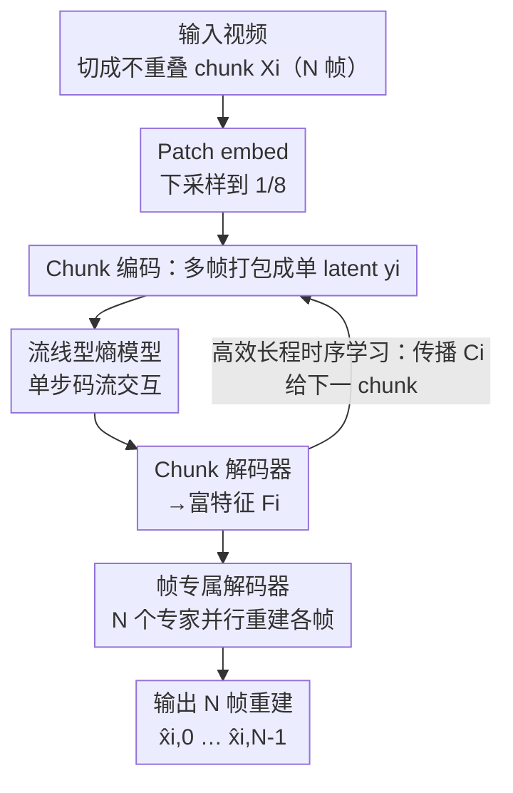

# Ultra-Fast Neural Video Compression

**会议**: CVPR 2026  
**arXiv**: [2606.04410](https://arxiv.org/abs/2606.04410)  
**代码**: https://github.com/microsoft/DCVC (有)  
**领域**: 模型压缩 / 神经视频编码  
**关键词**: 神经视频编解码、chunk 编码、帧专属解码器、熵编码加速、率失真复杂度权衡

## 一句话总结
本文提出 DCVC-UF，用"把一整段（chunk）多帧编码进单个紧凑 latent、再并行解码回所有帧"的 chunk 编码范式，彻底甩掉逐帧运动估计，配合帧专属解码器和单步熵解码，在 1080p、4090 GPU 上做到 371 编码 / 274 解码 FPS 的同时还把码率比 VTM(LD) 省了 42.2%，刷新神经视频编码的率-失真-复杂度 SOTA。

## 研究背景与动机
**领域现状**：神经视频编解码器（NVC）已经把压缩率做到超越传统标准编码器 H.266/VTM 的水平，其中 DCVC 系列靠"latent 空间里的特征传播（feature propagation）隐式建模跨帧时序相关性"成为 SOTA。为追上传统编码器里 hierarchical-B 编码 33.8% 的码率收益，近期 NVC 也纷纷照搬双向参考的层级 B 结构。

**现有痛点**：这些方法虽然压缩率高，但**计算复杂度和工程复杂度都过高，落地速度上不去**。它们仍是**逐帧**处理：每一帧都要靠显式运动矢量（motion vector）去对齐参考帧。运动矢量只能刻画两帧之间的像素位移，无法表达跨多帧的长程相关；换一个参考帧就得重算一套运动矢量；遇到复杂运动或新内容时运动矢量还会失效，既额外烧码率，又把系统复杂度（内存 I/O、函数调用、CPU-GPU 同步）拉满。另一条路是 INR / 高斯泼溅这类逐视频在线过拟合，解码快但编码要给每段视频单独优化，编码 FPS 低到 $10^{-3}$ 量级。

**核心矛盾**：逐帧 + 显式运动这套范式，把"压缩率"和"实际编解码吞吐"死死绑在一起——想要高压缩率就得堆复杂的运动模块，而这些模块带来的算子数、内存搬运、同步开销恰恰是实际速度的瓶颈。同时逐帧的 latent 表示让训练长视频的代价随帧数线性膨胀，限制了长程时序的利用。

**本文目标**：拿掉显式运动、把多帧打包并行处理，从而同时(1)大幅提升编解码吞吐、(2)更高效地建模长程时序、(3)简化熵编码的码流交互。

**切入角度**：作者借鉴视频生成里的"时空自编码器（spatial-temporal autoencoder）"——把原始像素压成紧凑 latent——再叠加运动矢量-free 的 DCVC-RT 思路。早期基于时空自编码器的 NVC 只学单 chunk 内部相关、忽略 chunk 间相关，压缩率受限；本文要在保留并行优势的同时把跨 chunk 的长程时序补回来。

**核心 idea**：用 **chunk 编码**代替逐帧编码——把连续 $N$ 帧打包成一个紧凑 latent 一起编、一起并行解，用跨帧交互模块隐式学时空相关、用帧专属解码器各管一帧重建，并把熵解码的码流交互压成单步。

## 方法详解

### 整体框架
DCVC-UF 建立在 DCVC 系列之上，核心是把视频切成**互不重叠的 chunk**，每个 chunk 含 $N$ 帧。对一个 chunk $X_i=\{x_{i,0},\dots,x_{i,N-1}\}$：先经 patch embedding 下采样到 1/8 分辨率，再以**时序 chunk 上下文** $C_i$ 为条件喂进 chunk 编码器，编码器把整段的时空信息蒸馏成单个紧凑 latent $y_i$；$y_i$ 量化为 $\hat{y}_i$ 后经熵模型转成码流。解码时反向：从码流解析出 $\hat{y}_i$，喂进 chunk 解码器得到富特征 $F_i$，$F_i$ 一方面被 $N$ 个**帧专属解码器**并行重建出各帧 $\{\hat{x}_{i,0},\dots,\hat{x}_{i,N-1}\}$，另一方面**传播给下一个 chunk** 作为新的时序上下文 $C_{i+1}$，实现跨 chunk 的长程时序传递。整个 chunk 内所有帧并行处理，是高吞吐的根源。它源自低延迟的 DCVC-RT（已无显式运动），并把"无运动"优势放大成"高吞吐"。

chunk 大小可调：$N=8$ 时是高吞吐（HT）模式、带 chunk 内的延迟（类似 hierarchical-B）；$N=1$ 退化为单帧 chunk，即低延迟（LD）模式。

### 关键设计

**1. Chunk 编码：多帧打包成单 latent，干掉逐帧运动**

针对"逐帧 + 显式运动"既慢又复杂的痛点，本文把连续 $N$ 帧整体编码进**一个**紧凑 latent $y_i$、再同时解码回全部帧，而不是一帧一帧串行跑。这一步直接消掉了 DCVC-RT 之前那套在帧对之间反复进行的运动估计、运动熵编码、运动补偿，连带砍掉它们引入的内存 I/O 和函数调用开销——这些恰是制约实际编解码速度的关键瓶颈。chunk 内的时空相关由**跨帧交互模块**隐式联合建模（不再依赖只能描述两帧位移的运动矢量），让模型自动学出比显式运动更灵活、能跨多帧的相关性。消融里仅引入 chunk 编码（不加帧专属解码器）就把解码从 105.3 FPS 拉到 349.1 FPS，吞吐提升立竿见影。

**2. 帧专属解码器：每个时序位置配一个"专家"**

chunk 编码若用一个统一解码器重建所有帧，等于让它当"万金油"——既要重建 chunk 里第 0 帧又要管第 7 帧，不同时序位置内容差异大，优化困难、重建质量打折。本文给 chunk 内**每个帧索引分配一个专属解码器**：chunk 解码器先产出含全部 $N$ 帧时空信息的富特征 $F_i$，再由 $N$ 个解码器并行、各自只负责对应位置那一帧。这个设计在精神上接近 Mixture-of-Experts——每个解码器是它那个时序位置的"专家"，好处是(1)各解码器只学和自己位置最相关的模式、单个优化更简单；(2)天然契合 chunk 的并行处理、无序列依赖；(3)参数利用更高效，容量都花在自己位置的难点上而非泛化到所有位置。消融显示：在 chunk 编码基础上加帧专属解码器，码率节省从 10.1% 回升到 25.3%，而解码仍维持 343.2 FPS——几乎把"chunk 并行掉的压缩率"补了回来。

**3. 流线型熵模型：解耦 scale 与 mean，码流交互压成单步**

之前的四叉树式熵编码（quadtree partition）把 latent 切成四个 partition，每个 partition 的解码都要依赖已解码 partition 来估计自己的分布参数（均值 $\mu$、尺度 $\sigma$），于是要**四步**反复与码流交互：多次算术解码调用、内存 I/O、以及算术解码与神经网络推理之间昂贵的同步（若算术解码在 CPU 上还要跨 CPU-GPU 切换）。本文的关键洞察是：**算术编解码只依赖 scale**——编码端量化 $\hat{r}_i=\text{round}(y_i-\mu_i)$ 后用 $\sigma_i$ 做算术编码，解码端仅用 $\sigma_i$ 恢复 $\hat{r}_i$，最后 $\hat{y}_i=\hat{r}_i+\mu_i$，mean 只是事后平移分布中心、与码流无关。据此把 mean 和 scale 的估计**解耦**：参数估计网络以 $s_i$（由超先验 $\hat{z}_i$ 和时序上下文 $C_i$ 导出）为输入，一次前向就同时预测第一个 partition 的 $\mu_i^0$ 和**全部四个 partition 的 scales $\sigma_i$**。由于码流解码只需 scale，于是四个 partition 的算术解码可合并为**单步**完成；mean 仍保留四步渐进估计以保住空间-通道相关建模能力，但它不碰码流、全程在 GPU 上跑、无需同步。消融里加上流线型熵模型把解码从 343.2 推到 453.3 FPS。

**4. 高效长程时序学习：单 latent 让训练长视频成为可能**

DCVC-FM 早已证明把训练视频从 7 帧拉到 32 帧能显著提压缩率，但逐帧方法里每帧都要一份独立 latent，训练长序列的显存/算力代价随帧数暴涨，长程上下文用不起来。chunk 编码把整段 $N$ 帧压进单个紧凑 latent，**大幅缩小一段视频的总 latent 体积**：batch size 为 1、$512\times512$ 分辨率下，24GB 显存可训到 1024 帧。更长的训练上下文同时利好 chunk latent 的生成和熵模型的分布估计——模型能学到跨多个 chunk 的重复纹理、场景结构与运动规律，传播的 $C_i$ 把关键信息带向后续 chunk 提升压缩效率。消融里把训练序列从基础设置扩到 128 帧，码率节省从 23.4% 直接跳到 31.6%，且解码 FPS 不变。

### 损失函数 / 训练策略
两档网络规模 DCVC-UF (HT-S/HT-L)，HT 用 chunk 大小 $N=8$，LD 用 $N=1$。训练遵循 DCVC-FM：先在现成 7 帧 Vimeo-90k 上训练，再用从原始 Vimeo 视频生成的更长序列微调。虽然 chunk 编码理论上支持 $512\times512$、1024 帧训练，但受限于难以收集足量高质量长视频，当前微调用 128 帧序列，更长数据集留作未来工作。测速采用逐 chunk 串行编码，尚未启用跨 chunk 流水并行（如重叠不同 chunk 的网络推理与熵编码），仍有进一步加速空间。

## 实验关键数据

### 主实验
BD-Rate（%）以 VTM-17.0 (LD) 为锚点，YUV420、全帧、PSNR 评估，负值代表省码率；速度在 1080p、4090 GPU 上测真实码流读写。

| 方法 | 平均 BD-Rate | 编码 FPS | 解码 FPS | 延迟类别 |
|------|------|------|------|------|
| VTM-17.0 (LD) | 0.0（锚点） | 0.01 | 23.6 | LD |
| DCVC-RT | −21.0 | 118.8 | 105.3 | LD |
| **DCVC-UF (LD)** | −9.5 | **313.6** | **353.8** | LD |
| VTM-17.0 (Hier-B) | −33.8 | 0.01 | 23.1 | 延迟松弛 |
| **DCVC-UF (HT-S)** | −31.6 | **655.9** | **453.3** | 延迟松弛 |
| **DCVC-UF (HT-L)** | **−42.2** | **371.1** | **273.6** | 延迟松弛 |

要点：HT-L 平均省码率 42.2%，超过 VTM(Hier-B) 的 33.8%，且最大延迟仅 7 帧（chunk=8）远小于 VTM 的 31 帧；若 VTM(Hier-B) 也用 GOP=8，其节省降到 23.7%，凸显 chunk 编码的压缩效率。LD 版相比 DCVC-RT 压缩率略低，但解码加速超过 $3\times$。

### 复杂度与可扩展性
以 VTM-17.0 (LD) 为锚点，MACs 在 1080p 上测：

| 模型 | 平均 BD-Rate | MACs/帧 | 参数量 |
|------|------|------|------|
| DCVC-FM | −21.3% | 2642G | 18.3M |
| DCVC-RT | −21.0% | 385G | 20.7M |
| DCVC-UF (LD) | −9.5% | 170G | 9.7M |
| DCVC-UF (HT-S) | −31.6% | 211G | 81.2M |
| DCVC-UF (HT-L) | −42.2% | 343G | 120.5M |

HT-S 仅 211G MACs/帧就拿到 31.6% 节省，远低于 DCVC-FM 的 2642G。跨 GPU 代际可扩展性强：B200 上 DCVC-UF (HT-S) 1080p 达 **1415.1 编码 / 945.8 解码 FPS**，刷新 NVC 速度纪录；从 2080Ti→4090→A100→H100→B200 速度持续自动提升，无需针对 GPU 重新工程。

### 消融实验
以 VTM-17.0 (LD) 为锚点，解码 FPS 在 4090 上测，逐行累加构建出 DCVC-UF (HT-S)：

| ID | 配置 | BD-Rate | 解码 FPS |
|------|------|------|------|
| A | DCVC-RT（基线） | −21.0% | 105.3 |
| B | A + chunk 编码（无帧专属解码器） | −10.1% | 349.1 |
| C | B 改用帧专属解码器 | −25.3% | 343.2 |
| D | C + 流线型熵模型 | −23.4% | 453.3 |
| E | D + 128 帧训练 → 即 HT-S | −31.6% | 453.3 |

### 关键发现
- **chunk 编码是速度引擎**：B 把解码从 105.3→349.1 FPS（约 3.3×），但单用统一解码器压缩率从 −21.0% 退到 −10.1%，说明"一个解码器扛所有时序位置"代价很大。
- **帧专属解码器把压缩率补回来**：C 在几乎不掉速（343.2 FPS）下把 BD-Rate 从 −10.1% 拉到 −25.3%，是 chunk 范式能保住压缩率的关键。
- **流线型熵模型纯加速**：D 把解码推到 453.3 FPS，BD-Rate 仅微动（−23.4%），印证单步码流交互的价值。
- **长视频训练几乎免费提压缩率**：E 仅靠扩到 128 帧训练就把节省从 23.4%→31.6%，且 FPS 不变，验证 chunk 范式高效学长程时序的能力。
- **质量区间差异**：低质量区间 HT-L/HT-S 全面领先；高质量（>40 dB）VTM(Hier-B) 反超，但该区间画质差异已超出人眼可辨范围。

## 亮点与洞察
- **"码流只依赖 scale"这个观察很巧**：mean 仅平移分布中心、可在解码后施加，于是 scale 一次估完就能把四步算术解码合并成单步，mean 仍保留四步以不丢空间-通道建模——用一个朴素的概率论事实换来实打实的解码加速，是可迁移到任何 Gaussian 熵模型的 trick。
- **把"延迟"做成一个可调旋钮**：同一框架靠 chunk 大小 $N$ 在低延迟（$N=1$）与高吞吐（$N=8$）之间切换，让一套模型覆盖实时通信和离线存储两类场景。
- **帧专属解码器 = 时序位置上的 MoE**：把"一个解码器泛化所有位置"拆成"每个位置一个专家"，既契合并行、又让参数容量花在刀刃上，是 chunk 并行带来的压缩率损失的精准解药。
- **"单 latent"顺带解锁长视频训练**：chunk 压缩 latent 体积，把训练序列从几十帧拉到上千帧成为可能，长程时序这一压缩增益的来源被低成本盘活。

## 局限性 / 可改进方向
- **固定 chunk 大小**（作者承认）：对时序特性变化大的视频未必最优，未来可按内容复杂度做自适应 chunk 划分。
- **长视频数据是瓶颈**：框架支持 1024 帧训练，但缺足量高质量长视频，当前只微调到 128 帧，长程时序潜力尚未吃满。
- **尚未用跨 chunk 流水并行**：测速是逐 chunk 串行，重叠不同 chunk 的网络推理与熵编码后还能更快——意味着报告的 FPS 仍是保守值。
- **高质量区间被传统编码器反超**：>40 dB 时不及 VTM(Hier-B)，对画质极致要求的离线场景仍有差距（虽然该区间差异人眼难辨）。
- **HT 模式有延迟**：chunk=8 引入最大 7 帧延迟，纯实时低延迟场景只能退回 LD 版，而 LD 版压缩率（−9.5%）明显低于 DCVC-RT（−21.0%）。

## 相关工作与启发
- **vs DCVC-RT/FM（前代 SOTA）**: 它们是逐帧、靠 latent 特征传播建时序，RT 已去显式运动；本文把"逐帧"升级成"chunk 并行 + 单 latent"，吞吐量级跃升（RT 105 FPS → UF 273~453 FPS）、压缩率也更高（−21% → −42.2%），并顺带解锁长视频训练。
- **vs hierarchical-B 类 NVC**: 它们照搬传统双向参考层级结构，仍逐帧、靠显式运动矢量对齐两帧，运动预测模块反而推高算/存开销；本文用 chunk 自动隐式学跨多帧相关，砍掉运动、延迟更小（7 帧 vs 31 帧）压缩率更高。
- **vs INR / 高斯泼溅在线优化编码**: 那类方法解码快但要逐视频在线过拟合、编码 FPS 低到 $10^{-3}$；本文编解码都快，无需逐视频优化。
- **vs 早期时空自编码器 NVC**: 早期工作只学单 chunk 内部相关、忽略 chunk 间相关导致压缩率受限；本文加跨帧交互 + 帧专属解码器 + 跨 chunk 条件编码（$C_i$ 传播），把长程相关补齐。

## 评分
- 新颖性: ⭐⭐⭐⭐ chunk 编码范式 + scale/mean 解耦的单步熵解码是清晰且有效的范式转变，非颠覆性但思路漂亮。
- 实验充分度: ⭐⭐⭐⭐⭐ 6 个标准数据集、5 代 GPU、4 种分辨率、逐行消融，率-失真-复杂度三维都给透了。
- 写作质量: ⭐⭐⭐⭐⭐ 动机推导清楚、图表对应严密、洞察（码流只依赖 scale）讲得很透。
- 价值: ⭐⭐⭐⭐⭐ 把 NVC 实际编解码速度推到 1080p 数百 FPS、B200 上破千，向真实部署迈出关键一步，代码开源。

<!-- RELATED:START -->

## 相关论文

- [\[CVPR 2026\] Ultra-Low Bitrate Perceptual Image Compression with Shallow Encoder](ultra-low_bitrate_perceptual_image_compression_with_shallow_encoder.md)
- [\[CVPR 2025\] Towards Practical Real-Time Neural Video Compression](../../CVPR2025/model_compression/towards_practical_real-time_neural_video_compression.md)
- [\[CVPR 2026\] Content-Adaptive Hierarchical Hyperprior for Neural Video Coding](content-adaptive_hierarchical_hyperprior_for_neural_video_coding.md)
- [\[CVPR 2026\] UniComp: Rethinking Video Compression Through Informational Uniqueness](unicomp_rethinking_video_compression_through_informational_uniqueness.md)
- [\[CVPR 2026\] Generative Video Compression with One-Dimensional Latent Representation](generative_video_compression_with_one-dimensional_latent_representation.md)

<!-- RELATED:END -->
