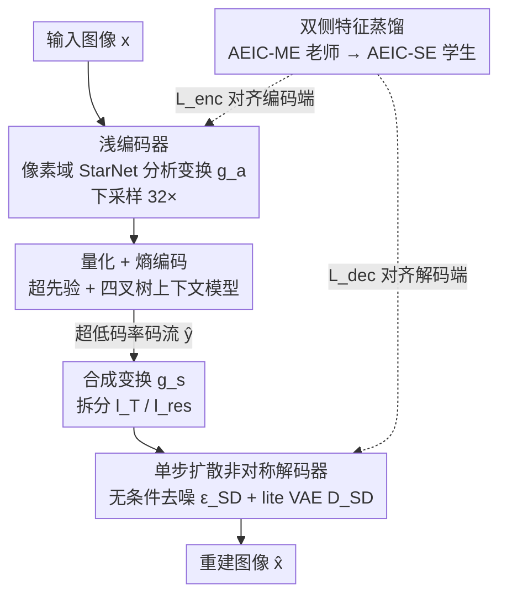

# Ultra-Low Bitrate Perceptual Image Compression with Shallow Encoder

**会议**: CVPR 2026  
**论文**: [CVF Open Access](https://openaccess.thecvf.com/content/CVPR2026/html/Zhang_Ultra-Low_Bitrate_Perceptual_Image_Compression_with_Shallow_Encoder_CVPR_2026_paper.html)  
**代码**: https://github.com/LuizScarlet/AEIC  
**领域**: 模型压缩 / 图像压缩  
**关键词**: 超低码率压缩, 浅编码器, 单步扩散解码, 特征蒸馏, 非对称编解码

## 一句话总结
本文提出非对称极致图像压缩框架 AEIC，先用理论说明「超低码率（<0.05 bpp）下隐变量方差天然很小、不需要重编码器」，进而把编码端做成一个 0.94M 参数的像素域浅卷积网络、把生成能力全部压进单步扩散解码器，再用双侧特征蒸馏把中等编码器的知识迁给浅编码器，最终在 1080P 上做到 35.8 FPS 实时编码、比同类极致压缩方法快约 19 倍，且感知指标（LPIPS/DISTS/FID/KID）反而领先。

## 研究背景与动机

**领域现状**：超低码率图像压缩（每像素比特数 bpp < 0.05）面向带宽和算力都很受限的发送端，比如边缘设备和 IoT 终端。这种码率下像素级保真早已不可能，主流学习型方法干脆放弃像素域重建，转而把图像映射进一个生成式隐空间——通常借用预训练的 Stable Diffusion VAE 或 1-D tokenizer / VQ-VAE 当编码器，再在这个隐空间上叠一个二级 latent 编码器做变换编码（transform coding）和熵建模，配合强大的扩散 / Transformer 解码器把感知质量做上去。

**现有痛点**：这套范式编码端太重。一个预训练生成编码器（往往 >40M 参数）加上二级 latent 编码器，构成了「多编码器」结构，计算和显存开销巨大。问题在于——超低码率的典型场景恰恰是「弱发送端、强接收端」（如手机上传到云端），编码速度和模型体积才是真正的瓶颈，而现有方法把最重的计算压在了编码端，部署在弱设备上完全不现实。

**核心矛盾**：研究社区默认「要在隐空间得到对齐人类感知的紧凑表示，就必须用大编码器」。但发送端的算力预算和这种重编码器假设根本对不上。换句话说，感知质量的代价被错误地摊到了编码端。

**本文目标**：拆成两个子问题——(1) 超低码率下到底需不需要重编码器？(2) 如果可以用浅编码器，怎么补回它丢失的表达能力，让重建质量不崩？

**切入角度**：作者从码率与隐变量方差的关系入手。直觉是：码率越低，需要编码的信息本身就越少、隐变量取值范围越窄，那么把这点紧凑信息编出来其实不需要很深的网络。这个观察把「重编码器」的必要性从根上动摇了。

**核心 idea**：用「非对称」结构替代「对称重编码器」——编码端用浅卷积网络直接在像素空间做分析变换，解码端用单步扩散承担全部生成职责；再用双侧蒸馏把中等编码器的知识灌进浅编码器，补回容量差距。

## 方法详解

### 整体框架

AEIC（Asymmetric Extreme Image Compression）的核心是把编解码的计算彻底做成不对称：编码端尽可能轻（浅 StarNet 卷积网络，直接像素域→隐变量），解码端把生成质量交给单步扩散。给定输入图像 $x$，浅分析变换 $g_a$ 把它压成空间下采样 32× 的紧凑隐变量 $y$；$y$ 量化为 $\hat{y}$，由「超先验 + 四叉树划分上下文模型」估计高斯熵参数 $(\mu,\sigma)$ 后算术编码成超低码率码流。解码端先用合成变换 $g_s$ 还原并拆分出两路隐变量，经单步去噪器 $\epsilon_{SD}$ 和轻量 VAE 解码器 $\mathcal{D}_{SD}$ 重建出 $\hat{x}$。

整条流水线可写成：

$$y = g_a(x), \quad \hat{y} = \text{quantize}[y-\mu]+\mu$$
$$l_T, l_{res} = \text{split}[g_s(\hat{y})], \quad l_0 = \epsilon_{SD}(l_T), \quad \hat{x} = \mathcal{D}_{SD}(l_0 + l_{res})$$

框架有两个变体，区别只在编码端：AEIC-ME（moderate encoder，3.09M）和 AEIC-SE（shallow encoder，0.94M），靠调整每个下采样阶段的 StarBlock 层数与通道维度、以及熵模型的深度/维度得到（见下表），解码端完全共享。AEIC-SE 是真正面向弱设备的主角，AEIC-ME 则同时充当蒸馏老师。

| 变体 | $g_a$ 深度 | $g_a$ 各阶段维度 | 熵模型深度/维度 | 编码参数 |
|------|-----------|----------------|----------------|---------|
| AEIC-ME（老师） | 2 | (64,128,192,256,320) | 4 / 960 | 3.09M |
| AEIC-SE（学生） | 1 | (32,64,128,192,256) | 3 / 512 | 0.94M |

### 关键设计

**1. 浅编码器：用码率-方差分析证明超低码率不需要深编码器**

这一设计直接针对「编码端太重」的痛点，而且作者没有停在直觉，而是给了理论支撑。先看离散情形：一个大小为 $M$ 的码本 $\mathcal{C}=\{c_1,\dots,c_M\}$ 能表示的最大码率是 $R=\log_2 M$；若用穷举搜索编码（不对码字结构做任何假设），计算复杂度是 $O(M)=O(2^R)$。也就是说，码率 $R$ 一降，所需搜索空间和编码复杂度是**指数级**下降的。再推广到连续情形：高斯隐变量 $z\sim\mathcal{N}(\mu,\sigma^2)$ 的微分熵 $h(z)=\frac{1}{2}\log(2\pi e\sigma^2)$，熵（即码率）**只取决于方差** $\sigma^2$。所以超低码率必然意味着隐变量方差很小，取值范围被压窄，等价于一个元素更少的离散码本——要编的信息本身就紧凑，自然不需要深而贵的编码器。

基于这个洞察，作者用 StarNet（StarBlock）搭了像素域的分析变换 $g_a$，直接学「像素→超低码率隐变量」的映射，而不是先过一个预训练大编码器再叠 latent 变换。实测里 AEIC-ME 和 AEIC-SE 产出的隐变量方差范围，和用复杂编码器的 StableCodec、DLF 落在同一区间，但编码 MACs/pixel 低一两个数量级，验证了「浅编码器足够表达超低码率隐空间」这个判断。

**2. 单步扩散非对称解码器：把生成质量全压到解码端，且解码也要快**

浅编码器丢掉了表达能力，重建质量必须由解码端补回来，但解码端如果也很慢，整个系统在实用上仍然不成立。作者的做法是把 SD-Turbo 用 LoRA 微调成**单步**解码器，并做了两处关键瘦身。其一是把扩散器改成无条件：在图像压缩里传文本 prompt 会额外占码率，而已有研究表明 prompt 相比隐码里已有的信息对重建几乎没贡献，所以作者干脆把 SD-Turbo 去噪器里的文本编码器、timestep 嵌入、所有 cross-attention 层全部剪掉，使单步去噪从 $l_0=[l_T-\sqrt{1-\bar\alpha_T}\cdot\epsilon_{SD}(l_T,c,T)]/\sqrt{\bar\alpha_T}$ 退化成直接的 $l_0=\epsilon_{SD}(l_T)$。其二是双分支解码：合成变换 $g_s$ 的输出被拆成 $l_T$（负责纹理生成）和 $l_{res}$（负责结构残差），$l_T$ 过单步去噪后与 $l_{res}$ 逐元素相加再进 VAE 解码器——和 StableCodec 用一个独立辅助解码器不同，这里把两条分支都整合进 $g_s$，增强了跨分支交互。最后，由于 VAE 解码器是解码延迟的瓶颈，作者把 SD-Turbo 原 VAE 的通道剪掉 50% 换成 lite 版本，进一步压低解码计算。

**3. 双侧特征蒸馏：把中等编码器的知识同时灌进学生的编码端和解码端**

浅编码器容量有限，从零训 AEIC-SE 会比 AEIC-ME 掉点严重（消融里 LPIPS BD-rate +8.47%、DISTS +23.75%）。作者用 AEIC-ME 当老师，设计了「双侧」蒸馏，关键在于编码端和解码端各管一段、且分别落在训练的不同阶段。编码端蒸馏项 $\mathcal{L}_{enc}$ 对齐四个中间隐变量——$g_a$ 输出 $y$、超先验 $h_a$ 输出 $z$、$h_s$ 输出 $\phi$、量化后的 $\hat{y}$；由于师生编码器维度不一致，引入一个单卷积层的可学习投影 $f(\cdot)$ 对齐特征空间：

$$\mathcal{L}_{enc} = \|y^{tea}-f(y^{stu})\|_2^2 + \|z^{tea}-f(z^{stu})\|_2^2 + \|\phi^{tea}-f(\phi^{stu})\|_2^2 + \|\hat{y}^{tea}-f(\hat{y}^{stu})\|_2^2$$

解码端蒸馏项 $\mathcal{L}_{dec}$ 则对齐双分支隐变量 $l_T$、$l_{res}$、单步去噪结果 $l_0$，以及去噪器 $\epsilon_{SD}$ 各个 UNet block（下采样块、中间块、上采样块）的中间特征 $h_n$：

$$\mathcal{L}_{dec} = \|l_T^{tea}-f(l_T^{stu})\|_2^2 + \|l_{res}^{tea}-f(l_{res}^{stu})\|_2^2 + \|l_0^{tea}-f(l_0^{stu})\|_2^2 + \sum_n \|h_n^{tea}-f(h_n^{stu})\|_2^2$$

这种「编码端先对齐、解码端再对齐」的拆分对应了下面训练策略里两阶段的不同压力点：第一阶段编码器在宽松码率下学表达，$\mathcal{L}_{enc}$ 在此时帮浅编码器学到接近老师的变换；第二阶段码率约束骤紧、解码质量受冲击最大，$\mathcal{L}_{dec}$ 此时介入把师生解码差距收到 3% 以内。

### 损失函数 / 训练策略

整体目标是标准率失真目标 $\lambda R(\hat y,\hat z)+D(x,\hat x)$，其中失真项 $D=\gamma_1\|x-\hat x\|_2^2+\gamma_2 L_p(x,\hat x)+\gamma_3 L_s(x,\hat x)$ 含重建损失、感知损失 $L_p$ 和语义损失 $L_s$。训练分多阶段渐进进行，配合「隐式码率剪枝」稳定优化：

- **老师 AEIC-ME**：Stage 1 用宽松码率约束 $\lambda_{S1}$（目标约 0.05 bpp）做稳定端到端训练；Stage 2 用更大的 $\lambda_{S2}$ 把码率压向 0.005–0.035 bpp，并加入对抗损失 $L_{adv}$，同时把 $L_p$ 切换成 overlap-chunked edge-aware DISTS 以适配超低码率下的感知监督，判别器基于 DINOv3 加可训练 head。
- **隐式码率剪枝**：先在宽松码率收敛（Stage 1 码率从 0.02 升到 0.05 bpp、质量稳步上升），再在 Stage 2 骤增约束让码率快速跌到目标区间。这种「先松后紧」让编码器先在宽松约束下探索富表达变换，再适应极端码率。
- **学生 AEIC-SE**：Stage 1 在目标里加 $\beta_1 L_{enc}$ 辅助浅编码器，Stage 2 加 $\beta_2 L_{dec}$ 引导解码器收敛（$\{\beta_1,\beta_2\}=\{0.5,0.001\}$）。
- **高分辨率微调（HRF）**：浅编码器对大图泛化较弱，作者为 AEIC-SE 额外加一个短 Stage 3，用 1024×1024 大 patch 微调 5K 次（重新初始化判别器 head），专门补 1080P/2K 上的质量。

## 实验关键数据

训练数据用 DF2K + CLIC 2020 Professional + LSDIR 前 10K 图，仅用 2× RTX 3090 训练；测试用 CLIC 2020 Test（428 张 2K 图）、DIV2K Val（100 张）和 Kodak。评测覆盖率失真感知三类指标：感知用 FID/KID/DISTS/LPIPS，失真用 PSNR/MS-SSIM，复杂度报实际延迟、参数量、MACs/pixel。

### 主实验：编码复杂度与延迟

| 方法 | 类型 | 编码参数(M) | 编码 MACs(K)/px | 1080P 编码延迟(RTX 4090D) | 编码 FPS |
|------|------|-----------|----------------|--------------------------|---------|
| DLF | 超低码率 | 437.35 | 1915.35 | 508.1 ms | — |
| StableCodec | 超低码率 | 102.23 | 2537.51 | 538.4 ms | — |
| EVC-Small | 普通码率(高效) | 11.64 | 71.12 | 35.3 ms | — |
| AEIC-ME（本文） | 超低码率 | 55.91 | 204.26 | 58.7 ms | 17.0 |
| **AEIC-SE（本文）** | 超低码率 | **16.10** | **46.02** | **27.9 ms** | **35.8** |

AEIC-SE 的编码复杂度被压到和「实时普通码率编解码器 EVC-Small」同级，却远轻于所有超低码率同行；在 1080P 上达到 35.8 FPS 实时编码，相对 DLF / StableCodec 分别提速 18.2× / 19.3×，且两个 AEIC 变体都能在消费级 GTX 1080Ti（11GB）上不分块直接处理整张 1080P 图。率失真感知曲线（CLIC 2020 / DIV2K）上，AEIC 在全部感知指标上明显领先，失真指标保持竞争力；AEIC-ME 在 0.005–0.035 bpp 全区间稳定超过最新的 StableCodec，AEIC-SE 虽失真略逊于 AEIC-ME，但感知指标相当甚至更好。

### 消融实验

**空间压缩比（AEIC-ME，anchor=StableCodec，Kodak BD-rate ↓越好）**

| 压缩比 | PSNR | MS-SSIM | LPIPS | DISTS |
|--------|------|---------|-------|-------|
| 64× | +14.30 | -4.54 | -6.97 | -6.95 |
| **32×** | -2.21 | -4.85 | **-13.67** | **-24.91** |
| 16× | -5.53 | -8.00 | -1.91 | -9.03 |

**双侧蒸馏（DIV2K 768×512，BD-rate ↓越好，anchor=AEIC-ME）**

| 配置 | LPIPS | DISTS | FID |
|------|-------|-------|-----|
| AEIC-SE（无蒸馏） | +8.47 | +23.75 | +22.10 |
| + $\mathcal{L}_{enc}$ | +3.92 | +7.68 | +4.75 |
| + $\mathcal{L}_{enc}$ + $\mathcal{L}_{dec}$ | +0.60 | +2.55 | +2.98 |

### 关键发现
- **32× 空间压缩比是超低码率的甜点**：16× 过度偏向失真指标、感知收益小，64× 丢失太多空间信息导致整体退化，32× 在率/失真/感知间平衡最好（DISTS BD-rate 一项就比 anchor 改善 24.91%）。
- **蒸馏两项各管一段、缺一不可**：单加 $\mathcal{L}_{enc}$ 就把 DISTS BD-rate 从 +23.75% 砍到 +7.68%（浅编码器是主要瓶颈，编码端对齐收益最大）；再加 $\mathcal{L}_{dec}$ 把师生差距收到 3% 以内，说明解码端对齐负责收尾。
- **HRF 主要救 2K 大图**：在 768×512 patch 上 AEIC-SE 已接近 AEIC-ME、HRF 影响很小；但在 2K 全分辨率下 HRF 带来显著增益（尤其 DISTS），印证浅编码器的大图泛化短板需要专门微调补。

## 亮点与洞察
- **用「码率→方差→复杂度」的链条把直觉做成了理论**：从离散码本的 $O(2^R)$ 复杂度到连续高斯熵只依赖方差，作者把「超低码率不需要重编码器」论证得很干净，这是全文最让人「啊哈」的地方——它把整个领域默认的重编码器假设证伪了。
- **「非对称」是个可迁移的系统观**：把昂贵计算按设备能力分配（弱发送端轻编码、强接收端重解码），这个思路可以迁到视频压缩、端云协同推理、联邦学习等任何「两端算力不均」的场景。
- **无条件化扩散解码器是个实用 trick**：剪掉文本编码器/timestep/cross-attention 不仅省码率，还直接把单步去噪化简成一次前向，对所有「借 SD 当解码器但其实不需要文本条件」的压缩/复原任务都适用。
- **双侧蒸馏对齐中间特征而非只对齐输出**：编码端对齐 $y,z,\phi,\hat y$、解码端对齐 $l_T,l_{res},l_0$ 和 UNet 各块特征，用可学习投影 $f(\cdot)$ 跨维度对齐，是把「师生容量差距」补回来的细致做法。

## 局限与展望
- **依赖一个更重的老师**：AEIC-SE 的质量建立在先训好 AEIC-ME 再蒸馏的基础上，训练管线较长（老师两阶段 + 学生两阶段 + HRF），从零直接训浅编码器质量会明显下降。
- **解码端依然重**：虽然编码端只有 16M 参数，但解码端仍是近 1B 参数的扩散+VAE，论文的「轻」只在编码端成立；对「弱接收端」场景（如端到端都受限）并不适用。
- **超低码率专用**：理论分析的前提是码率极低、隐变量方差小，方法的优势区间锁定在 <0.05 bpp，外推到中高码率时浅编码器的容量短板会重新暴露（消融里 16× 比 32× 反而在失真上更好已露端倪）。
- **可改进方向**：能否把老师蒸馏换成自蒸馏 / 在线蒸馏省掉单独训老师；能否对解码端也做对称的轻量化，让整条链路都能跑在弱设备上。

## 相关工作与启发
- **vs StableCodec / DLF（latent-space 极致压缩）**：它们用预训练大编码器 + 二级 latent 编码器做两段式编码，感知质量好但编码端 >100M 参数、不可部署在弱设备；本文用浅像素域编码器 + 单步扩散解码做非对称结构，编码端缩到 16M、提速约 19×，感知指标反而更优。AEIC 还把双分支整合进 $g_s$（StableCodec 用独立辅助解码器），增强跨分支交互。
- **vs EVC（实时神经压缩）**：EVC 靠稀疏架构做到 30 FPS 实时编解码，但面向普通码率、优化的是失真保真；本文把实时编码第一次带进超低码率区间，且优化目标是率失真感知三者兼顾。
- **vs PerCo / DiffEIC（多步扩散解码）**：多步扩散（20/50 步）解码质量高但延迟极大（DiffEIC 在 1080P 上动辄 OOM 或数万毫秒）；本文用单步无条件扩散把解码做到可用范围，同时保住感知质量。

## 评分
- 新颖性: ⭐⭐⭐⭐⭐ 用码率-方差理论证伪「超低码率需重编码器」，并据此提出非对称压缩，是范式层面的新视角。
- 实验充分度: ⭐⭐⭐⭐ 覆盖三套数据集、率失真感知全指标、延迟/参数/MACs 复杂度对比及三组消融，唯解码端轻量化与跨码率泛化讨论略少。
- 写作质量: ⭐⭐⭐⭐⭐ 理论动机—方法—实验逻辑闭环，公式与配图把「为什么浅编码器可行」讲得很透。
- 价值: ⭐⭐⭐⭐⭐ 首个在超低码率下同时拿到 SOTA 感知质量和实时编码的方案，对边缘设备/IoT 等弱发送端有直接落地意义。

<!-- RELATED:START -->

## 相关论文

- [\[CVPR 2026\] Ultra-Fast Neural Video Compression](ultra-fast_neural_video_compression.md)
- [\[CVPR 2026\] Distributed Image Compression with Multimodal Side Information at Extremely Low Bitrates](distributed_image_compression_with_multimodal_side_information_at_extremely_low_.md)
- [\[CVPR 2026\] CADC: Content Adaptive Diffusion-Based Generative Image Compression](cadc_content_adaptive_diffusion-based_generative_image_compression.md)
- [\[CVPR 2026\] On the Robustness of Diffusion-Based Image Compression to Bit-Flip Errors](on_the_robustness_of_diffusion-based_image_compression_to_bit-flip_errors.md)
- [\[CVPR 2026\] Block-based Learned Image Compression without Blocking Artifacts](block-based_learned_image_compression_without_blocking_artifacts.md)

<!-- RELATED:END -->
