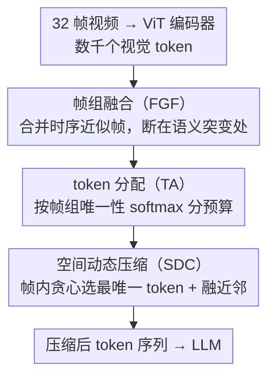

# UniComp: Rethinking Video Compression Through Informational Uniqueness

**会议**: CVPR 2026  
**arXiv**: [2512.03575](https://arxiv.org/abs/2512.03575)  
**代码**: [TimeMarker-LLM/UniComp](https://github.com/TimeMarker-LLM/UniComp)  
**领域**: 模型压缩  
**关键词**: 视觉token压缩, 信息唯一性, 视频理解, MLLM效率, 即插即用

## 一句话总结

提出基于信息唯一性（而非注意力）的视频 token 压缩框架 UniComp，通过帧组融合、token 分配和空间动态压缩三个模块在时序-空间-全局维度上最大化保留唯一信息，在仅保留 10% token 时仍能超越未压缩基线性能。

## 研究背景与动机

**领域现状**: 多模态大模型处理视频时面临巨大计算瓶颈——32 帧视频可能产生数千个视觉 token。现有压缩方法如 VisionZip、HoliTom 主要基于注意力分数进行重要性评估和 token 选择。

**现有痛点**: 基于注意力的方法存在三个问题：(1) 显著性偏向导致选中的 token 之间高度冗余；(2) 倾向忽略细粒度细节；(3) 激进压缩下信息损失严重。此外 FastVid、HoliTom 需要调 5+ 超参数，DyCoke 等需修改 LLM 内部注意力层，不易跨架构迁移。

**核心矛盾**: 注意力高不等于信息唯一，高注意力 token 之间可能高度相似，保留它们并不能最大化信息保真度。压缩的本质应该是保留不可替代的信息，而非最显著的信息。

**本文目标** 在有限计算预算下，如何选择最能代表整体视觉信息的 token 子集，使得被丢弃 token 的信息可从保留 token 中重建。

**切入角度**: 从信息论出发，将压缩建模为最小化条件熵 $H(\mathcal{X}|\mathcal{S})$，推导出重建误差上界与 token 唯一性的理论联系。

**核心 idea**: 用余弦距离度量的"信息唯一性"替代注意力分数作为 token 重要性指标，配合贪心选择加邻域融合实现信息最优压缩。

## 方法详解

### 整体框架

UniComp 想解决的是：32 帧视频送进 MLLM 会产生数千个视觉 token，必须压掉一大半，但传统按注意力分数挑 token 会把一堆彼此相似的"显著"token 一起留下，真正不可替代的细节反而被丢。它的整条流水线接在 ViT 编码器之后、LLM 之前，把压缩拆成时序、全局、空间三个层次依次处理：先用帧组融合（Frame Group Fusion, FGF）把时间上几乎重复的帧合并成几组，再用 token 分配（Token Allocation, TA）按"哪几组信息更独特"把有限的 token 预算分下去，最后由空间动态压缩（Spatial Dynamic Compression, SDC）在每帧内部挑出最不可替代的 token、把和它们近似的邻居融合进来。三步走完，输出的压缩 token 序列直接喂给 LLM，全程不碰 LLM 内部结构。

贯穿三个模块的统一度量是"信息唯一性"——两个特征越正交（余弦相似度越低）就越唯一。整篇方法的逻辑起点是把压缩写成最小化条件熵 $H(\mathcal{X}|\mathcal{S})$：保留集 $\mathcal{S}$ 要让被丢弃 token 的信息尽量能从它重建，而重建误差的上界恰好由"每个被丢 token 到保留集的最小唯一性距离"控制，于是"挑最唯一的、融合最近似的"成了有理论依据的贪心策略。三个模块的串行关系如下：

### 关键设计

**1. 帧组融合（Frame Group Fusion, FGF）：先把时间轴上几乎重复的帧合并掉**

视频里大量相邻帧描述的是同一个静态场景，逐帧都留 token 是纯粹的时序冗余。FGF 对每帧先做 average pooling 得到一个全局描述向量，然后顺序扫描帧序列：拿当前帧和当前组的组首帧算唯一性 $u(f_t, f_r)$，只要 $u(f_t, f_r) < U_f$（够相似）就并入同一组，一旦超过阈值就另起一组；每组最后用 mean pooling 融成一个代表特征。这样静态镜头会被压成寥寥几组，而语义突变（切镜、动作发生）的地方自然断开、细粒度得以保留——压缩率随内容自适应，不需要预先指定每段留几帧。

**2. token 分配（Token Allocation, TA）：把 token 预算按帧组的独特程度分下去**

帧组合并之后，剩下的问题是总预算 $\text{TOKEN}_{max}$ 该怎么摊到各组——平均分显然不对，信息更独特的组理应多拿。TA 先量化每个融合帧相对其余帧的唯一性：

$$U_t = 1 - \frac{1}{K_f}\sum_s \cos(f_t, f_s)$$

再把 $U_t$ 做均值归一化、并乘上 $\sqrt{K_f}$ 放大组间差异（帧组越多越要拉开差距），最后用 softmax 把它转成预算比例：

$$K_t = \left\lfloor \frac{e^{U_t}}{\sum_s e^{U_s}} \cdot \text{TOKEN}_{max} \right\rfloor$$

效果上，一段对理解视频很关键的独特画面会分到更多 token，而几乎重复的背景帧只留少量，预算被花在真正承载新信息的地方。

**3. 空间动态压缩（Spatial Dynamic Compression, SDC）：在每帧内部挑出最不可替代的 token、融掉其余近似项**

拿到本帧的 token 配额后，还要决定保留帧内哪些空间 token。SDC 先算出帧内 token 两两之间的唯一性矩阵，再按唯一性降序做贪心：每次选出当前最唯一的 token 收进保留集，把和它唯一性差距 $< U_c$ 的相近 token 标记为冗余，并通过邻域融合把这些冗余 token 聚合进保留的那个里——是融合而不是直接丢弃，所以被合并 token 携带的信息不会凭空消失。这一步并非拍脑袋：它正对应最小化前面那个重建误差上界

$$\mathcal{E}(\mathcal{S}) \leq 2\sum_j \min_{i \in \mathcal{S}} u_{ij}$$

每选一个最唯一的 token 并吸收其近邻，就是在贪心地压低这个上界，因此"挑唯一 + 融近邻"这套操作本身就是在最小化信息损失，而不是注意力法那种"挑最显著"的近似目标。

### 一个完整示例

> ⚠️ 下面的具体数字为示例性演示（说明 token 如何逐级收缩），非原文给定，具体配置以原文为准。

设输入 32 帧、每帧 196 个视觉 token（共 6272 个），目标保留约 10%。FGF 顺序扫描发现前 12 帧是几乎静止的开场镜头、被合并成 1 组，中间动作段切成 5 组，结尾 2 组——32 帧收缩为 8 个融合帧。TA 接着算这 8 组的唯一性：动作段那几组 $U_t$ 高、softmax 后各分到上百个 token，静止开场组 $U_t$ 低、只分到几十个，预算被向"信息密度高"的片段倾斜。最后 SDC 在每个融合帧内贪心选 token：某动作帧从 196 个 token 里先挑出最唯一的那个，把周围 $< U_c$ 的相似 token 融进来，重复直到填满该帧配额。三步走完，6272 个 token 收成约 600 个送进 LLM——既砍掉了时序与空间双重冗余，又保证留下的每个 token 都尽量"不可替代"。

### 损失函数 / 训练策略

UniComp 无需训练，是即插即用方法，全程只有 2 个超参数：帧组融合阈值 $U_f$ 和空间压缩阈值 $U_c$，作者给的默认值可跨不同 ViT 与 LLM 直接迁移。唯一性计算用的是 ViT 最后一层注意力的 Key 特征。

## 实验关键数据

### 主实验（32帧输入，LLaVA-OneVision-7B）

| 方法 | 保留比例 | LongVideoBench | EgoSchema | MLVU | VideoMME | 平均 | 相对基线 |
|------|---------|---------------|-----------|------|---------|------|---------|
| Vanilla | 100% | 56.3 | 60.4 | 64.7 | 58.4 | 59.95 | 100% |
| VisionZip | 25% | 56.5 | 60.3 | 64.8 | 58.2 | 59.95 | 100% |
| HoliTom | 25% | 56.7 | 61.2 | 64.7 | 58.6 | 60.30 | 100.6% |
| **UniComp** | **25%** | **57.6** | **61.6** | **65.0** | **58.9** | **60.78** | **101.4%** |
| VisionZip | 10% | 49.3 | 58.0 | 59.7 | 53.4 | 55.10 | 91.9% |

### 消融实验

| 配置 | LongVideoBench | VideoMME | 说明 |
|------|---------------|---------|------|
| Full UniComp | 57.6 | 58.9 | 完整模型 |
| w/o FGF | 56.8 | 58.2 | 去帧组融合掉 0.8 |
| w/o TA | 57.0 | 58.5 | 去动态分配掉 0.6 |
| w/o SDC fusion | 56.5 | 57.8 | 去邻域融合掉 1.1 |

### 关键发现

- UniComp 在 25% 保留率下超越未压缩基线（101.4%），压缩反而去除了干扰 LLM 的冗余信息
- 10% 保留率下仍保持约 100% 基线性能，VisionZip 降至 91.9%
- 即插即用，在 LLaVA-OV、LLaVA-Video、Eagle2.5 三个架构上都有效

## 亮点与洞察

- **信息唯一性 vs 注意力**：视角转换非常精彩——注意力高的 token 可能彼此高度相似，唯一性高的 token 保证信息多样性覆盖。可视化清晰展示了两者差异
- **理论-实践闭环**：从条件熵最小化推导出重建误差与唯一性上界联系，据此设计贪心算法，理论驱动设计优雅
- **压缩反超基线**：暗示 LLM 处理过多视觉 token 时受冗余信息干扰，适度筛选反而有益

## 局限与展望

- 唯一性基于余弦距离，对方向相近但语义不同的 token 可能误判
- 帧组融合是顺序扫描，对闪回或非线性叙事可能处理不当
- 仅 2 个超参数在极端场景可能需微调

## 相关工作与启发

- **vs VisionZip**: 基于注意力选 token，10% 保留率下掉到 91.9%，UniComp 仍约 100%——唯一性在极端压缩下优势明显
- **vs HoliTom/DyCoke**: 需修改 LLM 内部结构，UniComp 在 ViT 输出后操作更通用

## 评分

- 新颖性: ⭐⭐⭐⭐⭐ 信息唯一性视角是全新理论贡献
- 实验充分度: ⭐⭐⭐⭐ 多模型多比例多基准，消融详细
- 写作质量: ⭐⭐⭐⭐⭐ 理论推导清晰，动机引人入胜
- 价值: ⭐⭐⭐⭐⭐ 即插即用加压缩超基线，实用学术价值兼具

<!-- RELATED:START -->

## 相关论文

- [\[CVPR 2026\] Ultra-Fast Neural Video Compression](ultra-fast_neural_video_compression.md)
- [\[CVPR 2026\] Accelerating Streaming Video Large Language Models via Hierarchical Token Compression](accelerating_streaming_video_large_language_models_via_hierarchical_token_compre.md)
- [\[CVPR 2026\] Generative Video Compression with One-Dimensional Latent Representation](generative_video_compression_with_one-dimensional_latent_representation.md)
- [\[ICLR 2026\] Taming Momentum: Rethinking Optimizer States Through Low-Rank Approximation](../../ICLR2026/model_compression/taming_momentum_rethinking_optimizer_states_through_low-rank_approximation.md)
- [\[CVPR 2026\] Rethinking Token Reduction for Large Vision-Language Models](rethinking_token_reduction_for_large_vision-language_models.md)

<!-- RELATED:END -->
