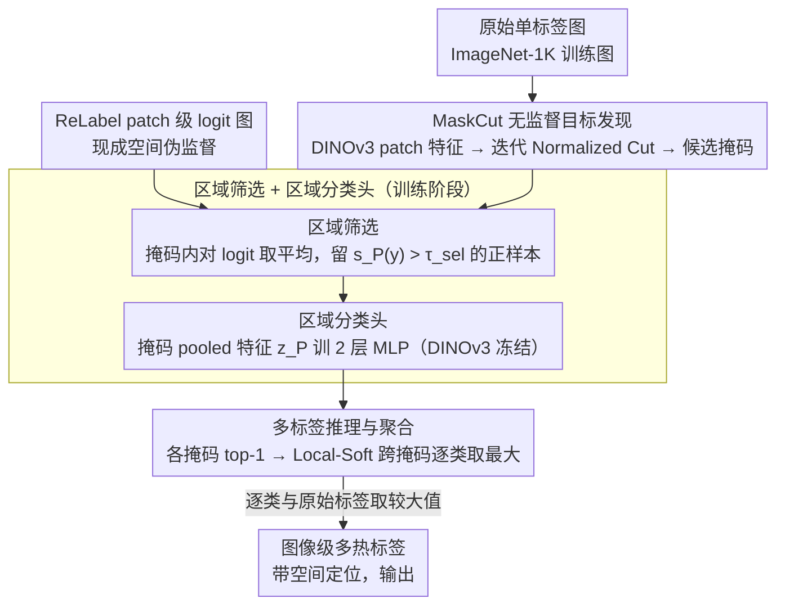

# Unlocking ImageNet's Multi-Object Nature: Automated Large-Scale Multilabel Annotation

**会议**: CVPR 2026  
**arXiv**: [2603.05729](https://arxiv.org/abs/2603.05729)  
**代码**: [有](https://github.com/jchen175/MultiLabel-ImageNet)  
**领域**: 模型压缩  
**关键词**: 多标签标注, ImageNet重标注, 无监督目标发现, 自监督学习, 数据质量  

## 一句话总结

提出全自动流水线，利用自监督 ViT 特征进行无监督目标发现，为 ImageNet-1K 全部 128 万训练图像生成带空间定位的多标签标注，无需人工标注，模型在域内和下游多标签任务上均获一致提升（ReaL +2.0 top-1, COCO +4.2 mAP）。

## 研究背景与动机

ImageNet-1K 采用单标签假设，但大量图像实际包含多个目标。这一不匹配造成三方面问题：

**训练端**：不完整的单标签产生噪声监督，模型无法从共现目标中学习更丰富表示。约 15% 的图像在人工重审时包含 ≥2 个有效类别

**评估端**：模型正确预测次要目标反而被惩罚（ground truth 只有一个标签），导致评估不公平

**分布偏移假象**：ImageNet-V2 的精度下降很大程度源于其多目标图像比例更高，而非模型退化

现有改进仅覆盖验证集（ReaL、Multilabelfy），128 万训练集因标注成本过高一直缺乏多标签标注。ReLabel 通过 patch 级软标签部分解决但仍是单软标签/crop，无显式多标签。

## 方法详解

### 整体框架

这篇论文要解决的核心问题是：ImageNet-1K 的 128 万训练图里有大量图含多个目标，但单标签假设把它们硬塞成一类，怎样在**完全不靠人工**的前提下把缺失的标签补回来。作者把它拆成一条三阶段流水线：先在每张图上无监督地找出若干候选目标区域（掩码），再训练一个只看单个区域的轻量分类器，最后让分类器扫过所有区域、把各区域的预测聚合成一张图像级的多热标签。三步串起来，输入是一张原始单标签图，输出是一组带空间定位的多标签。关键的设计取舍在于——全程都在**区域级**而非整图级做分类，避免分类器从背景蹭出虚假关联。

### 关键设计

**1. MaskCut 无监督目标发现：在没有任何框/掩码标注的情况下把多个目标抠出来**

第一步要回答的是「这张图里到底有几个目标、各自在哪」，而 ImageNet 训练集压根没有定位标注。作者借自监督 ViT（DINOv3 ViT-L/16）倒数第二层的 patch 特征构造 patch 间相似度图，用 Normalized Cut 切出当前最显著的那个目标区域；切完把已发现区域遮蔽掉，在剩余 patch 上再切一次，如此迭代就能逐个挖出多个目标，每个目标输出一张二值掩码（经 CRF 后处理上采样回原分辨率）。之所以用 MaskCut 而不是 SAM 这类通用分割，是因为它给的是更一致的「目标级」proposal，不会把一个物体过分割成一堆碎片——后续分类器需要的是完整目标，碎片只会引入噪声。

**2. 基于 ReLabel 的区域筛选 + 区域分类头：用现成的空间 logit 当伪监督，避开背景捷径**

有了候选掩码，下一个坑是怎么训分类器。如果直接拿整图标签去监督每一个 proposal，分类器会严重过拟合——连背景区域都被逼着预测成原始类别（作者观察到 EVA02 正是这种行为）。作者改用 ReLabel 提供的 patch 级类别 logit 图作为区域级伪监督来筛样本。ReLabel 的 $15\times15\times5$ logit 先扩展成密集张量 $Z\in\mathbb{R}^{h\times w\times1000}$，对每个候选掩码 $P$ 在其前景区域内做平均：

$$v_P[c]=\frac{1}{\sum_{p,q}P_{pq}}\sum_{p,q}(P\odot Z[c])_{pq}$$

softmax 之后，只有对原始标签的置信度 $s_P(y)>\tau_{\text{sel}}$ 的 proposal 才被当成正样本留下，其余跟原始类别无关的区域被过滤掉。筛出的正样本拿来训一个 2 层 MLP（隐藏维 1024），输入是掩码区域 pooled 出来的 patch 特征 $z_P\in\mathbb{R}^{1024}$，骨干 DINOv3 全程冻结，只用交叉熵优化这个轻量头。这样分类器学到的是「这块区域本身像什么」，而不是「这张图整体被标成什么」。

**3. 多标签推理与聚合：把零散的区域预测合成一张图像级标签**

最后一步是把每个区域的判断攒成一张图的多标签。推理时每个 mask 取 top-1 预测及其置信度，跨 mask 合并时同一类别只保留最高置信度那次。作者比较了两种聚合：Local-Hard 设阈值 $\tau$、超阈的类别才计入多热标签；Local-Soft 则对每个类别跨 mask 取最大概率、保留连续分布。最终方案选 Local-Soft，并把原始 ImageNet 标签当作一路全局信号融进来，逐类取较大值：

$$\tilde{y}^{\text{final}}[c]=\max\big(\tilde{y}^{\text{local}}[c],\,y^{\text{global}}[c]\big)$$

选 Soft 是因为它保留了置信度梯度（比硬阈值更细腻）；补上原始标签则是为了兜底——区域化处理可能漏掉某些只有看全图才认得出的线索，原始标签正好补回这部分全局信息。

### 损失函数 / 训练策略

区域分类头用交叉熵训练，DINOv3 骨干冻结。下游模型则改用 BCE 损失配合软多标签：ResNet 系列调好 BCE 超参后直接套用，ViT 系列沿用 DeiT-3 配方。统计上超过 20% 的训练图带有高置信度多标签，从侧面印证了 ImageNet 多目标本质的普遍性。

## 实验关键数据

### 主实验

ResNet-50 不同训练方案对比：

| 方法 | IN-Val↑ | ReaL↑ | INv2↑ | ReaL mAP↑ | INv2-ML mAP↑ |
|------|---------|-------|-------|-----------|-------------|
| Original Label | 77.6 | 84.0 | 65.4 | 87.1 | 73.0 |
| Label Smooth | 78.2 | 84.1 | 66.1 | 87.0 | 72.3 |
| Large Loss | 77.8 | 84.2 | 65.7 | 87.2 | 72.7 |
| ReLabel | **78.9** | 85.0 | 67.3 | 87.9 | 74.8 |
| **Multi-label (Ours)** | 78.7 | **85.6** | **67.4** | **88.2** | **76.2** |

跨架构端到端训练 + 下游迁移：

| 模型 | 训练方式 | ReaL↑ | INv2↑ | INv2-ML mAP↑ | COCO mAP↑ | VOC mAP↑ |
|------|---------|-------|-------|-------------|-----------|----------|
| ResNet-50 | Single | 84.1 | 66.1 | 72.3 | 77.0 | 89.2 |
| ResNet-50 | **Multi E2E** | **85.6** | **67.4** | **76.2** | **78.9** | **90.7** |
| ViT-small | Single | 87.0 | 70.7 | 75.6 | 79.1 | 91.0 |
| ViT-small | **Multi E2E** | **88.1** | **72.2** | **80.7** | **83.3** | **93.3** |
| ViT-large | Single | 88.6 | 74.7 | 81.4 | 84.8 | 93.4 |
| ViT-large | **Multi E2E** | **89.3** | **74.9** | **83.0** | **86.4** | **95.0** |

### 消融实验

| 实验维度 | 结论 |
|---------|------|
| Local-Soft vs Local-Hard | Soft 优于 Hard，保留置信度梯度 |
| +全局信号（原始标签 vs 预测标签） | 原始标签 +0.2 accuracy |
| 多目标子群 (k≥2) | 本方法 vs 单标签 +3.35 mAP，vs ReLabel +1.48 mAP |
| Fine-tune vs E2E | 小模型 E2E 更优，大模型两者接近 |
| vs MIIL (ImageNet-21K 预训练) | 不依赖 21K，COCO +1.9, VOC +2.4 mAP |
| 特征熵分析 | 多标签训练产生更高特征熵，减轻表示坍缩 |

### 关键发现

1. 多标签训练在多标签评估指标上提升远大于单标签指标（IN-Val +0.5 vs ReaL mAP +1.1），说明单标签评估低估了收益
2. 超过 20% 训练图像包含高置信度多标签，验证数据集多目标本质的普遍性
3. 对 ReaL 中 3163 张无标签图像，本方法正确恢复 >90% 有效标签
4. 多标签预训练→下游迁移优于传统单标签预训练路线，COCO 最高 +4.2 mAP, VOC +2.3 mAP
5. 仅 20 epoch 微调即可显著提升现有单标签模型，无需从头训练

## 亮点与洞察

1. **完全自动化**：无需人工标注即可为 128 万图像生成多标签，pipeline 通用可迁移至其他单标签数据集
2. **区域级分类避免捷径学习**：全局分类器从背景学到虚假关联，区域处理迫使分类器关注目标本身
3. **挑战传统范式**：多标签预训练→下游迁移优于标准的单标签预训练→多标签微调，更丰富的监督信号从源头有益
4. **即插即用**：20 epoch 微调即可提升现有预训练模型，实用性极高

## 局限与展望

1. **一区域一标签假设**：对 ImageNet 中同义词（sunglass vs sunglasses）、部分-整体、层级类别会失败，已识别 26 对歧义类
2. **依赖 MaskCut 质量**：漏检小目标或过分割影响标注质量
3. **大模型超参未充分调优**：当前超参针对单标签优化，大模型可能需更长训练
4. **可改进**：(1) 更强分割模型替换 MaskCut; (2) 支持每区域多标签; (3) 扩展到检测/多模态 grounding

## 评分

- **新颖性**: ⭐⭐⭐ — 主要是已有组件的巧妙组合（MaskCut + ReLabel + MLP），pipeline 设计有工程智慧但方法新颖性中等
- **实验**: ⭐⭐⭐⭐⭐ — 极其全面，覆盖 5 种架构、多个数据集、多种训练模式、下游迁移、子群分析、特征熵分析
- **写作**: ⭐⭐⭐⭐ — 动机清晰，与先前工作的对比详尽，可视化丰富
- **价值**: ⭐⭐⭐⭐ — 提供了可直接使用的 128 万多标签标注，对社区有持久价值，下游迁移提升显著

<!-- RELATED:START -->

## 相关论文

- [\[ICLR 2026\] S2R-HDR: A Large-Scale Rendered Dataset for HDR Fusion](../../ICLR2026/model_compression/s2r-hdr_a_large-scale_rendered_dataset_for_hdr_fusion.md)
- [\[CVPR 2026\] Towards Source-Aware Object Swapping with Initial Noise Perturbation](towards_source-aware_object_swapping_with_initial_noise_perturbation.md)
- [\[NeurIPS 2025\] Find your Needle: Small Object Image Retrieval via Multi-Object Attention Optimization](../../NeurIPS2025/model_compression/find_your_needle_small_object_image_retrieval_via_multi-object_attention_optimiz.md)
- [\[ICML 2026\] Hierarchical Image Tokenization for Multi-Scale Image Super Resolution](../../ICML2026/model_compression/hierarchical_image_tokenization_for_multi-scale_image_super_resolution.md)
- [\[ICCV 2025\] Multi-Object Sketch Animation by Scene Decomposition and Motion Planning](../../ICCV2025/model_compression/multi-object_sketch_animation_by_scene_decomposition_and_motion_planning.md)

<!-- RELATED:END -->
