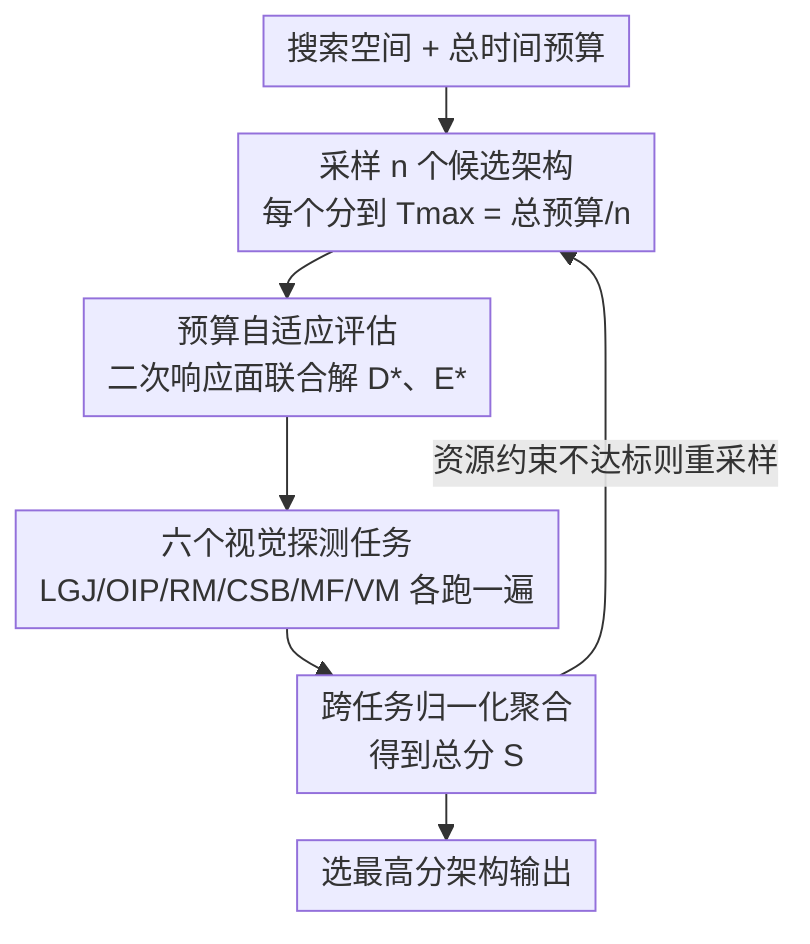

# Vision-Oriented Lightweight Neural Architecture Search with Budget-Adaptive Evaluation

**会议**: CVPR 2026  
**论文**: [CVF Open Access](https://openaccess.thecvf.com/content/CVPR2026/html/Fan_Vision-Oriented_Lightweight_Neural_Architecture_Search_with_Budget-Adaptive_Evaluation_CVPR_2026_paper.html)  
**代码**: https://github.com/fanyi-plus/tf-nas  
**领域**: 模型压缩 / 神经架构搜索  
**关键词**: 神经架构搜索, 训练-free 代理, 视觉探测任务, 预算自适应, 排序相关性

## 一句话总结
针对神经架构搜索（NAS）"准确但慢的 training-based" 与 "快但不可靠且只认某一类骨干的 training-free" 之间的两难，本文设计六个训练成本几乎可忽略的"视觉专用微型任务"作为架构质量代理，再用一个二次响应面在给定时间预算内自动分配数据量和训练轮数，把排序相关性和搜出架构的精度同时拉到 SOTA，且在 CNN / Transformer / Mamba 三大家族上都通用。

## 研究背景与动机
**领域现状**：NAS 已经是为不同视觉任务自动搜网络结构的事实标准。早期方法把上千个候选从头训练，GPU 成本高得离谱；后来一票工作（权重共享超网、DARTS 系可微松弛、OFA/BigNAS 的渐进收缩）把训练摊薄，但它们仍逃不开"训练—验证—再训练"范式，一旦数据集或部署约束变了就得整条流水线重跑。为了彻底省掉训练，training-free NAS（零成本代理）应运而生：在随机初始化（或接近）状态下，靠一两次前/反向传播加上对权重、梯度、特征的轻量统计算出一个分数（proxy），几秒钟评一个，单卡几小时就能搜完。

**现有痛点**：这种提速是有代价的。其一，**排序精度掉**——很多代理是衡量未训练网络表达力/可训练性的启发式，但网络训练后行为会不可预测地变；另一些虽有理论支撑，但证明都依赖实践中常不成立的强假设，结果就是 training-free 搜出的架构在同一搜索空间里跑不过 training-based。其二，**死死绑定某一类骨干**——把 CNN 导向的代理直接套到 Transformer 搜索空间会得到灾难性结果，有些代理甚至必须依赖 ReLU 之类的特定层才算得出来；至今多数 training-free 方法只针对 CNN 或 Transformer，而 Mamba、RWKV 这类新架构根本没有对应代理，就算明天造出来也仍被困在各自家族里。

**核心矛盾**：NAS 因此被卡在一个根本性的"精度—效率两难"——training-based 准确、通用但慢得离谱，training-free 快但不准且高度专用，两边都占不全。

**切入角度**：作者从一个已有工作（[41]）得到启发——它用一组合成的 token 级任务（考查模型记忆、检索、压缩能力）来做高效性能预测器。但作者观察到那些任务假设的是一维离散 token、解可以从位置索引猜出来，这和图像那种二维、对几何敏感的本质完全不兼容。于是思路是：**与其设计某个具体架构家族的代理统计量，不如设计一批"考查通用表征能力"的微型视觉任务，让候选网络真的训练极短时间，用它在这些任务上的表现来排序**——只要任务本身是视觉通用的，代理就天然跨家族。

**核心 idea**：用"六个训练成本可忽略、却共同探测广谱表征能力的视觉任务 + 预算内自适应分配数据量与轮数的评估器"，做一个轻量级的 training-based NAS，既保留训练带来的可靠排序，又把成本压到接近 training-free。

## 方法详解

### 整体框架
整体是一条"采样候选 → 在固定时间预算内训一小会儿 → 多任务打分 → 选最高分"的搜索流水线。给定一个搜索空间和总时间预算 $T_{\max,\text{all}}$，先按经验定候选数 $n$（搜索空间约 $10^3$ 时取 500~1000），于是每个候选分到的预算是 $T_{\max}=T_{\max,\text{all}}/n$。对每个候选，先用"预算自适应评估"解出该花多少数据量 $D$、训多少轮 $E$（既不浪费预算也不超时），再让它在六个视觉探测任务上各跑一遍、得到六个分数，归一化聚合成一个总分 $S$；若候选触犯了参数量/FLOPs/延迟等资源约束就丢掉重采样。最后选 $S$ 最高的网络作为搜索结果。

### 关键设计

**1. 六个视觉专用微型探测任务：用通用表征能力代替家族专属统计量**

痛点是 training-free 代理要么和真实精度相关性弱、要么只认某一类骨干。作者干脆放弃"在随机初始化网络上算统计量"，改成让候选网络**在六个极廉价、却各自考查不同视觉能力的任务上训练极短时间**，用真实学习表现来排序。六个任务覆盖了视觉表征的不同侧面：

- **LGJ（局部-全局拼图）**：把图切成若干 patch 打乱顺序，要模型输出正确的排列索引，考查"把局部碎片整合为全局整体"的长程依赖能力。评测不用原始准确率，而用预测位置到真值位置的平均欧氏误差距离；同时对"两块纯天蓝天空"这种本质上无法区分的 patch，用余弦相似度超过阈值 $\gamma$ 就剔除、不计误差。单样本指标为
$$\text{Score}_{\text{LGJ}}=\frac{\sum_{i=1}^{p}\mathbb{1}_{c(\boldsymbol{x}_i,\boldsymbol{x}_{g(i)})<\gamma}\,\|\mathcal{P}(g(i))-\mathcal{P}(\boldsymbol{y}_i)\|_2}{\sum_{i=1}^{p}\mathbb{1}_{c(\boldsymbol{x}_i,\boldsymbol{x}_{g(i)})<\gamma}},$$
其中 $g(i)$ 是 patch 真实位置，$c(\cdot,\cdot)$ 是余弦相似度，$\mathcal{P}(\cdot)$ 把 patch 索引映射到二维坐标。
- **OIP（遮挡修复）**：在图上盖一块随机大小黑 mask，再贴一块半透明（不透明度 $\alpha$）的他图 patch 当噪声干扰，要模型回归出被遮区域的原始像素。作者刻意不用预训练模型的感知损失（认为会引入偏置），而保留 L2 并加一个方差惩罚项让生成图方差贴近原图：$\text{Score}_{\text{OIP}}=\|\boldsymbol{y}-\boldsymbol{o}\|_2+\mu\,|\text{std}(\boldsymbol{y})-\text{std}(\boldsymbol{o})|$。
- **RM（旋转匹配）**：把同一张图旋转两个随机角度（在内切圆区域内做，避免越界引入外部内容），拼在一起让模型输出旋转角度，考查几何等变性。为了绕开角度周期性（359° 输出 0° 其实很准却被重罚），把真值角和输出都映射到单位圆，指标是 $\text{Score}_{\text{RM}}=\|\hat{\boldsymbol{y}}-\hat{\boldsymbol{\theta}}_g\|_2$。
- **CSB（颜色-形状绑定）**：在灰底画两个不重叠（IoU=0）、纯色填充的简单几何形状，要模型输出正确的"颜色×形状"组合类别（$c_1c_2$ 类分类），考查"识别属性并正确绑定到对象"。指标是二值的 $\text{Score}_{\text{CSB}}=\mathbb{1}_{\boldsymbol{y}=\boldsymbol{y}_g}$——作者刻意不给"只识别一半属性"任何中间分，因为这个任务强调"同时绑定"，识别一半等于没用。
- **MF（运动预测）**：用物理引擎模拟白球在黑底弹跳（含初速、边界弹性、重力场），给前 $T-1$ 帧让模型预测第 $T$ 帧球心坐标，考查低/高阶动力学建模，指标为 L2 误差 $\text{Score}_{\text{MF}}=\|\boldsymbol{y}-\boldsymbol{y}_g\|_2$。
- **VM（视觉记忆）**：从 ImageNet-1K 抽 $k$ 类做极端 few-shot 分类（每类训练样本 $m_{\text{train}}$ 小到 $10^2$ 量级或更少），考查长尾下"记住稀有类"的能力。关键是它**显式惩罚过拟合**——一个严重过拟合的模型训练准确率很高、测试也勉强能看，但部署会崩，所以指标把训练/测试准确率之差作为惩罚：
$$\text{Score}_{\text{VM}}=p_{\text{test}}-(p_{\text{train}}-p_{\text{test}})=2p_{\text{test}}-p_{\text{train}}.$$

这些任务只依赖 ImageNet-1K（无需额外数据/模型/人工标注），且刻意设计得简单（OIP 只用矩形遮挡、CSB 只画两个平面形状），让有潜力的架构"训练一点点就能展现学习能力"，从而用极低开销把候选区分开。

**2. 跨任务归一化聚合：把六个量纲方向各异的分数合成一个可比的总分**

六个任务的分数量纲不同、好坏方向也不一致：CSB 和 VM 是越高越好，其余四个（LGJ/OIP/RM/MF 都是误差类）越低越好。直接相加会被量纲大的任务主导、方向还会打架。作者对每个任务分数先减均值、除标准差做标准化，再把 LGJ/OIP/RM/MF 取负号统一成"越高越好"，最后求和得到指导架构选择的总分 $S$。除 VM（公式 6）外的各任务先在一批样本上算单样本分再取均值作为该任务的最终分。这一步看似简单，却是让"六个异质信号公平合议"的必要前提——没有它，越界的误差尺度会淹没分类类信号。

**3. 预算自适应的二次响应面评估：在限定时间里联合调"数据量 D 和轮数 E"**

作者观察到，探测任务的配置（PTC）会同时显著影响评估精度和耗时，其中最关键的两个变量是数据量 $D$ 和训练轮数 $E$：$D$、$E$ 越大评估越准但越慢。于是在每个候选的预算 $T_{\max}$ 下，"怎么分配 $D$ 和 $E$ 才能在最短时间得到最准评估"本身成了一个优化问题。痛点是这是个带约束的连续优化，逐点试又太贵。作者把它建成一个**二次响应面**代理模型（受语言模型 scaling-law 研究启发，假设 $S$ 在感兴趣区域二阶可微，可用低阶多项式逼近）：
$$\hat{S}(D,E)=\beta_0+\beta_1 D+\beta_2 E+\beta_3 D^2+\beta_4 E^2+\beta_5 DE,$$
时间约束是线性的 $D\cdot t_d+E\cdot t_e\le T_{\max}$（$t_d$ 是每样本采集时间，$t_e$ 是每次参数更新时间，都可低成本预标定）。拟合 $\beta_0\sim\beta_5$ 至少要五个锚点，作者用拉丁超立方在预算椭圆内放四个角点加一个中心点，每个锚点跑三次独立训练取中位数抑制随机种子方差，再加权最小二乘解出解析曲面。接着令偏导为零得到候选鞍点 $(D_{\text{saddle}},E_{\text{saddle}})$；若它落在预算椭圆内就直接用，若落在外就用**拉格朗日乘子法在边界** $D\cdot t_d+E\cdot t_e=T_{\max}$ 上求极值，得到闭式解
$$D^*=\frac{2\beta_4(T_{\max}-\beta_5 D_{\text{saddle}}t_e)-\beta_5 t_d\beta_2}{\Delta},\qquad E^*=\frac{T_{\max}-D^* t_d}{t_e},$$
其中 $\Delta=4\beta_3\beta_4 t_d t_e-\beta_5^2 t_d t_e$。这个解析解避免数值迭代、毫秒级完成，保证整个决策回路在人可接受的交互延迟内。为了稳健，作者还在中心点用 lack-of-fit 检验曲面可靠性：相对误差超阈值就在鞍点附近补四个子锚点合并重拟合，这个自适应细化通常一轮收敛、总锚点数不超过九个，从而把总 GPU 时间严格限制在 $T_{\max}$ 内。和"凭经验固定 D、E"或"只调一个变量"相比，它在同样预算下挤出了最准的评估。

### 一个完整示例
以"在 CNN 大搜索空间、总预算 1 GPU 小时"搜一个网络为例：先定候选数 $n=500$，每个候选分到 $T_{\max}=1/500$ GPU 小时。对某个候选，先标定 $t_d$、$t_e$，在预算椭圆内放五个 $(D,E)$ 锚点各训三次取中位数，拟合出 $\hat{S}(D,E)$，解出最优 $(D^*,E^*)$——这一步毫秒级。然后用这点的数据量和轮数把候选在 LGJ/OIP/RM/CSB/MF/VM 上各训一小会儿、拿到六个原始分，标准化并对四个误差类任务取负后求和得总分 $S$。500 个候选都这么打分后选 $S$ 最高的；若它参数量超过 17 M（资源约束）就丢掉，从空间里再补采样直到凑够合规候选。最终搜出的网络从头训练后在分类上 top-1 达 78.7%，而整条搜索只花了 1 GPU 小时。

## 实验关键数据

### 主实验
排序相关性用 Kendall-τ 衡量，跨 CNN（4 个公开基准）、Transformer（ViT-Bench-101-A/P）、Mamba（自建 Vim/VMamba 空间）共 8 个搜索空间评测。下表取全集（all）相关性，本文在每个空间都拿到最高 τ，且竞品一旦跨家族迁移几乎崩到接近零（Mamba 上尤其明显）：

| 基准 | 家族 | 本文 | 最强竞品 | 提升 |
|------|------|------|----------|------|
| NAS-Bench-101 | CNN | 92.10 | 85.12（AZ-NAS） | +6.98 |
| NAS-Bench-201 | CNN | 93.31 | 84.38（ZiCo） | +8.93 |
| NATS-Bench | CNN | 89.27 | 83.39（Zen-NAS） | +5.88 |
| NAS-Bench-301 | CNN | 86.00 | 81.90（AZ-NAS） | +4.10 |
| ViT-Bench-101-A | Transformer | 86.38 | 81.14（HC） | +5.24 |
| ViT-Bench-101-P | Transformer | 80.71 | 78.41（HC） | +2.30 |
| Vim | Mamba | 86.48 | 29.28（DSS++） | +57.2 |
| VMamba | Mamba | 87.15 | 28.14（DSS++） | +59.0 |

搜出架构的下游表现（ImageNet 分类 top-1，CNN 大搜索空间）则和 training-based NAS 比拼，本文 S/M/L 对应 1/2/3 GPU 小时搜索预算：

| 方法 | 搜索耗时（GPU 时） | 参数（M） | Top-1（%） |
|------|------|------|------|
| AttentiveNAS | 420 | 15 | 75.2 |
| OFA | 27 | 15 | 75.3 |
| RobustDNAS | 179 | 16 | 79.1 |
| QuantNAS | 17 | 16 | 79.3 |
| 本文（S） | 1 | 17 | 78.7 |
| 本文（M） | 2 | 16 | 80.2 |
| 本文（L） | 3 | 17 | **80.9** |

本文只用 1~3 GPU 小时就匹配甚至超过那些花几十到上百 GPU 小时的 training-based 方法，在 Transformer、Mamba 空间以及检测/分割任务上结论一致。

### 消融实验
PTC 双变量优化的必要性（ImageNet 分类 top-1，预算 1 GPU 小时，冻结一个变量只优化另一个）：

| 配置 | CNN | Transformer | Mamba |
|------|------|------|------|
| 仅 D | 77.5 | 78.0 | 78.3 |
| 仅 E | 77.3 | 77.2 | 78.5 |
| D & E（完整） | **78.7** | **79.2** | **80.1** |

另有两组分析：用 [41] 的一维 token 任务替换本文六任务后，NAS-Bench-301 的 τ 从 86.00 跌到 24.68、VMamba 从 87.15 跌到 23.14（Table 4），印证一维任务不适合视觉模型；在每个候选上采样三组 LR/WD 取平均（[41] 的做法）对本文几乎没有统计显著增益却把评估时间翻倍（Table 5），说明本文固定 LR/WD 已足够。

### 关键发现
- **任务集的完整性是单调的**：在 NAS-Bench-301 上穷举所有非空子集，排序相关性随任务数单调上升，任意 1~5 个任务的组合都达不到完整六任务的相关性；即便少用任务时把数据/轮数加大到同样预算，相关性仍落后，说明"任务多样性"无法被"更多数据/轮数"替代——六个任务互补、各自贡献独有信息。
- **跨家族不崩是最大卖点**：CNN 导向代理（如 GraSP）在四个 CNN 基准上还行，迁到 Transformer/Mamba 就接近零；本文因为任务本身是视觉通用的，在三大家族上一致领先。
- **双变量联合优化稳定增益**：仅调 D 或仅调 E 在三家族上都不如 D&E 联合，证明数据量和轮数对代理可靠性都有显著且非冗余的影响。

## 亮点与洞察
- **把"代理"从统计量换成"微型任务表现"**：这是最核心的视角转换——不去算未训练网络的某种可训练性/表达力分数，而让网络真训一点点、用任务表现说话，既保留了训练的可靠性，又因为任务是视觉通用的而天然跨 CNN/Transformer/Mamba，绕开了"代理绑死某一类骨干"的老大难。
- **六个任务的针对性设计很见功力**：每个任务都对应一种视觉能力（整合/修复/几何等变/属性绑定/动力学/few-shot 记忆），而且评测指标都为消除 shortcut 做了细致处理（拼图剔除无法区分的 patch、旋转映射到单位圆解决周期性、few-shot 显式扣过拟合、CSB 拒绝中间分），这些 trick 本身就可复用到表征质量评估里。
- **把"花多少预算评估"也建成优化问题**：二次响应面 + 拉格朗日闭式解把"数据量和轮数怎么分"自动化、毫秒级求解，还用 lack-of-fit 自适应细化保证不超时——这套"预算内最优配置"的思路可以迁移到任何"评估精度随算力增加但要卡总预算"的场景（如超参搜索、early-stopping 预算分配）。
- **跨家族迁移的对比极具说服力**：Mamba 上竞品几乎全部崩到 ~28，本文 ~87，这种数量级差距直观说明了"通用性"的价值。

## 局限与展望
- **六个任务的权重是等权聚合的**：当前归一化后直接求和，作者在结论里也承认未来要"根据目标视觉应用自动重加权六个任务"——也就是说，对特定下游任务，某些探测任务可能更相关，固定等权未必最优。
- **不少关键细节藏在补充材料里**：六任务的图示、完整 pipeline、所有超参、搜索空间细节、与最新 training-free 方法的详细对比都在 Supplementary，正文只能看到结论，复现需要补充材料配合。
- **响应面假设可能在极端预算下失效**：二次曲面假设 $S(D,E)$ 在感兴趣区域二阶可微且能被低阶多项式逼近，在预算极小（锚点都挤在很小区域）或 $S$ 高度非凸时，鞍点解和 lack-of-fit 一轮细化是否还可靠值得验证。
- **资源约束靠拒绝采样**：参数量/FLOPs/延迟约束是"采到不合规就丢掉重采"，当约束很紧、合规架构稀疏时采样效率可能变低，正文未给出这种情况下的开销分析。

## 相关工作与启发
- **vs 一维 token 任务的性能预测器 [41]**：本文直接受其启发（用一组合成任务而非单一统计量做代理），但指出其 token 级任务假设一维离散、解可从位置索引猜出，与图像二维几何敏感的本质冲突；本文重新设计六个视觉任务，Table 4 实测换回 [41] 的任务后 τ 大幅下降，证明视觉化改造是必要的。
- **vs training-free 零成本代理（Synflow/SNIP/GraSP/Gradnorm/Fisher/Zen-NAS/ZiCo/AZ-NAS 等）**：它们在随机初始化网络上算权重/梯度/激活统计量，秒级但排序弱且绑家族（CNN 代理迁到 Transformer/Mamba 崩）；本文是"轻量 training-based"，靠极短训练换可靠且通用的排序，相关性全面更高。
- **vs training-based / 超网类（OFA、BigNAS、AttentiveNAS、DARTS 系、MOTE-NAS、QuantNAS、RobustDNAS）**：它们排序可靠但要把候选嵌进超网或给优质候选分配不对等训练预算，成本高、换数据集/约束就得重跑；本文用 1~3 GPU 小时就达到或超过它们几十~上百 GPU 小时的搜索结果，且因每个候选独立评估、天然支持变约束/变数据集。

## 评分
- 新颖性: ⭐⭐⭐⭐⭐ "用微型视觉任务表现代替统计量代理"的视角转换很巧，并且把"评估预算分配"也建成可闭式求解的优化问题，跨家族通用性是真创新点。
- 实验充分度: ⭐⭐⭐⭐ 覆盖 8 个搜索空间、三大架构家族、多任务下游评测，消融（任务完整性/双变量/一维任务/LR-WD）扎实；扣分在大量细节与最新 training-free 详细对比压进补充材料。
- 写作质量: ⭐⭐⭐⭐ 动机推导清晰、六任务与响应面公式给得完整，叙述连贯；个别记号和拼写（performace 等）小瑕疵不影响理解。
- 价值: ⭐⭐⭐⭐⭐ 同时把排序相关性和搜索结果拉到 SOTA、成本压到接近 training-free，且对 Mamba 等新架构开箱即用，对需要低成本跨家族搜网络的研究者实用价值高。

<!-- RELATED:START -->

## 相关论文

- [\[CVPR 2026\] TAS-LoRA: Transformer Architecture Search with Mixture-of-LoRA Experts](tas-lora_transformer_architecture_search_with_mixture-of-lora_experts.md)
- [\[CVPR 2026\] Content-Adaptive Hierarchical Hyperprior for Neural Video Coding](content-adaptive_hierarchical_hyperprior_for_neural_video_coding.md)
- [\[CVPR 2026\] Adaptive Depth Lightweight RGB-T Tracking with Holistic Token Routing](adaptive_depth_lightweight_rgb-t_tracking_with_holistic_token_routing.md)
- [\[CVPR 2026\] NuWa: Deriving Lightweight Class-Specific Vision Transformers for Edge Devices](nuwa_deriving_lightweight_class-specific_vision_transformers_for_edge_devices.md)
- [\[ACL 2026\] ArcLight: A Lightweight LLM Inference Architecture for Many-Core CPUs](../../ACL2026/model_compression/arclight_a_lightweight_llm_inference_architecture_for_many-core_cpus.md)

<!-- RELATED:END -->
