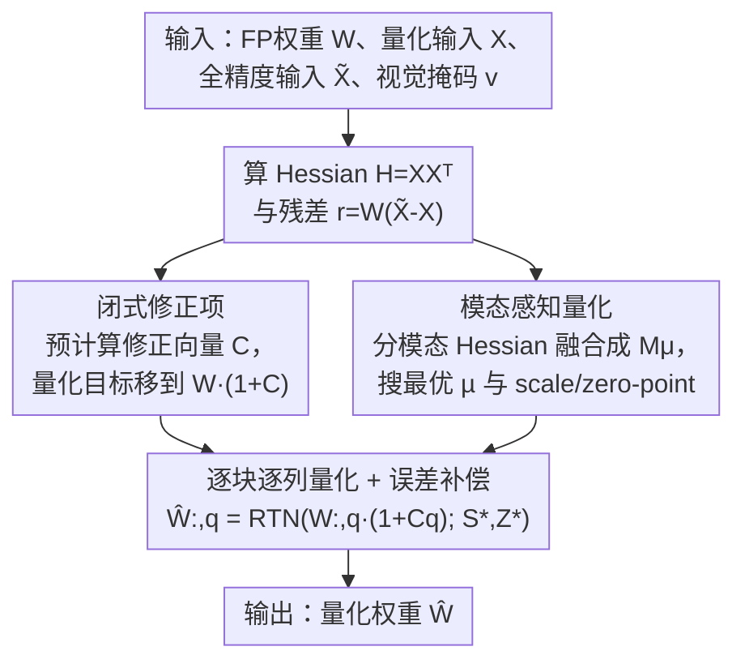

# VLM-PTQ: Efficient Post-Training Quantization for Large Vision-Language Models

**会议**: CVPR 2026  
**论文**: [CVF Open Access](https://openaccess.thecvf.com/content/CVPR2026/html/Deng_VLM-PTQ_Efficient_Post-Training_Quantization_for_Large_Vision-Language_Models_CVPR_2026_paper.html)  
**代码**: 待确认  
**领域**: 模型压缩  
**关键词**: 训练后量化, 视觉-语言模型, 权重补偿, 非对称校准, 模态感知

## 一句话总结
VLM-PTQ 把 GPTQ/GPTAQ 这类权重补偿量化方法迁移到视觉-语言模型时，发现它们有两个被忽略的毛病——非对称目标下"舍入到最近"并不是最优、以及视觉与文本通道被一视同仁地处理；论文用一个闭式修正项把量化目标挪到真正的最优点，再用模态感知的重要性向量重新分配通道权重，在 1B~72B 的 VLM 上把 3bit/2bit 量化精度显著拉高，且额外开销几乎可忽略。

## 研究背景与动机
**领域现状**：大模型部署贵，量化是最实用的压缩手段。训练后量化（PTQ）因为不用重训、只在冻结网络上做一次校准，成了主流。其中"权重补偿"一脉最强：GPTQ 用 Hessian 信息逐列量化权重、并把误差补偿到尚未量化的权重上；GPTAQ 在此基础上引入**非对称校准**——它不再要求量化层去拟合"被量化过的上一层输入" $X$，而是去拟合"原始全精度输入" $\tilde X$，用两者的差驱动一个残差项，从而抑制误差在层间累积。这些方法在纯文本 LLM 上效果很好。

**现有痛点**：作者发现，把这套方法**原封不动搬到 VLM 上会暴露两个问题**。其一，在非对称目标下，每一步量化把全精度权重直接做 RTN（round-to-nearest，舍入到最近的量化格点）其实**不是最优解**——残差会让真正的最优量化目标发生偏移，直接对原始权重取整就偏离了最优点。其二，所有输入通道被**一视同仁**地用来算量化参数，但 VLM 里视觉 token 和文本 token 的统计分布、信息密度完全不同；由于 Hessian 是在所有 token 上联合统计的，统计量大的那个模态会主导量化参数，把另一模态的关键通道压坏。

**核心矛盾**：权重补偿量化的两个核心组件——"量化目标点"和"通道重要性"——都是在 LLM 单模态假设下设计的，而 VLM 是天生多模态、且残差非对称的场景，这两个假设都不再成立。

**本文目标**：在不改变权重补偿框架、不增加重训成本的前提下，(1) 把量化目标点修到非对称目标真正的最优处；(2) 让通道重要性显式区分视觉与文本模态。

**切入角度**：作者直接对 GPTAQ 的逐列损失函数求导，解析地找出连续最优点，再看离散量化下应该落在哪个格点；同时为两个模态各算一个 Hessian，再融合成一个带可调系数的重要性向量。

**核心 idea**：用"闭式修正项 + 模态感知重要性"两件小补丁，把权重补偿量化从"为 LLM 设计"校准成"为 VLM 设计"，只改几行、几乎不加开销。

## 方法详解

### 整体框架
VLM-PTQ 不是另起炉灶，而是嵌进 GPTAQ 的逐层量化循环里打两个补丁。对每一个线性层，输入是全精度权重 $W$、被量化过的输入 $X$、全精度输入 $\tilde X$ 以及一个标记每个 token 是视觉还是文本的二值掩码 $v$；输出是量化后的权重 $\hat W$。流程上：先按 GPTAQ 的方式算出整层 Hessian $H=XX^\top$ 和残差信息，但额外做两件事——**预计算一个逐通道的闭式修正向量 $C$**（把每列权重的量化目标从 $W_{:,q}$ 挪到 $W_{:,q}\cdot(1+C_q)$），以及**为视觉/文本各算一个 Hessian 并融合出模态感知重要性向量 $M_\mu$**（再据此搜出更好的量化参数 scale/zero-point）。然后照常逐块（block size $B$）逐列地量化、补偿误差，只是每列量化时同时套上修正项和模态感知量化参数。

### 关键设计

**1. 闭式修正项：把非对称目标下的量化目标点挪到真正的最优处**

这针对第一个痛点——非对称校准下直接对原始权重做 RTN 并不是最优。作者把 GPTAQ 的补偿量 $\Delta w$ 代回拉格朗日量，得到量化第 $q$ 列时的逐列损失 $L_q$，它除了常规的 $(\hat w_q-w_q)^2/H^{-1}_{qq}$ 项外，还多了一个和残差 $r$ 耦合的交叉项。对 $\hat w_q$ 求导并令其为零，解出连续最优点并不是 $w_q$，而是

$$\hat w_q^{*} = w_q + r X^\top H^{-1}_{:,q}.$$

也就是说最优量化目标比原始权重多了一个修正量 $\delta = r X^\top H^{-1}_{:,q}$。把 $L_q$ 配方后可写成 $\frac{1}{H^{-1}_{qq}}[\hat w_q-(w_q+\delta)]^2+\text{const}$，于是离散最优解就是 $\hat w_q^{\text{opt}}=\mathrm{RTN}(w_q+\delta)$——应该对"修正后的权重"取整，而不是对原始权重取整。当 $\delta\neq0$ 时，RTN 就偏离了最优。

关键在于把这个修正算得便宜。利用残差可分解为 $r=W\Delta X$（$\Delta X=\tilde X-X$）以及权重每行可独立处理的结构，逐行修正可化简成一个所有行共享的标量因子，从而预计算出一个修正向量

$$C = \mathrm{diag}(\Delta X X^\top H^{-T})\odot\mathrm{diag}(H^{-T}),$$

最终把第 $q$ 列的量化点写成 $\hat W_{:,q}=\mathrm{RTN}(W_{:,q}\cdot(1+C_q))$。由于 $\Delta X X^\top$ 在原残差分解里本来就要算，提取对角元只是 $O(n^2)$，几乎不增成本。它有效是因为它**精确补偿了残差引起的目标偏移**，把每列损失 $L_q$ 真正压到非对称目标的最小值，而 GPTAQ 因为还用 RTN 停在了更高的损失上。

**2. 模态感知量化：让视觉和文本通道不再被同一把尺子量**

这针对第二个痛点——VLM 里两个模态信息密度悬殊，但 Hessian 在所有 token 上联合统计，统计量大的模态会主导量化参数。作者用视觉掩码 $v$ 把输入激活拆开，给两个模态各算一个 Hessian：$H_v=X_{:,v}X_{:,v}^\top$、$H_l=X_{:,\neg v}X_{:,\neg v}^\top$，取对角线得到各自的逐通道重要性 $H_v^{\text{diag}}$、$H_l^{\text{diag}}$，再融合成一个带可调系数的模态感知重要性向量

$$M_\mu = \mu\cdot H_v^{\text{diag}} + (1-\mu)\cdot H_l^{\text{diag}},$$

其中 $\mu\in[0,1]$ 是**逐层**的"模态感知系数"，控制该层更看重视觉还是文本。$M_\mu$ 被当作重构目标里的加权项参与求 scale $S$ 和 zero-point $Z$：$S^*,Z^*=\arg\min_{S,Z}\sum_n \frac{M_\mu^n}{n}\lVert W_n-\mathrm{RTN}(W_n;S,Z)\rVert_2^2$，于是重要通道获得更精细的量化。$\mu$ 本身通过一次**轻量网格搜索**确定（例如 6 个候选），在一小批校准样本上选使输出重构误差 $\lVert W\tilde X-\hat W_\mu X\rVert_2^2$ 最小的那个。它有效是因为论文实测（Figure 3）不同层视觉/文本 Hessian 量级差异很大、且各层的最优 $\mu$ 各不相同（Figure 4），固定权重必然偏向某一模态、放大初始量化误差，而逐层自适应能把量化精度引向各层真正关键的通道。

### 损失函数 / 训练策略
两个补丁最终被整进同一套逐层量化算法（Algorithm 1）：先算整层与两个模态的 Hessian、做逆 Cholesky 分解，预计算修正向量 $C$ 和模态感知向量 $M_\mu$，并一次性搜出 $\mu^*,S^*,Z^*$；随后照 GPTQ/GPTAQ 的逐块逐列流程量化，每列用 $\hat W_{:,j}=\mathrm{RTN}(W_{:,j}\cdot(1+C_j);S^*,Z^*)$，并把量化误差按 $E_{:,j}=(W_{:,j}-\hat W_{:,j})/L_{jj}$ 补偿到后续列。校准沿用 GPTAQ 配置：用 ShareGPT4V 改进版 COCO Caption 随机采 128 对图文做校准集，权重 clip 范围按最小化 MSE 搜索、激活 clip 比例 0.9，全程关闭 act_order 以匹配量化推理逻辑。

## 实验关键数据

模型覆盖 Qwen2.5-VL-3B/7B/72B-Instruct 与 InternVL3-1B/14B/38B-Instruct，仅量化 VLM 中的语言模型部分，单张 H20（96GB）完成。评测用 LMMs-Eval 框架下 8 个基准（ChartQA、DocVQA、MME-RealWorld 英/中、OCRBench、ScienceQA、SeedBench 2 Plus、TextVQA）。

### 主实验：仅权重量化（W3/W2）

| 模型 | 设置 | GPTQ | GPTAQ | 本文(Ours) | FP16 |
|------|------|------|-------|-----------|------|
| Qwen2.5-VL-7B | 3bit Avg | 63.8 | 65.0 | **71.3** | 77.2 |
| Qwen2.5-VL-7B | 2bit Avg | 42.0 | 43.1 | **48.4** | 77.2 |
| InternVL3-14B | 3bit Avg | 67.0 | 69.7 | **76.0** | 78.2 |
| InternVL3-38B | 2bit Avg | 59.4 | 62.9 | **69.4** | 80.2 |
| Qwen2.5-VL-72B | 3bit Avg | 68.1 | 71.2 | **76.9** | 78.2 |

3bit 下本文几乎逼近 FP16：72B 保留 98.3% 的 FP16 性能，14B 保留 97.2%；text-heavy 任务提升最猛，如 7B 的 DocVQA 从 87.6→92.3、MME-RealWorld 英从 38.4→51.3。2bit 这种极端压缩下优势更明显，7B 的 MME-RealWorld 中文从 5.3→20.3。

### 主实验：权重+激活量化（W2A8KV8）

| 模型 | GPTQ | GPTAQ | 本文(Ours) | FP16 |
|------|------|-------|-----------|------|
| Qwen2.5-VL-7B | 38.0 | 39.3 | **44.6** | 77.2 |
| InternVL3-14B | 45.0 | 46.1 | **55.0** | 78.2 |
| InternVL3-38B | 54.2 | 57.3 | **64.1** | 80.2 |
| Qwen2.5-VL-72B | 52.9 | 55.9 | **63.2** | 78.2 |

更难的权重+激活联合量化下，本文相对 GPTAQ 普遍 +5~9 个百分点（14B 绝对提升 8.9），72B 在 2bit 权重下仍保留 80.8% FP16 性能。

### 消融实验（Qwen2.5-VL-7B，W3A16）

| 配置 | MME英 | Avg | 显存 | 时间 |
|------|-------|-----|------|------|
| GPTQ | 38.4 | 63.8 | 0.5GB | 748s |
| GPTAQ（基线） | 38.4 | 65.0 | 0.7GB | 921s |
| GPTAQ + C（仅修正项） | 40.6 | 66.2 | 0.7GB | 955s |
| GPTAQ + M.5（µ 固定 0.5） | 49.2 | 69.8 | 0.7GB | 970s |
| GPTAQ + Mµ*（µ 自适应） | 50.4 | 70.4 | 0.9GB | 1008s |
| Ours（C + Mµ*） | **51.3** | **71.3** | 0.9GB | 1020s |

### 关键发现
- **两个组件互补、可叠加**：从 GPTAQ 的 65.0 起步，单加修正项 C 到 66.2（+1.2，开销几乎为零），单加模态感知向量 M 到 70.4（+5.4），两者合起来 71.3（比基线 +6.3，达 FP16 的 92.3%）。说明它们解决的是量化问题的不同侧面。
- **模态感知是主力，且自适应 µ 有必要**：把 µ 全层固定 0.5 只到 69.8，逐层自适应搜 µ 到 70.4——0.6 点差距印证不同层对视觉/文本敏感度确实不同（Figure 4 显示 q/k/v proj 各层最优 µ 分散）。
- **开销极小**：完整方法校准时间从 GPTAQ 的 921s 增到 1020s（多约 99s），显存从 0.7GB 增到 0.9GB（+0.2GB），换来相对 GPTQ 的 7.5 点精度提升，性价比很高。

## 亮点与洞察
- **闭式解很优雅**：直接对非对称目标的逐列损失求导，证明 RTN 不是最优、并给出可预计算的修正向量 $C$，几乎零成本就把量化目标挪到理论最优。这种"先把目标函数写对、再看 RTN 偏了多少"的分析方式可迁移到其他权重补偿量化方法。
- **"模态不平衡"切得准**：把"Hessian 在所有 token 上联合统计"这一隐藏假设点破，并用分模态 Hessian + 逐层 µ 搜索这种极轻的方式修正，是这篇最让人"啊哈"的地方——问题诊断（Figure 3 的量级差异）和解法一一对应。
- **工程友好**：两个补丁都嵌进现有 GPTQ/GPTAQ 循环、只改几行，复用了管线里本就要算的 $\Delta X X^\top$，对想直接上量化的人很有吸引力。

## 局限与展望
- **只量化语言模型部分**：为公平对比，作者只量化 VLM 里的 LLM backbone，视觉编码器和 adapter 未量化，整体压缩率受限；视觉塔的量化是否同样吃模态感知，论文没回答。
- **µ 靠网格搜索**：逐层 µ 用约 6 个候选的网格搜索定，校准批量小（128 对图文），µ 的搜索粒度和校准样本代表性可能影响稳定性；更细或可学习的 µ 是自然的延伸。
- **依赖视觉掩码**：模态感知需要明确知道哪些 token 是视觉、哪些是文本，对视觉/文本深度交错或无清晰边界的架构可能不直接适用。
- **未给推理实测吞吐**：论文报告的是量化精度与校准开销，没有给量化后端到端推理加速/显存实测，部署收益需另行验证。

## 相关工作与启发
- **vs GPTQ**：GPTQ 用 Hessian 逐列量化、对称校准；本文继承其逐块 Cholesky 流程，但指出在非对称目标下其 RTN 取整点是次优的，并补上修正项与模态感知，3bit 下相对 GPTQ 在 7B 上 +7.5 点。
- **vs GPTAQ**：GPTAQ 引入非对称校准、用残差对齐全精度目标，是本文最直接的基线；本文证明 GPTAQ 仍停在 RTN 的次优点、且对 VLM 模态不平衡无感，两个补丁把 7B 的 W3A16 从 65.0 推到 71.3。
- **vs 分布整形类 PTQ（SmoothQuant / 旋转 / 通道重排等）**：那一脉通过改激活/权重统计来降低低比特映射难度；本文属于互补的权重补偿一脉，专注消除量化失真本身，且首次把"模态"这一 VLM 特有维度引入通道重要性，二者原则上可叠加。

## 评分
- 新颖性: ⭐⭐⭐⭐ 把权重补偿量化从 LLM 校准到 VLM 的两个洞察（非对称目标的闭式修正 + 模态感知通道重要性）都很扎实，但属于在 GPTAQ 上的精细化改进而非全新框架。
- 实验充分度: ⭐⭐⭐⭐⭐ 覆盖两大 VLM 家族、1B~72B 六个规模、仅权重与权重+激活两种设置、8 个基准，外加成本/显存消融，非常完整。
- 写作质量: ⭐⭐⭐⭐ 公式推导清晰、问题诊断有可视化支撑；个别记号偏密，初读门槛略高。
- 价值: ⭐⭐⭐⭐ 改动小、开销低、效果明显，对想直接落地 VLM 低比特量化的工程实践很实用。

<!-- RELATED:START -->

## 相关论文

- [\[CVPR 2026\] LS-ViT: Least-Squares Hessian Based Block Reconstruction for Low-Bit Post-Training Quantization of Vision Transformers](ls-vit_least-squares_hessian_based_block_reconstruction_for_low-bit_post-trainin.md)
- [\[AAAI 2026\] Post Training Quantization for Efficient Dataset Condensation](../../AAAI2026/model_compression/post_training_quantization_for_efficient_dataset_condensation.md)
- [\[CVPR 2026\] CAR-SAM: Cross-Attention Reconstruction for Post-Training Quantization of the Segment Anything Model](car-sam_cross-attention_reconstruction_for_post-training_quantization_of_the_seg.md)
- [\[CVPR 2026\] Rethinking Token Reduction for Large Vision-Language Models](rethinking_token_reduction_for_large_vision-language_models.md)
- [\[CVPR 2026\] Attention-aware Inference Optimizations for Large Vision-Language Models with Memory-efficient Decoding](attention-aware_inference_optimizations_for_large_vision-language_models_with_me.md)

<!-- RELATED:END -->
