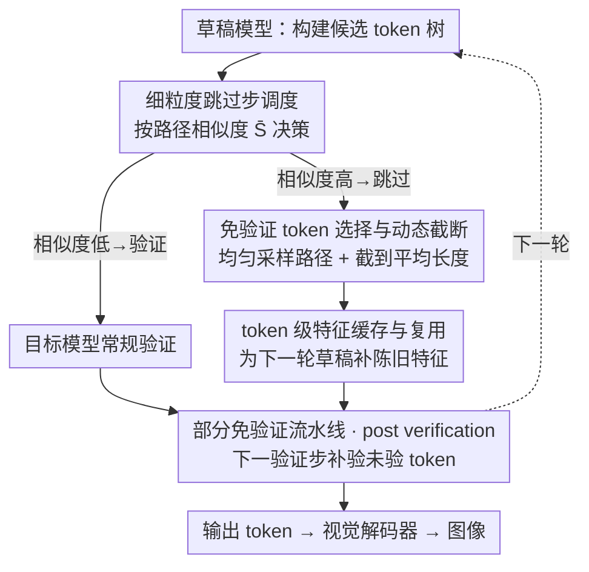

# VVS: Accelerating Speculative Decoding for Visual Autoregressive Generation via Partial Verification Skipping

**会议**: CVPR2026  
**arXiv**: [2511.13587](https://arxiv.org/abs/2511.13587)  
**代码**: https://github.com/HyattDD/VVS （有）  
**领域**: 模型压缩 / 推理加速 / 视觉自回归生成  
**关键词**: 投机解码、视觉自回归、验证跳过、特征缓存、推理加速

## 一句话总结
VVS 第一次在视觉自回归生成的投机解码（SD）中"部分跳过验证"——靠免验证 token 选择 + 陈旧特征缓存复用 + 相似度驱动的跳过调度，把目标模型的前向次数最多砍掉 2.86×、端到端加速 1.76×，且图像质量基本不掉，打破了 SD"草稿一步、验证一步"无法显式减少前向次数的天花板。

## 研究背景与动机

**领域现状**：视觉自回归（AR）生成模型（如 LlamaGen）用"下一个 token 预测"逐 token 生成图像，质量已能与扩散模型抗衡，但一张图要几百上千次前向，延迟极高。投机解码（SD）是当前主流加速手段：用一个小草稿模型 $M_d$ 快速提出若干候选 token，再让大目标模型 $M_t$ 一次并行验证、批量接受。为了适配视觉 token 与文本 token 分布迥异、严格验证下接受率极低的问题，LANTERN、GSD 等用"松弛接受"（聚合空间相邻 token 概率）或聚类来提高接受率。

**现有痛点**：所有现有方法都死守"草稿一步、然后逐一验证一步"的范式——**每一个草稿候选都要过目标模型验证**。即便接受率提上去了，目标模型的调用次数（= 前向次数，延迟的主要来源）也没有被显式削减。EAGLE-2 直接搬到视觉 AR 上甚至会变慢（壁钟 0.87×/0.92×）。

**核心矛盾**：SD 的加速天花板被"必须逐步验证"这个范式本身卡死。视觉 token 是高度可互换的，对它们做穷尽式验证存在大量冗余，但没人敢跳过验证——因为跳过后会面临三个硬问题：① 不验证怎么决定接受哪些 token？② 跳过验证意味着这一步没有目标模型产生的中间状态，下一轮草稿拿什么特征？③ 跳多了草稿模型就成了主生成器，质量会崩，怎么分配跳过的步数？

**切入角度**：作者对草稿阶段做了两个量化观察，正好回应前两个顾虑。**(i) 验证冗余**：候选 token 树里不同路径之间高度相似（75% 的 SD 迭代里路径序列余弦相似度 >0.7），人为把目标模型选出的路径替换成另一条路径，图像保真度几乎不受影响（FID 在同等加速下只波动 ~0.4），说明"验证选哪条路径"这件事大量步骤是冗余的。**(ii) 陈旧特征可复用**：相邻 token 的特征相似度达 0.68，用上一步缓存的陈旧特征做草稿，平均接受长度（MAL）仍能保留新鲜特征的 73%；进一步把新鲜特征与陈旧特征交替混用（各占 50%），MAL 维持率还能从 73% 升到 85%。

**核心 idea**：既然验证有冗余、陈旧特征可复用，那就**部分跳过验证**——让一部分 SD 步骤不查目标模型、直接接受草稿 token，并用缓存特征顶上缺失的中间状态，从而显式砍掉目标模型的前向次数。

## 方法详解

### 整体框架
VVS 是一个面向视觉 AR 生成的投机解码框架，目标是**显式减少目标模型前向次数**。它不改草稿/目标模型本身，而是在 SD 循环里插入一个"跳过开关"：每一步先由调度器看候选 token 树的路径相似度，决定这一步是走常规验证、还是免验证。走免验证时，token 选择器从候选路径里采样并截断出一段接受序列、特征缓存模块为下一轮草稿补上陈旧特征；这些"未验证 token"不会被丢着不管，而是在下一个验证步与新候选拼在一起、由目标模型一次性补验（作者称 **post verification**），借此恢复精确的 AR 条件和 KV-cache。为防止误差累积，硬性规定**不能连续两步都免验证**。

下面四个模块按 SD 循环里的执行流向自上而下对应：

### 关键设计

**1. 细粒度跳过步调度：用候选路径相似度决定哪一步可以免验证**

跳得太多草稿模型就变成主生成器、质量必崩，所以"何时跳、跳多频繁"是质量-速度权衡的总阀门。作者给出两套策略。规则式（uniform，VVS-U）：固定间隔 $i$，每 $i-1$ 个正常验证步后跳过第 $i$ 步——零开销，但忽略每步候选树的动态、控制粒度粗。动态式（VVS-D）：当候选树里不同路径的加权相似度超过阈值 $\bar{S}$ 时才跳过，

$$\bar{S}=\sum_{\ell=0}^{L-1} w_\ell \cdot S^{(\ell)},\quad w_\ell=\frac{\alpha^{\ell}}{\sum_{k=0}^{L-1}\alpha^{k}}$$

其中 $S^{(\ell)}$ 是位置 $\ell$ 处 token 表示的余弦相似度，$\alpha$ 是指数衰减权重（越靠前的位置权重越高）。直觉是：候选高度相似时，即便跳过验证、草稿选出的 token 也大概率接近目标模型会验证出的那个。逐迭代算相似度有开销，作者用 `torch.jit` + 路径下采样（stride=2）把决策开销压到原来的 ~25%。同样强制相邻两次跳过之间至少隔一个验证步来抑制误差累积。

**2. 免验证 token 选择与动态截断：跳过验证时如何挑 token 又不让质量崩**

免验证步没有目标模型对齐，接受哪条路径必须自己拿主意。最朴素的做法是信草稿模型、选置信度最高的路径，但草稿树是**贪婪构造**的，一路挑最自信的路径等于往生成里注入"贪婪解码碎片"，会肉眼可见地拉垮图像保真度（贪婪解码在视觉 AR 上本就有害，不同于 LLM）。VVS 改为**从候选路径里均匀采样**一条，把每个免验证步变成一次随机抽取，以匹配 temperature=1 时的解码多样性。

此外，置信度沿路径累积衰减，长路径全留会侵蚀保真度，且动态剪枝下各步 token 树结构不一。于是对选中路径做**动态截断**，只保留前 $\gamma$ 个 token：

$$\gamma=\min\!\bigl(L_s,\ \lfloor\bar{L}\rfloor\bigr),\qquad \bar{L}=\frac{1}{|\mathcal{P}|}\sum_{P_i\in\mathcal{P}}|P_i|$$

$L_s$ 是选中路径长度，$\bar{L}$ 是剪枝后 token 树里各路径的平均长度，$\mathcal{P}$ 是路径集合。即"跳过步接受的 token 数"被卡到不超过平均路径长——草稿对后续候选的置信度越往后越低，限制跳过 token 数就稳住了质量，让接受长度跨步更平稳（不截断时接受长度大幅震荡）。

**3. token 级特征缓存与复用：跳过验证后补上草稿所需的中间特征**

免验证步不产生目标模型的中间特征，下一轮草稿就缺了构建候选树所需的隐状态。基于"陈旧特征可复用"的观察，VVS 在每次验证时把**token 级特征**（输出头之前的隐状态）缓存进 buffer，下一步免验证草稿时直接复用。由于每步接受 token 数 $\gamma_i$ 在变、且有截断，要复用的特征数（= 第 $i$ 步免验证接受的 token 数）可能横跨多个历史步，而非单一最近验证步——于是从缓存 $f_{i-1}$ 里取出"数量与 $\gamma_i$ 匹配、且最新"的若干 token 级特征。整个流水线因此运行在**混合陈旧度**的特征上；消融证明把最新缓存特征与新鲜特征混合复用（而非纯用某一陈旧度）效果最好。

**4. 部分免验证流水线与 post verification：把未验 token 在下一步补验、约束误差累积**

这是把上面三件事串起来的范式骨架。第 $i$ 步开启跳过时，草稿模型基于缓存陈旧特征 $\bm{h}_{i-1}$ 和上一步选中 token 序列 $\bm{x}_{i-1}^*$ 的嵌入 $\bm{e}_{i-1}$ 产出候选 $\bm{c}_i$，立即接受其中一条得到暂定续写 $\bm{x}_i^\circ$（不查目标模型）。到下一个恢复验证的第 $i+1$ 步，把未验序列 $\bm{x}_i^\circ$ 拼到新草稿候选 $\bm{c}_{i+1}$ 前面，**一次前向**送进目标模型——这就是 post verification：旧的未验 token 和新 token 一起处理，恢复缺失的 KV-cache 条目、重建精确的 AR 条件。配合"不能连续两步免验证"的硬约束（否则 $\bm{x}_{i-1}^*$ 会退化成 $\bm{x}_{i-1}^\circ$、未验 token 堆积导致不可控误差累积），实现了"少查目标模型、但质量可控"。

### 损失函数 / 训练策略
VVS 是**纯推理期框架**，不需要重训或改动标准草稿模型训练流程（沿用 EAGLE-2 的草稿 checkpoint 和 LANTERN 的松弛接受机制）；因此没有新的损失函数。所有"训练"都来自现成的草稿/目标模型，VVS 只在解码循环里做选择、缓存与调度。

## 实验关键数据

设置：在 LlamaGen-XL Stage I / Stage II 上评测，MS-COCO 验证集 5000 张 caption 生成图像。Baseline：Vanilla AR、EAGLE-2、LANTERN（松弛接受）；VVS 自身也内置松弛接受（$\delta$）。温度固定 1.0，不用贪婪解码。速度指标 $\mathrm{TPF}=\dfrac{\text{生成 token 数}}{\text{目标模型前向次数}}$（越大越快、与设备无关），壁钟加速 $l$ 在单卡 A40 上测。

### 主实验

| 模型 | 方法 | 壁钟 $l$↑ | TPF↑ | FID↓ | CLIP↑ | Precision↑ | Recall↑ |
|------|------|------|------|------|------|------|------|
| LlamaGen-XL Stage I | Vanilla AR | 1.00× | 1.00 | 24.88 | 0.3220 | 0.5084 | 0.6684 |
| | EAGLE-2 | 0.87× | 1.22 | 25.28 | 0.3220 | 0.5094 | 0.6690 |
| | LANTERN ($\delta$=0.3) | 1.45× | 2.10 | 24.97 | 0.3223 | 0.5494 | 0.6438 |
| | **VVS-U** ($i$=4,$\delta$=0.2) | **1.63×** | **2.24** | 24.96 | 0.3210 | 0.5416 | 0.6486 |
| LlamaGen-XL Stage II | Vanilla AR | 1.00× | 1.00 | 48.23 | 0.2939 | 0.4028 | 0.5784 |
| | EAGLE-2 | 0.92× | 1.22 | 47.80 | 0.2937 | 0.4040 | 0.5594 |
| | LANTERN ($\delta$=0.2) | 1.26× | 1.83 | 50.23 | 0.2910 | 0.4458 | 0.5360 |
| | **VVS-U** ($i$=2,$\delta$=0.1) | **1.76×** | **2.86** | **47.19** | 0.2886 | 0.4856 | 0.4588 |

- VVS-U 在 Stage II 把目标模型前向次数砍到 1/2.86、壁钟 1.76×，TPF 全面超过 LANTERN 与 EAGLE-2，且只需极轻的松弛 $\delta$=0.1。FID 47.19 甚至优于 Vanilla AR（48.23）和 LANTERN（50.23）。
- EAGLE-2 在视觉 AR 上壁钟反而 <1×（变慢），印证文本域 SD 直接搬过来失效。
- 用相似度驱动的动态跳过（$s$=0.65）在 $\delta$=0.2 下可达 **3.1× TPF** 而无可见质量退化。
- 速度-质量权衡（Pareto front, FID–TPF）上 VVS 全面占优；动态跳过（VVS-D）比均匀跳过（VVS-U）控制更细，弥补了 uniform 跳过固有的质量不稳。

### 消融实验

**token 选择与截断**（uniform 跳过、间隔=3）：

| 策略 | 截断 | TPF | FID↓ | Precision↑ | Recall↑ |
|------|------|-----|------|------|------|
| 采样 Samp.($\delta$=0.1) | ✓ | 2.16 | **23.88** | 0.5498 | 0.6734 |
| 置信 Conf.($\delta$=0.1) | ✗ | 2.42 | 26.24 | 0.5492 | 0.6300 |
| 置信 Conf.($\delta$=0.1) | ✓ | 2.16 | 24.71 | 0.5426 | 0.6604 |
| 采样 Samp.($\delta$=0.2) | ✓ | 2.43 | **25.49** | 0.5376 | 0.6184 |
| 置信 Conf.($\delta$=0.2) | ✗ | 2.69 | 27.41 | 0.5606 | 0.5988 |
| 置信 Conf.($\delta$=0.2) | ✓ | 2.43 | 26.20 | 0.5458 | 0.6110 |

**特征陈旧度**（uniform 跳过、间隔=3、$\delta$=0.2；$s$ 为额外陈旧度，$-1$=最新鲜、$0$=最近缓存、$3$=更陈旧）：

| $s_1$ | $s_2$ | TPF | FID↓ | CLIP↑ | Precision↑ | Recall↑ |
|------|------|-----|------|------|------|------|
| 0 | 0 | 2.23 | 32.63 | 0.3113 | 0.5296 | 0.5682 |
| -1 | 3 | 2.27 | 28.93 | 0.3152 | 0.5290 | 0.6360 |
| **-1** | **0** | **2.31** | **27.69** | 0.3179 | 0.5398 | 0.6088 |

### 关键发现
- **均匀采样 > 选最高置信**：相近 TPF 下，采样路径的 FID（23.88）远好于贪婪选置信（截断后 24.71、不截断 26.24）。原因是草稿树贪婪构造，固定选最自信路径等于提交贪婪续写、缺乏多样性；随机采样注入了有益多样性。
- **截断不可省**：不截断时 TPF 更高（2.42→更快）但 FID 显著恶化（26.24 vs 24.71），接受 token 数大幅震荡导致过多 token 绕过验证。截断用"质量换可控"。
- **特征要"新鲜+最近"混合**：纯用陈旧特征（$s_1{=}s_2{=}0$）FID 高达 32.63；把新鲜（-1）与最近缓存（0）混合时 TPF 最高（2.31）且 FID 最低（27.69），验证了第 3 节"混合陈旧度"的观察。

## 亮点与洞察
- **范式级创新**：第一次质疑"SD 必须逐步验证"这条铁律，把"跳过验证"做成可控操作，直击延迟主因——目标模型前向次数。这是从"提高接受率"到"减少调用次数"的思路转向，与松弛接受正交、可叠加。
- **观察先行、方法跟进**：两个量化观察（路径相似度 >0.7 占 75%、相邻特征相似 0.68、混合特征 MAL 73%→85%）不是事后解释，而是直接转译成三个模块的设计依据，论证链条干净。
- **post verification 很巧**：跳过验证不是"赖账"，而是把未验 token 延迟到下一步与新候选一起补验，一次前向既恢复 KV-cache 又对齐 AR 条件，几乎零额外成本地把"跳过"做成可逆。
- **可迁移点**：免验证 + 缓存复用 + 相似度调度这套组合，思路上可迁到任何"草稿-验证"式加速（如视频 AR、统一多模态 AR 生成），凡是 token 高度可互换的模态都可能吃到红利。

## 局限与展望
- **依赖视觉 token 可互换性**：整套方法的前提是"验证选哪条路径不太影响保真度"，这在视觉 AR 成立，但换到 token 不可互换、语义敏感的模态（如代码、严格布局）可能直接失效。
- **质量确有让步**：Stage II 的 VVS-U 虽 FID 更优，但 Recall（0.4588）明显低于 Vanilla（0.5784）和 LANTERN（0.5360），HPSv2 也偏低——加速是以多样性/覆盖度为代价的，论文坦承是"质量-速度权衡"。
- **评测范围有限**：只在 LlamaGen-XL + MS-COCO 上验证，未覆盖更大模型、更高分辨率或类条件生成，泛化性待考。$\bar{S}$、$\delta$、跳过间隔等阈值需按模型/任务调，缺乏自适应方案。
- **作者展望**：VVS 不改草稿模型训练，未来可针对"部分免验证"专门优化草稿模型训练，进一步加速。

## 相关工作与启发
- **vs LANTERN**：LANTERN 用松弛接受（聚合空间相邻 token 概率）提高接受率，但仍**逐步全验证**，前向次数没降。VVS 直接跳过部分验证步、显式砍前向次数，且内置 LANTERN 的松弛机制，两者正交可叠加——VVS 在相近 FID 下 TPF/壁钟全面更高。
- **vs EAGLE-2**：EAGLE-2 是文本域特征级草稿 SD 的代表，VVS 复用了它的特征级草稿与草稿 checkpoint，但 EAGLE-2 直接用于视觉 AR 会变慢（0.87×/0.92×），VVS 通过免验证范式把它救活。
- **vs GSD / SJD**：GSD 靠验证期 token 聚类、SJD 靠概率化 Jacobi 解码提高接受率，都还在"先验证后接受"框架内打转；VVS 跳出该框架，做"部分免验证"。
- **vs 量化/剪枝**：SD 与量化、token 剪枝正交，VVS 作为 SD 的新范式可与这些压缩手段叠加，构成更激进的推理加速栈。

## 评分
- 新颖性: ⭐⭐⭐⭐⭐ 首次提出投机解码"部分跳过验证"，从范式层面打破逐步验证的加速天花板。
- 实验充分度: ⭐⭐⭐⭐ 主结果 + 两组核心消融 + Pareto 分析扎实，但仅 LlamaGen+MS-COCO，模型/任务覆盖偏窄。
- 写作质量: ⭐⭐⭐⭐⭐ 观察→设计→实验链条清晰，三模块对应三个跳过难题，逻辑闭环。
- 价值: ⭐⭐⭐⭐ 即插即用、与松弛接受/量化正交，对视觉 AR 推理加速有直接工程价值，但质量让步（Recall 下降）限制了无脑使用。

<!-- RELATED:START -->

## 相关论文

- [\[NeurIPS 2025\] Traversal Verification for Speculative Tree Decoding](../../NeurIPS2025/model_compression/traversal_verification_for_speculative_tree_decoding.md)
- [\[CVPR 2026\] Progressive Supernet Training for Efficient Visual Autoregressive Modeling](progressive_supernet_training_for_efficient_visual_autoregressive_modeling.md)
- [\[ICML 2026\] SPEED-Bench: A Unified and Diverse Benchmark for Speculative Decoding](../../ICML2026/model_compression/speed-bench_a_unified_and_diverse_benchmark_for_speculative_decoding.md)
- [\[ICLR 2026\] PTQ4ARVG: Post-Training Quantization for AutoRegressive Visual Generation Models](../../ICLR2026/model_compression/ptq4arvg_post-training_quantization_for_autoregressive_visual_generation_models.md)
- [\[ICCV 2025\] Bridging Continuous and Discrete Tokens for Autoregressive Visual Generation](../../ICCV2025/model_compression/bridging_continuous_and_discrete_tokens_for_autoregressive_visual_generation.md)

<!-- RELATED:END -->
