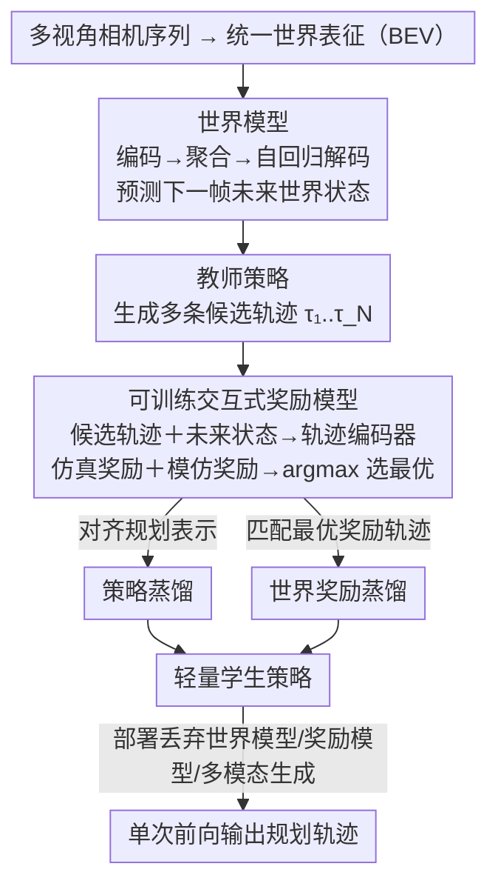

# WPT: World-to-Policy Transfer via Online World Model Distillation

**会议**: CVPR 2026  
**arXiv**: [2511.20095](https://arxiv.org/abs/2511.20095)  
**代码**: 无  
**领域**: 模型压缩  
**关键词**: 世界模型, 策略蒸馏, 奖励模型, 自动驾驶, 在线蒸馏

## 一句话总结
WPT 提出世界-策略转移训练范式，通过可训练的奖励模型将世界模型的未来预测知识注入教师策略，再通过策略蒸馏和世界奖励蒸馏转移到轻量学生策略，实现79.23驾驶得分（闭环）且推理速度提升4.9倍。

## 研究背景与动机
1. **领域现状**：世界模型在自动驾驶中用于捕捉时空动态、预测未来场景，但现有方法存在紧密运行时耦合或依赖离线奖励信号的问题。
2. **现有痛点**：直接集成世界模型的方法导致严重的推理延迟；将世界模型作为模拟器的方法依赖模拟器保真度。
3. **核心矛盾**：世界模型提供宝贵的未来预测知识，但部署时不能承受其计算开销。
4. **本文目标**：在训练时利用世界模型知识，部署时仅用轻量策略网络，实现"训练时用世界模型，部署时丢弃"。
5. **切入角度**：通过奖励模型作为桥梁，将世界模型的预测与策略的轨迹选择关联，然后蒸馏到学生。
6. **核心idea**：可训练的交互式奖励模型评估候选轨迹与世界模型预测的一致性→教师策略学会未来感知规划→策略蒸馏+世界奖励蒸馏转移到学生。

## 方法详解

### 整体框架
WPT 想要的是"鱼和熊掌兼得"：既享受世界模型对未来场景的预测能力，又不在部署时为它高昂的自回归推理买单。它把整套流程拆成训练和部署两个互不相同的形态。训练时，先让世界模型推演出下一帧的未来世界状态，再让一个奖励模型把当前的多条候选轨迹拿去和这个预测的未来逐一比对、打分，教师策略据此挑出最优轨迹——这条链路让教师学会了"未来感知"的规划。部署时，世界模型、奖励模型、多模态候选生成这些重家伙全部丢弃，只留下一个轻量学生策略；学生事先已通过两路蒸馏把教师的本事学到手，单次前向就能给出接近教师的规划。

### 关键设计

**1. 可训练交互式奖励模型：把不可微的世界知识变成可学习的奖励信号**

世界模型预测的未来是宝贵的，但它本身不可微、也无法直接告诉策略"该选哪条轨迹"，这正是直接集成世界模型的方法绕不开的痛点。WPT 的做法是在两者之间插一个可训练的奖励模型当桥梁：把每条候选轨迹 $\tau_i$ 与世界模型预测的未来状态 $F_{t+1}^w$ 拼在一起送进轨迹编码器，再由两个奖励头分别评分——一个模仿奖励衡量轨迹与人类驾驶偏好的一致性，一个仿真奖励按 PDM 评分等驾驶质量指标打分，最终奖励是两者的加权。关键在于这个奖励模型是"可训练 + 交互式"的：它读取世界模型的预测，又对轨迹可微，于是把原本只能靠离线信号或模拟器保真度评估的轨迹质量，变成了教师策略能端到端优化的目标，世界模型的未来预测知识就这样流进了策略。

**2. 策略蒸馏：让学生在一次前向里复现教师的规划表示**

教师之所以强，是因为它走了"多模态候选 → 奖励打分 → 选最优"这一整套带世界模型交互的重流程，可学生网络结构简单，没法也不该背上这套开销。策略蒸馏只盯住结果而非过程：把教师和学生的规划表示（planning queries 经 decoder 后的特征）对齐，逼学生把那条端到端映射直接学会。这样学生不必生成多模态轨迹、也不必和世界模型交互，单次前向传播就能产出与教师贴近的规划，把训练时的算力全部留在了训练阶段。

**3. 世界奖励蒸馏：对齐的不只是表示，还有"什么轨迹在未来里最好"的决策逻辑**

只对齐规划表示有个隐患：学生可能学到了相似的中间特征，却没真正继承教师"挑哪条轨迹"的判断。世界奖励蒸馏补上这一层——它鼓励学生输出的轨迹，在世界模型预测的未来世界里拿到的奖励，逼近教师所选最优轨迹的奖励，本质是让学生匹配教师那条奖励最高的轨迹。表示蒸馏管"长得像"，奖励蒸馏管"选得对"，两路合起来才把教师的未来感知规划完整地搬到学生身上，这也解释了为何消融里去掉世界奖励蒸馏后性能会掉。

### 损失函数 / 训练策略
教师训练由两部分奖励驱动：模仿奖励（对齐人类驾驶偏好）+ 仿真奖励（PDM 等驾驶质量指标）。蒸馏阶段则叠加策略蒸馏损失（对齐规划表示）与世界奖励蒸馏损失（匹配教师最优奖励轨迹），共同把教师能力转移到学生。

## 实验关键数据

### 主实验

| 基准 | 指标 | WPT | 之前SOTA | 提升 |
|------|------|-----|---------|------|
| 开环 | L2误差 | 0.61m | - | 竞争力 |
| 开环 | 碰撞率 | 0.11% | - | SOTA |
| 闭环 | 驾驶得分 | 79.23 | - | SOTA |
| 推理速度 | 加速比 | 4.9× | 1× | 显著提升 |

### 消融实验

| 配置 | 关键指标 | 说明 |
|------|---------|------|
| Full WPT (教师) | 最优 | 世界模型增强的教师 |
| Full WPT (学生) | 接近教师 | 蒸馏保留大部分增益 |
| w/o 世界奖励蒸馏 | 下降 | 奖励蒸馏很重要 |
| w/o 奖励模型 | 显著下降 | 奖励模型是核心 |

### 关键发现
- 学生策略在推理速度提升4.9倍的同时保留了教师大部分性能增益。
- 世界奖励蒸馏相比纯策略蒸馏提供了额外的提升，说明决策逻辑的转移很重要。
- WPT在不同轻量策略架构上都有效，说明框架通用性好。

## 亮点与洞察
- **"训练时用世界模型，部署时丢弃"**的范式很有吸引力：获得世界模型的好处又不付部署代价。
- **可训练奖励模型**作为知识转移的桥梁是巧妙设计，将不可微的世界知识转化为可微的学习信号。
- 双重蒸馏（表示+奖励）比单一蒸馏更完整。

## 局限与展望
- 依赖预训练世界模型的质量，低保真度预测会导致误导性奖励。
- 闭环评估的场景多样性有限。
- 未来可探索将此范式应用到通用机器人决策中。

## 相关工作与启发
- **vs WoTE/DriveDPO**: 将世界模型直接集成到策略中，推理时需要自回归rollout。WPT将此开销完全转移到训练阶段。
- **vs DriveWorld类模拟器方法**: 依赖模拟器保真度且主要在合成环境评估。WPT直接在真实数据上训练。

## 评分
- 新颖性: ⭐⭐⭐⭐ 训练-部署解耦的世界模型使用范式新颖
- 实验充分度: ⭐⭐⭐⭐ 开环+闭环+多策略架构验证
- 写作质量: ⭐⭐⭐⭐ 框架图清晰，流程描述完整
- 价值: ⭐⭐⭐⭐⭐ 在效率和性能之间取得了很好的平衡

<!-- RELATED:START -->

## 相关论文

- [\[CVPR 2026\] Planning in 8 Tokens: A Compact Discrete Tokenizer for Latent World Model](planning_in_8_tokens_a_compact_discrete_tokenizer_for_latent_world_model.md)
- [\[CVPR 2026\] Memory-Efficient Transfer Learning with Fading Side Networks via Masked Dual Path Distillation](memory_efficient_transfer_learning_with_fading_side_networks.md)
- [\[AAAI 2026\] QuantVSR: Low-Bit Post-Training Quantization for Real-World Video Super-Resolution](../../AAAI2026/model_compression/quantvsr_low-bit_post-training_quantization_for_real-world_video_super-resolutio.md)
- [\[CVPR 2026\] TaskIT: Memory-Efficient Fine-Tuning of Multi-LoRA LLMs via Cross-Task Importance Transfer](taskit_memory-efficient_fine-tuning_of_multi-lora_llms_via_cross-task_importance.md)
- [\[ICML 2026\] Entropy-Aware On-Policy Distillation of Language Models](../../ICML2026/model_compression/entropy-aware_on-policy_distillation_of_language_models.md)

<!-- RELATED:END -->
