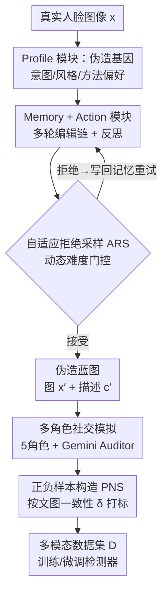

# Agent4FaceForgery: Multi-Agent LLM Framework for Realistic Face Forgery Detection

**会议**: CVPR 2026  
**论文**: [CVF Open Access](https://openaccess.thecvf.com/content/CVPR2026/html/Lai_Agent4FaceForgery_Multi-Agent_LLM_Framework_for_Realistic_Face_Forgery_Detection_CVPR_2026_paper.html)  
**代码**: https://github.com/laiyingxin2/Agent4FaceForgery  
**领域**: Agent / 多模态VLM / AI安全  
**关键词**: 人脸伪造检测, 多智能体LLM, 数据合成, deepfake, 社交模拟  

## 一句话总结
用一套 LLM 驱动的多智能体系统去"扮演"造假者和社交网络上的吃瓜群众，模拟人脸伪造从创作到传播的完整生命周期，合成出带文图一致性标注的训练数据，让 deepfake 检测器在跨域、跨伪造算法的真实场景下涨点显著（如 Celeb-DF AUC 从 70% 级提到 87.1%）。

## 研究背景与动机

**领域现状**：人脸伪造检测从早期 Xception/ResNet 做二分类，到挖频域伪迹（SPSL、M2TR）、重建不一致（RECCE），再到引入 LLM 和文本上下文的多模态方法（SIAF），一直在跟生成技术军备竞赛。

**现有痛点**：作者把所有方法的共同瓶颈归结为一句话——**训练数据"生态无效"（ecological invalidity）**。现有数据集（FF++、Celeb-DF，乃至多模态的 DD-VQA）都是策划好的、静态的样本，根本没法刻画真实世界里伪造的动态生命周期：① 它不反映**人类造假者的意图与迭代过程**（不同人有不同动机、技巧、风格偏好，且会反复试错改进）；② 它缺乏**社交语境与多模态互动**——现实中伪造图从不孤立存在，而是裹挟在评论、转发、真假争论里传播。

**核心矛盾**：离线 benchmark 上刷得再高，部署到真实在线环境就掉。根因不在检测算法，而在数据本身不像"野生"的伪造。

**本文目标**：把问题拆成两个——(1) 怎么捕捉人类造假的多样意图与迭代过程；(2) 怎么建模伴随伪造而来的复杂、常带对抗性的文-图互动。

**切入角度**：既然真数据采集不到，就用 LLM 智能体**仿真**整条产业链。每个 agent 带 Profile（定义意图）、Memory（迭代学习）、Action（执行视觉编辑+生成文本），再让一群不同角色的 agent 在模拟社交环境里围绕伪造图互动。

**核心 idea**：把"造一张图打个真/假标签"升级为"模拟整个伪造生命周期"，并且把监督信号从图像真伪二分类升级为**文-图一致性**——这才是多模态检测器真正缺的硬数据。

## 方法详解

### 整体框架

Agent4FaceForgery 是一个**数据合成器**，不直接做检测，而是产出高生态效度的多模态数据集 $D$ 去训练/微调各种检测器。给定一张未篡改的真实人脸 $x$ 和可选文本描述 $c$，目标是生成包含真样本 $\{(x_i, c_i, y_i{=}0, \delta_i{=}1)\}$ 和伪造样本 $\{(x'_j, c'_j, y_j{=}1, \delta'_j)\}$ 的数据集，其中 $y$ 是图像真伪标签，$\delta$ 是文-图一致性标签（$\delta{=}1$ 表示文本与图像内容相符，$\delta{=}0$ 表示错配，如"伪造图配一句它是真的"）。

作者把生成拆成**两个解耦的阶段**：先造"伪造蓝图"（Phase 1：一张伪造图 + 一句创作者描述），再基于蓝图跑社交多轮对话填充语境（Phase 2）。这样能分别保证底层任务结构的正确性和对话的自然度。Phase 1 里每个 agent 由 Profile / Memory / Action 三模块构成、以 GPT-4V 为统一认知核心，并用自适应拒绝采样（ARS）做质量门控；Phase 2 引入多个社交角色互动，最终用文-图一致性规则自动打正负样本标签。

### 关键设计

**1. Profile 模块：用"伪造基因"刻画创作者的意图与风格**

针对"现有数据不反映造假者多样意图"这个痛点，作者给每个 agent 装一份从 FF++ 真实数据里挖出来的"伪造基因" $p_k = (v_k, c_k)$。其中 $v_k$ 是三个可量化特质组成的向量：**伪造频率** $T^{freq}_k = |\text{forgeries}_k|$（这个创作者一共做了多少作品，代表产量）、**方法多样性** $T^{div}_k = |\bigcup_{i} \{method_i\}|$（用过多少种不同篡改技术）、**目标从众性** $T^{conf}_k = \frac{1}{|\text{forgeries}_k|}\sum_i \text{Pop}(target_i)$（偏好挑热门目标还是冷门，$\text{Pop}(\cdot)$ 是某目标被全库篡改的总次数）。$c_k$ 则是让 GPT-4V 看该创作者 $L$ 个样本后生成的自然语言风格偏好描述。这份基因直接驱动 agent 后续选什么工具、怎么编辑——比如一个被刻画成"追求高真实感"的 agent，会更倾向先 face-swap 再叠一层 blending。这样合成数据天然带上了"人"的多样性，而不是机器均匀采样。

**2. Memory + Action 模块：带反思的多轮伪造执行**

针对"伪造是迭代试错过程、单 agent 容易幻觉累积"的痛点，Memory 模块维护两类记忆——**事实记忆**（过去编辑的客观细节）和**评估记忆**（主观判断，如接缝是否可见），都以结构化 JSON 记录并支持检索、写入和 LLM 驱动的反思（reflection），让 agent 分析过往成败来调整下一轮策略（如"上次因为源脸太亮被识破，这次换用光照矫正 API"）。Action 模块把意图落地为动作 $\text{Action}^{(t)}_k = (\text{Edit}(\cdot), \text{Desc}(\cdot))$：视觉编辑是工具箱算子的串行组合 $\text{Edit}(x; p_k, M_k) = O_n(\dots O_1(x; \theta_1)\dots; \theta_n)$，工具箱 $O_{ops}$ 涵盖身份篡改（DeepFaceLab/FaceSwap）、属性表情编辑（StarGAN/AttGAN）、风格合成（SBI 等 GAN-inversion）；每步选哪个算子是概率过程，由 Profile 的风格偏好 $c_k$ 和方法多样性 $T^{div}_k$ 加权。文本描述 $\text{Desc}(\cdot)$ 可以是准确 caption，也可以是故意误导的陈述——后者正是制造文-图不一致样本的源头。

**3. 自适应拒绝采样 ARS：动态难度门控，越往后越挑硬样本**

针对"合成数据要既多样又有挑战性，不能净是一眼假"的痛点，ARS 充当质量控制闸门。候选蓝图 $(x'_i, c'_i)$ 用融合分打分：$s_i = \lambda\, s^{LLM}_i + (1-\lambda)\, s^{disc}_i$，其中 $s^{disc}_i$ 是外部伪造检测器（Xception）给的分，$s^{LLM}_i$ 是 agent 基于记忆的内部质量自评（LLaVA 参与判别），$\lambda$ 是权重。样本分数超过自适应阈值 $\tau$ 才被接受。关键在于 $\tau$ 会随时间收紧：先有 $N_{warmup}$ 个样本走宽松固定阈值 $\tau_{warmup}$ 建立初始池，之后切换为数据驱动——

$$\tau = \text{Quantile}(\{s_j \mid j \in \text{Accepted}\},\, q)$$

即取已接受样本分数的 $q$ 分位数为新阈值，$q$ 这一个超参就控制了拒绝率。随着池子整体质量上升，阈值水涨船高，逐渐只放行更难、更高质量的伪造样本，避免训练集被简单样本稀释。

**4. 多角色社交模拟 + 正负样本构造（PNS）：从社交争论里造硬负样本**

针对"现有数据缺社交语境、且只有图像级二分类标签"的痛点，Phase 2 让一群 MLLM 驱动的角色围绕伪造图互动，模拟真实平台动态。五个常规角色各有人设：**Watcher**（爱点赞但不深究真伪）、**Explorer**（对比同事件多帖找伪迹）、**Critic**（重质量与可信度，常公开质疑）、**Chatter**（易被误导但能在群聊中被纠正）、**Poster**（转发再编辑、放大传播）。在此之上还加一个**Gemini Auditor**，专门生成故意欺骗性的陈述——比如把明显拼接的图断言为"100% 真实"或篡改其性别/身份属性，制造强烈的文-图冲突来逼检测器学会对抗。所有这些互动产出的评论/标签/编辑，配合真值标签，按一致性函数自动打标：

$$\delta(x', c') = \begin{cases} 1, & y=1 \text{ 且 } c' \text{ 声称"完全真实"} \\ 1, & y=0 \text{ 且 } c' \text{ 声称"明显伪造"} \\ 0, & \text{otherwise} \end{cases}$$

这里 $\delta{=}1$ 标的是文-图错配的负样本，$\delta{=}0$ 表示对齐或被社交反馈（如 Critic 指出伪迹）纠正后的正样本。这样监督信号就从"图真不真"升级为"文和图配不配"，正是多模态检测器最缺的难数据。

### 一个完整示例

以一个 Profile 为"face swap、追求高真实感"的 agent 为例：① 它从真实图集采一张人脸，按风格偏好构造算子链（先 face-swap 换脸，再 blending 融合）执行编辑得到 $x'$，并生成描述 $c'$；② Memory 里翻出"上次源脸太亮被识破"的评估记忆，于是这轮先调用光照矫正 API；③ 候选交给 Xception + LLaVA 打融合分 $s_i$，若低于当前分位阈值 $\tau$ 就被拒绝、写回记忆触发反思后重试，高于阈值则成为蓝图；④ 蓝图进入社交模拟，Critic 评论"嘴部肌肉太平滑、眨眼频率不对，疑似 deepfake"，而 Gemini Auditor 偏偏断言"内部消息证实 100% 真实"——前者把图标成 $\delta{=}0$ 的纠正正样本，后者制造出 $\delta{=}1$ 的硬负样本，一张伪造图就此产出多条带不同一致性标签的训练对。

## 实验关键数据

### 主实验

跨数据集泛化：所有模型在 FF++(HQ) 训练，测未见域。本文在多个挑战集上拿到最优/次优。

| 测试集 | 指标 | 本文 | FFTG(前SOTA) | DCL |
|--------|------|------|--------------|-----|
| FF++（域内） | AUC | 99.50 | 99.23 | 99.30 |
| DFDC-P | AUC | **88.10** | 84.74 | 76.71 |
| Wild Deepfake | AUC | **86.50** | 83.55 | 71.14 |
| Celeb-DF | AUC | **87.10** | 84.80 | 82.30 |

对未见伪造算法的鲁棒性（DF40 协议，frame-level AUC %）：

| 方法 | uniface | e4s | facedancer | simswap | 平均 |
|------|---------|-----|------------|---------|------|
| SG-Det (NeurIPS25) | 91.8 | 87.5 | 83.0 | 91.0 | 87.8 |
| **Ours** | **96.3** | **92.4** | **92.9** | **92.4** | **93.9** |

平均 AUC 93.9% 大幅超过此前最强的 SG-Det（87.8%），说明 ARS 筛难样本 + 多样 Profile 让数据覆盖了更广的伪造痕迹谱系。

### 消融实验

核心模块消融（跨数据集，AUC %）。FT=伪造树仿真、ARS=自适应拒绝采样、PNS=正负样本构造：

| 配置 | FT | ARS | PNS | CDF | DFD | DFDC |
|------|----|----|-----|-----|-----|------|
| LLaVA 裸跑 | - | - | - | 51.8 | 69.3 | 57.4 |
| Only FT | ✓ | - | - | 83.2 | 91.5 | 82.5 |
| Only ARS | - | ✓ | - | 88.0 | 92.1 | 84.2 |
| Only PNS | - | - | ✓ | 91.0 | 93.8 | 85.5 |
| Full | ✓ | ✓ | ✓ | **92.2** | **94.9** | **86.7** |

社交模拟 agent 数量消融（边际收益递减）：

| 配置 | DFD-AUC | Celeb-DF-AUC | 耗时(h) |
|------|---------|--------------|---------|
| 无社交模拟 | 88.1 | 74.5 | 3.8 |
| 6 Agents | 92.8 | 85.3 | 6.1 |
| 12 Agents | 93.0 | 85.8 | 7.5 |

### 关键发现
- **PNS 单独贡献最大**：三模块里只开 PNS 就把 LLaVA 裸跑的 Celeb-DF AUC 从 51.8% 拉到 91.0%，印证"文-图一致性监督"才是多模态检测器最缺的信号；三者叠加再小幅提升到 92.2%。
- **数据是即插即用的增强器**：A4FF 数据微调后，Phi-3.5 / Qwen-VL2.5 / LLaVA 普遍涨点（LLaVA AUC 83.2%→92.2%），且对 Xception/EN-B4/ViT-B/ViT-L 四种 backbone 全部有效，说明它提供的是与架构无关的"生态信号"。
- **agent 数量 6 个性价比最高**：从 6 到 12 个 agent，Celeb-DF AUC 仅从 85.3% 微增到 85.8%，但耗时从 6.1h 涨到 7.5h，作者据此把配置定在 6。
- **标注质量超人工**：本文标注 Precision 94.41%、F1 69.06%，明显高于人工 DD-VQA（Precision 62.46%）和 GPT-4o-mini 直标，得益于 Memory + PNS 抑制了幻觉。

## 亮点与洞察
- **把"数据问题"重新定义为"仿真问题"**：不去堆更多人工标注，而是用 multi-agent 系统把伪造的"意图—迭代—传播"整条链路演出来，思路上跳出了"采集更大数据集"的惯性，很有启发性。
- **ARS 的自适应分位阈值是个可复用 trick**：用已接受样本的 $q$ 分位数动态收紧门槛，单超参控制拒绝率，既保证 warm-up 期的多样性又保证后期的难度递增，可迁移到任何"边生成边筛"的数据合成场景。
- **Gemini Auditor 这个"对抗造谣者"角色很巧**：专门生产"明明假却咬定真"的硬负样本，直接攻击文-图一致性这条监督维度，比随机错配文本更有针对性。
- **监督粒度的升级**：从图像真伪二分类升到文-图一致性 $\delta$，本质上把检测器的能力边界从"看图辨真假"推向"看图文判是否自洽"，更贴近社交媒体真实对抗形态。

## 局限与展望
- **依赖闭源大模型**：认知核心用 GPT-4V、角色用 MLLM（含 Gemini），合成成本与可复现性受 API 约束，6 agent 已要 6.1h，规模化扩展的算力/费用账作者未细谈。
- **仿真真实度无客观上界验证**：社交角色行为和 Gemini Auditor 的"造谣"是否真贴近野生分布，缺乏与真实社交数据的分布级对齐度量，⚠️ 这点论文以下游涨点间接论证，并非直接证据。
- **评估仍在标准 deepfake benchmark 上**：虽强调"生态效度"，但最终还是在 FF++/Celeb-DF/DFDC 等学术集上测，真正的在线野生场景（论文的核心 motivation）未做端到端验证。
- **可改进**：把 Profile 基因从 FF++ 统计扩展到真实社交平台用户画像；或让 ARS 的外部判别器随训练在线更新，形成造假者 vs 检测器的真正博弈循环（论文 Fig 提到"军备竞赛"曲线，可进一步形式化）。

## 相关工作与启发
- **vs SIAF / 单 LLM 标注方法**: 它们用单个 GPT-4 给伪造图打标，易幻觉、可靠性差；本文用带 Memory 和多角色协同的多 agent 结构压制幻觉，标注 Precision 从 60% 级提到 94%。
- **vs RECCE / SBI 等检测算法**: 那些是改检测器结构/挖伪迹；本文不碰检测器，只换训练数据，且对多种 backbone 普适——属于正交的"数据侧"贡献，可与它们叠加。
- **vs AI Town / MetaGPT 等社交/协作仿真**: 借了 LLM agent 的 Profile-Memory-Action 范式，但首次把它专门定制到"人脸伪造生命周期仿真 + 多模态数据合成"这一具体任务上。

## 评分
- 新颖性: ⭐⭐⭐⭐⭐ 用 multi-agent 仿真伪造生命周期来造数据，并把监督升级到文-图一致性，视角新颖
- 实验充分度: ⭐⭐⭐⭐ 跨域、跨算法、多 backbone、模块/agent 数消融都齐全，但缺真正在线场景的端到端验证
- 写作质量: ⭐⭐⭐⭐ 框架清晰、动机有力，部分符号与表述略显仓促
- 价值: ⭐⭐⭐⭐⭐ 数据即插即用、对多架构普遍涨点，对 deepfake 检测落地有实际意义

<!-- RELATED:START -->

## 相关论文

- [\[CVPR 2026\] AgentDet: A Shared-Blackboard Multi-Agent Framework for Zero-/Few-Shot Object Detection](agentdet_a_shared-blackboard_multi-agent_framework_for_zero-few-shot_object_dete.md)
- [\[ICML 2026\] OMAC: A Holistic Optimization Framework for LLM-Based Multi-Agent Collaboration](../../ICML2026/multi_agent/omac_a_holistic_optimization_framework_for_llm-based_multi-agent_collaboration.md)
- [\[ICML 2025\] Is Your LLM-Based Multi-Agent a Reliable Real-World Planner? Exploring Fraud Detection in Travel Planning](../../ICML2025/multi_agent/is_your_llm-based_multi-agent_a_reliable_real-world_planner_exploring_fraud_dete.md)
- [\[AAAI 2026\] Beyond Detection: Exploring Evidence-based Multi-Agent Debate for Misinformation Intervention and Persuasion](../../AAAI2026/multi_agent/beyond_detection_exploring_evidence-based_multi-agent_debate_for_misinformation_.md)
- [\[ACL 2026\] Debating the Unspoken: Role-Anchored Multi-Agent Reasoning for Half-Truth Detection](../../ACL2026/multi_agent/debating_the_unspoken_role-anchored_multi-agent_reasoning_for_half-truth_detecti.md)

<!-- RELATED:END -->
