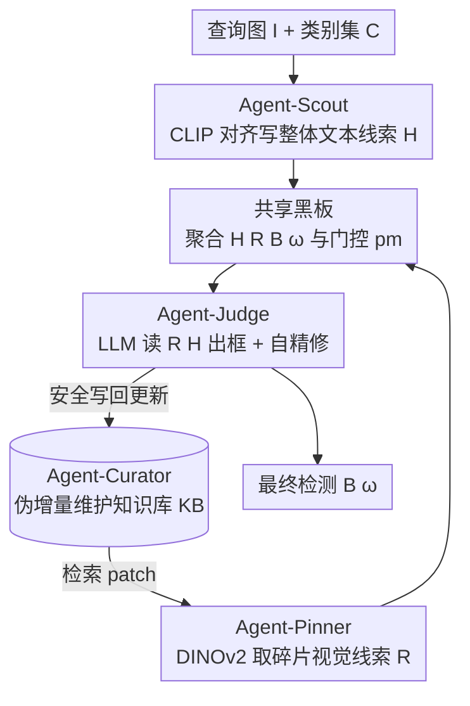

# AgentDet: A Shared-Blackboard Multi-Agent Framework for Zero-/Few-Shot Object Detection

**会议**: CVPR 2026  
**论文**: [CVF Open Access](https://openaccess.thecvf.com/content/CVPR2026/html/Li_AgentDet_A_Shared-Blackboard_Multi-Agent_Framework_for_Zero-Few-Shot_Object_Detection_CVPR_2026_paper.html)  
**代码**: 无  
**领域**: 多智能体 / 零样本-少样本目标检测  
**关键词**: 零/少样本检测, 多智能体, 共享黑板, 知识库, 伪增量学习

## 一句话总结
AgentDet 把零/少样本目标检测拆成 Scout / Pinner / Curator / Judge 四个 LLM 智能体，通过一块"共享黑板"+一个 patch 级"知识库"协作：把视觉证据碎片化存进知识库、组合成整体文本线索喂给 LLM 做框预测，并且只训练 Judge 一个智能体，就在 PASCAL VOC / COCO 的 ZSOD/FSOD 上做到了与 SOTA 强竞争的结果。

## 研究背景与动机
**领域现状**：零样本/少样本目标检测（ZSOD/FSOD）目标是在新类别只有 0 张或 K 张标注图的情况下检测物体。传统 FSOD 主要靠迁移学习、元学习、度量学习和数据增强；近期一派转向 VLM/LLM，用 Grounding DINO、FM-FSOD、LLaFS 这类基础模型获得零样本能力。

**现有痛点**：传统方法在新类样本极少、base/novel 类别差距大时容易**灾难性遗忘**、泛化不稳，episodic 训练还经常不稳定。基础模型一派则各有硬伤：Grounding DINO 这类 VLM 靠的是大规模视觉预训练，这本身就和"测试小样本泛化"的 FSOD 协议冲突（等于偷看了答案）；FM-FSOD 把 LLM 只当静态分类器、不用它的语言推理；LLaFS 绑死 CodeLlama 还要 polygon 级监督、做不了零样本。更关键的是，绝大多数工作把 ZSOD 和 FSOD 当两个任务分开做，缺一个统一框架。

**核心矛盾**：LLM 有丰富的语言先验和跨模态推理能力，但它像个"看不见的盲人专家"——能讲一堆关于某类物体的描述，却没真正"看见"图像里的实例，因此难以直接输出精确的框。

**本文目标**：① 用一套架构同时覆盖 ZSOD 与 FSOD，能从 0-shot 平滑过渡到 few-shot 而不改结构；② 在新类无框标注的现实条件下，仍能持续积累视觉知识。

**切入角度**：作者用了一个电影类比——当没有目标人物的照片时（《楚门的世界》里的拼贴镜头，或警察根据目击者描述拼嫌疑人画像），可以从杂志头像里剪下眼睛、鼻子、嘴拼出一张相似的脸。类比到检测：**积累碎片级（fragment-level）视觉证据 → 组合成可信的整体文本线索 → 用 LLM 的语言先验来定框**。

**核心 idea**：把检测解耦成四个协作智能体，围绕"共享黑板 + patch 级知识库"运转；新类用**伪增量（pseudo-incremental）**方式——在没有新类框标注时，只把高一致性的局部证据写进知识库，等少量标注到来时无需改架构就升级成 FSOD。

## 方法详解

### 整体框架
AgentDet 的输入是一张查询图 $I$ 和一个封闭类别集 $C=C_b \cup C_n$（base 类 + novel 类），输出是最终的框集合与置信度 $(B,\omega)$。系统有两块记忆：**知识库 KB**（持久，存 patch 级视觉证据，支持检索）和**共享黑板 Board**（瞬态，单张图推理过程中聚合各智能体写入的线索与控制标志）。四个智能体围着这两块记忆转：Scout 看图写"整体文本线索"，Pinner 从 KB 取"碎片级视觉线索"钉到黑板，Curator 负责安全地维护/更新 KB，Judge 读黑板输出最终框。训练时**只训 Judge**（更新它的图像编码器和 LoRA 接的 LLM 检测头），其余模块（CLIP、DINOv2）全部冻结，是个轻量配方。

黑板在时刻 $t$ 的状态写作 $M^{(t)}_{board}=\{H^{(t)}, R^{(t)}, B^{(t)}, \omega^{(t)}, r^{(t)}_{scout}, r^{(t)}_{pinner}, pm^{(t)}\}$，其中 $H$ 是整体文本线索，$R$ 是从 KB 检索回的碎片引用，$(B,\omega)$ 是预测框和置信度，$r_{scout}, r_{pinner}\in\{0,1\}$ 是智能体就绪标志，$pm\in\{0,1\}$ 是控制 KB 能否安全写入的门控。

### 关键设计

**1. 共享黑板 + 知识库：把"碎片证据"和"逐图协调"分到两块记忆**

这一设计针对 LLM"看不见实例"以及四个智能体如何协同的问题。KB（记作 $\mathcal{K}$）是持久的 patch 级证据库，每条目存 $\langle p_k, \theta^{attr}_k, \theta^{rect}_k, s_k\rangle$——视觉 patch、属性嵌入、框坐标、CLIP 匹配分；黑板 $M_{board}$ 则是低延迟状态空间，只在单张图的一次推理 episode 内存活。两者分工让"长期视觉知识"与"当前图协调"解耦。关键是一个**一致性门控**决定能否往 KB 安全写入：

$$\text{cons}(k,c)=\mathbb{1}\!\left[\max_i M_{i,k}>\tau_{search}\right]\cdot\mathbb{1}\!\left[\max_i S_{i,c}>\theta\right]$$

其中 $M$ 是查询-KB 相似度矩阵、$S$ 是 crop-类别相似度矩阵。只有当存在 $(k,c)$ 同时满足一致性门控为 1 且属性分 $s_{p,a}>\tau_{seg}$ 时，才允许"安全写入" $pm=1$，否则条目被延迟或衰减。这套门控是后面伪增量更新不污染 KB 的闸门。

**2. Agent-Scout：用 CLIP 对齐生成"整体文本线索"，给下游收窄类别空间**

Scout 解决的是"先告诉系统这张图里可能有哪些类"。它先对图做多尺度多长宽比的均匀裁剪得到区域提案 $B=\bigcup_{r,s}\bigcup_m T_r(I;\sigma_s)$（长宽比如 $(1,1),(1,2),(2,1)$）。每个 patch 用 CLIP 视觉编码器编码，每个类名 $c_j$ 用模板 "a photo of a $c_j$" 编码，算相似度矩阵并按温度 $\tau=100$ 缩放：$S=\tau\cdot\text{softmax}(\theta_{vis}\theta^\top_{txt})$。把任一区域上相似度超阈值的类挑出来 $C_{detected}=\{c_j\mid\max_i S_{i,j}>\theta\}$，再可选地用 LLM 做一次后验校验 $C_{target}=\{c\in C_{detected}\mid P(c\mid I)>\rho\}$。$C_{target}$（连同相似度和后验分）作为整体文本线索 $H$ 写到黑板，给后续 patch 检索提供语义引导。实测 Scout 这步在允许一类误差时，COCO 上准确率 89.67%、VOC 上 93.97%。

**3. Agent-Curator：crop-then-oversegment 的伪增量 KB 维护**

Curator 负责把视觉证据碎片化、安全地堆进 KB，是"伪增量"的执行者。对每张图做多尺度过分割 $P_n=\bigcup_{s\in S}U(I_n;\zeta_s)$（尺度预设 sml/med/lrg），每个 patch 抽 CLIP 视觉嵌入和框坐标。再为每个类生成文本属性列表 $A_c=\{a_{c,m}\}$，用 CLIP 余弦相似度把属性和 patch 匹配 $s_{p,a}=\frac{\langle f^{txt}_{CLIP}(a),\theta^{vis}_p\rangle}{\|f^{txt}_{CLIP}(a)\|\cdot\|\theta^{vis}_p\|}$，每类只留分数超 $\tau_{seg}$ 的 top-3 属性，并用"末位淘汰"把每类条目控制在 ≤50 条。

伪增量的精髓在训练/推理的**不对称**：训练时有 GT 框，先 crop 标注区域再在 crop 内部过分割 $P^{train}_n=\bigcup_{b\in B_n}\bigcup_s U(\text{crop}(I_n,b);\zeta_s)$，得到高纯度、低背景噪声的 patch；推理时新类无框标注，就直接对整图过分割 $P^{test}_q=U(I_q;\{\zeta_s\})$，靠检索 + 一致性门控 + 安全写规则决定每个候选更新是**提交 / 延迟 / 衰减**。这样系统能从无标注图流里持续给 KB"加密"，无需新类框监督；一旦少量标注到来，同一条管线无缝支持 FSOD，不改架构——这正是 ZSOD 与 FSOD 被统一的地方。

**4. Agent-Pinner：DINOv2 检索把"碎片视觉线索"钉上黑板**

Pinner 解决"当前这张图该从 KB 取哪些碎片来当参照"。它用和建库相同的过分割算子切查询图 $P_q=U(I_q;\{\zeta_s\})$，用 DINOv2 编码得到 $Q=f_{DINOv2}(P_q)$，与 KB 条目算点积相似度 $M=QK^\top$，挑超阈值的子集 $R=\{k\mid\max_i M_{i,k}>\tau_{search}\}$ 过滤背景。最后把这些 patch 的空间和语义描述子拼接、过一个可学习投影得到参照序列 $\theta_{ref}=g_\phi([\theta^{rect}_k\oplus\theta^{attr}_k]_{k\in R})$，连同索引 $R$ 一起钉到黑板，供 Judge 消费。注意 Pinner 用 DINOv2 做检索、Scout 用 CLIP 做类别对齐，两条视觉证据互补。

**5. Agent-Judge：唯一被训练的智能体，LLM 读黑板出框并自精修**

Judge 是决策者，也是全系统唯一更新参数的部分。它消费 Scout 的 $C_{target}$ 和 Pinner 的 $\theta_{ref}$：先用 EVA-CLIP + Q-Former 编码查询图得到视觉 token $V=f_{QFormer}(f_{EVA\text{-}CLIP}(I_q))$，再把任务描述、检索到的参照知识、输出规范组装成 prompt $P$，连同 $V$ 喂给 LoRA 微调的 LLM 得到初始框 $B_{init}=f^{\phi_{LoRA}}_{LLM}(P;V)$。随后做一次**基于 prompting 的自精修**：把当前检测结果塞进新 prompt $P_{refine}$ 让 LLM 输出 $B_{final}=f^{\phi_{LoRA}}_{LLM}(P_{refine};V)$。每个框的置信度取 token 序列概率 $\omega_i=\prod_{t=1}^T P(w^{(i)}_t\mid w^{(i)}_{1:t-1};\phi)$，再用阈值 $\gamma$ 过滤。训练只用一个统一检测损失、只更新 Judge 的图像编码器和 LLM 检测头（LoRA），轻量且鼓励对未见类泛化。Judge 还把 $(B_{final},\{\omega_i\})$ 写回黑板，让 Curator 在伪增量调度下安全更新 KB，形成闭环。

> ⚠️ 原文公式排版（如 $\theta/\omega/\tau$ 等希腊字母、$\oplus$ 拼接、各阈值 $\tau_{search}/\theta/\rho/\tau_{seg}/\gamma$）从 CVF 文本 OCR 还原，符号以原论文为准。

### 一个完整示例
以图 2 的查询图（含 horse / person / pottedplant 等）为例走一遍：① **Scout** 裁剪 + CLIP 对齐，写出整体文本线索 $H$=｛检测到 horse、person、pottedplant…｝钉到黑板；② **Pinner** 对整图过分割，用 DINOv2 去 KB 检索，取回"wet nose texture / muscular legs / thick woolly coat"这类碎片视觉线索 $R$ 钉到黑板（注意这些碎片是跨类的、class-agnostic 的）；③ **Judge** 读黑板上的 $(H,R)$ + 视觉 token，LLM 推理出初始框，再自精修一轮输出最终框 $(B,\omega)$；④ **Curator** 根据黑板上的结果和一致性门控，把高一致性的新证据安全写回 KB（$pm=1$），低一致的延迟/衰减。下一张图来时，KB 已更密——这就是伪增量。

### 损失函数 / 训练策略
训练只用**单一统一检测损失**，且只更新 Agent-Judge 的图像编码器与 LLM 检测头（LoRA 适配），CLIP / DINOv2 / Q-Former 主体冻结。LLM backbone 试了 Llama3.1-8B-Instruct、Qwen2.5-7B、Qwen3-8B。这种"只训一个智能体"的轻量配方是泛化到未见类的关键。

## 实验关键数据

### 主实验
PASCAL VOC few-shot（mAP，Novel Split 1 节选）：

| 方法 | 1-shot | 3-shot | 5-shot | 10-shot |
|------|--------|--------|--------|---------|
| ICPE (AAAI23) | 54.1 | 62.5 | 65.3 | 66.3 |
| FM-FSOD† (CVPR24) | 41.6 | - | 55.8 | 61.2 |
| LLMdet† (CVPR25) | 39.9 | 51.7 | 56.1 | 60.8 |
| AgentDet-Qwen2.5-7b† | 55.3 | 63.2 | 68.3 | 69.3 |
| **AgentDet-Qwen3-8b†** | **56.5** | **64.2** | **68.5** | **69.6** |

COCO（AP，跨 shot）：

| 方法 | 0 | 1 | 5 | 10 | 30 |
|------|---|---|----|----|----|
| FM-FSOD† (CVPR24) | - | 5.7 | 21.9 | 27.7 | **37.0** |
| LLMdet† (CVPR25) | 7.2 | 8.8 | 22.3 | 27.8 | 37.8 |
| AgentDet-Qwen3-8b† | **9.4** | **10.8** | **23.9** | 31.6 | 37.5 |

PASCAL VOC zero-shot（mAP）：

| 方法 | Split 1 | Split 2 | Split 3 |
|------|---------|---------|---------|
| Qwen2.5-VL-7b | 26.2 | 23.6 | 23.6 |
| Qwen2.5-VL-7b-ft | 27.4 | 22.7 | 25.0 |
| **AgentDet-Qwen3-8b** | **35.7** | **29.2** | **33.5** |

### 消融实验
模块消融（AgentDet-Qwen2.5/Llama，VOC 10-shot，mAP）：

| 配置 | mAP | 说明 |
|------|-----|------|
| AgentDet-Qwen (Full) | 65.1 | 完整模型 |
| AgentDet-Llama (Full) | 60.4 | Llama 版完整 |
| w/o Q-Former 微调 | 52.2 | 掉 8.2% |
| w/o 知识库 KB | 41.3 | 掉 19.1% |
| w/o LLM 微调 | 0.0 | 直接归零，LLM 必须适配视觉任务 |
| w/o Agent-Scout | 30.2 | Scout 缺失大幅掉点 |

组件消融（mAP）：

| 配置 | mAP | 说明 |
|------|-----|------|
| AgentDet | 65.1 | 完整 |
| w/o 多尺度分割(query) | 56.9 | 多尺度特征重要 |
| w/o 多尺度分割(training) | 55.4 | 训练侧同样掉点 |
| w/o 最小外接矩形 | 49.7 | 掉最多，框定位关键 |
| w/o Filter | 61.3 | 过滤机制有正贡献 |

### 关键发现
- **知识库是命门**：去掉 KB 掉 19.1%，是单模块里掉点最多之一；说明碎片级视觉证据的检索-注入确实在补 LLM"看不见实例"的短板。
- **LLM 必须微调**：去掉 LLM 微调直接 0.0%——纯靠冻结 LLM 的语言先验完全做不了检测定位，必须用 LoRA 适配到视觉任务。
- **低 shot 优势明显**：COCO 0-shot/1-shot AgentDet 全面领先（9.4 / 10.8），但 30-shot 时只比 FM-FSOD 高 +0.5%、被 LLMdet 略反超，说明它的相对优势集中在数据最稀缺的区间。
- **预处理可靠**：Scout 允许一类误差时 COCO 89.67% / VOC 93.97%，为下游检索奠定基础。
- **参数高效**：CLIP/DINOv2 等只占总参数一小部分，主体是（基本冻结的）LLM；KB 容量靠末位淘汰显式封顶，内存可控。

## 亮点与洞察
- **"盲人专家"类比落到了实处**：把 LLM 不会看实例、但会用语言描述的特点，转化为"碎片视觉证据 + 整体文本线索"双轨喂给它，这个拼贴画像的隐喻很好地指导了系统设计。
- **共享黑板 + 一致性门控**是经典 blackboard 架构在多模态 agent 上的复用，门控 $pm$ 把"哪些证据可信到能进长期知识库"这件事形式化成可验证规则，避免 KB 被噪声污染。
- **训练/推理不对称（crop-then-oversegment vs full-image oversegment）**很巧妙：训练侧借 GT 框拿高纯度 patch，推理侧无标注就靠检索+门控兜底，从而实现"无新类框监督也能持续扩库"的伪增量。
- **只训一个智能体**的工程取舍值得迁移：在多 agent 系统里把可学习参数集中到决策者、其余用冻结基础模型，既省训练又利于泛化。

## 局限与展望
- **30-shot 上不再领先**：数据稍多时优势消失甚至被反超，说明该框架的价值高度依赖"低 shot"前提；样本充足时复杂多 agent 结构的边际收益有限。
- **流程偏重**：四个智能体 + 两块记忆 + 多次 CLIP/DINOv2 编码与 LLM 两轮推理（初始 + 自精修），推理成本与延迟应不低，⚠️ 原文未给出明确的推理耗时/吞吐对比。
- **基准与基线选择有 caveat**：作者承认 Qwen2.5-VL 预训练数据含部分 COCO、且在 RefCOCO 上已很强，故 COCO 上不拿它当基线；这类数据泄漏问题正是 VLM 派的痛点，本文虽规避但也提示评测口径需谨慎。
- **依赖外部冻结模型质量**：Scout/Curator/Pinner 全靠 CLIP 与 DINOv2，碎片证据质量受这两个模型上限约束；若类别本身 CLIP 难对齐，整条链路会受限。

## 相关工作与启发
- **vs FM-FSOD (CVPR24)**：FM-FSOD 把 LLM 当静态分类器、靠 DINOv2 不用语言推理；AgentDet 让 LLM 真正参与决策（读黑板出框 + 自精修），并显式引入可维护的 patch 知识库，低 shot 区间明显更强。
- **vs LLaFS (CVPR24)**：LLaFS 绑死 CodeLlama 且要 polygon 级监督、做不了零样本；AgentDet 用伪增量统一了 ZSOD/FSOD，0-shot 也能跑。
- **vs Grounding DINO 等 VLM**：VLM 靠大规模视觉预训练拿零样本，与 FSOD"测小样本泛化"的协议冲突（相当于偷看）；AgentDet 主体冻结、只轻量训 Judge，更贴合 FSOD 评测精神。
- **vs ReAct / AutoGen / CAMEL 多 agent**：这些是通用 reason-act 或角色分工框架；AgentDet 把多 agent 思想专门定制到检测任务，用"共享黑板 + 知识库"做状态协调，并采用类 CTDE（集中训练-分散执行）的范式。

## 评分
- 新颖性: ⭐⭐⭐⭐ 把 blackboard 多 agent + patch 知识库 + 伪增量统一 ZSOD/FSOD，组合新颖且有清晰的电影类比动机。
- 实验充分度: ⭐⭐⭐⭐ VOC/COCO 双基准 + 零样本表 + 两张消融表，模块贡献量化清楚；但缺推理成本对比、30-shot 优势消失未深究。
- 写作质量: ⭐⭐⭐ 思路与类比讲得生动，但 CVF 版公式/符号 OCR 噪声较多、部分阈值定义略散。
- 价值: ⭐⭐⭐⭐ 为"用 LLM 推理能力做低 shot 开放词表检测"提供了可复用的多 agent 配方，低 shot 场景实用。

<!-- RELATED:START -->

## 相关论文

- [\[CVPR 2026\] MOTOR-Bench: A Real-world Dataset and Multi-agent Framework for Zero-shot Human Mental State Understanding](motor-bench_a_real-world_dataset_and_multi-agent_framework_for_zero-shot_human_m.md)
- [\[CVPR 2026\] Agent4FaceForgery: Multi-Agent LLM Framework for Realistic Face Forgery Detection](agent4faceforgery_multi-agent_llm_framework_for_realistic_face_forgery_detection.md)
- [\[AAAI 2026\] Learning to Generate and Extract: A Multi-Agent Collaboration Framework for Zero-shot Document-level Event Arguments Extraction](../../AAAI2026/multi_agent/learning_to_generate_and_extract_a_multi-agent_collaboration_framework_for_zero-.md)
- [\[ICML 2025\] Cross-environment Cooperation Enables Zero-shot Multi-agent Coordination](../../ICML2025/multi_agent/cross-environment_cooperation_enables_zero-shot_multi-agent_coordination.md)
- [\[CVPR 2026\] Refer-Agent: A Collaborative Multi-Agent System with Reasoning and Reflection for Referring Video Object Segmentation](refer-agent_a_collaborative_multi-agent_system_with_reasoning_and_reflection_for.md)

<!-- RELATED:END -->
