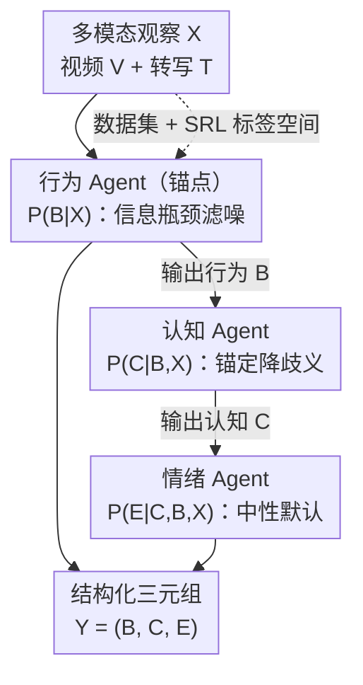

# MOTOR-Bench: A Real-world Dataset and Multi-agent Framework for Zero-shot Human Mental State Understanding

**会议**: CVPR 2026  
**arXiv**: [2605.09703](https://arxiv.org/abs/2605.09703)  
**代码**: 待确认  
**领域**: Multi-Agent / 多模态VLM / 情感计算  
**关键词**: 心理状态理解, 协作学习, 多智能体, 自我调节学习(SRL), 零样本推理

## 一句话总结
针对「从可观察行为推断深层心理状态」缺少结构化标注这一空白，本文构建了真实课堂协作学习场景的多模态数据集 MOTOR-dataset（1,440 段视频，行为/认知/情绪三维标注），并提出基于自我调节学习理论(SRL)的推理型多智能体框架 MOTOR-MAS——三个专职 agent 按「行为→认知→情绪」顺序级联推理，把前一阶段的预测当锚点喂给后一阶段，零样本下 Macro-F1 达 42.77，比最强单模型基线高 15.93 分。

## 研究背景与动机
**领域现状**：当前从行为/多模态信号理解人类心理状态的工作，大多只预测**单一孤立的标签**（如一个情绪类别或一个情感极性），数据集（CMU-MOSEI、MELD 等）也主要面向电影、临床访谈这类一次只建模一个维度的开放域场景。

**现有痛点**：这些设定与真实的人际交互脱节。人的外在行为并不总是直接暴露内心想法——有人可能一边微笑一边说「我真不知道自己在想什么」：表面线索（微笑）看似积极，话语却表达困惑与不确定，是消极的认知状态。**信号之间互相错位**，单标签预测无法处理这种行为-认知-情绪的不一致。

**核心矛盾**：行为是相对外显、容易观察的，而认知和情绪更隐蔽、依赖上下文；若把三者独立预测，就丢掉了它们之间的依赖关系。学习科学(SRL 理论)早已指出三者在协作学习中是**紧密耦合**而非独立的，但这套标注框架几乎没被翻译成 AI 可用的 benchmark 和推理系统。

**本文目标**：(1) 提供一个真实场景、带行为-认知-情绪结构化三元标注的数据集与 benchmark；(2) 设计一个能把可观察行为结构化地推理到深层心理状态的零样本框架。

**切入角度**：把抽象、难定义的「心理状态」放进一个**具体的协作学习交互语境**——课堂里学生自然地表达理解、困惑与意图，并用 SRL 理论给出明确的标签体系，让抽象问题变得可标注、可推理。

**核心 idea**：用「锚定再派生(Anchor-and-Derive)」的结构化级联代替各维度独立预测——先用最外显的**行为**作锚点，再依次条件推理出**认知**与**情绪**，并用 SRL 领域知识规范 agent 之间传递的信息。

## 方法详解

### 整体框架
MOTOR-MAS 输入是一段协作学习视频 $V$ 与其转写文本 $T$（合记多模态观察 $X=\{V,T\}$），输出是结构化三元组 $Y=(B,C,E)$（行为/认知/情绪）。核心思路是：三个维度不是同等可观察的，行为最外显、认知与情绪更隐蔽，因此把联合预测拆成**分阶段顺序推理**，让早期阶段的中间预测去支撑后期阶段。形式上按 $X\rightarrow B,\ \{X,B\}\rightarrow C,\ \{X,B,C\}\rightarrow E$ 的顺序展开，等价于对联合分布做链式分解：

$$P(C|X)=\sum_{B}P(C|B,X)\,P(B|X),\qquad P(E|X)=\sum_{B,C}P(E|C,B,X)\,P(C|B,X)\,P(B|X).$$

这三个条件概率分别由三个专职 agent 承担：行为 agent、认知 agent、情绪 agent，且每个 agent 都被注入 SRL 理论的任务说明，使 agent 间传递的中间结果是**语义结构化**的（而不是任意中间输出）。三个 agent 共享同一个 InternVL-3.5-8B backbone，零样本运行。

### 关键设计

**1. MOTOR-dataset 与三维标签空间：把抽象心理状态落到可标注的协作学习场景**

针对「心理状态抽象难定义、缺结构化标注」这一痛点，本文不在泛化场景里硬标心理状态，而是选了一个学生自然表达理解/困惑/意图的具体语境——课堂协作学习。数据采集自欧洲某大学的探究式科学实验活动，30 组中学生、共 1,440 段视频片段，每段约 6.10 秒、2–4 名学生互动，全程芬兰语（用 Whisper-large-finnish-v3 转写，标准芬兰语 benchmark 上词错率 14.26%）。标签体系直接源自 SRL 编码框架，每段标注一个**行为-认知-情绪三元组**：行为 $B\in\{\text{Monitoring},\text{Controlling},\text{Mixed}\}$（Monitoring 是提升对小组当前状态的觉察、Controlling 是尝试调控这些状态、两者不可分则 Mixed）；认知 $C$ 和情绪 $E$ 均为 $\{\text{Positive},\text{Negative},\text{Mixed},\text{Neutral}\}$，认知刻画对任务的元认知评价、情绪刻画协作中的情感状态。在 25% 数据上用 Cohen's kappa 测一致性，行为的 monitoring/controlling 达 $\kappa=0.73$。这个数据集刻意保留了真实世界的难点：自然类别不均衡、视觉噪声、领域特定语言

**2. Anchor-and-Derive 的结构化级联推理：用外显行为当锚点推隐蔽状态**

针对「认知/情绪隐蔽、独立预测丢依赖」的核心矛盾，MOTOR-MAS 把推理排成 $B\rightarrow C\rightarrow E$ 的链：行为最外显、先推；认知用行为+输入条件推；情绪用行为+认知+输入综合推。这与上面的链式概率分解一一对应，也契合 SRL 理论中三维的耦合关系——可观察行为为解读认知提供上下文，情绪又关联行为语境与认知线索。与「同一个模型一次性吐出三个标签」的黑盒 MLLM 相比，这种级联把不可直接观察的状态**锚定在已推断的、更可靠的中间结论上**，每一步预测都与前序中间预测保持一致，而不是直接从原始视觉输入里幻觉出来

**3. SRL-grounded 的多智能体专职化：让领域知识规范信息流而非靠任务启发式**

本文区别于 CAMEL/MetaGPT 等通用多智能体框架的关键，在于后者的结构来自「任务分解的启发式」、且单纯增加 agent 数量会饱和（同质 agent 产出相关、新增 agent 边际证据递减）。MOTOR-MAS 让 SRL 领域知识来指导 agent 通信：每个 agent 配 SRL 理论锚定的任务说明，编码其所负责维度的理论角色。三个 agent 分工明确——**行为 agent 是整个框架的锚点**，估计 $P(B|X)$、把动作归为 monitoring/controlling/mixed，优先看「方向性意图」而非表层语言特征，起到**信息瓶颈**的作用，过滤掉瞬时视觉噪声、阻断原始感知信号与潜在心理状态之间的虚假关联；**认知 agent** 计算 $P(C|B,X)$、在行为锚点的条件下判断元认知评价的极性，借 $B$ 降低从噪声多模态观察里解读隐蔽认知过程的歧义；**情绪 agent** 计算 $P(E|C,B,X)$，因协作学习以任务为主、采用「中性默认」假设——只有当转写或视觉里出现明确情绪标记时才覆盖默认值

### 损失函数 / 训练策略
本框架是**零样本、无需训练**的推理框架，不涉及参数更新。三个 agent 均用 InternVL-3.5-8B（bfloat16 + Flash Attention），每段均匀抽 8 帧并 resize 到 $448\times448$，芬兰语转写注入到带 SRL 指令的任务提示里。所有 agent 用温度 0 的贪心解码，最大生成 1024 token，最终标签用正则从生成文本里按预定义标签集抽取。主指标用 Macro-F1（数据严重不均衡），辅以 Accuracy。

## 实验关键数据

### 主实验
零样本设定下对比开源 MLLM（InternVL-2.5/3.5）、闭源前沿模型（Gemini-1.5-Flash/Pro）、领域模型 AffectGPT，以及通用多智能体框架 CAMEL（为对齐都用 InternVL-3.5-8B 做 backbone）。指标为 Macro-F1。

| 方法 | 行为 | 认知 | 情绪 | 平均 |
|------|------|------|------|------|
| InternVL-2.5 | 24.71 | 16.60 | 31.19 | 24.17 |
| InternVL-3.5（最强单模型） | 25.89 | 19.21 | 35.43 | 26.84 |
| AffectGPT | 22.84 | 11.64 | 33.32 | 22.60 |
| Gemini-1.5-Flash | 24.59 | 20.27 | 23.21 | 22.69 |
| Gemini-1.5-Pro | 25.57 | 21.71 | 22.22 | 23.17 |
| CAMEL (2 Agents) | 41.99 | 24.83 | 28.70 | 31.84 |
| CAMEL (3 Agents) | 42.62 | 29.61 | 45.60 | 39.28 |
| **MOTOR-MAS (Ours)** | **45.23** | **39.81** | 43.27 | **42.77** |

- 平均 42.77，比最强单模型 InternVL-3.5（26.84）高 **15.93 分**；比最强通用多智能体 CAMEL-3（39.28）高 3.49 分。
- 认知维度提升最显著：MOTOR-MAS 39.81 vs CAMEL-3 29.61，高 **10.2 分**——说明「单纯加 agent 不够，中间信息怎么组织才是关键」。
- 三维难度梯度清晰：行为最易(45.23，行为线索多在转写里外显)，情绪次之(43.27)，认知最难(39.81，因其更隐蔽、更依赖上下文)；结构化推理在「目标状态不可直接观察」时最有用。
- ⚠️ 情绪维度上 CAMEL-3 的 45.60 略高于 MOTOR-MAS 的 43.27，本文未单独解释，结论的优势主要来自认知维度与整体平均。

### 消融实验
| 配置 | 行为 | 认知 | 情绪 | 平均 | Δ |
|------|------|------|------|------|------|
| Full Model | 45.23 | 39.81 | 43.27 | 42.77 | - |
| w/o Multi-Agent（保留 B→C→E 顺序，但单模型一次推） | 40.83 | 34.22 | 29.39 | 34.81 | −7.96 |
| w/o SRL（换成通用任务描述） | 39.65 | 32.73 | 29.32 | 33.90 | −8.87 |
| w/o Video（纯文本） | 42.68 | 37.30 | 38.44 | 39.47 | −3.30 |

### 关键发现
- **多智能体结构与 SRL 先验贡献相当**（各掉 ~8–9%），且互补：去掉多智能体掉 7.96、去掉 SRL 掉 8.87。
- 去掉多智能体后情绪暴跌 13.88 分、认知掉 5.59 分，说明 agent 专职化对**隐蔽状态推断**尤其关键；连相对外显的行为也掉 4.40 分，证明专职推理优于单次联合预测。
- 视觉的贡献相对小（平均掉 3.30），且主要体现在情绪(掉 4.83)上——转写文本承载了大部分有用信号，这与课堂视频常常噪声大、低分辨率有关。
- 定性分析（Fig.5）：基线常把「合作」误判成「积极情绪」，或在 monitoring+负面认知时幻觉出 Mixed 情绪；MOTOR-MAS 能正确给出 Neutral，但在细粒度的 mixed 情绪上所有模型仍失败。

## 亮点与洞察
- **让心理学理论直接当架构骨架**：SRL 理论不仅决定了三维标签空间，还规定了 agent 的级联顺序（B→C→E）和每个 agent 的任务角色——这是「领域知识指导 agent 通信」而非「任务启发式分解」的一个具体范例，可迁移到任何「有成熟理论刻画维度依赖」的结构化预测任务。
- **行为 agent 当信息瓶颈**很巧妙：把最可靠、最外显的维度先固定下来当锚，后续隐蔽维度都条件在它上面推，既降歧义又抑制幻觉——这种「先锚定可观察、再派生不可观察」的思路对噪声大的真实多模态数据特别有价值。
- **诚实的数据集设计**：刻意保留类别不均衡（行为 monitoring 56.2%、认知/情绪 neutral 47.8%/65.6%）和视觉噪声，并指出这不是采集偏差而是真实课堂的本质（多数互动任务导向、情绪中性），比娱乐向数据集更贴近真实部署。
- 「中性默认、有明确标记才覆盖」的情绪 agent 假设，是把领域先验（协作学习以任务为主）写进 prompt 的轻量做法，避免模型对中性场景过度解读情绪。

## 局限与展望
- **零样本、纯 prompt 级的方法**：所有提升来自 backbone 能力 + SRL prompt + 级联结构，没有任何训练/微调，天花板受限于 backbone 的视觉理解能力（课堂视频噪声大时尤甚）。
- **单一场景、单一语言**：数据全来自芬兰语课堂协作学习、中学生群体，标签体系也强绑 SRL 框架，迁移到医疗、社交等场景或其他语言的泛化性未验证。
- **绝对性能仍偏低**：最好的认知 Macro-F1 也只有 39.81，「从可观察行为到深层心理状态」远未解决；细粒度 mixed 情绪所有模型都失败。
- **级联会传播误差**：行为预测错会污染后续认知/情绪推理，论文未量化这种误差传播；情绪维度上甚至不及 CAMEL-3。
- 改进思路：引入小样本/few-shot 适配、把 backbone 换成更强的视频理解模型、或对中间预测加置信度门控以缓解误差传播。

## 相关工作与启发
- **vs 单标签多模态情感数据集（CMU-MOSEI / MELD）**: 它们一次只建模一个状态维度（情感/情绪），且偏开放域视频；本文把行为-认知-情绪当作**结构化联合推理**问题，并落在真实协作学习场景，强调三维耦合。
- **vs CAMEL / MetaGPT（通用多智能体）**: 它们靠任务分解的启发式来组织 agent、加 agent 会饱和（同质 agent 证据递减）；本文用 SRL 领域知识规范 agent 间信息流、用级联条件推理组织中间结果，在认知维度上比 CAMEL-3 高 10.2 分，证明「信息结构比 agent 数量更重要」。
- **vs 黑盒 MLLM（InternVL / Gemini / AffectGPT）**: 它们直接从原始多模态输入吐标签、依赖表层视觉线索、易在信号错位时幻觉；MOTOR-MAS 用锚定式级联让每步预测条件在可靠中间结论上，平均高 15.93 分。
- 启发：把「成熟的领域理论」翻译成「agent 的角色分工 + 信息流顺序」，是给多智能体系统注入结构、突破启发式分解天花板的一条可复用路径。

## 评分
- 新颖性: ⭐⭐⭐⭐ 用 SRL 理论同时驱动数据标注与多智能体架构、提出 Anchor-and-Derive 级联，思路清晰且具体；但单模块技术新意有限，更多是「理论 × 多智能体」的巧妙组合。
- 实验充分度: ⭐⭐⭐⭐ 覆盖开源/闭源 MLLM、领域模型、通用多智能体多类基线，三项消融拆解清楚；但只在单一数据集验证、绝对性能偏低、情绪维度被 CAMEL-3 反超未深究。
- 写作质量: ⭐⭐⭐⭐ 动机-理论-方法-实验逻辑连贯，概率分解与 agent 分工对应明确，图示清晰。
- 价值: ⭐⭐⭐⭐ 填补了真实协作学习场景结构化心理状态标注的空白，数据集 + 框架对教育 AI、情感计算社区有实用价值。

<!-- RELATED:START -->

## 相关论文

- [\[CVPR 2026\] AgentDet: A Shared-Blackboard Multi-Agent Framework for Zero-/Few-Shot Object Detection](agentdet_a_shared-blackboard_multi-agent_framework_for_zero-few-shot_object_dete.md)
- [\[ACL 2026\] Towards Robust Real-World Spreadsheet Understanding with Multi-Agent Multi-Format Collaboration](../../ACL2026/multi_agent/towards_robust_real-world_spreadsheet_understanding_with_multi-agent_multi-forma.md)
- [\[AAAI 2026\] Learning to Generate and Extract: A Multi-Agent Collaboration Framework for Zero-shot Document-level Event Arguments Extraction](../../AAAI2026/multi_agent/learning_to_generate_and_extract_a_multi-agent_collaboration_framework_for_zero-.md)
- [\[CVPR 2026\] Visual Document Understanding and Reasoning: A Multi-Agent Collaboration Framework with Agent-Wise Adaptive Test-Time Scaling](visual_document_understanding_and_reasoning_a_multi-agent_collaboration_framewor.md)
- [\[ICLR 2026\] UIS-Digger: Towards Comprehensive Research Agent Systems for Real-world Unindexed Information Seeking](../../ICLR2026/multi_agent/uis-digger_towards_comprehensive_research_agent_systems_for_real-world_unindexed.md)

<!-- RELATED:END -->
