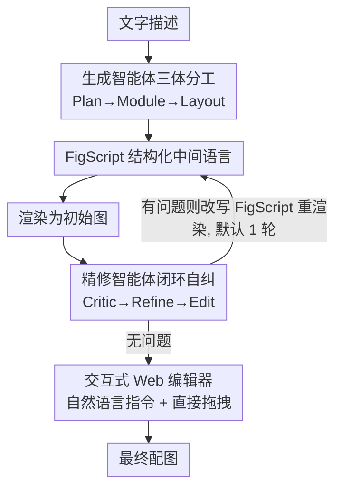

# Paper2Figure: A Multi-Agent Collaborative System for Figure Generation Towards Academic Research Paper

**会议**: CVPR 2026  
**论文**: [CVF Open Access](https://openaccess.thecvf.com/content/CVPR2026/html/Han_Paper2Figure_A_Multi-Agent_Collaborative_System_for_Figure_Generation_Towards_Academic_CVPR_2026_paper.html)  
**代码**: 待确认  
**领域**: Agent / 多模态VLM  
**关键词**: 多智能体, 论文配图生成, 结构化中间语言, 自我精修, 交互式编辑

## 一句话总结
Paper2Figure 用「生成智能体 + 精修智能体」双多智能体系统，先把论文文字描述翻译成自研的结构化中间语言 FigScript、渲染成图，再让一组批评-修订智能体闭环自纠，配上可交互的 Web 编辑器把人类控制权交还给作者，在自建的 Paper2Figure Bench 上准确性、美观度、完整度全面超过 SVG/Mermaid 代码生成和文生图基线（综合 +14.1%）。

## 研究背景与动机
**领域现状**：自动给论文画主图（方法流程图、系统总览图）目前有两条主流路线。一条是让 LLM 直接生成结构化代码（SVG、Mermaid 等标记语言），另一条是用文生图模型（GPT-Image-1、Nano Banana 等）直接合成像素图。

**现有痛点**：两条路都有硬伤。代码生成路（尤其 SVG）能忠实保留文字里的语义和结构，可读性却差——元素重叠、连线断裂、字号过小，信息密但难读；Mermaid 受固定排版规则约束，布局僵硬、缺乏视觉层次。文生图路视觉上漂亮，但文字渲染常出错、逻辑结构错乱、模块缺失、箭头连接混乱，而且生成结果几乎无法编辑。

**核心矛盾**：没有任何现有方法能同时保证**语义精确、视觉质量、结构可控可编辑**三者。代码路偏精确但丑且僵，图像路偏美但乱且不可改，而科研配图恰恰三者都要。

**本文目标**：做一个既能自动生成高质量学术配图、又能让作者继续精细调控的系统，把「AI 辅助」和「研究者控制」之间的鸿沟补上。

**切入角度**：作者借鉴专业科研绘图师的工作流——先规划结构、再画模块、再调版式，画完还要反复审视和修订。这天然适合拆成多个各司其职的智能体协同，并用一种比 SVG 更语义化、比 Mermaid 更灵活的中间表示当作它们交流和迭代的媒介。

**核心 idea**：用结构化中间语言 FigScript 串起「生成—渲染—精修」双智能体闭环，再叠一层 Web 编辑器把最终控制权交还给人。

## 方法详解

### 整体框架
Paper2Figure 是一个带交互 Web 平台的双多智能体系统。输入是一段文字描述，输出是出版级的科研配图。整条管线分两段：**生成段**由三个生成智能体把文字翻成 FigScript 草稿，再渲染成初始图；**精修段**由三个精修智能体审视渲染图、定位问题、改写 FigScript 并重渲染，形成闭环；最后 Web 编辑器让用户用自然语言指令或直接拖拽继续调整。所有智能体都基于 GPT-4o 实现，FigScript 既是智能体之间的通信媒介，也是后端与前端之间的桥梁。

### 关键设计

**1. FigScript：介于 SVG 与 Mermaid 之间的结构化中间语言**

代码生成路要么太底层（SVG 冗长、难编辑、自动排版差），要么太死板（Mermaid 语法固定、样式弱、复杂布局处理差），两者都不利于智能体在概念层面推理。FigScript 把一张图定义成由节点、边、容器、样式属性组成的层级图，刻意定位在 SVG 和 Mermaid 之间：它继承 SVG 的精确可控性，但把大量底层绘图操作抽象成语义化构件，让智能体能在「概念层」推理图的逻辑结构；同时不像 Mermaid 那样语法僵死，而是给颜色、字体、边框粗细、箭头形状、容器内边距、图标样式等提供一整套可调参数，并内置多种可选/可调的自动排版算法。这套「灵活但受约束」的设计原语，让智能体在结构准确和视觉协调之间取得平衡，同时保证输出始终可编辑、风格一致。

**2. 生成智能体三体分工：Plan / Module / Layout**

把「文字→图」一步到位交给单个模型，容易在结构、内容、排版上同时翻车。生成段拆成三个串行智能体各管一摊：Plan Agent 先分析用户指令，抽取实体、流程和逻辑关系，定下图的模块结构、流向和层级组织；Module Agent 据此用 FigScript 构造可视模块，编码代表语义单元的节点、边、容器和标签；Layout Agent 再调整对齐、连线走向、间距和分组，追求紧凑且视觉平衡的版式。三者产出一份可确定性渲染的完整 FigScript，作为精修段的输入。这种分工让每个智能体只专注图创作的一个侧面，逐级把抽象语义落成具体结构。

**3. 精修智能体闭环自纠：Critic / Refine / Edit**

生成出来的初始图常有模块错位、文字不齐、配色失衡、视觉杂乱等问题，单靠生成段无法发现并修正。精修段是一个自我纠错的闭环：Critic Agent 审视渲染图，检测降低可读性的问题；Refine Agent 把这些问题翻译成一份结构化修订计划，明确该对 FigScript 做哪些位置调整、文字纠正、布局重构、风格统一；Edit Agent 执行该计划、更新 FigScript 并触发重渲染，进入下一轮审视。该闭环让图朝着「语义精确 + 美观」收敛。出于效率，精修默认只跑 1 轮（迭代轮数 $N$ 默认为 1），论文同时报告了「仅生成」和「生成+精修」两种配置的结果。

**4. 交互式 Web 编辑器：把控制权交还给作者**

全自动再强，作者也常需要手动微调，否则结果不可控。Web 编辑器把自动生成与人工控制接在一起，含对话面板、实时画布、FigScript 检查器三部分。用户可在对话面板用自然语言描述想要的图，指令连同当前（可能为空的）FigScript 状态交给生成智能体，结果实时渲染到画布；也可发出诸如「把预处理模块往左移」「把 Input Data 改名为 Raw Dataset」这类编辑指令，交给精修智能体改写 FigScript；还能直接在画布上拖动任意元素。智能体负责语义理解和美学优化，编辑器提供对结构与样式的透明控制。

## 实验关键数据

### 主实验
评测在自建的 **Paper2Figure Bench** 上进行：从近两年 arXiv 论文里人工筛出 100 张「能代表论文核心贡献、结构清晰完整」的复杂主图，用 GPT-4o 三步式生成并经人工校对的配对描述。打分用 GPT-4o 作为评委（LLM-as-a-Judge），按三个等权维度评：**Accuracy**（A1 模块覆盖、A2 关系与方向一致、A3 术语符号对齐）、**Beauty**（B1-B6 共 6 个视觉子项）、**Completeness**（C：把图反推成 caption 再与参考 caption 比对的两轮评测），各子项三档打分（0% / 50% / 100%），最后线性映射到 0-100。

| 方法 | 类型 | Accuracy | Beauty | Completeness | 综合 Avg |
|------|------|----------|--------|--------------|----------|
| GPT-5 | SVG 代码 | — | — | — | 65.1 |
| Claude 4.5 Sonnet | SVG 代码 | — | — | — | 63.8 |
| Claude 4.5 Sonnet | Mermaid 代码 | — | — | — | 56.9 |
| Nano Banana | 文生图 | — | — | — | 45.0 |
| GPT-Image-1 | 文生图 | — | — | — | 34.9 |
| **Paper2Figure (full)** | FigScript | **77.5** | ~81.5* | **77.5** | **79.2** |

\* Beauty 为 B1-B6 多子项，原文按子项报告，此处取其中代表值示意；⚠️ 具体逐子项数值以原文 Table 1 为准。Paper2Figure 综合分超过最强基线（GPT-5 SVG，65.1）约 **14.1%**，且在准确性、视觉、完整度三维度上均衡领先。

### 消融实验
| 配置 | Accuracy | Beauty | Completeness | 综合 Avg |
|------|----------|--------|--------------|----------|
| Paper2Figure (w/o Refinement) | 74.3 | 79.1 | 71.0 | 74.8 |
| Paper2Figure (full) | 79.2 维度均衡 | — | 77.5 | **79.2** |

注：仅生成版本已具备较强的结构对齐和连贯版式；加上精修段后，综合分从 74.8 提到 79.2，精修主要改善了模块组织、文字对齐、配色平衡，完整度也有中等增益。⚠️ 表内分维度数值以原文为准。

### 关键发现
- 三类基线各有「致命短板」：SVG 路语义保真但视觉杂乱（信息密却难读），Mermaid 路干净但僵硬单调、缺层次，文生图路漂亮但文字失真、逻辑断裂、模块缺失（综合仅 ~32.8% 准确）。Paper2Figure 用「结构化中间语言 + 智能体协同」同时拿下三者。
- 精修闭环（Critic→Refine→Edit）即便只跑 1 轮，也能带来稳定增益，说明「渲染→审视→改写」的视觉反馈比一次性生成更可靠。
- 作者还做了「指标 vs 人评」一致性分析：随机抽 100 张图、两名标注员按同一 rubric 打分，本文指标与人类判断的相关性强于 BERTScore、F1，佐证了自动评测的可靠性。

## 亮点与洞察
- **用「中间语言」解耦语义与渲染**是核心巧思：FigScript 既比 SVG 语义化、比 Mermaid 灵活，又让多个智能体能在概念层协同迭代——这套「找一个恰当抽象层级让 agent 推理」的思路可迁移到任何「文字→结构化产物」的生成任务（如 UI 原型、电路图、架构图）。
- **生成与精修分离**呼应了人类绘图「先画再改」的直觉：把「画对」和「画好看」交给不同智能体，比让一个模型一次性兼顾更稳。
- **把人类留在回路里**而非追求纯自动：Web 编辑器让自然语言指令、智能体精修、手动拖拽统一在一条管线上，对「需要可控产物」的科研场景很实用。
- 评测本身是个可复用资产：rubric-based + LLM-as-Judge + 两轮 Completeness 反推 caption 的设计，给「图的语义完整度」提供了可量化、可复现的衡量方式。

## 局限与展望
- 所有智能体都用 GPT-4o，系统表现与可用性高度依赖单一闭源模型，成本和可复现性受限；换更弱模型时各阶段质量如何衰减未充分讨论。
- 精修默认只跑 1 轮，更多轮是否持续收益、何时收敛、会不会过度修订并未系统分析。
- Benchmark 只有 100 张图、且评委也是 GPT-4o，存在「生成与评测同源」的潜在偏置；虽做了人评一致性分析，但样本规模有限。
- FigScript 的表达力边界（能否覆盖极复杂/非标准版式的图）以及渲染器对各类自动排版算法的支持程度，论文未给出失败案例分析。

## 相关工作与启发
- **vs LLM-SVG 路（GPT-5 / Claude / Gemini 生成 SVG）**：它们语义忠实但视觉杂乱、字小线断；本文用 FigScript 把底层绘图抽象成语义构件 + 自动排版，换来更干净可读的版式，综合分领先十几个点。
- **vs Mermaid 代码路**：Mermaid 排版规则固定导致布局僵硬单调；FigScript 提供丰富可调参数和多种排版算法，在保持结构清晰的同时给出视觉层次。
- **vs 文生图路（GPT-Image-1 / Nano Banana）**：它们视觉漂亮但文字失真、逻辑错乱、不可编辑；本文走「代码渲染 + 智能体精修」，保证可编辑性和符号推理能力，准确性/完整度大幅领先。

## 评分
- 新颖性: ⭐⭐⭐⭐ FigScript 中间语言 + 双智能体闭环的组合在论文配图生成上较新颖，但「中间表示 + 多 agent」范式本身已有先例。
- 实验充分度: ⭐⭐⭐⭐ 自建 benchmark + 三维 rubric + 人评一致性分析较完整，但样本仅 100 张、评测与生成同源 GPT-4o。
- 写作质量: ⭐⭐⭐⭐ 动机和管线讲得清楚，含算法伪码和评测流程图。
- 价值: ⭐⭐⭐⭐ 切中科研绘图的真实痛点，Web 编辑器带来的可控性有实际落地价值。

<!-- RELATED:START -->

## 相关论文

- [\[ACL 2026\] RoadMapper: A Multi-Agent System for Roadmap Generation of Solving Complex Research Problems](../../ACL2026/multi_agent/roadmapper_a_multi-agent_system_for_roadmap_generation_of_solving_complex_resear.md)
- [\[CVPR 2026\] Refer-Agent: A Collaborative Multi-Agent System with Reasoning and Reflection for Referring Video Object Segmentation](refer-agent_a_collaborative_multi-agent_system_with_reasoning_and_reflection_for.md)
- [\[AAAI 2026\] FinRpt: Dataset, Evaluation System and LLM-based Multi-agent Framework for Equity Research Report Generation](../../AAAI2026/multi_agent/finrpt_dataset_evaluation_system_and_llm-based_multi-agent_framework_for_equity_.md)
- [\[AAAI 2026\] LungNoduleAgent: A Collaborative Multi-Agent System for Precision Diagnosis of Lung Nodules](../../AAAI2026/multi_agent/lungnoduleagent_a_collaborative_multi-agent_system_for_precision_diagnosis_of_lu.md)
- [\[AAAI 2026\] AgentODRL: A Large Language Model-based Multi-agent System for ODRL Generation](../../AAAI2026/multi_agent/agentodrl_a_large_language_model-based_multi-agent_system_fo.md)

<!-- RELATED:END -->
