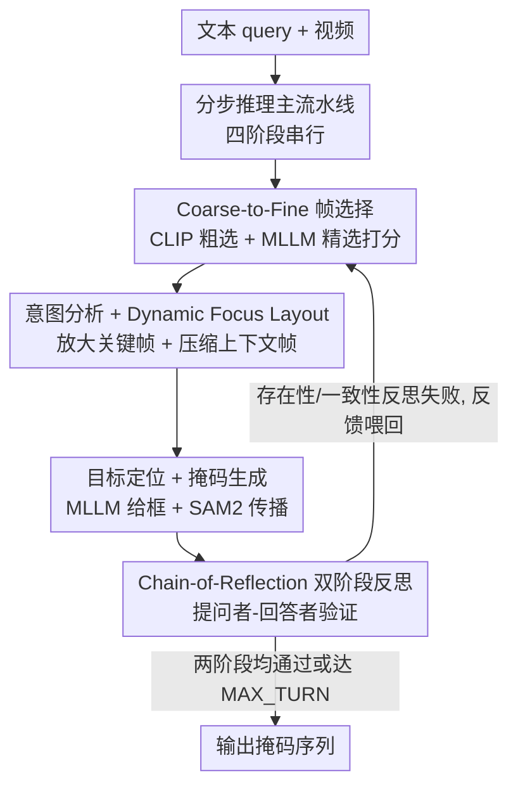

# Refer-Agent: A Collaborative Multi-Agent System with Reasoning and Reflection for Referring Video Object Segmentation

**会议**: CVPR 2026  
**论文**: [CVF Open Access](https://openaccess.thecvf.com/content/CVPR2026/html/Jiang_Refer-Agent_A_Collaborative_Multi-Agent_System_with_Reasoning_and_Reflection_for_CVPR_2026_paper.html)  
**代码**: 待确认  
**领域**: Agent / 视频理解  
**关键词**: 指代视频目标分割, 零样本, 多智能体, 推理-反思, 帧选择

## 一句话总结
Refer-Agent 把指代视频目标分割（RVOS）拆成「帧选择→意图分析→目标定位→掩码生成」的分步推理流水线，再叠一层由提问者-回答者构成的双阶段 Chain-of-Reflection（存在性反思 + 一致性反思）在推理与反思之间交替自纠，从而在完全免训练、仅用 9B 开源 MLLM 的条件下，于 5 个 RVOS 基准上同时超过 SFT 方法和接入 GPT-4o 的零样本方法。

## 研究背景与动机
**领域现状**：指代视频目标分割（RVOS）要根据一句文本把视频里被指代的目标整段分割出来。当前主流是把多模态大模型（MLLM）接进 RVOS 流水线——定制一组可学习的语义嵌入，把 MLLM 和分割基础模型（SAM/SAM2）桥接起来端到端联合训练。

**现有痛点**：这种 SFT 范式有两个硬伤。其一，MLLM 和分割模型都「吃数据」，要从多源收集大量数据、耗大量算力做大规模监督微调；而 MLLM 正快速迭代、新架构频出，每出一个新模型就重做一遍高成本 SFT，既低效又不现实。其二，近期的零样本方法虽免训练、灵活，但只是把 MLLM、grounding 模型、分割模型串成一条「直线工作流」，每个 worker 只盯自己那步、没有自纠机制，错误会沿管线累积放大；加上 MLLM 本身爱幻觉，面对复杂 query 和复杂场景常「自信地答错」。

**核心矛盾**：SFT 路精度高但跟不上 MLLM 的演化节奏；零样本路灵活免训练但因「直线工作流 + 无自纠 + MLLM 幻觉」性能远落后于 SFT，实用价值受限。要的是一个**免训练、可扩展、又能逼近甚至超过 SFT 精度**的范式。

**本文目标**：设计一个有效的「免训练多模型协作机制」，既能分步推理复杂 query，又能在过程中发现并纠正幻觉与错误累积。

**切入角度**：作者观察到零样本方法之所以差，根子在「一次过、不回头」。如果给协作流水线加一个能「回头验证中间结果、把反馈喂回去重做」的反思回路，就能在不微调任何参数的前提下压住幻觉。

**核心 idea**：用「推理-反思交替」的多智能体系统——主流水线分步推理，Chain-of-Reflection 用提问-回答对验证并反馈，多轮迭代直到通过验证或达上限。

## 方法详解

### 整体框架
给定文本 query $x_q$ 和视频 $x_v=\{f_t\}_{t=1}^{T}$，目标是输出被指代目标在整段视频上的掩码序列。Refer-Agent 由两部分耦合而成：一条**分步推理主流水线**（帧选择→意图分析→目标定位→掩码生成）负责一步步把目标推理出来并分割；一套**双阶段 Chain-of-Reflection** 并行地捕捉潜在幻觉、迭代精修中间预测。系统在「推理」和「反思」之间交替——反思若失败就把反馈喂回主流水线重做对应阶段——直到两阶段验证都通过、或达到最大反思轮数 MAX_TURN（默认 4）。

### 关键设计

**1. 分步推理主流水线：把 RVOS 拆成四个可控阶段**

把「一句话→整段掩码」直接交给一个模型，复杂 query 下容易满盘皆错且无从定位问题。Refer-Agent 用一链智能体顺序执行四步：帧选择（从原始密集视频里采出代表帧，因为在密帧上推理既贵又噪）、意图分析（把模糊 query 转成判别性表达，如把「正在欣赏音乐的人」落成「穿蓝衣的男人」）、目标定位（MLLM 对每个目标在关键帧上给出 bounding box 坐标）、掩码生成（把框和关键帧作为初始 prompt 喂给 SAM2，生成精确掩码并沿整段视频传播）。分阶段后，每一步的产物都成为可被反思机制单独审视、单独纠正的对象。

**2. Coarse-to-Fine 文本引导帧选择：先粗筛多样性，再精排相关性**

以往单遍采样要么均匀采、要么只看 query，帧的多样性和文本相关性难两全。本文分两步：先用 CLIP 算 query 与每帧的语义相似度 $S_{\text{CLIP}}$，把视频切成 $N$ 段、每段取最高分帧，粗选出 $N$ 个代表帧（$N \gg K$）；再把这 $N$ 帧连同 query 喂 MLLM，让它为每帧打重要性分，最终按
$$S_t = \alpha \cdot S^t_{\text{CLIP}} + \beta \cdot S^t_{\text{MLLM}}$$
选 top-$K$ 帧（实现里 $N=10, K=5, \alpha=0.3, \beta=0.7$）。这样兼顾了 CLIP 的多样性覆盖和 MLLM 的语义判别。作者也坦承：只靠原始 query 选帧在复杂推理场景仍不稳（如 query「谁把女孩弄哭了」会优先选哭泣的女孩、而非肇事者），所以才需要后续反思机制多轮修正帧选择。

**3. Dynamic Focus Layout：放大关键帧、压缩上下文帧**

意图分析阶段若只在单个关键帧上推理会缺时序上下文，若把所有采样帧平等塞给 MLLM 又算力浪费、且帧多会分散 MLLM 注意力诱发幻觉。Dynamic Focus Layout 动态地给关键帧（得分最高的帧）分配一块更大、更高分辨率的区域，把其余上下文帧压成更小、低分辨率的格子拼进同一张图。版式模板由关键帧索引决定：若关键帧索引为偶数，则额外从原视频采两帧以维持网格平衡。这张合成图连同 query 喂给 MLLM，让它在保留时序信息的同时聚焦关键帧，为每个预测目标生成表达。

**4. Chain-of-Reflection：双阶段「提问者-回答者」自纠**

主流水线虽能分步推理，但 MLLM 幻觉会让初始错误（如次优帧选择、错误推理）沿管线传播放大，且缺乏自纠机制。CoR 引入两阶段反思，每阶段都由一对提问者（Questioner）和回答者（Responder）生成一串问答链来验证中间结果、定位错误、给出下一轮的指导性反馈：

- **存在性反思（Stage 1）**：审视所选帧质量。提问者从可见性（目标在关键帧里是否清晰）、完整性（关键帧是否覆盖所有指代目标）、最优性（上下文帧里有没有更好的关键帧）三方面发问；回答者据 query 和已生成表达重新评估，若验证失败就把反思链反馈给帧选择智能体（如「目标白色轿车在关键帧被遮挡」→ 去找目标更清晰的新关键帧），确保后续推理建立在高质量视觉证据上。
- **一致性反思（Stage 2）**：验证预测目标与原始 query 是否一致。提问者把 query 拆成属性集，生成涵盖高层概念（类别、状态）和低层细节（外观、形状、空间位置）的多选题；回答者看着用 bounding box 高亮预测目标的关键帧逐题作答并解释，比对一致性后汇总报告反馈回去（如 query 说蓝色而预测成红色，意图推理智能体就能意识到颜色属性被忽略并在下一轮修正）。多目标情形下，若超过 30% 的预测目标不一致则判该轮验证失败。

整套机制让系统在推理与反思之间交替，逐轮逼近鲁棒、准确的分割结果。

### 一个完整示例
以 query「视频里哪种脊椎动物是卵生且体表覆盖羽毛？」为例：帧选择先采出若干帧，意图分析在关键帧上推出候选「蓝色笼中一只鸟、绿色笼中一只鸟」。**存在性反思**发问「当前关键帧是不是所有帧里最好的？」——回答者反思发现当前关键帧只显示两只鸟，但视频实际有三只、其中两只在绿笼里重叠，于是判定当前关键帧非最优、存在更好的帧，反馈回去触发重新选帧。重新推理后再进入**一致性反思**核对目标属性是否对得上 query（卵生 + 体表羽毛），全部通过后才输出最终掩码。这个例子展示了反思如何把「选错帧→推错目标」的错误链在中途拦截并纠正。

## 实验关键数据

### 主实验
在 5 个 RVOS 基准上评测（ReVOS、Ref-YouTube-VOS、MeViS、ReasonVOS、GroundMoRe），指标用区域相似度 $\mathcal{J}$、轮廓精度 $\mathcal{F}$ 及二者均值 $\mathcal{J\&F}$。MLLM 用 Ovis2.5-9B、分割用 SAM2，全程免训练，仅需 8 张 3090。

| 方法 | 类型 | Ref-YT-VOS | MeViS | ReasonVOS | ReVOS | GroundMoRe |
|------|------|-----------|-------|-----------|-------|-----------|
| GLUS | SFT | 67.3 | 51.3 | 49.9 | 54.9 | — |
| RGA3 | SFT | 68.5 | 50.1 | 53.6 | 58.0 | — |
| VRS-HQ | SFT | 71.0 | 50.9 | — | 60.0 | — |
| AL-Ref-SAM2 | 零样本(GPT-4) | 67.9 | 42.8 | — | — | — |
| CoT-RVS | 零样本(GPT-4o) | — | 52.2 | 65.5 | 55.9 | — |
| **Refer-Agent** | 零样本(Ovis2.5-9B) | **71.3** | **54.7** | **69.8** | **61.3** | **33.4** |

（数值为 $\mathcal{J\&F}$。）免训练的 Refer-Agent 在 5 个基准上全面登顶：在挑战性的推理数据集 ReasonVOS、ReVOS 上分别比最强 SFT 方法高 16.2% 和 1.3%；相比接入 GPT-4o 的零样本 CoT-RVS，在 ReVOS、ReasonVOS 上分别高 5.4%、4.3% $\mathcal{J\&F}$；在重运动/时序理解的 MeViS、GroundMoRe 上也分别领先 2.5%、6.2%。

### 消融实验
| 配置 | $\mathcal{J\&F}$ | $\mathcal{J}$ | $\mathcal{F}$ | 说明 |
|------|------|------|------|------|
| Refer-Agent (full) | 69.8 | 67.0 | 72.7 | ReasonVOS 完整模型 |
| w/o Stage1（存在性反思） | 66.6 | 63.7 | 69.5 | 掉 3.2 |
| w/o Stage2（一致性反思） | 65.2 | 62.4 | 68.1 | 掉 4.6 |
| w/o Stage1 & Stage2 | 64.5 | 61.8 | 67.2 | 仅主流水线，掉 5.3 |

意图分析的视觉输入策略对比：单关键帧 67.0、均匀整合 67.7、本文 Dynamic Focus Layout 69.8（均为 $\mathcal{J\&F}$），印证「放大关键帧 + 保留上下文」优于两种朴素做法。

### 关键发现
- **两阶段反思都不可或缺**：去掉任一阶段都掉 3% 以上 $\mathcal{J\&F}$，去掉一致性反思（Stage2）比去掉存在性反思（Stage1）掉得更多（65.2 vs 66.6），两者全去掉最差（64.5），说明自纠机制是逼近/超越 SFT 的关键。
- **反思轮数有甜点**：MAX_TURN 从 0→2→4 单调提升（64.5→66.3→69.8），但到 6 反而略降（69.3）并增加耗时（212s/样本 vs 4 轮的 195s），说明过多反思边际收益转负，4 轮是精度-效率平衡点。
- **强即插即用性**：换 MLLM 无需任何训练即可受益——把同款 Qwen2.5-VL-7B 接进 Refer-Agent 比 SFT 的 RGA3 高（55.5 vs 53.6 $\mathcal{J\&F}$）；换更强的 Qwen3-VL-8B-T、Ovis2.5-9B 进一步到 69.1、69.8，验证了「免训练、可随 MLLM 演化升级」的核心卖点。

## 亮点与洞察
- **用「反思回路」替代「SFT 数据」**是最核心的洞察：零样本 RVOS 的瓶颈不在模型能力而在「一次过不回头」的工作流，给它加上能验证中间结果、把反馈喂回去的闭环，就能在零参数更新下压住 MLLM 幻觉、逼近甚至反超 SFT。
- **把幻觉拆成两类分别治**：存在性反思治「证据层」幻觉（帧选错），一致性反思治「语义层」幻觉（属性对不上），用「提问者出多选题、回答者看图作答」的形式把抽象的「自我验证」落成可执行的问答链，很具象。
- **Dynamic Focus Layout** 是个轻巧 trick：用一张拼图同时承载「聚焦关键帧」和「保留时序上下文」，避免了单帧缺上下文、多帧分散注意力两难，可迁移到任何「需要 MLLM 在关键帧+上下文间权衡」的视频任务。
- **免训练 + 即插即用**让方法天然跟得上 MLLM 演化节奏——这正是 SFT 范式做不到的，工程价值明确。

## 局限与展望
- 强依赖底层 MLLM 的零样本能力：换更弱模型（Qwen2.5-VL-7B）时绝对精度明显下降，系统上限被 MLLM 的 grounding/推理能力锁死。
- 多轮反思带来推理时延：4 轮约 195s/样本，反思轮数增加耗时上升，在线/实时场景受限。
- 反思的判定规则带人工先验（如一致性反思 30% 不一致即判失败、MAX_TURN=4、$\alpha/\beta$ 取值），跨数据集是否需重调、鲁棒性如何，论文未充分展开。
- 在 GroundMoRe 这类强运动数据集上绝对分仍偏低（33.4），复杂运动/长时序场景的天花板尚未触顶。

## 相关工作与启发
- **vs SFT 路（GLUS / RGA3 / VRS-HQ / Sa2VA）**：它们靠大规模监督微调把 MLLM 和 SAM 桥接，精度高但吃数据、跟不上 MLLM 迭代；本文完全免训练、可随新 MLLM 即插即用，且在 5 个基准上反超它们。
- **vs 零样本路（AL-Ref-SAM2 / CoT-RVS）**：它们只把 MLLM+grounding+分割串成直线工作流、无自纠，性能落后 SFT；本文加上推理-反思交替的 CoR 闭环，零样本下大幅领先（如 ReVOS 上比 GPT-4o 版 CoT-RVS 高 5.4%）。
- **vs 视觉 Agent 路（LVAgent 等长视频理解的多 agent 协作）**：本文把 agent 协作专门用于「跨模态推理 + 反思纠错」的 RVOS，提出的 Chain-of-Reflection 对缓解 MLLM 幻觉和错误累积有通用借鉴意义。

## 评分
- 新颖性: ⭐⭐⭐⭐ 「分步推理 + 双阶段反思」用于免训练 RVOS 较新颖，CoR 把幻觉分两类治理是亮点；但多 agent + 反思的大框架在其他任务已有探索。
- 实验充分度: ⭐⭐⭐⭐⭐ 覆盖 5 个基准、消融到 CoR 两阶段/视觉输入策略/反思轮数/不同 MLLM，论证扎实。
- 写作质量: ⭐⭐⭐⭐ 动机和机制讲得清楚，配有概览图和反思示例。
- 价值: ⭐⭐⭐⭐⭐ 免训练即插即用、零样本反超 SFT，对快速演化的 MLLM 生态有很强实用价值。

<!-- RELATED:START -->

## 相关论文

- [\[CVPR 2026\] Symphony: A Cognitively-Inspired Multi-Agent System for Long-Video Understanding](symphony_a_cognitively-inspired_multi-agent_system_for_long-video_understanding.md)
- [\[CVPR 2026\] SciEducator: Scientific Video Understanding and Educating via Deming-Cycle Multi-Agent System](scieducator_scientific_video_understanding_and_educating_via_deming-cycle_multi-.md)
- [\[CVPR 2026\] Paper2Figure: A Multi-Agent Collaborative System for Figure Generation Towards Academic Research Paper](paper2figure_a_multi-agent_collaborative_system_for_figure_generation_towards_ac.md)
- [\[AAAI 2026\] COACH: Collaborative Agents for Contextual Highlighting -- A Multi-Agent Framework for Sports Video Analysis](../../AAAI2026/multi_agent/coach_collaborative_agents_for_contextual_highlighting_--_a_multi-agent_framewor.md)
- [\[CVPR 2026\] AgentDet: A Shared-Blackboard Multi-Agent Framework for Zero-/Few-Shot Object Detection](agentdet_a_shared-blackboard_multi-agent_framework_for_zero-few-shot_object_dete.md)

<!-- RELATED:END -->
