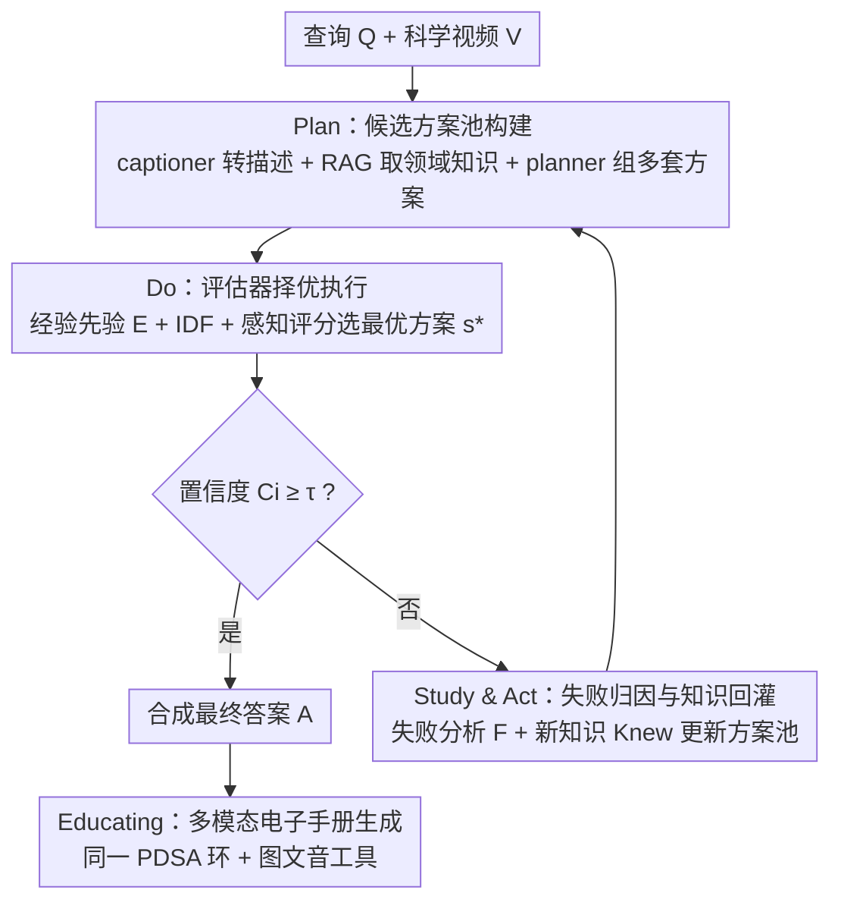

# SciEducator: Scientific Video Understanding and Educating via Deming-Cycle Multi-Agent System

**会议**: CVPR 2026  
**论文**: [CVF Open Access](https://openaccess.thecvf.com/content/CVPR2026/html/Xu_SciEducator_Scientific_Video_Understanding_and_Educating_via_Deming-Cycle_Multi-Agent_System_CVPR_2026_paper.html)  
**代码**: 待确认（论文称将开源）  
**领域**: Agent / 视频理解 / 多模态VLM  
**关键词**: 多智能体系统, 科学视频理解, 戴明环PDSA, 自进化工作流, 科教内容生成

## 一句话总结
SciEducator 把管理学里的戴明环（Plan–Do–Study–Act）改造成一个会自我进化的多智能体闭环，让系统反复"规划—执行—复盘—改进"地读懂科学实验视频，并进一步生成图文音并茂的儿童科普电子手册，在自建的 SciVBench 上大幅超过 GPT-4o、Gemini 等闭源 MLLM 和现有视频 Agent。

## 研究背景与动机
**领域现状**：通用多模态大模型（MLLM）和视频 Agent 系统已经能较好地完成日常视频的感知、理解和问答，靠的是视觉编码器 + 大语言模型 + 时序建模的组合。

**现有痛点**：一旦切到"科学视频理解"这种需要**外部专业知识**和**严格分步推理**的场景，现有方法就力不从心。纯 MLLM 调用外部工具、整合外部资源的能力不足，容易幻觉、能力不稳定；现有 Agent 系统对科学任务往往一开始就给不出可行的方案，而且**缺少根据上一轮执行结果自我进化、自我优化工作流的系统机制**——错了就是错了，无法从失败里学习。

**核心矛盾**：科学视频理解的本质是"高确定性 + 多步推理"，但 LLM 的一次性规划是"低确定性 + 易跑偏"。如果只做一次 planning 就执行到底，任何一步偏差都会被放大；而要纠偏，就必须有一个能感知"这次答得好不好"并据此重新规划的反馈回路。

**本文目标**：构建一个既能读懂复杂科学实验视频、又能把理解结果转化为可复现科普材料的多智能体系统，且这个系统要能在多轮迭代中自我修正。

**切入角度**：作者从管理学的**戴明环（Deming Cycle / PDSA）**找灵感——这是一个为"持续质量改进"而生的闭环哲学，天然契合"反复试错逼近高置信答案"的需求。

**核心 idea**：把 PDSA 的"计划—执行—研究—处理"重写成一套多智能体的自进化推理与反馈机制，用置信度驱动循环，用失败归因和新知识不断更新候选方案池。

## 方法详解

### 整体框架
系统 $S$ 接收用户查询 $Q$ 和科学视频 $V$，目标是给出自洽答案 $A=S(Q,V;P,E,T)$，其中规划器 $P$ 和评估器 $E$ 是 PDSA 环里的主角，$T$ 是按阶段动态配置的工具/智能体集合。整个系统共 16 个专用组件（10 个 agent + 6 个 tool），分"动态调用"（任务规划、内容获取、网络/文献检索等）和"固定执行"（知识库维护、多模态合成、手册生成）两类。

工作分两大阶段。**理解阶段**跑一个 PDSA 闭环：Plan 阶段用 captioner 把视频（1 fps 采样）转成带时序的描述 $V_{content}$、再用检索增强 agent 从内部语料抽实体关键词并取回领域知识 $K$，planner 据此组出一个**候选方案池** $M_i$；Do 阶段由评估器给每套方案打分、选出最优 $s^*$ 执行得到结果 $R_i$，并估计置信度 $C_i$；若 $C_i$ 够高就直接合成答案，否则进入 Study 阶段做失败归因 $F_i$ 并补充新知识，再由 Act 阶段重建方案池 $M_{i+1}$，循环直到 $C_i\ge\tau$ 或达到最大轮数。**教育阶段**复用同一套 PDSA 环（换一套工具、且不需视频输入），把理解到的科学现象转成儿童友好的多模态电子手册。

### 关键设计

**1. PDSA 自进化闭环：把"一次规划到底"换成"置信度驱动的反复纠偏"**

针对"LLM 一次规划易跑偏、错了无法学习"的痛点，作者把戴明环实例化成一个闭环控制器。每一轮的 Do 阶段在拿到执行结果 $R_i$ 后，planner 会基于查询、视频上下文和已执行方案估计一个置信度 $C_i=P(R_i,Q,V)$，它代表"现有证据是否足以给出令人信服的答案"。$C_i$ 高就停下来合成答案，低就继续转 Study/Act。这套机制的关键在于它把"要不要再想一轮"交给系统自己判断，而不是固定跑 N 步——简单题早停省 token，难题多转几轮逼近正确答案。消融显示最大轮数从 1 升到 5，物理/化学/日常三类任务的相关性和准确率都单调上升，证明迭代确实在累积理解而非空转。

**2. 候选方案池 + 评估器择优：用"经验先验 + IDF + 感知评分"挑出性价比最高的方案**

针对"科学任务初始方案常常不可行"的痛点，作者不让 planner 只生成一套方案，而是组成一个**方案池** $M_i$，再由评估器从时间/token 效率、成功概率、可行性、整体表现等维度综合择优。打分由两部分构成：客观项 $A_{obj}$ 依赖一个经验先验 $E$（对每个工具/agent 发 20 次随机探针调用，统计平均延迟、平均 token 用量、成功率），加上用 IDF 衡量方案关键词的判别力——$\text{IDF}(k)=\log\!\big(N/(f(k)+1)\big)$，$N$ 是语料规模（内部用 84 篇物理化学文档），$f(k)$ 是含词 $k$ 的文档数，越罕见越能检索到判别性知识；主观项 $A_{percep}$ 由 LLM 从覆盖度、逻辑连贯、科学严谨、清晰度评判。最终 $s^*=\arg\max_{s\in M_i}\big(A_{obj}(s;E,\text{IDF})+\lambda A_{percep}(s)\big)$。消融（Tab. 4）显示去掉经验先验 $E$、IDF 或感知评分 $A_{percep}$ 都会让平均时间、token、执行轮数上升而准确率下降，说明三件套各自在"少花资源、选对方案"上有贡献。

**3. Study & Act 失败归因与知识回灌：让系统"从失败里学到东西"再重规划**

针对"错了无法学习"的痛点，当置信度不足时系统进入 Study 阶段：planner 诊断这一轮为什么答不好（工具失败、检索过宽不相关、视频描述细节不足等），产出失败分析 $F_i$，并把本轮发现的有用证据并入知识库，$F_i,K_{i+1}=P(R_i,K_i,Q,V,T_{Study})$，其中 $K_{i+1}=K_i\cup K_{new}$。随后 Act 阶段在 $F_i,K_{i+1}$ 指导下重建下一轮方案池 $M_{i+1}=\Gamma_{Act}(F_i,K_{i+1},M_i)$——具体动作包括对模糊帧做超分、对漏掉的动作提高 captioning 帧率、用更具体的实体细化检索 query。注意领域知识 $K$ 只在第一轮检索一次，之后全靠 Study 阶段增量更新。消融（Tab. 5）很说明问题：同时去掉新知识 $K_{new}$ 和失败分析 $F$ 后，物理准确率从 65.31 掉到 45.94，证明"复盘 + 补知识"才是方案池质量提升的核心。

**4. 多模态电子手册生成：把"读懂"延伸成"教会"**

理解阶段识别出视频里的科学现象及原理后，教育阶段触发一条多模态检索-生成流水线，产出面向儿童的电子手册，包含：实验指导、带购买链接的器材清单、配图的分步流程、含语音提示的安全须知、原理小结。它用同一套 PDSA 环（输入只剩 query，置信度改成对相关性/教学质量/吸引力/教育价值四个属性评估），由实体识别 agent 抽关键实体，再用流程检索、安全提醒 agent 取回步骤与注意事项；器材检索工具返回器材图片和购买链接，插图生成工具产出分步指导图，语音合成工具生成音频，最后由手册生成 agent 把文字、图片、音频、超链接和版式整合成儿童科普读物风格的成品。

## 实验关键数据

### 主实验
评测基准 **SciVBench**：作者从主流视频平台和科教网站收集 54 个物理实验、54 个化学实验、103 个日常现象视频，由领域专家交叉验证写出 500 条科学问答对（物理/化学/日常各 160/148/192），分术语、原理、预测、读图、设计五类。输入只用视频画面（去掉字幕和旁白），保证答案必须靠看懂视频才能得出。理解侧用两个指标，均由 Qwen3-Max 当裁判并取 0/0.5/1 三档后平均（表中以百分数呈现，省略 %）：**Rel（Relevance，相关性）** 衡量答案是否切题、不给误导信息；**Acc（Accuracy，准确率）** 衡量答案与参考答案的语义正确度。

| 模型 | 物理 Rel | 物理 Acc | 化学 Rel | 化学 Acc | 日常 Rel | 日常 Acc |
|------|------|------|------|------|------|------|
| GPT-4o（闭源 API） | 47.50 | 34.69 | 39.86 | 31.42 | 30.73 | 27.86 |
| Gemini 2.0 Flash（闭源 API） | 52.81 | 38.75 | 46.96 | 36.15 | 34.64 | 31.25 |
| Claude 3.7 Sonnet（闭源 API） | 44.06 | 31.88 | 40.20 | 31.76 | 31.77 | 28.65 |
| VideoAgent（MAS） | 49.06 | 36.56 | 45.61 | 34.80 | 30.47 | 27.34 |
| videoagent（MAS） | 46.25 | 35.31 | 46.62 | 37.16 | 31.51 | 28.13 |
| **SciEducator（本文）** | **81.88** | **65.31** | **73.97** | **64.86** | **64.58** | **62.24** |

理解任务上 SciEducator 三类全面领先，准确率比最强基线高出约 26–30 个百分点。教育侧（Tab. 2）则用 **win rate（胜率 %）** 评：把所有模型回复匿名喂给 VLM 裁判，每个指标选出最佳回复并统计胜率，指标含 Relevance、**IQ（Instructional Quality，教学质量：细致度/完整度/清晰度/安全提示）**、Attractiveness（吸引力）、**EV（Educational Value，教育价值：能否激发科学兴趣并讲清原理）**。

| 模型 | Relevance | IQ | Attractiveness | EV |
|------|------|------|------|------|
| Gemini 2.0 Flash | 10.00 | 2.50 | 0.00 | 5.00 |
| GPT-4o | 7.50 | 5.00 | 2.50 | 7.50 |
| Claude 3.7 Sonnet | 5.00 | 5.00 | 0.00 | 5.00 |
| **SciEducator（本文）** | **77.50** | **87.50** | **97.50** | **82.50** |

### 消融实验
评估器各元素消融（Tab. 4，时间/token 以完整版归一为 1.00；500 条 QA，最大 5 轮）：

| 配置 | 时间↓ | Token↓ | 平均轮数↓ | Acc↑ |
|------|------|------|------|------|
| EA w/o E（去经验先验） | 1.20 | 1.18 | 4.09 | 57.50 |
| EA w/o IDF | 1.08 | 1.06 | 3.99 | 59.90 |
| EA w/o $A_{percep}$（去感知评分） | 1.14 | 1.13 | 4.17 | 54.50 |
| **EA（完整）** | **1.00** | **1.00** | **3.79** | **64.00** |

Study 阶段新知识 $K_{new}$ 与失败分析 $F$ 消融（Tab. 5）：

| 配置 | 物理 Rel | 物理 Acc | 化学 Rel | 化学 Acc | 日常 Rel | 日常 Acc |
|------|------|------|------|------|------|------|
| w/o $K_{new}$ & $F$ | 59.69 | 45.94 | 53.04 | 45.27 | 35.94 | 32.55 |
| w/o $K_{new}$ | 65.94 | 50.94 | 61.82 | 54.05 | 38.28 | 34.64 |
| w/o $F$ | 71.56 | 55.63 | 66.55 | 57.09 | 48.95 | 45.83 |
| **完整** | **81.88** | **65.31** | **73.97** | **64.86** | **64.58** | **62.24** |

### 关键发现
- **PDSA 迭代是最大功臣**：最大轮数从 1 增到 5，三类任务的 Rel/Acc 单调上升；教育侧 1→5 轮时 IQ 胜率从 0 涨到 92.50，证明循环不是空转而是真的在累积理解。
- **失败分析 $F$ 比新知识 $K_{new}$ 更关键**：同时去掉两者物理准确率掉到 45.94，仅去 $K_{new}$ 还有 50.94、仅去 $F$ 有 55.63——说明"先归因为什么错"对重建方案池的价值最高。
- **评估器三件套各有分工**：去掉经验先验 $E$ 让平均轮数从 3.79 升到 4.09、准确率跌到 57.50，说明对资源代价的先验估计能帮系统少走弯路。

## 亮点与洞察
- **跨学科借力**：把管理学的戴明环 PDSA 整体搬进多智能体系统当"自进化引擎"，这种"用质量管理哲学组织 Agent 工作流"的思路新颖且可迁移到其它需要反复纠偏的 Agent 任务。
- **置信度驱动的自适应预算**：用 $C_i$ 决定停不停循环，等价于给系统一个"按题难度动态分配算力"的旋钮，简单题省、难题多想，比固定步数的 pipeline 更经济。
- **"读懂"到"教会"的闭环**：大多数视频理解工作止步于问答，本文把同一套 PDSA 复用到多模态科普手册生成，展示了科学视频理解的一个有应用价值的下游出口。
- **可迁移 trick**：用 20 次探针调用为每个工具建经验先验 $E$（延迟/token/成功率），是一种轻量的"工具画像"手段，可直接用在任何需要在多工具间做性价比择优的 Agent 框架里。

## 局限与展望
- **裁判依赖 LLM**：Rel/Acc/胜率全部由 Qwen3-Max、Qwen-VL-Plus 当裁判打 0/0.5/1 三档，评测本身受裁判模型偏差影响，绝对分数的可比性需谨慎看待。
- **基准规模有限**：SciVBench 仅 211 个视频、500 条 QA，教育评测更只在 40 个视频的子集上做；覆盖学科和现象多样性还较窄。
- **效率代价**：多智能体 + 多轮 PDSA + 16 个工具/agent 的编排意味着相比单次 MLLM 调用有明显的时间和 token 开销，论文也主要靠归一化比值而非绝对耗时来呈现。
- **改进方向**：把裁判换成多模型投票或引入人工校验、扩大基准学科覆盖、对 $\lambda$ 等权重与最大轮数做更系统的敏感性分析，都是值得补的点。

## 相关工作与启发
- **vs 通用 MLLM（GPT-4o / Gemini / Claude）**：它们一次前向直接作答，缺乏外部工具整合和分步纠错；本文用多智能体 + PDSA 闭环把外部知识检索和失败复盘纳入流程，科学问答准确率高出 26–30 个百分点。
- **vs VideoAgent 等多智能体系统**：现有 MAS 多用置信评估 + 一次性规划或线性流水线协作，对科学任务给不出可行初始方案、也不能从执行结果自我进化；本文的差异在于引入 Study/Act 的失败归因与知识回灌，让方案池逐轮变好。
- **vs PostAgent / 自动软件开发 Agent**：这些工作证明了 Agent 系统的应用潜力，但同样受幻觉和能力不稳影响；SciEducator 的贡献是给出一个**系统化的自优化机制**，把"持续改进"显式编码进工作流。

## 评分
- 新颖性: ⭐⭐⭐⭐⭐ 戴明环 PDSA × 多智能体自进化是一个少见且自洽的跨学科切入点，并配套首个科学现象视频基准。
- 实验充分度: ⭐⭐⭐⭐ 主实验 + 教育侧 + 四组消融较完整，但基准规模偏小、裁判全靠 LLM。
- 写作质量: ⭐⭐⭐⭐ 方法与 PDSA 映射讲得清楚，公式到位；部分组件细节下放到补充材料。
- 价值: ⭐⭐⭐⭐ 科学视频理解 + 科普生成是有现实意义的方向，自进化工作流的设计可迁移性强。

<!-- RELATED:START -->

## 相关论文

- [\[CVPR 2026\] Symphony: A Cognitively-Inspired Multi-Agent System for Long-Video Understanding](symphony_a_cognitively-inspired_multi-agent_system_for_long-video_understanding.md)
- [\[CVPR 2026\] Refer-Agent: A Collaborative Multi-Agent System with Reasoning and Reflection for Referring Video Object Segmentation](refer-agent_a_collaborative_multi-agent_system_with_reasoning_and_reflection_for.md)
- [\[CVPR 2026\] MOTOR-Bench: A Real-world Dataset and Multi-agent Framework for Zero-shot Human Mental State Understanding](motor-bench_a_real-world_dataset_and_multi-agent_framework_for_zero-shot_human_m.md)
- [\[CVPR 2026\] Paper2Figure: A Multi-Agent Collaborative System for Figure Generation Towards Academic Research Paper](paper2figure_a_multi-agent_collaborative_system_for_figure_generation_towards_ac.md)
- [\[CVPR 2026\] Visual Document Understanding and Reasoning: A Multi-Agent Collaboration Framework with Agent-Wise Adaptive Test-Time Scaling](visual_document_understanding_and_reasoning_a_multi-agent_collaboration_framewor.md)

<!-- RELATED:END -->
