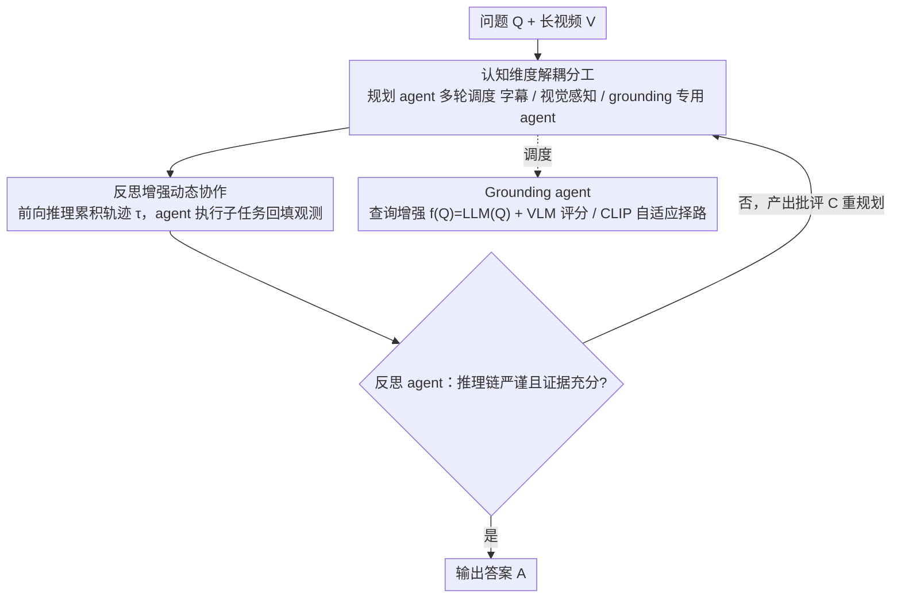

# Symphony: A Cognitively-Inspired Multi-Agent System for Long-Video Understanding

**会议**: CVPR 2026  
**论文**: [CVF Open Access](https://openaccess.thecvf.com/content/CVPR2026/html/Yan_Symphony_A_Cognitively-Inspired_Multi-Agent_System_for_Long-Video_Understanding_CVPR_2026_paper.html)  
**代码**: https://github.com/Haiyang0226/Symphony  
**领域**: Agent / 视频理解 / 多模态VLM  
**关键词**: 长视频理解, 多智能体系统, 认知能力解耦, 反思增强协作, 视频 grounding

## 一句话总结
Symphony 模仿人类认知把长视频理解拆给"按能力维度分工"的多个专用智能体（规划、反思、grounding、字幕、视觉感知），用一个 Actor-Critic 式的反思增强动态协作机制反复纠偏推理，并为复杂问题设计了一个会"先扩写查询再用 VLM 打分"的 grounding 智能体，在 LVBench、LongVideoBench、Video-MME、MLVU 四个基准上达到 SOTA，LVBench 比前最优高 5.0%。

## 研究背景与动机
**领域现状**：长视频理解（LVU）正在体育解说、智能监控、影片分析等场景越来越重要。当前主流是基于 MLLM 的 Agent：要么用 VLM 建视频数据库 + RAG 检索相关片段来对付长序列，要么靠 LLM 把任务分解、多步调工具去探索解空间。

**现有痛点**：两条路都有硬伤。RAG 路线难从复杂问题生成有效检索 query，且视频库噪声冗余多、检索易失准；任务分解路线把所有推理都压在核心 LLM 上，一旦任务复杂度超过模型推理能力，性能就急剧下滑、agent 甚至退化成"简单动作"而非深度推理。多智能体系统（MAS）虽有前景，但现有做法（如按模态切分的 VideoMultiAgents、靠固定团队线性投票的 LvAgent）要么跨模态信息交换成本高，要么用静态线性流水线、约束了解空间探索、突破不了单 agent 的能力上限。

**核心矛盾**：长视频"信息密度高、时间跨度长、问题多跳"，要求的是"分而治之 + 反复纠错"的推理；但简单的任务分解和协作机制并不足以支撑长链推理，而单纯靠 embedding 检索压缩时间上下文又会丢掉复杂问题的关键信息。

**本文目标**：设计一套能有效分解 LVU 子任务、并让 agent 之间动态协作纠偏的多智能体系统，同时解决"复杂问题难以精准定位相关片段"这个 grounding 难题。

**切入角度**：认知心理学把人类认知拆成感知、注意、推理、语言、决策等核心维度。作者据此提出**按能力维度（而非按模态）解耦**的 LVU 任务分解范式——能力维度切分能最小化 agent 间耦合、降低信息整合成本。

**核心 idea**：用一个中心化 MAS，把推理拆给认知维度对应的专用 agent，并用"反思增强的动态协作"和"会推理的 grounding agent"两件武器，把每个 agent 的认知负担降下来、把解空间探索撑起来。

## 方法详解

### 整体框架
Symphony 是一个中心化多智能体系统，按认知维度配置五个功能专用 agent：**规划 agent** 和**反思 agent** 共同负责推理与决策，**grounding agent** 模拟"注意"高亮关键视频片段，**字幕 agent** 处理文本字幕承担"语言"功能，**视觉感知 agent** 执行"感知"任务。相比按模态切分（模块间耦合紧、交互成本高），能力维度解耦能把认知负载分摊到低耦合的专用模块，缓解单体架构的容量过载。

运行时规划 agent 作为中央协调者：给定问题 $Q$ 和长视频 $V$，它做全局任务规划、多轮调度其它 agent、整合信息并最终作答。动作空间 $A=\{G,V,S\}$（grounding、视觉感知、字幕）。前向推理阶段，规划 agent 按当前状态输出下一个子任务 $a_t=\pi(S_t)$，$S_t=(Q,\tau_{t-1})$，$\tau_{t-1}=(a_1,o_1,\dots,a_{t-1},o_{t-1})$ 是历史轨迹，专用 agent 执行 $a_t$ 产生观测 $o_t$ 并更新状态，迭代到证据足够。随后反思 agent 处理终态 $S_T$：若推理链严谨、证据充分就终止；否则产出批评 $C=\phi(S_T)$ 并更新轨迹/状态，重新触发规划 agent 的前向推理，从而扩大 MAS 的探索空间。

### 关键设计

**1. 认知能力维度解耦的多智能体分工：按"能力"而非"模态"切分以降耦合**

针对"单 LLM 推理过载、按模态切分跨模态交互成本高"的痛点，作者借认知心理学把 LVU 拆成五个能力维度的 agent：规划（决策）、反思（决策/推理校验）、grounding（注意）、字幕（语言）、视觉感知（感知）。其中视觉感知 agent 内含三个工具——frame inspector、global summary、multi-segment analysis；字幕 agent 做实体识别、情感分析、主题建模。为什么有效：模态切分会让各 agent 孤立处理各自特征、难以建立深层跨模态交互，而能力维度切分让 agent 间依赖最小、信息整合成本最低，把"谁负责什么认知功能"划得很清楚，从而把单体模型的容量过载分摊掉。消融（Tab. 4）显示逐个加入字幕、视觉感知、反思 agent，LVBench 分数从 65.7 一路升到 71.8，证明每个能力维度的专用化都在贡献。

**2. 反思增强的动态协作机制：用独立"批评者"替代单 agent 自我纠错**

针对"线性静态流水线约束解空间探索、单 agent 自纠易过度自信"的痛点，作者借鉴 Actor-Critic 框架设计了反思增强的动态推理：规划 agent 是核心策略 $\pi$（Actor），负责生成子任务并动态构造解路径；反思 agent 是验证模型 $\phi$（Critic），对推理过程和最终结果做批判分析。其理论依据是 Verifier's Law——"验证一个解远比生成它容易"。整套协作由 Algorithm 1 形式化：内层循环让规划 agent 反复出动作、调 $\{G,V,S\}$ 执行、累积轨迹，直到 TERMINATE；外层由反思 agent 判定 $(C,\text{Valid})\leftarrow\phi(S_T)$，无效则把批评 $C$ 并入状态、再来一轮，最多 $M$ 次。为什么有效：独立的反思 agent 缓解了单 agent 自我纠错里常见的"过度自信"，把验证与生成解耦后能显著扩大探索空间、在难题上带来明显增益。消融显示去掉独立反思 agent（改让规划 agent 自反思）掉 2.5%。

**3. 会推理的 Grounding agent：先扩写查询、再用 VLM 打分，自适应在 VLM/CLIP 间择路**

针对"复杂问题用原始 query 做 CLIP 检索抓不住抽象概念和时序动作"的痛点，作者重做了 grounding。Grounding 的目标是从视频 $V$ 里挑出与 query 相关的片段集合 $S=\{s\,|\,\text{sim}(f(Q),s)\ge\theta\}$。复杂问题有两种典型形态：**问题歧义**（含模糊指代、抽象概念、无显式实体的高层动作）和**多跳推理**（要跨场景串联多段证据或推断隐含中间场景）。传统 CLIP 直接令 $f(Q)=Q$、$\text{sim}=\text{CLIP}(Q,s)$，对抽象概念（如"贿赂"）和时序（如"进城"）无能为力。作者两步改造：其一用 LLM 增强查询 $f(Q)=\text{LLM}(Q)$，借世界知识把模糊词实例化、把隐含逻辑线索显式补出；其二用 VLM 替代 CLIP 打分 $\text{sim}(f(Q),s)=\text{VLM}(f(Q),s)$，把视频切成不重叠片段、稀疏采样，VLM 按 1–4 分的相关性准则（4=核心要素可见、足以作答；3=部分证据；2=无显式线索、需多跳关联；1=无关）输出分数和理由，且并行执行降延迟。关键是 grounding agent 还**保留 CLIP 检索模块、按问题复杂度自主择路**——简单题走 CLIP 省算力，难题走 VLM 求精度。消融（Tab. 5）显示纯 CLIP 的 52.2 分提到 Qwen2.5VL-7B 的 68.6（+16.4%）、Seed1.6VL 的 71.8，且 VLM 路线在精度-效率间取得最优折中。

## 实验关键数据

### 主实验
四个 LVU 基准（LVBench 平均时长 68 分钟；LongVideoBench 取 Val；Video-MME 仅用 Long 子集；MLVU），指标均为准确率（Score %）。规划/反思 agent 用 DeepSeek R1，字幕 agent 用 DeepSeek V3，视觉感知/grounding agent 用 Doubao Seed 1.6 VL。

| 方法 | LVBench | LongVideoBench(Val) | Video-MME Long | MLVU |
|------|------|------|------|------|
| Gemini-1.5-Pro（商业 VLM） | 33.1 | 64.0 | 67.4 | - |
| GPT-4o | 48.9 | 66.7 | 65.3 | 54.9 |
| OpenAI o3 | 57.1 | 67.5 | 64.7 | - |
| Seed 1.6 VL*（开源 VLM） | 58.1 | 66.1 | 68.4 | 65.3 |
| Qwen2.5-VL-72B | 47.7 | 60.7 | 63.9 | 53.8 |
| DVD*（Agent） | 66.8 | 67.2 | 61.5 | - |
| VideoDeepResearch（VDR） | 55.5 | 70.6 | 76.3 | 64.5 |
| VideoChatA1 | - | 65.4 | 71.2 | 76.2 |
| **Symphony（本文）** | **71.8** | **77.1** | **78.1** | **81.0** |

（*为作者复现结果）Symphony 四个基准全面 SOTA：LVBench 比 DVD 高 5.0%，LongVideoBench 比 VDR 高 6.5%。LVBench 六个能力维度细分（Tab. 3）上，本文在实体识别 ER 70.0、事件理解 EU 69.4、关键信息检索 KIR 77.2、推理 Rea 69.4、摘要 Sum 72.5、整体 71.8，多数维度领先——作者归因于 grounding agent 提供丰富上下文线索（利好 EU/Sum）和多 agent 动态协作增强推理（利好 Rea）。

### 消融实验
逐个加入 agent（LVBench，Tab. 4）：

| 规划 | 字幕 | 视觉感知 | 反思 | Score(%) |
|------|------|------|------|------|
| ✓ | | | | 65.7 |
| ✓ | ✓ | | | 68.2 |
| ✓ | ✓ | ✓ | | 69.6 |
| ✓ | ✓ | ✓ | ✓ | **71.8** |

Grounding 策略消融（LVBench，Tab. 5；时间为单位秒）：

| Grounding 工具 | Score(%) | Time(s) |
|------|------|------|
| Caption-based（DVD 的 GPT-4.1 库） | 61.2 | 8.2*（不含建库） |
| CLIP-based | 52.2 | 33.7 |
| VLM = Qwen2.5VL-7B | 68.6 | 37.4 |
| VLM = Seed 1.6VL | **72.1** | 54.8 |

### 关键发现
- **每个能力维度 agent 都在贡献**：字幕 agent +2.5（65.7→68.2）、视觉感知 agent +1.4（68.2→69.6）、反思 agent +2.2（69.6→71.8）。把完整字幕直接塞给规划 agent 会撑爆上下文反而掉 1.4%，说明专用字幕 agent 的"先分析再回传"避免了上下文过载。
- **VLM grounding 是精度关键但有效率代价**：纯 CLIP 仅 52.2，换 Qwen2.5VL-7B 即 +16.4% 到 68.6 且耗时接近 CLIP；Seed1.6VL 精度最高（72.1）但耗时更长——故 grounding agent 按问题复杂度自适应择路以平衡精度与算力。
- **不是所有基准都通吃**：与 LvAgent 比投票策略（Tab. 7），Symphony 在 LVBench 71.8 vs 64.3 大幅领先，但在 LongVideoBench(77.1 vs 80.0)、Video-MME(78.1 vs 81.7)、MLVU(81.0 vs 83.9) 上反而低于 LvAgent，说明本文优势更体现在最难、最依赖深推理的 LVBench 上。⚠️ 不同基准难度与任务类型不同，分数不可直接横比。

## 亮点与洞察
- **认知维度解耦范式**："按能力切分而非按模态切分"是一个清晰且可迁移的多 agent 组织原则，最小化 agent 间耦合、降低信息整合成本，思路可直接用到其它复杂多模态推理任务。
- **Verifier's Law 落地**：用独立反思 agent 当 Critic、把"验证比生成容易"显式工程化，缓解单 agent 自纠的过度自信，是 Actor-Critic 思想在 LLM Agent 上的一个干净实现。
- **grounding 当成推理问题**：把"检索相关片段"从纯相似度匹配升级为"LLM 扩写查询 + VLM 带理由打分"，并保留 CLIP 做自适应择路，这种"难题用重武器、简单题用轻武器"的路由策略很务实。
- **可复用 trick**：1–4 分的片段相关性评分准则（含每档的判定依据和推理输出），是一种让 VLM 给出可解释 grounding 结果的轻量协议，可直接搬到其它视频检索/定位任务。

## 局限与展望
- **并非全面碾压**：在 LongVideoBench、Video-MME、MLVU 上低于 LvAgent 的投票策略，优势主要集中于 LVBench；方法在不同难度/任务分布上的稳健性还需打磨。
- **重模型依赖**：规划/反思用 DeepSeek R1、感知/grounding 用 Doubao Seed 1.6 VL，多 agent + 多轮调度（agent 调度轮数和单 agent 工具调用上限都设 15）意味着不小的推理成本与延迟。
- **效率代价显性**：VLM grounding 精度最高但最慢（Seed1.6VL 54.8s），自适应择路虽缓解但整体 pipeline 仍偏重。
- **改进方向**：把反思/投票机制与 LvAgent 的多 agent 投票结合、对采样 FPS 与片段间隔做更系统的精度-效率权衡（Tab. 6 已初探）、降低对闭源/大体量 VLM 的依赖，都是值得探索的点。

## 相关工作与启发
- **vs VideoMultiAgents**：它按模态（文本/视觉/图）切分 agent 但各自孤立处理特征、缺深层跨模态交互；本文按能力维度切分、最小化耦合，信息整合成本更低。
- **vs LvAgent**：它用预选固定团队做多轮讨论投票、但走静态线性流水线、约束解空间探索；本文用反思增强的动态协作，让规划 agent 按状态动态构造解路径、并由独立反思 agent 扩大探索。值得注意的是 LvAgent 的投票策略在三个较易基准上仍占优，二者各有所长。
- **vs DVD（单 agent + caption 库）**：DVD 建多粒度视频库、靠 caption-query 相似度，建库代价大且 caption 表示常有噪声；本文 grounding agent 用 VLM 带理由打分，LVBench 上比 DVD 高 5.0%。
- **vs VideoAgent / VideoChat-A1 等单 agent**：单 agent 在任务复杂度超过模型推理能力时会退化为简单动作、严重依赖昂贵闭源模型；本文用多 agent 分担认知负载 + 反思纠偏来突破单 agent 能力上限。

## 评分
- 新颖性: ⭐⭐⭐⭐ 认知维度解耦 + 反思增强协作 + 会推理的 grounding 三者组合扎实，但各单点（MAS、Actor-Critic、查询扩写）均有渊源。
- 实验充分度: ⭐⭐⭐⭐⭐ 四基准 + LVBench 维度细分 + 五组消融（agent/grounding 工具/采样/投票），并诚实给出在部分基准落后 LvAgent 的结果。
- 写作质量: ⭐⭐⭐⭐ 认知映射与算法形式化清晰，图示丰富；个别 agent 实现细节下放附录。
- 价值: ⭐⭐⭐⭐ 长视频理解是高需求方向，能力维度解耦与反思协作的设计对 Agent 社区有借鉴意义，且已开源。

<!-- RELATED:START -->

## 相关论文

- [\[CVPR 2026\] SciEducator: Scientific Video Understanding and Educating via Deming-Cycle Multi-Agent System](scieducator_scientific_video_understanding_and_educating_via_deming-cycle_multi-.md)
- [\[CVPR 2026\] Refer-Agent: A Collaborative Multi-Agent System with Reasoning and Reflection for Referring Video Object Segmentation](refer-agent_a_collaborative_multi-agent_system_with_reasoning_and_reflection_for.md)
- [\[ICLR 2026\] LH-Deception: Simulating and Understanding LLM Deceptive Behaviors in Long-Horizon Interactions](../../ICLR2026/multi_agent/lh-deception_simulating_and_understanding_llm_deceptive_behaviors_in_long-horizo.md)
- [\[CVPR 2026\] MOTOR-Bench: A Real-world Dataset and Multi-agent Framework for Zero-shot Human Mental State Understanding](motor-bench_a_real-world_dataset_and_multi-agent_framework_for_zero-shot_human_m.md)
- [\[CVPR 2026\] Paper2Figure: A Multi-Agent Collaborative System for Figure Generation Towards Academic Research Paper](paper2figure_a_multi-agent_collaborative_system_for_figure_generation_towards_ac.md)

<!-- RELATED:END -->
